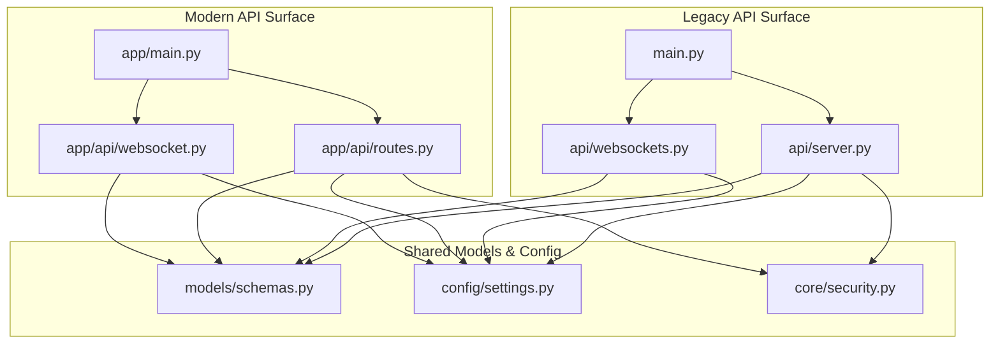
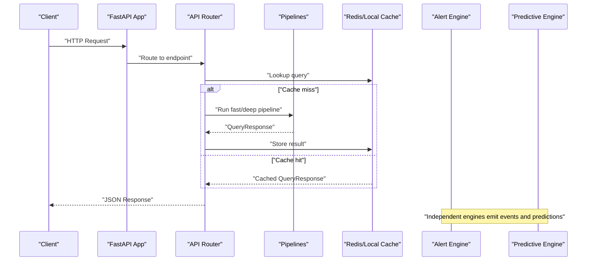
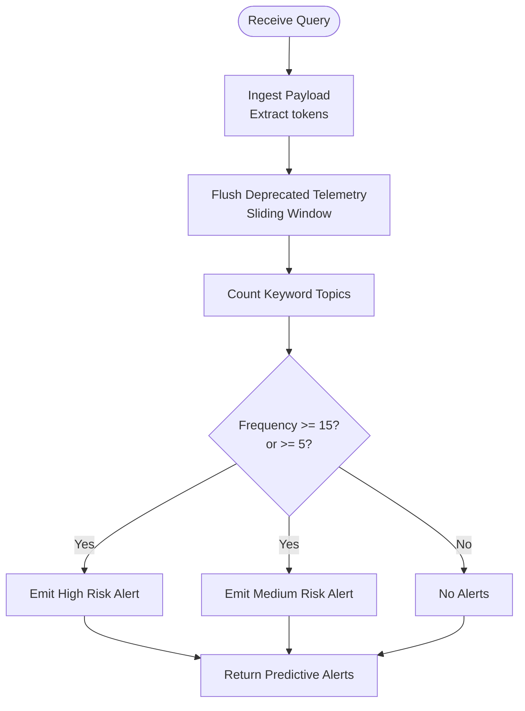
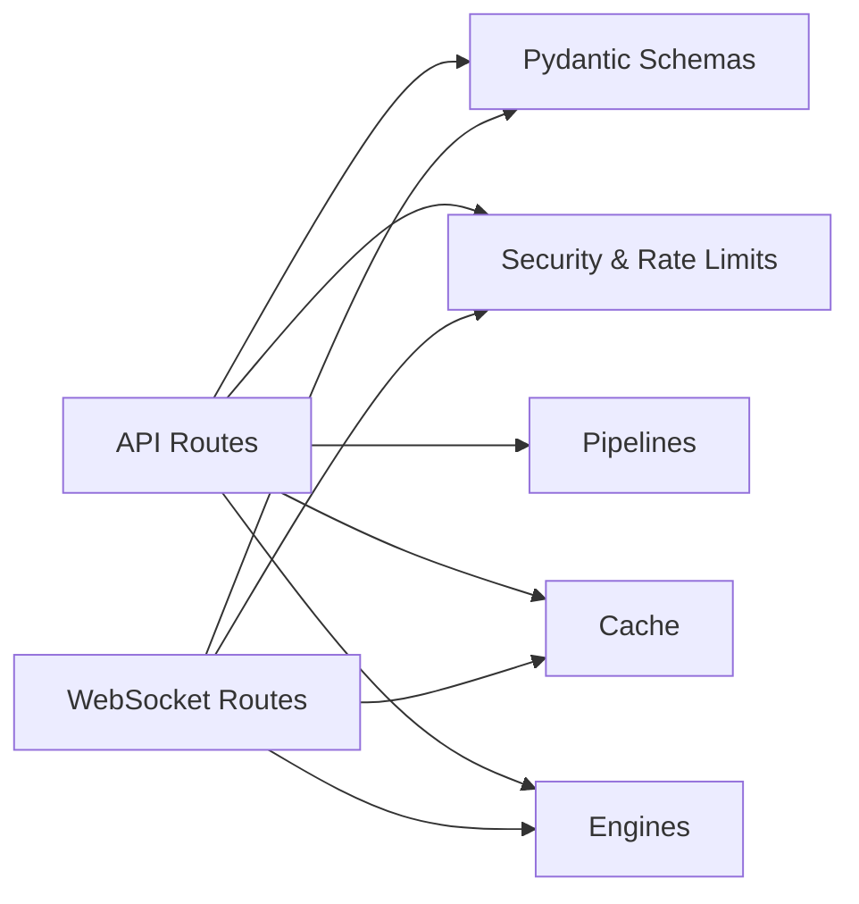

# API Reference

<cite>
**Referenced Files in This Document**
- [main.py](file://main.py)
- [app/main.py](file://app/main.py)
- [api/server.py](file://api/server.py)
- [api/websockets.py](file://api/websockets.py)
- [app/api/routes.py](file://app/api/routes.py)
- [app/api/websocket.py](file://app/api/websocket.py)
- [models/schemas.py](file://models/schemas.py)
- [config/settings.py](file://config/settings.py)
- [core/security.py](file://core/security.py)
- [core/alert_engine.py](file://core/alert_engine.py)
- [core/predictive_engine.py](file://core/predictive_engine.py)
- [feedback/feedback_service.py](file://feedback/feedback_service.py)
- [veritas-ai/README.md](file://veritas-ai/README.md)
</cite>

## Table of Contents
1. [Introduction](#introduction)
2. [Project Structure](#project-structure)
3. [Core Components](#core-components)
4. [Architecture Overview](#architecture-overview)
5. [Detailed Component Analysis](#detailed-component-analysis)
6. [Dependency Analysis](#dependency-analysis)
7. [Performance Considerations](#performance-considerations)
8. [Troubleshooting Guide](#troubleshooting-guide)
9. [Conclusion](#conclusion)
10. [Appendices](#appendices)

## Introduction
This document provides a comprehensive API reference for Veritas AI’s REST and WebSocket interfaces. It covers HTTP endpoints, WebSocket streams, request/response schemas, authentication, rate limiting, versioning, and security. It also includes guidance for client integration, common use cases, and performance optimization recommendations.

## Project Structure
Veritas AI exposes two primary API surfaces:
- Legacy API surface under the old module structure
- Clean, modern API surface under the new app module

Both define REST endpoints and WebSocket endpoints for real-time streaming. The new app module is the recommended entry point for production usage.

**Diagram sources**
- [main.py:121-122](file://main.py#L121-L122)
- [api/server.py:40](file://api/server.py#L40)
- [api/websockets.py:21](file://api/websockets.py#L21)
- [app/main.py:203-207](file://app/main.py#L203-L207)
- [app/api/routes.py:18](file://app/api/routes.py#L18)
- [app/api/websocket.py:19](file://app/api/websocket.py#L19)
- [models/schemas.py:1](file://models/schemas.py#L1)
- [config/settings.py:13](file://config/settings.py#L13)
- [core/security.py:12](file://core/security.py#L12)

**Section sources**
- [main.py:121-122](file://main.py#L121-L122)
- [app/main.py:203-207](file://app/main.py#L203-L207)

## Core Components
- REST API routers:
  - Legacy: api/server.py defines APIRouter with endpoints under the configured API prefix.
  - Modern: app/api/routes.py defines APIRouter with endpoints under /api/v1.
- WebSocket routers:
  - Legacy: api/websockets.py defines WebSocket endpoints for streaming and alerts.
  - Modern: app/api/websocket.py defines WebSocket endpoints for streaming and voice.
- Shared models and schemas:
  - Pydantic models define request/response shapes for all endpoints.
- Configuration:
  - Environment-driven settings for API prefixes, timeouts, cache sizes, and public URLs.
- Security:
  - API key header enforcement and in-memory rate-limiting per key.
- Analytics and feedback:
  - Predictive engine for misinformation trend detection.
  - Alert engine for global risk monitoring.
  - Feedback service for RLHF training loop.

**Section sources**
- [api/server.py:40](file://api/server.py#L40)
- [app/api/routes.py:18](file://app/api/routes.py#L18)
- [api/websockets.py:21](file://api/websockets.py#L21)
- [app/api/websocket.py:19](file://app/api/websocket.py#L19)
- [models/schemas.py:1](file://models/schemas.py#L1)
- [config/settings.py:13](file://config/settings.py#L13)
- [core/security.py:51](file://core/security.py#L51)
- [core/predictive_engine.py:5](file://core/predictive_engine.py#L5)
- [core/alert_engine.py:20](file://core/alert_engine.py#L20)
- [feedback/feedback_service.py:15](file://feedback/feedback_service.py#L15)

## Architecture Overview
The API architecture supports:
- REST endpoints for synchronous verification, alerts, trends, feedback, and administrative tasks.
- WebSocket endpoints for real-time streaming of analysis progress and voice-enabled workflows.
- Centralized rate limiting and authentication enforcement.
- Predictive analytics and alerting for global risk monitoring.

**Diagram sources**
- [api/server.py:53](file://api/server.py#L53)
- [app/api/routes.py:46](file://app/api/routes.py#L46)
- [api/websockets.py:143](file://api/websockets.py#L143)
- [app/api/websocket.py:104](file://app/api/websocket.py#L104)

## Detailed Component Analysis

### REST Endpoints

#### Authentication and Headers
- Header: X-API-KEY
- Behavior:
  - Enforced for most public developer endpoints.
  - Some internal endpoints may not require authentication.
  - API key validation includes basic per-key rate limiting.

**Section sources**
- [core/security.py:51](file://core/security.py#L51)
- [core/security.py:87](file://core/security.py#L87)
- [app/api/routes.py:23](file://app/api/routes.py#L23)
- [app/api/routes.py:34](file://app/api/routes.py#L34)

#### Endpoint Catalog

- POST /api/v1/query
  - Purpose: Internal high-speed verification (extension/UI).
  - Auth: Optional depending on deployment settings.
  - Request: QueryRequest (query, deep).
  - Response: QueryResponse.
  - Notes: No enforced rate limit at the endpoint level; timeouts handled globally.

- POST /api/v1/verify-news
  - Purpose: Public developer API for synchronous claim checking.
  - Auth: Required (X-API-KEY).
  - Request: QueryRequest (query, deep).
  - Response: QueryResponse.
  - Rate limit: Endpoint-specific policy applied.

- GET /api/v1/alerts
  - Purpose: Global risk monitoring (active anomalies).
  - Auth: Required (X-API-KEY).
  - Response: AlertsResponse.
  - Rate limit: Endpoint-specific policy applied.

- GET /api/v1/history
  - Purpose: Retrieve recent query history.
  - Auth: Optional; if provided, filters by owner.
  - Response: HistoryResponse.
  - Rate limit: Endpoint-specific policy applied.

- POST /api/v1/feedback
  - Purpose: Submit user feedback for RLHF training.
  - Auth: Optional; if provided, feedback is attributed to owner.
  - Request: UserFeedback (query, original_truth_score, user_flag, user_corrected_score, comments).
  - Response: FeedbackResponse.
  - Rate limit: Endpoint-specific policy applied.

- POST /api/v1/trigger-network-effect
  - Purpose: Internal orchestration to aggregate feedback into training datasets.
  - Auth: Required (X-API-KEY).
  - Response: FeedbackResponse.
  - Rate limit: Endpoint-specific policy applied.

- GET /api/v1/predictive-trends
  - Purpose: Misinformation spike detection and alerts.
  - Auth: Required (X-API-KEY).
  - Response: PredictiveTrendsResponse.
  - Rate limit: Endpoint-specific policy applied.

- GET /api/v1/metrics
  - Purpose: System performance metrics (router, cache).
  - Auth: Optional.
  - Response: Metrics payload.
  - Rate limit: Endpoint-specific policy applied.

- POST /api/v1/cache/clear
  - Purpose: Clear cache entries.
  - Auth: Optional.
  - Response: Status message.
  - Rate limit: Endpoint-specific policy applied.

- GET /api/v1/health
  - Purpose: Health and version info.
  - Auth: Optional.
  - Response: HealthResponse.
  - Rate limit: Endpoint-specific policy applied.

- POST /api/v1/voice/set
  - Purpose: Set TTS voice profile.
  - Auth: Optional.
  - Request: VoiceProfileRequest (voice_id).
  - Response: Generic success payload.
  - Rate limit: Endpoint-specific policy applied.

**Section sources**
- [api/server.py:81](file://api/server.py#L81)
- [api/server.py:97](file://api/server.py#L97)
- [api/server.py:125](file://api/server.py#L125)
- [api/server.py:132](file://api/server.py#L132)
- [api/server.py:153](file://api/server.py#L153)
- [api/server.py:168](file://api/server.py#L168)
- [api/server.py:182](file://api/server.py#L182)
- [api/server.py:196](file://api/server.py#L196)
- [api/server.py:206](file://api/server.py#L206)
- [api/server.py:88](file://api/server.py#L88)
- [api/server.py:143](file://api/server.py#L143)

#### Request and Response Schemas

- QueryRequest
  - Fields: query (string), deep (boolean).
  - Validation: query is required; deep defaults to false.

- QueryResponse
  - Fields: query, summary, facts (array), sources (array of Source), contradictions (array), fake_probability, confidence_score, truth_score, status, explanation (optional), timestamp.
  - Constraints: Scores are bounded [0.0, 1.0]; status is an enumerated literal.

- AlertsResponse
  - Fields: status, active_global_anomalies (array of AlertItem).

- AlertItem
  - Fields: alert_type, severity (low/medium/high), message, timestamp.

- PredictiveTrendsResponse
  - Fields: status, timestamp_horizon, predictive_alerts (array of PredictiveAlert).

- PredictiveAlert
  - Fields: trend_alert (boolean), topic, risk_level (medium/high), prediction.

- StreamAuthorizationResponse
  - Fields: status, tunnel_socket_uri, query_linked.

- HistoryResponse
  - Fields: status, items (array of HistoryEntry).

- HistoryEntry
  - Fields: id, timestamp, query, status, truth_score, summary.

- FeedbackResponse
  - Fields: status, tracking_stage, message.

- ErrorResponse
  - Fields: status, message.

**Section sources**
- [models/schemas.py:10](file://models/schemas.py#L10)
- [models/schemas.py:14](file://models/schemas.py#L14)
- [models/schemas.py:40](file://models/schemas.py#L40)
- [models/schemas.py:52](file://models/schemas.py#L52)
- [models/schemas.py:65](file://models/schemas.py#L65)
- [models/schemas.py:71](file://models/schemas.py#L71)
- [models/schemas.py:34](file://models/schemas.py#L34)
- [models/schemas.py:85](file://models/schemas.py#L85)

#### WebSocket Endpoints

- Legacy WebSocket
  - Path: /ws/stream
  - Auth: session_auth query param validated against API key; anonymous allowed if enabled.
  - Behavior: Streams progress stages and final QueryResponse; emits live alerts.
  - Close code: 4401 if unauthorized.

- Legacy Voice WebSocket
  - Path: /ws/voice
  - Auth: session_auth query param validated against API key; anonymous allowed if enabled.
  - Behavior: Receives audio bytes, transcribes, runs fast pipeline, generates speech, returns text and audio.

- Modern WebSocket
  - Path: /ws/stream
  - Auth: Optional; accepts {"query": "...", "deep": false}.
  - Behavior: Streams progress updates and final QueryResponse; caches results.

- Modern Voice WebSocket
  - Path: /ws/voice
  - Auth: Optional; handles audio transcription, fast pipeline, TTS, and returns text + audio.

**Section sources**
- [api/websockets.py:112](file://api/websockets.py#L112)
- [api/websockets.py:79](file://api/websockets.py#L79)
- [api/websockets.py:216](file://api/websockets.py#L216)
- [api/websockets.py:241](file://api/websockets.py#L241)
- [app/api/websocket.py:63](file://app/api/websocket.py#L63)
- [app/api/websocket.py:169](file://app/api/websocket.py#L169)

#### Rate Limiting Policies
- Per-endpoint limits are applied using a rate limiter keyed by remote address.
- Examples:
  - /api/v1/query: not rate-limited at endpoint level.
  - /api/v1/verify-news: 100/hour.
  - /api/v1/stream-analysis: 20/hour.
  - /api/v1/alerts: 60/hour.
  - /api/v1/feedback: 10/hour.
  - /api/v1/trigger-network-effect: 5/hour.
  - /api/v1/predictive-trends: 30/hour.
  - /api/v1/metrics: 60/hour.
  - /api/v1/cache/clear: 5/hour.
- Global rate limit exceptions are handled centrally with a custom handler.

**Section sources**
- [api/server.py:82](file://api/server.py#L82)
- [api/server.py:100](file://api/server.py#L100)
- [api/server.py:113](file://api/server.py#L113)
- [api/server.py:126](file://api/server.py#L126)
- [api/server.py:158](file://api/server.py#L158)
- [api/server.py:173](file://api/server.py#L173)
- [api/server.py:187](file://api/server.py#L187)
- [api/server.py:198](file://api/server.py#L198)
- [api/server.py:208](file://api/server.py#L208)
- [main.py:84](file://main.py#L84)

#### API Versioning and Backward Compatibility
- API prefix: /api/v1 (configured).
- Version metadata present in health endpoints and app metadata.
- Legacy entry point maintained for backward compatibility; new code should use app/main.py.

**Section sources**
- [config/settings.py:18](file://config/settings.py#L18)
- [main.py:76](file://main.py#L76)
- [app/main.py:106](file://app/main.py#L106)

#### Security Requirements
- API key authentication via X-API-KEY header.
- In-memory client registry with per-key fixed-window rate limiting.
- Optional anonymous WebSocket connections controlled by settings.
- CORS configured from environment.

**Section sources**
- [core/security.py:51](file://core/security.py#L51)
- [core/security.py:87](file://core/security.py#L87)
- [config/settings.py:70](file://config/settings.py#L70)
- [api/websockets.py:79](file://api/websockets.py#L79)

### Predictive Trends Endpoint
- Endpoint: GET /api/v1/predictive-trends
- Purpose: Detects emerging misinformation spikes and anomalies.
- Response: PredictiveTrendsResponse with horizon window and alerts.
- Engine: PredictiveIntelligenceEngine tracks keyword topics and computes frequency-based alerts.

**Diagram sources**
- [core/predictive_engine.py:14](file://core/predictive_engine.py#L14)
- [core/predictive_engine.py:33](file://core/predictive_engine.py#L33)

**Section sources**
- [api/server.py:182](file://api/server.py#L182)
- [core/predictive_engine.py:5](file://core/predictive_engine.py#L5)

### Alerts Endpoint
- Endpoint: GET /api/v1/alerts
- Purpose: Returns active global anomalies.
- Response: AlertsResponse with severity levels and messages.
- Engine: AlertEngine evaluates QueryResponse for contradictions, fake probability, truth score drops, and temporal keywords.

**Section sources**
- [api/server.py:125](file://api/server.py#L125)
- [core/alert_engine.py:20](file://core/alert_engine.py#L20)

### Feedback Collection for RLHF Training
- Endpoint: POST /api/v1/feedback
- Purpose: Collects user corrections and flags for model improvement.
- Storage: SQLite-backed feedback loop with normalized scores and owner attribution.
- Response: FeedbackResponse indicating tracking stage.

**Section sources**
- [api/server.py:153](file://api/server.py#L153)
- [feedback/feedback_service.py:68](file://feedback/feedback_service.py#L68)

### Stream Analysis WebSocket
- Endpoint: POST /api/v1/stream-analysis
- Purpose: Authorizes WebSocket tunnel for high-volume streaming.
- Response: StreamAuthorizationResponse with tunnel URI and linked query.
- WebSocket: /ws/stream streams progress and results; supports live alerts.

**Section sources**
- [api/server.py:97](file://api/server.py#L97)
- [api/server.py:108](file://api/server.py#L108)
- [api/websockets.py:112](file://api/websockets.py#L112)

### Internal API for Extension Integration
- Endpoint: POST /api/v1/query
- Purpose: High-speed verification for extension and UI.
- Auth: Optional depending on deployment settings.
- Response: QueryResponse.

**Section sources**
- [api/server.py:81](file://api/server.py#L81)

## Dependency Analysis
The API depends on:
- Configuration for prefixes, timeouts, and public URLs.
- Security for API key validation and rate limiting.
- Pipelines for query resolution.
- Caching for performance.
- Engines for analytics and alerting.

**Diagram sources**
- [api/server.py:40](file://api/server.py#L40)
- [api/websockets.py:21](file://api/websockets.py#L21)
- [models/schemas.py:1](file://models/schemas.py#L1)
- [core/security.py:51](file://core/security.py#L51)

**Section sources**
- [api/server.py:40](file://api/server.py#L40)
- [api/websockets.py:21](file://api/websockets.py#L21)

## Performance Considerations
- Caching:
  - Redis and local cache layers reduce latency and load.
  - Cache TTL and max entries configurable via settings.
- Timeouts:
  - Global request timeout middleware prevents long-running requests.
- Streaming:
  - WebSocket endpoints provide progress updates and real-time results.
- Model preloading:
  - Background model preload reduces cold-start latency.

**Section sources**
- [config/settings.py:25](file://config/settings.py#L25)
- [app/main.py:127](file://app/main.py#L127)
- [api/websockets.py:143](file://api/websockets.py#L143)
- [app/api/websocket.py:104](file://app/api/websocket.py#L104)

## Troubleshooting Guide
- Authentication failures:
  - Ensure X-API-KEY header is present and valid.
  - Verify in-memory client registration and rate limit window.
- Rate limit exceeded:
  - Reduce request frequency or upgrade tier.
  - Review per-endpoint limits.
- Validation errors:
  - Request validation failures return structured ErrorResponse with details.
- WebSocket authorization:
  - Provide session_auth query param for authorized streams.
  - Anonymous WebSocket connections depend on settings.

**Section sources**
- [core/security.py:51](file://core/security.py#L51)
- [core/security.py:87](file://core/security.py#L87)
- [main.py:99](file://main.py#L99)
- [api/websockets.py:79](file://api/websockets.py#L79)

## Conclusion
Veritas AI’s API provides a robust, secure, and scalable interface for real-time misinformation verification, predictive trend detection, and feedback-driven model improvement. Clients should use API keys, adhere to rate limits, and leverage WebSocket streams for real-time insights.

## Appendices

### Common Use Cases
- Synchronous verification for applications: POST /api/v1/verify-news.
- Real-time monitoring: WebSocket /ws/stream with authorization.
- Trend surveillance: GET /api/v1/predictive-trends.
- Feedback integration: POST /api/v1/feedback.
- Extension integration: POST /api/v1/query.

**Section sources**
- [veritas-ai/README.md:95](file://veritas-ai/README.md#L95)

### Client Implementation Guidelines
- Always include X-API-KEY header for protected endpoints.
- Implement retry with exponential backoff for rate-limited responses.
- Use WebSocket streams for progress-aware integrations.
- Normalize feedback scores to [0.0, 1.0].

**Section sources**
- [core/security.py:51](file://core/security.py#L51)
- [feedback/feedback_service.py:22](file://feedback/feedback_service.py#L22)