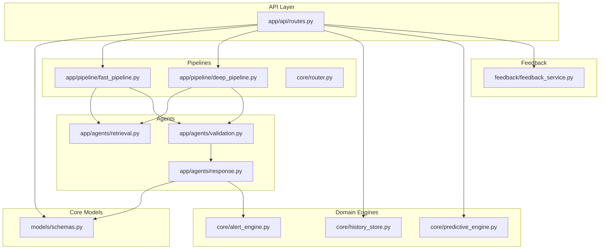
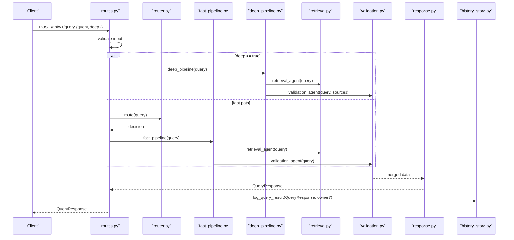
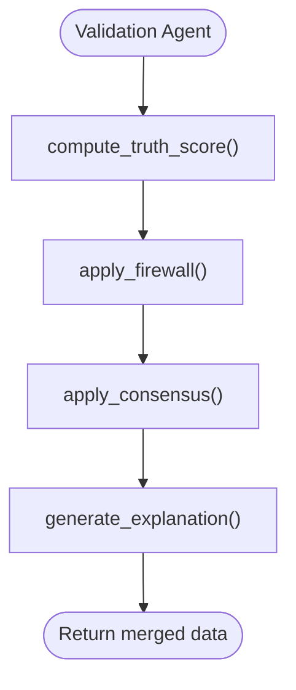
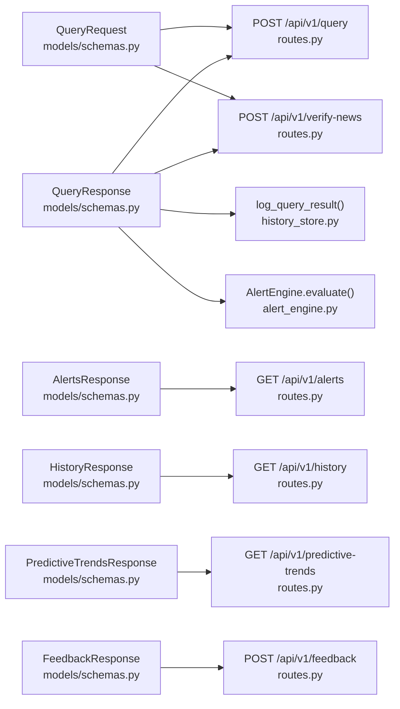

# API Schemas & Data Models

<cite>
**Referenced Files in This Document**
- [schemas.py](file://veritas-ai/models/schemas.py)
- [routes.py](file://veritas-ai/app/api/routes.py)
- [validation.py](file://veritas-ai/app/agents/validation.py)
- [retrieval.py](file://veritas-ai/app/agents/retrieval.py)
- [response.py](file://veritas-ai/app/agents/response.py)
- [fast_pipeline.py](file://veritas-ai/app/pipeline/fast_pipeline.py)
- [deep_pipeline.py](file://veritas-ai/app/pipeline/deep_pipeline.py)
- [router.py](file://veritas-ai/core/router.py)
- [history_store.py](file://veritas-ai/core/history_store.py)
- [alert_engine.py](file://veritas-ai/core/alert_engine.py)
- [predictive_engine.py](file://veritas-ai/core/predictive_engine.py)
- [feedback_service.py](file://veritas-ai/feedback/feedback_service.py)
- [api.ts](file://veritas-ai/frontend/types/api.ts)
- [api.ts](file://veritas-ai/frontend/services/api.ts)
</cite>

## Table of Contents
1. [Introduction](#introduction)
2. [Project Structure](#project-structure)
3. [Core Components](#core-components)
4. [Architecture Overview](#architecture-overview)
5. [Detailed Component Analysis](#detailed-component-analysis)
6. [Dependency Analysis](#dependency-analysis)
7. [Performance Considerations](#performance-considerations)
8. [Troubleshooting Guide](#troubleshooting-guide)
9. [Conclusion](#conclusion)
10. [Appendices](#appendices)

## Introduction
This document defines the API request and response schemas used across the Veritas AI API ecosystem. It focuses on:
- QueryRequest for query input validation
- QueryResponse for verification results
- AlertsResponse for global anomaly detection
- HistoryResponse for query history
- PredictiveTrendsResponse for risk assessment
- FeedbackResponse for user telemetry

It explains field definitions, data types, validation rules, optional vs required parameters, and example payloads. It also maps schemas to their corresponding API endpoints, outlines validation logic, and documents error response formats.

## Project Structure
The API schemas are defined in a central location and consumed by FastAPI routes and internal pipelines. Frontend TypeScript types mirror core schemas for type safety.

**Diagram sources**
- [routes.py:18-251](file://veritas-ai/app/api/routes.py#L18-L251)
- [schemas.py:1-88](file://veritas-ai/models/schemas.py#L1-L88)
- [fast_pipeline.py:13-49](file://veritas-ai/app/pipeline/fast_pipeline.py#L13-L49)
- [deep_pipeline.py:13-43](file://veritas-ai/app/pipeline/deep_pipeline.py#L13-L43)
- [router.py:83-182](file://veritas-ai/core/router.py#L83-L182)
- [retrieval.py:36-101](file://veritas-ai/app/agents/retrieval.py#L36-L101)
- [validation.py:278-314](file://veritas-ai/app/agents/validation.py#L278-L314)
- [response.py:32-73](file://veritas-ai/app/agents/response.py#L32-L73)
- [history_store.py:46-102](file://veritas-ai/core/history_store.py#L46-L102)
- [alert_engine.py:20-67](file://veritas-ai/core/alert_engine.py#L20-L67)
- [predictive_engine.py:5-63](file://veritas-ai/core/predictive_engine.py#L5-L63)
- [feedback_service.py:15-94](file://veritas-ai/feedback/feedback_service.py#L15-L94)

**Section sources**
- [routes.py:18-251](file://veritas-ai/app/api/routes.py#L18-L251)
- [schemas.py:1-88](file://veritas-ai/models/schemas.py#L1-L88)

## Core Components
This section defines each schema, its fields, types, validation rules, and usage context.

### QueryRequest
- Purpose: Input schema for query endpoints.
- Endpoint: POST /api/v1/query, POST /api/v1/verify-news
- Validation:
  - query is required and stripped
  - deep is optional boolean defaulting to false
- Example payload:
  - {
    "query": "Is the Earth flat?",
    "deep": false
  }

**Section sources**
- [routes.py:100-128](file://veritas-ai/app/api/routes.py#L100-L128)
- [schemas.py:10-13](file://veritas-ai/models/schemas.py#L10-L13)

### QueryResponse
- Purpose: Final verification result returned by the system.
- Fields:
  - query: string
  - summary: string
  - facts: array of strings (default empty)
  - sources: array of Source (default empty)
  - contradictions: array of strings (default empty)
  - fake_probability: float 0.0–1.0 (default 0.5)
  - confidence_score: float 0.0–1.0 (default 0.0)
  - truth_score: float 0.0–1.0 (default 0.0)
  - status: enum "verified" | "likely_false" | "uncertain" (default "uncertain")
  - explanation: optional object (nullable)
  - timestamp: string (ISO 8601 UTC)
- Example payload:
  - {
    "query": "Is the Earth flat?",
    "summary": "The claim is unsupported by available evidence.",
    "facts": ["Evidence from satellite imagery supports a spherical Earth."],
    "sources": [{ "url": "https://example.edu", "credibility_score": 0.95, "type": "official" }],
    "contradictions": [],
    "fake_probability": 0.1,
    "confidence_score": 0.85,
    "truth_score": 0.2,
    "status": "likely_false",
    "explanation": { "why_true": [], "why_false": ["No authoritative sources found"], "confidence_breakdown": { "authority": 0.95, "agreement": 1.0, "bias": 0.9 } },
    "timestamp": "2025-01-01T00:00:00Z"
  }

**Section sources**
- [schemas.py:14-25](file://veritas-ai/models/schemas.py#L14-L25)
- [validation.py:278-314](file://veritas-ai/app/agents/validation.py#L278-L314)
- [response.py:32-73](file://veritas-ai/app/agents/response.py#L32-L73)

### AlertsResponse
- Purpose: Global anomaly detection results.
- Fields:
  - status: enum "success"
  - active_global_anomalies: array of AlertItem (default empty)
- AlertItem fields:
  - alert_type: string
  - severity: enum "low" | "medium" | "high"
  - message: string
  - timestamp: string (ISO 8601 UTC)
- Example payload:
  - {
    "status": "success",
    "active_global_anomalies": [
      {
        "alert_type": "anomaly",
        "severity": "medium",
        "message": "Severe loss of baseline reality confidence natively scoring at 0.3.",
        "timestamp": "2025-01-01T00:00:00Z"
      }
    ]
  }

**Section sources**
- [schemas.py:47-50](file://veritas-ai/models/schemas.py#L47-L50)
- [alert_engine.py:20-67](file://veritas-ai/core/alert_engine.py#L20-L67)

### HistoryResponse
- Purpose: Query history for a user.
- Fields:
  - status: enum "success"
  - items: array of HistoryEntry (default empty)
- HistoryEntry fields:
  - id: integer
  - timestamp: string (ISO 8601 UTC)
  - query: string
  - status: string
  - truth_score: float 0.0–1.0
  - summary: string
- Example payload:
  - {
    "status": "success",
    "items": [
      {
        "id": 1,
        "timestamp": "2025-01-01T00:00:00Z",
        "query": "Is the Earth flat?",
        "status": "likely_false",
        "truth_score": 0.2,
        "summary": "The claim is unsupported by available evidence."
      }
    ]
  }

**Section sources**
- [schemas.py:80-83](file://veritas-ai/models/schemas.py#L80-L83)
- [history_store.py:66-102](file://veritas-ai/core/history_store.py#L66-L102)

### PredictiveTrendsResponse
- Purpose: Risk assessment for emerging misinformation trends.
- Fields:
  - status: enum "success"
  - timestamp_horizon: string
  - predictive_alerts: array of PredictiveAlert (default empty)
- PredictiveAlert fields:
  - trend_alert: boolean
  - topic: string
  - risk_level: enum "medium" | "high"
  - prediction: string
- Example payload:
  - {
    "status": "success",
    "timestamp_horizon": "2025-01-01T00:00:00Z",
    "predictive_alerts": [
      {
        "trend_alert": true,
        "topic": "astroturf",
        "risk_level": "high",
        "prediction": "critical misinformation spread rapidly scaling natively"
      }
    ]
  }

**Section sources**
- [schemas.py:59-63](file://veritas-ai/models/schemas.py#L59-L63)
- [predictive_engine.py:33-62](file://veritas-ai/core/predictive_engine.py#L33-L62)

### FeedbackResponse
- Purpose: Telemetry response for user feedback submissions.
- Fields:
  - status: enum "success" | "error" | "no_updates"
  - tracking_stage: optional string
  - message: optional string
- Example payload:
  - {
    "status": "success",
    "tracking_stage": "PENDING_VALIDATION",
    "message": "Feedback recorded"
  }

**Section sources**
- [schemas.py:34-38](file://veritas-ai/models/schemas.py#L34-L38)
- [feedback_service.py:68-94](file://veritas-ai/feedback/feedback_service.py#L68-L94)

## Architecture Overview
The API orchestrates query resolution through routing, pipelines, and agents. Responses conform to QueryResponse, while specialized endpoints return AlertsResponse, HistoryResponse, PredictiveTrendsResponse, and FeedbackResponse.

**Diagram sources**
- [routes.py:46-82](file://veritas-ai/app/api/routes.py#L46-L82)
- [router.py:99-136](file://veritas-ai/core/router.py#L99-L136)
- [fast_pipeline.py:13-49](file://veritas-ai/app/pipeline/fast_pipeline.py#L13-L49)
- [deep_pipeline.py:13-43](file://veritas-ai/app/pipeline/deep_pipeline.py#L13-L43)
- [retrieval.py:36-101](file://veritas-ai/app/agents/retrieval.py#L36-L101)
- [validation.py:278-314](file://veritas-ai/app/agents/validation.py#L278-L314)
- [response.py:32-73](file://veritas-ai/app/agents/response.py#L32-L73)
- [history_store.py:46-63](file://veritas-ai/core/history_store.py#L46-L63)

## Detailed Component Analysis

### QueryRequest Schema
- Required fields: query
- Optional fields: deep (boolean)
- Validation rules:
  - query must be present and non-empty after trimming
  - deep defaults to false if omitted
- Endpoint mapping:
  - POST /api/v1/query
  - POST /api/v1/verify-news (requires API key header X-API-KEY)

**Section sources**
- [routes.py:100-128](file://veritas-ai/app/api/routes.py#L100-L128)
- [schemas.py:10-13](file://veritas-ai/models/schemas.py#L10-L13)

### QueryResponse Schema
- Construction pipeline:
  - Retrieval agent produces initial sources and credibility
  - Validation agent computes truth/confidence/fake probability, applies firewall, consensus, and explainability
  - Response agent merges outputs and sets timestamp
- Validation rules:
  - Numerical fields constrained to 0.0–1.0
  - status constrained to allowed values
  - explanation is optional
- Endpoint mapping:
  - Returned by POST /api/v1/query and POST /api/v1/verify-news

**Diagram sources**
- [validation.py:92-127](file://veritas-ai/app/agents/validation.py#L92-L127)
- [validation.py:161-199](file://veritas-ai/app/agents/validation.py#L161-L199)
- [validation.py:203-213](file://veritas-ai/app/agents/validation.py#L203-L213)
- [validation.py:217-274](file://veritas-ai/app/agents/validation.py#L217-L274)

**Section sources**
- [validation.py:278-314](file://veritas-ai/app/agents/validation.py#L278-L314)
- [response.py:32-73](file://veritas-ai/app/agents/response.py#L32-L73)
- [schemas.py:14-25](file://veritas-ai/models/schemas.py#L14-L25)

### AlertsResponse Schema
- Generation:
  - AlertEngine evaluates QueryResponse for anomalies and emits unified AlertItem entries
- Endpoint mapping:
  - GET /api/v1/alerts (requires API key)

**Section sources**
- [schemas.py:47-50](file://veritas-ai/models/schemas.py#L47-L50)
- [alert_engine.py:26-66](file://veritas-ai/core/alert_engine.py#L26-L66)
- [routes.py:198-210](file://veritas-ai/app/api/routes.py#L198-L210)

### HistoryResponse Schema
- Persistence:
  - Query results logged to SQLite via history_store
  - Fetch recent history filtered by owner_email
- Endpoint mapping:
  - GET /api/v1/history (optional API key)

**Section sources**
- [schemas.py:80-83](file://veritas-ai/models/schemas.py#L80-L83)
- [history_store.py:46-102](file://veritas-ai/core/history_store.py#L46-L102)
- [routes.py:147-160](file://veritas-ai/app/api/routes.py#L147-L160)

### PredictiveTrendsResponse Schema
- Generation:
  - PredictiveIntelligenceEngine ingests query tokens, maintains sliding window, and detects spikes
- Endpoint mapping:
  - GET /api/v1/predictive-trends (requires API key)

**Section sources**
- [schemas.py:59-63](file://veritas-ai/models/schemas.py#L59-L63)
- [predictive_engine.py:14-62](file://veritas-ai/core/predictive_engine.py#L14-L62)
- [routes.py:212-224](file://veritas-ai/app/api/routes.py#L212-L224)

### FeedbackResponse Schema
- Submission:
  - UserFeedback validated and normalized (scores coerced to 0.0–1.0)
  - Logged to SQLite with owner_email
- Endpoint mapping:
  - POST /api/v1/feedback (optional API key)

**Section sources**
- [schemas.py:34-38](file://veritas-ai/models/schemas.py#L34-L38)
- [feedback_service.py:15-31](file://veritas-ai/feedback/feedback_service.py#L15-L31)
- [feedback_service.py:68-94](file://veritas-ai/feedback/feedback_service.py#L68-L94)
- [routes.py:162-178](file://veritas-ai/app/api/routes.py#L162-L178)

## Dependency Analysis
The following diagram shows how schemas relate to endpoints and internal components.

**Diagram sources**
- [schemas.py:10-88](file://veritas-ai/models/schemas.py#L10-L88)
- [routes.py:100-224](file://veritas-ai/app/api/routes.py#L100-L224)
- [history_store.py:46-102](file://veritas-ai/core/history_store.py#L46-L102)
- [alert_engine.py:26-66](file://veritas-ai/core/alert_engine.py#L26-L66)
- [predictive_engine.py:33-62](file://veritas-ai/core/predictive_engine.py#L33-L62)
- [feedback_service.py:68-94](file://veritas-ai/feedback/feedback_service.py#L68-L94)

**Section sources**
- [schemas.py:1-88](file://veritas-ai/models/schemas.py#L1-L88)
- [routes.py:18-251](file://veritas-ai/app/api/routes.py#L18-L251)

## Performance Considerations
- Fast pipeline targets sub-second latency by running retrieval and validation in parallel and minimizing overhead.
- Deep pipeline adds sequential phases to improve accuracy at the cost of latency.
- Router caches frequent queries and selects fast-path for simple queries to reduce load.
- Caching layers (local and Redis) are populated asynchronously after pipeline completion.

[No sources needed since this section provides general guidance]

## Troubleshooting Guide
- Authentication errors:
  - Missing or invalid API key results in HTTP 401 on authenticated endpoints.
- Input validation errors:
  - Missing query on POST /api/v1/query or POST /api/v1/verify-news yields HTTP 400.
- Endpoint-specific errors:
  - GET /api/v1/history returns an error object in the response body on failure.
  - POST /api/v1/feedback raises HTTP 500 on ingestion failure.
- Error response format:
  - ErrorResponse schema includes status "error" and message.

**Section sources**
- [routes.py:23-31](file://veritas-ai/app/api/routes.py#L23-L31)
- [routes.py:107-109](file://veritas-ai/app/api/routes.py#L107-L109)
- [routes.py:158-159](file://veritas-ai/app/api/routes.py#L158-L159)
- [routes.py:176-177](file://veritas-ai/app/api/routes.py#L176-L177)
- [schemas.py:85-88](file://veritas-ai/models/schemas.py#L85-L88)

## Conclusion
The Veritas AI API ecosystem defines strict, validated schemas for all request and response payloads. Endpoints enforce authentication where appropriate, route queries efficiently, and produce standardized results that feed downstream analytics and user telemetry. The schemas and their relationships are consistently enforced across FastAPI routes, internal agents, and persistence layers.

[No sources needed since this section summarizes without analyzing specific files]

## Appendices

### Endpoint-to-Schema Mapping
- POST /api/v1/query → QueryRequest (request), QueryResponse (response)
- POST /api/v1/verify-news → QueryRequest (request), QueryResponse (response)
- GET /api/v1/alerts → AlertsResponse
- GET /api/v1/history → HistoryResponse
- GET /api/v1/predictive-trends → PredictiveTrendsResponse
- POST /api/v1/feedback → FeedbackResponse

**Section sources**
- [routes.py:100-224](file://veritas-ai/app/api/routes.py#L100-L224)
- [schemas.py:10-88](file://veritas-ai/models/schemas.py#L10-L88)

### Frontend Type Alignment
Frontend TypeScript mirrors core schemas for type safety and consistency.

**Section sources**
- [api.ts:1-66](file://veritas-ai/frontend/types/api.ts#L1-L66)
- [api.ts:1-32](file://veritas-ai/frontend/services/api.ts#L1-L32)