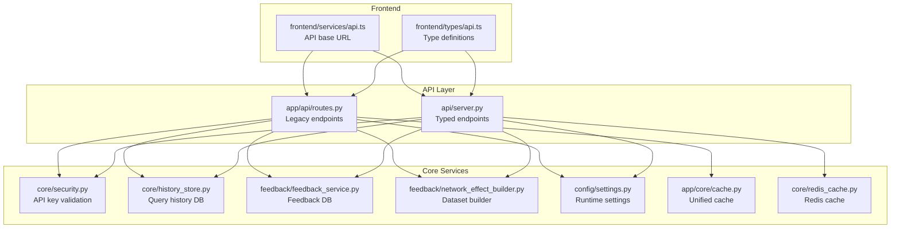
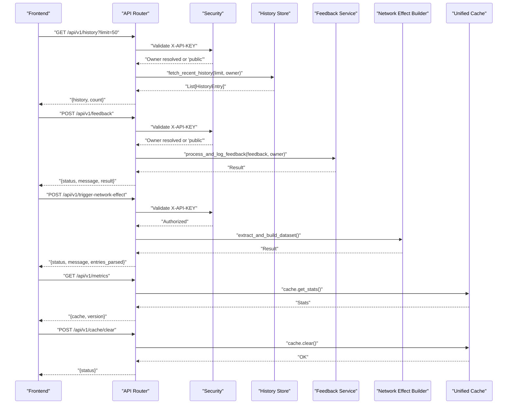
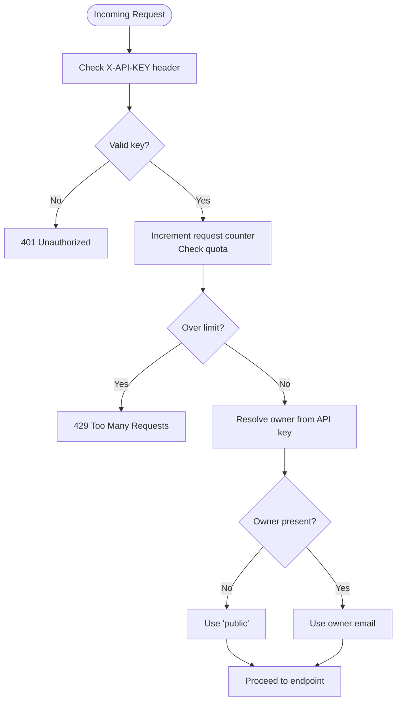
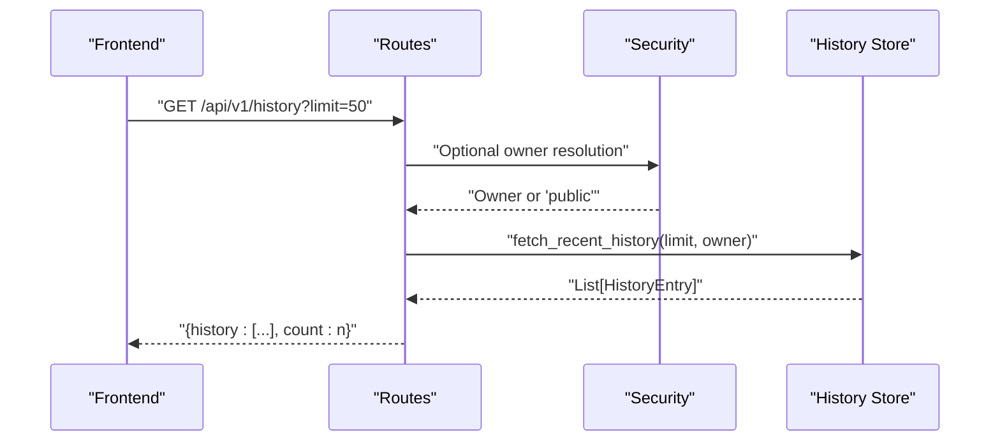
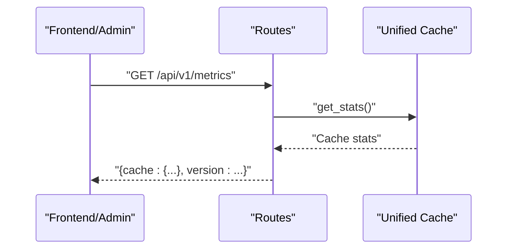
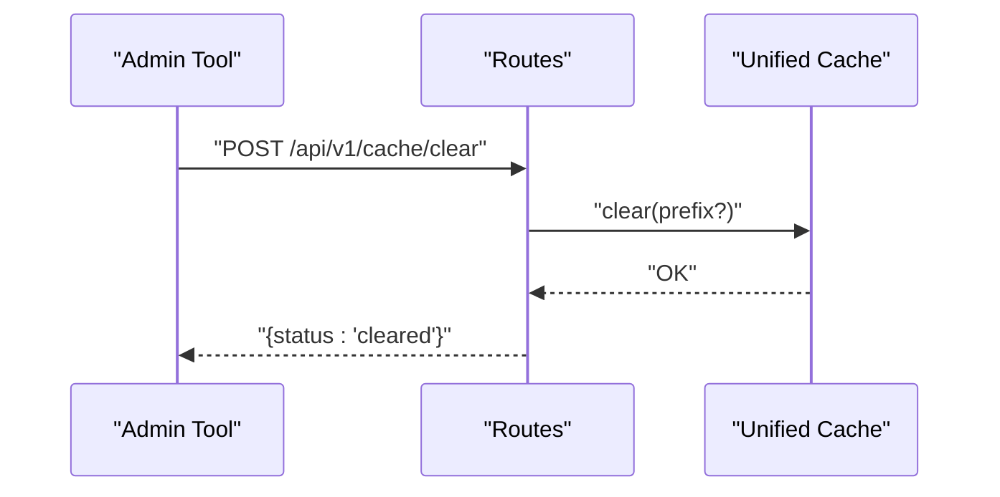
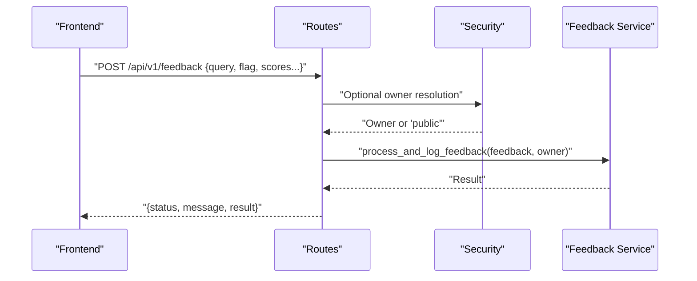
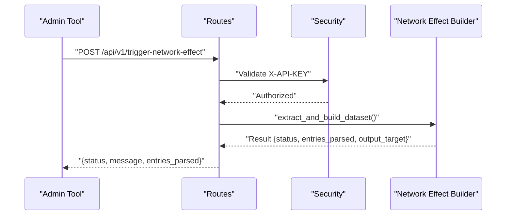
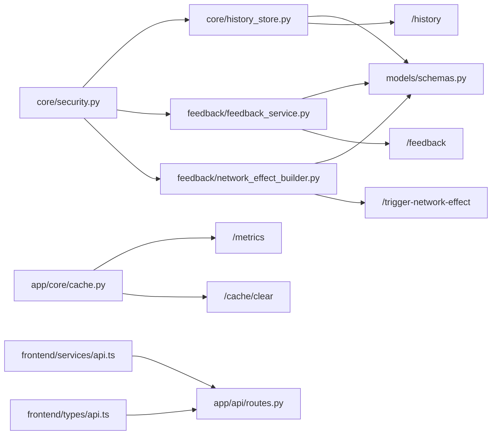

# Internal API Endpoints

<cite>
**Referenced Files in This Document**
- [routes.py](file://veritas-ai/app/api/routes.py)
- [server.py](file://veritas-ai/api/server.py)
- [history_store.py](file://veritas-ai/core/history_store.py)
- [feedback_service.py](file://veritas-ai/feedback/feedback_service.py)
- [network_effect_builder.py](file://veritas-ai/feedback/network_effect_builder.py)
- [schemas.py](file://veritas-ai/models/schemas.py)
- [security.py](file://veritas-ai/core/security.py)
- [settings.py](file://veritas-ai/config/settings.py)
- [cache.py](file://veritas-ai/app/core/cache.py)
- [redis_cache.py](file://veritas-ai/core/redis_cache.py)
- [api.ts](file://veritas-ai/frontend/services/api.ts)
- [api.ts](file://veritas-ai/frontend/types/api.ts)
- [main.py](file://veritas-ai/app/main.py)
</cite>

## Table of Contents
1. [Introduction](#introduction)
2. [Project Structure](#project-structure)
3. [Core Components](#core-components)
4. [Architecture Overview](#architecture-overview)
5. [Detailed Component Analysis](#detailed-component-analysis)
6. [Dependency Analysis](#dependency-analysis)
7. [Performance Considerations](#performance-considerations)
8. [Troubleshooting Guide](#troubleshooting-guide)
9. [Conclusion](#conclusion)
10. [Appendices](#appendices)

## Introduction
This document describes the internal API endpoints used by Veritas AI’s frontend and administrative interfaces. It focuses on:
- /history for retrieving query history with pagination and ownership filtering
- /metrics for system performance monitoring
- /cache/clear for cache management
- /feedback for user telemetry collection
- /trigger-network-effect for ML pipeline orchestration

It also documents authentication via API headers, parameter specifications, response formats, and integration examples for internal system components.

## Project Structure
The internal API surface is implemented in two primary locations:
- Legacy FastAPI router under app/api/routes.py
- New FastAPI router under api/server.py

Both expose the same endpoints with overlapping functionality. The legacy router is maintained for backward compatibility, while the new router introduces stricter typing and response models.

**Diagram sources**
- [routes.py:1-251](file://veritas-ai/app/api/routes.py#L1-L251)
- [server.py:1-285](file://veritas-ai/api/server.py#L1-L285)
- [security.py:1-129](file://veritas-ai/core/security.py#L1-L129)
- [history_store.py:1-106](file://veritas-ai/core/history_store.py#L1-L106)
- [feedback_service.py:1-94](file://veritas-ai/feedback/feedback_service.py#L1-L94)
- [network_effect_builder.py:1-80](file://veritas-ai/feedback/network_effect_builder.py#L1-L80)
- [settings.py:1-83](file://veritas-ai/config/settings.py#L1-L83)
- [cache.py:1-172](file://veritas-ai/app/core/cache.py#L1-L172)
- [redis_cache.py:1-232](file://veritas-ai/core/redis_cache.py#L1-L232)
- [api.ts:1-32](file://veritas-ai/frontend/services/api.ts#L1-L32)
- [api.ts:1-66](file://veritas-ai/frontend/types/api.ts#L1-L66)

**Section sources**
- [routes.py:1-251](file://veritas-ai/app/api/routes.py#L1-L251)
- [server.py:1-285](file://veritas-ai/api/server.py#L1-L285)

## Core Components
- Authentication: API key validation via X-API-KEY header with rate-limit enforcement and owner resolution.
- Query history: SQLite-backed persistence with optional owner filtering.
- Feedback loop: SQLite-backed telemetry ingestion with owner tagging.
- Network effect: Dataset synthesis from validated feedback entries.
- Metrics and cache: Unified cache statistics and Redis-backed cache operations.

**Section sources**
- [security.py:1-129](file://veritas-ai/core/security.py#L1-L129)
- [history_store.py:1-106](file://veritas-ai/core/history_store.py#L1-L106)
- [feedback_service.py:1-94](file://veritas-ai/feedback/feedback_service.py#L1-L94)
- [network_effect_builder.py:1-80](file://veritas-ai/feedback/network_effect_builder.py#L1-L80)
- [cache.py:1-172](file://veritas-ai/app/core/cache.py#L1-L172)
- [redis_cache.py:1-232](file://veritas-ai/core/redis_cache.py#L1-L232)

## Architecture Overview
The internal API endpoints integrate with security, persistence, and cache layers. Requests are authenticated, optionally filtered by owner, and routed to domain-specific handlers.

**Diagram sources**
- [routes.py:147-251](file://veritas-ai/app/api/routes.py#L147-L251)
- [server.py:125-214](file://veritas-ai/api/server.py#L125-L214)
- [security.py:51-114](file://veritas-ai/core/security.py#L51-L114)
- [history_store.py:66-102](file://veritas-ai/core/history_store.py#L66-L102)
- [feedback_service.py:68-94](file://veritas-ai/feedback/feedback_service.py#L68-L94)
- [network_effect_builder.py:24-79](file://veritas-ai/feedback/network_effect_builder.py#L24-L79)
- [cache.py:144-155](file://veritas-ai/app/core/cache.py#L144-L155)

## Detailed Component Analysis

### Authentication and Ownership
- Header: X-API-KEY
- Validation: Compares against in-memory client registry with rate-limit windows and tier-based quotas.
- Owner resolution: Extracts owner email from API key context; defaults to “public” when absent.

**Diagram sources**
- [security.py:51-114](file://veritas-ai/core/security.py#L51-L114)

**Section sources**
- [security.py:1-129](file://veritas-ai/core/security.py#L1-L129)

### /history Endpoint
- Purpose: Retrieve recent query history with optional owner filtering.
- Method and Path: GET /api/v1/history
- Authentication: Optional; if X-API-KEY provided, owner is resolved; otherwise “public”.
- Query Parameters:
  - limit: integer, default 50, min 1, max 100
- Response: JSON object containing history items and count.
- Data Persistence: SQLite table with owner_email column; queries filtered by owner or defaulted to public.

**Diagram sources**
- [routes.py:147-160](file://veritas-ai/app/api/routes.py#L147-L160)
- [history_store.py:66-102](file://veritas-ai/core/history_store.py#L66-L102)

**Section sources**
- [routes.py:147-160](file://veritas-ai/app/api/routes.py#L147-L160)
- [history_store.py:66-102](file://veritas-ai/core/history_store.py#L66-L102)
- [schemas.py:71-83](file://veritas-ai/models/schemas.py#L71-L83)

### /metrics Endpoint
- Purpose: Expose system performance metrics and cache statistics.
- Method and Path: GET /api/v1/metrics
- Authentication: Not required.
- Response: Includes cache statistics and version metadata.

**Diagram sources**
- [routes.py:236-244](file://veritas-ai/app/api/routes.py#L236-L244)
- [cache.py:144-155](file://veritas-ai/app/core/cache.py#L144-L155)

**Section sources**
- [routes.py:236-244](file://veritas-ai/app/api/routes.py#L236-L244)
- [cache.py:144-155](file://veritas-ai/app/core/cache.py#L144-L155)

### /cache/clear Endpoint
- Purpose: Clear cached entries across cache tiers.
- Method and Path: POST /api/v1/cache/clear
- Authentication: Not required.
- Behavior: Clears local and Redis caches; supports optional prefix scoping.

**Diagram sources**
- [routes.py:246-251](file://veritas-ai/app/api/routes.py#L246-L251)
- [cache.py:126-143](file://veritas-ai/app/core/cache.py#L126-L143)

**Section sources**
- [routes.py:246-251](file://veritas-ai/app/api/routes.py#L246-L251)
- [cache.py:126-143](file://veritas-ai/app/core/cache.py#L126-L143)

### /feedback Endpoint
- Purpose: Submit user telemetry and feedback.
- Method and Path: POST /api/v1/feedback
- Authentication: Optional; owner resolved if X-API-KEY provided.
- Request Body: UserFeedback model with validation and normalization.
- Response: JSON with status, message, and tracking stage.

**Diagram sources**
- [routes.py:162-178](file://veritas-ai/app/api/routes.py#L162-L178)
- [feedback_service.py:68-94](file://veritas-ai/feedback/feedback_service.py#L68-L94)

**Section sources**
- [routes.py:162-178](file://veritas-ai/app/api/routes.py#L162-L178)
- [feedback_service.py:15-94](file://veritas-ai/feedback/feedback_service.py#L15-L94)
- [schemas.py:15-38](file://veritas-ai/models/schemas.py#L15-L38)

### /trigger-network-effect Endpoint
- Purpose: Trigger dataset aggregation for ML pipeline improvement.
- Method and Path: POST /api/v1/trigger-network-effect
- Authentication: Required; API key must be valid.
- Behavior: Extracts pending feedback entries and writes a JSONL dataset; updates pipeline status.

**Diagram sources**
- [routes.py:180-196](file://veritas-ai/app/api/routes.py#L180-L196)
- [network_effect_builder.py:24-79](file://veritas-ai/feedback/network_effect_builder.py#L24-L79)

**Section sources**
- [routes.py:180-196](file://veritas-ai/app/api/routes.py#L180-L196)
- [network_effect_builder.py:24-79](file://veritas-ai/feedback/network_effect_builder.py#L24-L79)

## Dependency Analysis
- Authentication depends on in-memory client registry and secure header parsing.
- History and feedback endpoints depend on SQLite initialization and migrations.
- Metrics and cache endpoints depend on unified cache statistics.
- Frontend integration uses a computed API base URL and typed response models.

**Diagram sources**
- [security.py:1-129](file://veritas-ai/core/security.py#L1-L129)
- [history_store.py:1-106](file://veritas-ai/core/history_store.py#L1-L106)
- [feedback_service.py:1-94](file://veritas-ai/feedback/feedback_service.py#L1-L94)
- [network_effect_builder.py:1-80](file://veritas-ai/feedback/network_effect_builder.py#L1-L80)
- [schemas.py:1-88](file://veritas-ai/models/schemas.py#L1-L88)
- [cache.py:1-172](file://veritas-ai/app/core/cache.py#L1-L172)
- [routes.py:1-251](file://veritas-ai/app/api/routes.py#L1-L251)
- [api.ts:1-32](file://veritas-ai/frontend/services/api.ts#L1-L32)
- [api.ts:1-66](file://veritas-ai/frontend/types/api.ts#L1-L66)

**Section sources**
- [routes.py:1-251](file://veritas-ai/app/api/routes.py#L1-L251)
- [server.py:1-285](file://veritas-ai/api/server.py#L1-L285)

## Performance Considerations
- Cache behavior: Unified cache provides local and Redis tiers with graceful fallback. Use /metrics to monitor hit rates and availability.
- Rate limiting: Per-endpoint limits are enforced; excessive requests return 429 errors.
- Database I/O: History and feedback operations are executed synchronously via thread pools; keep limit parameters reasonable to avoid heavy scans.
- Streaming: WebSocket endpoints provide real-time progress updates for long-running tasks.

[No sources needed since this section provides general guidance]

## Troubleshooting Guide
- 401 Unauthorized: Missing or invalid X-API-KEY header.
- 429 Too Many Requests: Rate limit exceeded for the API key tier.
- 500 Internal Server Error: Unhandled exceptions caught globally; check logs for stack traces.
- Cache connectivity: If Redis is unavailable, cache falls back to local; verify cache.get_stats() for redis_available flag.
- Database initialization: Ensure SQLite tables exist; history and feedback databases initialize on startup.

**Section sources**
- [security.py:51-114](file://veritas-ai/core/security.py#L51-L114)
- [main.py:156-197](file://veritas-ai/app/main.py#L156-L197)
- [cache.py:43-65](file://veritas-ai/app/core/cache.py#L43-L65)

## Conclusion
The internal API provides a cohesive set of endpoints for history retrieval, telemetry collection, ML pipeline orchestration, and cache management, secured by API key authentication and rate limiting. Responses are structured and typed, enabling reliable integration with frontend dashboards and administrative tools.

[No sources needed since this section summarizes without analyzing specific files]

## Appendices

### Endpoint Reference Summary
- GET /api/v1/history
  - Auth: Optional
  - Params: limit (integer, default 50)
  - Response: {history: [...], count: number}

- POST /api/v1/feedback
  - Auth: Optional
  - Body: UserFeedback
  - Response: {status, message, result}

- POST /api/v1/trigger-network-effect
  - Auth: Required
  - Response: {status, message, entries_parsed}

- GET /api/v1/metrics
  - Auth: Not required
  - Response: {cache: {...}, version: string}

- POST /api/v1/cache/clear
  - Auth: Not required
  - Response: {status}

**Section sources**
- [routes.py:147-251](file://veritas-ai/app/api/routes.py#L147-L251)
- [schemas.py:15-83](file://veritas-ai/models/schemas.py#L15-L83)

### Frontend Integration Notes
- API base URL is computed from environment or defaults; ensure NEXT_PUBLIC_API_BASE_URL is set appropriately.
- Type definitions align with backend response models for safe consumption.

**Section sources**
- [api.ts:1-32](file://veritas-ai/frontend/services/api.ts#L1-L32)
- [api.ts:1-66](file://veritas-ai/frontend/types/api.ts#L1-L66)