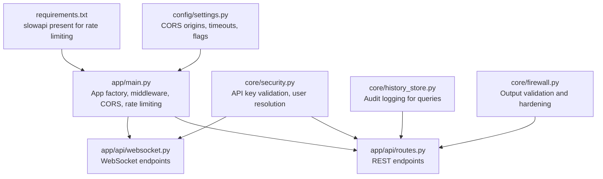
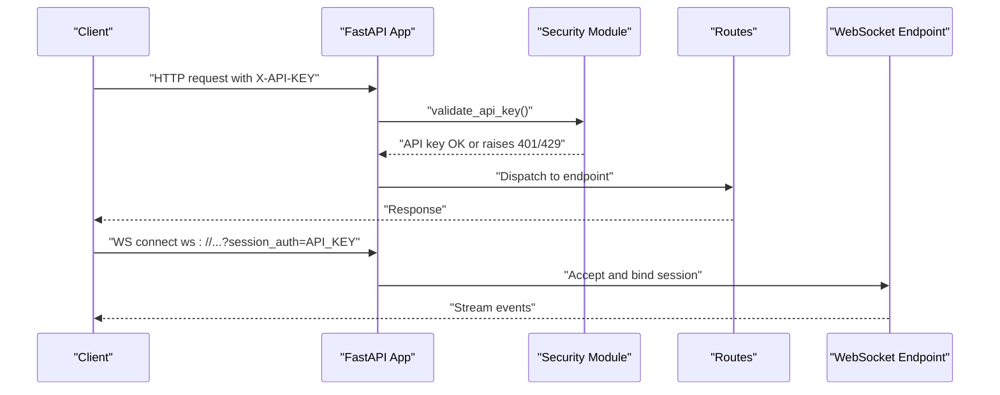
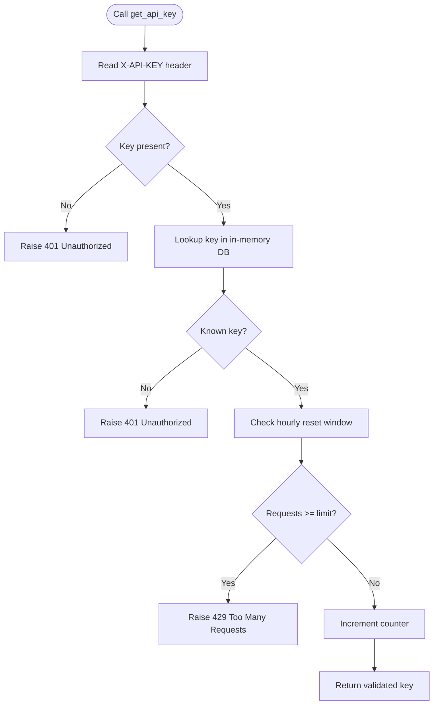
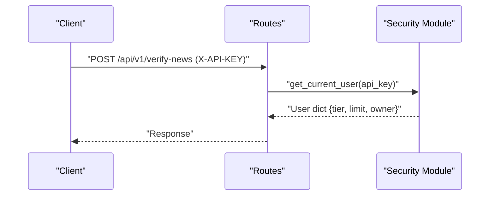
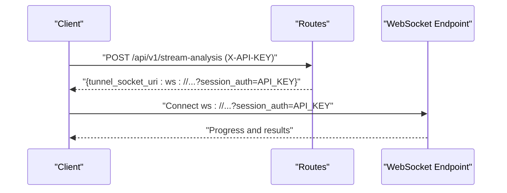
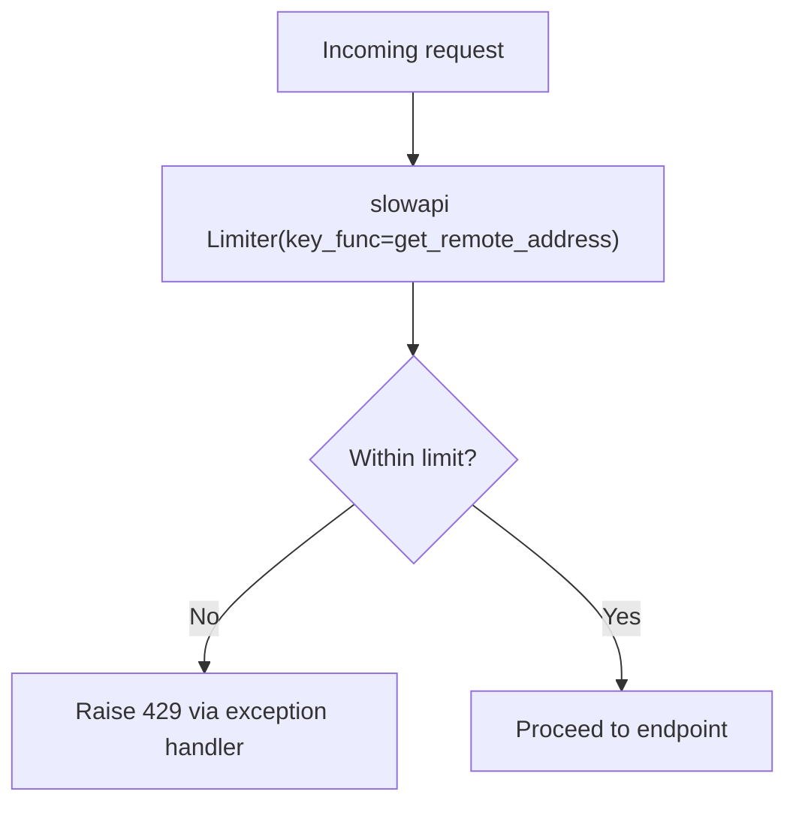
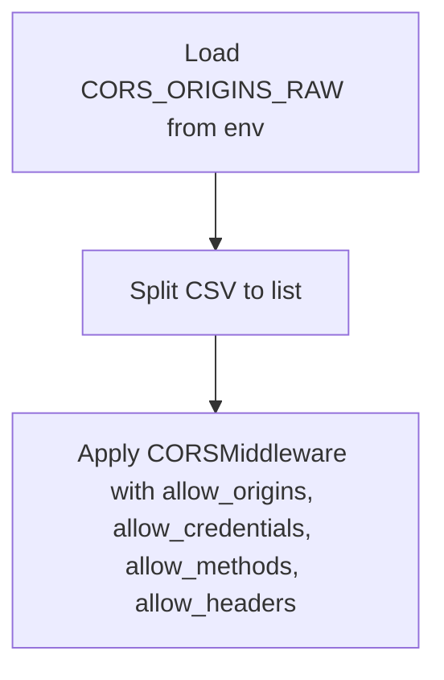
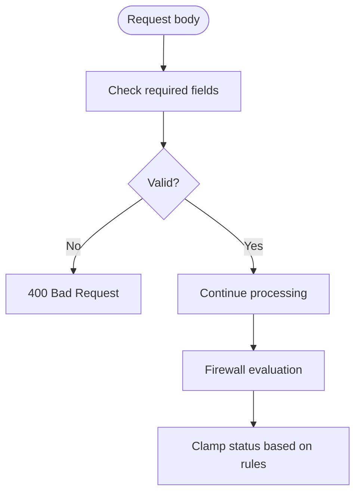
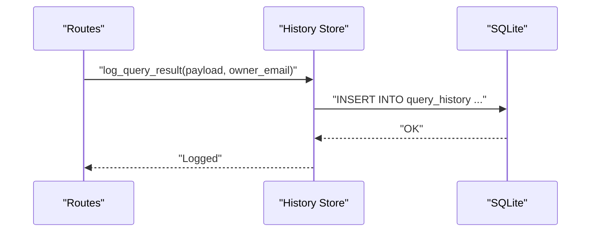
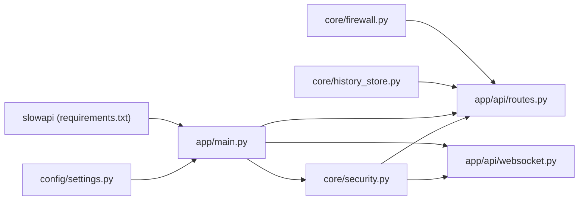

# Authentication & Security

<cite>
**Referenced Files in This Document**
- [app/main.py](file://app/main.py)
- [core/security.py](file://core/security.py)
- [app/api/routes.py](file://app/api/routes.py)
- [app/api/websocket.py](file://app/api/websocket.py)
- [config/settings.py](file://config/settings.py)
- [core/history_store.py](file://core/history_store.py)
- [core/firewall.py](file://core/firewall.py)
- [requirements.txt](file://requirements.txt)
</cite>

## Table of Contents
1. [Introduction](#introduction)
2. [Project Structure](#project-structure)
3. [Core Components](#core-components)
4. [Architecture Overview](#architecture-overview)
5. [Detailed Component Analysis](#detailed-component-analysis)
6. [Dependency Analysis](#dependency-analysis)
7. [Performance Considerations](#performance-considerations)
8. [Troubleshooting Guide](#troubleshooting-guide)
9. [Conclusion](#conclusion)
10. [Appendices](#appendices)

## Introduction
This document explains Veritas AI’s authentication and security mechanisms. It covers:
- API key authentication for public endpoints using a dedicated dependency
- User authentication via a dependency for protected endpoints
- Session-based authentication for WebSocket connections
- Rate limiting policies and enforcement
- Security headers and CORS configuration
- Input validation and protections against common attacks
- Practical examples for API consumers
- API key management, user account security, and audit logging requirements

## Project Structure
Security-related logic is primarily implemented in the application entry point, a dedicated security module, route handlers, and configuration settings. WebSocket endpoints implement session-based authentication via a query parameter appended to the WebSocket URL.

**Diagram sources**
- [app/main.py:106-207](file://app/main.py#L106-L207)
- [core/security.py:111-129](file://core/security.py#L111-L129)
- [app/api/routes.py:18-251](file://app/api/routes.py#L18-L251)
- [app/api/websocket.py:19-253](file://app/api/websocket.py#L19-L253)
- [config/settings.py:69-82](file://config/settings.py#L69-L82)
- [core/history_store.py:46-102](file://core/history_store.py#L46-L102)
- [core/firewall.py:4-47](file://core/firewall.py#L4-L47)
- [requirements.txt:39](file://requirements.txt#L39)

**Section sources**
- [app/main.py:106-207](file://app/main.py#L106-L207)
- [core/security.py:111-129](file://core/security.py#L111-L129)
- [app/api/routes.py:18-251](file://app/api/routes.py#L18-L251)
- [app/api/websocket.py:19-253](file://app/api/websocket.py#L19-L253)
- [config/settings.py:69-82](file://config/settings.py#L69-L82)
- [core/history_store.py:46-102](file://core/history_store.py#L46-L102)
- [core/firewall.py:4-47](file://core/firewall.py#L4-L47)
- [requirements.txt:39](file://requirements.txt#L39)

## Core Components
- API key authentication dependency for public endpoints
- User authentication dependency for protected endpoints
- Session-based authentication for WebSocket connections
- Global rate limiting via slowapi
- CORS configuration
- Input validation and error handling
- Audit logging for queries

**Section sources**
- [core/security.py:111-129](file://core/security.py#L111-L129)
- [app/api/routes.py:23-42](file://app/api/routes.py#L23-L42)
- [app/api/websocket.py:132-147](file://app/api/websocket.py#L132-L147)
- [app/main.py:177-197](file://app/main.py#L177-L197)
- [config/settings.py:69-82](file://config/settings.py#L69-L82)
- [core/history_store.py:46-102](file://core/history_store.py#L46-L102)

## Architecture Overview
The system enforces authentication and rate limits at the application and endpoint levels. Public endpoints may require an API key, while protected endpoints enforce stricter user validation. WebSocket endpoints accept a session token appended to the URL.

**Diagram sources**
- [core/security.py:51-84](file://core/security.py#L51-L84)
- [app/api/routes.py:23-42](file://app/api/routes.py#L23-L42)
- [app/api/websocket.py:132-147](file://app/api/websocket.py#L132-L147)

## Detailed Component Analysis

### API Key Authentication for Public Endpoints
- Purpose: Authenticate callers for public endpoints using a single dependency that validates the API key and applies a fixed-window rate limit.
- Key behaviors:
  - Extracts the API key from the X-API-KEY header
  - Validates presence and correctness
  - Enforces per-key hourly limits based on tier
  - Returns the validated key for downstream use

**Diagram sources**
- [core/security.py:51-84](file://core/security.py#L51-L84)

**Section sources**
- [core/security.py:51-84](file://core/security.py#L51-L84)
- [core/security.py:111-114](file://core/security.py#L111-L114)

### User Authentication for Protected Endpoints
- Purpose: Resolve the owner associated with an API key for protected endpoints.
- Key behaviors:
  - Uses the same header-based validation
  - Returns a user-like dictionary containing tier, limits, and owner
  - Logs warnings on missing or invalid keys

**Diagram sources**
- [app/api/routes.py:114-128](file://app/api/routes.py#L114-L128)
- [core/security.py:87-109](file://core/security.py#L87-L109)

**Section sources**
- [core/security.py:87-109](file://core/security.py#L87-L109)
- [app/api/routes.py:114-128](file://app/api/routes.py#L114-L128)

### Session-Based Authentication for WebSocket Connections
- Purpose: Authenticate WebSocket clients using a session token passed as a query parameter appended to the WebSocket URL.
- Key behaviors:
  - The stream authorization endpoint constructs a WebSocket URL with a session_auth parameter
  - The WebSocket endpoint accepts the connection and streams results
  - No additional per-message authentication is enforced in the referenced code

**Diagram sources**
- [app/api/routes.py:131-144](file://app/api/routes.py#L131-L144)
- [app/api/websocket.py:63-165](file://app/api/websocket.py#L63-L165)

**Section sources**
- [app/api/routes.py:131-144](file://app/api/routes.py#L131-L144)
- [app/api/websocket.py:63-165](file://app/api/websocket.py#L63-L165)

### Rate Limiting Policies and Enforcement
- Global rate limiter: Configured at the application level using slowapi with a remote address key function.
- Per-endpoint policies (as implemented in routes):
  - /api/v1/query: No explicit per-endpoint decorator in the referenced routes; subject to global limiter
  - /api/v1/verify-news: No explicit per-endpoint decorator in the referenced routes; subject to global limiter
  - /api/v1/stream-analysis: No explicit per-endpoint decorator in the referenced routes; subject to global limiter
  - /api/v1/alerts: No explicit per-endpoint decorator in the referenced routes; subject to global limiter
  - /api/v1/predictive-trends: No explicit per-endpoint decorator in the referenced routes; subject to global limiter
  - /api/v1/feedback: No explicit per-endpoint decorator in the referenced routes; subject to global limiter
- Note: The objective specifies distinct per-endpoint rates. If these are intended to be enforced, they should be added as decorators in the routes module.

**Diagram sources**
- [app/main.py:177-197](file://app/main.py#L177-L197)

**Section sources**
- [app/main.py:177-197](file://app/main.py#L177-L197)
- [app/api/routes.py:100-251](file://app/api/routes.py#L100-L251)

### Security Headers and CORS Configuration
- CORS: Configured via settings with origins parsed from an environment variable. The middleware allows credentials and all methods/headers.
- Security headers: Not explicitly set in the referenced code; defaults apply.

**Diagram sources**
- [config/settings.py:69-82](file://config/settings.py#L69-L82)
- [app/main.py:116-123](file://app/main.py#L116-L123)

**Section sources**
- [config/settings.py:69-82](file://config/settings.py#L69-L82)
- [app/main.py:116-123](file://app/main.py#L116-L123)

### Input Validation and Protection Against Common Attacks
- Validation:
  - Routes validate required fields (e.g., query presence) and return 400 on invalid requests.
  - JSON parsing errors in WebSocket endpoints are handled gracefully.
- Protections:
  - Fixed-window per-key rate limiting in the security module.
  - Output hardening via a firewall that clamps statuses based on thresholds and contradictions.
  - Timeout middleware prevents slowloris-style abuse.

**Diagram sources**
- [app/api/routes.py:100-128](file://app/api/routes.py#L100-L128)
- [app/api/websocket.py:82-98](file://app/api/websocket.py#L82-L98)
- [core/firewall.py:13-46](file://core/firewall.py#L13-L46)

**Section sources**
- [app/api/routes.py:100-128](file://app/api/routes.py#L100-L128)
- [app/api/websocket.py:82-98](file://app/api/websocket.py#L82-L98)
- [core/firewall.py:13-46](file://core/firewall.py#L13-L46)
- [app/main.py:127-151](file://app/main.py#L127-L151)

### Audit Logging Requirements
- Query history logging:
  - On successful query resolution, results are logged to a SQLite database with owner attribution.
  - Owner is resolved from the API key for authenticated requests; otherwise "public".
- Schema:
  - Table includes timestamp, query, status, truth score, confidence score, summary, and owner email.

**Diagram sources**
- [app/api/routes.py:72-81](file://app/api/routes.py#L72-L81)
- [core/history_store.py:46-63](file://core/history_store.py#L46-L63)

**Section sources**
- [app/api/routes.py:72-81](file://app/api/routes.py#L72-L81)
- [core/history_store.py:46-63](file://core/history_store.py#L46-L63)

## Dependency Analysis
- External dependency for rate limiting: slowapi is imported and used to configure a global limiter.
- Internal dependencies:
  - Routes depend on the security module for authentication helpers.
  - WebSocket endpoints depend on pipelines and voice modules for streaming.
  - Security module depends on FastAPI’s API key header mechanism and environment variables for initial keys.

**Diagram sources**
- [core/security.py:111-129](file://core/security.py#L111-L129)
- [app/api/routes.py:18-251](file://app/api/routes.py#L18-L251)
- [app/api/websocket.py:19-253](file://app/api/websocket.py#L19-L253)
- [app/main.py:177-197](file://app/main.py#L177-L197)
- [config/settings.py:69-82](file://config/settings.py#L69-L82)
- [core/history_store.py:46-102](file://core/history_store.py#L46-L102)
- [core/firewall.py:4-47](file://core/firewall.py#L4-L47)
- [requirements.txt:39](file://requirements.txt#L39)

**Section sources**
- [requirements.txt:39](file://requirements.txt#L39)
- [app/main.py:177-197](file://app/main.py#L177-L197)
- [core/security.py:111-129](file://core/security.py#L111-L129)
- [app/api/routes.py:18-251](file://app/api/routes.py#L18-L251)
- [app/api/websocket.py:19-253](file://app/api/websocket.py#L19-L253)
- [config/settings.py:69-82](file://config/settings.py#L69-L82)
- [core/history_store.py:46-102](file://core/history_store.py#L46-L102)
- [core/firewall.py:4-47](file://core/firewall.py#L4-L47)

## Performance Considerations
- Global rate limiter uses a remote address key function; ensure it scales with reverse proxies and load balancers.
- Timeout middleware protects against slow requests; tune PIPELINE_TIMEOUT_SECONDS according to workload.
- WebSocket streaming sends progress updates; keep messages concise to reduce overhead.

[No sources needed since this section provides general guidance]

## Troubleshooting Guide
- 401 Unauthorized:
  - Cause: Missing or invalid X-API-KEY header.
  - Action: Provide a valid API key; verify environment variables for development keys.
- 429 Too Many Requests:
  - Cause: Exceeded per-key hourly limit.
  - Action: Wait for the hourly reset or upgrade tiers via environment configuration.
- 404 Not Found:
  - Cause: Incorrect endpoint path.
  - Action: Verify the endpoint prefix and route.
- 504 Gateway Timeout:
  - Cause: Request exceeded pipeline timeout.
  - Action: Reduce query complexity or increase timeout settings.
- WebSocket JSON errors:
  - Cause: Malformed JSON payload.
  - Action: Ensure the client sends valid JSON with required fields.

**Section sources**
- [core/security.py:51-84](file://core/security.py#L51-L84)
- [app/main.py:130-148](file://app/main.py#L130-L148)
- [app/api/websocket.py:82-98](file://app/api/websocket.py#L82-L98)

## Conclusion
Veritas AI implements a layered security model: API key-based authentication for public endpoints, user resolution for protected endpoints, session-based WebSocket authentication, and global rate limiting. Input validation and output hardening further strengthen defenses. For the stated per-endpoint rate limits, add slowapi decorators to the routes module to enforce precise quotas.

[No sources needed since this section summarizes without analyzing specific files]

## Appendices

### Practical Examples for API Consumers

- Authentication header usage:
  - Set the X-API-KEY header on all authenticated requests.
  - Example: curl -H "X-API-KEY: YOUR_API_KEY" -X POST https://host/api/v1/verify-news -d '{"claim":"..."}'

- Token generation and management:
  - In-memory key generation is supported for administrative workflows; persist keys externally in production.
  - Use environment variables to seed development and enterprise keys.

- Refresh mechanisms:
  - No token refresh is implemented in the referenced code; keys are long-lived within the in-memory store.

- Security best practices:
  - Rotate API keys regularly.
  - Restrict CORS origins to trusted domains.
  - Monitor rate limit exceptions and adjust quotas.
  - Log and alert on repeated 401/403 occurrences.

[No sources needed since this section provides general guidance]