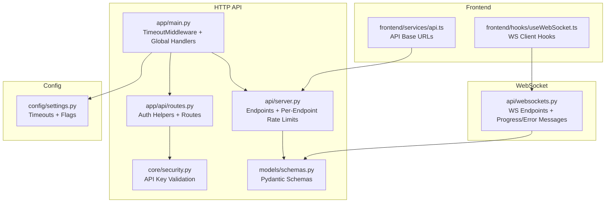
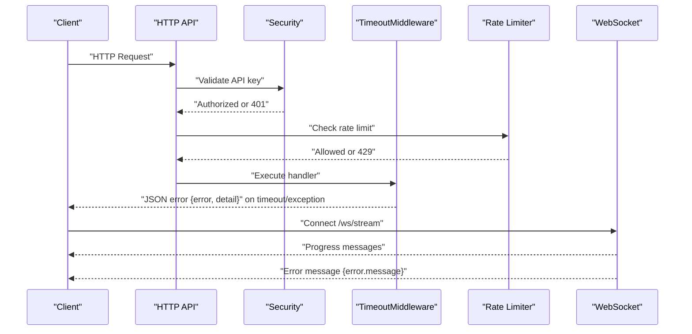
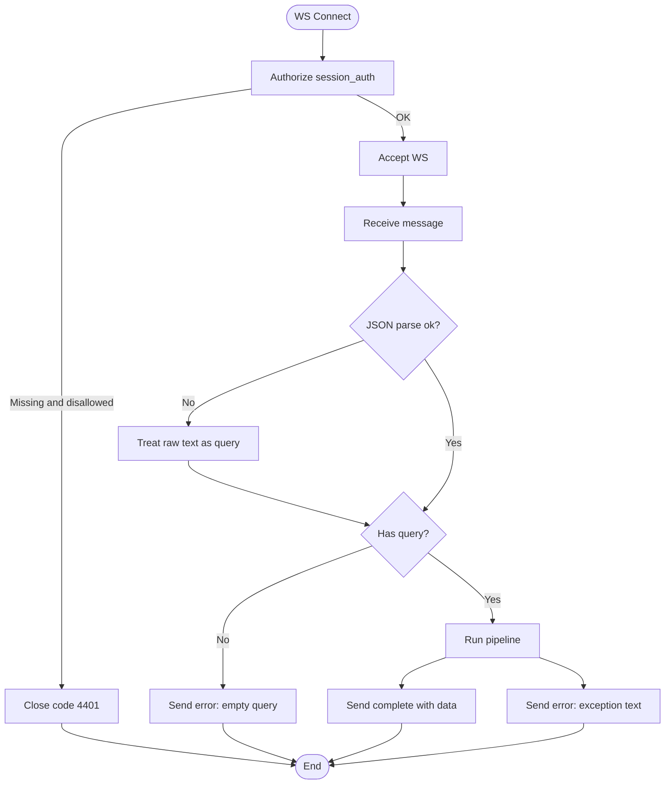
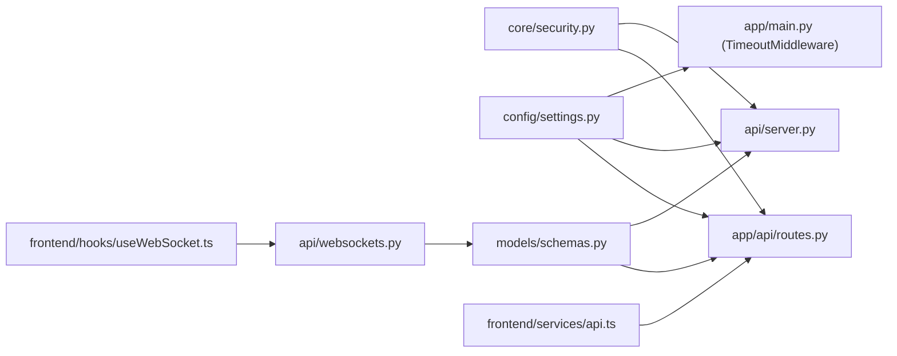

# Error Handling & Status Codes

<cite>
**Referenced Files in This Document**
- [app/main.py](file://app/main.py)
- [api/server.py](file://api/server.py)
- [api/websockets.py](file://api/websockets.py)
- [app/api/routes.py](file://app/api/routes.py)
- [core/security.py](file://core/security.py)
- [models/schemas.py](file://models/schemas.py)
- [frontend/services/api.ts](file://frontend/services/api.ts)
- [frontend/hooks/useWebSocket.ts](file://frontend/hooks/useWebSocket.ts)
- [config/settings.py](file://config/settings.py)
- [requirements.txt](file://requirements.txt)
</cite>

## Table of Contents
1. [Introduction](#introduction)
2. [Project Structure](#project-structure)
3. [Core Components](#core-components)
4. [Architecture Overview](#architecture-overview)
5. [Detailed Component Analysis](#detailed-component-analysis)
6. [Dependency Analysis](#dependency-analysis)
7. [Performance Considerations](#performance-considerations)
8. [Troubleshooting Guide](#troubleshooting-guide)
9. [Conclusion](#conclusion)

## Introduction
This document defines Veritas AI’s error handling and status code patterns for HTTP APIs and WebSocket streams. It covers standard HTTP status codes, error response schemas, specific error scenarios, rate limiting behavior, authentication failures, timeouts, and practical troubleshooting guidance for API consumers.

## Project Structure
The error handling surface spans:
- HTTP API endpoints and middleware
- Global exception handlers and rate limiting
- WebSocket endpoints and streaming error propagation
- Authentication helpers and validation
- Frontend services and hooks for robust client-side handling

**Diagram sources**
- [app/main.py:126-207](file://app/main.py#L126-L207)
- [api/server.py:40-285](file://api/server.py#L40-L285)
- [app/api/routes.py:1-251](file://app/api/routes.py#L1-L251)
- [core/security.py:1-129](file://core/security.py#L1-L129)
- [models/schemas.py:1-88](file://models/schemas.py#L1-L88)
- [api/websockets.py:1-234](file://api/websockets.py#L1-L234)
- [frontend/services/api.ts:1-32](file://frontend/services/api.ts#L1-L32)
- [frontend/hooks/useWebSocket.ts:1-143](file://frontend/hooks/useWebSocket.ts#L1-L143)
- [config/settings.py:1-83](file://config/settings.py#L1-L83)

**Section sources**
- [app/main.py:126-207](file://app/main.py#L126-L207)
- [api/server.py:40-285](file://api/server.py#L40-L285)
- [app/api/routes.py:1-251](file://app/api/routes.py#L1-L251)
- [core/security.py:1-129](file://core/security.py#L1-L129)
- [models/schemas.py:1-88](file://models/schemas.py#L1-L88)
- [api/websockets.py:1-234](file://api/websockets.py#L1-L234)
- [frontend/services/api.ts:1-32](file://frontend/services/api.ts#L1-L32)
- [frontend/hooks/useWebSocket.ts:1-143](file://frontend/hooks/useWebSocket.ts#L1-L143)
- [config/settings.py:1-83](file://config/settings.py#L1-L83)

## Core Components
- HTTP middleware and global exception handlers manage timeouts and unhandled exceptions.
- Per-endpoint rate limiting integrates with slowapi decorators.
- Authentication helpers enforce API key presence and validity.
- WebSocket endpoints emit structured progress and error messages.
- Frontend hooks implement reconnection and error state handling.

**Section sources**
- [app/main.py:126-207](file://app/main.py#L126-L207)
- [api/server.py:80-214](file://api/server.py#L80-L214)
- [core/security.py:51-113](file://core/security.py#L51-L113)
- [api/websockets.py:38-86](file://api/websockets.py#L38-L86)
- [frontend/hooks/useWebSocket.ts:15-142](file://frontend/hooks/useWebSocket.ts#L15-L142)

## Architecture Overview
The system centralizes error handling at two layers:
- HTTP layer: middleware and global handlers produce consistent JSON error responses.
- WebSocket layer: structured messages carry status, progress, and error payloads.

**Diagram sources**
- [app/main.py:126-197](file://app/main.py#L126-L197)
- [core/security.py:51-113](file://core/security.py#L51-L113)
- [api/server.py:80-214](file://api/server.py#L80-L214)
- [api/websockets.py:112-234](file://api/websockets.py#L112-L234)

## Detailed Component Analysis

### HTTP Error Handling and Status Codes
- 200 OK: Successful responses use Pydantic models (e.g., QueryResponse, AlertsResponse).
- 400 Bad Request: Explicitly raised for missing or invalid request fields in routes.
- 401 Unauthorized: Raised when API key is missing or invalid.
- 403 Forbidden: Implicit via authentication-dependent endpoints; consumers receive 401 when missing/invalid keys.
- 404 Not Found: Global handler returns a standardized error envelope.
- 422 Unprocessable Entity: Pydantic validation errors return a structured error envelope with details.
- 429 Too Many Requests: Per-endpoint slowapi decorators and global handler return a standardized error envelope.
- 500 Internal Server Error: Catch-all handler returns a standardized error envelope.
- 504 Gateway Timeout: Timeout middleware returns a standardized error envelope.

Error response schema (common structure):
- Fields: error (string), detail (string), optional extras depending on context.

**Section sources**
- [app/api/routes.py:100-128](file://app/api/routes.py#L100-L128)
- [app/api/routes.py:162-177](file://app/api/routes.py#L162-L177)
- [app/api/routes.py:198-223](file://app/api/routes.py#L198-L223)
- [core/security.py:51-113](file://core/security.py#L51-L113)
- [app/main.py:126-197](file://app/main.py#L126-L197)
- [models/schemas.py:85-88](file://models/schemas.py#L85-L88)

### Rate Limiting Behavior
- Per-endpoint limits are applied via slowapi decorators on endpoints.
- Global RateLimitExceeded handler returns a standardized 429 error envelope.
- Fixed-window in-memory rate limiting is enforced by the API key validator for free tier.

Typical 429 error payload:
- error: "Rate limit exceeded"
- detail: provider-specific message

**Section sources**
- [api/server.py:80-214](file://api/server.py#L80-L214)
- [app/main.py:181-197](file://app/main.py#L181-L197)
- [core/security.py:51-84](file://core/security.py#L51-L84)

### Authentication Failure Messages
- Missing API key: 401 with a clear message instructing to provide X-API-KEY.
- Invalid API key: 401 with a message indicating invalid key.
- Tier-based rate limit exceeded: 429 with tier and limit details.

**Section sources**
- [core/security.py:51-113](file://core/security.py#L51-L113)

### Timeout Handling
- Global timeout middleware enforces a configurable request timeout.
- On timeout: returns 504 with an error envelope.
- On other unhandled exceptions: returns 500 with an error envelope.

**Section sources**
- [app/main.py:126-197](file://app/main.py#L126-L197)
- [config/settings.py:21-24](file://config/settings.py#L21-L24)

### WebSocket Error Patterns
- Authorization failures: server closes with code 4401 and a reason message.
- Malformed JSON: server falls back to treating raw text as query.
- Empty queries: emits an error message with a clear diagnostic.
- Pipeline failures: emits an error message containing the exception text.
- Disconnections: client reconnects with exponential backoff.

**Diagram sources**
- [api/websockets.py:79-234](file://api/websockets.py#L79-L234)

**Section sources**
- [api/websockets.py:79-234](file://api/websockets.py#L79-L234)
- [frontend/hooks/useWebSocket.ts:29-100](file://frontend/hooks/useWebSocket.ts#L29-L100)

### Frontend Integration Notes
- API base URL construction normalizes trailing slashes and appends /api/v1.
- WebSocket URL defaults to ws/wss based on protocol and port.
- The hook manages connection lifecycle, progress updates, and error states, including reconnection.

**Section sources**
- [frontend/services/api.ts:1-32](file://frontend/services/api.ts#L1-L32)
- [frontend/hooks/useWebSocket.ts:15-142](file://frontend/hooks/useWebSocket.ts#L15-L142)

## Dependency Analysis
- HTTP API depends on:
  - Security module for API key validation
  - Pydantic models for response schemas
  - Config for timeouts and flags
- WebSocket endpoints depend on:
  - Security for session auth
  - Event bus for alerts
  - Pipeline modules for processing
- Frontend depends on:
  - API base URL and WS base URL from environment/runtime
  - WebSocket hooks for connection and error handling

**Diagram sources**
- [core/security.py:1-129](file://core/security.py#L1-L129)
- [app/api/routes.py:1-251](file://app/api/routes.py#L1-L251)
- [api/server.py:40-285](file://api/server.py#L40-L285)
- [config/settings.py:1-83](file://config/settings.py#L1-L83)
- [models/schemas.py:1-88](file://models/schemas.py#L1-L88)
- [api/websockets.py:1-234](file://api/websockets.py#L1-L234)
- [frontend/services/api.ts:1-32](file://frontend/services/api.ts#L1-L32)
- [frontend/hooks/useWebSocket.ts:1-143](file://frontend/hooks/useWebSocket.ts#L1-L143)

**Section sources**
- [core/security.py:1-129](file://core/security.py#L1-L129)
- [app/api/routes.py:1-251](file://app/api/routes.py#L1-L251)
- [api/server.py:40-285](file://api/server.py#L40-L285)
- [config/settings.py:1-83](file://config/settings.py#L1-L83)
- [models/schemas.py:1-88](file://models/schemas.py#L1-L88)
- [api/websockets.py:1-234](file://api/websockets.py#L1-L234)
- [frontend/services/api.ts:1-32](file://frontend/services/api.ts#L1-L32)
- [frontend/hooks/useWebSocket.ts:1-143](file://frontend/hooks/useWebSocket.ts#L1-L143)

## Performance Considerations
- Timeouts: Tune PIPELINE_TIMEOUT_SECONDS to balance responsiveness and long-running tasks.
- Rate limits: Adjust per-endpoint limits and consider tier-based enforcement for fair usage.
- Caching: Leverage Redis-backed cache to reduce latency and error-prone retries.
- Backoff: Client-side exponential backoff reduces load on failing endpoints.

[No sources needed since this section provides general guidance]

## Troubleshooting Guide

Common error patterns and recovery strategies:
- 400 Bad Request
  - Cause: Missing or empty query field.
  - Recovery: Ensure the request body contains a non-empty query string.
  - Section sources
    - [app/api/routes.py:107-108](file://app/api/routes.py#L107-L108)

- 401 Unauthorized
  - Cause: Missing or invalid X-API-KEY.
  - Recovery: Provide a valid API key via X-API-KEY header; regenerate if expired.
  - Section sources
    - [core/security.py:51-113](file://core/security.py#L51-L113)

- 404 Not Found
  - Cause: Unknown endpoint or path.
  - Recovery: Verify the path under /api/v1 and correct spelling.
  - Section sources
    - [app/main.py:169-174](file://app/main.py#L169-L174)

- 422 Unprocessable Entity
  - Cause: Pydantic validation errors.
  - Recovery: Inspect details for field-specific issues and fix payload accordingly.
  - Section sources
    - [app/main.py:169-174](file://app/main.py#L169-L174)

- 429 Too Many Requests
  - Cause: Exceeded per-endpoint or tier-based rate limits.
  - Recovery: Reduce request frequency, implement client-side backoff, or upgrade tier.
  - Section sources
    - [api/server.py:80-214](file://api/server.py#L80-L214)
    - [core/security.py:51-84](file://core/security.py#L51-L84)

- 500 Internal Server Error
  - Cause: Unexpected server-side exception.
  - Recovery: Retry with exponential backoff; monitor logs; do not retry immediately on transient errors.
  - Section sources
    - [app/main.py:156-166](file://app/main.py#L156-L166)

- 504 Gateway Timeout
  - Cause: Request exceeded PIPELINE_TIMEOUT_SECONDS.
  - Recovery: Simplify query, reduce workload, or increase timeout setting.
  - Section sources
    - [app/main.py:130-148](file://app/main.py#L130-L148)
    - [config/settings.py:21-24](file://config/settings.py#L21-L24)

- WebSocket Connection Issues
  - Cause: Missing or invalid session_auth, malformed messages, empty queries, pipeline errors.
  - Recovery: Ensure session_auth is present and valid; send non-empty query; handle error messages and reconnect with backoff.
  - Section sources
    - [api/websockets.py:79-234](file://api/websockets.py#L79-L234)
    - [frontend/hooks/useWebSocket.ts:29-100](file://frontend/hooks/useWebSocket.ts#L29-L100)

Debugging techniques:
- Enable logging at INFO level to capture request paths and exceptions.
- Inspect error envelopes for detail fields to pinpoint causes.
- Use frontend hooks to observe status, progress, and error transitions.
- Validate API base URL and WS base URL construction in the browser.

**Section sources**
- [app/main.py:126-197](file://app/main.py#L126-L197)
- [api/websockets.py:79-234](file://api/websockets.py#L79-L234)
- [frontend/hooks/useWebSocket.ts:15-142](file://frontend/hooks/useWebSocket.ts#L15-L142)

## Conclusion
Veritas AI provides consistent, structured error handling across HTTP and WebSocket surfaces. Consumers should:
- Always include a valid API key for protected endpoints.
- Respect rate limits and implement client-side backoff.
- Handle standardized error envelopes and reconnection for WebSocket streams.
- Tune timeouts and leverage caching for resilient integrations.

[No sources needed since this section summarizes without analyzing specific files]