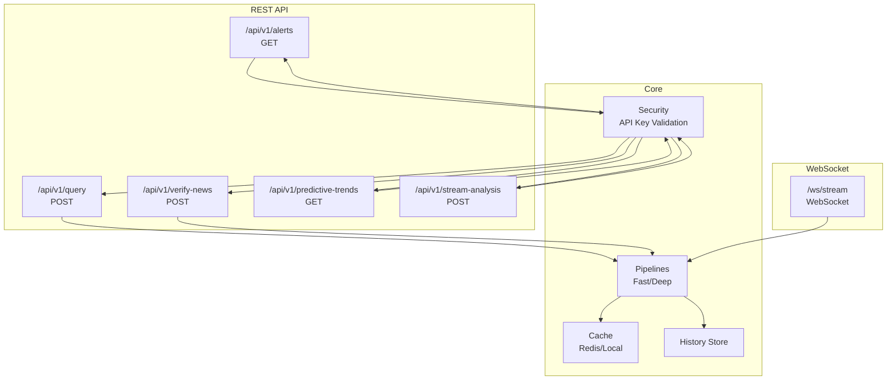
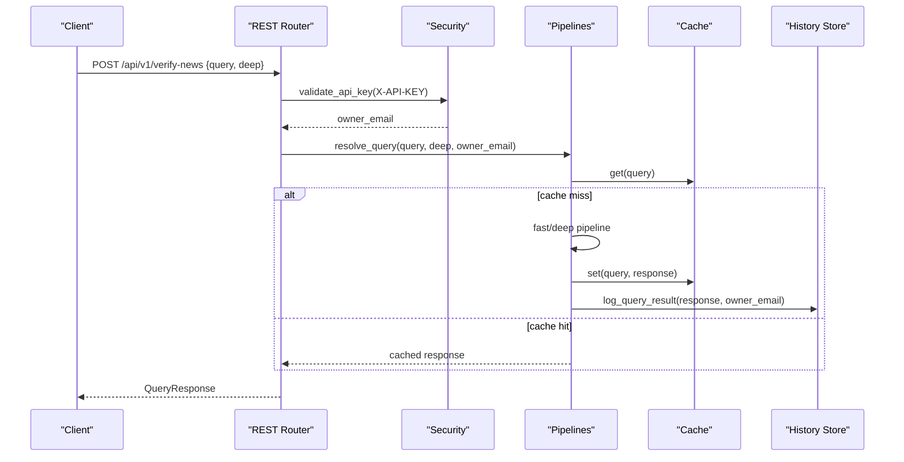
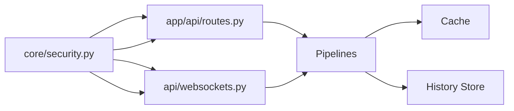

# Public API Endpoints

<cite>
**Referenced Files in This Document**
- [routes.py](file://veritas-ai/app/api/routes.py)
- [websocket.py](file://veritas-ai/app/api/websocket.py)
- [server.py](file://veritas-ai/api/server.py)
- [websockets.py](file://veritas-ai/api/websockets.py)
- [schemas.py](file://veritas-ai/models/schemas.py)
- [security.py](file://veritas-ai/core/security.py)
- [settings.py](file://veritas-ai/config/settings.py)
- [main.py](file://veritas-ai/main.py)
- [app_main.py](file://veritas-ai/app/main.py)
- [README.md](file://veritas-ai/README.md)
- [api.ts](file://veritas-ai/frontend/services/api.ts)
- [types_api.ts](file://veritas-ai/frontend/types/api.ts)
</cite>

## Table of Contents
1. [Introduction](#introduction)
2. [Project Structure](#project-structure)
3. [Core Components](#core-components)
4. [Architecture Overview](#architecture-overview)
5. [Detailed Component Analysis](#detailed-component-analysis)
6. [Dependency Analysis](#dependency-analysis)
7. [Performance Considerations](#performance-considerations)
8. [Troubleshooting Guide](#troubleshooting-guide)
9. [Conclusion](#conclusion)
10. [Appendices](#appendices)

## Introduction
This document describes Veritas AI’s public API endpoints for external developers and applications. It covers:
- Synchronous claim verification via /api/v1/query and /api/v1/verify-news
- Real-time monitoring via /ws/stream (WebSocket)
- Global anomaly detection via /api/v1/alerts
- Predictive risk assessment via /api/v1/predictive-trends
It also documents request/response schemas, authentication using API keys, rate limiting policies, error handling patterns, and practical usage examples.

## Project Structure
The API surface is implemented in two primary modules:
- REST API: app/api/routes.py and api/server.py
- WebSocket endpoints: app/api/websocket.py and api/websockets.py
Shared models and schemas live under models/schemas.py. Authentication and security utilities are in core/security.py. Configuration is centralized in config/settings.py. The application entry points are in main.py and app/main.py.

**Diagram sources**
- [routes.py:100-224](file://veritas-ai/app/api/routes.py#L100-L224)
- [server.py:81-193](file://veritas-ai/api/server.py#L81-L193)
- [websocket.py:63-165](file://veritas-ai/app/api/websocket.py#L63-L165)
- [websockets.py:112-233](file://veritas-ai/api/websockets.py#L112-L233)
- [security.py:51-113](file://veritas-ai/core/security.py#L51-L113)

**Section sources**
- [routes.py:1-251](file://veritas-ai/app/api/routes.py#L1-L251)
- [server.py:1-285](file://veritas-ai/api/server.py#L1-L285)
- [websocket.py:1-253](file://veritas-ai/app/api/websocket.py#L1-L253)
- [websockets.py:1-234](file://veritas-ai/api/websockets.py#L1-L234)
- [schemas.py:1-88](file://veritas-ai/models/schemas.py#L1-L88)
- [security.py:1-129](file://veritas-ai/core/security.py#L1-L129)
- [settings.py:1-83](file://veritas-ai/config/settings.py#L1-L83)
- [main.py:1-141](file://veritas-ai/main.py#L1-L141)
- [app_main.py:1-208](file://veritas-ai/app/main.py#L1-L208)

## Core Components
- Authentication: All public endpoints require an X-API-KEY header. API keys are validated and rate-limited per-tier.
- Pipelines: Fast and deep verification pipelines produce a unified QueryResponse.
- Caching: Responses are cached to improve latency and throughput.
- Rate Limiting: Per-endpoint limits enforced via slowapi decorators.
- WebSocket Streaming: Real-time progress and results for query and voice workloads.

**Section sources**
- [security.py:51-113](file://veritas-ai/core/security.py#L51-L113)
- [routes.py:46-81](file://veritas-ai/app/api/routes.py#L46-L81)
- [server.py:53-77](file://veritas-ai/api/server.py#L53-L77)
- [schemas.py:10-26](file://veritas-ai/models/schemas.py#L10-L26)

## Architecture Overview
The public API exposes:
- REST endpoints for synchronous verification and analytics
- WebSocket endpoints for streaming real-time results
- Shared models and schemas for request/response contracts
- Centralized security and rate limiting

**Diagram sources**
- [routes.py:114-128](file://veritas-ai/app/api/routes.py#L114-L128)
- [routes.py:46-81](file://veritas-ai/app/api/routes.py#L46-L81)
- [schemas.py:14-26](file://veritas-ai/models/schemas.py#L14-L26)

## Detailed Component Analysis

### /api/v1/query (Synchronous Claim Verification)
- Method: POST
- Path: /api/v1/query
- Purpose: Synchronous verification of a textual claim. Supports deep vs fast analysis.
- Authentication: Not required by the route definition; however, the endpoint is documented as internal high-speed verification and may be gated elsewhere.
- Request Schema: QueryRequest
  - query: string (required)
  - deep: boolean (optional, default false)
- Response Schema: QueryResponse
  - Includes summary, facts, sources, contradictions, scores, status, explanation, and timestamp.
- Behavior:
  - Checks cache; if present, returns cached result with _cached flag.
  - Routes to fast or deep pipeline depending on query characteristics.
  - Logs result to history store asynchronously.
- Practical Example:
  - curl -X POST "$API_BASE_URL/api/v1/query" -H "Content-Type: application/json" -d '{"query":"Is the Earth flat?","deep":false}'
- Notes:
  - The README indicates this endpoint is primarily for internal use (extension/UI). For public developer usage, prefer /verify-news.

**Section sources**
- [routes.py:100-111](file://veritas-ai/app/api/routes.py#L100-L111)
- [schemas.py:10-26](file://veritas-ai/models/schemas.py#L10-L26)
- [README.md:99-101](file://veritas-ai/README.md#L99-L101)

### /api/v1/verify-news (Authenticated News Verification)
- Method: POST
- Path: /api/v1/verify-news
- Purpose: Public developer API for synchronous claim verification with user attribution.
- Authentication: Required. Uses X-API-KEY header; validated and rate-limited.
- Rate Limit: 100/minute
- Request Schema: QueryRequest
  - query: string (required)
  - deep: boolean (optional)
- Response Schema: QueryResponse
- Behavior:
  - Extracts API key from header, resolves owner email, validates key.
  - Executes query through fast or deep pipeline.
  - Logs result with owner attribution.
- Practical Example:
  - curl -X POST "$API_BASE_URL/api/v1/verify-news" -H "X-API-KEY: YOUR_API_KEY" -H "Content-Type: application/json" -d '{"query":"Vaccines cause autism","deep":false}'

**Section sources**
- [server.py:97-105](file://veritas-ai/api/server.py#L97-L105)
- [security.py:51-113](file://veritas-ai/core/security.py#L51-L113)
- [schemas.py:10-26](file://veritas-ai/models/schemas.py#L10-L26)

### /api/v1/stream-analysis (WebSocket Authorization)
- Method: POST
- Path: /api/v1/stream-analysis
- Purpose: Authorizes a WebSocket tunnel for high-volume streaming sessions.
- Authentication: Required. Uses X-API-KEY header.
- Rate Limit: 20/minute
- Request Schema: QueryRequest
  - query: string (optional)
- Response Schema: StreamAuthorizationResponse
  - status: "stream_authorized"
  - tunnel_socket_uri: ws://...?session_auth={api_key}
  - query_linked: string
- Behavior:
  - Validates API key and constructs a WebSocket URL with session_auth token.
  - Returns a URI that the client can connect to for streaming analysis.
- Practical Example:
  - curl -X POST "$API_BASE_URL/api/v1/stream-analysis" -H "X-API-KEY: YOUR_API_KEY" -H "Content-Type: application/json" -d '{"query":"Climate change trends"}'
  - Connect WebSocket to returned tunnel_socket_uri.

**Section sources**
- [server.py:108-122](file://veritas-ai/api/server.py#L108-L122)
- [schemas.py:65-68](file://veritas-ai/models/schemas.py#L65-L68)
- [settings.py:34-40](file://veritas-ai/config/settings.py#L34-L40)

### /ws/stream (Real-Time Monitoring WebSocket)
- Method: WebSocket
- Path: /ws/stream
- Purpose: Real-time streaming of analysis progress and results with session-based authentication.
- Authentication: Session token via query parameter session_auth. Requires valid X-API-KEY.
- Behavior:
  - Accepts text frames containing a JSON payload with query and optional deep flag.
  - Streams progress updates with stages and percentage completion.
  - On completion, sends the full QueryResponse.
  - Emits global alerts as they occur.
- Message Types:
  - processing: {status: "processing", stage: "...", progress: 0..99, message: "..."}
  - complete: {status: "complete", data: QueryResponse, progress: 100}
  - error: {status: "error", error: {message: "..."}}
  - alert: {status: "alert", data: AlertItem}
- Practical Example:
  - Connect to ws://localhost:8000/ws/stream?session_auth=YOUR_API_KEY
  - Send {"query": "Artificial intelligence risks", "deep": false}

**Section sources**
- [websockets.py:112-233](file://veritas-ai/api/websockets.py#L112-L233)
- [websockets.py:79-86](file://veritas-ai/api/websockets.py#L79-L86)
- [schemas.py:14-26](file://veritas-ai/models/schemas.py#L14-L26)
- [schemas.py:40-49](file://veritas-ai/models/schemas.py#L40-L49)

### /api/v1/alerts (Global Misinformation Anomaly Detection)
- Method: GET
- Path: /api/v1/alerts
- Purpose: Fetch active global truth-risk anomalies.
- Authentication: Required. Uses X-API-KEY header.
- Rate Limit: 60/minute
- Response Schema: AlertsResponse
  - status: "success"
  - active_global_anomalies: List of AlertItem
- Practical Example:
  - curl -H "X-API-KEY: YOUR_API_KEY" "$API_BASE_URL/api/v1/alerts"

**Section sources**
- [server.py:125-131](file://veritas-ai/api/server.py#L125-L131)
- [schemas.py:47-49](file://veritas-ai/models/schemas.py#L47-L49)

### /api/v1/predictive-trends (Future Risk Assessment)
- Method: GET
- Path: /api/v1/predictive-trends
- Purpose: Retrieve emerging misinformation spikes and anomalies.
- Authentication: Required. Uses X-API-KEY header.
- Rate Limit: 30/minute
- Response Schema: PredictiveTrendsResponse
  - status: "success"
  - timestamp_horizon: string
  - predictive_alerts: List of PredictiveAlert
- Practical Example:
  - curl -H "X-API-KEY: YOUR_API_KEY" "$API_BASE_URL/api/v1/predictive-trends"

**Section sources**
- [server.py:182-193](file://veritas-ai/api/server.py#L182-L193)
- [schemas.py:59-62](file://veritas-ai/models/schemas.py#L59-L62)

## Dependency Analysis
- REST endpoints depend on:
  - Security utilities for API key validation and user attribution
  - Pipelines for fast/deep analysis
  - Cache for response caching
  - History store for logging
- WebSocket endpoints depend on:
  - Security utilities for session authentication
  - Event bus for real-time alerts
  - Pipelines for analysis
  - Cache for performance

**Diagram sources**
- [routes.py:23-41](file://veritas-ai/app/api/routes.py#L23-L41)
- [websockets.py:79-86](file://veritas-ai/api/websockets.py#L79-L86)
- [schemas.py:14-26](file://veritas-ai/models/schemas.py#L14-L26)

**Section sources**
- [routes.py:1-251](file://veritas-ai/app/api/routes.py#L1-L251)
- [websockets.py:1-234](file://veritas-ai/api/websockets.py#L1-L234)
- [security.py:1-129](file://veritas-ai/core/security.py#L1-L129)

## Performance Considerations
- Caching: Responses are cached to reduce latency and load. Cache hits return immediately with a _cached flag.
- Pipeline Routing: Queries are routed to fast or deep pipelines based on content and configuration to balance speed and accuracy.
- Streaming: WebSocket endpoints provide granular progress updates and can emit real-time alerts.
- Timeouts: Global middleware enforces request timeouts to prevent resource exhaustion.

[No sources needed since this section provides general guidance]

## Troubleshooting Guide
Common errors and resolutions:
- 401 Unauthorized
  - Cause: Missing or invalid X-API-KEY header.
  - Resolution: Provide a valid API key.
- 400 Bad Request
  - Cause: Missing required fields in request body (e.g., query).
  - Resolution: Ensure the request body matches QueryRequest schema.
- 429 Too Many Requests
  - Cause: Exceeded per-endpoint rate limit.
  - Resolution: Reduce request frequency or upgrade your API tier.
- 504 Gateway Timeout
  - Cause: Request exceeded configured timeout.
  - Resolution: Retry with a simpler query or enable deep=false.
- WebSocket Authentication Failure
  - Cause: session_auth missing or invalid.
  - Resolution: Obtain a valid tunnel_socket_uri from /api/v1/stream-analysis and use the returned session_auth token.

**Section sources**
- [security.py:51-113](file://veritas-ai/core/security.py#L51-L113)
- [main.py:99-118](file://veritas-ai/main.py#L99-L118)
- [app_main.py:127-175](file://veritas-ai/app/main.py#L127-L175)
- [websockets.py:79-86](file://veritas-ai/api/websockets.py#L79-L86)

## Conclusion
Veritas AI’s public API provides a robust set of endpoints for synchronous verification, real-time streaming, and predictive analytics. All public endpoints require API key authentication and enforce rate limits. Responses conform to well-defined schemas, enabling reliable integrations for developers and applications.

[No sources needed since this section summarizes without analyzing specific files]

## Appendices

### Request/Response Schemas
- QueryRequest
  - query: string
  - deep: boolean
- QueryResponse
  - query, summary, facts[], sources[{url, credibility_score, type}], contradictions[], fake_probability, confidence_score, truth_score, status, explanation?, timestamp
- AlertsResponse
  - status: "success"
  - active_global_anomalies: AlertItem[]
- PredictiveTrendsResponse
  - status: "success"
  - timestamp_horizon: string
  - predictive_alerts: PredictiveAlert[]
- StreamAuthorizationResponse
  - status: "stream_authorized"
  - tunnel_socket_uri: string
  - query_linked: string

**Section sources**
- [schemas.py:10-26](file://veritas-ai/models/schemas.py#L10-L26)
- [schemas.py:47-68](file://veritas-ai/models/schemas.py#L47-L68)

### Authentication and Rate Limits
- Authentication
  - Header: X-API-KEY
  - Validation: API key checked against in-memory registry with per-tier limits
- Rate Limits
  - /api/v1/query: 5/minute
  - /api/v1/verify-news: 100/minute
  - /api/v1/stream-analysis: 20/minute
  - /api/v1/alerts: 60/minute
  - /api/v1/predictive-trends: 30/minute
  - Additional endpoints: 10/minute (feedback), 5/minute (cache/clear, trigger-network-effect)

**Section sources**
- [security.py:51-113](file://veritas-ai/core/security.py#L51-L113)
- [server.py:81-193](file://veritas-ai/api/server.py#L81-L193)
- [routes.py:81-224](file://veritas-ai/app/api/routes.py#L81-L224)

### Practical Usage Examples
- Verify a claim synchronously
  - curl -X POST "$API_BASE_URL/api/v1/verify-news" -H "X-API-KEY: YOUR_API_KEY" -H "Content-Type: application/json" -d '{"query":"Artificial intelligence will replace humans","deep":false}'
- Stream analysis via WebSocket
  - curl -X POST "$API_BASE_URL/api/v1/stream-analysis" -H "X-API-KEY: YOUR_API_KEY" -H "Content-Type: application/json" -d '{"query":"AI policy"}'
  - Connect to returned tunnel_socket_uri and send {"query": "..."}
- Get global alerts
  - curl -H "X-API-KEY: YOUR_API_KEY" "$API_BASE_URL/api/v1/alerts"
- Get predictive trends
  - curl -H "X-API-KEY: YOUR_API_KEY" "$API_BASE_URL/api/v1/predictive-trends"

**Section sources**
- [server.py:97-122](file://veritas-ai/api/server.py#L97-L122)
- [websockets.py:112-122](file://veritas-ai/api/websockets.py#L112-L122)
- [README.md:95-121](file://veritas-ai/README.md#L95-L121)