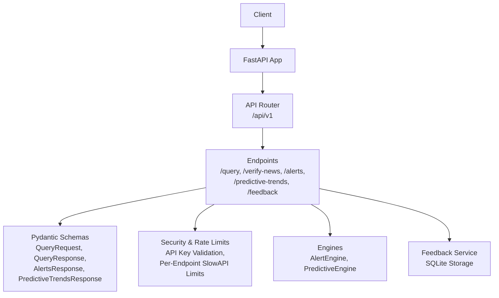
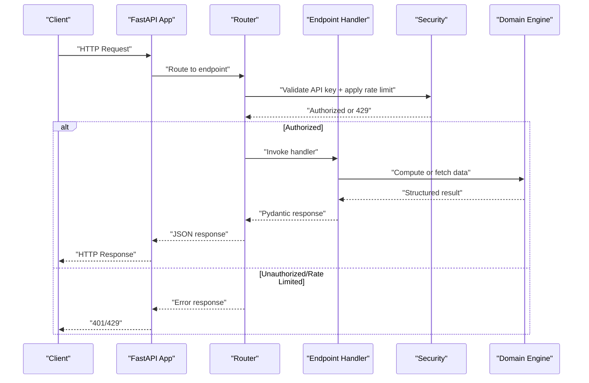
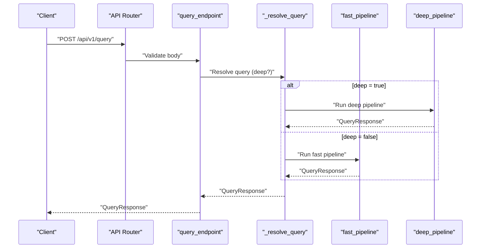
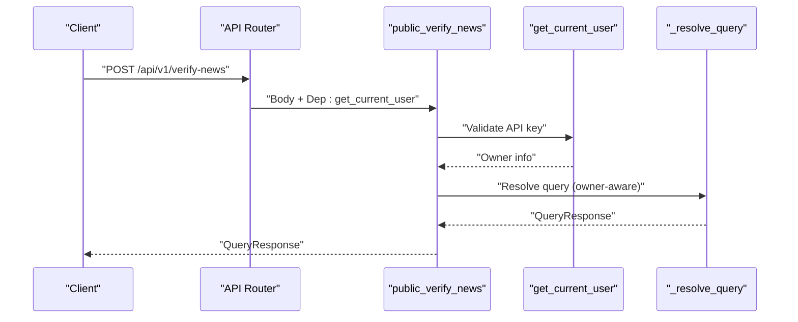
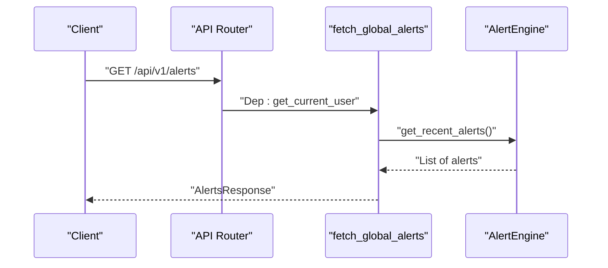
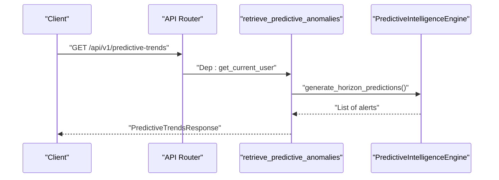
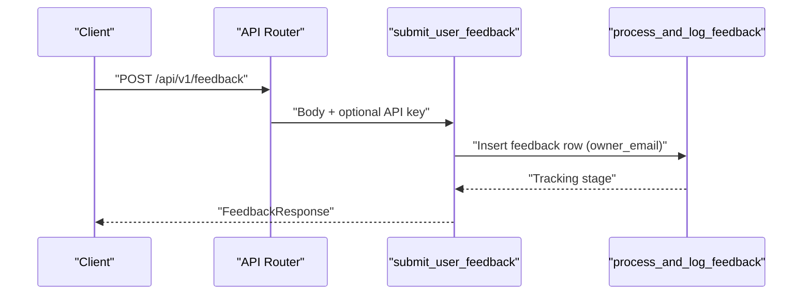
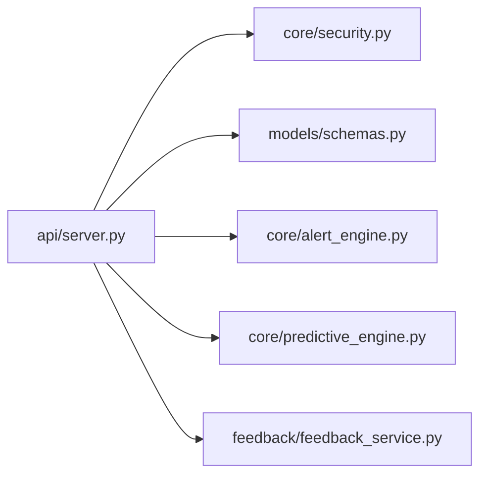

# REST Endpoints

<cite>
**Referenced Files in This Document**
- [main.py](file://main.py)
- [app/main.py](file://app/main.py)
- [api/server.py](file://api/server.py)
- [app/api/routes.py](file://app/api/routes.py)
- [models/schemas.py](file://models/schemas.py)
- [core/security.py](file://core/security.py)
- [core/router.py](file://core/router.py)
- [core/alert_engine.py](file://core/alert_engine.py)
- [core/predictive_engine.py](file://core/predictive_engine.py)
- [feedback/feedback_service.py](file://feedback/feedback_service.py)
- [config/settings.py](file://config/settings.py)
</cite>

## Table of Contents
1. [Introduction](#introduction)
2. [Project Structure](#project-structure)
3. [Core Components](#core-components)
4. [Architecture Overview](#architecture-overview)
5. [Detailed Component Analysis](#detailed-component-analysis)
6. [Dependency Analysis](#dependency-analysis)
7. [Performance Considerations](#performance-considerations)
8. [Troubleshooting Guide](#troubleshooting-guide)
9. [Conclusion](#conclusion)

## Introduction
This document describes the REST API endpoints exposed by Veritas AI’s backend. It focuses on synchronous and asynchronous verification capabilities, anomaly detection, predictive trend analysis, and user telemetry. For each endpoint, you will find request/response schemas, authentication requirements, rate limiting policies, error handling patterns, and practical usage notes.

## Project Structure
The API is implemented using FastAPI and organized into modular components:
- Endpoint definitions and rate limiting are declared in dedicated routers.
- Pydantic models define request/response schemas.
- Security utilities enforce API key validation and per-key rate limiting.
- Dedicated engines implement alerting and predictive analytics.
- Feedback ingestion persists user telemetry.

**Diagram sources**
- [api/server.py:40-214](file://api/server.py#L40-L214)
- [models/schemas.py:10-88](file://models/schemas.py#L10-L88)
- [core/security.py:51-113](file://core/security.py#L51-L113)
- [core/alert_engine.py:17-66](file://core/alert_engine.py#L17-L66)
- [core/predictive_engine.py:33-62](file://core/predictive_engine.py#L33-L62)
- [feedback/feedback_service.py:68-94](file://feedback/feedback_service.py#L68-L94)

**Section sources**
- [api/server.py:40-214](file://api/server.py#L40-L214)
- [models/schemas.py:10-88](file://models/schemas.py#L10-L88)
- [core/security.py:51-113](file://core/security.py#L51-L113)
- [core/alert_engine.py:17-66](file://core/alert_engine.py#L17-L66)
- [core/predictive_engine.py:33-62](file://core/predictive_engine.py#L33-L62)
- [feedback/feedback_service.py:68-94](file://feedback/feedback_service.py#L68-L94)

## Core Components
- Authentication and rate limiting:
  - API key enforcement via header X-API-KEY.
  - Per-endpoint rate limits using SlowAPI decorators.
  - Basic per-key fixed-window rate limiting for free tier.
- Request/response schemas:
  - QueryRequest: query string and deep flag.
  - QueryResponse: structured verification results.
  - AlertsResponse: list of active global anomalies.
  - PredictiveTrendsResponse: predictive trend alerts.
  - FeedbackResponse: telemetry submission outcome.
- Engines:
  - AlertEngine: detects logical contradictions, fake probability spikes, truth score drops, and temporal anomalies.
  - PredictiveIntelligenceEngine: tracks keyword topics over a sliding window and emits trend alerts.

**Section sources**
- [core/security.py:51-113](file://core/security.py#L51-L113)
- [models/schemas.py:10-88](file://models/schemas.py#L10-L88)
- [core/alert_engine.py:26-66](file://core/alert_engine.py#L26-L66)
- [core/predictive_engine.py:10-62](file://core/predictive_engine.py#L10-L62)

## Architecture Overview
The API exposes multiple endpoints under /api/v1. Each endpoint enforces authentication and applies rate limits. Responses are validated against Pydantic models. Engines produce domain-specific outputs (alerts, trends) consumed by the endpoints.

**Diagram sources**
- [api/server.py:81-105](file://api/server.py#L81-L105)
- [core/security.py:51-113](file://core/security.py#L51-L113)
- [models/schemas.py:10-88](file://models/schemas.py#L10-L88)
- [core/alert_engine.py:17-66](file://core/alert_engine.py#L17-L66)
- [core/predictive_engine.py:33-62](file://core/predictive_engine.py#L33-L62)

## Detailed Component Analysis

### /query (Synchronous Claim Verification)
- Purpose: Synchronously verifies a textual claim and returns a structured QueryResponse.
- Method and path: POST /api/v1/query
- Authentication: Optional for this endpoint; no X-API-KEY required.
- Rate limit: 5/minute (SlowAPI decorator).
- Request schema: QueryRequest
  - query: string (required)
  - deep: boolean (optional, default false)
- Response schema: QueryResponse
  - Includes query, summary, facts, sources, contradictions, fake_probability, confidence_score, truth_score, status, explanation, timestamp.
- Processing logic:
  - Executes either fast or deep pipeline depending on deep flag.
  - Returns latency_ms metadata in the resolved response.
- Error handling:
  - 400 if query is empty.
  - 422 for invalid request body.
  - 504 on request timeout.
  - 500 for internal errors.
- Practical usage:
  - Use deep=true for comprehensive multi-source verification.
  - Use deep=false for quick factual checks.

**Diagram sources**
- [api/server.py:81-86](file://api/server.py#L81-L86)
- [api/server.py:53-77](file://api/server.py#L53-L77)
- [models/schemas.py:10-26](file://models/schemas.py#L10-L26)

**Section sources**
- [api/server.py:81-86](file://api/server.py#L81-L86)
- [api/server.py:53-77](file://api/server.py#L53-L77)
- [models/schemas.py:10-26](file://models/schemas.py#L10-L26)
- [main.py:99-119](file://main.py#L99-L119)

### /verify-news (Authenticated News Verification)
- Purpose: Verified news claim checking for authenticated clients.
- Method and path: POST /api/v1/verify-news
- Authentication: Required. Uses X-API-KEY header; validated via get_current_user dependency.
- Rate limit: 100/minute (SlowAPI decorator).
- Request schema: QueryRequest
  - query: string (required)
  - deep: boolean (optional)
- Response schema: QueryResponse
- Processing logic:
  - Extracts owner from API key and passes to resolver.
  - Supports claim or query field in request body.
- Error handling:
  - 401 if missing/invalid API key.
  - 429 if rate limit exceeded.
  - 422 for invalid request body.
  - 500 for internal errors.

**Diagram sources**
- [api/server.py:97-105](file://api/server.py#L97-L105)
- [core/security.py:87-109](file://core/security.py#L87-L109)
- [api/server.py:53-77](file://api/server.py#L53-L77)

**Section sources**
- [api/server.py:97-105](file://api/server.py#L97-L105)
- [core/security.py:87-109](file://core/security.py#L87-L109)
- [models/schemas.py:10-26](file://models/schemas.py#L10-L26)

### /alerts (Global Misinformation Anomaly Detection)
- Purpose: Returns recent global anomalies detected across verified claims.
- Method and path: GET /api/v1/alerts
- Authentication: Required. Uses X-API-KEY header.
- Rate limit: 60/minute (SlowAPI decorator).
- Response schema: AlertsResponse
  - status: "success"
  - active_global_anomalies: array of AlertItem
    - alert_type: string
    - severity: "low" | "medium" | "high"
    - message: string
    - timestamp: ISO string
- Processing logic:
  - Fetches recent alerts from AlertEngine.
- Error handling:
  - 401 if missing/invalid API key.
  - 429 if rate limit exceeded.
  - 500 for internal errors.

**Diagram sources**
- [api/server.py:125-131](file://api/server.py#L125-L131)
- [core/alert_engine.py:17-18](file://core/alert_engine.py#L17-L18)

**Section sources**
- [api/server.py:125-131](file://api/server.py#L125-L131)
- [models/schemas.py:40-50](file://models/schemas.py#L40-L50)
- [core/alert_engine.py:17-66](file://core/alert_engine.py#L17-L66)

### /predictive-trends (Future Risk Assessment)
- Purpose: Provides predictive trend alerts indicating potential misinformation spikes.
- Method and path: GET /api/v1/predictive-trends
- Authentication: Required. Uses X-API-KEY header.
- Rate limit: 30/minute (SlowAPI decorator).
- Response schema: PredictiveTrendsResponse
  - status: "success"
  - timestamp_horizon: string (fixed window label)
  - predictive_alerts: array of PredictiveAlert
    - trend_alert: boolean
    - topic: string
    - risk_level: "medium" | "high"
    - prediction: string
- Processing logic:
  - Calls PredictiveIntelligenceEngine to compute horizon predictions.
- Error handling:
  - 401 if missing/invalid API key.
  - 429 if rate limit exceeded.
  - 500 for internal errors.

**Diagram sources**
- [api/server.py:182-193](file://api/server.py#L182-L193)
- [core/predictive_engine.py:33-59](file://core/predictive_engine.py#L33-L59)

**Section sources**
- [api/server.py:182-193](file://api/server.py#L182-L193)
- [models/schemas.py:52-63](file://models/schemas.py#L52-L63)
- [core/predictive_engine.py:10-62](file://core/predictive_engine.py#L10-L62)

### /feedback (User Telemetry)
- Purpose: Submits user feedback for model improvement and telemetry.
- Method and path: POST /api/v1/feedback
- Authentication: Optional. If X-API-KEY provided, owner is resolved; otherwise treated as public.
- Rate limit: 10/minute (SlowAPI decorator).
- Request schema: UserFeedback
  - query: string
  - original_truth_score: number (0..1; accepts 1..100 and normalizes)
  - user_flag: "correct" | "incorrect" | "bias_disagreement"
  - user_corrected_score: optional number (0..1)
  - comments: string
- Response schema: FeedbackResponse
  - status: "success" | "error" | "no_updates"
  - tracking_stage: optional string
  - message: optional string
- Processing logic:
  - Persists feedback to SQLite with owner_email.
- Error handling:
  - 429 if rate limit exceeded.
  - 500 for internal errors.

**Diagram sources**
- [api/server.py:153-165](file://api/server.py#L153-L165)
- [feedback/feedback_service.py:68-94](file://feedback/feedback_service.py#L68-L94)

**Section sources**
- [api/server.py:153-165](file://api/server.py#L153-L165)
- [models/schemas.py:34-38](file://models/schemas.py#L34-L38)
- [feedback/feedback_service.py:15-31](file://feedback/feedback_service.py#L15-L31)
- [feedback/feedback_service.py:68-94](file://feedback/feedback_service.py#L68-L94)

## Dependency Analysis
- Endpoint decorators:
  - @limiter.limit(...) applied per endpoint to enforce rate quotas.
- Security:
  - get_current_user resolves owner from API key and enforces authentication.
  - validate_api_key enforces per-key fixed-window rate limiting.
- Schemas:
  - Pydantic models validate inputs and serialize outputs.
- Engines:
  - AlertEngine and PredictiveIntelligenceEngine encapsulate domain logic.

**Diagram sources**
- [api/server.py:20-37](file://api/server.py#L20-L37)
- [core/security.py:51-113](file://core/security.py#L51-L113)
- [models/schemas.py:10-88](file://models/schemas.py#L10-L88)
- [core/alert_engine.py:17-66](file://core/alert_engine.py#L17-L66)
- [core/predictive_engine.py:33-62](file://core/predictive_engine.py#L33-L62)
- [feedback/feedback_service.py:68-94](file://feedback/feedback_service.py#L68-L94)

**Section sources**
- [api/server.py:20-37](file://api/server.py#L20-L37)
- [core/security.py:51-113](file://core/security.py#L51-L113)
- [models/schemas.py:10-88](file://models/schemas.py#L10-L88)
- [core/alert_engine.py:17-66](file://core/alert_engine.py#L17-L66)
- [core/predictive_engine.py:33-62](file://core/predictive_engine.py#L33-L62)
- [feedback/feedback_service.py:68-94](file://feedback/feedback_service.py#L68-L94)

## Performance Considerations
- Pipeline routing:
  - The system routes queries to fast or deep pipelines based on classification and caching to minimize latency.
- Caching:
  - Local and Redis caches reduce repeated computation.
- Streaming:
  - WebSocket endpoints support streaming updates for interactive experiences.
- Timeouts:
  - Global request timeouts prevent long-running requests from blocking resources.

[No sources needed since this section provides general guidance]

## Troubleshooting Guide
- Authentication failures:
  - 401 Unauthorized: Missing or invalid X-API-KEY.
  - Verify API key presence and validity; check environment variables for configured keys.
- Rate limiting:
  - 429 Too Many Requests: Exceeded endpoint quota or per-key limit.
  - Reduce request frequency or upgrade tier.
- Validation errors:
  - 422 Unprocessable Entity: Request body failed schema validation.
  - Ensure required fields are present and types match schemas.
- Timeouts:
  - 504 Gateway Timeout: Request exceeded configured timeout.
  - Retry with smaller payloads or simpler queries.
- Internal errors:
  - 500 Internal Server Error: Unexpected exception.
  - Check logs for stack traces and retry after system recovery.

**Section sources**
- [core/security.py:51-84](file://core/security.py#L51-L84)
- [app/main.py:126-151](file://app/main.py#L126-L151)
- [main.py:99-119](file://main.py#L99-L119)

## Conclusion
Veritas AI’s REST API provides authenticated and rate-limited endpoints for claim verification, anomaly detection, predictive trend analysis, and user telemetry. Schemas ensure robust request/response contracts, while security utilities and engines deliver reliable, scalable behavior. Use the provided schemas and rate limits to integrate efficiently and responsibly.