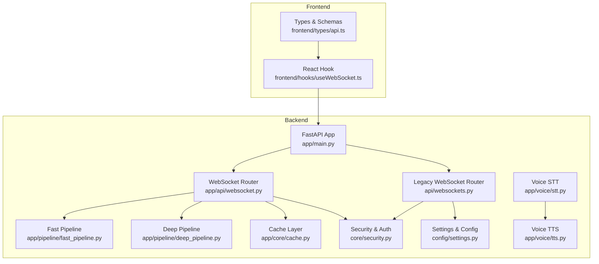
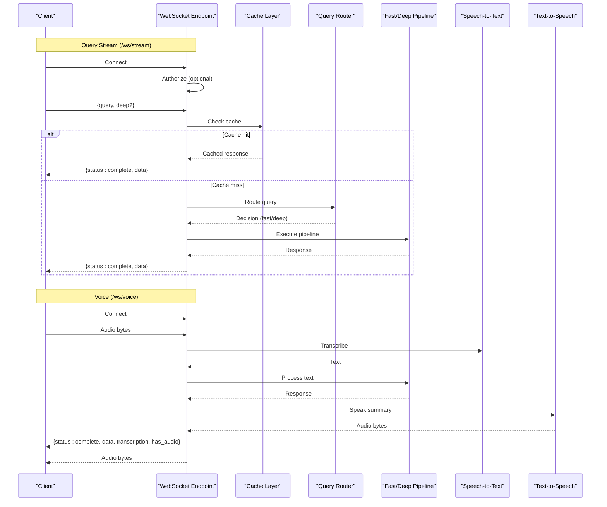
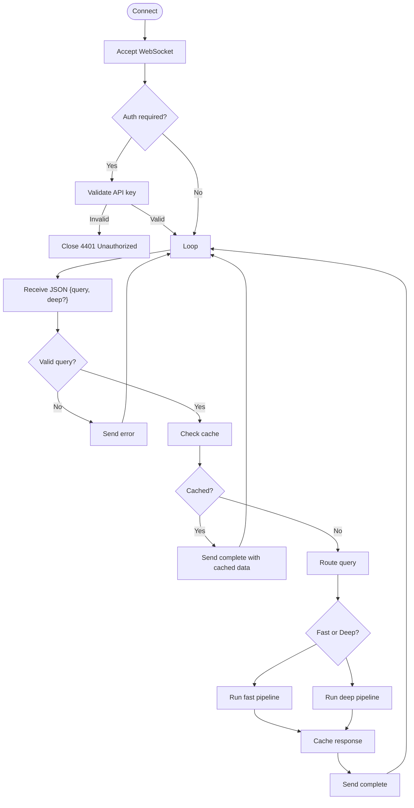
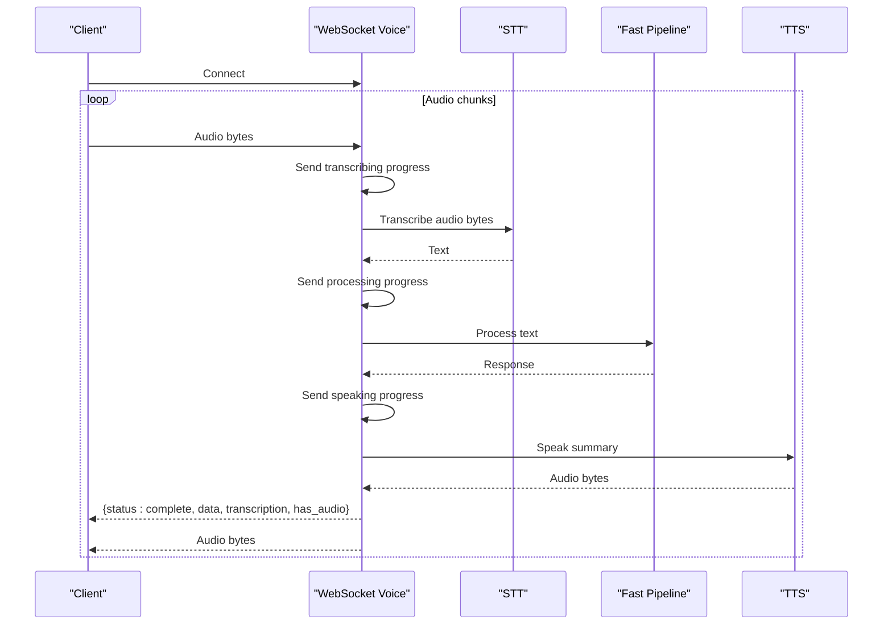
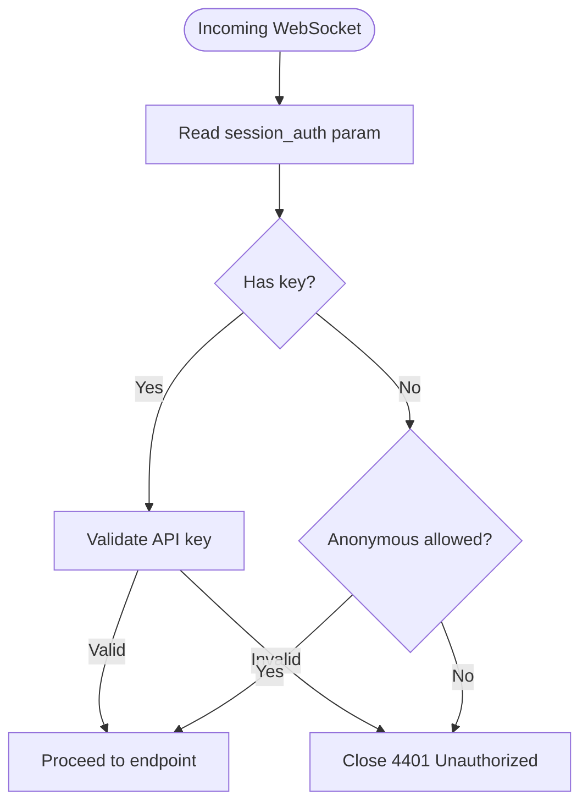
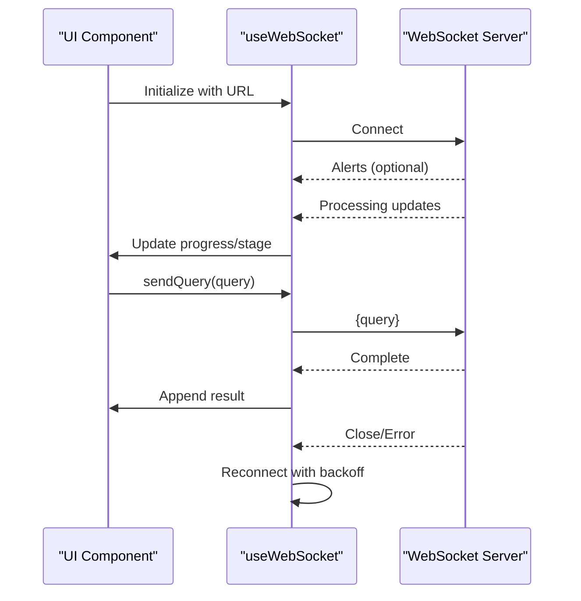
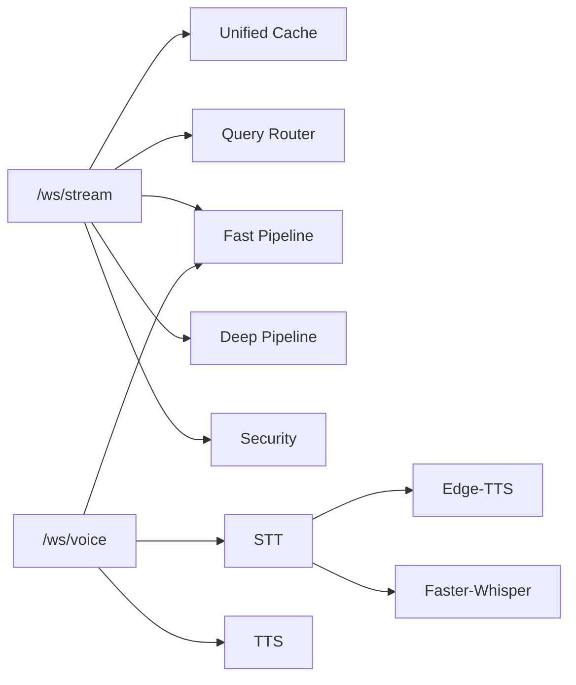

# WebSocket Endpoints

<cite>
**Referenced Files in This Document**
- [websocket.py](file://veritas-ai/app/api/websocket.py)
- [websockets.py](file://veritas-ai/api/websockets.py)
- [stt.py](file://veritas-ai/app/voice/stt.py)
- [tts.py](file://veritas-ai/app/voice/tts.py)
- [fast_pipeline.py](file://veritas-ai/app/pipeline/fast_pipeline.py)
- [deep_pipeline.py](file://veritas-ai/app/pipeline/deep_pipeline.py)
- [useWebSocket.ts](file://veritas-ai/frontend/hooks/useWebSocket.ts)
- [api.ts](file://veritas-ai/frontend/types/api.ts)
- [security.py](file://veritas-ai/core/security.py)
- [settings.py](file://veritas-ai/config/settings.py)
- [cache.py](file://veritas-ai/app/core/cache.py)
- [main.py](file://veritas-ai/app/main.py)
</cite>

## Table of Contents
1. [Introduction](#introduction)
2. [Project Structure](#project-structure)
3. [Core Components](#core-components)
4. [Architecture Overview](#architecture-overview)
5. [Detailed Component Analysis](#detailed-component-analysis)
6. [Dependency Analysis](#dependency-analysis)
7. [Performance Considerations](#performance-considerations)
8. [Troubleshooting Guide](#troubleshooting-guide)
9. [Conclusion](#conclusion)
10. [Appendices](#appendices)

## Introduction
This document describes Veritas AI’s WebSocket API endpoints for real-time interaction. It focuses on two primary endpoints:
- /ws/stream: Real-time query processing with progressive status updates and completion messages.
- /ws/voice: Voice-to-text-to-speech processing with audio byte transmission, transcription workflow, and speech synthesis.

It explains connection handling, message formats, authentication, real-time interaction patterns, error handling, binary audio data transmission, and practical integration examples. It also covers connection lifecycle management, heartbeat considerations, and performance characteristics.

## Project Structure
The WebSocket endpoints are implemented in the application layer and integrated with FastAPI. The voice pipeline integrates STT and TTS modules, while the query pipeline integrates retrieval, validation, and response agents. Frontend utilities demonstrate client-side handling of streaming messages and reconnection logic.

**Diagram sources**
- [main.py:106-208](file://veritas-ai/app/main.py#L106-L208)
- [websocket.py:63-165](file://veritas-ai/app/api/websocket.py#L63-L165)
- [websockets.py:112-234](file://veritas-ai/api/websockets.py#L112-L234)
- [stt.py:52-60](file://veritas-ai/app/voice/stt.py#L52-L60)
- [tts.py:32-68](file://veritas-ai/app/voice/tts.py#L32-L68)
- [fast_pipeline.py:13-49](file://veritas-ai/app/pipeline/fast_pipeline.py#L13-L49)
- [deep_pipeline.py:13-43](file://veritas-ai/app/pipeline/deep_pipeline.py#L13-L43)
- [security.py:51-84](file://veritas-ai/core/security.py#L51-L84)
- [settings.py:13-83](file://veritas-ai/config/settings.py#L13-L83)
- [cache.py:15-172](file://veritas-ai/app/core/cache.py#L15-L172)
- [useWebSocket.ts:15-143](file://veritas-ai/frontend/hooks/useWebSocket.ts#L15-L143)
- [api.ts:56-66](file://veritas-ai/frontend/types/api.ts#L56-L66)

**Section sources**
- [main.py:106-208](file://veritas-ai/app/main.py#L106-L208)
- [websocket.py:63-165](file://veritas-ai/app/api/websocket.py#L63-L165)
- [websockets.py:112-234](file://veritas-ai/api/websockets.py#L112-L234)

## Core Components
- WebSocket routers:
  - Legacy router: Provides /ws/stream with advanced routing and multi-agent pipelines.
  - New router: Provides /ws/stream and /ws/voice with simplified logic and STT/TTS integration.
- Voice processing:
  - Speech-to-text (STT) using Faster-Whisper with lazy model loading.
  - Text-to-speech (TTS) using Edge-TTS with configurable voices.
- Pipelines:
  - Fast pipeline: Parallel retrieval and validation with quick response.
  - Deep pipeline: Thorough analysis with source collection and cross-validation.
- Authentication:
  - API key validation for WebSocket connections via query parameter.
- Caching:
  - Unified cache with local and Redis tiers for query responses.
- Frontend utilities:
  - React hook for connecting, receiving streaming messages, and reconnecting.

**Section sources**
- [websockets.py:112-234](file://veritas-ai/api/websockets.py#L112-L234)
- [websocket.py:169-253](file://veritas-ai/app/api/websocket.py#L169-L253)
- [stt.py:52-60](file://veritas-ai/app/voice/stt.py#L52-L60)
- [tts.py:32-68](file://veritas-ai/app/voice/tts.py#L32-L68)
- [fast_pipeline.py:13-49](file://veritas-ai/app/pipeline/fast_pipeline.py#L13-L49)
- [deep_pipeline.py:13-43](file://veritas-ai/app/pipeline/deep_pipeline.py#L13-L43)
- [security.py:51-84](file://veritas-ai/core/security.py#L51-L84)
- [cache.py:15-172](file://veritas-ai/app/core/cache.py#L15-L172)
- [useWebSocket.ts:15-143](file://veritas-ai/frontend/hooks/useWebSocket.ts#L15-L143)

## Architecture Overview
The WebSocket architecture separates concerns between:
- Connection lifecycle: accept, authorize, stream progress, and handle disconnects.
- Query processing: cache checks, routing, pipeline execution, and completion.
- Voice processing: receive audio bytes, transcribe, run pipeline, synthesize speech, and return audio.

**Diagram sources**
- [websockets.py:112-234](file://veritas-ai/api/websockets.py#L112-L234)
- [websocket.py:169-253](file://veritas-ai/app/api/websocket.py#L169-L253)
- [stt.py:52-60](file://veritas-ai/app/voice/stt.py#L52-L60)
- [tts.py:32-68](file://veritas-ai/app/voice/tts.py#L32-L68)
- [fast_pipeline.py:13-49](file://veritas-ai/app/pipeline/fast_pipeline.py#L13-L49)
- [deep_pipeline.py:13-43](file://veritas-ai/app/pipeline/deep_pipeline.py#L13-L43)
- [cache.py:66-115](file://veritas-ai/app/core/cache.py#L66-L115)

## Detailed Component Analysis

### /ws/stream (Query Streaming)
- Purpose: Real-time query processing with progressive status updates and completion.
- Connection handling:
  - Accepts WebSocket connections.
  - Optional authentication via query parameter; otherwise anonymous access depends on settings.
- Message formats:
  - Incoming: { query: string, deep?: boolean }
  - Outgoing:
    - Processing: { status: "processing", stage: string, progress: number, message: string }
    - Complete: { status: "complete", data: QueryResponse, progress: 100 }
    - Error: { status: "error", error: { message: string } }
- Processing stages and progress:
  - Stage mapping defines incremental progress values for each phase.
- Pipeline selection:
  - Routes to fast or deep pipeline depending on query and route decision.
- Caching:
  - Checks unified cache before processing; serves cached results immediately when available.
- Error handling:
  - Handles invalid JSON, empty queries, timeouts, and internal errors.

**Diagram sources**
- [websockets.py:112-234](file://veritas-ai/api/websockets.py#L112-L234)
- [websocket.py:63-165](file://veritas-ai/app/api/websocket.py#L63-L165)
- [cache.py:66-115](file://veritas-ai/app/core/cache.py#L66-L115)

**Section sources**
- [websockets.py:112-234](file://veritas-ai/api/websockets.py#L112-L234)
- [websocket.py:63-165](file://veritas-ai/app/api/websocket.py#L63-L165)
- [cache.py:66-115](file://veritas-ai/app/core/cache.py#L66-L115)

### /ws/voice (Voice-to-Text-to-Speech)
- Purpose: Real-time voice processing with audio byte transmission, transcription, pipeline execution, and synthesized speech delivery.
- Connection handling:
  - Accepts WebSocket connections.
  - Receives audio bytes continuously; sends progress updates during transcription and synthesis.
- Message formats:
  - Incoming: Audio bytes (binary)
  - Outgoing:
    - Processing: { status: "processing", stage: "transcribing"|"processing"|"speaking", progress: number, message: string, transcription?: string }
    - Complete: { status: "complete", data: QueryResponse, progress: 100, message: "Complete", transcription: string, has_audio: boolean }
    - Error: { status: "error", error: { message: string } }
- Processing flow:
  - Receives audio bytes.
  - Transcribes to text using STT.
  - Executes fast pipeline on text.
  - Synthesizes speech using TTS.
  - Sends JSON completion and audio bytes separately.

**Diagram sources**
- [websocket.py:169-253](file://veritas-ai/app/api/websocket.py#L169-L253)
- [stt.py:52-60](file://veritas-ai/app/voice/stt.py#L52-L60)
- [tts.py:32-68](file://veritas-ai/app/voice/tts.py#L32-L68)
- [fast_pipeline.py:13-49](file://veritas-ai/app/pipeline/fast_pipeline.py#L13-L49)

**Section sources**
- [websocket.py:169-253](file://veritas-ai/app/api/websocket.py#L169-L253)
- [stt.py:52-60](file://veritas-ai/app/voice/stt.py#L52-L60)
- [tts.py:32-68](file://veritas-ai/app/voice/tts.py#L32-L68)
- [fast_pipeline.py:13-49](file://veritas-ai/app/pipeline/fast_pipeline.py#L13-L49)

### Authentication and Authorization
- Query endpoint:
  - Optional authentication via query parameter; if required and missing, closes with 4401.
- Security:
  - Validates API key against in-memory registry with rate-limit enforcement.
- Configuration:
  - Anonymous WebSocket access controlled by settings flag.

**Diagram sources**
- [websockets.py:79-86](file://veritas-ai/api/websockets.py#L79-L86)
- [security.py:51-84](file://veritas-ai/core/security.py#L51-L84)
- [settings.py:29-32](file://veritas-ai/config/settings.py#L29-L32)

**Section sources**
- [websockets.py:79-86](file://veritas-ai/api/websockets.py#L79-L86)
- [security.py:51-84](file://veritas-ai/core/security.py#L51-L84)
- [settings.py:29-32](file://veritas-ai/config/settings.py#L29-L32)

### Client Integration Patterns
- Frontend hook behavior:
  - Establishes WebSocket connection, parses incoming messages, tracks progress and stage, handles alerts, and reconnects on disconnect.
  - Sends query payload as JSON and resets UI state before transmission.
- Message handling:
  - Processes status: "processing", "complete", "error", "alert".
  - Updates UI with progress percentage and current stage.
- Reconnection:
  - Exponential backoff with upper bound and controlled cancellation on unmount.

**Diagram sources**
- [useWebSocket.ts:15-143](file://veritas-ai/frontend/hooks/useWebSocket.ts#L15-L143)
- [api.ts:56-66](file://veritas-ai/frontend/types/api.ts#L56-L66)

**Section sources**
- [useWebSocket.ts:15-143](file://veritas-ai/frontend/hooks/useWebSocket.ts#L15-L143)
- [api.ts:56-66](file://veritas-ai/frontend/types/api.ts#L56-L66)

## Dependency Analysis
- Endpoint-to-module dependencies:
  - Query endpoint depends on routing, pipelines, cache, and security.
  - Voice endpoint depends on STT, TTS, and fast pipeline.
- Coupling and cohesion:
  - Endpoints are cohesive around a single responsibility (streaming or voice).
  - Pipelines encapsulate agent orchestration, reducing endpoint coupling.
- External dependencies:
  - Redis for distributed caching.
  - Edge-TTS and Faster-Whisper for audio processing.
  - API key validation for access control.

**Diagram sources**
- [websockets.py:112-234](file://veritas-ai/api/websockets.py#L112-L234)
- [websocket.py:169-253](file://veritas-ai/app/api/websocket.py#L169-L253)
- [stt.py:52-60](file://veritas-ai/app/voice/stt.py#L52-L60)
- [tts.py:32-68](file://veritas-ai/app/voice/tts.py#L32-L68)
- [fast_pipeline.py:13-49](file://veritas-ai/app/pipeline/fast_pipeline.py#L13-L49)
- [deep_pipeline.py:13-43](file://veritas-ai/app/pipeline/deep_pipeline.py#L13-L43)
- [cache.py:15-172](file://veritas-ai/app/core/cache.py#L15-L172)
- [security.py:51-84](file://veritas-ai/core/security.py#L51-L84)

**Section sources**
- [websockets.py:112-234](file://veritas-ai/api/websockets.py#L112-L234)
- [websocket.py:169-253](file://veritas-ai/app/api/websocket.py#L169-L253)
- [stt.py:52-60](file://veritas-ai/app/voice/stt.py#L52-L60)
- [tts.py:32-68](file://veritas-ai/app/voice/tts.py#L32-L68)
- [fast_pipeline.py:13-49](file://veritas-ai/app/pipeline/fast_pipeline.py#L13-L49)
- [deep_pipeline.py:13-43](file://veritas-ai/app/pipeline/deep_pipeline.py#L13-L43)
- [cache.py:15-172](file://veritas-ai/app/core/cache.py#L15-L172)
- [security.py:51-84](file://veritas-ai/core/security.py#L51-L84)

## Performance Considerations
- Caching:
  - Unified cache reduces latency for repeated queries; local and Redis tiers improve availability and throughput.
- Asynchronous processing:
  - STT and TTS run off the event loop using threads to prevent blocking.
- Parallelization:
  - Fast pipeline executes retrieval and validation concurrently.
- Timeouts and limits:
  - Global request timeout middleware prevents long-running requests.
- Backpressure:
  - Client-side buffering and reconnection help manage transient failures.

[No sources needed since this section provides general guidance]

## Troubleshooting Guide
- Connection refused or unauthorized:
  - Verify API key presence and validity when authentication is required.
  - Check settings for anonymous WebSocket access.
- No progress updates:
  - Ensure client listens for "processing" messages and updates UI accordingly.
  - Confirm endpoint is reachable and not blocked by CORS.
- Voice endpoint issues:
  - STT/TTS dependencies must be installed; otherwise endpoints return empty audio or errors.
  - Audio bytes must be valid; malformed audio may cause transcription failures.
- Disconnections:
  - Client hook implements exponential backoff; confirm automatic reconnect behavior.
- Error messages:
  - Server responds with structured error payloads; log and surface messages to users.

**Section sources**
- [websockets.py:79-86](file://veritas-ai/api/websockets.py#L79-L86)
- [websocket.py:169-253](file://veritas-ai/app/api/websocket.py#L169-L253)
- [stt.py:52-60](file://veritas-ai/app/voice/stt.py#L52-L60)
- [tts.py:32-68](file://veritas-ai/app/voice/tts.py#L32-L68)
- [useWebSocket.ts:81-96](file://veritas-ai/frontend/hooks/useWebSocket.ts#L81-L96)

## Conclusion
Veritas AI’s WebSocket endpoints provide robust, real-time capabilities for query processing and voice interaction. The design emphasizes progressive status reporting, resilient caching, asynchronous processing, and clear client integration patterns. By following the documented message formats, authentication steps, and client behaviors, integrators can build responsive, reliable real-time applications.

[No sources needed since this section summarizes without analyzing specific files]

## Appendices

### Endpoint Reference

- /ws/stream
  - Method: WebSocket
  - Path: /ws/stream
  - Authentication: Optional via query parameter; configurable
  - Messages:
    - Incoming: { query: string, deep?: boolean }
    - Outgoing: processing, complete, error
  - Typical stages: cache_check, routing, data_collection, parallel_agents, verification, fact_check, misinformation, scoring, finalizing, complete

- /ws/voice
  - Method: WebSocket
  - Path: /ws/voice
  - Authentication: Optional via query parameter; configurable
  - Messages:
    - Incoming: Audio bytes (binary)
    - Outgoing: processing, complete, error
  - Typical stages: transcribing, processing, speaking

**Section sources**
- [websockets.py:112-234](file://veritas-ai/api/websockets.py#L112-L234)
- [websocket.py:169-253](file://veritas-ai/app/api/websocket.py#L169-L253)

### Message Schema Reference

- WebSocketMessage
  - status: "processing" | "complete" | "alert" | "error"
  - stage?: string
  - progress?: number
  - message?: string
  - data?: QueryResponse | AlertItem
  - error?: { message: string } | string
  - transcription?: string
  - has_audio?: boolean

- QueryResponse
  - query: string
  - summary: string
  - facts: string[]
  - sources: Source[]
  - contradictions: string[]
  - fake_probability: number
  - confidence_score: number
  - truth_score: number
  - status: "verified" | "likely_false" | "uncertain"
  - explanation?: Explanation | null
  - timestamp: string
  - _cached?: boolean
  - latency_ms?: number

**Section sources**
- [api.ts:56-66](file://veritas-ai/frontend/types/api.ts#L56-L66)
- [api.ts:19-33](file://veritas-ai/frontend/types/api.ts#L19-L33)