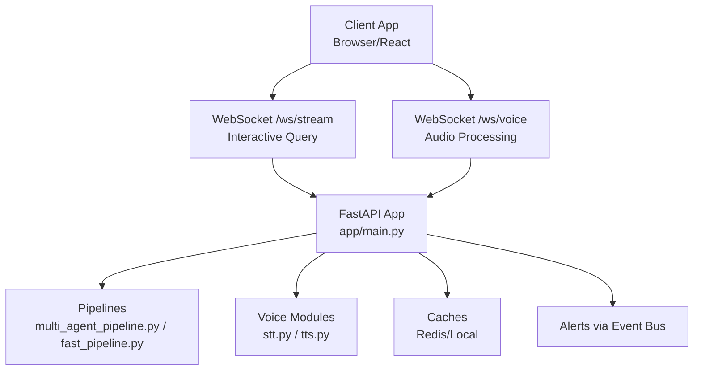
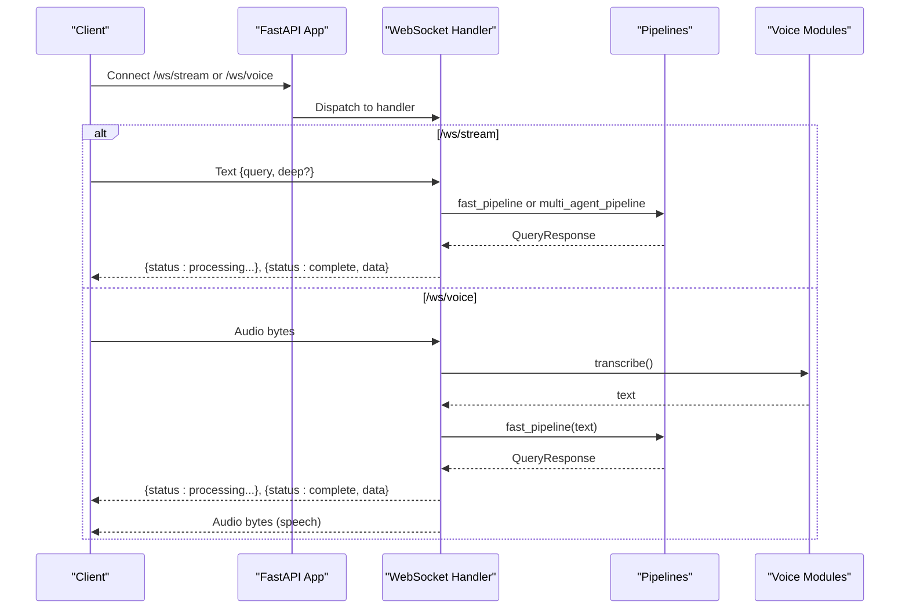
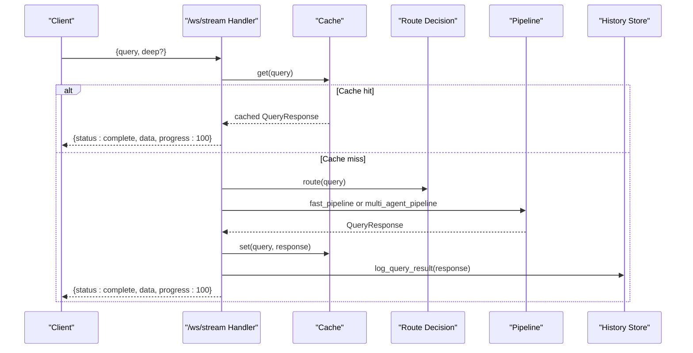
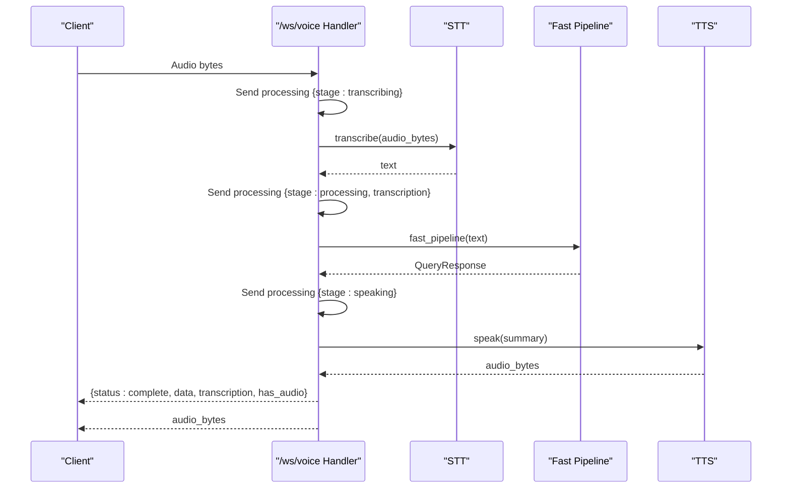
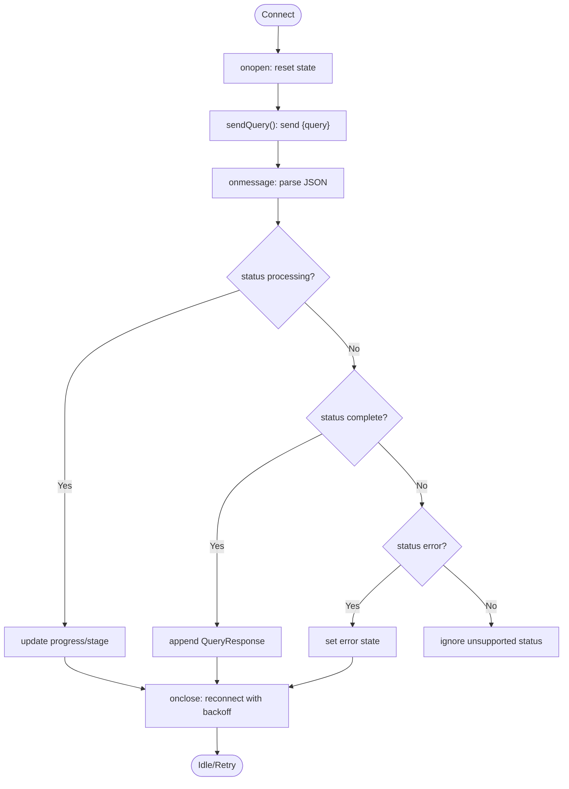
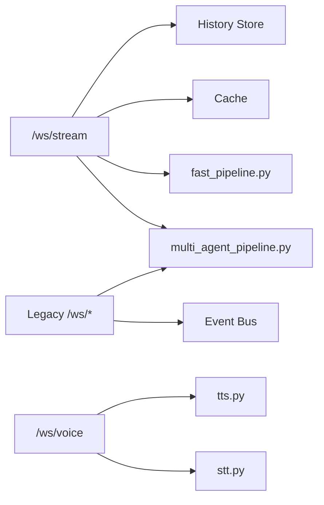

# WebSocket APIs

<cite>
**Referenced Files in This Document**
- [websocket.py](file://veritas-ai/app/api/websocket.py)
- [websockets.py](file://veritas-ai/api/websockets.py)
- [useWebSocket.ts](file://veritas-ai/frontend/hooks/useWebSocket.ts)
- [api.ts](file://veritas-ai/frontend/types/api.ts)
- [stt.py](file://veritas-ai/app/voice/stt.py)
- [tts.py](file://veritas-ai/app/voice/tts.py)
- [listener.py](file://veritas-ai/app/voice/listener.py)
- [multi_agent_pipeline.py](file://veritas-ai/pipelines/multi_agent_pipeline.py)
- [fast_pipeline.py](file://veritas-ai/pipelines/fast_pipeline.py)
- [schemas.py](file://veritas-ai/models/schemas.py)
- [main.py](file://veritas-ai/app/main.py)
</cite>

## Table of Contents
1. [Introduction](#introduction)
2. [Project Structure](#project-structure)
3. [Core Components](#core-components)
4. [Architecture Overview](#architecture-overview)
5. [Detailed Component Analysis](#detailed-component-analysis)
6. [Dependency Analysis](#dependency-analysis)
7. [Performance Considerations](#performance-considerations)
8. [Troubleshooting Guide](#troubleshooting-guide)
9. [Conclusion](#conclusion)
10. [Appendices](#appendices)

## Introduction
This document specifies the WebSocket APIs for real-time communication in Veritas AI. It covers two primary endpoints:
- /ws/stream: Interactive query processing with progressive result delivery, stage notifications, and performance metrics.
- /ws/voice: Audio-to-text-to-speech processing with real-time transcription, fast verification, and synthesized speech output.

It also documents connection establishment, message formats, event-driven patterns, error handling, and client implementation guidelines, including examples of bidirectional communication, progress tracking, and audio streaming integration.

## Project Structure
The WebSocket endpoints are implemented in the application layer and integrated with FastAPI. The frontend provides a reusable React hook for connecting and consuming messages. Voice processing integrates STT and TTS modules.

**Diagram sources**
- [websocket.py:63-165](file://veritas-ai/app/api/websocket.py#L63-L165)
- [websockets.py:112-234](file://veritas-ai/api/websockets.py#L112-L234)
- [main.py:204-208](file://veritas-ai/app/main.py#L204-L208)

**Section sources**
- [websocket.py:1-253](file://veritas-ai/app/api/websocket.py#L1-L253)
- [websockets.py:1-234](file://veritas-ai/api/websockets.py#L1-L234)
- [main.py:204-208](file://veritas-ai/app/main.py#L204-L208)

## Core Components
- WebSocket routers and endpoints:
  - /ws/stream: Progressive query processing with structured progress updates and completion payloads.
  - /ws/voice: Audio byte streaming with transcription, fast pipeline processing, and synthesized audio delivery.
- Message format:
  - Standardized JSON payloads with status, stage, progress, message, optional data/error, and specialized fields for voice responses.
- Client integration:
  - React hook manages connection lifecycle, progress tracking, and error propagation.

Key implementation references:
- WebSocket handlers and helpers: [websocket.py:24-165](file://veritas-ai/app/api/websocket.py#L24-L165)
- Legacy WebSocket handler with authorization and multi-agent pipeline: [websockets.py:112-234](file://veritas-ai/api/websockets.py#L112-L234)
- Client-side WebSocket consumer: [useWebSocket.ts:15-143](file://veritas-ai/frontend/hooks/useWebSocket.ts#L15-L143)
- Message schema: [api.ts:56-66](file://veritas-ai/frontend/types/api.ts#L56-L66)

**Section sources**
- [websocket.py:24-165](file://veritas-ai/app/api/websocket.py#L24-L165)
- [websockets.py:38-234](file://veritas-ai/api/websockets.py#L38-L234)
- [useWebSocket.ts:15-143](file://veritas-ai/frontend/hooks/useWebSocket.ts#L15-L143)
- [api.ts:56-66](file://veritas-ai/frontend/types/api.ts#L56-L66)

## Architecture Overview
The WebSocket endpoints are mounted on the FastAPI application and delegate to internal pipelines and voice modules. The legacy handler supports authorization and advanced multi-agent orchestration, while the newer handler focuses on streamlined streaming.

**Diagram sources**
- [websocket.py:63-165](file://veritas-ai/app/api/websocket.py#L63-L165)
- [websockets.py:112-234](file://veritas-ai/api/websockets.py#L112-L234)
- [stt.py:52-60](file://veritas-ai/app/voice/stt.py#L52-L60)
- [tts.py:32-68](file://veritas-ai/app/voice/tts.py#L32-L68)
- [multi_agent_pipeline.py:209-298](file://veritas-ai/pipelines/multi_agent_pipeline.py#L209-L298)
- [fast_pipeline.py:8-22](file://veritas-ai/pipelines/fast_pipeline.py#L8-L22)

## Detailed Component Analysis

### /ws/stream: Interactive Query Processing
Purpose:
- Accepts a query and optional deep flag.
- Streams structured progress updates across stages.
- Returns a complete response upon completion and logs performance metrics.

Message flow:
- Receive: Text payload containing the query and optional deep flag.
- Send: Zero or more progress messages with stage, progress percentage, and message.
- Complete: Final message with status complete and the QueryResponse payload.

Error handling:
- Invalid JSON, missing query, timeouts, and internal exceptions are reported as error messages.

Performance:
- Latency is computed and included in the final response.

**Diagram sources**
- [websocket.py:63-165](file://veritas-ai/app/api/websocket.py#L63-L165)
- [multi_agent_pipeline.py:209-298](file://veritas-ai/pipelines/multi_agent_pipeline.py#L209-L298)
- [fast_pipeline.py:8-22](file://veritas-ai/pipelines/fast_pipeline.py#L8-L22)

**Section sources**
- [websocket.py:63-165](file://veritas-ai/app/api/websocket.py#L63-L165)
- [schemas.py:14-26](file://veritas-ai/models/schemas.py#L14-L26)

### /ws/voice: Audio-to-Text-to-Speech Processing
Purpose:
- Receive continuous audio bytes from the client.
- Transcribe speech to text, run a fast verification pipeline, synthesize speech, and stream audio back.

Message flow:
- Receive: Audio bytes.
- Progress: Transcription and processing stages.
- Complete: JSON with QueryResponse and flags indicating transcription and audio availability.
- Audio: Binary audio bytes sent separately after the JSON completion message.

**Diagram sources**
- [websocket.py:169-253](file://veritas-ai/app/api/websocket.py#L169-L253)
- [stt.py:52-60](file://veritas-ai/app/voice/stt.py#L52-L60)
- [tts.py:32-68](file://veritas-ai/app/voice/tts.py#L32-L68)
- [fast_pipeline.py:8-22](file://veritas-ai/pipelines/fast_pipeline.py#L8-L22)

**Section sources**
- [websocket.py:169-253](file://veritas-ai/app/api/websocket.py#L169-L253)
- [stt.py:1-60](file://veritas-ai/app/voice/stt.py#L1-L60)
- [tts.py:1-68](file://veritas-ai/app/voice/tts.py#L1-L68)
- [fast_pipeline.py:1-22](file://veritas-ai/pipelines/fast_pipeline.py#L1-L22)

### Client Implementation Guidelines
Connection establishment:
- Use the React hook to manage WebSocket lifecycle, reconnection, and state.
- The hook parses incoming messages and updates progress, stage, and error states.

Bidirectional communication:
- Send a text payload with the query to /ws/stream.
- For /ws/voice, send audio bytes continuously; the server will respond with interleaved progress messages and final results.

Progress tracking:
- Monitor status processing messages for stage and progress updates.
- On completion, the client receives the QueryResponse payload.

Audio streaming integration:
- After the completion message, the server sends synthesized audio bytes separately.
- Ensure the client handles mixed JSON and binary frames.

**Diagram sources**
- [useWebSocket.ts:29-143](file://veritas-ai/frontend/hooks/useWebSocket.ts#L29-L143)
- [api.ts:56-66](file://veritas-ai/frontend/types/api.ts#L56-L66)

**Section sources**
- [useWebSocket.ts:15-143](file://veritas-ai/frontend/hooks/useWebSocket.ts#L15-L143)
- [api.ts:56-66](file://veritas-ai/frontend/types/api.ts#L56-L66)

## Dependency Analysis
The WebSocket endpoints depend on:
- Pipelines for query processing.
- Voice modules for transcription and synthesis.
- Caches for performance and history logging.
- Event bus for alerts (legacy handler).

**Diagram sources**
- [websocket.py:12-15](file://veritas-ai/app/api/websocket.py#L12-L15)
- [websockets.py:11-18](file://veritas-ai/api/websockets.py#L11-L18)
- [multi_agent_pipeline.py:1-32](file://veritas-ai/pipelines/multi_agent_pipeline.py#L1-L32)
- [fast_pipeline.py:1-22](file://veritas-ai/pipelines/fast_pipeline.py#L1-L22)
- [stt.py:1-60](file://veritas-ai/app/voice/stt.py#L1-L60)
- [tts.py:1-68](file://veritas-ai/app/voice/tts.py#L1-L68)

**Section sources**
- [websocket.py:12-15](file://veritas-ai/app/api/websocket.py#L12-L15)
- [websockets.py:11-18](file://veritas-ai/api/websockets.py#L11-L18)
- [multi_agent_pipeline.py:1-32](file://veritas-ai/pipelines/multi_agent_pipeline.py#L1-L32)
- [fast_pipeline.py:1-22](file://veritas-ai/pipelines/fast_pipeline.py#L1-L22)
- [stt.py:1-60](file://veritas-ai/app/voice/stt.py#L1-L60)
- [tts.py:1-68](file://veritas-ai/app/voice/tts.py#L1-L68)

## Performance Considerations
- Streaming progress: The server emits incremental progress updates to keep clients responsive.
- Caching: Both cache layers reduce latency for repeated queries.
- Asynchronous execution: Pipelines and voice operations run asynchronously to avoid blocking the event loop.
- Backpressure: Clients should throttle audio sending for /ws/voice to match server processing capacity.

[No sources needed since this section provides general guidance]

## Troubleshooting Guide
Common issues and resolutions:
- Invalid JSON or missing query:
  - The server responds with an error message. Ensure the payload is valid JSON and includes the query field.
- Authentication failures (legacy handler):
  - The legacy handler enforces session authentication via query parameters. Provide a valid session token or enable anonymous access as configured.
- Transcription failures:
  - If transcription returns empty text, the server reports an error. Verify audio quality and codec.
- Timeout errors:
  - Long-running pipelines may time out. Retry with a simpler query or adjust server-side timeouts.
- Audio streaming:
  - Ensure the client reads both JSON and binary frames. The completion message is followed by audio bytes.

**Section sources**
- [websocket.py:81-98](file://veritas-ai/app/api/websocket.py#L81-L98)
- [websocket.py:149-159](file://veritas-ai/app/api/websocket.py#L149-L159)
- [websockets.py:132-139](file://veritas-ai/api/websockets.py#L132-L139)
- [websockets.py:224-234](file://veritas-ai/api/websockets.py#L224-L234)

## Conclusion
The WebSocket APIs provide robust, real-time capabilities for interactive querying and voice-first experiences. The /ws/stream endpoint delivers structured progress and performance metrics, while /ws/voice enables end-to-end audio processing with transcription and synthesis. Clients should leverage the provided React hook for reliable connection management and progress tracking.

[No sources needed since this section summarizes without analyzing specific files]

## Appendices

### Message Format Specifications
- Status types:
  - processing: Indicates ongoing work with stage, progress, and message.
  - complete: Final result with data (QueryResponse).
  - error: Error condition with message.
  - alert: Global alert events (legacy handler).
- Fields:
  - status: One of processing, complete, error, alert.
  - stage: String identifier for the current phase.
  - progress: Integer percentage (0–100).
  - message: Human-readable status text.
  - data: QueryResponse or AlertItem payload.
  - error: Object with message string.
  - transcription: Text captured during voice processing.
  - has_audio: Boolean indicating presence of synthesized audio.

**Section sources**
- [api.ts:56-66](file://veritas-ai/frontend/types/api.ts#L56-L66)
- [websocket.py:32-39](file://veritas-ai/app/api/websocket.py#L32-L39)
- [websockets.py:38-57](file://veritas-ai/api/websockets.py#L38-L57)

### Connection Establishment Procedures
- Use the React hook to connect to the WebSocket URL.
- The hook manages reconnection with exponential backoff and cleans up on unmount.
- For the legacy handler, pass a session token via query parameters if required.

**Section sources**
- [useWebSocket.ts:29-115](file://veritas-ai/frontend/hooks/useWebSocket.ts#L29-L115)
- [websockets.py:79-86](file://veritas-ai/api/websockets.py#L79-L86)

### Event-Driven Communication Patterns
- The legacy handler streams global alerts via an event bus subscription.
- Clients receive alert messages alongside processing and completion messages.

**Section sources**
- [websockets.py:71-77](file://veritas-ai/api/websockets.py#L71-L77)
- [websockets.py:230-234](file://veritas-ai/api/websockets.py#L230-L234)