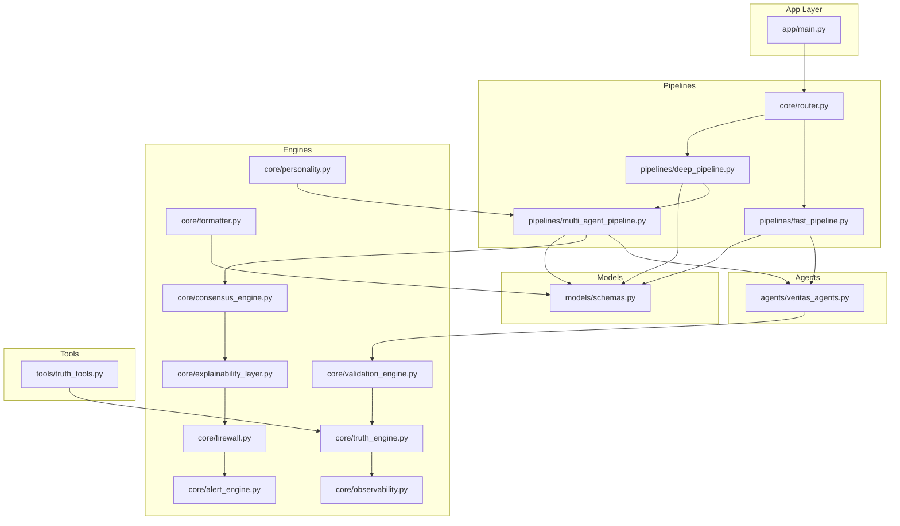
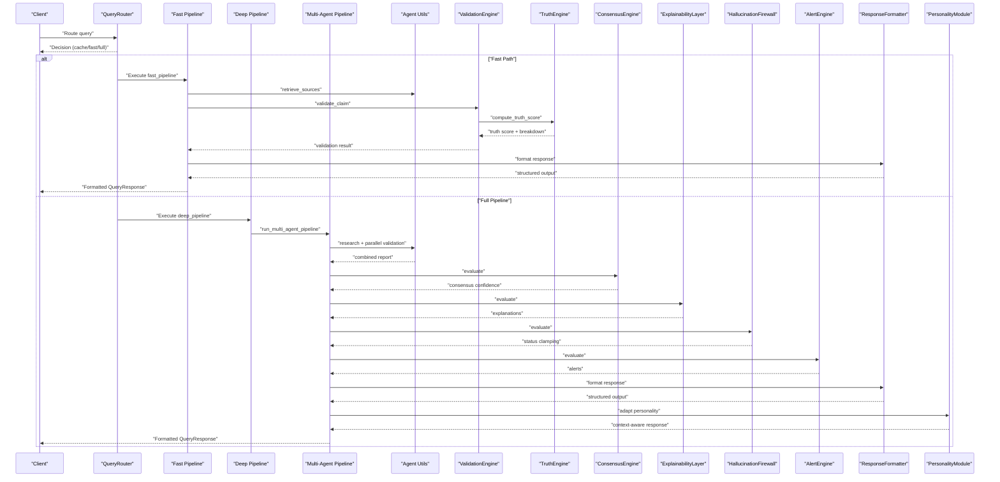
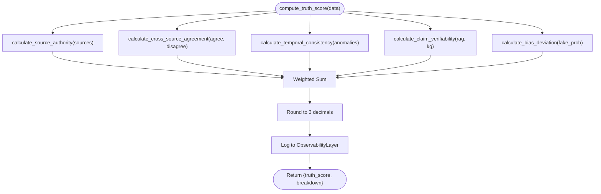
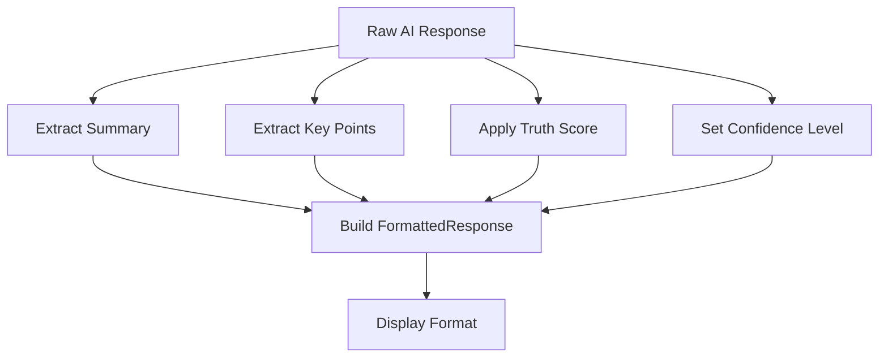
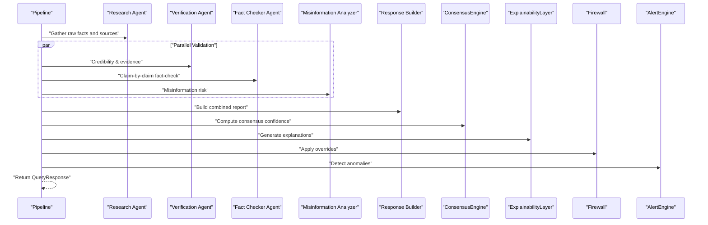
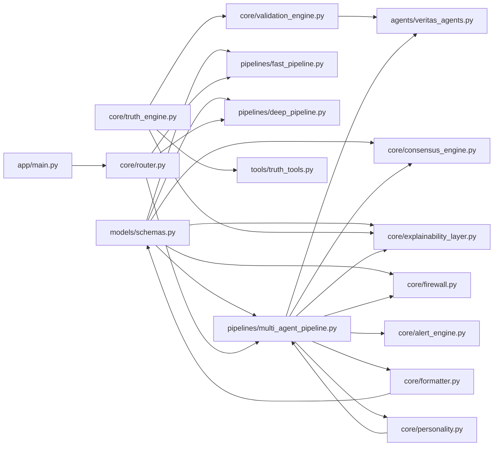

# Core Components

<cite>
**Referenced Files in This Document**
- [firewall.py](file://veritas-ai/core/firewall.py)
- [truth_engine.py](file://veritas-ai/core/truth_engine.py)
- [validation_engine.py](file://veritas-ai/core/validation_engine.py)
- [consensus_engine.py](file://veritas-ai/core/consensus_engine.py)
- [explainability_layer.py](file://veritas-ai/core/explainability_layer.py)
- [alert_engine.py](file://veritas-ai/core/alert_engine.py)
- [observability.py](file://veritas-ai/core/observability.py)
- [formatter.py](file://veritas-ai/core/formatter.py)
- [personality.py](file://veritas-ai/core/personality.py)
- [schemas.py](file://veritas-ai/models/schemas.py)
- [multi_agent_pipeline.py](file://veritas-ai/pipelines/multi_agent_pipeline.py)
- [fast_pipeline.py](file://veritas-ai/pipelines/fast_pipeline.py)
- [deep_pipeline.py](file://veritas-ai/pipelines/deep_pipeline.py)
- [router.py](file://veritas-ai/core/router.py)
- [veritas_agents.py](file://veritas-ai/agents/veritas_agents.py)
- [truth_tools.py](file://veritas-ai/tools/truth_tools.py)
- [main.py](file://veritas-ai/app/main.py)
</cite>

## Update Summary
**Changes Made**
- Added new Response Formatting Engine component for structured output formatting
- Added new Personality Module for conversational style adaptation
- Updated component architecture diagrams to include new formatting and personality layers
- Enhanced response processing pipeline documentation

## Table of Contents
1. [Introduction](#introduction)
2. [Project Structure](#project-structure)
3. [Core Components](#core-components)
4. [Architecture Overview](#architecture-overview)
5. [Detailed Component Analysis](#detailed-component-analysis)
6. [Dependency Analysis](#dependency-analysis)
7. [Performance Considerations](#performance-considerations)
8. [Troubleshooting Guide](#troubleshooting-guide)
9. [Conclusion](#conclusion)
10. [Appendices](#appendices)

## Introduction
This document explains the core component systems that power Veritas AI's multi-agent intelligence architecture. It focuses on the agent swarm orchestration (Verification Agent, Fact Checker Agent, Misinformation Analyzer), the proprietary hallucination firewall, the truth engine's mathematical verification processes, the validation engine's claim assessment algorithms, the consensus engine's collaborative decision-making, and the explainability and alerting layers. It also documents agent communication patterns, state management, failure recovery, integration points, performance characteristics, scalability, and operational monitoring.

**Updated** Added new Response Formatting Engine and Personality Module components that provide structured output formatting with truth scoring and confidence levels, and conversational style adaptation with context-aware responses.

## Project Structure
Veritas AI organizes functionality into modular subsystems:
- Agents: Lightweight async utilities for retrieval, validation, and response generation.
- Pipelines: Fast and deep orchestration pipelines that coordinate agents and engines.
- Core Engines: Truth, Consensus, Explainability, Firewall, Alert, Observability, Formatting, and Personality layers.
- Tools: LangChain-compatible tools that interface with engines and external services.
- Models: Pydantic schemas defining request/response contracts.
- App: FastAPI application with startup/shutdown lifecycle, middleware, and routing.

**Diagram sources**
- [main.py:106-208](file://veritas-ai/app/main.py#L106-L208)
- [router.py:83-182](file://veritas-ai/core/router.py#L83-L182)
- [fast_pipeline.py:8-22](file://veritas-ai/pipelines/fast_pipeline.py#L8-L22)
- [deep_pipeline.py:7-17](file://veritas-ai/pipelines/deep_pipeline.py#L7-L17)
- [multi_agent_pipeline.py:209-379](file://veritas-ai/pipelines/multi_agent_pipeline.py#L209-L379)
- [veritas_agents.py:7-44](file://veritas-ai/agents/veritas_agents.py#L7-L44)
- [truth_engine.py:3-117](file://veritas-ai/core/truth_engine.py#L3-L117)
- [validation_engine.py:9-18](file://veritas-ai/core/validation_engine.py#L9-L18)
- [consensus_engine.py:3-26](file://veritas-ai/core/consensus_engine.py#L3-L26)
- [explainability_layer.py:4-52](file://veritas-ai/core/explainability_layer.py#L4-L52)
- [firewall.py:4-47](file://veritas-ai/core/firewall.py#L4-L47)
- [alert_engine.py:20-67](file://veritas-ai/core/alert_engine.py#L20-L67)
- [observability.py:6-75](file://veritas-ai/core/observability.py#L6-L75)
- [formatter.py:1-143](file://veritas-ai/core/formatter.py#L1-L143)
- [personality.py:1-105](file://veritas-ai/core/personality.py#L1-L105)
- [truth_tools.py:5-29](file://veritas-ai/tools/truth_tools.py#L5-L29)
- [schemas.py:14-26](file://veritas-ai/models/schemas.py#L14-L26)

**Section sources**
- [main.py:106-208](file://veritas-ai/app/main.py#L106-L208)
- [router.py:83-182](file://veritas-ai/core/router.py#L83-L182)
- [fast_pipeline.py:8-22](file://veritas-ai/pipelines/fast_pipeline.py#L8-L22)
- [deep_pipeline.py:7-17](file://veritas-ai/pipelines/deep_pipeline.py#L7-L17)
- [multi_agent_pipeline.py:209-379](file://veritas-ai/pipelines/multi_agent_pipeline.py#L209-L379)
- [veritas_agents.py:7-44](file://veritas-ai/agents/veritas_agents.py#L7-L44)
- [truth_engine.py:3-117](file://veritas-ai/core/truth_engine.py#L3-L117)
- [validation_engine.py:9-18](file://veritas-ai/core/validation_engine.py#L9-L18)
- [consensus_engine.py:3-26](file://veritas-ai/core/consensus_engine.py#L3-L26)
- [explainability_layer.py:4-52](file://veritas-ai/core/explainability_layer.py#L4-L52)
- [firewall.py:4-47](file://veritas-ai/core/firewall.py#L4-L47)
- [alert_engine.py:20-67](file://veritas-ai/core/alert_engine.py#L20-L67)
- [observability.py:6-75](file://veritas-ai/core/observability.py#L6-L75)
- [formatter.py:1-143](file://veritas-ai/core/formatter.py#L1-L143)
- [personality.py:1-105](file://veritas-ai/core/personality.py#L1-L105)
- [truth_tools.py:5-29](file://veritas-ai/tools/truth_tools.py#L5-L29)
- [schemas.py:14-26](file://veritas-ai/models/schemas.py#L14-L26)

## Core Components
- Truth Engine: Computes a multi-factor mathematical truth score from source authority, cross-source agreement, temporal consistency, claim verifiability, and bias deviation.
- Validation Engine: Async wrapper around Truth Engine that computes truth scores off the event loop using a thread pool.
- Consensus Engine: Aggregates LLM confidence, classifier confidence, and rule-based truth score into a deterministic consensus confidence.
- Explainability Layer: Produces human-readable explanations ("why true/false") and a confidence breakdown from engine outputs.
- Hallucination Firewall: Applies deterministic overrides to clamp outputs to safe statuses and prevent unsafe claims from surfacing.
- Alert Engine: Detects anomalies and emits structured alerts for contradictions, fake news probability, truth score drops, and temporal anomalies.
- Response Formatting Engine: Formats AI responses into structured, clean output with truth scoring and confidence levels.
- Personality Module: Defines FRIDAY assistant personality and dynamic tone adaptation for conversational style.
- Router: Classifies queries and routes to fast-path or full multi-agent pipeline, with local and Redis caching.
- Fast Pipeline: Minimal retrieval, validation, and response generation for sub-second latency.
- Deep Pipeline: Runs the full multi-agent verification pipeline asynchronously.
- Multi-Agent Pipeline: Orchestrates research, parallel validation (Verification Agent, Fact Checker Agent, Misinformation Analyzer), response building, consensus, explainability, firewall, and alerting.
- Agents Utilities: Lightweight async helpers for retrieval, validation, and response generation.
- Tools: LangChain tools that invoke engines and external services.
- Schemas: Typed request/response models for the verification pipeline.

**Updated** Added Response Formatting Engine and Personality Module as core components.

**Section sources**
- [truth_engine.py:3-117](file://veritas-ai/core/truth_engine.py#L3-L117)
- [validation_engine.py:9-18](file://veritas-ai/core/validation_engine.py#L9-L18)
- [consensus_engine.py:3-26](file://veritas-ai/core/consensus_engine.py#L3-L26)
- [explainability_layer.py:4-52](file://veritas-ai/core/explainability_layer.py#L4-L52)
- [firewall.py:4-47](file://veritas-ai/core/firewall.py#L4-L47)
- [alert_engine.py:20-67](file://veritas-ai/core/alert_engine.py#L20-L67)
- [formatter.py:1-143](file://veritas-ai/core/formatter.py#L1-L143)
- [personality.py:1-105](file://veritas-ai/core/personality.py#L1-L105)
- [router.py:83-182](file://veritas-ai/core/router.py#L83-L182)
- [fast_pipeline.py:8-22](file://veritas-ai/pipelines/fast_pipeline.py#L8-L22)
- [deep_pipeline.py:7-17](file://veritas-ai/pipelines/deep_pipeline.py#L7-L17)
- [multi_agent_pipeline.py:209-379](file://veritas-ai/pipelines/multi_agent_pipeline.py#L209-L379)
- [veritas_agents.py:7-44](file://veritas-ai/agents/veritas_agents.py#L7-L44)
- [truth_tools.py:5-29](file://veritas-ai/tools/truth_tools.py#L5-L29)
- [schemas.py:14-26](file://veritas-ai/models/schemas.py#L14-L26)

## Architecture Overview
The system routes incoming queries through a smart router that selects either a fast-path or a full multi-agent pipeline. The fast-path executes minimal retrieval, validation, and response generation. The deep pipeline orchestrates specialized agents and engines to produce a robust, explainable, and firewall-validated result. The new Response Formatting Engine and Personality Module provide structured output formatting and conversational style adaptation throughout the pipeline.

**Updated** Added Response Formatting Engine and Personality Module to the sequence diagram.

**Diagram sources**
- [router.py:99-182](file://veritas-ai/core/router.py#L99-L182)
- [fast_pipeline.py:8-22](file://veritas-ai/pipelines/fast_pipeline.py#L8-L22)
- [deep_pipeline.py:7-17](file://veritas-ai/pipelines/deep_pipeline.py#L7-L17)
- [multi_agent_pipeline.py:209-379](file://veritas-ai/pipelines/multi_agent_pipeline.py#L209-L379)
- [veritas_agents.py:7-44](file://veritas-ai/agents/veritas_agents.py#L7-L44)
- [validation_engine.py:9-18](file://veritas-ai/core/validation_engine.py#L9-L18)
- [truth_engine.py:78-117](file://veritas-ai/core/truth_engine.py#L78-L117)
- [consensus_engine.py:8-26](file://veritas-ai/core/consensus_engine.py#L8-L26)
- [explainability_layer.py:13-52](file://veritas-ai/core/explainability_layer.py#L13-L52)
- [firewall.py:13-47](file://veritas-ai/core/firewall.py#L13-L47)
- [alert_engine.py:26-67](file://veritas-ai/core/alert_engine.py#L26-L67)
- [formatter.py:29-143](file://veritas-ai/core/formatter.py#L29-L143)
- [personality.py:6-105](file://veritas-ai/core/personality.py#L6-L105)

## Detailed Component Analysis

### Truth Engine
Computes a weighted truth score from five factors:
- Source authority: Domain-based credibility mapping.
- Cross-source agreement: Ratio of agreements to conflicts.
- Temporal consistency: Penalty for narrative shifts.
- Claim verifiability: Hits in RAG and knowledge graph.
- Bias deviation: Inverse of fake-news probability.

It logs the final score and breakdown to the observability layer and returns a normalized truth score and factor breakdown.

**Diagram sources**
- [truth_engine.py:78-117](file://veritas-ai/core/truth_engine.py#L78-L117)
- [observability.py:45-72](file://veritas-ai/core/observability.py#L45-L72)

**Section sources**
- [truth_engine.py:3-117](file://veritas-ai/core/truth_engine.py#L3-L117)
- [observability.py:45-72](file://veritas-ai/core/observability.py#L45-L72)

### Validation Engine
Provides an async entry point to compute truth scores without blocking the event loop. It delegates to a singleton TruthEngine instance and returns the same structure.

**Section sources**
- [validation_engine.py:9-18](file://veritas-ai/core/validation_engine.py#L9-L18)

### Consensus Engine
Combines three confidence signals:
- LLM confidence
- Classifier confidence (inverted fake probability)
- Rule-based truth score

It averages these into a deterministic consensus confidence and updates the payload.

**Section sources**
- [consensus_engine.py:8-26](file://veritas-ai/core/consensus_engine.py#L8-L26)

### Explainability Layer
Generates human-readable explanations:
- "Why true": Trusted sources, low fake probability, no contradictions.
- "Why false": Contradictions, high fake probability, lack of trusted sources.
- Confidence breakdown: Authority, agreement, bias.

**Section sources**
- [explainability_layer.py:13-52](file://veritas-ai/core/explainability_layer.py#L13-L52)

### Hallucination Firewall
Applies deterministic overrides:
- If contradictions exceed threshold → mark likely false.
- If fewer than two trusted sources → mark uncertain.
- If truth score exceeds threshold → mark verified.
- Otherwise → mark uncertain.

**Section sources**
- [firewall.py:13-47](file://veritas-ai/core/firewall.py#L13-L47)

### Alert Engine
Detects anomalies and emits structured alerts:
- High contradiction count.
- High fake-news probability.
- Low truth score.
- Temporal anomaly keywords in summary.

**Section sources**
- [alert_engine.py:26-67](file://veritas-ai/core/alert_engine.py#L26-L67)

### Response Formatting Engine
Formats AI responses into structured, clean output with truth scoring and confidence levels. Provides:
- Structured response format with summary, truth score, confidence, and key points
- Truth score enumeration (HIGH, MEDIUM, LOW, UNKNOWN)
- Automatic summary extraction from first sentence or 200 characters
- Key point extraction with filtering for meaningful content
- Display format conversion for user-friendly presentation

**Updated** Added Response Formatting Engine component with detailed flowchart.

**Diagram sources**
- [formatter.py:29-143](file://veritas-ai/core/formatter.py#L29-L143)

**Section sources**
- [formatter.py:1-143](file://veritas-ai/core/formatter.py#L1-L143)

### Personality Module
Defines FRIDAY assistant personality and dynamic tone adaptation for conversational style:
- Base system prompt emphasizing concise, intelligent, and calm communication
- Personality traits: calm, precise, futuristic, confident, minimal words, maximum clarity
- Context-aware system prompts for urgent, confused, and normal situations
- Dynamic response length adaptation based on conversation context
- Filler phrase removal for standard responses

**Updated** Added Personality Module component with detailed personality traits and context adaptation.

**Section sources**
- [personality.py:1-105](file://veritas-ai/core/personality.py#L1-L105)

### Router and Query Classification
Classifies queries using regex heuristics and trigger words, then decides cache hit, fast path, or full pipeline. It maintains local and Redis caches and logs routing metrics.

**Section sources**
- [router.py:51-82](file://veritas-ai/core/router.py#L51-L82)
- [router.py:99-182](file://veritas-ai/core/router.py#L99-L182)

### Fast Pipeline
Minimal path: retrieves stub sources, validates via ValidationEngine, generates a concise response, and returns a typed QueryResponse.

**Section sources**
- [fast_pipeline.py:8-22](file://veritas-ai/pipelines/fast_pipeline.py#L8-L22)
- [veritas_agents.py:7-44](file://veritas-ai/agents/veritas_agents.py#L7-L44)
- [validation_engine.py:9-18](file://veritas-ai/core/validation_engine.py#L9-L18)

### Deep Pipeline
Runs the full multi-agent pipeline in a background task and returns the final response.

**Section sources**
- [deep_pipeline.py:7-17](file://veritas-ai/pipelines/deep_pipeline.py#L7-L17)
- [multi_agent_pipeline.py:209-379](file://veritas-ai/pipelines/multi_agent_pipeline.py#L209-L379)

### Multi-Agent Pipeline
Orchestrates:
- Deduplicated in-flight queries.
- Research phase with caching.
- Parallel validation agents: Verification Agent, Fact Checker Agent, Misinformation Analyzer.
- Response building, consensus, explainability, firewall, and alerting.
- Fallback handling and alert publishing.

**Updated** Added Response Formatting Engine and Personality Module to the sequence diagram.

**Diagram sources**
- [multi_agent_pipeline.py:234-332](file://veritas-ai/pipelines/multi_agent_pipeline.py#L234-L332)

**Section sources**
- [multi_agent_pipeline.py:209-379](file://veritas-ai/pipelines/multi_agent_pipeline.py#L209-L379)

### Agent Communication Patterns and State Management
- Lightweight async utilities in agent utilities encapsulate retrieval, validation, and response generation.
- Multi-agent pipeline manages in-flight queries and deduplicates concurrent requests.
- Semaphores limit parallel tool usage to respect resource constraints.
- Caching layers (local and Redis) reduce redundant computations.

**Section sources**
- [veritas_agents.py:7-44](file://veritas-ai/agents/veritas_agents.py#L7-L44)
- [multi_agent_pipeline.py:50-53](file://veritas-ai/pipelines/multi_agent_pipeline.py#L50-L53)
- [multi_agent_pipeline.py:221-229](file://veritas-ai/pipelines/multi_agent_pipeline.py#L221-L229)

### Failure Recovery
- Centralized exception handling with timeouts and fallback responses.
- Graceful degradation when external services (e.g., Redis) are unavailable.
- Event bus publishes alerts for anomaly detection.

**Section sources**
- [multi_agent_pipeline.py:289-298](file://veritas-ai/pipelines/multi_agent_pipeline.py#L289-L298)
- [main.py:127-167](file://veritas-ai/app/main.py#L127-L167)

### Integration Points and Verification Pipeline
- Tools invoke TruthEngine for scoring.
- Router integrates with pipelines and caches.
- Schemas define the canonical QueryResponse contract across components.
- Response Formatting Engine integrates with response builders for structured output.
- Personality Module adapts system prompts and response lengths for conversational style.

**Updated** Added Response Formatting Engine and Personality Module integration points.

**Section sources**
- [truth_tools.py:5-29](file://veritas-ai/tools/truth_tools.py#L5-L29)
- [router.py:153-182](file://veritas-ai/core/router.py#L153-L182)
- [schemas.py:14-26](file://veritas-ai/models/schemas.py#L14-L26)
- [formatter.py:132-143](file://veritas-ai/core/formatter.py#L132-L143)
- [personality.py:95-105](file://veritas-ai/core/personality.py#L95-L105)

## Dependency Analysis
The following diagram shows key dependencies among core components:

**Updated** Added Response Formatting Engine and Personality Module dependencies.

**Diagram sources**
- [schemas.py:14-26](file://veritas-ai/models/schemas.py#L14-L26)
- [consensus_engine.py:8-26](file://veritas-ai/core/consensus_engine.py#L8-L26)
- [explainability_layer.py:13-52](file://veritas-ai/core/explainability_layer.py#L13-L52)
- [firewall.py:13-47](file://veritas-ai/core/firewall.py#L13-L47)
- [multi_agent_pipeline.py:300-332](file://veritas-ai/pipelines/multi_agent_pipeline.py#L300-L332)
- [fast_pipeline.py:8-22](file://veritas-ai/pipelines/fast_pipeline.py#L8-L22)
- [deep_pipeline.py:7-17](file://veritas-ai/pipelines/deep_pipeline.py#L7-L17)
- [truth_engine.py:78-117](file://veritas-ai/core/truth_engine.py#L78-L117)
- [validation_engine.py:9-18](file://veritas-ai/core/validation_engine.py#L9-L18)
- [veritas_agents.py:7-44](file://veritas-ai/agents/veritas_agents.py#L7-L44)
- [truth_tools.py:5-29](file://veritas-ai/tools/truth_tools.py#L5-L29)
- [router.py:99-182](file://veritas-ai/core/router.py#L99-L182)
- [main.py:106-208](file://veritas-ai/app/main.py#L106-L208)
- [formatter.py:29-143](file://veritas-ai/core/formatter.py#L29-L143)
- [personality.py:6-105](file://veritas-ai/core/personality.py#L6-L105)

**Section sources**
- [schemas.py:14-26](file://veritas-ai/models/schemas.py#L14-L26)
- [multi_agent_pipeline.py:300-332](file://veritas-ai/pipelines/multi_agent_pipeline.py#L300-L332)
- [router.py:99-182](file://veritas-ai/core/router.py#L99-L182)
- [truth_engine.py:78-117](file://veritas-ai/core/truth_engine.py#L78-L117)
- [validation_engine.py:9-18](file://veritas-ai/core/validation_engine.py#L9-L18)
- [consensus_engine.py:8-26](file://veritas-ai/core/consensus_engine.py#L8-L26)
- [explainability_layer.py:13-52](file://veritas-ai/core/explainability_layer.py#L13-L52)
- [firewall.py:13-47](file://veritas-ai/core/firewall.py#L13-L47)
- [alert_engine.py:26-67](file://veritas-ai/core/alert_engine.py#L26-L67)
- [veritas_agents.py:7-44](file://veritas-ai/agents/veritas_agents.py#L7-L44)
- [truth_tools.py:5-29](file://veritas-ai/tools/truth_tools.py#L5-L29)
- [fast_pipeline.py:8-22](file://veritas-ai/pipelines/fast_pipeline.py#L8-L22)
- [deep_pipeline.py:7-17](file://veritas-ai/pipelines/deep_pipeline.py#L7-L17)
- [main.py:106-208](file://veritas-ai/app/main.py#L106-L208)
- [formatter.py:1-143](file://veritas-ai/core/formatter.py#L1-L143)
- [personality.py:1-105](file://veritas-ai/core/personality.py#L1-L105)

## Performance Considerations
- Asynchronous orchestration: Pipelines use asyncio to maximize concurrency and minimize blocking.
- Thread pool offloading: ValidationEngine computes truth scores in a thread pool to keep the event loop responsive.
- Caching: Local TTL cache and Redis-backed cache reduce repeated work and latency.
- Semaphore-based throttling: Limits concurrent tool usage to prevent resource saturation.
- Fast path: Designed to complete under a strict sub-second target for simple queries.
- Startup optimization: App initializes cache and databases quickly, preloads models in the background.
- Response formatting: Structured output formatting adds minimal overhead to response processing.
- Personality adaptation: Context-aware response adaptation maintains performance while enhancing user experience.

**Updated** Added performance considerations for new formatting and personality components.

**Section sources**
- [validation_engine.py:15-17](file://veritas-ai/core/validation_engine.py#L15-L17)
- [router.py:90-94](file://veritas-ai/core/router.py#L90-L94)
- [multi_agent_pipeline.py:52](file://veritas-ai/pipelines/multi_agent_pipeline.py#L52)
- [fast_pipeline.py:9-13](file://veritas-ai/pipelines/fast_pipeline.py#L9-L13)
- [main.py:33-68](file://veritas-ai/app/main.py#L33-L68)
- [formatter.py:29-143](file://veritas-ai/core/formatter.py#L29-L143)
- [personality.py:6-105](file://veritas-ai/core/personality.py#L6-L105)

## Troubleshooting Guide
- Timeouts and fallbacks: The application enforces global request timeouts and returns fallback responses on failure.
- Logging and observability: Metrics and drift logs are written to JSONL files for diagnostics.
- Alerts: Anomaly detection emits structured alerts with severity and messages.
- Cache health: Router falls back gracefully when Redis is unavailable.
- Response formatting: Structured output formatting handles edge cases and provides fallback summaries.
- Personality adaptation: Context-aware response adaptation maintains consistent behavior across different conversation contexts.

**Updated** Added troubleshooting guidance for new formatting and personality components.

Operational checks:
- Verify cache connectivity and fallback behavior.
- Inspect observability logs for drift and performance trends.
- Review alert logs for recurring anomalies.
- Confirm pipeline timeouts and error handlers are functioning.
- Test response formatting with various input types and edge cases.
- Validate personality adaptation across different conversation contexts.

**Section sources**
- [main.py:127-167](file://veritas-ai/app/main.py#L127-L167)
- [observability.py:25-72](file://veritas-ai/core/observability.py#L25-L72)
- [alert_engine.py:26-67](file://veritas-ai/core/alert_engine.py#L26-L67)
- [router.py:102-119](file://veritas-ai/core/router.py#L102-L119)
- [formatter.py:67-103](file://veritas-ai/core/formatter.py#L67-L103)
- [personality.py:28-90](file://veritas-ai/core/personality.py#L28-L90)

## Conclusion
Veritas AI's core components form a robust, multi-layered verification pipeline. The Truth Engine provides mathematically grounded scoring, the Validation Engine ensures non-blocking computation, the Consensus Engine harmonizes diverse confidence signals, the Explainability Layer improves trust through transparency, and the Hallucination Firewall enforces safety. The new Response Formatting Engine enhances output quality with structured formatting and truth scoring, while the Personality Module provides context-aware conversational style adaptation. The Router intelligently selects the optimal path, while the Fast and Deep Pipelines deliver performance and depth respectively. Together, these components enable scalable, observable, and resilient truth verification with enhanced user experience.

**Updated** Added Response Formatting Engine and Personality Module to the conclusion.

## Appendices
- Data Contracts: QueryResponse defines the canonical output schema across the system.
- Tools: Truth scoring tool integrates with the Truth Engine for deterministic scoring.
- Response Formatting: Structured output formatting with truth scoring and confidence levels.
- Personality Configuration: Context-aware conversational style adaptation for different interaction scenarios.

**Updated** Added appendices for new formatting and personality components.

**Section sources**
- [schemas.py:14-26](file://veritas-ai/models/schemas.py#L14-L26)
- [truth_tools.py:5-29](file://veritas-ai/tools/truth_tools.py#L5-L29)
- [formatter.py:1-143](file://veritas-ai/core/formatter.py#L1-L143)
- [personality.py:1-105](file://veritas-ai/core/personality.py#L1-L105)