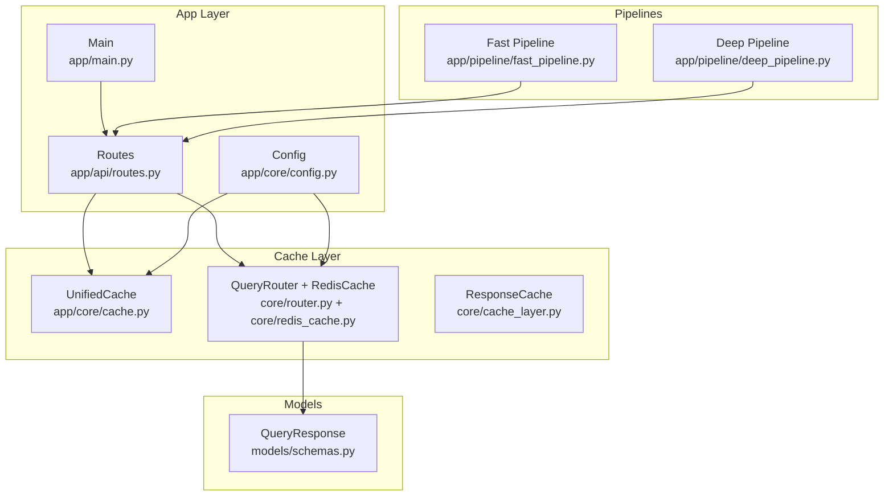
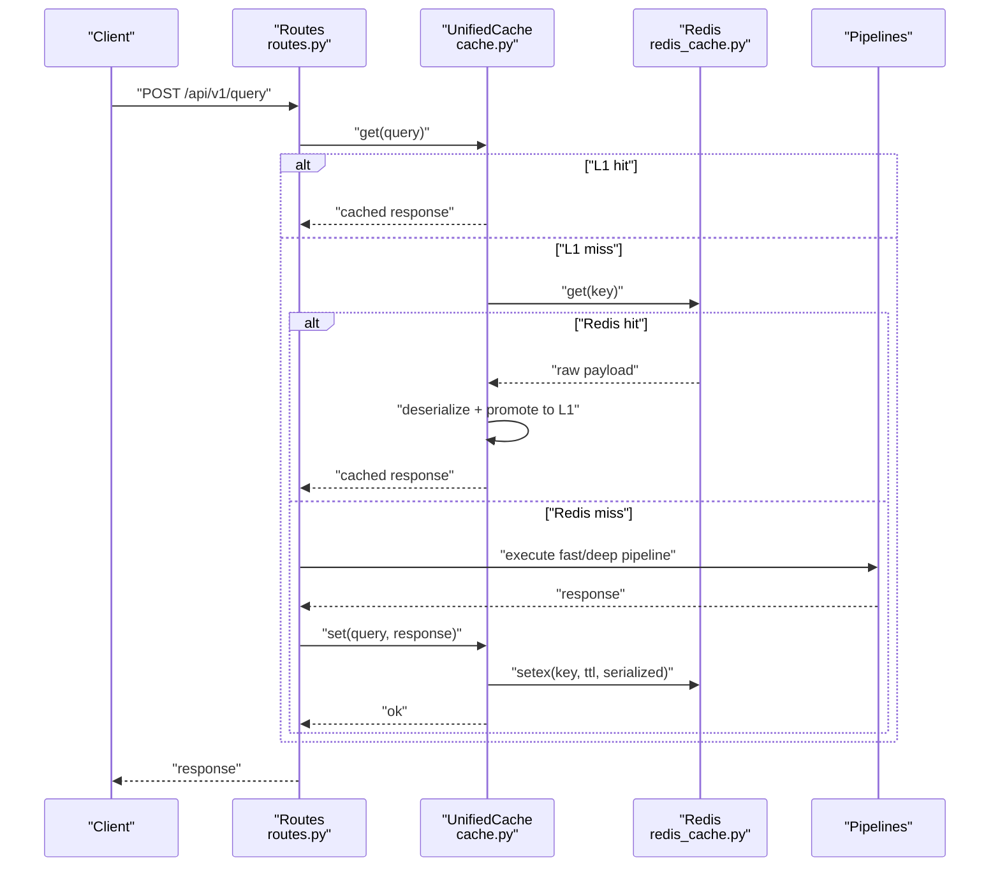
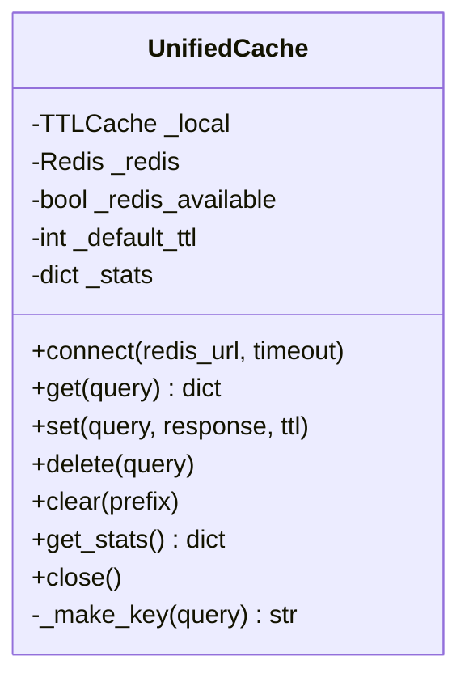
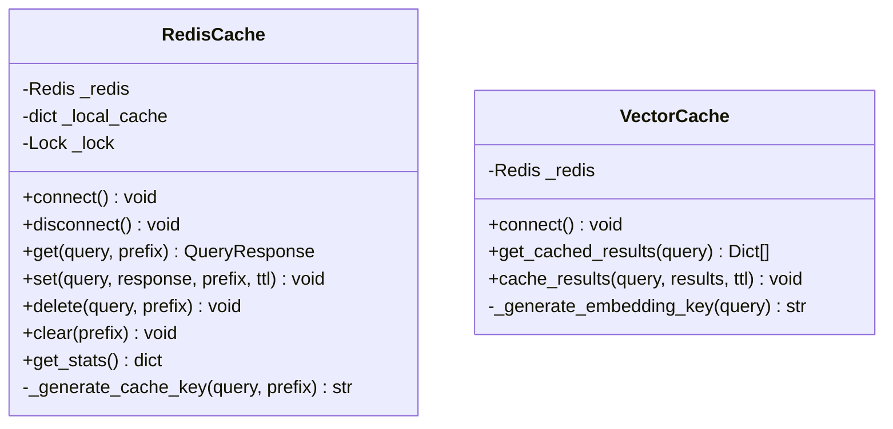
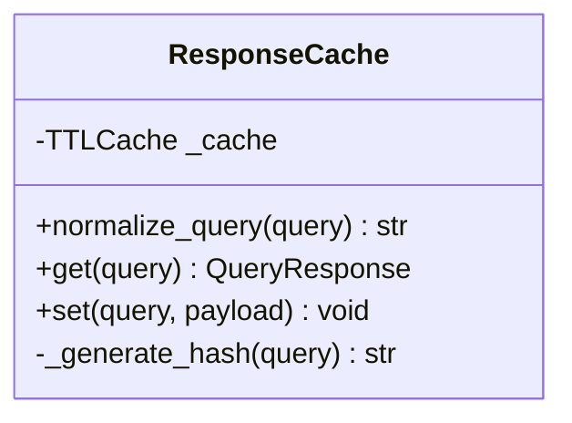
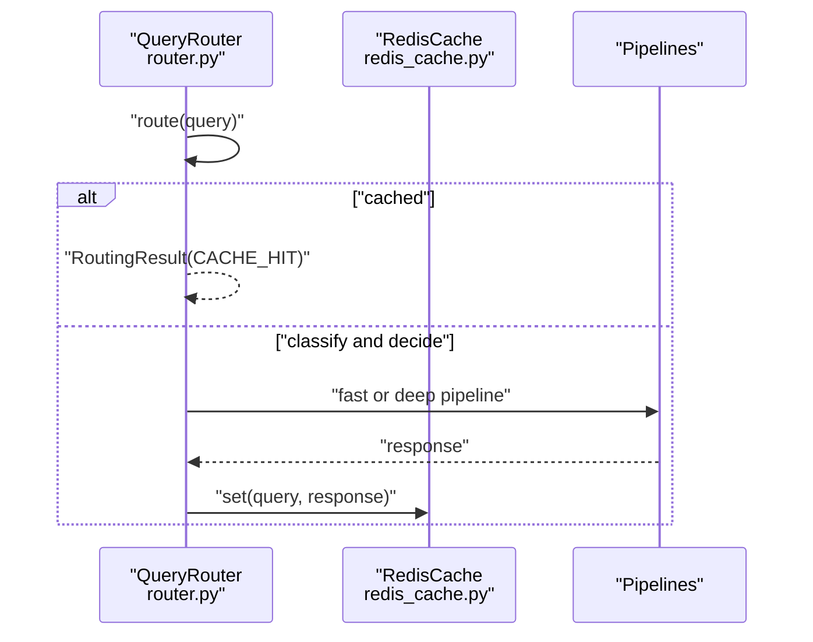
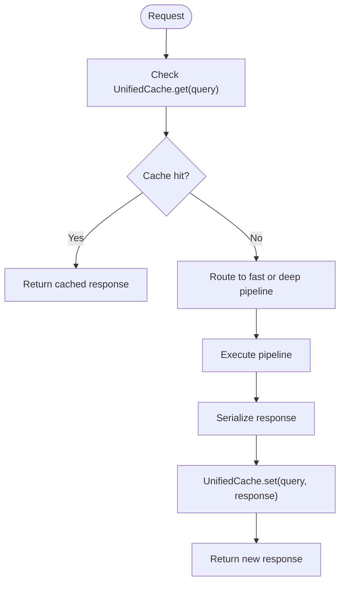
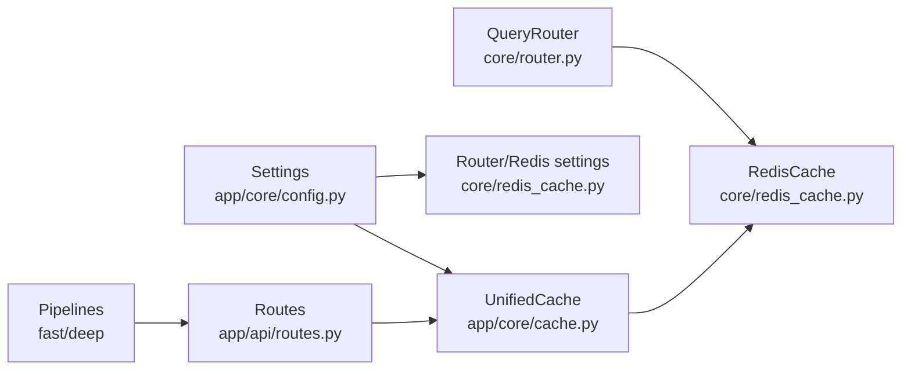

# Cache Layer & Performance

<cite>
**Referenced Files in This Document**
- [cache.py](file://veritas-ai/app/core/cache.py)
- [redis_cache.py](file://veritas-ai/core/redis_cache.py)
- [cache_layer.py](file://veritas-ai/core/cache_layer.py)
- [config.py](file://veritas-ai/app/core/config.py)
- [settings.py](file://veritas-ai/config/settings.py)
- [schemas.py](file://veritas-ai/models/schemas.py)
- [routes.py](file://veritas-ai/app/api/routes.py)
- [router.py](file://veritas-ai/core/router.py)
- [main.py](file://veritas-ai/app/main.py)
- [main.py](file://veritas-ai/main.py)
- [fast_pipeline.py](file://veritas-ai/app/pipeline/fast_pipeline.py)
- [deep_pipeline.py](file://veritas-ai/app/pipeline/deep_pipeline.py)
</cite>

## Table of Contents
1. [Introduction](#introduction)
2. [Project Structure](#project-structure)
3. [Core Components](#core-components)
4. [Architecture Overview](#architecture-overview)
5. [Detailed Component Analysis](#detailed-component-analysis)
6. [Dependency Analysis](#dependency-analysis)
7. [Performance Considerations](#performance-considerations)
8. [Troubleshooting Guide](#troubleshooting-guide)
9. [Conclusion](#conclusion)
10. [Appendices](#appendices)

## Introduction
This document describes the Cache Layer system with a focus on performance optimization and data caching strategies. It covers Redis integration, connection management, data serialization, cache invalidation, multi-tier caching, eviction strategies, consistency mechanisms, configuration options, performance tuning, monitoring, and practical guidance for cache operations, bulk loading, warming, partitioning, distributed caching, failure recovery, hit ratio optimization, memory management, and debugging.

## Project Structure
The cache layer spans several modules:
- Unified two-tier cache abstraction for local and Redis-backed storage
- Legacy subsystem caches and Redis-backed caches
- Configuration and settings for cache parameters and Redis connectivity
- API routes that integrate caching into request handling
- Pipeline orchestration that benefits from cache hits

**Diagram sources**
- [routes.py:1-251](file://veritas-ai/app/api/routes.py#L1-L251)
- [cache.py:1-172](file://veritas-ai/app/core/cache.py#L1-L172)
- [redis_cache.py:1-232](file://veritas-ai/core/redis_cache.py#L1-L232)
- [cache_layer.py:1-41](file://veritas-ai/core/cache_layer.py#L1-L41)
- [config.py:1-88](file://veritas-ai/app/core/config.py#L1-L88)
- [schemas.py:1-88](file://veritas-ai/models/schemas.py#L1-L88)
- [fast_pipeline.py:1-49](file://veritas-ai/app/pipeline/fast_pipeline.py#L1-L49)
- [deep_pipeline.py:1-43](file://veritas-ai/app/pipeline/deep_pipeline.py#L1-L43)

**Section sources**
- [routes.py:1-251](file://veritas-ai/app/api/routes.py#L1-L251)
- [cache.py:1-172](file://veritas-ai/app/core/cache.py#L1-L172)
- [redis_cache.py:1-232](file://veritas-ai/core/redis_cache.py#L1-L232)
- [cache_layer.py:1-41](file://veritas-ai/core/cache_layer.py#L1-L41)
- [config.py:1-88](file://veritas-ai/app/core/config.py#L1-L88)
- [schemas.py:1-88](file://veritas-ai/models/schemas.py#L1-L88)
- [fast_pipeline.py:1-49](file://veritas-ai/app/pipeline/fast_pipeline.py#L1-L49)
- [deep_pipeline.py:1-43](file://veritas-ai/app/pipeline/deep_pipeline.py#L1-L43)

## Core Components
- Unified two-tier cache:
  - L1: Local TTLCache for fast in-process caching
  - L2: Redis for cross-worker persistence and distribution
  - Graceful degradation when Redis is unavailable
- Legacy subsystem caches:
  - ResponseCache for QueryResponse objects
  - RedisCache and VectorCache for distributed caching
- Router cache:
  - Local TTLCache plus Redis-backed cache for routing decisions
- Configuration:
  - Cache TTL and max entries
  - Redis host/port/db and derived redis_url

Key responsibilities:
- Normalize queries and generate deterministic cache keys
- Serialize/deserialize payloads for Redis storage
- Promote cache hits from Redis to local cache
- Provide cache statistics and health metrics

**Section sources**
- [cache.py:15-172](file://veritas-ai/app/core/cache.py#L15-L172)
- [redis_cache.py:18-232](file://veritas-ai/core/redis_cache.py#L18-L232)
- [cache_layer.py:10-41](file://veritas-ai/core/cache_layer.py#L10-L41)
- [router.py:83-182](file://veritas-ai/core/router.py#L83-L182)
- [config.py:33-34](file://veritas-ai/app/core/config.py#L33-L34)
- [config.py:82-84](file://veritas-ai/app/core/config.py#L82-L84)

## Architecture Overview
The cache architecture implements a two-tier design:
- Local tier (L1): TTL-based in-memory cache for immediate access
- Remote tier (L2): Redis for shared, persistent caching across workers

**Diagram sources**
- [routes.py:46-81](file://veritas-ai/app/api/routes.py#L46-L81)
- [cache.py:66-115](file://veritas-ai/app/core/cache.py#L66-L115)
- [redis_cache.py:66-106](file://veritas-ai/core/redis_cache.py#L66-L106)

**Section sources**
- [routes.py:46-81](file://veritas-ai/app/api/routes.py#L46-L81)
- [cache.py:66-115](file://veritas-ai/app/core/cache.py#L66-L115)
- [redis_cache.py:66-106](file://veritas-ai/core/redis_cache.py#L66-L106)

## Detailed Component Analysis

### UnifiedCache (Two-Tier Cache)
- Purpose: Provide a single interface for local and Redis caching with graceful degradation
- Features:
  - Local TTLCache with configurable max entries and TTL
  - Redis connection with 2s timeout and fallback to local-only mode
  - Consistent key generation using normalized query and SHA-256 truncation
  - Serialization/deserialization for Redis payloads
  - Hit promotion from Redis to local cache
  - Statistics: hits (local/redis), misses, sets, hit rate, availability

**Diagram sources**
- [cache.py:15-172](file://veritas-ai/app/core/cache.py#L15-L172)

**Section sources**
- [cache.py:15-172](file://veritas-ai/app/core/cache.py#L15-L172)
- [config.py:33-34](file://veritas-ai/app/core/config.py#L33-L34)
- [config.py:82-84](file://veritas-ai/app/core/config.py#L82-L84)

### RedisCache (Legacy Distributed Cache)
- Purpose: Provide Redis-backed caching with local in-memory fallback
- Features:
  - Singleton with thread-safe initialization
  - Normalized query hashing with SHA-256 truncation
  - JSON serialization with timestamp injection
  - Prefix-based key namespaces ("query", "embedding")
  - Local cache dictionary for immediate reads/writes
  - Redis SCAN-based clearing with pagination
  - Stats collection via Redis INFO

**Diagram sources**
- [redis_cache.py:18-232](file://veritas-ai/core/redis_cache.py#L18-L232)

**Section sources**
- [redis_cache.py:18-232](file://veritas-ai/core/redis_cache.py#L18-L232)
- [schemas.py:14-26](file://veritas-ai/models/schemas.py#L14-L26)

### ResponseCache (Legacy Local Cache)
- Purpose: Local cache for QueryResponse objects with TTL
- Features:
  - Normalization and SHA-256 hashing
  - TTL-based eviction via cachetools.TTLCache
  - Pydantic model-aware caching

**Diagram sources**
- [cache_layer.py:10-41](file://veritas-ai/core/cache_layer.py#L10-L41)

**Section sources**
- [cache_layer.py:10-41](file://veritas-ai/core/cache_layer.py#L10-L41)
- [schemas.py:14-26](file://veritas-ai/models/schemas.py#L14-L26)

### QueryRouter Cache (Local + Redis)
- Purpose: Route queries and cache intermediate results
- Features:
  - Local TTLCache for recent routing results
  - Redis-backed cache for full responses
  - Background cache writes after pipeline execution

**Diagram sources**
- [router.py:99-180](file://veritas-ai/core/router.py#L99-L180)
- [redis_cache.py:66-106](file://veritas-ai/core/redis_cache.py#L66-L106)

**Section sources**
- [router.py:83-182](file://veritas-ai/core/router.py#L83-L182)
- [redis_cache.py:18-232](file://veritas-ai/core/redis_cache.py#L18-L232)

### Cache Usage in API Routes
- The routes layer checks UnifiedCache first, then executes appropriate pipeline and caches the result
- Health and metrics endpoints expose cache hit rate and availability

**Diagram sources**
- [routes.py:46-81](file://veritas-ai/app/api/routes.py#L46-L81)
- [cache.py:66-115](file://veritas-ai/app/core/cache.py#L66-L115)

**Section sources**
- [routes.py:46-81](file://veritas-ai/app/api/routes.py#L46-L81)
- [routes.py:86-97](file://veritas-ai/app/api/routes.py#L86-L97)
- [routes.py:236-243](file://veritas-ai/app/api/routes.py#L236-L243)

## Dependency Analysis
- Configuration drives cache behavior:
  - CACHE_TTL_SECONDS and CACHE_MAX_ENTRIES
  - REDIS_HOST, REDIS_PORT, REDIS_DB, redis_url
- Routes depend on UnifiedCache for request caching
- Router integrates RedisCache for routing-level caching
- Pipelines produce cached responses consumed by routes

**Diagram sources**
- [config.py:33-34](file://veritas-ai/app/core/config.py#L33-L34)
- [config.py:82-84](file://veritas-ai/app/core/config.py#L82-L84)
- [routes.py:1-251](file://veritas-ai/app/api/routes.py#L1-L251)
- [cache.py:1-172](file://veritas-ai/app/core/cache.py#L1-L172)
- [redis_cache.py:1-232](file://veritas-ai/core/redis_cache.py#L1-L232)
- [router.py:1-182](file://veritas-ai/core/router.py#L1-L182)

**Section sources**
- [config.py:33-34](file://veritas-ai/app/core/config.py#L33-L34)
- [config.py:55-58](file://veritas-ai/app/core/config.py#L55-L58)
- [config.py:82-84](file://veritas-ai/app/core/config.py#L82-L84)
- [routes.py:1-251](file://veritas-ai/app/api/routes.py#L1-L251)
- [cache.py:1-172](file://veritas-ai/app/core/cache.py#L1-L172)
- [redis_cache.py:1-232](file://veritas-ai/core/redis_cache.py#L1-L232)
- [router.py:1-182](file://veritas-ai/core/router.py#L1-L182)

## Performance Considerations
- Two-tier design reduces latency and improves throughput:
  - L1 TTLCache provides sub-millisecond access for hot keys
  - L2 Redis enables sharing across workers and persistence
- Connection management:
  - Redis connection uses short timeouts and graceful fallback to local-only mode
  - Redis ping and wait-for tests ensure readiness
- Serialization:
  - JSON serialization with default string conversion for non-serializable fields
  - Timestamp injection for cache freshness tracking
- Eviction and sizing:
  - Local cache uses TTL-based eviction
  - Max entries controlled by configuration
- Monitoring:
  - Hit rates, total requests, and availability exposed via metrics endpoint
  - Health endpoint reports cache status

Recommendations:
- Tune CACHE_TTL_SECONDS and CACHE_MAX_ENTRIES for workload characteristics
- Monitor hit_rate and adjust TTL to balance freshness and hit probability
- Use prefix-based clearing for targeted invalidation during maintenance
- Consider warming hot keys at startup or via background tasks

**Section sources**
- [cache.py:26-35](file://veritas-ai/app/core/cache.py#L26-L35)
- [cache.py:43-64](file://veritas-ai/app/core/cache.py#L43-L64)
- [cache.py:144-155](file://veritas-ai/app/core/cache.py#L144-L155)
- [routes.py:86-97](file://veritas-ai/app/api/routes.py#L86-L97)
- [routes.py:236-243](file://veritas-ai/app/api/routes.py#L236-L243)

## Troubleshooting Guide
Common issues and remedies:
- Redis connectivity failures:
  - Symptom: Warning logs about Redis connection failure; fallback to local cache
  - Action: Verify REDIS_HOST/PORT/DB; ensure Redis is reachable; confirm timeout settings
- Cache misses despite existing data:
  - Symptom: Misses reported in stats
  - Action: Confirm key normalization and hashing; check TTL expiration; verify prefixes
- Serialization errors:
  - Symptom: JSON serialization warnings
  - Action: Ensure response payloads are JSON serializable or rely on default serialization
- Invalidation anomalies:
  - Symptom: Stale data after updates
  - Action: Use clear(prefix) with correct prefix; ensure cache writes occur after updates
- Memory growth:
  - Symptom: Increasing local_size and potential eviction pressure
  - Action: Adjust CACHE_MAX_ENTRIES and CACHE_TTL_SECONDS; monitor hit_rate and tune accordingly

Operational controls:
- Clear cache: POST /api/v1/cache/clear
- Metrics: GET /api/v1/metrics
- Health: GET /api/v1/health

**Section sources**
- [cache.py:43-64](file://veritas-ai/app/core/cache.py#L43-L64)
- [cache.py:126-142](file://veritas-ai/app/core/cache.py#L126-L142)
- [redis_cache.py:30-52](file://veritas-ai/core/redis_cache.py#L30-L52)
- [redis_cache.py:118-144](file://veritas-ai/core/redis_cache.py#L118-L144)
- [routes.py:246-251](file://veritas-ai/app/api/routes.py#L246-L251)
- [routes.py:236-243](file://veritas-ai/app/api/routes.py#L236-L243)
- [routes.py:86-97](file://veritas-ai/app/api/routes.py#L86-L97)

## Conclusion
The cache layer combines a fast local TTLCache with a resilient Redis-backed remote cache, enabling low-latency responses, cross-worker sharing, and graceful degradation. With configurable TTL and capacity, robust serialization, and comprehensive monitoring, the system supports high-performance query serving. Proper tuning of cache parameters, strategic invalidation, and proactive warming will optimize hit ratios and memory usage.

## Appendices

### Configuration Options
- Cache behavior:
  - CACHE_TTL_SECONDS: default TTL for cached entries
  - CACHE_MAX_ENTRIES: maximum number of entries in local cache
- Redis connectivity:
  - REDIS_HOST, REDIS_PORT, REDIS_DB: Redis server configuration
  - redis_url: derived connection string

Environment variables and defaults are defined in settings modules.

**Section sources**
- [config.py:33-34](file://veritas-ai/app/core/config.py#L33-L34)
- [config.py:55-58](file://veritas-ai/app/core/config.py#L55-L58)
- [config.py:82-84](file://veritas-ai/app/core/config.py#L82-L84)
- [settings.py:25-26](file://veritas-ai/config/settings.py#L25-L26)
- [settings.py:55-58](file://veritas-ai/config/settings.py#L55-L58)
- [settings.py:81-82](file://veritas-ai/config/settings.py#L81-L82)

### Implementation Examples

- Basic cache operations:
  - Get: [cache.get:66-95](file://veritas-ai/app/core/cache.py#L66-L95)
  - Set: [cache.set:97-114](file://veritas-ai/app/core/cache.py#L97-L114)
  - Delete: [cache.delete:116-124](file://veritas-ai/app/core/cache.py#L116-L124)
  - Clear: [cache.clear:126-142](file://veritas-ai/app/core/cache.py#L126-L142)

- Bulk loading and warming:
  - Warm hot keys by calling [cache.set:97-114](file://veritas-ai/app/core/cache.py#L97-L114) with known frequent queries
  - Use [cache.clear:126-142](file://veritas-ai/app/core/cache.py#L126-L142) with a prefix to invalidate stale batches

- Cache invalidation:
  - Use [cache.delete:116-124](file://veritas-ai/app/core/cache.py#L116-L124) for targeted removal
  - Use [cache.clear:126-142](file://veritas-ai/app/core/cache.py#L126-L142) for broad invalidation

- Monitoring and health:
  - Metrics endpoint: [GET /api/v1/metrics:236-243](file://veritas-ai/app/api/routes.py#L236-L243)
  - Health endpoint: [GET /api/v1/health:86-97](file://veritas-ai/app/api/routes.py#L86-L97)

**Section sources**
- [cache.py:66-142](file://veritas-ai/app/core/cache.py#L66-L142)
- [routes.py:236-251](file://veritas-ai/app/api/routes.py#L236-L251)

### Distributed Caching and Failure Recovery
- Distributed caching:
  - Redis provides shared cache across workers
  - Prefix-based key namespaces prevent collisions
- Failure recovery:
  - Redis connection failures trigger fallback to local-only cache
  - Application lifecycle manages cache initialization and cleanup

**Section sources**
- [cache.py:43-64](file://veritas-ai/app/core/cache.py#L43-L64)
- [main.py:33-39](file://veritas-ai/app/main.py#L33-L39)
- [main.py:100-101](file://veritas-ai/app/main.py#L100-L101)

### Cache Hit Ratio Optimization and Memory Management
- Optimize hit ratio:
  - Increase CACHE_TTL_SECONDS for stable content
  - Reduce CACHE_MAX_ENTRIES if memory pressure occurs
  - Use prefix-based clearing to refresh stale partitions
- Memory management:
  - Monitor local_size and hit_rate via metrics
  - Adjust CACHE_MAX_ENTRIES and CACHE_TTL_SECONDS based on observed patterns

**Section sources**
- [cache.py:144-155](file://veritas-ai/app/core/cache.py#L144-L155)
- [routes.py:236-243](file://veritas-ai/app/api/routes.py#L236-L243)

### Cache Debugging Techniques
- Enable INFO/WARN logs to observe cache behavior
- Use metrics endpoint to track hit_rate and redis availability
- Validate key normalization and hashing by inspecting cache keys
- Confirm serialization by checking stored JSON payloads

**Section sources**
- [cache.py:12-13](file://veritas-ai/app/core/cache.py#L12-L13)
- [cache.py:81-92](file://veritas-ai/app/core/cache.py#L81-L92)
- [routes.py:236-243](file://veritas-ai/app/api/routes.py#L236-L243)