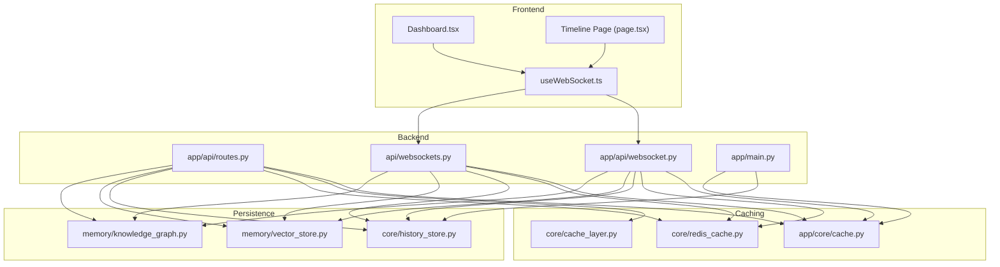
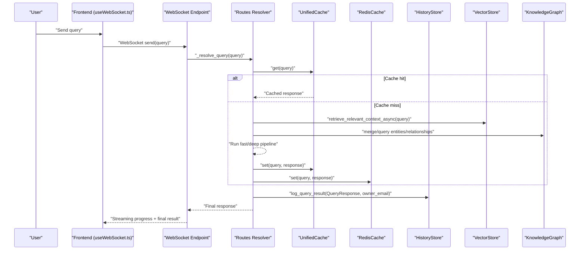
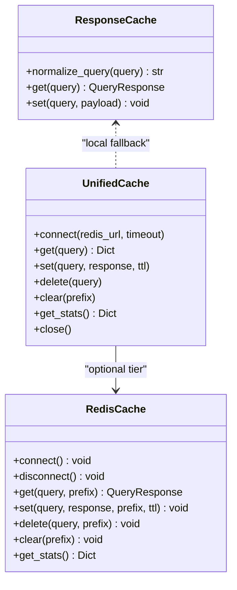
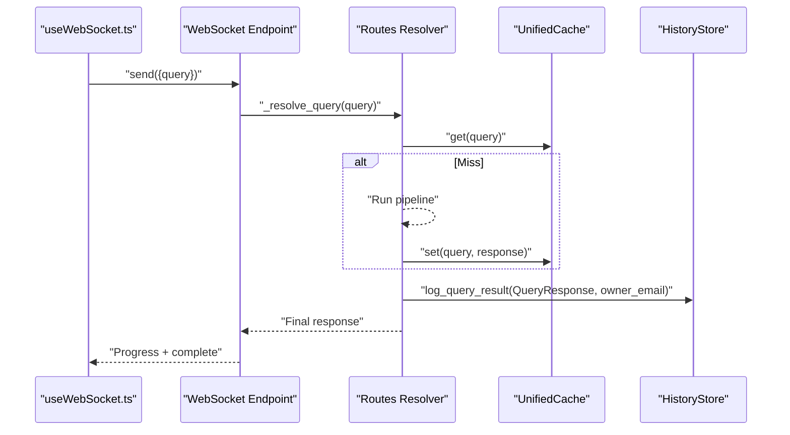
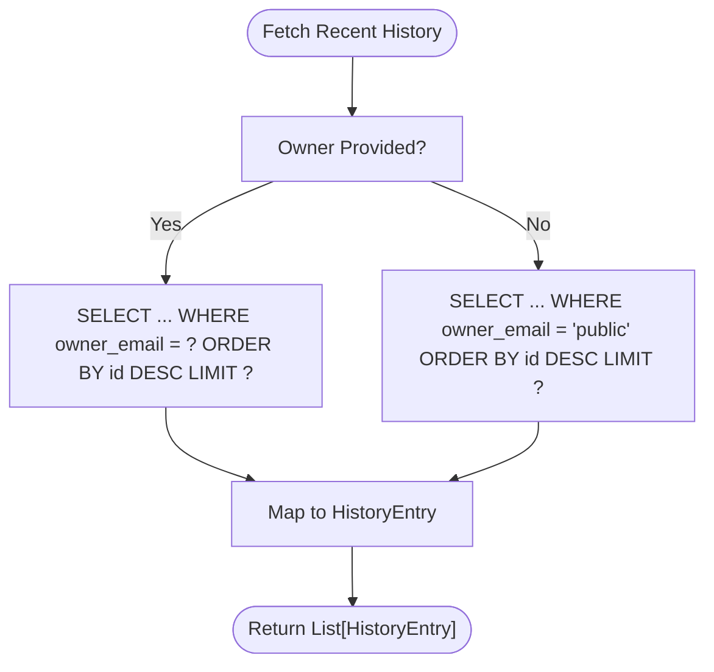
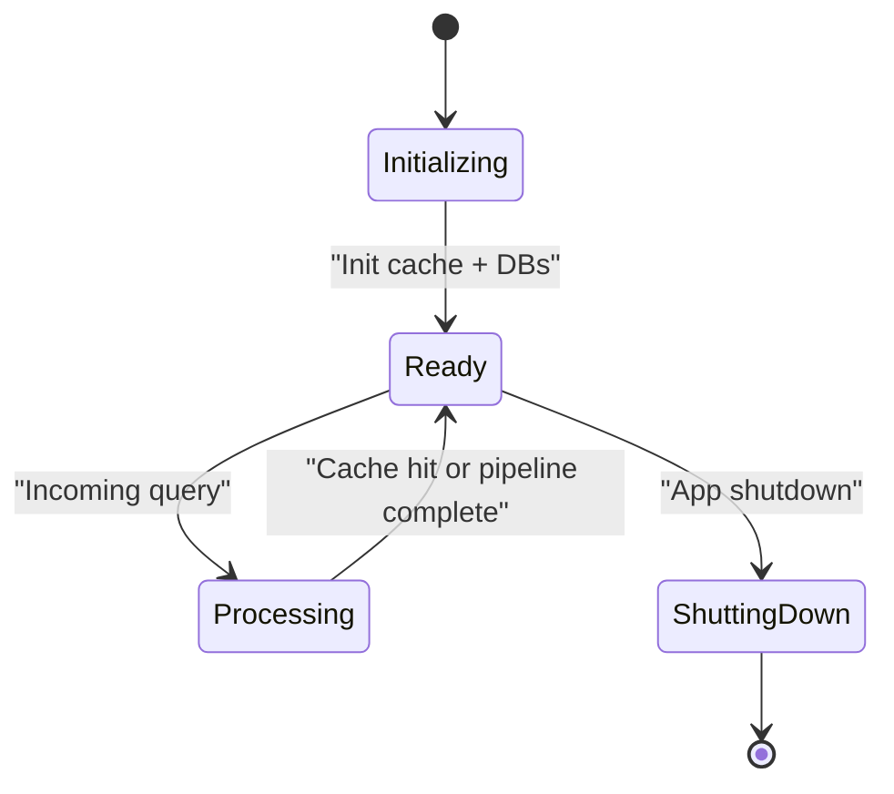
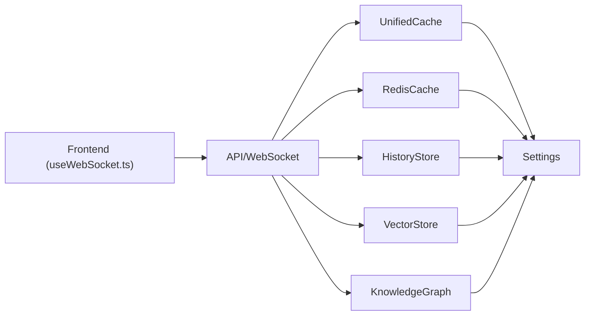

# Conversation History & Session Management

<cite>
**Referenced Files in This Document**
- [history_store.py](file://veritas-ai/core/history_store.py)
- [schemas.py](file://veritas-ai/models/schemas.py)
- [settings.py](file://veritas-ai/config/settings.py)
- [routes.py](file://veritas-ai/app/api/routes.py)
- [websocket.py](file://veritas-ai/app/api/websocket.py)
- [websockets.py](file://veritas-ai/api/websockets.py)
- [cache.py](file://veritas-ai/app/core/cache.py)
- [cache_layer.py](file://veritas-ai/core/cache_layer.py)
- [redis_cache.py](file://veritas-ai/core/redis_cache.py)
- [vector_store.py](file://veritas-ai/memory/vector_store.py)
- [knowledge_graph.py](file://veritas-ai/memory/knowledge_graph.py)
- [main.py](file://veritas-ai/app/main.py)
- [network_effect_builder.py](file://veritas-ai/feedback/network_effect_builder.py)
- [popup.js](file://veritas-ai/extension/popup/popup.js)
- [page.tsx](file://veritas-ai/frontend/app/timeline/page.tsx)
- [useWebSocket.ts](file://veritas-ai/frontend/hooks/useWebSocket.ts)
- [Dashboard.tsx](file://veritas-ai/frontend/components/Dashboard.tsx)
</cite>

## Table of Contents
1. [Introduction](#introduction)
2. [Project Structure](#project-structure)
3. [Core Components](#core-components)
4. [Architecture Overview](#architecture-overview)
5. [Detailed Component Analysis](#detailed-component-analysis)
6. [Dependency Analysis](#dependency-analysis)
7. [Performance Considerations](#performance-considerations)
8. [Troubleshooting Guide](#troubleshooting-guide)
9. [Conclusion](#conclusion)
10. [Appendices](#appendices)

## Introduction
This document describes the Conversation History and Session Management system responsible for preserving context and tracking dialogues across user interactions. It covers:
- History storage architecture with message serialization and conversation threading
- Context window management and user ownership
- Session lifecycle management, user context tracking, and conversation state persistence
- Integration with agent responses, context injection, and historical query processing
- Implementation examples for conversation retrieval, context trimming, and session restoration
- Privacy considerations, data retention policies, and conversation archiving strategies
- Guidance on history optimization, storage efficiency, and historical analysis capabilities

## Project Structure
The system spans backend services, caching layers, persistent stores, and frontend integrations:
- Backend API and WebSocket endpoints orchestrate queries and streaming updates
- Caching layers (local TTL and Redis) accelerate repeated queries
- Persistent stores include an SQLite history store and optional vector/KG stores
- Frontend integrates voice transcription, streaming UI, and history timelines

**Diagram sources**
- [routes.py:44-84](file://veritas-ai/app/api/routes.py#L44-L84)
- [websocket.py:100-166](file://veritas-ai/app/api/websocket.py#L100-L166)
- [websockets.py:112-233](file://veritas-ai/api/websockets.py#L112-L233)
- [cache.py:15-172](file://veritas-ai/app/core/cache.py#L15-L172)
- [cache_layer.py:10-41](file://veritas-ai/core/cache_layer.py#L10-L41)
- [redis_cache.py:18-232](file://veritas-ai/core/redis_cache.py#L18-L232)
- [history_store.py:23-105](file://veritas-ai/core/history_store.py#L23-L105)
- [vector_store.py:15-27](file://veritas-ai/memory/vector_store.py#L15-L27)
- [knowledge_graph.py:12-160](file://veritas-ai/memory/knowledge_graph.py#L12-L160)
- [main.py:31-102](file://veritas-ai/app/main.py#L31-L102)

**Section sources**
- [main.py:31-102](file://veritas-ai/app/main.py#L31-L102)
- [routes.py:44-84](file://veritas-ai/app/api/routes.py#L44-L84)
- [websocket.py:100-166](file://veritas-ai/app/api/websocket.py#L100-L166)
- [websockets.py:112-233](file://veritas-ai/api/websockets.py#L112-L233)
- [cache.py:15-172](file://veritas-ai/app/core/cache.py#L15-L172)
- [cache_layer.py:10-41](file://veritas-ai/core/cache_layer.py#L10-L41)
- [redis_cache.py:18-232](file://veritas-ai/core/redis_cache.py#L18-L232)
- [history_store.py:23-105](file://veritas-ai/core/history_store.py#L23-L105)
- [vector_store.py:15-27](file://veritas-ai/memory/vector_store.py#L15-L27)
- [knowledge_graph.py:12-160](file://veritas-ai/memory/knowledge_graph.py#L12-L160)

## Core Components
- History Store: SQLite-backed persistence for query history with owner scoping and configurable limits
- Caching Layer: Dual-tier cache (local TTL + Redis) with normalization and hashing for fast retrieval
- Vector Store: Local persistent Chroma vector database for retrieval augmented context
- Knowledge Graph: Async Neo4j integration for entity-relationship enrichment
- API and WebSockets: Endpoints orchestrating query resolution, progress reporting, and history logging
- Frontend Integrations: Voice transcription, streaming UI, and history timeline

Key responsibilities:
- Preserve conversation context across sessions via owner-scoped history
- Enforce context window via configurable limits
- Persist and expose historical queries for analysis and archiving
- Provide fast retrieval via caches and vector/KG stores

**Section sources**
- [history_store.py:23-105](file://veritas-ai/core/history_store.py#L23-L105)
- [cache.py:15-172](file://veritas-ai/app/core/cache.py#L15-L172)
- [cache_layer.py:10-41](file://veritas-ai/core/cache_layer.py#L10-L41)
- [redis_cache.py:18-232](file://veritas-ai/core/redis_cache.py#L18-L232)
- [vector_store.py:15-27](file://veritas-ai/memory/vector_store.py#L15-L27)
- [knowledge_graph.py:12-160](file://veritas-ai/memory/knowledge_graph.py#L12-L160)
- [routes.py:44-84](file://veritas-ai/app/api/routes.py#L44-L84)
- [websocket.py:100-166](file://veritas-ai/app/api/websocket.py#L100-L166)
- [websockets.py:112-233](file://veritas-ai/api/websockets.py#L112-L233)

## Architecture Overview
The system integrates frontend voice and streaming UI with backend pipelines that leverage caching, vector/KG stores, and persistent history.

**Diagram sources**
- [useWebSocket.ts:117-131](file://veritas-ai/frontend/hooks/useWebSocket.ts#L117-L131)
- [websocket.py:100-166](file://veritas-ai/app/api/websocket.py#L100-L166)
- [routes.py:44-84](file://veritas-ai/app/api/routes.py#L44-L84)
- [cache.py:66-115](file://veritas-ai/app/core/cache.py#L66-L115)
- [redis_cache.py:66-106](file://veritas-ai/core/redis_cache.py#L66-L106)
- [history_store.py:46-63](file://veritas-ai/core/history_store.py#L46-L63)
- [vector_store.py:15-27](file://veritas-ai/memory/vector_store.py#L15-L27)
- [knowledge_graph.py:45-112](file://veritas-ai/memory/knowledge_graph.py#L45-L112)

## Detailed Component Analysis

### History Storage and Ownership
- Schema: History entries include id, timestamp, query, status, truth_score, and summary
- Owner scoping: Each entry carries owner_email with a default of public
- Limits: Fetch uses HISTORY_MAX_ITEMS from settings
- Initialization: SQLite WAL mode and NORMAL sync for durability and throughput
- Logging: Non-blocking thread execution for history writes

Implementation highlights:
- Table initialization with defensive column addition
- Insertion of structured QueryResponse fields
- Selective retrieval by owner_email or public scope

**Section sources**
- [history_store.py:23-105](file://veritas-ai/core/history_store.py#L23-L105)
- [schemas.py:71-83](file://veritas-ai/models/schemas.py#L71-L83)
- [settings.py:27-28](file://veritas-ai/config/settings.py#L27-L28)

### Caching Layers and Context Preservation
- UnifiedCache: Two-tier cache with local TTL and Redis; graceful fallback and stats
- ResponseCache: Local TTL cache keyed by normalized and hashed queries
- RedisCache: Dedicated Redis cache with JSON serialization and TTL; supports vector embedding caching

Key behaviors:
- Normalization and hashing for deterministic keys
- Promotion from Redis to local on hit
- TTL enforcement and cross-tier synchronization

**Diagram sources**
- [cache.py:15-172](file://veritas-ai/app/core/cache.py#L15-L172)
- [cache_layer.py:10-41](file://veritas-ai/core/cache_layer.py#L10-L41)
- [redis_cache.py:18-232](file://veritas-ai/core/redis_cache.py#L18-L232)

**Section sources**
- [cache.py:15-172](file://veritas-ai/app/core/cache.py#L15-L172)
- [cache_layer.py:10-41](file://veritas-ai/core/cache_layer.py#L10-L41)
- [redis_cache.py:18-232](file://veritas-ai/core/redis_cache.py#L18-L232)

### Vector Store and Knowledge Graph Integration
- Vector Store: Initializes Chroma with Ollama embeddings and persistent directory
- Knowledge Graph: Async Neo4j driver with connection pooling and safe MERGE operations

Usage in pipelines:
- Vector retrieval augments context for fact-checking
- KG merges entities and relationships to enrich verification

**Section sources**
- [vector_store.py:15-27](file://veritas-ai/memory/vector_store.py#L15-L27)
- [knowledge_graph.py:12-160](file://veritas-ai/memory/knowledge_graph.py#L12-L160)

### API and WebSocket Orchestration
- Routes resolver: Checks cache, routes to fast or deep pipeline, logs history, and returns response
- WebSocket endpoints: Stream progress, run pipelines, and log results; support voice transcription and synthesis
- Startup/shutdown: Explicit database initialization and cache connection with timeouts and fallbacks

**Diagram sources**
- [useWebSocket.ts:117-131](file://veritas-ai/frontend/hooks/useWebSocket.ts#L117-L131)
- [websocket.py:100-166](file://veritas-ai/app/api/websocket.py#L100-L166)
- [routes.py:44-84](file://veritas-ai/app/api/routes.py#L44-L84)
- [cache.py:66-115](file://veritas-ai/app/core/cache.py#L66-L115)
- [history_store.py:46-63](file://veritas-ai/core/history_store.py#L46-L63)

**Section sources**
- [routes.py:44-84](file://veritas-ai/app/api/routes.py#L44-L84)
- [websocket.py:100-166](file://veritas-ai/app/api/websocket.py#L100-L166)
- [websockets.py:112-233](file://veritas-ai/api/websockets.py#L112-L233)
- [main.py:31-102](file://veritas-ai/app/main.py#L31-L102)

### Context Window Management and Retrieval
- Fetch recent history with owner scoping and configurable limit
- Normalize and hash queries for cache keys to ensure consistent context reuse
- Use vector/KG stores to inject relevant context into agent responses

**Diagram sources**
- [history_store.py:66-102](file://veritas-ai/core/history_store.py#L66-L102)

**Section sources**
- [history_store.py:66-102](file://veritas-ai/core/history_store.py#L66-L102)
- [settings.py:27-28](file://veritas-ai/config/settings.py#L27-L28)

### Session Lifecycle and State Persistence
- Startup: Explicit initialization of history and feedback databases; cache connection with timeouts
- Runtime: Queries are cached, logged to history, and streamed to clients
- Shutdown: Cache cleanup and graceful Redis closure

**Diagram sources**
- [main.py:31-102](file://veritas-ai/app/main.py#L31-L102)

**Section sources**
- [main.py:31-102](file://veritas-ai/app/main.py#L31-L102)

### Historical Query Processing and Analysis
- Network effect builder extracts validated feedback and builds datasets for training
- Frontend timeline page fetches and displays recent history with filtering

**Section sources**
- [network_effect_builder.py:24-79](file://veritas-ai/feedback/network_effect_builder.py#L24-L79)
- [page.tsx:16-34](file://veritas-ai/frontend/app/timeline/page.tsx#L16-L34)

## Dependency Analysis
The system exhibits layered dependencies:
- Frontend depends on WebSocket hooks and API base URLs
- API depends on caching, vector/KG stores, and history persistence
- Caching and persistence are configured via settings

**Diagram sources**
- [useWebSocket.ts:117-131](file://veritas-ai/frontend/hooks/useWebSocket.ts#L117-L131)
- [routes.py:44-84](file://veritas-ai/app/api/routes.py#L44-L84)
- [cache.py:15-172](file://veritas-ai/app/core/cache.py#L15-L172)
- [redis_cache.py:18-232](file://veritas-ai/core/redis_cache.py#L18-L232)
- [history_store.py:23-105](file://veritas-ai/core/history_store.py#L23-L105)
- [vector_store.py:15-27](file://veritas-ai/memory/vector_store.py#L15-L27)
- [knowledge_graph.py:12-160](file://veritas-ai/memory/knowledge_graph.py#L12-L160)
- [settings.py:13-83](file://veritas-ai/config/settings.py#L13-L83)

**Section sources**
- [settings.py:13-83](file://veritas-ai/config/settings.py#L13-L83)

## Performance Considerations
- Caching: Use UnifiedCache for low-latency hits; tune CACHE_MAX_ENTRIES and CACHE_TTL_SECONDS
- Persistence: SQLite WAL mode improves concurrency; ensure HISTORY_MAX_ITEMS aligns with UI needs
- Vector/KG: Embedding and graph operations are async; batch operations reduce overhead
- Streaming: Progress callbacks provide responsive UX; ensure pipeline stages remain lightweight

[No sources needed since this section provides general guidance]

## Troubleshooting Guide
Common issues and mitigations:
- Redis unavailability: UnifiedCache gracefully falls back to local cache; verify connectivity and timeouts
- History DB initialization failures: Startup initializes history DB explicitly; check permissions and paths
- WebSocket disconnects: Frontend reconnects with exponential backoff; inspect server logs for abrupt closures
- Cache misses: Verify normalization and hashing; confirm cache keys match query variations

**Section sources**
- [cache.py:43-65](file://veritas-ai/app/core/cache.py#L43-L65)
- [main.py:41-58](file://veritas-ai/app/main.py#L41-L58)
- [useWebSocket.ts:81-100](file://veritas-ai/frontend/hooks/useWebSocket.ts#L81-L100)

## Conclusion
The Conversation History and Session Management system combines explicit initialization, dual-tier caching, and persistent stores to preserve context and enable efficient dialogue tracking. Owner-scoped history, configurable limits, and streaming integrations deliver a robust foundation for historical analysis and session continuity.

[No sources needed since this section summarizes without analyzing specific files]

## Appendices

### Implementation Examples

- Conversation retrieval by owner
  - Use fetch_recent_history with owner_email to scope results
  - Reference: [history_store.py:66-102](file://veritas-ai/core/history_store.py#L66-L102)

- Context trimming and window management
  - Adjust HISTORY_MAX_ITEMS to control context window size
  - Reference: [settings.py:27-28](file://veritas-ai/config/settings.py#L27-L28)

- Session restoration and reuse
  - Leverage UnifiedCache and RedisCache for fast response reuse across sessions
  - References: [cache.py:15-172](file://veritas-ai/app/core/cache.py#L15-L172), [redis_cache.py:18-232](file://veritas-ai/core/redis_cache.py#L18-L232)

- Privacy and data retention
  - Owner scoping via owner_email ensures per-user isolation
  - Retention governed by HISTORY_MAX_ITEMS and cache TTLs
  - References: [history_store.py:35-42](file://veritas-ai/core/history_store.py#L35-L42), [settings.py:27-28](file://veritas-ai/config/settings.py#L27-L28)

- Conversation archiving strategies
  - Timeline page fetches recent history for archival review
  - References: [page.tsx:16-34](file://veritas-ai/frontend/app/timeline/page.tsx#L16-L34)

- Historical analysis capabilities
  - Network effect builder synthesizes feedback into training datasets
  - References: [network_effect_builder.py:24-79](file://veritas-ai/feedback/network_effect_builder.py#L24-L79)

- Frontend integration notes
  - Extension popup health checks and API base URL configuration
  - References: [popup.js:1-36](file://veritas-ai/extension/popup/popup.js#L1-L36)