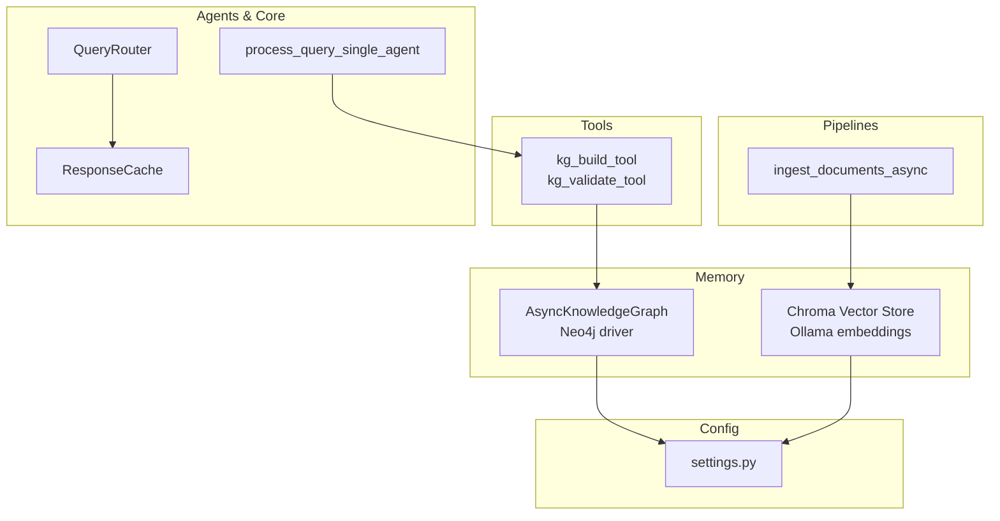
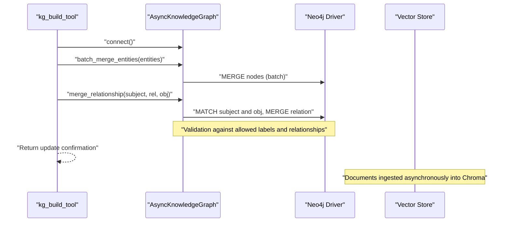
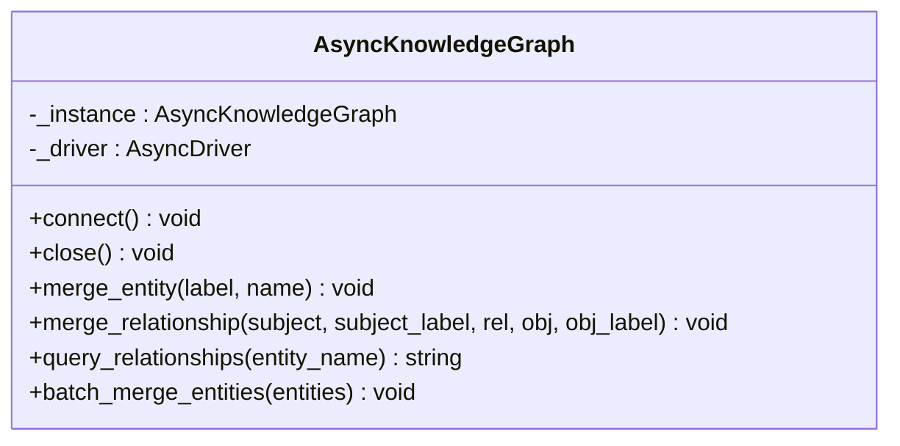
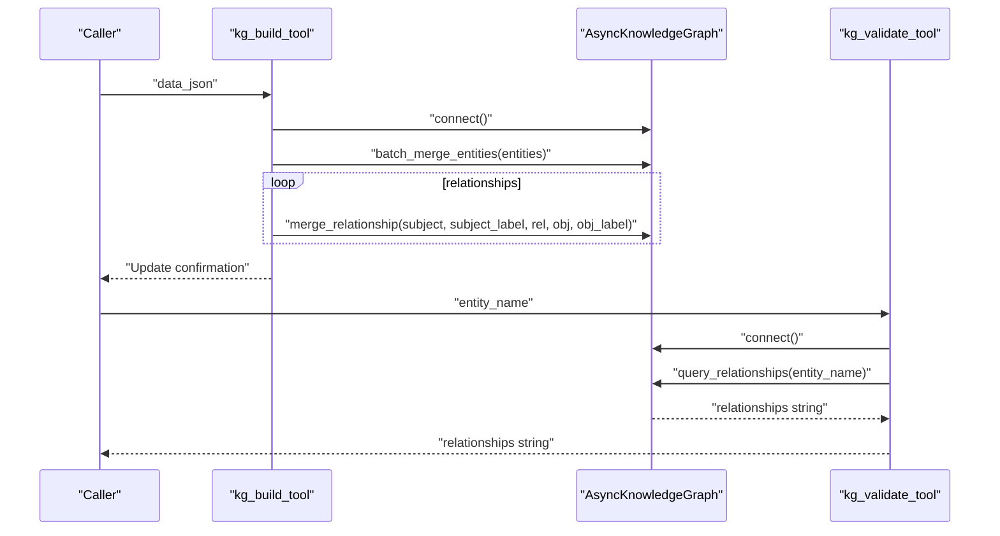
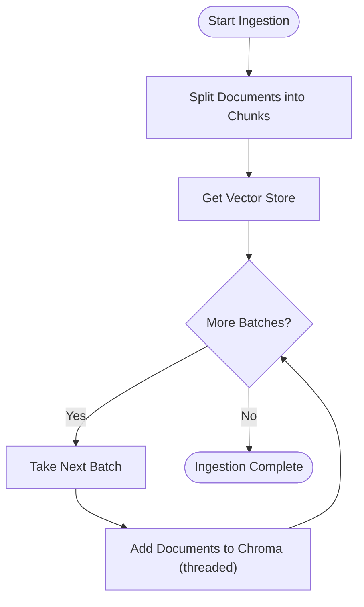
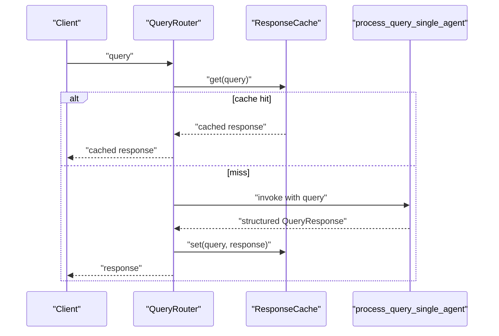
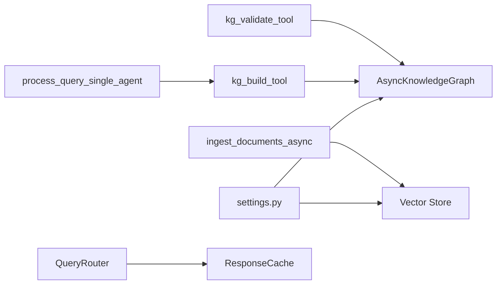

# Knowledge Graph

<cite>
**Referenced Files in This Document**
- [knowledge_graph.py](file://veritas-ai/memory/knowledge_graph.py)
- [vector_store.py](file://veritas-ai/memory/vector_store.py)
- [settings.py](file://veritas-ai/config/settings.py)
- [kg_tools.py](file://veritas-ai/tools/kg_tools.py)
- [schemas.py](file://veritas-ai/models/schemas.py)
- [ingestion_pipeline.py](file://veritas-ai/pipelines/ingestion_pipeline.py)
- [nlp_tools.py](file://veritas-ai/tools/nlp_tools.py)
- [base_tools.py](file://veritas-ai/tools/base_tools.py)
- [query_agent.py](file://veritas-ai/agents/query_agent.py)
- [main.py](file://veritas-ai/main.py)
- [app/main.py](file://veritas-ai/app/main.py)
- [router.py](file://veritas-ai/core/router.py)
- [cache_layer.py](file://veritas-ai/core/cache_layer.py)
</cite>

## Table of Contents
1. [Introduction](#introduction)
2. [Project Structure](#project-structure)
3. [Core Components](#core-components)
4. [Architecture Overview](#architecture-overview)
5. [Detailed Component Analysis](#detailed-component-analysis)
6. [Dependency Analysis](#dependency-analysis)
7. [Performance Considerations](#performance-considerations)
8. [Troubleshooting Guide](#troubleshooting-guide)
9. [Conclusion](#conclusion)
10. [Appendices](#appendices)

## Introduction
This document describes the Knowledge Graph system within the Veritas AI project, focusing on entity relationship mapping and inference capabilities. It explains how the graph is constructed from extracted entities and relationships, how it is queried and validated, and how it integrates with external knowledge sources and dynamic updates. It also covers schema design, entity normalization, consistency maintenance, visualization guidance, performance optimization, and scalability considerations for large-scale knowledge bases.

## Project Structure
The Knowledge Graph functionality spans several modules:
- Memory: Neo4j-backed async knowledge graph and Chroma vector store
- Tools: LangChain tools to build and validate the Knowledge Graph
- Pipelines: Document ingestion pipeline for vectorizing textual knowledge
- Agents and Core: Query processing, routing, caching, and explainability layers
- Configuration: Environment-driven settings for Neo4j, embeddings, and retrieval

**Diagram sources**
- [knowledge_graph.py:12-160](file://veritas-ai/memory/knowledge_graph.py#L12-L160)
- [vector_store.py:1-27](file://veritas-ai/memory/vector_store.py#L1-L27)
- [kg_tools.py:1-50](file://veritas-ai/tools/kg_tools.py#L1-L50)
- [ingestion_pipeline.py:1-38](file://veritas-ai/pipelines/ingestion_pipeline.py#L1-L38)
- [query_agent.py:1-47](file://veritas-ai/agents/query_agent.py#L1-L47)
- [router.py:81-162](file://veritas-ai/core/router.py#L81-L162)
- [cache_layer.py:1-40](file://veritas-ai/core/cache_layer.py#L1-L40)
- [settings.py:1-83](file://veritas-ai/config/settings.py#L1-L83)

**Section sources**
- [knowledge_graph.py:1-160](file://veritas-ai/memory/knowledge_graph.py#L1-L160)
- [vector_store.py:1-27](file://veritas-ai/memory/vector_store.py#L1-L27)
- [kg_tools.py:1-50](file://veritas-ai/tools/kg_tools.py#L1-L50)
- [ingestion_pipeline.py:1-38](file://veritas-ai/pipelines/ingestion_pipeline.py#L1-L38)
- [query_agent.py:1-47](file://veritas-ai/agents/query_agent.py#L1-L47)
- [router.py:81-162](file://veritas-ai/core/router.py#L81-L162)
- [cache_layer.py:1-40](file://veritas-ai/core/cache_layer.py#L1-L40)
- [settings.py:1-83](file://veritas-ai/config/settings.py#L1-L83)

## Core Components
- AsyncKnowledgeGraph: Async Neo4j client responsible for entity and relationship creation, validation, and querying. It enforces allowed labels and relationships, supports batch entity merging, and provides a relationship query interface.
- Chroma Vector Store: Local persistent vector store backed by Ollama embeddings for semantic retrieval and knowledge grounding.
- kg_build_tool and kg_validate_tool: LangChain tools to ingest structured entity/relationship data into the graph and to validate/query relationships for a given entity.
- Ingestion Pipeline: Asynchronous document ingestion with chunking and batching for vector store population.
- Query Agent and Router: Single-agent query processing and intelligent routing with caching to optimize performance.
- Configuration: Centralized settings for Neo4j credentials, embedding model, and retrieval parameters.

**Section sources**
- [knowledge_graph.py:12-160](file://veritas-ai/memory/knowledge_graph.py#L12-L160)
- [vector_store.py:1-27](file://veritas-ai/memory/vector_store.py#L1-L27)
- [kg_tools.py:1-50](file://veritas-ai/tools/kg_tools.py#L1-L50)
- [ingestion_pipeline.py:1-38](file://veritas-ai/pipelines/ingestion_pipeline.py#L1-L38)
- [query_agent.py:1-47](file://veritas-ai/agents/query_agent.py#L1-L47)
- [router.py:81-162](file://veritas-ai/core/router.py#L81-L162)
- [cache_layer.py:1-40](file://veritas-ai/core/cache_layer.py#L1-L40)
- [settings.py:1-83](file://veritas-ai/config/settings.py#L1-L83)

## Architecture Overview
The Knowledge Graph architecture combines:
- Graph storage: Neo4j via AsyncKnowledgeGraph
- Semantic storage: Chroma with Ollama embeddings
- Ingestion: Document chunking and vector insertion
- Querying: Structured validation and relationship discovery
- Routing and caching: Intelligent query routing and response caching

**Diagram sources**
- [kg_tools.py:1-50](file://veritas-ai/tools/kg_tools.py#L1-L50)
- [knowledge_graph.py:12-160](file://veritas-ai/memory/knowledge_graph.py#L12-L160)
- [vector_store.py:1-27](file://veritas-ai/memory/vector_store.py#L1-L27)
- [ingestion_pipeline.py:1-38](file://veritas-ai/pipelines/ingestion_pipeline.py#L1-L38)

## Detailed Component Analysis

### AsyncKnowledgeGraph
Responsibilities:
- Establish and maintain an async Neo4j connection with connection pooling
- Merge nodes (entities) with enforced labels
- Merge relationships with enforced relationship types and label constraints
- Query outgoing relationships for a given entity
- Batch merge entities for efficient ingestion

Key design points:
- Singleton pattern ensures a single driver instance
- Allowed label and relationship sets constrain schema enforcement
- Async sessions and tasks enable concurrent operations
- Logging for connectivity and mutation errors

**Diagram sources**
- [knowledge_graph.py:12-160](file://veritas-ai/memory/knowledge_graph.py#L12-L160)

**Section sources**
- [knowledge_graph.py:12-160](file://veritas-ai/memory/knowledge_graph.py#L12-L160)

### kg_build_tool and kg_validate_tool
Responsibilities:
- kg_build_tool: Accepts a JSON payload containing entities and relationships, validates structure, connects to the graph, performs batch entity merges, and then merges each relationship
- kg_validate_tool: Connects to the graph and returns a human-readable string of explicitly mapped relationships for a given entity

Processing logic:
- JSON parsing with strict schema expectations
- Batch entity ingestion followed by relationship ingestion
- Relationship query returning formatted results

**Diagram sources**
- [kg_tools.py:1-50](file://veritas-ai/tools/kg_tools.py#L1-L50)
- [knowledge_graph.py:88-112](file://veritas-ai/memory/knowledge_graph.py#L88-L112)

**Section sources**
- [kg_tools.py:1-50](file://veritas-ai/tools/kg_tools.py#L1-L50)
- [knowledge_graph.py:88-112](file://veritas-ai/memory/knowledge_graph.py#L88-L112)

### Vector Store and Ingestion Pipeline
Responsibilities:
- Vector store initialization with Ollama embeddings and persistent Chroma collection
- Asynchronous document ingestion with chunking and batching to avoid resource contention

Implementation highlights:
- Recursive character splitting for chunking
- Batch submission to Chroma using threads to keep the event loop responsive
- Persistent directory configured via settings

**Diagram sources**
- [ingestion_pipeline.py:7-33](file://veritas-ai/pipelines/ingestion_pipeline.py#L7-L33)
- [vector_store.py:15-27](file://veritas-ai/memory/vector_store.py#L15-L27)

**Section sources**
- [ingestion_pipeline.py:1-38](file://veritas-ai/pipelines/ingestion_pipeline.py#L1-L38)
- [vector_store.py:1-27](file://veritas-ai/memory/vector_store.py#L1-L27)
- [settings.py:50-54](file://veritas-ai/config/settings.py#L50-L54)

### Query Processing and Routing
Responsibilities:
- Single-agent query processing that produces a structured response aligned to a schema
- Intelligent routing that decides between cache hit, fast path, or full pipeline
- Response caching to reduce repeated computation

**Diagram sources**
- [query_agent.py:7-47](file://veritas-ai/agents/query_agent.py#L7-L47)
- [router.py:81-162](file://veritas-ai/core/router.py#L81-L162)
- [cache_layer.py:1-40](file://veritas-ai/core/cache_layer.py#L1-L40)

**Section sources**
- [query_agent.py:1-47](file://veritas-ai/agents/query_agent.py#L1-L47)
- [router.py:81-162](file://veritas-ai/core/router.py#L81-L162)
- [cache_layer.py:1-40](file://veritas-ai/core/cache_layer.py#L1-L40)
- [schemas.py:10-26](file://veritas-ai/models/schemas.py#L10-L26)

### Schema Design, Entity Normalization, and Consistency
Schema design:
- Allowed labels: Person, Organization, Event, Location
- Allowed relationships: ANNOUNCED, OCCURRED_AT, AFFILIATED_WITH, REPORTED_BY
- Enforced at ingestion time to maintain graph integrity

Entity normalization:
- Query normalization in cache layer ensures equivalent queries map to the same cache key
- String normalization removes extra whitespace and lowercases for consistent hashing

Consistency maintenance:
- MERGE semantics in Neo4j prevent duplication
- Validation functions reject unsupported labels/relationships
- Batch operations reduce partial failures and improve atomicity

**Section sources**
- [knowledge_graph.py:8-9](file://veritas-ai/memory/knowledge_graph.py#L8-L9)
- [knowledge_graph.py:45-86](file://veritas-ai/memory/knowledge_graph.py#L45-L86)
- [cache_layer.py:21-27](file://veritas-ai/core/cache_layer.py#L21-L27)

### Integration with External Knowledge Sources and Dynamic Updates
External knowledge sources:
- Web search placeholder tool to simulate data collection
- NLP tools for fake news detection to inform knowledge quality
- Configuration-driven settings for API keys and model endpoints

Dynamic updates:
- kg_build_tool ingests structured knowledge from autonomous extraction
- kg_validate_tool provides on-demand validation of relationships
- Ingestion pipeline supports continuous document ingestion for vector expansion

**Section sources**
- [base_tools.py:1-10](file://veritas-ai/tools/base_tools.py#L1-L10)
- [nlp_tools.py:1-52](file://veritas-ai/tools/nlp_tools.py#L1-L52)
- [settings.py:60-67](file://veritas-ai/config/settings.py#L60-L67)
- [kg_tools.py:1-50](file://veritas-ai/tools/kg_tools.py#L1-L50)

### Implementation Examples
Note: The following examples describe workflows using the existing components. Replace placeholders with actual values when invoking.

- Graph query for relationships
  - Use kg_validate_tool with an entity name to retrieve explicitly mapped relationships.
  - Example invocation path: [kg_validate_tool:39-49](file://veritas-ai/tools/kg_tools.py#L39-L49)

- Relationship discovery
  - After ingesting documents, use kg_build_tool to insert entities and relationships.
  - Example ingestion path: [kg_build_tool:5-37](file://veritas-ai/tools/kg_tools.py#L5-L37)

- Knowledge expansion
  - Continuously ingest new documents via the ingestion pipeline.
  - Example path: [ingest_documents_async:7-33](file://veritas-ai/pipelines/ingestion_pipeline.py#L7-L33)

- Entity normalization and caching
  - Leverage ResponseCache and normalization logic for consistent query handling.
  - Example path: [ResponseCache:10-38](file://veritas-ai/core/cache_layer.py#L10-L38)

**Section sources**
- [kg_tools.py:1-50](file://veritas-ai/tools/kg_tools.py#L1-L50)
- [ingestion_pipeline.py:1-38](file://veritas-ai/pipelines/ingestion_pipeline.py#L1-L38)
- [cache_layer.py:1-40](file://veritas-ai/core/cache_layer.py#L1-L40)

## Dependency Analysis
High-level dependencies:
- kg_tools depends on AsyncKnowledgeGraph for graph mutations and queries
- AsyncKnowledgeGraph depends on settings for Neo4j connection parameters
- Vector store depends on settings for embedding model and persistence directory
- Ingestion pipeline depends on vector_store and text splitter utilities
- Query routing and caching depend on ResponseCache and Redis cache integration
- App lifecycle initializes caches, databases, and background model preload

**Diagram sources**
- [settings.py:1-83](file://veritas-ai/config/settings.py#L1-L83)
- [knowledge_graph.py:12-160](file://veritas-ai/memory/knowledge_graph.py#L12-L160)
- [vector_store.py:1-27](file://veritas-ai/memory/vector_store.py#L1-L27)
- [kg_tools.py:1-50](file://veritas-ai/tools/kg_tools.py#L1-L50)
- [ingestion_pipeline.py:1-38](file://veritas-ai/pipelines/ingestion_pipeline.py#L1-L38)
- [query_agent.py:1-47](file://veritas-ai/agents/query_agent.py#L1-L47)
- [router.py:81-162](file://veritas-ai/core/router.py#L81-L162)
- [cache_layer.py:1-40](file://veritas-ai/core/cache_layer.py#L1-L40)

**Section sources**
- [settings.py:1-83](file://veritas-ai/config/settings.py#L1-L83)
- [knowledge_graph.py:12-160](file://veritas-ai/memory/knowledge_graph.py#L12-L160)
- [vector_store.py:1-27](file://veritas-ai/memory/vector_store.py#L1-L27)
- [kg_tools.py:1-50](file://veritas-ai/tools/kg_tools.py#L1-L50)
- [ingestion_pipeline.py:1-38](file://veritas-ai/pipelines/ingestion_pipeline.py#L1-L38)
- [query_agent.py:1-47](file://veritas-ai/agents/query_agent.py#L1-L47)
- [router.py:81-162](file://veritas-ai/core/router.py#L81-L162)
- [cache_layer.py:1-40](file://veritas-ai/core/cache_layer.py#L1-L40)

## Performance Considerations
- Async graph operations: Use AsyncKnowledgeGraph methods to minimize blocking and leverage connection pooling
- Batch entity merging: Prefer batch_merge_entities for bulk inserts to reduce round-trips
- Chunking and batching: Use the ingestion pipeline’s chunking and batch sizes to balance throughput and memory usage
- Caching: Normalize queries and cache responses to avoid recomputation
- Embedding model selection: Tune embedding model and persistence directory for cost and performance
- Connection timeouts: Configure acquisition and pool sizes appropriately for workload patterns

[No sources needed since this section provides general guidance]

## Troubleshooting Guide
Common issues and resolutions:
- Neo4j connectivity failures: Verify URI, user, and password in settings; check network and driver verification
- Unsupported labels/relationships: Ensure labels and relationship types match allowed sets
- JSON parsing errors: Validate payload structure for kg_build_tool
- Vector store initialization: Confirm persistence directory exists and embedding model is available
- Rate limiting and timeouts: Adjust global rate limiter and request timeouts in the app lifecycle

**Section sources**
- [knowledge_graph.py:25-43](file://veritas-ai/memory/knowledge_graph.py#L25-L43)
- [knowledge_graph.py:48-75](file://veritas-ai/memory/knowledge_graph.py#L48-L75)
- [kg_tools.py:15-37](file://veritas-ai/tools/kg_tools.py#L15-L37)
- [vector_store.py:20-26](file://veritas-ai/memory/vector_store.py#L20-L26)
- [app/main.py:126-148](file://veritas-ai/app/main.py#L126-L148)

## Conclusion
The Knowledge Graph system integrates asynchronous Neo4j operations with a vector store for semantic retrieval, enabling robust entity relationship mapping and inference. Tools support dynamic ingestion and validation, while routing and caching optimize query performance. Adhering to schema constraints and normalization practices maintains consistency and scalability for large knowledge bases.

[No sources needed since this section summarizes without analyzing specific files]

## Appendices

### Configuration Options Relevant to Knowledge Graph
- Neo4j settings: URI, user, password
- Vector store settings: embedding model, persistence directory, retrieval k
- Performance settings: parallel tools, streaming, chunk size

**Section sources**
- [settings.py:42-76](file://veritas-ai/config/settings.py#L42-L76)

### Example Invocation Paths
- kg_build_tool: [kg_tools.py:5-37](file://veritas-ai/tools/kg_tools.py#L5-L37)
- kg_validate_tool: [kg_tools.py:39-49](file://veritas-ai/tools/kg_tools.py#L39-L49)
- AsyncKnowledgeGraph methods: [knowledge_graph.py:45-131](file://veritas-ai/memory/knowledge_graph.py#L45-L131)
- Ingestion pipeline: [ingestion_pipeline.py:7-33](file://veritas-ai/pipelines/ingestion_pipeline.py#L7-L33)
- Query processing: [query_agent.py:7-47](file://veritas-ai/agents/query_agent.py#L7-L47)
- Response caching: [cache_layer.py:29-37](file://veritas-ai/core/cache_layer.py#L29-L37)