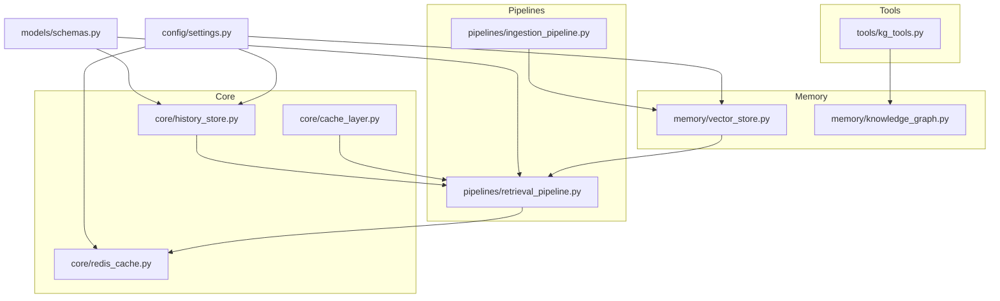
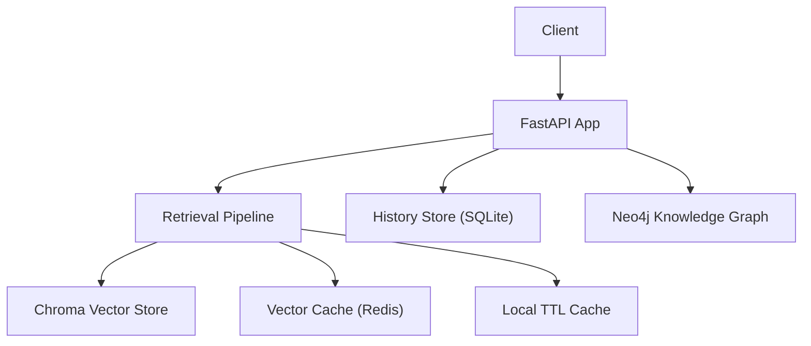
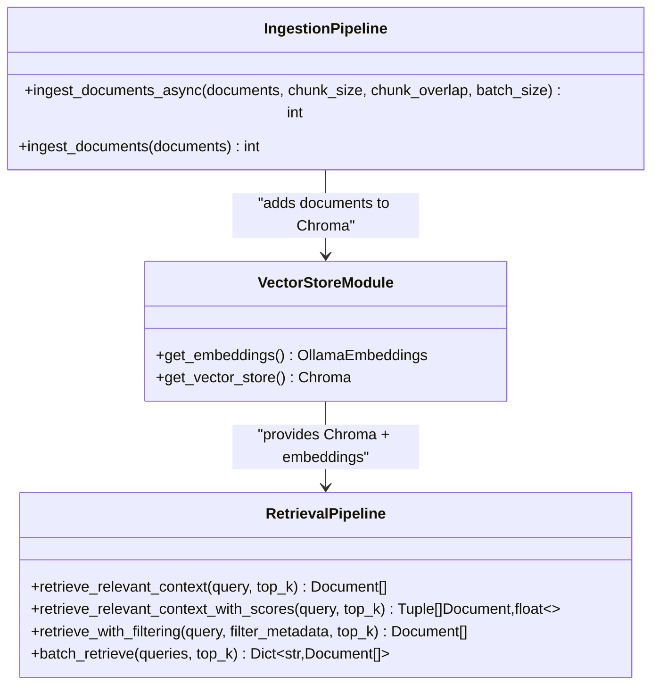
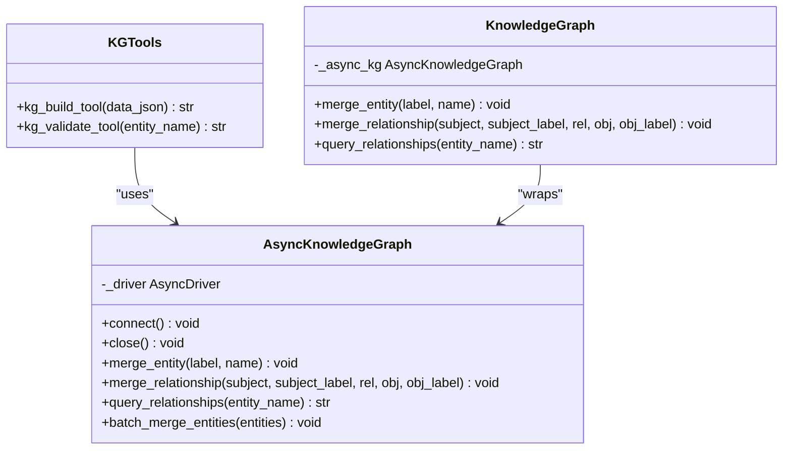
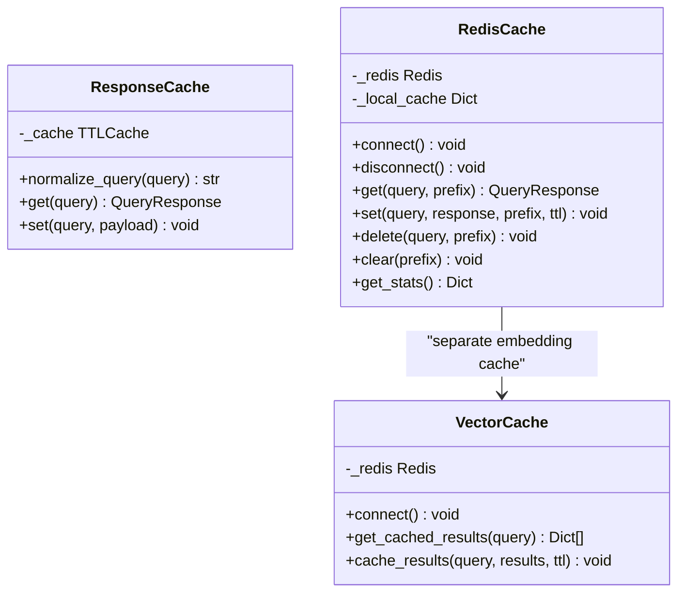
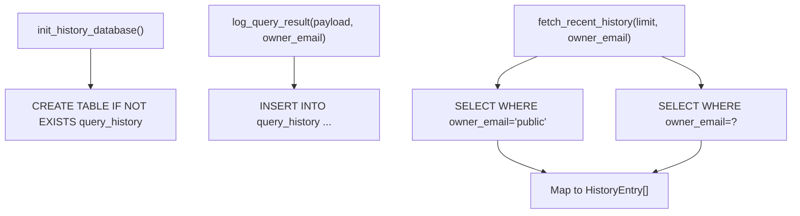
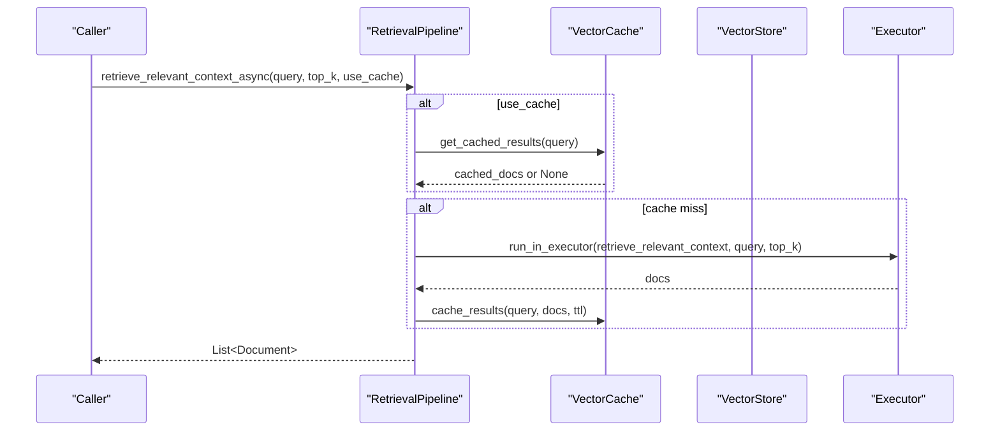
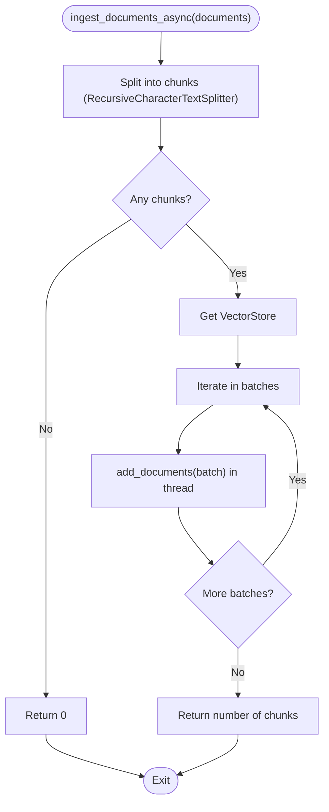
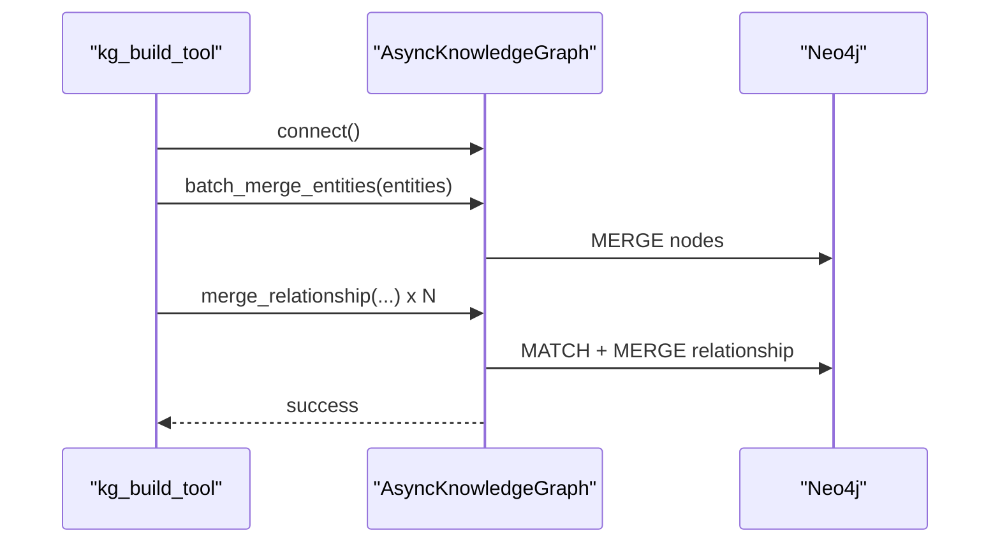
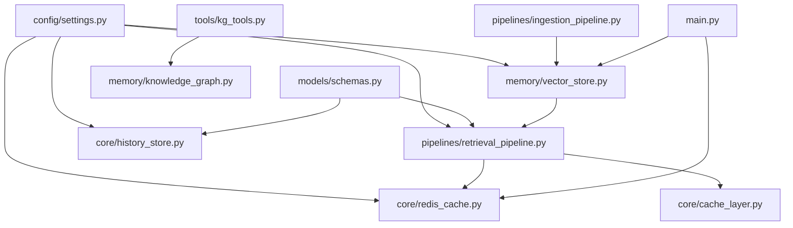

# Memory & Knowledge Management

<cite>
**Referenced Files in This Document**
- [vector_store.py](file://veritas-ai/memory/vector_store.py)
- [knowledge_graph.py](file://veritas-ai/memory/knowledge_graph.py)
- [cache_layer.py](file://veritas-ai/core/cache_layer.py)
- [redis_cache.py](file://veritas-ai/core/redis_cache.py)
- [history_store.py](file://veritas-ai/core/history_store.py)
- [settings.py](file://veritas-ai/config/settings.py)
- [schemas.py](file://veritas-ai/models/schemas.py)
- [retrieval_pipeline.py](file://veritas-ai/pipelines/retrieval_pipeline.py)
- [ingestion_pipeline.py](file://veritas-ai/pipelines/ingestion_pipeline.py)
- [kg_tools.py](file://veritas-ai/tools/kg_tools.py)
- [retrieval_agent.py](file://veritas-ai/app/agents/retrieval.py)
- [main.py](file://veritas-ai/main.py)
- [README.md](file://veritas-ai/README.md)
</cite>

## Table of Contents
1. [Introduction](#introduction)
2. [Project Structure](#project-structure)
3. [Core Components](#core-components)
4. [Architecture Overview](#architecture-overview)
5. [Detailed Component Analysis](#detailed-component-analysis)
6. [Dependency Analysis](#dependency-analysis)
7. [Performance Considerations](#performance-considerations)
8. [Troubleshooting Guide](#troubleshooting-guide)
9. [Conclusion](#conclusion)
10. [Appendices](#appendices)

## Introduction
This document explains the Memory and Knowledge Management system responsible for data persistence, retrieval, and contextual awareness. It covers:
- Vector Store: embedding generation, similarity search, semantic indexing, and ingestion pipelines
- Knowledge Graph: construction, relationship mapping, and inference/validation capabilities
- Cache Layer: local TTL cache and Redis-backed cache with invalidation and performance tuning
- History Store: conversation tracking, context preservation, and session management
- Implementation examples for custom embeddings, graph queries, cache configuration, and data lifecycle management
- Scalability, backup, and migration guidance

## Project Structure
The Memory and Knowledge subsystems are organized under dedicated modules:
- Memory: vector_store.py and knowledge_graph.py
- Core caches: cache_layer.py (local TTL) and redis_cache.py (distributed Redis)
- History: history_store.py (SQLite-backed)
- Pipelines: retrieval_pipeline.py and ingestion_pipeline.py
- Tools: kg_tools.py for graph ingestion and validation
- Config and models: settings.py and schemas.py
- Entry point and orchestration: main.py

**Diagram sources**
- [vector_store.py](file://veritas-ai/memory/vector_store.py)
- [knowledge_graph.py](file://veritas-ai/memory/knowledge_graph.py)
- [cache_layer.py](file://veritas-ai/core/cache_layer.py)
- [redis_cache.py](file://veritas-ai/core/redis_cache.py)
- [history_store.py](file://veritas-ai/core/history_store.py)
- [retrieval_pipeline.py](file://veritas-ai/pipelines/retrieval_pipeline.py)
- [ingestion_pipeline.py](file://veritas-ai/pipelines/ingestion_pipeline.py)
- [kg_tools.py](file://veritas-ai/tools/kg_tools.py)
- [settings.py](file://veritas-ai/config/settings.py)
- [schemas.py](file://veritas-ai/models/schemas.py)

**Section sources**
- [README.md](file://veritas-ai/README.md)
- [main.py](file://veritas-ai/main.py)

## Core Components
- Vector Store: initializes a persistent Chroma collection with Ollama embeddings and supports similarity search and filtering
- Knowledge Graph: async Neo4j driver with entity/relationship merging and relationship queries
- Cache Layer: local TTL cache and Redis-backed cache with normalization, hashing, and TTL controls
- History Store: SQLite-backed query history with WAL mode and owner-scoped queries
- Retrieval Pipeline: retrieval with optional vector cache, batching, and filtering
- Ingestion Pipeline: chunking and batched insertion into the vector store
- KG Tools: structured ingestion and validation utilities for the Knowledge Graph

**Section sources**
- [vector_store.py](file://veritas-ai/memory/vector_store.py)
- [knowledge_graph.py](file://veritas-ai/memory/knowledge_graph.py)
- [cache_layer.py](file://veritas-ai/core/cache_layer.py)
- [redis_cache.py](file://veritas-ai/core/redis_cache.py)
- [history_store.py](file://veritas-ai/core/history_store.py)
- [retrieval_pipeline.py](file://veritas-ai/pipelines/retrieval_pipeline.py)
- [ingestion_pipeline.py](file://veritas-ai/pipelines/ingestion_pipeline.py)
- [kg_tools.py](file://veritas-ai/tools/kg_tools.py)

## Architecture Overview
The Memory and Knowledge system integrates three pillars:
- Vector Store for semantic retrieval and indexing
- Knowledge Graph for entity-relationship reasoning and validation
- Cache Layer for performance and resilience

**Diagram sources**
- [main.py](file://veritas-ai/main.py)
- [retrieval_pipeline.py](file://veritas-ai/pipelines/retrieval_pipeline.py)
- [vector_store.py](file://veritas-ai/memory/vector_store.py)
- [redis_cache.py](file://veritas-ai/core/redis_cache.py)
- [cache_layer.py](file://veritas-ai/core/cache_layer.py)
- [history_store.py](file://veritas-ai/core/history_store.py)
- [knowledge_graph.py](file://veritas-ai/memory/knowledge_graph.py)

## Detailed Component Analysis

### Vector Store
- Embedding generation: wraps Ollama embeddings with configurable model and base URL
- Vector store initialization: creates a persistent Chroma collection with a fixed collection name and configured persist directory
- Retrieval: exposes similarity search and filtered retriever via the retrieval pipeline

**Diagram sources**
- [vector_store.py](file://veritas-ai/memory/vector_store.py)
- [retrieval_pipeline.py](file://veritas-ai/pipelines/retrieval_pipeline.py)
- [ingestion_pipeline.py](file://veritas-ai/pipelines/ingestion_pipeline.py)

**Section sources**
- [vector_store.py](file://veritas-ai/memory/vector_store.py)
- [retrieval_pipeline.py](file://veritas-ai/pipelines/retrieval_pipeline.py)
- [ingestion_pipeline.py](file://veritas-ai/pipelines/ingestion_pipeline.py)

### Knowledge Graph
- Async driver with connection pooling and connectivity verification
- Entity and relationship merging with label and relationship whitelists
- Relationship query returning human-readable mappings
- Batch entity merging for improved throughput
- Synchronous wrapper for backward compatibility

**Diagram sources**
- [knowledge_graph.py](file://veritas-ai/memory/knowledge_graph.py)
- [kg_tools.py](file://veritas-ai/tools/kg_tools.py)

**Section sources**
- [knowledge_graph.py](file://veritas-ai/memory/knowledge_graph.py)
- [kg_tools.py](file://veritas-ai/tools/kg_tools.py)

### Cache Layer
- Local TTL cache: normalized query hashing, TTL eviction, and thread-safe access
- Redis cache: dual-layer caching (local + Redis), normalized keys, TTL, deletion, and bulk clearing
- Vector cache: specialized embedding result caching with TTL

**Diagram sources**
- [cache_layer.py](file://veritas-ai/core/cache_layer.py)
- [redis_cache.py](file://veritas-ai/core/redis_cache.py)

**Section sources**
- [cache_layer.py](file://veritas-ai/core/cache_layer.py)
- [redis_cache.py](file://veritas-ai/core/redis_cache.py)

### History Store
- SQLite-backed query history with WAL mode and tuned pragmas
- Initialization, insert, and paginated fetch with optional owner scoping
- Strongly typed schema for history entries

**Diagram sources**
- [history_store.py](file://veritas-ai/core/history_store.py)
- [schemas.py](file://veritas-ai/models/schemas.py)

**Section sources**
- [history_store.py](file://veritas-ai/core/history_store.py)
- [schemas.py](file://veritas-ai/models/schemas.py)

### Retrieval Pipeline
- Retrieves relevant context via Chroma similarity search and filtered retriever
- Async retrieval with optional Redis vector cache
- Batch retrieval and query hash utilities

**Diagram sources**
- [retrieval_pipeline.py](file://veritas-ai/pipelines/retrieval_pipeline.py)
- [redis_cache.py](file://veritas-ai/core/redis_cache.py)
- [vector_store.py](file://veritas-ai/memory/vector_store.py)

**Section sources**
- [retrieval_pipeline.py](file://veritas-ai/pipelines/retrieval_pipeline.py)

### Ingestion Pipeline
- Splits raw documents into chunks and batches them for insertion
- Uses a thread pool to avoid blocking the event loop during embedding and storage

**Diagram sources**
- [ingestion_pipeline.py](file://veritas-ai/pipelines/ingestion_pipeline.py)
- [vector_store.py](file://veritas-ai/memory/vector_store.py)

**Section sources**
- [ingestion_pipeline.py](file://veritas-ai/pipelines/ingestion_pipeline.py)

### KG Tools
- Structured ingestion tool merges entities and relationships into the Knowledge Graph
- Validation tool queries explicit relationships for a given entity

**Diagram sources**
- [kg_tools.py](file://veritas-ai/tools/kg_tools.py)
- [knowledge_graph.py](file://veritas-ai/memory/knowledge_graph.py)

**Section sources**
- [kg_tools.py](file://veritas-ai/tools/kg_tools.py)

## Dependency Analysis
- Configuration-driven behavior: settings control embedding model, vector store persistence, retrieval top-k, cache TTL/max entries, Redis host/port/db, and Neo4j credentials
- Schema-driven contracts: QueryResponse and HistoryEntry define data shapes for cache and history
- Runtime orchestration: main.py initializes Redis cache and LLM models at startup and shuts them down gracefully

**Diagram sources**
- [settings.py](file://veritas-ai/config/settings.py)
- [schemas.py](file://veritas-ai/models/schemas.py)
- [vector_store.py](file://veritas-ai/memory/vector_store.py)
- [retrieval_pipeline.py](file://veritas-ai/pipelines/retrieval_pipeline.py)
- [ingestion_pipeline.py](file://veritas-ai/pipelines/ingestion_pipeline.py)
- [redis_cache.py](file://veritas-ai/core/redis_cache.py)
- [cache_layer.py](file://veritas-ai/core/cache_layer.py)
- [history_store.py](file://veritas-ai/core/history_store.py)
- [knowledge_graph.py](file://veritas-ai/memory/knowledge_graph.py)
- [kg_tools.py](file://veritas-ai/tools/kg_tools.py)
- [main.py](file://veritas-ai/main.py)

**Section sources**
- [settings.py](file://veritas-ai/config/settings.py)
- [schemas.py](file://veritas-ai/models/schemas.py)
- [main.py](file://veritas-ai/main.py)

## Performance Considerations
- Vector retrieval
  - Use batch retrieval for concurrent queries to reduce latency
  - Tune retrieval top-k and chunk sizes to balance recall and speed
  - Enable vector cache to avoid repeated embedding and similarity computations
- Embedding generation
  - Prefer local Ollama for low-latency, offline embeddings
  - Normalize queries to improve cache hit rates
- Knowledge Graph
  - Use batch entity merging to minimize round-trips
  - Limit relationship depth in queries for faster traversal
- Cache layer
  - Adjust TTL and max entries to match workload patterns
  - Monitor Redis stats to tune capacity and eviction policies
- History store
  - WAL mode improves concurrency; keep limit reasonable to avoid large scans

[No sources needed since this section provides general guidance]

## Troubleshooting Guide
- Vector Store
  - Verify persist directory exists and is writable
  - Confirm embedding model and base URL are reachable
- Knowledge Graph
  - Check Neo4j connectivity and credentials
  - Validate labels and relationship types against allowed sets
- Cache Layer
  - Redis failures fall back to local cache; monitor warnings
  - Clear prefixes selectively when invalidating stale data
- History Store
  - Ensure database initialization runs at startup
  - Owner-based filtering requires the owner_email column; migrations are handled automatically

**Section sources**
- [vector_store.py](file://veritas-ai/memory/vector_store.py)
- [knowledge_graph.py](file://veritas-ai/memory/knowledge_graph.py)
- [redis_cache.py](file://veritas-ai/core/redis_cache.py)
- [history_store.py](file://veritas-ai/core/history_store.py)

## Conclusion
The Memory and Knowledge Management system combines a local vector store for semantic search, a distributed cache for performance, and a knowledge graph for structured reasoning. Together with a robust history store, it enables scalable, contextual, and explainable truth verification workflows.

[No sources needed since this section summarizes without analyzing specific files]

## Appendices

### Implementation Examples

- Custom Embeddings
  - Configure embedding model and base URL via settings
  - Replace the Ollama wrapper with another embedding provider by adapting the embedding factory
  - Ensure the vector store uses the same embedding function consistently

  **Section sources**
  - [settings.py](file://veritas-ai/config/settings.py)
  - [vector_store.py](file://veritas-ai/memory/vector_store.py)

- Graph Queries
  - Use the KG validation tool to retrieve explicit relationships for an entity
  - Build structured JSON payloads to ingest entities and relationships via the KG ingestion tool

  **Section sources**
  - [kg_tools.py](file://veritas-ai/tools/kg_tools.py)
  - [knowledge_graph.py](file://veritas-ai/memory/knowledge_graph.py)

- Cache Configuration
  - Set cache TTL and max entries to balance freshness and throughput
  - Use Redis cache for distributed deployments; rely on local TTL cache for single-node setups
  - Invalidate selectively by prefix or clear the entire cache when needed

  **Section sources**
  - [settings.py](file://veritas-ai/config/settings.py)
  - [redis_cache.py](file://veritas-ai/core/redis_cache.py)
  - [cache_layer.py](file://veritas-ai/core/cache_layer.py)

- Data Lifecycle Management
  - Ingestion: split and batch-insert documents into the vector store
  - Retrieval: optionally cache results and apply filters
  - History: log query results and fetch recent items with owner scoping

  **Section sources**
  - [ingestion_pipeline.py](file://veritas-ai/pipelines/ingestion_pipeline.py)
  - [retrieval_pipeline.py](file://veritas-ai/pipelines/retrieval_pipeline.py)
  - [history_store.py](file://veritas-ai/core/history_store.py)

### Scalability, Backup, and Migration

- Scalability
  - Horizontal scaling: run multiple API instances behind a load balancer
  - Caching: use Redis cluster for shared cache across instances
  - Vector scale-out: consider external vector databases if local Chroma grows too large

- Backup Strategies
  - Vector store: back up the Chroma persist directory regularly
  - Knowledge Graph: export and restore Neo4j snapshots
  - History store: back up SQLite database files

- Migration Procedures
  - Vector store: snapshot the persist directory; restore by replacing the directory on the new system
  - Knowledge Graph: perform logical or physical backups of the Neo4j database
  - History store: export/import SQLite data using standard tools

[No sources needed since this section provides general guidance]