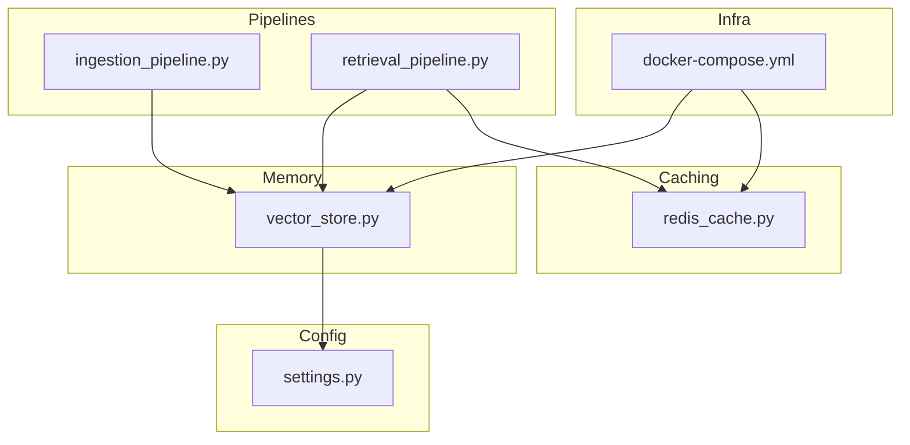
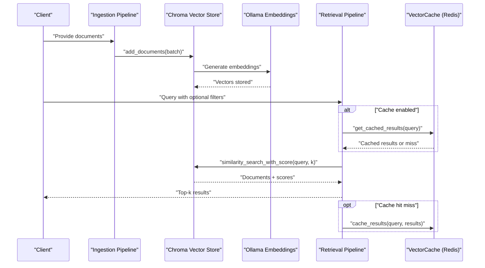
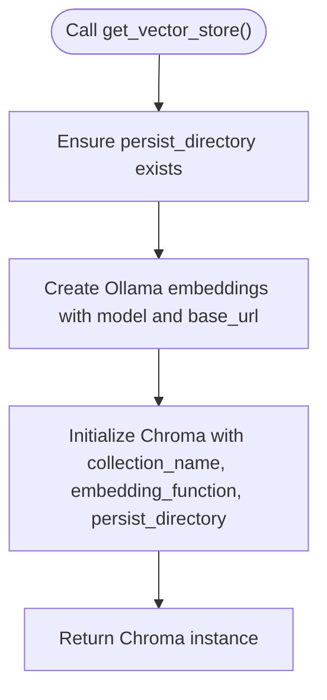
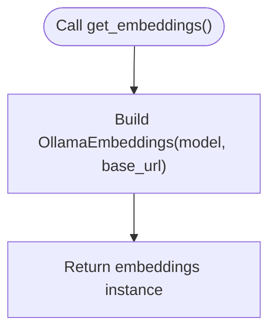
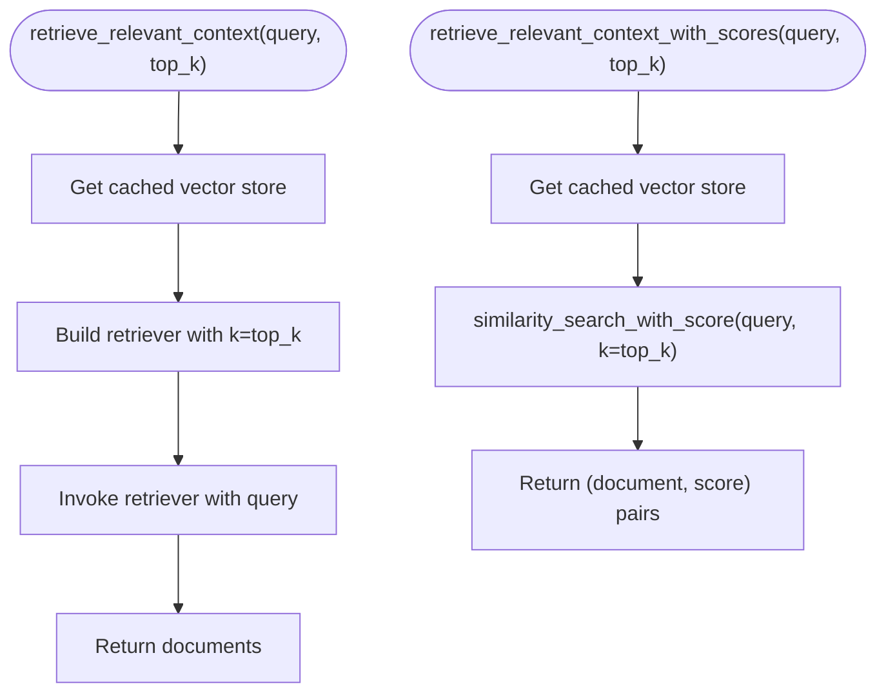
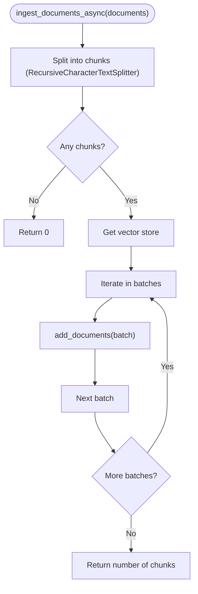
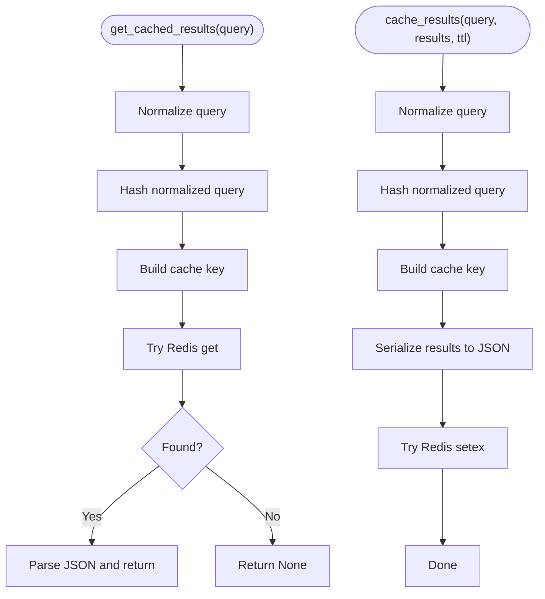
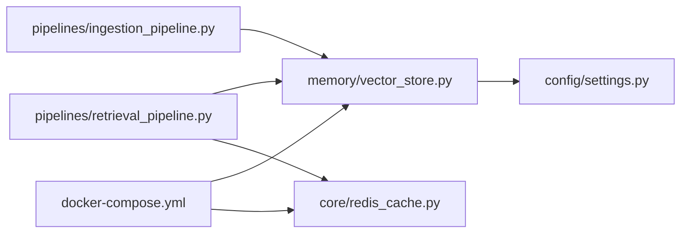

# Vector Store & Embeddings

<cite>
**Referenced Files in This Document**
- [vector_store.py](file://veritas-ai/memory/vector_store.py)
- [retrieval_pipeline.py](file://veritas-ai/pipelines/retrieval_pipeline.py)
- [ingestion_pipeline.py](file://veritas-ai/pipelines/ingestion_pipeline.py)
- [settings.py](file://veritas-ai/config/settings.py)
- [redis_cache.py](file://veritas-ai/core/redis_cache.py)
- [docker-compose.yml](file://veritas-ai/docker-compose.yml)
</cite>

## Table of Contents
1. [Introduction](#introduction)
2. [Project Structure](#project-structure)
3. [Core Components](#core-components)
4. [Architecture Overview](#architecture-overview)
5. [Detailed Component Analysis](#detailed-component-analysis)
6. [Dependency Analysis](#dependency-analysis)
7. [Performance Considerations](#performance-considerations)
8. [Troubleshooting Guide](#troubleshooting-guide)
9. [Conclusion](#conclusion)
10. [Appendices](#appendices)

## Introduction
This document explains the Vector Store and Embeddings system used for semantic search and similarity indexing. It focuses on:
- Chroma vector store implementation with local persistent storage
- Ollama embeddings integration for generating vector representations
- Retrieval pipelines for similarity search and filtered retrieval
- Configuration options for embedding models, persistence directories, and performance tuning
- Practical usage patterns for ingesting documents, querying similar content, and managing the knowledge base
- Scalability, model selection, and backup strategies

## Project Structure
The vector and embedding system spans several modules:
- Memory layer: vector store initialization and embedding factory
- Pipelines: ingestion and retrieval workflows
- Configuration: environment-driven settings for models, persistence, and retrieval parameters
- Caching: optional Redis-backed vector result caching
- Infrastructure: Docker Compose services for ChromaDB, Redis, and Ollama

**Diagram sources**
- [vector_store.py:1-27](file://veritas-ai/memory/vector_store.py#L1-L27)
- [ingestion_pipeline.py:1-38](file://veritas-ai/pipelines/ingestion_pipeline.py#L1-L38)
- [retrieval_pipeline.py:1-112](file://veritas-ai/pipelines/retrieval_pipeline.py#L1-L112)
- [settings.py:13-83](file://veritas-ai/config/settings.py#L13-L83)
- [redis_cache.py:166-232](file://veritas-ai/core/redis_cache.py#L166-L232)
- [docker-compose.yml:94-159](file://veritas-ai/docker-compose.yml#L94-L159)

**Section sources**
- [vector_store.py:1-27](file://veritas-ai/memory/vector_store.py#L1-L27)
- [retrieval_pipeline.py:1-112](file://veritas-ai/pipelines/retrieval_pipeline.py#L1-L112)
- [ingestion_pipeline.py:1-38](file://veritas-ai/pipelines/ingestion_pipeline.py#L1-L38)
- [settings.py:13-83](file://veritas-ai/config/settings.py#L13-L83)
- [redis_cache.py:166-232](file://veritas-ai/core/redis_cache.py#L166-L232)
- [docker-compose.yml:94-159](file://veritas-ai/docker-compose.yml#L94-L159)

## Core Components
- Vector store factory: initializes a persistent Chroma collection with a configured embedding function and persistence directory.
- Embedding factory: wraps Ollama embeddings with model and base URL from settings.
- Retrieval pipeline: exposes synchronous and asynchronous retrieval with optional filtering and Redis caching.
- Ingestion pipeline: splits documents into chunks and adds them to the vector store in batches.
- Settings: environment-driven configuration for Ollama base URL, embedding model, persistence directory, and retrieval top-K.
- Redis cache: optional caching for vector search results keyed by normalized query hashes.

Key responsibilities:
- Persist vectors locally for fast similarity search
- Generate dense vector embeddings using a local Ollama model
- Provide efficient retrieval with configurable top-K and optional filters
- Optionally cache results to reduce repeated computation

**Section sources**
- [vector_store.py:8-26](file://veritas-ai/memory/vector_store.py#L8-L26)
- [retrieval_pipeline.py:29-92](file://veritas-ai/pipelines/retrieval_pipeline.py#L29-L92)
- [ingestion_pipeline.py:7-37](file://veritas-ai/pipelines/ingestion_pipeline.py#L7-L37)
- [settings.py:42-58](file://veritas-ai/config/settings.py#L42-L58)
- [redis_cache.py:166-218](file://veritas-ai/core/redis_cache.py#L166-L218)

## Architecture Overview
The system integrates LangChain’s Chroma vector store with Ollama embeddings and optional Redis caching. The ingestion pipeline prepares documents and adds them to the vector store. The retrieval pipeline performs similarity search and optionally filters by metadata. Redis caches recent vector search results for improved latency.

**Diagram sources**
- [ingestion_pipeline.py:7-37](file://veritas-ai/pipelines/ingestion_pipeline.py#L7-L37)
- [vector_store.py:8-26](file://veritas-ai/memory/vector_store.py#L8-L26)
- [retrieval_pipeline.py:39-92](file://veritas-ai/pipelines/retrieval_pipeline.py#L39-L92)
- [redis_cache.py:195-218](file://veritas-ai/core/redis_cache.py#L195-L218)

## Detailed Component Analysis

### Vector Store Factory
- Initializes a persistent Chroma collection named “veritas_knowledge_base”
- Ensures the persistence directory exists
- Uses Ollama embeddings configured via environment settings

**Diagram sources**
- [vector_store.py:15-26](file://veritas-ai/memory/vector_store.py#L15-L26)

**Section sources**
- [vector_store.py:15-26](file://veritas-ai/memory/vector_store.py#L15-L26)

### Embedding Factory
- Creates Ollama embeddings with model and base URL from settings
- Enables local generation of dense text embeddings

**Diagram sources**
- [vector_store.py:8-13](file://veritas-ai/memory/vector_store.py#L8-L13)

**Section sources**
- [vector_store.py:8-13](file://veritas-ai/memory/vector_store.py#L8-L13)

### Retrieval Pipeline
- Provides:
  - Synchronous retrieval by top-K
  - Retrieval with scores
  - Asynchronous retrieval with optional Redis caching
  - Filtered retrieval by metadata
  - Batch retrieval across multiple queries
- Uses a cached vector store instance to avoid repeated initialization

**Diagram sources**
- [retrieval_pipeline.py:29-45](file://veritas-ai/pipelines/retrieval_pipeline.py#L29-L45)

**Section sources**
- [retrieval_pipeline.py:29-92](file://veritas-ai/pipelines/retrieval_pipeline.py#L29-L92)

### Ingestion Pipeline
- Splits raw documents into overlapping chunks
- Adds chunks to the vector store in batches
- Uses async threading to avoid blocking the event loop

**Diagram sources**
- [ingestion_pipeline.py:7-37](file://veritas-ai/pipelines/ingestion_pipeline.py#L7-L37)

**Section sources**
- [ingestion_pipeline.py:7-37](file://veritas-ai/pipelines/ingestion_pipeline.py#L7-L37)

### Redis Vector Cache
- Normalizes queries and hashes them for cache keys
- Stores cached results as JSON with TTL
- Supports async Redis connectivity with graceful fallback to local cache

**Diagram sources**
- [redis_cache.py:195-218](file://veritas-ai/core/redis_cache.py#L195-L218)

**Section sources**
- [redis_cache.py:166-218](file://veritas-ai/core/redis_cache.py#L166-L218)

## Dependency Analysis
- vector_store.py depends on:
  - LangChain embeddings and vectorstores
  - settings for Ollama base URL and embedding model
- retrieval_pipeline.py depends on:
  - vector_store.py for Chroma instance
  - redis_cache.py for optional caching
  - settings for retrieval top-K
- ingestion_pipeline.py depends on:
  - vector_store.py for Chroma instance
  - LangChain text splitter for chunking
- docker-compose.yml provisions:
  - ChromaDB service with persistent volume
  - Redis service with persistence
  - Ollama service for local embeddings

**Diagram sources**
- [vector_store.py:6-26](file://veritas-ai/memory/vector_store.py#L6-L26)
- [retrieval_pipeline.py:6-8](file://veritas-ai/pipelines/retrieval_pipeline.py#L6-L8)
- [ingestion_pipeline.py:5](file://veritas-ai/pipelines/ingestion_pipeline.py#L5)
- [settings.py:13-83](file://veritas-ai/config/settings.py#L13-L83)
- [redis_cache.py:11](file://veritas-ai/core/redis_cache.py#L11)
- [docker-compose.yml:94-159](file://veritas-ai/docker-compose.yml#L94-L159)

**Section sources**
- [vector_store.py:6-26](file://veritas-ai/memory/vector_store.py#L6-L26)
- [retrieval_pipeline.py:6-8](file://veritas-ai/pipelines/retrieval_pipeline.py#L6-L8)
- [ingestion_pipeline.py:5](file://veritas-ai/pipelines/ingestion_pipeline.py#L5)
- [settings.py:13-83](file://veritas-ai/config/settings.py#L13-L83)
- [redis_cache.py:11](file://veritas-ai/core/redis_cache.py#L11)
- [docker-compose.yml:94-159](file://veritas-ai/docker-compose.yml#L94-L159)

## Performance Considerations
- Top-K tuning: Adjust retrieval top-K via settings to balance recall and latency.
- Chunking strategy: Tune chunk size and overlap in the ingestion pipeline to optimize embedding quality and retrieval granularity.
- Batch ingestion: Increase batch size to improve throughput when adding large corpora.
- Async execution: Use asynchronous retrieval and ingestion to avoid blocking the event loop.
- Caching: Enable Redis caching for frequent queries to reduce repeated similarity searches.
- Persistence: Ensure sufficient disk space for the Chroma persistence directory and consider external storage for backups.

[No sources needed since this section provides general guidance]

## Troubleshooting Guide
Common issues and remedies:
- Ollama not reachable:
  - Verify Ollama base URL matches the service configuration.
  - Confirm the Ollama container is healthy and listening on the expected port.
- Embedding model not found:
  - Pull or run the embedding model on Ollama before use.
  - Ensure the model name matches the configured embedding model setting.
- Chroma persistence errors:
  - Check permissions for the persistence directory.
  - Validate that the directory is mounted correctly in Docker environments.
- Retrieval slow:
  - Reduce top-K or enable Redis caching.
  - Consider increasing batch sizes for ingestion to precompute vectors.
- Redis unavailable:
  - The system falls back to local cache; ensure Redis is reachable or disable vector caching.

**Section sources**
- [settings.py:42-58](file://veritas-ai/config/settings.py#L42-L58)
- [docker-compose.yml:125-141](file://veritas-ai/docker-compose.yml#L125-L141)

## Conclusion
The Vector Store and Embeddings system provides a robust foundation for semantic search using Chroma and Ollama. With configurable embedding models, local persistence, and optional Redis caching, it supports scalable retrieval workflows. Proper configuration of chunking, top-K, and caching yields strong performance and reliability.

[No sources needed since this section summarizes without analyzing specific files]

## Appendices

### Configuration Options
- Ollama base URL: controls the Ollama service endpoint used by embeddings.
- Embedding model: selects the model used for generating embeddings.
- Chroma persistence directory: local path for Chroma’s persisted data.
- Retrieval top-K: number of nearest neighbors returned by similarity search.
- Redis host/port/db: optional Redis connectivity for caching.

Environment variables and defaults:
- OLLAMA_BASE_URL: default localhost endpoint
- EMBEDDING_MODEL: default embedding model name
- CHROMA_PERSIST_DIRECTORY: default local directory
- RETRIEVAL_K: default top-K value
- REDIS_HOST/PORT/DB: default Redis connection parameters

**Section sources**
- [settings.py:42-58](file://veritas-ai/config/settings.py#L42-L58)

### Implementation Examples
- Adding documents:
  - Split and chunk documents
  - Add batches to the vector store
  - See [ingestion_pipeline.py:7-37](file://veritas-ai/pipelines/ingestion_pipeline.py#L7-L37)
- Querying similar content:
  - Retrieve top-K documents
  - Retrieve with scores
  - See [retrieval_pipeline.py:29-45](file://veritas-ai/pipelines/retrieval_pipeline.py#L29-L45)
- Managing the knowledge base:
  - Initialize the vector store and collection
  - Persist and reuse across requests
  - See [vector_store.py:15-26](file://veritas-ai/memory/vector_store.py#L15-L26)

### Scalability and Backup Strategies
- Horizontal scaling:
  - Run ChromaDB and Redis as managed services or clustered deployments.
  - Use asynchronous pipelines to handle concurrent ingestion and retrieval.
- Model selection:
  - Choose embedding models aligned with domain characteristics and performance needs.
  - Validate model availability on Ollama before deployment.
- Backups:
  - Back up the Chroma persistence directory regularly.
  - Export and snapshot vector collections periodically.
  - Maintain Redis snapshots for cached results.

[No sources needed since this section provides general guidance]