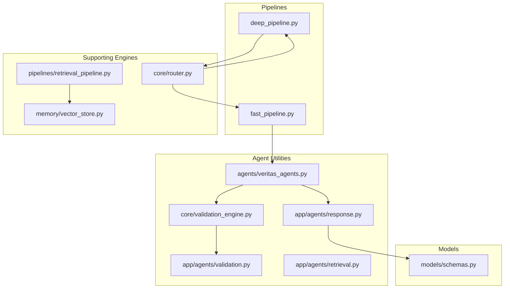
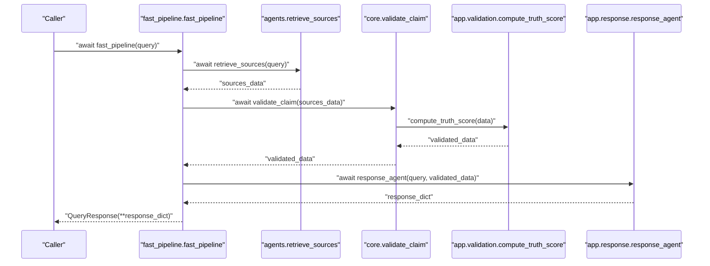
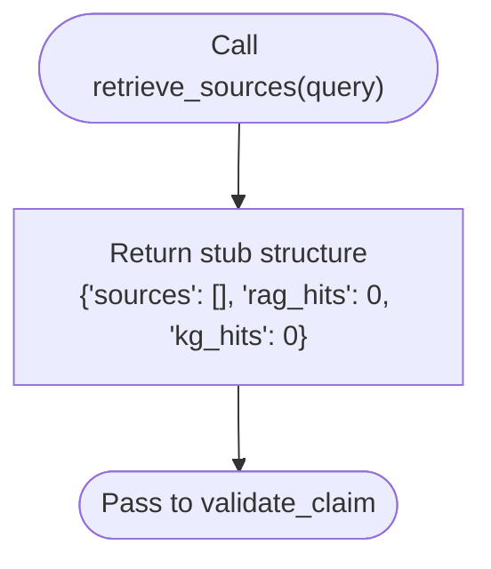
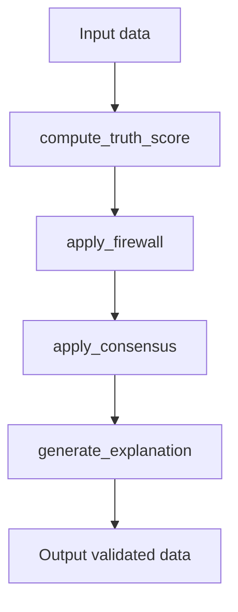
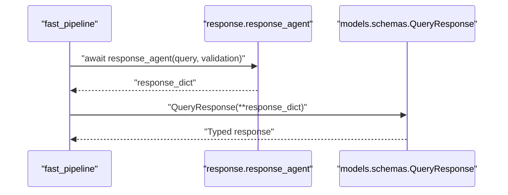
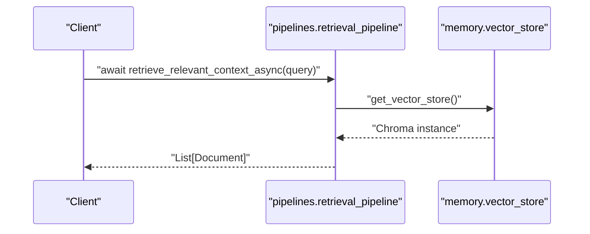
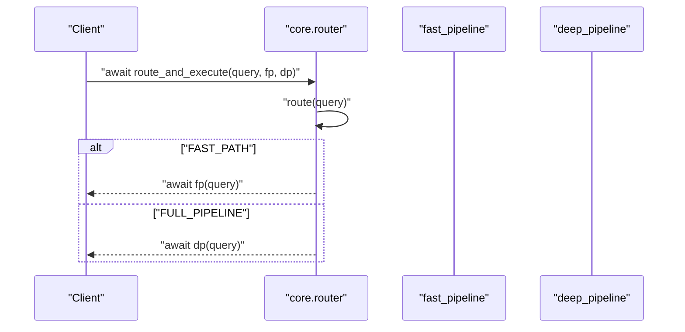
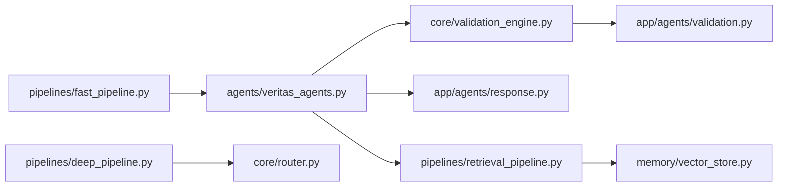

# Agent Utilities

<cite>
**Referenced Files in This Document**
- [veritas_agents.py](file://agents/veritas_agents.py)
- [validation_engine.py](file://core/validation_engine.py)
- [validation.py](file://app/agents/validation.py)
- [retrieval.py](file://app/agents/retrieval.py)
- [response.py](file://app/agents/response.py)
- [fast_pipeline.py](file://pipelines/fast_pipeline.py)
- [deep_pipeline.py](file://pipelines/deep_pipeline.py)
- [schemas.py](file://models/schemas.py)
- [router.py](file://core/router.py)
- [retrieval_pipeline.py](file://pipelines/retrieval_pipeline.py)
- [vector_store.py](file://memory/vector_store.py)
- [base_tools.py](file://tools/base_tools.py)
</cite>

## Table of Contents
1. [Introduction](#introduction)
2. [Project Structure](#project-structure)
3. [Core Components](#core-components)
4. [Architecture Overview](#architecture-overview)
5. [Detailed Component Analysis](#detailed-component-analysis)
6. [Dependency Analysis](#dependency-analysis)
7. [Performance Considerations](#performance-considerations)
8. [Troubleshooting Guide](#troubleshooting-guide)
9. [Conclusion](#conclusion)
10. [Appendices](#appendices)

## Introduction
This document describes the agent utility functions that power retrieval, validation, and response generation in the system. It focuses on:
- retrieve_sources: evidence gathering abstraction for fast-path pipelines
- validate_claim: assertion verification backed by a truth engine and supporting layers
- generate_response: synthesis of validated results into a user-facing response

It explains async patterns, data flow across utilities, integration points with external tools and services, parameter specifications, return value formats, error handling strategies, usage examples in pipeline contexts, performance considerations, and customization options.

## Project Structure
The agent utilities are part of a modular architecture:
- Fast and deep pipelines orchestrate agent invocations
- Agent utilities encapsulate retrieval, validation, and response building
- Supporting engines and routers coordinate truth scoring, firewalling, consensus, and routing decisions
- Retrieval pipelines provide vector-store-backed context retrieval
- Models define the canonical response schema

**Diagram sources**
- [fast_pipeline.py:8-22](file://pipelines/fast_pipeline.py#L8-L22)
- [deep_pipeline.py:7-17](file://pipelines/deep_pipeline.py#L7-L17)
- [veritas_agents.py:7-44](file://agents/veritas_agents.py#L7-L44)
- [validation_engine.py:9-18](file://core/validation_engine.py#L9-L18)
- [validation.py:278-314](file://app/agents/validation.py#L278-L314)
- [retrieval.py:36-101](file://app/agents/retrieval.py#L36-L101)
- [response.py:32-73](file://app/agents/response.py#L32-L73)
- [router.py:153-182](file://core/router.py#L153-L182)
- [retrieval_pipeline.py:48-73](file://pipelines/retrieval_pipeline.py#L48-L73)
- [vector_store.py:8-27](file://memory/vector_store.py#L8-L27)
- [schemas.py:14-26](file://models/schemas.py#L14-L26)

**Section sources**
- [fast_pipeline.py:8-22](file://pipelines/fast_pipeline.py#L8-L22)
- [deep_pipeline.py:7-17](file://pipelines/deep_pipeline.py#L7-L17)
- [veritas_agents.py:7-44](file://agents/veritas_agents.py#L7-L44)
- [validation_engine.py:9-18](file://core/validation_engine.py#L9-L18)
- [validation.py:278-314](file://app/agents/validation.py#L278-L314)
- [retrieval.py:36-101](file://app/agents/retrieval.py#L36-L101)
- [response.py:32-73](file://app/agents/response.py#L32-L73)
- [router.py:153-182](file://core/router.py#L153-L182)
- [retrieval_pipeline.py:48-73](file://pipelines/retrieval_pipeline.py#L48-L73)
- [vector_store.py:8-27](file://memory/vector_store.py#L8-L27)
- [schemas.py:14-26](file://models/schemas.py#L14-L26)

## Core Components
- retrieve_sources(query, tools=None)
  - Purpose: Provide a minimal abstraction for retrieving evidence for a query
  - Async pattern: Returns a coroutine; current implementation returns a stub structure
  - Parameters:
    - query: string
    - tools: optional list of tools (placeholder for future integration)
  - Returns: dictionary with keys including "sources", "rag_hits", "kg_hits"
  - Notes: Intended to be extended with real RAG or web search integrations

- validate_claim(data)
  - Purpose: Validate a claim using the TruthEngine and related engines
  - Async pattern: Offloads CPU-bound work to a thread pool via asyncio.to_thread or executor
  - Parameters:
    - data: dictionary containing inputs such as sources, credibility, and metadata
  - Returns: dictionary augmented with truth score, status, explanation, and related fields
  - Integration: Delegates to core/validation_engine.py which uses core/truth_engine.py

- generate_response(query, validation)
  - Purpose: Synthesize a user-facing response from validation results
  - Async pattern: Stateless; returns a coroutine that resolves to a structured response
  - Parameters:
    - query: string
    - validation: dictionary produced by validate_claim
  - Returns: dictionary with keys including "query", "truth_score", "explanation", "breakdown"
  - Integration: Used by fast_pipeline to produce a QueryResponse model

**Section sources**
- [veritas_agents.py:7-44](file://agents/veritas_agents.py#L7-L44)
- [validation_engine.py:9-18](file://core/validation_engine.py#L9-L18)
- [validation.py:278-314](file://app/agents/validation.py#L278-L314)
- [response.py:32-73](file://app/agents/response.py#L32-L73)

## Architecture Overview
The agent utilities participate in two primary pipelines:
- Fast pipeline: minimal retrieval, validation, and response synthesis
- Deep pipeline: routes through a router to decide between fast or full multi-agent paths

**Diagram sources**
- [fast_pipeline.py:8-22](file://pipelines/fast_pipeline.py#L8-L22)
- [veritas_agents.py:7-44](file://agents/veritas_agents.py#L7-L44)
- [validation_engine.py:9-18](file://core/validation_engine.py#L9-L18)
- [validation.py:92-127](file://app/agents/validation.py#L92-L127)
- [response.py:32-73](file://app/agents/response.py#L32-L73)

## Detailed Component Analysis

### retrieve_sources
- Role: Evidence gathering abstraction for fast-path pipelines
- Current behavior: Returns a stub structure suitable for downstream validation
- Extensibility: Intended to integrate with vector stores, web search tools, or RAG systems
- Async pattern: Returns a coroutine; ready for async integration
- Example usage: Called by fast_pipeline to obtain initial sources

**Diagram sources**
- [veritas_agents.py:7-16](file://agents/veritas_agents.py#L7-L16)

**Section sources**
- [veritas_agents.py:7-16](file://agents/veritas_agents.py#L7-L16)
- [fast_pipeline.py:14-15](file://pipelines/fast_pipeline.py#L14-L15)

### validate_claim
- Role: Assertion verification using truth scoring, firewall, consensus, and explainability
- Data flow:
  - Accepts retrieval-derived data
  - Computes truth score using weighted factors
  - Applies firewall overrides based on contradictions and sourcing authority
  - Aggregates consensus from multiple confidence signals
  - Generates human-readable explanation
- Async pattern: Offloads CPU-bound scoring to a thread pool
- Integration points:
  - Truth scoring via compute_truth_score
  - Firewall logic for deterministic overrides
  - Consensus merging
  - Explainability generation

**Diagram sources**
- [validation.py:92-127](file://app/agents/validation.py#L92-L127)
- [validation.py:161-199](file://app/agents/validation.py#L161-L199)
- [validation.py:203-213](file://app/agents/validation.py#L203-L213)
- [validation.py:217-274](file://app/agents/validation.py#L217-L274)

**Section sources**
- [validation_engine.py:9-18](file://core/validation_engine.py#L9-L18)
- [validation.py:278-314](file://app/agents/validation.py#L278-L314)

### generate_response
- Role: Builds a final response from validation results
- Responsibilities:
  - Normalizes sources into schema-compatible entries
  - Computes confidence score considering evidence coverage
  - Produces a human-readable summary
- Async pattern: Stateless coroutine returning a structured dictionary
- Integration: Converts to QueryResponse model in fast_pipeline

**Diagram sources**
- [response.py:32-73](file://app/agents/response.py#L32-L73)
- [fast_pipeline.py:19-21](file://pipelines/fast_pipeline.py#L19-L21)
- [schemas.py:14-26](file://models/schemas.py#L14-L26)

**Section sources**
- [response.py:32-73](file://app/agents/response.py#L32-L73)
- [fast_pipeline.py:19-21](file://pipelines/fast_pipeline.py#L19-L21)
- [schemas.py:14-26](file://models/schemas.py#L14-L26)

### Retrieval Pipeline Integration
- Vector-store-backed retrieval utilities support caching and batching
- Async retrieval functions enable non-blocking operations
- Batch retrieval supports concurrent processing across multiple queries

**Diagram sources**
- [retrieval_pipeline.py:48-73](file://pipelines/retrieval_pipeline.py#L48-L73)
- [vector_store.py:15-27](file://memory/vector_store.py#L15-L27)

**Section sources**
- [retrieval_pipeline.py:29-73](file://pipelines/retrieval_pipeline.py#L29-L73)
- [vector_store.py:8-27](file://memory/vector_store.py#L8-L27)

### Router and Deep Pipeline
- Router classifies queries and selects fast or full pipeline paths
- route_and_execute coordinates cache checks, classification, and execution
- deep_pipeline delegates to a multi-agent pipeline

**Diagram sources**
- [router.py:153-182](file://core/router.py#L153-L182)
- [router.py:99-136](file://core/router.py#L99-L136)
- [deep_pipeline.py:7-17](file://pipelines/deep_pipeline.py#L7-L17)

**Section sources**
- [router.py:153-182](file://core/router.py#L153-L182)
- [router.py:99-136](file://core/router.py#L99-L136)
- [deep_pipeline.py:7-17](file://pipelines/deep_pipeline.py#L7-L17)

## Dependency Analysis
- Agent utilities depend on:
  - Validation engine for truth scoring and firewalling
  - Response builder for synthesis and schema compliance
  - Retrieval pipelines for vector-store-backed context retrieval
- External integrations:
  - LangChain Ollama for LLM-based retrieval assessment
  - Chroma vector store for similarity search
  - Redis cache for retrieval and router caching

**Diagram sources**
- [veritas_agents.py:7-44](file://agents/veritas_agents.py#L7-L44)
- [validation_engine.py:9-18](file://core/validation_engine.py#L9-L18)
- [validation.py:278-314](file://app/agents/validation.py#L278-L314)
- [response.py:32-73](file://app/agents/response.py#L32-L73)
- [retrieval_pipeline.py:48-73](file://pipelines/retrieval_pipeline.py#L48-L73)
- [vector_store.py:15-27](file://memory/vector_store.py#L15-L27)
- [fast_pipeline.py:8-22](file://pipelines/fast_pipeline.py#L8-L22)
- [deep_pipeline.py:7-17](file://pipelines/deep_pipeline.py#L7-L17)
- [router.py:153-182](file://core/router.py#L153-L182)

**Section sources**
- [veritas_agents.py:7-44](file://agents/veritas_agents.py#L7-L44)
- [validation_engine.py:9-18](file://core/validation_engine.py#L9-L18)
- [validation.py:278-314](file://app/agents/validation.py#L278-L314)
- [response.py:32-73](file://app/agents/response.py#L32-L73)
- [retrieval_pipeline.py:48-73](file://pipelines/retrieval_pipeline.py#L48-L73)
- [vector_store.py:15-27](file://memory/vector_store.py#L15-L27)
- [fast_pipeline.py:8-22](file://pipelines/fast_pipeline.py#L8-L22)
- [deep_pipeline.py:7-17](file://pipelines/deep_pipeline.py#L7-L17)
- [router.py:153-182](file://core/router.py#L153-L182)

## Performance Considerations
- Async execution: All agent utilities are async-friendly to prevent blocking
- Thread pool offloading: Validation computes CPU-intensive scoring outside the event loop
- Caching:
  - Retrieval pipeline caches vector search results
  - Router caches responses locally and remotely
- Batching: Batch retrieval supports concurrent processing across multiple queries
- Minimal retrieval stub: Fast path keeps overhead low by returning minimal stub data

[No sources needed since this section provides general guidance]

## Troubleshooting Guide
- Retrieval failures:
  - The retrieval agent falls back gracefully with a neutral assessment and partial data when exceptions occur
- Validation errors:
  - Validation engine runs in a thread pool; ensure inputs conform to expected keys
  - Firewall overrides can change status deterministically based on contradictions and sourcing authority
- Response synthesis:
  - Ensure validation results include required fields (e.g., truth_score, breakdown)
  - Confirm sources normalization handles both string and dict forms

**Section sources**
- [retrieval.py:90-101](file://app/agents/retrieval.py#L90-L101)
- [validation_engine.py:9-18](file://core/validation_engine.py#L9-L18)
- [validation.py:174-198](file://app/agents/validation.py#L174-L198)
- [response.py:32-73](file://app/agents/response.py#L32-L73)

## Conclusion
The agent utilities provide a clean, extensible foundation for retrieval, validation, and response generation. They are designed for async execution, integrate with vector-store-backed retrieval, and leverage a robust validation pipeline with truth scoring, firewalling, consensus, and explainability. The fast pipeline demonstrates a streamlined path, while the router enables intelligent routing to deeper analyses when needed.

[No sources needed since this section summarizes without analyzing specific files]

## Appendices

### Parameter Specifications and Return Value Formats
- retrieve_sources
  - Parameters: query (string), tools (optional list)
  - Returns: dictionary with keys including "sources", "rag_hits", "kg_hits"
- validate_claim
  - Parameters: data (dictionary)
  - Returns: dictionary augmented with truth score, status, explanation, and related fields
- generate_response
  - Parameters: query (string), validation (dictionary)
  - Returns: dictionary with keys including "query", "truth_score", "explanation", "breakdown"

**Section sources**
- [veritas_agents.py:7-44](file://agents/veritas_agents.py#L7-L44)
- [validation_engine.py:9-18](file://core/validation_engine.py#L9-L18)
- [response.py:32-73](file://app/agents/response.py#L32-L73)

### Usage Examples in Pipeline Contexts
- Fast pipeline:
  - Calls retrieve_sources, validate_claim, and generate_response in sequence
- Deep pipeline:
  - Routes through router to select appropriate path and executes multi-agent pipeline

**Section sources**
- [fast_pipeline.py:8-22](file://pipelines/fast_pipeline.py#L8-L22)
- [deep_pipeline.py:7-17](file://pipelines/deep_pipeline.py#L7-L17)
- [router.py:153-182](file://core/router.py#L153-L182)

### Integration with External Tools and Services
- Retrieval:
  - Chroma vector store for similarity search
  - Redis cache for retrieval caching
- Validation:
  - Truth engine scoring and firewall logic
- Response:
  - Pydantic model for typed response serialization
- Tools:
  - Placeholder web search tool for future integration

**Section sources**
- [vector_store.py:15-27](file://memory/vector_store.py#L15-L27)
- [retrieval_pipeline.py:48-73](file://pipelines/retrieval_pipeline.py#L48-L73)
- [validation.py:92-127](file://app/agents/validation.py#L92-L127)
- [schemas.py:14-26](file://models/schemas.py#L14-L26)
- [base_tools.py:3-10](file://tools/base_tools.py#L3-L10)