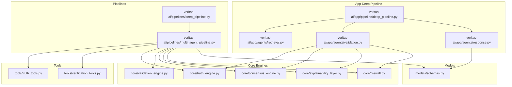
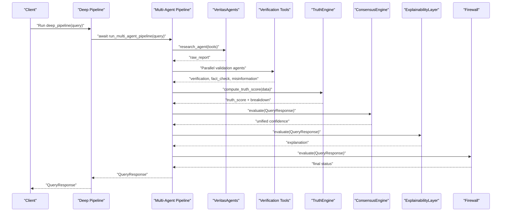
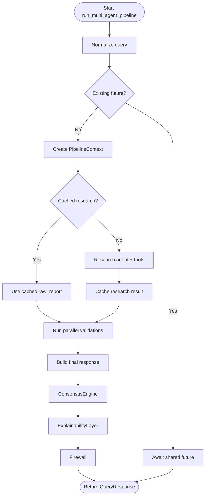
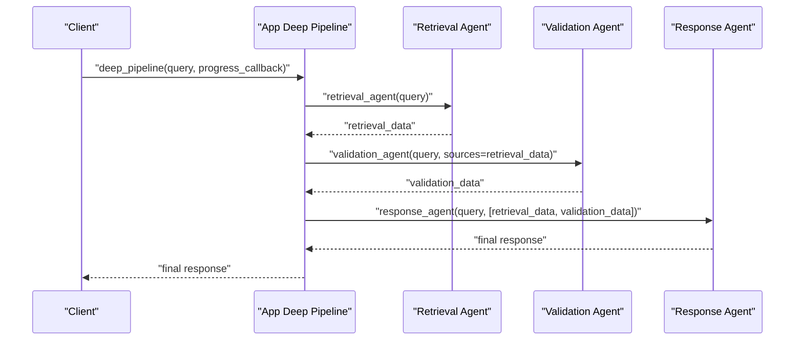
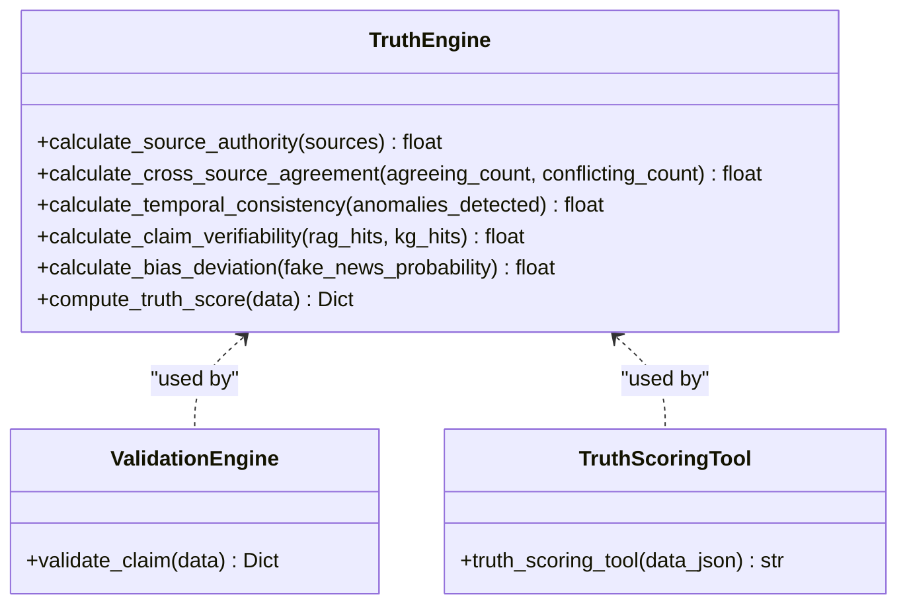
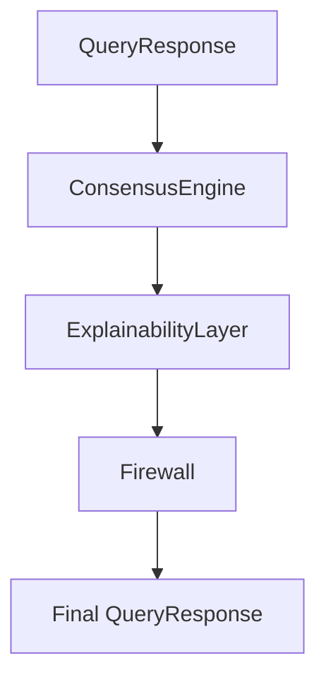
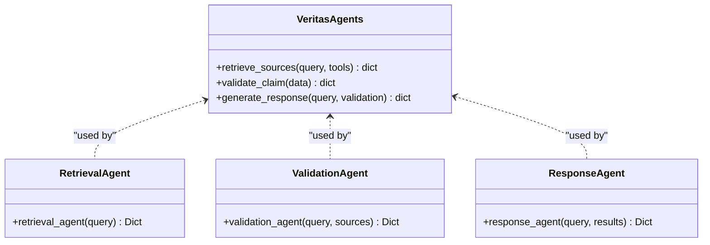
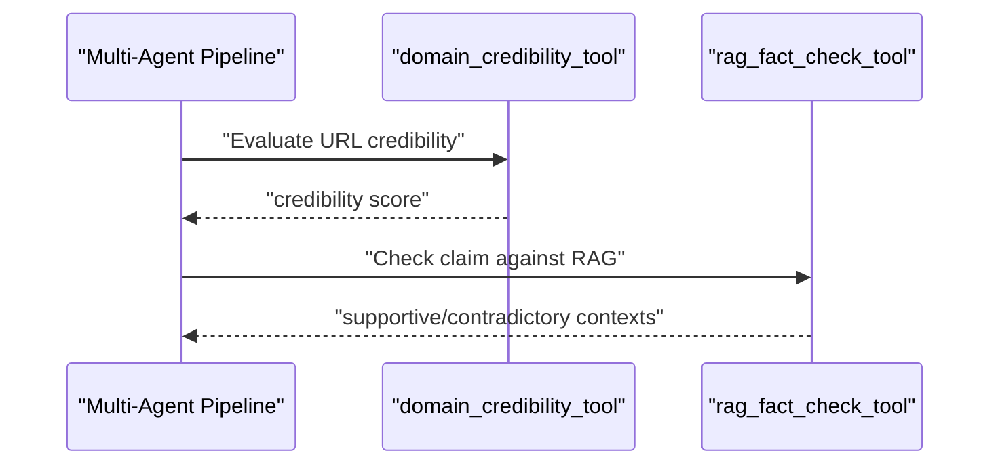
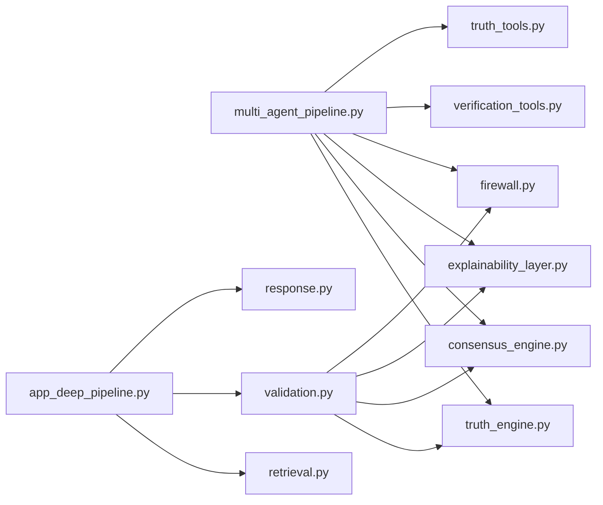
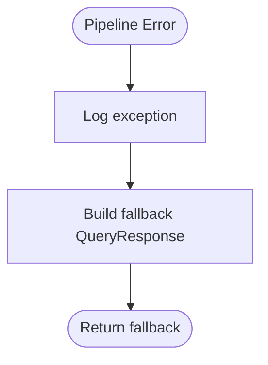

# Deep Pipeline

<cite>
**Referenced Files in This Document**
- [deep_pipeline.py](file://veritas-ai/pipelines/deep_pipeline.py)
- [multi_agent_pipeline.py](file://veritas-ai/pipelines/multi_agent_pipeline.py)
- [app_deep_pipeline.py](file://veritas-ai/app/pipeline/deep_pipeline.py)
- [veritas_agents.py](file://veritas-ai/agents/veritas_agents.py)
- [retrieval.py](file://veritas-ai/app/agents/retrieval.py)
- [validation.py](file://veritas-ai/app/agents/validation.py)
- [response.py](file://veritas-ai/app/agents/response.py)
- [schemas.py](file://veritas-ai/models/schemas.py)
- [truth_engine.py](file://veritas-ai/core/truth_engine.py)
- [validation_engine.py](file://veritas-ai/core/validation_engine.py)
- [consensus_engine.py](file://veritas-ai/core/consensus_engine.py)
- [explainability_layer.py](file://veritas-ai/core/explainability_layer.py)
- [firewall.py](file://veritas-ai/core/firewall.py)
- [truth_tools.py](file://veritas-ai/tools/truth_tools.py)
- [verification_tools.py](file://veritas-ai/tools/verification_tools.py)
</cite>

## Table of Contents
1. [Introduction](#introduction)
2. [Project Structure](#project-structure)
3. [Core Components](#core-components)
4. [Architecture Overview](#architecture-overview)
5. [Detailed Component Analysis](#detailed-component-analysis)
6. [Dependency Analysis](#dependency-analysis)
7. [Performance Considerations](#performance-considerations)
8. [Troubleshooting Guide](#troubleshooting-guide)
9. [Conclusion](#conclusion)
10. [Appendices](#appendices)

## Introduction
This document describes the Deep Pipeline implementation for comprehensive truth assessment through multi-agent collaboration. It explains the enhanced agent orchestration, parallel validation processes, and advanced reasoning capabilities. It documents the deep analysis workflows, agent specialization patterns, and integration with external verification tools. It also details the execution phases, error handling strategies, and performance optimization techniques, and provides examples of complex query processing scenarios, agent communication patterns, and debugging approaches for distributed agent coordination.

## Project Structure
The Deep Pipeline spans two primary pathways:
- The original multi-agent pipeline under veritas-ai/pipelines/, orchestrated by a CrewAI-based agent system with parallel validations and deterministic post-processing.
- The application-layer deep pipeline under veritas-ai/app/pipeline/, which separates retrieval, validation, and response building into distinct asynchronous agents.

**Diagram sources**
- [deep_pipeline.py:1-17](file://veritas-ai/pipelines/deep_pipeline.py#L1-L17)
- [multi_agent_pipeline.py:1-379](file://veritas-ai/pipelines/multi_agent_pipeline.py#L1-L379)
- [app_deep_pipeline.py:1-43](file://veritas-ai/app/pipeline/deep_pipeline.py#L1-L43)
- [retrieval.py:1-101](file://veritas-ai/app/agents/retrieval.py#L1-L101)
- [validation.py:1-314](file://veritas-ai/app/agents/validation.py#L1-L314)
- [response.py:1-73](file://veritas-ai/app/agents/response.py#L1-L73)
- [truth_engine.py:1-117](file://veritas-ai/core/truth_engine.py#L1-L117)
- [validation_engine.py:1-18](file://veritas-ai/core/validation_engine.py#L1-L18)
- [consensus_engine.py:1-26](file://veritas-ai/core/consensus_engine.py#L1-L26)
- [explainability_layer.py:1-52](file://veritas-ai/core/explainability_layer.py#L1-L52)
- [firewall.py:1-47](file://veritas-ai/core/firewall.py#L1-L47)
- [truth_tools.py:1-29](file://veritas-ai/tools/truth_tools.py#L1-L29)
- [verification_tools.py:1-52](file://veritas-ai/tools/verification_tools.py#L1-L52)
- [schemas.py:1-88](file://veritas-ai/models/schemas.py#L1-L88)

**Section sources**
- [deep_pipeline.py:1-17](file://veritas-ai/pipelines/deep_pipeline.py#L1-L17)
- [multi_agent_pipeline.py:1-379](file://veritas-ai/pipelines/multi_agent_pipeline.py#L1-L379)
- [app_deep_pipeline.py:1-43](file://veritas-ai/app/pipeline/deep_pipeline.py#L1-L43)

## Core Components
- Deep pipeline orchestrators:
  - veritas-ai/pipelines/deep_pipeline.py: Thin async wrapper delegating to the multi-agent pipeline.
  - veritas-ai/app/pipeline/deep_pipeline.py: Application-layer deep pipeline with explicit phases for retrieval, validation, and response building.
- Agent specializations:
  - veritas-ai/agents/veritas_agents.py: Lightweight async utilities for retrieval, validation, and response generation.
  - veritas-ai/app/agents/retrieval.py: Async retrieval agent using an LLM to assess initial claim and identify source types.
  - veritas-ai/app/agents/validation.py: Truth scoring, firewall, consensus, and explainability pipeline.
  - veritas-ai/app/agents/response.py: Builds a unified response dictionary from retrieval and validation outputs.
- Core engines:
  - veritas-ai/core/truth_engine.py: Mathematical truth scoring across five factors.
  - veritas-ai/core/validation_engine.py: Async executor wrapper around TruthEngine.
  - veritas-ai/core/consensus_engine.py: Multi-source confidence fusion.
  - veritas-ai/core/explainability_layer.py: Human-readable explanations and confidence breakdown.
  - veritas-ai/core/firewall.py: Deterministic overrides to prevent unsafe outputs.
- Tools:
  - veritas-ai/tools/truth_tools.py: LangChain tool wrapper for TruthEngine.
  - veritas-ai/tools/verification_tools.py: Domain credibility and RAG fact-checking.
- Data model:
  - veritas-ai/models/schemas.py: Pydantic models for query requests and responses.

**Section sources**
- [veritas_agents.py:1-44](file://veritas-ai/agents/veritas_agents.py#L1-L44)
- [retrieval.py:1-101](file://veritas-ai/app/agents/retrieval.py#L1-L101)
- [validation.py:1-314](file://veritas-ai/app/agents/validation.py#L1-L314)
- [response.py:1-73](file://veritas-ai/app/agents/response.py#L1-L73)
- [truth_engine.py:1-117](file://veritas-ai/core/truth_engine.py#L1-L117)
- [validation_engine.py:1-18](file://veritas-ai/core/validation_engine.py#L1-L18)
- [consensus_engine.py:1-26](file://veritas-ai/core/consensus_engine.py#L1-L26)
- [explainability_layer.py:1-52](file://veritas-ai/core/explainability_layer.py#L1-L52)
- [firewall.py:1-47](file://veritas-ai/core/firewall.py#L1-L47)
- [truth_tools.py:1-29](file://veritas-ai/tools/truth_tools.py#L1-L29)
- [verification_tools.py:1-52](file://veritas-ai/tools/verification_tools.py#L1-L52)
- [schemas.py:1-88](file://veritas-ai/models/schemas.py#L1-L88)

## Architecture Overview
The Deep Pipeline supports two complementary execution models:
- Multi-agent pipeline (CrewAI-based): Centralized orchestration with parallel validations and deterministic post-processing.
- App deep pipeline: Explicit phase separation with retrieval informing validation and a structured response builder.

**Diagram sources**
- [deep_pipeline.py:7-16](file://veritas-ai/pipelines/deep_pipeline.py#L7-L16)
- [multi_agent_pipeline.py:209-298](file://veritas-ai/pipelines/multi_agent_pipeline.py#L209-L298)
- [truth_engine.py:78-117](file://veritas-ai/core/truth_engine.py#L78-L117)
- [consensus_engine.py:8-25](file://veritas-ai/core/consensus_engine.py#L8-L25)
- [explainability_layer.py:13-51](file://veritas-ai/core/explainability_layer.py#L13-L51)
- [firewall.py:13-46](file://veritas-ai/core/firewall.py#L13-L46)

## Detailed Component Analysis

### Multi-Agent Deep Pipeline
- Orchestration:
  - Deduplicates in-flight queries and manages futures to avoid redundant work.
  - Emits progress callbacks across stages.
- Research:
  - Uses a research agent with tools for news search, web scraping, and RSS reading.
  - Caches research results keyed by a hash of the query.
- Parallel validation:
  - Three specialized agents run concurrently:
    - Verification agent: domain credibility and knowledge graph validation.
    - Fact checker: cross-checks claims against RAG and domain credibility.
    - Misinformation analyzer: detects fake news and scoring signals.
  - Uses a semaphore to cap parallel tool usage.
- Final response:
  - Builds a combined report and delegates to a response builder.
  - Applies ConsensusEngine, ExplainabilityLayer, and Firewall deterministically.
  - Publishes alerts via an event bus when triggered.

**Diagram sources**
- [multi_agent_pipeline.py:209-298](file://veritas-ai/pipelines/multi_agent_pipeline.py#L209-L298)
- [multi_agent_pipeline.py:146-207](file://veritas-ai/pipelines/multi_agent_pipeline.py#L146-L207)
- [multi_agent_pipeline.py:300-332](file://veritas-ai/pipelines/multi_agent_pipeline.py#L300-L332)

**Section sources**
- [multi_agent_pipeline.py:34-36](file://veritas-ai/pipelines/multi_agent_pipeline.py#L34-L36)
- [multi_agent_pipeline.py:38-48](file://veritas-ai/pipelines/multi_agent_pipeline.py#L38-L48)
- [multi_agent_pipeline.py:50-53](file://veritas-ai/pipelines/multi_agent_pipeline.py#L50-L53)
- [multi_agent_pipeline.py:56-72](file://veritas-ai/pipelines/multi_agent_pipeline.py#L56-L72)
- [multi_agent_pipeline.py:74-92](file://veritas-ai/pipelines/multi_agent_pipeline.py#L74-L92)
- [multi_agent_pipeline.py:94-96](file://veritas-ai/pipelines/multi_agent_pipeline.py#L94-L96)
- [multi_agent_pipeline.py:98-105](file://veritas-ai/pipelines/multi_agent_pipeline.py#L98-L105)
- [multi_agent_pipeline.py:107-144](file://veritas-ai/pipelines/multi_agent_pipeline.py#L107-L144)
- [multi_agent_pipeline.py:146-207](file://veritas-ai/pipelines/multi_agent_pipeline.py#L146-L207)
- [multi_agent_pipeline.py:209-298](file://veritas-ai/pipelines/multi_agent_pipeline.py#L209-L298)
- [multi_agent_pipeline.py:300-332](file://veritas-ai/pipelines/multi_agent_pipeline.py#L300-L332)
- [multi_agent_pipeline.py:335-352](file://veritas-ai/pipelines/multi_agent_pipeline.py#L335-L352)
- [multi_agent_pipeline.py:354-367](file://veritas-ai/pipelines/multi_agent_pipeline.py#L354-L367)
- [multi_agent_pipeline.py:369-379](file://veritas-ai/pipelines/multi_agent_pipeline.py#L369-L379)

### App Deep Pipeline
- Phases:
  - Retrieval: Identifies assessment, sources needed, and initial credibility using an LLM.
  - Validation: Computes truth score, applies firewall, consensus, and explainability.
  - Response: Builds a unified dictionary with schema-compatible fields.
- Specialization:
  - Retrieval agent focuses on source type identification and initial credibility.
  - Validation agent encapsulates scoring, firewall, consensus, and explainability.
  - Response agent normalizes outputs and constructs the final response.

**Diagram sources**
- [app_deep_pipeline.py:13-42](file://veritas-ai/app/pipeline/deep_pipeline.py#L13-L42)
- [retrieval.py:36-101](file://veritas-ai/app/agents/retrieval.py#L36-L101)
- [validation.py:278-314](file://veritas-ai/app/agents/validation.py#L278-L314)
- [response.py:32-73](file://veritas-ai/app/agents/response.py#L32-L73)

**Section sources**
- [app_deep_pipeline.py:13-42](file://veritas-ai/app/pipeline/deep_pipeline.py#L13-L42)
- [retrieval.py:36-101](file://veritas-ai/app/agents/retrieval.py#L36-L101)
- [validation.py:278-314](file://veritas-ai/app/agents/validation.py#L278-L314)
- [response.py:32-73](file://veritas-ai/app/agents/response.py#L32-L73)

### Truth Scoring and Validation
- TruthEngine computes a multi-factor score using weights for source authority, cross-source agreement, temporal consistency, claim verifiability, and bias deviation.
- ValidationEngine wraps TruthEngine to run CPU-bound computations in a thread pool.
- Tools integrate TruthEngine and domain credibility checks into the pipeline.

**Diagram sources**
- [truth_engine.py:3-117](file://veritas-ai/core/truth_engine.py#L3-L117)
- [validation_engine.py:9-17](file://veritas-ai/core/validation_engine.py#L9-L17)
- [truth_tools.py:5-29](file://veritas-ai/tools/truth_tools.py#L5-L29)

**Section sources**
- [truth_engine.py:19-77](file://veritas-ai/core/truth_engine.py#L19-L77)
- [truth_engine.py:78-117](file://veritas-ai/core/truth_engine.py#L78-L117)
- [validation_engine.py:9-17](file://veritas-ai/core/validation_engine.py#L9-L17)
- [truth_tools.py:5-29](file://veritas-ai/tools/truth_tools.py#L5-L29)

### Consensus, Explainability, and Firewall
- ConsensusEngine merges LLM confidence, classifier confidence, and rule-based truth score into a unified confidence.
- ExplainabilityLayer generates human-readable explanations and a confidence breakdown.
- Firewall enforces deterministic overrides to clamp statuses based on trusted sources, contradictions, and truth thresholds.

**Diagram sources**
- [consensus_engine.py:8-25](file://veritas-ai/core/consensus_engine.py#L8-L25)
- [explainability_layer.py:13-51](file://veritas-ai/core/explainability_layer.py#L13-L51)
- [firewall.py:13-46](file://veritas-ai/core/firewall.py#L13-L46)

**Section sources**
- [consensus_engine.py:8-25](file://veritas-ai/core/consensus_engine.py#L8-L25)
- [explainability_layer.py:13-51](file://veritas-ai/core/explainability_layer.py#L13-L51)
- [firewall.py:13-46](file://veritas-ai/core/firewall.py#L13-L46)

### Agent Specialization Patterns
- VeritasAgents (lightweight):
  - retrieve_sources: minimal async wrapper returning a stub structure for downstream consumption.
  - validate_claim: delegates to core.validation_engine.
  - generate_response: returns a user-facing structure with score and breakdown.
- App retrieval/validation/response agents:
  - retrieval_agent: identifies sources needed and initial credibility using an LLM.
  - validation_agent: computes truth score, applies firewall, consensus, and explainability.
  - response_agent: normalizes outputs and constructs the final response.

**Diagram sources**
- [veritas_agents.py:7-44](file://veritas-ai/agents/veritas_agents.py#L7-L44)
- [retrieval.py:36-101](file://veritas-ai/app/agents/retrieval.py#L36-L101)
- [validation.py:278-314](file://veritas-ai/app/agents/validation.py#L278-L314)
- [response.py:32-73](file://veritas-ai/app/agents/response.py#L32-L73)

**Section sources**
- [veritas_agents.py:7-44](file://veritas-ai/agents/veritas_agents.py#L7-L44)
- [retrieval.py:36-101](file://veritas-ai/app/agents/retrieval.py#L36-L101)
- [validation.py:278-314](file://veritas-ai/app/agents/validation.py#L278-L314)
- [response.py:32-73](file://veritas-ai/app/agents/response.py#L32-L73)

### Integration with External Verification Tools
- Domain credibility evaluation and RAG fact-checking are integrated as tools:
  - domain_credibility_tool: Heuristic-based domain scoring.
  - rag_fact_check_tool: Asynchronous retrieval from vector database.
- These tools feed into parallel validation agents and the TruthEngine.

**Diagram sources**
- [verification_tools.py:5-52](file://veritas-ai/tools/verification_tools.py#L5-L52)
- [multi_agent_pipeline.py:153-155](file://veritas-ai/pipelines/multi_agent_pipeline.py#L153-L155)

**Section sources**
- [verification_tools.py:5-52](file://veritas-ai/tools/verification_tools.py#L5-L52)
- [multi_agent_pipeline.py:153-155](file://veritas-ai/pipelines/multi_agent_pipeline.py#L153-L155)

## Dependency Analysis
- Cohesion:
  - Multi-agent pipeline tightly couples orchestration, caching, parallel validation, and post-processing.
  - App deep pipeline separates concerns across retrieval, validation, and response.
- Coupling:
  - Both pipelines depend on TruthEngine, ConsensusEngine, ExplainabilityLayer, and Firewall.
  - Tools are injected into agents to enable modular verification.
- External dependencies:
  - CrewAI for agent orchestration in the multi-agent pipeline.
  - LangChain LLMs and tools in the app deep pipeline.
  - Redis cache for agent output caching.

**Diagram sources**
- [multi_agent_pipeline.py:15-31](file://veritas-ai/pipelines/multi_agent_pipeline.py#L15-L31)
- [app_deep_pipeline.py:6-8](file://veritas-ai/app/pipeline/deep_pipeline.py#L6-L8)
- [truth_engine.py:1-117](file://veritas-ai/core/truth_engine.py#L1-L117)
- [consensus_engine.py:1-26](file://veritas-ai/core/consensus_engine.py#L1-L26)
- [explainability_layer.py:1-52](file://veritas-ai/core/explainability_layer.py#L1-L52)
- [firewall.py:1-47](file://veritas-ai/core/firewall.py#L1-L47)
- [verification_tools.py:1-52](file://veritas-ai/tools/verification_tools.py#L1-L52)
- [truth_tools.py:1-29](file://veritas-ai/tools/truth_tools.py#L1-L29)

**Section sources**
- [multi_agent_pipeline.py:15-31](file://veritas-ai/pipelines/multi_agent_pipeline.py#L15-L31)
- [app_deep_pipeline.py:6-8](file://veritas-ai/app/pipeline/deep_pipeline.py#L6-L8)

## Performance Considerations
- Concurrency:
  - Parallel validation uses asyncio.gather to run three agents concurrently.
  - A semaphore limits concurrent tool usage to respect resource constraints.
- Caching:
  - Agent outputs and research results are cached with TTL to reduce repeated work.
- Threading:
  - CPU-intensive truth scoring runs in a thread pool to avoid blocking the event loop.
- In-flight query deduplication:
  - Prevents duplicate processing for identical queries during execution.
- Streaming progress:
  - Progress callbacks enable UX updates without changing functional behavior.

**Section sources**
- [multi_agent_pipeline.py:199-201](file://veritas-ai/pipelines/multi_agent_pipeline.py#L199-L201)
- [multi_agent_pipeline.py:52-52](file://veritas-ai/pipelines/multi_agent_pipeline.py#L52-L52)
- [multi_agent_pipeline.py:74-92](file://veritas-ai/pipelines/multi_agent_pipeline.py#L74-L92)
- [multi_agent_pipeline.py:221-229](file://veritas-ai/pipelines/multi_agent_pipeline.py#L221-L229)
- [validation_engine.py:15-17](file://veritas-ai/core/validation_engine.py#L15-L17)

## Troubleshooting Guide
- Timeout handling:
  - CrewAI kickoff is executed in a thread and awaited with a timeout; timeouts raise a pipeline-specific error.
- Error propagation:
  - Exceptions during pipeline execution trigger a fallback response with neutral scores and uncertain status.
- Logging and observability:
  - Errors are logged; truth scores are recorded via the observability layer when available.
- Debugging distributed coordination:
  - Use progress callbacks to track stage transitions.
  - Inspect cached keys and TTL to diagnose repeated work.
  - Verify semaphore limits and in-flight query deduplication when encountering unexpected concurrency.

**Diagram sources**
- [multi_agent_pipeline.py:289-294](file://veritas-ai/pipelines/multi_agent_pipeline.py#L289-L294)
- [multi_agent_pipeline.py:354-367](file://veritas-ai/pipelines/multi_agent_pipeline.py#L354-L367)

**Section sources**
- [multi_agent_pipeline.py:56-72](file://veritas-ai/pipelines/multi_agent_pipeline.py#L56-L72)
- [multi_agent_pipeline.py:289-294](file://veritas-ai/pipelines/multi_agent_pipeline.py#L289-L294)
- [multi_agent_pipeline.py:354-367](file://veritas-ai/pipelines/multi_agent_pipeline.py#L354-L367)

## Conclusion
The Deep Pipeline combines CrewAI-based orchestration with deterministic post-processing to deliver robust truth assessments. The multi-agent pipeline emphasizes parallel validations and caching for throughput, while the app deep pipeline emphasizes explicit phases and structured outputs. Together, they provide a scalable foundation for multi-agent collaboration, advanced reasoning, and integration with external verification tools.

## Appendices

### Execution Phases and Agent Communication Patterns
- Multi-agent pipeline phases:
  - Research: Gather raw facts and sources.
  - Parallel validation: Run verification, fact-checking, and misinformation analysis concurrently.
  - Response building: Combine outputs, apply consensus, explainability, and firewall.
- App deep pipeline phases:
  - Retrieval: Initial assessment and source type identification.
  - Validation: Truth scoring, firewall, consensus, and explainability.
  - Response: Unified response construction.

**Section sources**
- [multi_agent_pipeline.py:236-287](file://veritas-ai/pipelines/multi_agent_pipeline.py#L236-L287)
- [app_deep_pipeline.py:24-42](file://veritas-ai/app/pipeline/deep_pipeline.py#L24-L42)

### Example Scenarios
- Complex query with multiple source types:
  - Retrieval identifies official, media, and social sources; validation aggregates scores and applies firewall overrides.
- Claim with contradictory evidence:
  - Explainability highlights contradictions; firewall may override to uncertain or likely_false depending on thresholds.
- Sparse evidence:
  - Response agent refines confidence based on evidence coverage; final status remains uncertain.

**Section sources**
- [validation.py:161-199](file://veritas-ai/app/agents/validation.py#L161-L199)
- [explainability_layer.py:13-51](file://veritas-ai/core/explainability_layer.py#L13-L51)
- [response.py:52-57](file://veritas-ai/app/agents/response.py#L52-L57)