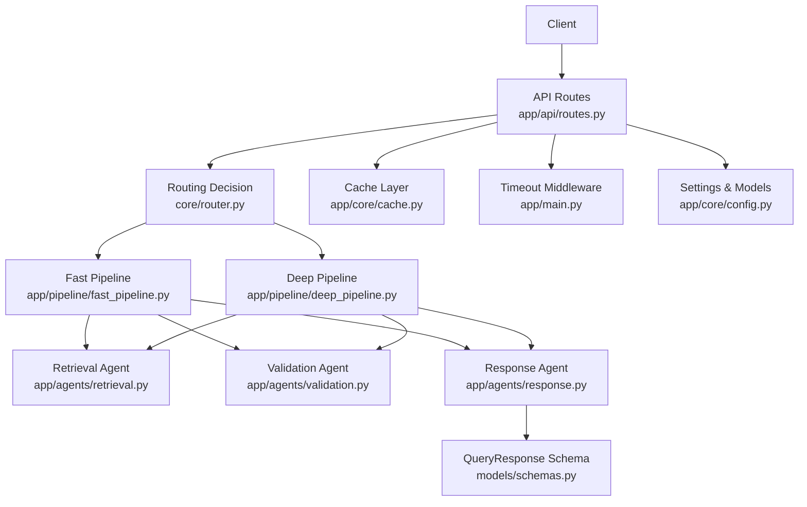
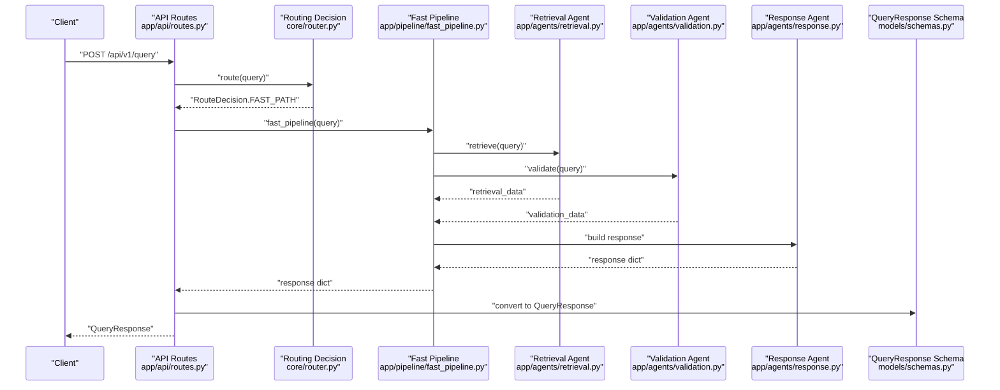
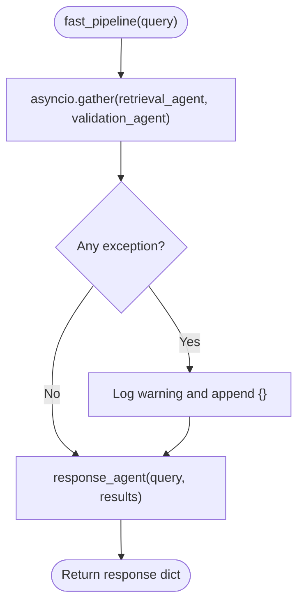
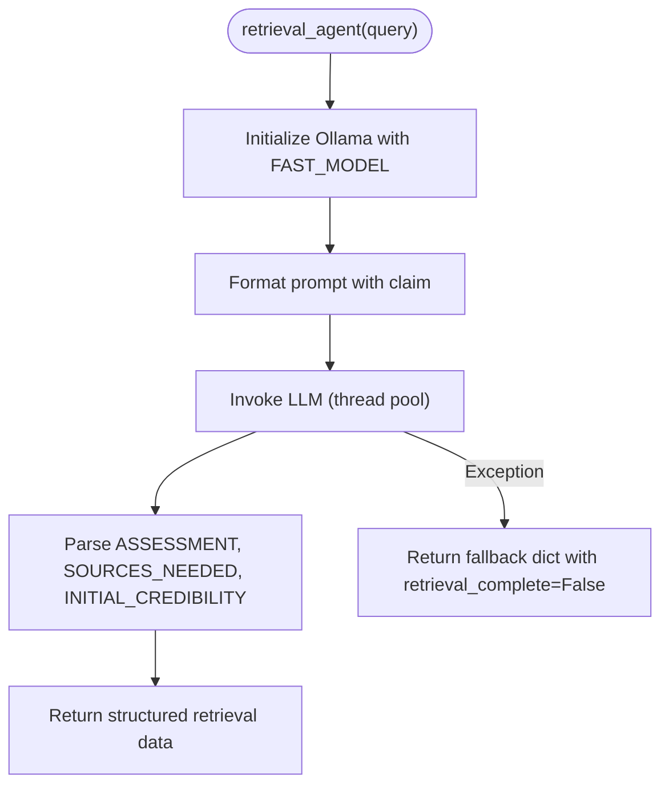
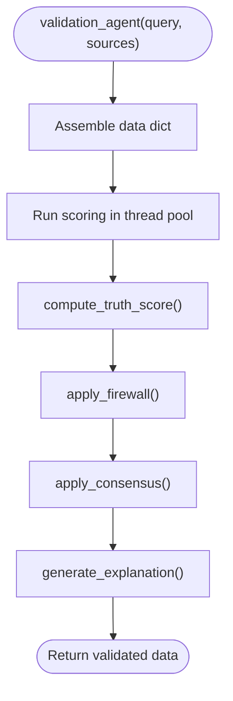
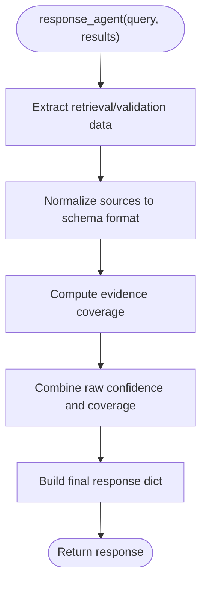
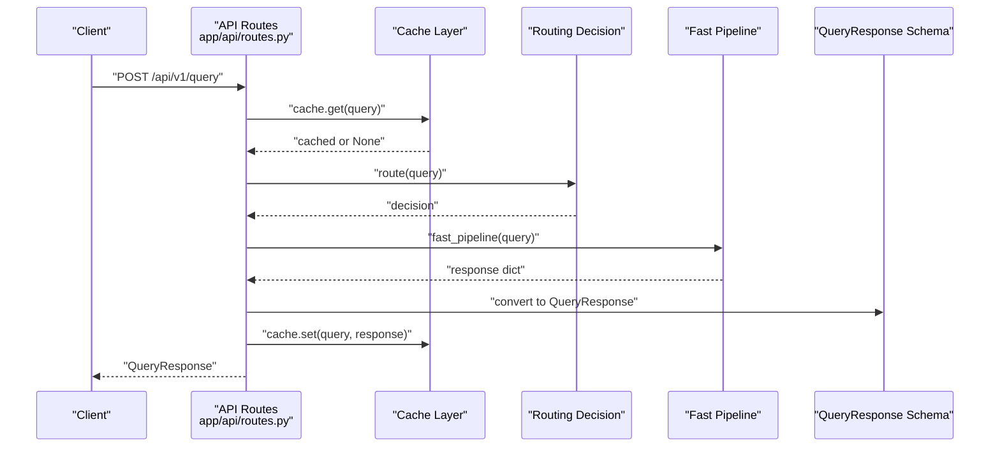
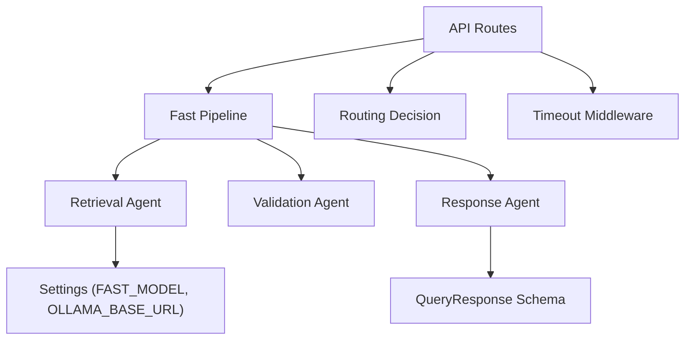

# Fast Pipeline

<cite>
**Referenced Files in This Document**
- [fast_pipeline.py](file://veritas-ai/app/pipeline/fast_pipeline.py)
- [deep_pipeline.py](file://veritas-ai/app/pipeline/deep_pipeline.py)
- [retrieval.py](file://veritas-ai/app/agents/retrieval.py)
- [validation.py](file://veritas-ai/app/agents/validation.py)
- [response.py](file://veritas-ai/app/agents/response.py)
- [routes.py](file://veritas-ai/app/api/routes.py)
- [main.py](file://veritas-ai/app/main.py)
- [schemas.py](file://veritas-ai/models/schemas.py)
- [config.py](file://veritas-ai/app/core/config.py)
- [settings.py](file://veritas-ai/config/settings.py)
- [multi_agent_pipeline.py](file://veritas-ai/pipelines/multi_agent_pipeline.py)
- [websockets.py](file://veritas-ai/api/websockets.py)
</cite>

## Table of Contents
1. [Introduction](#introduction)
2. [Project Structure](#project-structure)
3. [Core Components](#core-components)
4. [Architecture Overview](#architecture-overview)
5. [Detailed Component Analysis](#detailed-component-analysis)
6. [Dependency Analysis](#dependency-analysis)
7. [Performance Considerations](#performance-considerations)
8. [Troubleshooting Guide](#troubleshooting-guide)
9. [Conclusion](#conclusion)
10. [Appendices](#appendices)

## Introduction
This document explains the Fast Pipeline implementation designed for low-latency truth assessment. It focuses on the single-agent execution model using lightweight LLMs and optimized processing paths. The Fast Pipeline executes in under two seconds by running retrieval and validation concurrently, minimizing overhead and leveraging a streamlined response builder. It is ideal for rapid assessments where speed is prioritized over exhaustive analysis.

Key goals:
- Single-agent execution model with lightweight LLMs
- Optimized processing paths for speed
- Clear configuration for model selection and resource allocation
- Simplified workflow from query input to final response
- Caching strategies and fallback mechanisms
- Guidance on when to choose the Fast Pipeline versus the full multi-agent pipeline

## Project Structure
The Fast Pipeline resides in the application layer and integrates with agents and API routes. The structure supports:
- Parallel execution of retrieval and validation
- Graceful error handling and fallbacks
- Unified response building into a standardized schema
- Global timeout middleware and per-request caching

**Diagram sources**
- [routes.py:46-81](file://veritas-ai/app/api/routes.py#L46-L81)
- [fast_pipeline.py:13-48](file://veritas-ai/app/pipeline/fast_pipeline.py#L13-L48)
- [deep_pipeline.py:13-42](file://veritas-ai/app/pipeline/deep_pipeline.py#L13-L42)
- [retrieval.py:36-101](file://veritas-ai/app/agents/retrieval.py#L36-L101)
- [validation.py:278-314](file://veritas-ai/app/agents/validation.py#L278-L314)
- [response.py:32-73](file://veritas-ai/app/agents/response.py#L32-L73)
- [schemas.py:14-25](file://veritas-ai/models/schemas.py#L14-L25)
- [main.py:126-151](file://veritas-ai/app/main.py#L126-L151)
- [config.py:31-36](file://veritas-ai/app/core/config.py#L31-L36)

**Section sources**
- [routes.py:46-81](file://veritas-ai/app/api/routes.py#L46-L81)
- [fast_pipeline.py:13-48](file://veritas-ai/app/pipeline/fast_pipeline.py#L13-L48)
- [deep_pipeline.py:13-42](file://veritas-ai/app/pipeline/deep_pipeline.py#L13-L42)
- [retrieval.py:36-101](file://veritas-ai/app/agents/retrieval.py#L36-L101)
- [validation.py:278-314](file://veritas-ai/app/agents/validation.py#L278-L314)
- [response.py:32-73](file://veritas-ai/app/agents/response.py#L32-L73)
- [schemas.py:14-25](file://veritas-ai/models/schemas.py#L14-L25)
- [main.py:126-151](file://veritas-ai/app/main.py#L126-L151)
- [config.py:31-36](file://veritas-ai/app/core/config.py#L31-L36)

## Core Components
- Fast Pipeline: Runs retrieval and validation concurrently, then builds a response. Targets sub-two-second latency.
- Retrieval Agent: Asks a lightweight LLM to assess the claim and suggest source types; returns a structured assessment and initial credibility.
- Validation Agent: Computes a truth score, applies firewall and consensus rules, and generates an explanation.
- Response Agent: Builds a unified response dictionary aligned with the QueryResponse schema.
- API Routes: Decide between Fast and Deep pipelines, apply caching, and measure latency.
- Configuration: Controls timeouts, model selection, and performance-related settings.

**Section sources**
- [fast_pipeline.py:13-48](file://veritas-ai/app/pipeline/fast_pipeline.py#L13-L48)
- [retrieval.py:36-101](file://veritas-ai/app/agents/retrieval.py#L36-L101)
- [validation.py:278-314](file://veritas-ai/app/agents/validation.py#L278-L314)
- [response.py:32-73](file://veritas-ai/app/agents/response.py#L32-L73)
- [routes.py:46-81](file://veritas-ai/app/api/routes.py#L46-L81)
- [config.py:31-36](file://veritas-ai/app/core/config.py#L31-L36)

## Architecture Overview
The Fast Pipeline follows a simplified, parallelized workflow:
1. Query enters the API layer.
2. A routing decision selects either Fast or Deep.
3. Fast Pipeline runs retrieval and validation concurrently.
4. Response Agent constructs the final output.
5. Results are cached and returned.

**Diagram sources**
- [routes.py:46-81](file://veritas-ai/app/api/routes.py#L46-L81)
- [fast_pipeline.py:13-48](file://veritas-ai/app/pipeline/fast_pipeline.py#L13-L48)
- [retrieval.py:36-101](file://veritas-ai/app/agents/retrieval.py#L36-L101)
- [validation.py:278-314](file://veritas-ai/app/agents/validation.py#L278-L314)
- [response.py:32-73](file://veritas-ai/app/agents/response.py#L32-L73)
- [schemas.py:14-25](file://veritas-ai/models/schemas.py#L14-L25)

## Detailed Component Analysis

### Fast Pipeline
- Parallel execution: retrieval and validation run concurrently using asynchronous gathering.
- Graceful error handling: exceptions are caught and treated as empty results to keep the pipeline resilient.
- Progress callbacks: optional callbacks enable UI updates during processing.
- Target latency: under two seconds by design.

**Diagram sources**
- [fast_pipeline.py:24-43](file://veritas-ai/app/pipeline/fast_pipeline.py#L24-L43)

**Section sources**
- [fast_pipeline.py:13-48](file://veritas-ai/app/pipeline/fast_pipeline.py#L13-L48)

### Retrieval Agent
- Uses a lightweight LLM (configured via settings) to assess the claim and suggest source types.
- Parses structured output to extract assessment, source types, and initial credibility.
- Includes a robust fallback when LLM calls fail.

**Diagram sources**
- [retrieval.py:46-61](file://veritas-ai/app/agents/retrieval.py#L46-L61)
- [retrieval.py:63-89](file://veritas-ai/app/agents/retrieval.py#L63-L89)
- [retrieval.py:90-101](file://veritas-ai/app/agents/retrieval.py#L90-L101)

**Section sources**
- [retrieval.py:36-101](file://veritas-ai/app/agents/retrieval.py#L36-L101)
- [config.py:44-48](file://veritas-ai/app/core/config.py#L44-L48)

### Validation Agent
- Computes a truth score using weighted factors (source authority, cross-source agreement, temporal consistency, verifiability, bias deviation).
- Applies firewall rules to override scores based on contradictions and sourcing authority.
- Aggregates consensus among LLM confidence, classifier confidence, and rule-based score.
- Generates a human-readable explanation with “why_true” and “why_false” rationales.

**Diagram sources**
- [validation.py:286-302](file://veritas-ai/app/agents/validation.py#L286-L302)
- [validation.py:304-313](file://veritas-ai/app/agents/validation.py#L304-L313)

**Section sources**
- [validation.py:278-314](file://veritas-ai/app/agents/validation.py#L278-L314)

### Response Agent
- Normalizes sources into schema-compatible entries.
- Computes confidence by combining raw confidence with evidence coverage.
- Produces a final response dictionary aligned with QueryResponse.

**Diagram sources**
- [response.py:37-72](file://veritas-ai/app/agents/response.py#L37-L72)

**Section sources**
- [response.py:32-73](file://veritas-ai/app/agents/response.py#L32-L73)
- [schemas.py:14-25](file://veritas-ai/models/schemas.py#L14-L25)

### API Integration and Routing
- The API resolves queries with caching and latency measurement.
- Routing selects Fast or Deep based on a decision function.
- Global timeout middleware ensures requests do not exceed configured thresholds.

**Diagram sources**
- [routes.py:46-81](file://veritas-ai/app/api/routes.py#L46-L81)
- [main.py:126-151](file://veritas-ai/app/main.py#L126-L151)

**Section sources**
- [routes.py:46-81](file://veritas-ai/app/api/routes.py#L46-L81)
- [main.py:126-151](file://veritas-ai/app/main.py#L126-L151)

## Dependency Analysis
- Fast Pipeline depends on three agents: retrieval, validation, and response.
- Retrieval Agent depends on configuration for model selection and LLM invocation.
- Validation Agent encapsulates scoring, firewall, consensus, and explanation generation.
- Response Agent depends on the QueryResponse schema for output normalization.
- API Routes depend on routing decisions and cache layers.
- Global middleware enforces timeouts.

**Diagram sources**
- [fast_pipeline.py:6-8](file://veritas-ai/app/pipeline/fast_pipeline.py#L6-L8)
- [retrieval.py:46-50](file://veritas-ai/app/agents/retrieval.py#L46-L50)
- [response.py:32-73](file://veritas-ai/app/agents/response.py#L32-L73)
- [routes.py:46-81](file://veritas-ai/app/api/routes.py#L46-L81)
- [main.py:126-151](file://veritas-ai/app/main.py#L126-L151)

**Section sources**
- [fast_pipeline.py:6-8](file://veritas-ai/app/pipeline/fast_pipeline.py#L6-L8)
- [retrieval.py:46-50](file://veritas-ai/app/agents/retrieval.py#L46-L50)
- [response.py:32-73](file://veritas-ai/app/agents/response.py#L32-L73)
- [routes.py:46-81](file://veritas-ai/app/api/routes.py#L46-L81)
- [main.py:126-151](file://veritas-ai/app/main.py#L126-L151)

## Performance Considerations
- Latency targets:
  - Fast Pipeline: under two seconds by design.
  - Global request timeout: controlled by configuration.
- Model selection:
  - Lightweight model for retrieval: configured via FAST_MODEL.
  - Other models: MODEL_NAME and ROUTER_MODEL for broader system use.
- Resource allocation:
  - Parallelism: retrieval and validation run concurrently.
  - Thread pools: CPU-intensive scoring runs in thread pools to avoid blocking.
  - Streaming: optional progress callbacks for UI responsiveness.
- Caching:
  - Per-query cache with TTL and max entries.
  - Background cache population after routing decisions.

Recommendations:
- Prefer the Fast Pipeline for quick checks and high-throughput scenarios.
- Use the Deep Pipeline when comprehensive analysis is required (e.g., complex claims, disputed facts).
- Tune FAST_MODEL and retrieval parameters for your workload.

**Section sources**
- [fast_pipeline.py:16-18](file://veritas-ai/app/pipeline/fast_pipeline.py#L16-L18)
- [main.py:126-151](file://veritas-ai/app/main.py#L126-L151)
- [config.py:44-48](file://veritas-ai/app/core/config.py#L44-L48)
- [config.py:31-36](file://veritas-ai/app/core/config.py#L31-L36)

## Troubleshooting Guide
Common issues and resolutions:
- Retrieval Agent failures:
  - Symptom: fallback response with retrieval_complete=False.
  - Action: verify Ollama availability and FAST_MODEL configuration.
- Validation Agent failures:
  - Symptom: exceptions caught and handled gracefully.
  - Action: check CPU-bound scoring and thread pool capacity.
- Timeout handling:
  - Symptom: 504 timeout responses.
  - Action: adjust PIPELINE_TIMEOUT_SECONDS and AGENT_TASK_TIMEOUT_SECONDS.
- Caching problems:
  - Symptom: cache misses or stale data.
  - Action: review CACHE_TTL_SECONDS and CACHE_MAX_ENTRIES.

Operational tips:
- Monitor latency_ms in responses to track performance.
- Use progress callbacks for visibility during Fast Pipeline execution.
- Verify model preloading does not block startup.

**Section sources**
- [retrieval.py:90-101](file://veritas-ai/app/agents/retrieval.py#L90-L101)
- [validation.py:304-313](file://veritas-ai/app/agents/validation.py#L304-L313)
- [main.py:126-151](file://veritas-ai/app/main.py#L126-L151)
- [routes.py:66](file://veritas-ai/app/api/routes.py#L66)
- [config.py:31-36](file://veritas-ai/app/core/config.py#L31-L36)

## Conclusion
The Fast Pipeline delivers a streamlined, low-latency truth assessment by running retrieval and validation in parallel with a lightweight LLM. It is well-suited for rapid checks and high-throughput environments. For deeper analysis and higher confidence outcomes, the Deep Pipeline remains available. Proper configuration of models, timeouts, and caching ensures predictable performance and reliability.

## Appendices

### When to Use Fast Pipeline vs Deep Pipeline
- Use Fast Pipeline when:
  - Sub-two-second response is required.
  - Initial assessment suffices; further analysis can be deferred.
  - High throughput and low resource usage are priorities.
- Use Deep Pipeline when:
  - Comprehensive verification and detailed explanations are needed.
  - Claims require extensive cross-referencing and contextual validation.
  - Higher accuracy and detailed audit trails are required.

### Configuration Options for Model Selection and Resource Allocation
- Model selection:
  - FAST_MODEL: lightweight model for retrieval.
  - MODEL_NAME: primary model for broader tasks.
  - ROUTER_MODEL: routing model for orchestration.
- Resource allocation:
  - PIPELINE_TIMEOUT_SECONDS: global request timeout.
  - AGENT_TASK_TIMEOUT_SECONDS: per-agent task timeout.
  - MAX_PARALLEL_TOOLS: concurrency cap for parallel tasks.
  - ENABLE_STREAMING and STREAM_CHUNK_SIZE: streaming behavior.
- Caching:
  - CACHE_TTL_SECONDS: cache time-to-live.
  - CACHE_MAX_ENTRIES: maximum cache entries.
  - HISTORY_MAX_ITEMS and ALERTS_MAX_ITEMS: storage limits.

**Section sources**
- [config.py:44-48](file://veritas-ai/app/core/config.py#L44-L48)
- [config.py:31-36](file://veritas-ai/app/core/config.py#L31-L36)
- [settings.py:21-24](file://veritas-ai/config/settings.py#L21-L24)
- [settings.py:73-75](file://veritas-ai/config/settings.py#L73-L75)

### Execution Timeout Handling
- Global middleware enforces a request timeout based on configuration.
- Per-agent timeouts are enforced in multi-agent pipelines for safety.
- Fast Pipeline relies on cooperative async scheduling and thread pool usage.

**Section sources**
- [main.py:126-151](file://veritas-ai/app/main.py#L126-L151)
- [multi_agent_pipeline.py:62-68](file://veritas-ai/pipelines/multi_agent_pipeline.py#L62-L68)

### Simplified Workflow from Query Input to Final Response
- Input: query string.
- Routing: decision between Fast and Deep.
- Fast Path:
  - Parallel retrieval and validation.
  - Response construction and schema conversion.
- Caching: store results for reuse.
- Output: QueryResponse with summary, facts, sources, confidence, truth score, status, and explanation.

**Section sources**
- [routes.py:46-81](file://veritas-ai/app/api/routes.py#L46-L81)
- [fast_pipeline.py:13-48](file://veritas-ai/app/pipeline/fast_pipeline.py#L13-L48)
- [schemas.py:14-25](file://veritas-ai/models/schemas.py#L14-L25)

### WebSocket Integration
- Progress stages and streaming updates are supported for real-time feedback.
- Stage mapping enables UI updates during Fast and Deep pipeline execution.

**Section sources**
- [websockets.py:24-35](file://veritas-ai/api/websockets.py#L24-L35)