# Multi-Agent Pipeline

<cite>
**Referenced Files in This Document**
- [multi_agent_pipeline.py](file://veritas-ai/pipelines/multi_agent_pipeline.py)
- [fast_pipeline.py](file://veritas-ai/pipelines/fast_pipeline.py)
- [deep_pipeline.py](file://veritas-ai/pipelines/deep_pipeline.py)
- [app/pipeline/fast_pipeline.py](file://veritas-ai/app/pipeline/fast_pipeline.py)
- [app/pipeline/deep_pipeline.py](file://veritas-ai/app/pipeline/deep_pipeline.py)
- [veritas_agents.py](file://veritas-ai/agents/veritas_agents.py)
- [app/agents/retrieval.py](file://veritas-ai/app/agents/retrieval.py)
- [app/agents/validation.py](file://veritas-ai/app/agents/validation.py)
- [app/agents/response.py](file://veritas-ai/app/agents/response.py)
- [vector_store.py](file://veritas-ai/memory/vector_store.py)
- [knowledge_graph.py](file://veritas-ai/memory/knowledge_graph.py)
- [kg_tools.py](file://veritas-ai/tools/kg_tools.py)
- [news_api.py](file://veritas-ai/tools/news_api.py)
- [web_scraper.py](file://veritas-ai/tools/web_scraper.py)
- [base_tools.py](file://veritas-ai/tools/base_tools.py)
</cite>

## Table of Contents
1. [Introduction](#introduction)
2. [Project Structure](#project-structure)
3. [Core Components](#core-components)
4. [Architecture Overview](#architecture-overview)
5. [Detailed Component Analysis](#detailed-component-analysis)
6. [Dependency Analysis](#dependency-analysis)
7. [Performance Considerations](#performance-considerations)
8. [Troubleshooting Guide](#troubleshooting-guide)
9. [Conclusion](#conclusion)
10. [Appendices](#appendices)

## Introduction
This document describes the Multi-Agent Pipeline system for asynchronous agent orchestration. It covers two primary execution paths:
- Fast pipeline: minimal retrieval and validation for low-latency responses.
- Deep pipeline: comprehensive analysis with parallel validations and structured reasoning.

It also documents agent utility functions, pipeline integration with vector stores and knowledge graphs, external tools, agent communication, state management, error handling, fallback mechanisms, monitoring/logging, and performance optimization strategies.

## Project Structure
The pipeline system spans several modules:
- Pipelines: high-level orchestrators for fast and deep execution.
- Agents (app-level): retrieval, validation, and response building.
- Agent utilities: lightweight async helpers used by fast/deep pipelines.
- Memory: vector store and knowledge graph integrations.
- Tools: external tool wrappers for news, web scraping, and KG operations.

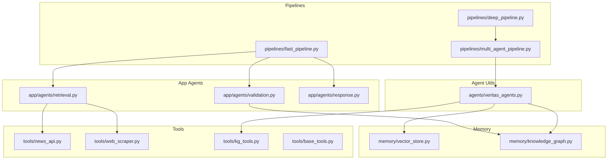

**Diagram sources**
- [fast_pipeline.py:1-22](file://veritas-ai/pipelines/fast_pipeline.py#L1-L22)
- [deep_pipeline.py:1-17](file://veritas-ai/pipelines/deep_pipeline.py#L1-L17)
- [multi_agent_pipeline.py:1-379](file://veritas-ai/pipelines/multi_agent_pipeline.py#L1-L379)
- [veritas_agents.py:1-44](file://veritas-ai/agents/veritas_agents.py#L1-L44)
- [app/agents/retrieval.py:1-101](file://veritas-ai/app/agents/retrieval.py#L1-L101)
- [app/agents/validation.py:1-314](file://veritas-ai/app/agents/validation.py#L1-L314)
- [app/agents/response.py:1-73](file://veritas-ai/app/agents/response.py#L1-L73)
- [vector_store.py:1-27](file://veritas-ai/memory/vector_store.py#L1-L27)
- [knowledge_graph.py:1-160](file://veritas-ai/memory/knowledge_graph.py#L1-L160)
- [kg_tools.py:1-50](file://veritas-ai/tools/kg_tools.py#L1-L50)
- [news_api.py:1-48](file://veritas-ai/tools/news_api.py#L1-L48)
- [web_scraper.py:1-35](file://veritas-ai/tools/web_scraper.py#L1-L35)
- [base_tools.py:1-10](file://veritas-ai/tools/base_tools.py#L1-L10)

**Section sources**
- [fast_pipeline.py:1-22](file://veritas-ai/pipelines/fast_pipeline.py#L1-L22)
- [deep_pipeline.py:1-17](file://veritas-ai/pipelines/deep_pipeline.py#L1-L17)
- [multi_agent_pipeline.py:1-379](file://veritas-ai/pipelines/multi_agent_pipeline.py#L1-L379)

## Core Components
- Fast pipeline: executes retrieval and validation concurrently, then builds a concise response. Targets sub-two-second latency.
- Deep pipeline: runs the full multi-agent pipeline in a background task and awaits completion.
- App-level agents: retrieval agent (source discovery and initial credibility), validation agent (truth scoring, firewall, consensus, explainability), response agent (final synthesis).
- Agent utilities: retrieve_sources, validate_claim, generate_response for fast-path composition.
- Memory integrations: vector store for embeddings and Chroma persistence; knowledge graph for entity/relationship validation and enrichment.
- Tools: news APIs, web scraper, and KG tools for data collection and graph updates.

**Section sources**
- [fast_pipeline.py:1-22](file://veritas-ai/pipelines/fast_pipeline.py#L1-L22)
- [deep_pipeline.py:1-17](file://veritas-ai/pipelines/deep_pipeline.py#L1-L17)
- [app/pipeline/fast_pipeline.py:1-49](file://veritas-ai/app/pipeline/fast_pipeline.py#L1-L49)
- [app/pipeline/deep_pipeline.py:1-43](file://veritas-ai/app/pipeline/deep_pipeline.py#L1-L43)
- [veritas_agents.py:1-44](file://veritas-ai/agents/veritas_agents.py#L1-L44)
- [app/agents/retrieval.py:1-101](file://veritas-ai/app/agents/retrieval.py#L1-L101)
- [app/agents/validation.py:1-314](file://veritas-ai/app/agents/validation.py#L1-L314)
- [app/agents/response.py:1-73](file://veritas-ai/app/agents/response.py#L1-L73)
- [vector_store.py:1-27](file://veritas-ai/memory/vector_store.py#L1-L27)
- [knowledge_graph.py:1-160](file://veritas-ai/memory/knowledge_graph.py#L1-L160)
- [kg_tools.py:1-50](file://veritas-ai/tools/kg_tools.py#L1-L50)
- [news_api.py:1-48](file://veritas-ai/tools/news_api.py#L1-L48)
- [web_scraper.py:1-35](file://veritas-ai/tools/web_scraper.py#L1-L35)

## Architecture Overview
The system supports two execution modes:
- Fast path: lightweight retrieval and validation, returning a compact response.
- Deep path: full multi-agent orchestration with parallel validations and structured evaluation.

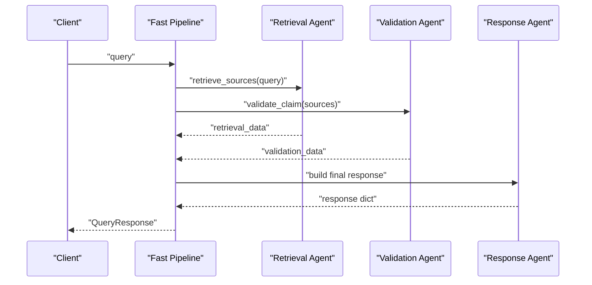

**Diagram sources**
- [fast_pipeline.py:1-22](file://veritas-ai/pipelines/fast_pipeline.py#L1-L22)
- [app/pipeline/fast_pipeline.py:1-49](file://veritas-ai/app/pipeline/fast_pipeline.py#L1-L49)
- [app/agents/retrieval.py:1-101](file://veritas-ai/app/agents/retrieval.py#L1-L101)
- [app/agents/validation.py:1-314](file://veritas-ai/app/agents/validation.py#L1-L314)
- [app/agents/response.py:1-73](file://veritas-ai/app/agents/response.py#L1-L73)

## Detailed Component Analysis

### Fast Pipeline Execution Paths
- App-level fast pipeline: runs retrieval and validation in parallel, handles exceptions gracefully, and builds a response.
- Agent utilities fast path: retrieve_sources, validate_claim, generate_response compose the lightweight workflow.

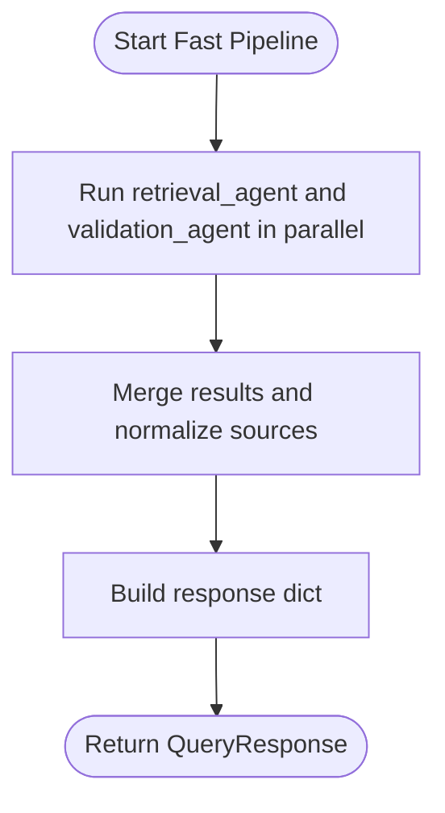

**Diagram sources**
- [app/pipeline/fast_pipeline.py:1-49](file://veritas-ai/app/pipeline/fast_pipeline.py#L1-L49)
- [app/agents/retrieval.py:1-101](file://veritas-ai/app/agents/retrieval.py#L1-L101)
- [app/agents/validation.py:1-314](file://veritas-ai/app/agents/validation.py#L1-L314)
- [app/agents/response.py:1-73](file://veritas-ai/app/agents/response.py#L1-L73)

**Section sources**
- [app/pipeline/fast_pipeline.py:1-49](file://veritas-ai/app/pipeline/fast_pipeline.py#L1-L49)
- [veritas_agents.py:1-44](file://veritas-ai/agents/veritas_agents.py#L1-L44)

### Deep Pipeline Execution Paths
- Deep pipeline: runs the full multi-agent pipeline in a background task and awaits completion.
- Multi-agent pipeline: research phase, parallel validations, and final response building with consensus, explainability, and firewall.

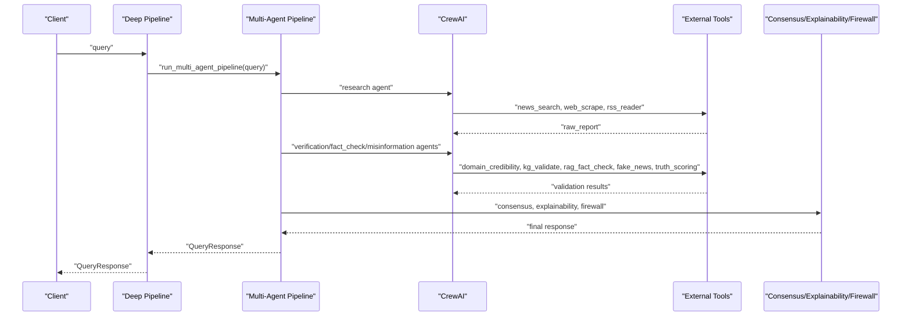

**Diagram sources**
- [deep_pipeline.py:1-17](file://veritas-ai/pipelines/deep_pipeline.py#L1-L17)
- [multi_agent_pipeline.py:1-379](file://veritas-ai/pipelines/multi_agent_pipeline.py#L1-L379)
- [news_api.py:1-48](file://veritas-ai/tools/news_api.py#L1-L48)
- [web_scraper.py:1-35](file://veritas-ai/tools/web_scraper.py#L1-L35)
- [kg_tools.py:1-50](file://veritas-ai/tools/kg_tools.py#L1-L50)

**Section sources**
- [deep_pipeline.py:1-17](file://veritas-ai/pipelines/deep_pipeline.py#L1-L17)
- [multi_agent_pipeline.py:1-379](file://veritas-ai/pipelines/multi_agent_pipeline.py#L1-L379)

### Retrieval Agent
- Asynchronously orchestrates source discovery using configured LLM and external APIs.
- Parses structured output to derive assessment, sources needed, and initial credibility.
- Includes robust fallback behavior on failure.

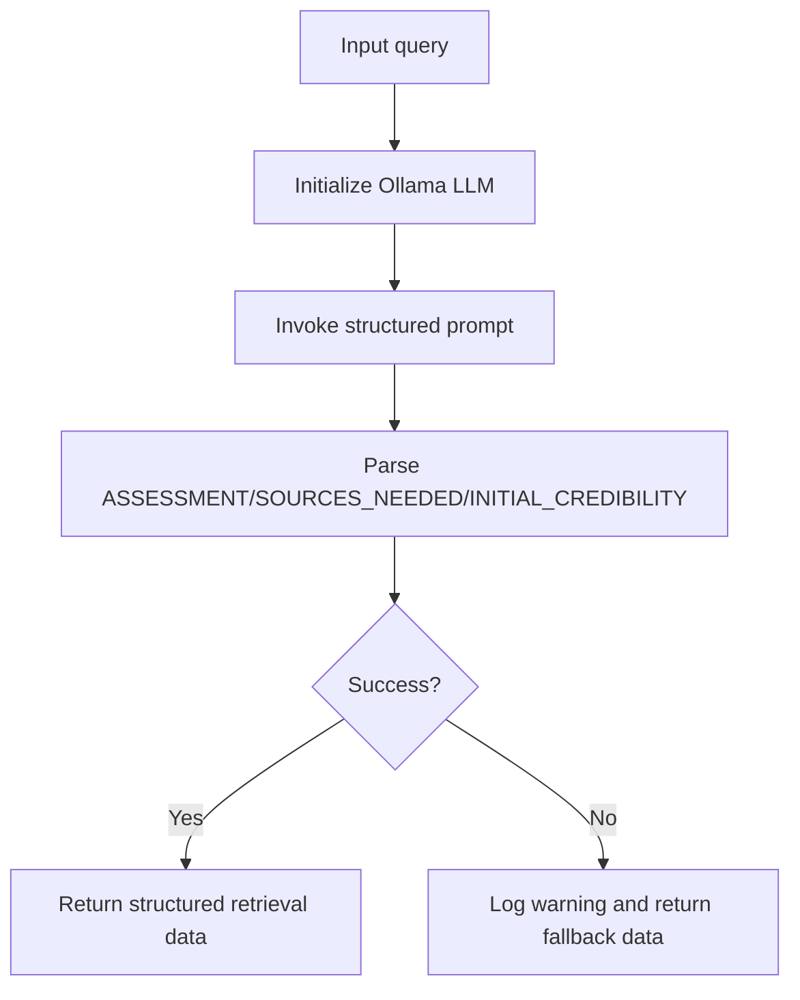

**Diagram sources**
- [app/agents/retrieval.py:1-101](file://veritas-ai/app/agents/retrieval.py#L1-L101)

**Section sources**
- [app/agents/retrieval.py:1-101](file://veritas-ai/app/agents/retrieval.py#L1-L101)

### Validation Agent
- Computes truth score using weighted factors (source authority, cross-source agreement, temporal consistency, verifiability, bias deviation).
- Applies firewall overrides for contradictions, sourcing authority, and verification thresholds.
- Aggregates consensus and generates human-readable explanation.

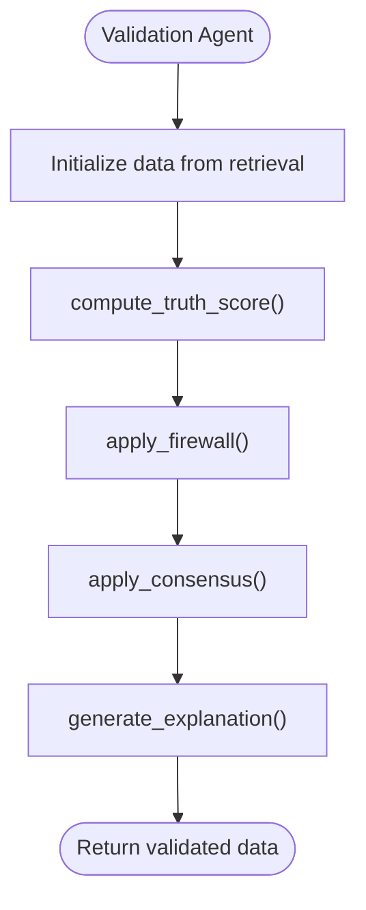

**Diagram sources**
- [app/agents/validation.py:1-314](file://veritas-ai/app/agents/validation.py#L1-L314)

**Section sources**
- [app/agents/validation.py:1-314](file://veritas-ai/app/agents/validation.py#L1-L314)

### Response Agent
- Builds a human-readable summary from retrieval and validation outputs.
- Normalizes sources into schema-compatible structures.
- Computes confidence score using evidence coverage and raw confidence.

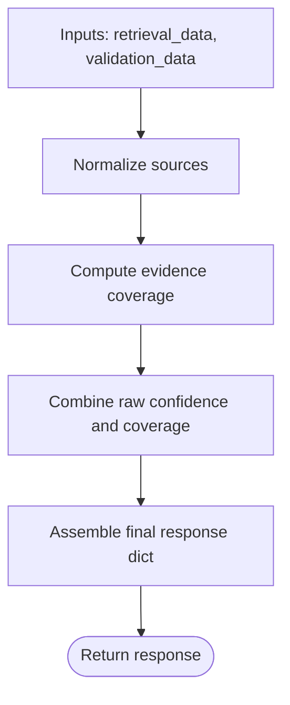

**Diagram sources**
- [app/agents/response.py:1-73](file://veritas-ai/app/agents/response.py#L1-L73)

**Section sources**
- [app/agents/response.py:1-73](file://veritas-ai/app/agents/response.py#L1-L73)

### Agent Utilities (retrieve_sources, validate_claim, generate_response)
- retrieve_sources: lightweight wrapper intended to integrate with vector store; returns stub structure for fast path.
- validate_claim: delegates to validation engine and returns structured validation.
- generate_response: produces a concise user-facing response with truth score and explanation.

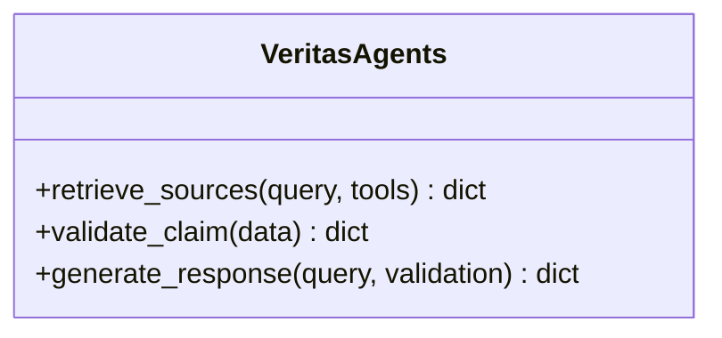

**Diagram sources**
- [veritas_agents.py:1-44](file://veritas-ai/agents/veritas_agents.py#L1-L44)

**Section sources**
- [veritas_agents.py:1-44](file://veritas-ai/agents/veritas_agents.py#L1-L44)

### Vector Store Integration
- Provides local embeddings and Chroma vector store initialization with persistence.
- Intended for RAG-style retrieval in production deployments.

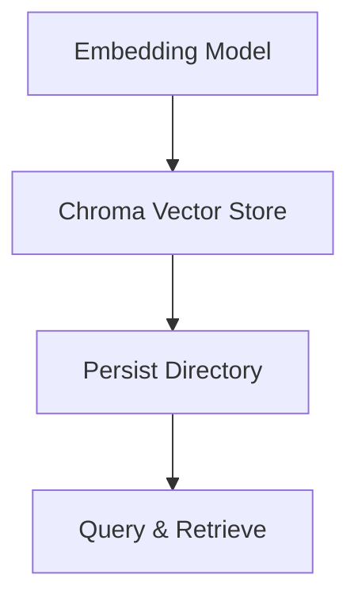

**Diagram sources**
- [vector_store.py:1-27](file://veritas-ai/memory/vector_store.py#L1-L27)

**Section sources**
- [vector_store.py:1-27](file://veritas-ai/memory/vector_store.py#L1-L27)

### Knowledge Graph Integration
- Async knowledge graph client with connection pooling, entity/relationship merging, and relationship queries.
- Tools for building and validating entities/relationships.

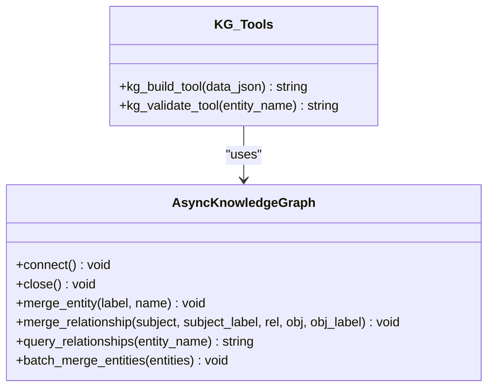

**Diagram sources**
- [knowledge_graph.py:1-160](file://veritas-ai/memory/knowledge_graph.py#L1-L160)
- [kg_tools.py:1-50](file://veritas-ai/tools/kg_tools.py#L1-L50)

**Section sources**
- [knowledge_graph.py:1-160](file://veritas-ai/memory/knowledge_graph.py#L1-L160)
- [kg_tools.py:1-50](file://veritas-ai/tools/kg_tools.py#L1-L50)

### External Tools
- News APIs: GNews and NewsAPI wrappers for recent article retrieval.
- Web scraper: Playwright-based content extraction from URLs.
- Base tool: placeholder for web search.

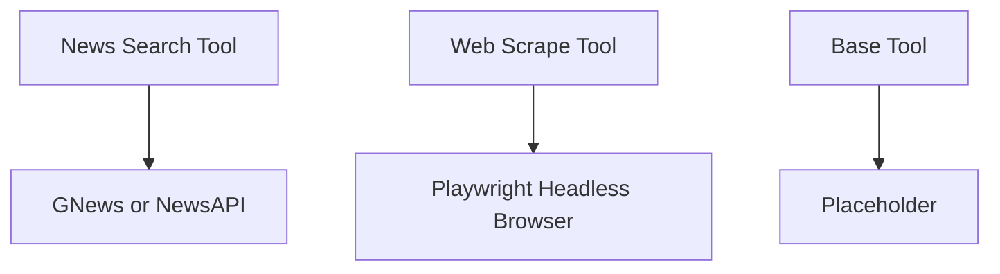

**Diagram sources**
- [news_api.py:1-48](file://veritas-ai/tools/news_api.py#L1-L48)
- [web_scraper.py:1-35](file://veritas-ai/tools/web_scraper.py#L1-L35)
- [base_tools.py:1-10](file://veritas-ai/tools/base_tools.py#L1-L10)

**Section sources**
- [news_api.py:1-48](file://veritas-ai/tools/news_api.py#L1-L48)
- [web_scraper.py:1-35](file://veritas-ai/tools/web_scraper.py#L1-L35)
- [base_tools.py:1-10](file://veritas-ai/tools/base_tools.py#L1-L10)

## Dependency Analysis
- Pipelines depend on agent utilities (fast) or the multi-agent orchestration (deep).
- App agents depend on external tools and memory integrations.
- Multi-agent pipeline depends on CrewAI and integrates tools for validation and retrieval.
- Validation agent encapsulates scoring, firewall, consensus, and explainability logic.

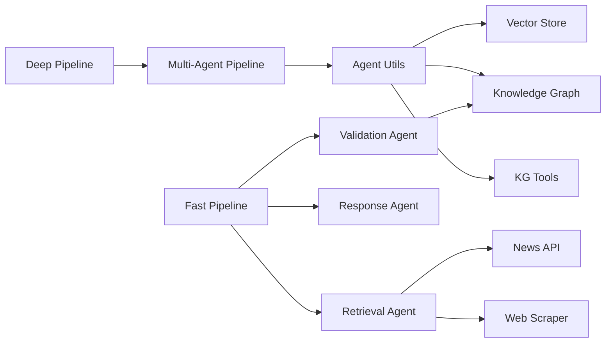

**Diagram sources**
- [fast_pipeline.py:1-22](file://veritas-ai/pipelines/fast_pipeline.py#L1-L22)
- [deep_pipeline.py:1-17](file://veritas-ai/pipelines/deep_pipeline.py#L1-L17)
- [multi_agent_pipeline.py:1-379](file://veritas-ai/pipelines/multi_agent_pipeline.py#L1-L379)
- [veritas_agents.py:1-44](file://veritas-ai/agents/veritas_agents.py#L1-L44)
- [app/agents/retrieval.py:1-101](file://veritas-ai/app/agents/retrieval.py#L1-L101)
- [app/agents/validation.py:1-314](file://veritas-ai/app/agents/validation.py#L1-L314)
- [app/agents/response.py:1-73](file://veritas-ai/app/agents/response.py#L1-L73)
- [vector_store.py:1-27](file://veritas-ai/memory/vector_store.py#L1-L27)
- [knowledge_graph.py:1-160](file://veritas-ai/memory/knowledge_graph.py#L1-L160)
- [kg_tools.py:1-50](file://veritas-ai/tools/kg_tools.py#L1-L50)
- [news_api.py:1-48](file://veritas-ai/tools/news_api.py#L1-L48)
- [web_scraper.py:1-35](file://veritas-ai/tools/web_scraper.py#L1-L35)

**Section sources**
- [multi_agent_pipeline.py:1-379](file://veritas-ai/pipelines/multi_agent_pipeline.py#L1-L379)

## Performance Considerations
- Concurrency and parallelism:
  - Fast pipeline runs retrieval and validation concurrently to reduce latency.
  - Deep pipeline uses CrewAI with timeouts and thread pools to keep I/O bound operations responsive.
- Caching:
  - Agent outputs are cached with Redis keys derived from hashed payloads to avoid redundant work.
- Threading:
  - CPU-intensive scoring is executed in thread pools to prevent blocking the event loop.
- Resource limits:
  - Semaphores limit concurrent tool usage to protect downstream systems.
- Latency targets:
  - Fast path aims for sub-two-second response; deep path prioritizes accuracy over speed.

[No sources needed since this section provides general guidance]

## Troubleshooting Guide
- Timeout handling:
  - CrewAI execution is wrapped with timeouts; failures raise a pipeline-specific error.
- Graceful degradation:
  - Retrieval agent falls back to a structured fallback response on failure.
  - Fast pipeline continues after catching exceptions from agents.
- Logging and observability:
  - Validation agent attempts to log truth scores via an observability layer.
  - Knowledge graph operations log connection and query errors.
- Alerts:
  - Final response triggers alert engines; alerts are recorded and published to the event bus.

**Section sources**
- [multi_agent_pipeline.py:56-72](file://veritas-ai/pipelines/multi_agent_pipeline.py#L56-L72)
- [app/agents/retrieval.py:90-101](file://veritas-ai/app/agents/retrieval.py#L90-L101)
- [app/agents/validation.py:117-122](file://veritas-ai/app/agents/validation.py#L117-L122)
- [knowledge_graph.py:36-38](file://veritas-ai/memory/knowledge_graph.py#L36-L38)

## Conclusion
The Multi-Agent Pipeline system provides two complementary execution modes:
- Fast pipeline for rapid assessments using parallel retrieval and validation.
- Deep pipeline for comprehensive analysis leveraging CrewAI orchestration, parallel validations, and structured evaluation layers.

Its modular design enables straightforward integration with vector stores, knowledge graphs, and external tools, while robust concurrency, caching, and error handling ensure resilient operation.

[No sources needed since this section summarizes without analyzing specific files]

## Appendices

### Pipeline Configuration Examples
- Fast pipeline invocation:
  - See [fast_pipeline.py:8-21](file://veritas-ai/pipelines/fast_pipeline.py#L8-L21) for the async function signature and steps.
- Deep pipeline invocation:
  - See [deep_pipeline.py:7-16](file://veritas-ai/pipelines/deep_pipeline.py#L7-L16) for running the multi-agent pipeline in a background task.
- App-level fast/deep pipelines:
  - See [app/pipeline/fast_pipeline.py:13-48](file://veritas-ai/app/pipeline/fast_pipeline.py#L13-L48) and [app/pipeline/deep_pipeline.py:13-42](file://veritas-ai/app/pipeline/deep_pipeline.py#L13-L42) for progress callbacks and execution phases.

**Section sources**
- [fast_pipeline.py:8-21](file://veritas-ai/pipelines/fast_pipeline.py#L8-L21)
- [deep_pipeline.py:7-16](file://veritas-ai/pipelines/deep_pipeline.py#L7-L16)
- [app/pipeline/fast_pipeline.py:13-48](file://veritas-ai/app/pipeline/fast_pipeline.py#L13-L48)
- [app/pipeline/deep_pipeline.py:13-42](file://veritas-ai/app/pipeline/deep_pipeline.py#L13-L42)

### Custom Tool Integration
- Adding a new retrieval tool:
  - Wrap functionality as a LangChain tool and integrate into retrieval agent or multi-agent pipeline tools.
  - Reference [news_api.py:18-47](file://veritas-ai/tools/news_api.py#L18-L47) and [web_scraper.py:4-34](file://veritas-ai/tools/web_scraper.py#L4-L34) for patterns.
- Knowledge graph ingestion:
  - Use [kg_tools.py:6-37](file://veritas-ai/tools/kg_tools.py#L6-L37) to insert entities and relationships.
- Vector store integration:
  - Initialize embeddings and Chroma via [vector_store.py:8-26](file://veritas-ai/memory/vector_store.py#L8-L26).

**Section sources**
- [news_api.py:18-47](file://veritas-ai/tools/news_api.py#L18-L47)
- [web_scraper.py:4-34](file://veritas-ai/tools/web_scraper.py#L4-L34)
- [kg_tools.py:6-37](file://veritas-ai/tools/kg_tools.py#L6-L37)
- [vector_store.py:8-26](file://veritas-ai/memory/vector_store.py#L8-L26)

### Monitoring, Logging, and Debugging
- Observability:
  - Truth scores logged via observability layer in validation agent.
- Logging:
  - Retrieval agent logs warnings on failures; knowledge graph logs connectivity and query errors.
- Event bus:
  - Alerts are published to the event bus upon final response evaluation.

**Section sources**
- [app/agents/validation.py:117-122](file://veritas-ai/app/agents/validation.py#L117-L122)
- [app/agents/retrieval.py:90-101](file://veritas-ai/app/agents/retrieval.py#L90-L101)
- [knowledge_graph.py:35-38](file://veritas-ai/memory/knowledge_graph.py#L35-L38)