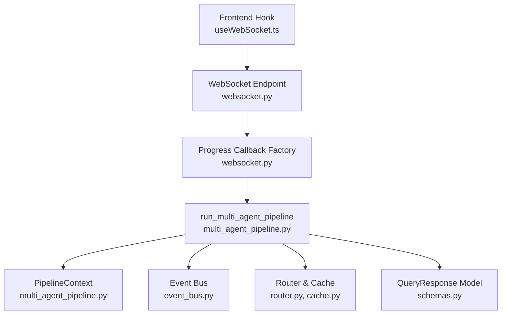
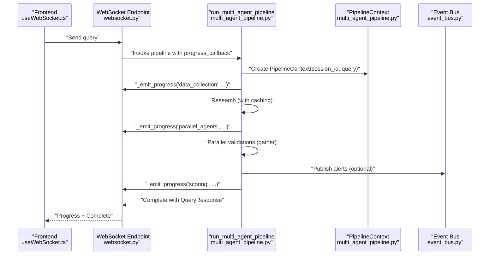
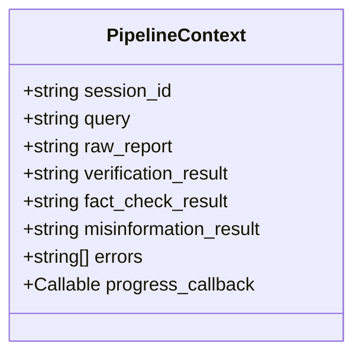
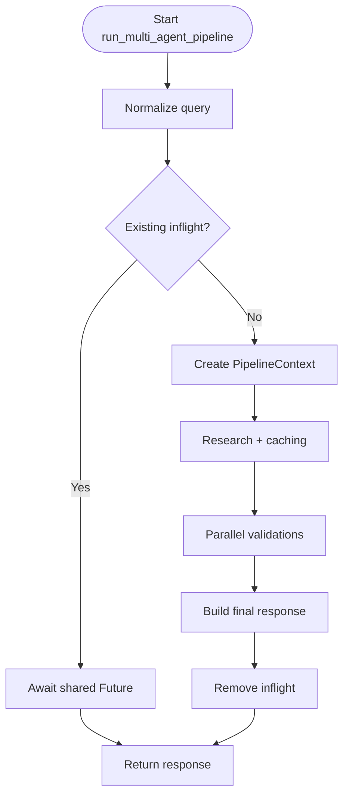
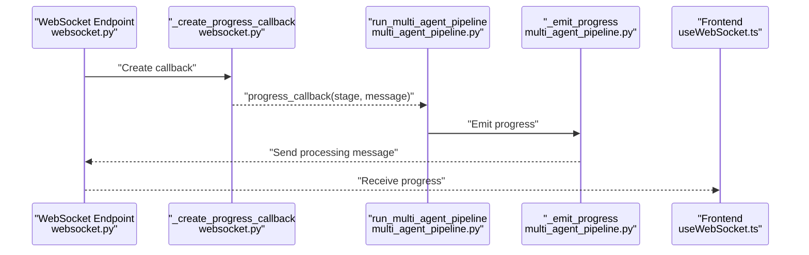
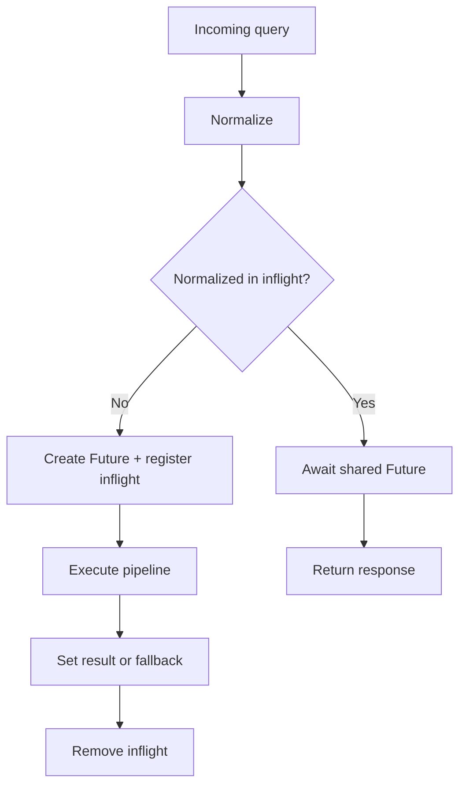
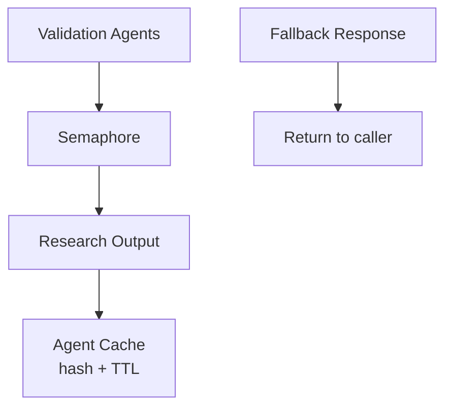
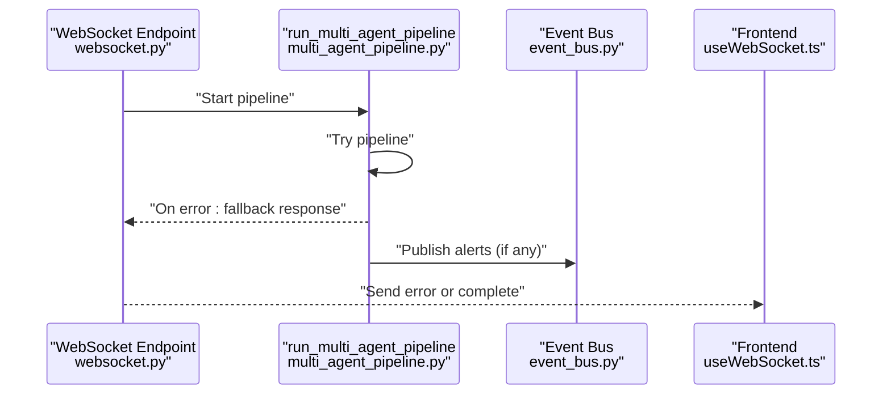
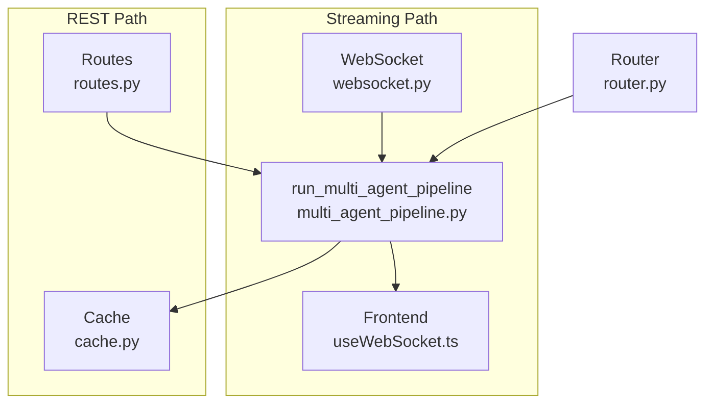
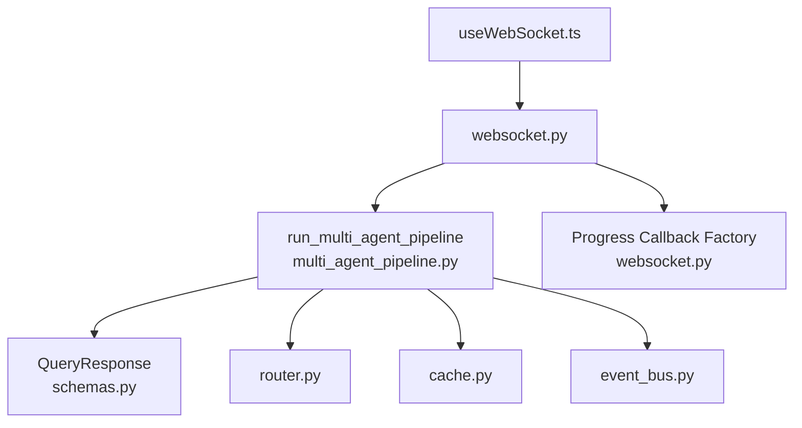

# Pipeline Context Management

<cite>
**Referenced Files in This Document**
- [multi_agent_pipeline.py](file://veritas-ai/pipelines/multi_agent_pipeline.py)
- [websocket.py](file://veritas-ai/app/api/websocket.py)
- [routes.py](file://veritas-ai/app/api/routes.py)
- [event_bus.py](file://veritas-ai/pipelines/event_bus.py)
- [schemas.py](file://veritas-ai/models/schemas.py)
- [cache.py](file://veritas-ai/app/core/cache.py)
- [router.py](file://veritas-ai/core/router.py)
- [useWebSocket.ts](file://veritas-ai/frontend/hooks/useWebSocket.ts)
</cite>

## Table of Contents
1. [Introduction](#introduction)
2. [Project Structure](#project-structure)
3. [Core Components](#core-components)
4. [Architecture Overview](#architecture-overview)
5. [Detailed Component Analysis](#detailed-component-analysis)
6. [Dependency Analysis](#dependency-analysis)
7. [Performance Considerations](#performance-considerations)
8. [Troubleshooting Guide](#troubleshooting-guide)
9. [Conclusion](#conclusion)
10. [Appendices](#appendices)

## Introduction
This document explains the PipelineContext class and the broader context management system used to coordinate sessions, track state, propagate progress callbacks, manage concurrency, deduplicate queries, and handle cleanup across pipeline stages. It covers how context flows through the multi-agent pipeline, how progress is reported to clients via WebSockets, and how errors are captured and surfaced. Practical examples and best practices are included for maintaining state consistency during asynchronous operations.

## Project Structure
The context management spans several modules:
- Pipeline orchestration and context definition live in the multi-agent pipeline module.
- Streaming progress delivery is handled by the WebSocket endpoint and a progress callback factory.
- Routing and caching influence whether a session uses the fast or deep pipeline.
- The event bus supports alert propagation and response resolution/failure signaling.
- Frontend hooks consume progress and completion messages.

**Diagram sources**
- [websocket.py:63-165](file://veritas-ai/app/api/websocket.py#L63-L165)
- [multi_agent_pipeline.py:209-298](file://veritas-ai/pipelines/multi_agent_pipeline.py#L209-L298)
- [event_bus.py:1-74](file://veritas-ai/pipelines/event_bus.py#L1-L74)
- [router.py:83-182](file://veritas-ai/core/router.py#L83-L182)
- [cache.py:15-172](file://veritas-ai/app/core/cache.py#L15-L172)
- [schemas.py:14-26](file://veritas-ai/models/schemas.py#L14-L26)
- [useWebSocket.ts:15-142](file://veritas-ai/frontend/hooks/useWebSocket.ts#L15-L142)

**Section sources**
- [multi_agent_pipeline.py:38-48](file://veritas-ai/pipelines/multi_agent_pipeline.py#L38-L48)
- [websocket.py:42-58](file://veritas-ai/app/api/websocket.py#L42-L58)
- [router.py:83-182](file://veritas-ai/core/router.py#L83-L182)
- [cache.py:15-172](file://veritas-ai/app/core/cache.py#L15-L172)
- [event_bus.py:1-74](file://veritas-ai/pipelines/event_bus.py#L1-L74)
- [schemas.py:14-26](file://veritas-ai/models/schemas.py#L14-L26)
- [useWebSocket.ts:15-142](file://veritas-ai/frontend/hooks/useWebSocket.ts#L15-L142)

## Core Components
- PipelineContext: Holds per-session state including identifiers, intermediate results, and the progress callback. It is created at the start of a pipeline run and mutated as stages complete.
- Progress callback: A coroutine invoked by pipeline stages to emit stage-specific progress updates to the client.
- Deduplication and inflight tracking: A dictionary maps normalized queries to futures to avoid duplicate work.
- Concurrency controls: A semaphore limits parallel tool/agent invocations; gather is used to run validations concurrently.
- Caching: Research and agent outputs are cached to reduce latency and redundant computation.
- Error handling: Exceptions are caught, logged, and converted into a fallback response; the inflight registry is cleaned up in a finally block.

**Section sources**
- [multi_agent_pipeline.py:38-48](file://veritas-ai/pipelines/multi_agent_pipeline.py#L38-L48)
- [multi_agent_pipeline.py:209-298](file://veritas-ai/pipelines/multi_agent_pipeline.py#L209-L298)
- [multi_agent_pipeline.py:146-207](file://veritas-ai/pipelines/multi_agent_pipeline.py#L146-L207)
- [multi_agent_pipeline.py:74-95](file://veritas-ai/pipelines/multi_agent_pipeline.py#L74-L95)
- [websocket.py:42-58](file://veritas-ai/app/api/websocket.py#L42-L58)

## Architecture Overview
The pipeline orchestrator creates a PipelineContext, emits progress updates, executes research and parallel validations, builds a final response, and cleans up inflight state. The WebSocket endpoint translates stage progress into structured messages for the client.

**Diagram sources**
- [useWebSocket.ts:42-79](file://veritas-ai/frontend/hooks/useWebSocket.ts#L42-L79)
- [websocket.py:63-165](file://veritas-ai/app/api/websocket.py#L63-L165)
- [multi_agent_pipeline.py:209-298](file://veritas-ai/pipelines/multi_agent_pipeline.py#L209-L298)
- [event_bus.py:31-61](file://veritas-ai/pipelines/event_bus.py#L31-L61)

## Detailed Component Analysis

### PipelineContext Dataclass
PipelineContext encapsulates the session’s identity, the original query, intermediate results, error accumulator, and the progress callback. It is created early in the pipeline and passed along to progress emitters and response builders.

**Diagram sources**
- [multi_agent_pipeline.py:38-48](file://veritas-ai/pipelines/multi_agent_pipeline.py#L38-L48)

**Section sources**
- [multi_agent_pipeline.py:38-48](file://veritas-ai/pipelines/multi_agent_pipeline.py#L38-L48)

### Session Lifecycle and Context Propagation
- Creation: A unique session identifier is generated and a PipelineContext is instantiated with the normalized query and optional progress callback.
- Execution: Stages update fields on the context (e.g., raw_report, verification_result, etc.) as they complete.
- Completion: The final response is built from the context and returned; inflight state is removed.

**Diagram sources**
- [multi_agent_pipeline.py:209-298](file://veritas-ai/pipelines/multi_agent_pipeline.py#L209-L298)

**Section sources**
- [multi_agent_pipeline.py:209-298](file://veritas-ai/pipelines/multi_agent_pipeline.py#L209-L298)

### Progress Callback Mechanisms
- The WebSocket endpoint constructs a progress callback that maps logical stages to numeric progress values and sends structured messages to the client.
- The pipeline emits progress updates at key stages (research, parallel validations, scoring) using a shared emitter that invokes the callback if present.

**Diagram sources**
- [websocket.py:42-58](file://veritas-ai/app/api/websocket.py#L42-L58)
- [multi_agent_pipeline.py:98-104](file://veritas-ai/pipelines/multi_agent_pipeline.py#L98-L104)
- [useWebSocket.ts:42-79](file://veritas-ai/frontend/hooks/useWebSocket.ts#L42-L79)

**Section sources**
- [websocket.py:42-58](file://veritas-ai/app/api/websocket.py#L42-L58)
- [multi_agent_pipeline.py:98-104](file://veritas-ai/pipelines/multi_agent_pipeline.py#L98-L104)
- [useWebSocket.ts:42-79](file://veritas-ai/frontend/hooks/useWebSocket.ts#L42-L79)

### Concurrent Query Handling and Deduplication
- Deduplication: A dictionary maps normalized queries to asyncio futures. If a query is inflight, new callers await the existing future instead of spawning duplicate work.
- Cleanup: The inflight registry is removed in a finally block after the pipeline completes or fails.
- Concurrency: A semaphore limits parallel validation agent executions; parallel validations are executed with asyncio.gather.

**Diagram sources**
- [multi_agent_pipeline.py:221-229](file://veritas-ai/pipelines/multi_agent_pipeline.py#L221-L229)
- [multi_agent_pipeline.py:289-298](file://veritas-ai/pipelines/multi_agent_pipeline.py#L289-L298)
- [multi_agent_pipeline.py:138-143](file://veritas-ai/pipelines/multi_agent_pipeline.py#L138-L143)
- [multi_agent_pipeline.py:199-201](file://veritas-ai/pipelines/multi_agent_pipeline.py#L199-L201)

**Section sources**
- [multi_agent_pipeline.py:221-229](file://veritas-ai/pipelines/multi_agent_pipeline.py#L221-L229)
- [multi_agent_pipeline.py:289-298](file://veritas-ai/pipelines/multi_agent_pipeline.py#L289-L298)
- [multi_agent_pipeline.py:138-143](file://veritas-ai/pipelines/multi_agent_pipeline.py#L138-L143)
- [multi_agent_pipeline.py:199-201](file://veritas-ai/pipelines/multi_agent_pipeline.py#L199-L201)

### Resource Management Patterns
- Caching: Research and agent outputs are cached with a hash-based key and TTL to reduce repeated computation.
- Semaphore: Limits concurrent validation agent invocations to protect downstream systems.
- Graceful fallback: On failure, a deterministic fallback response is produced and returned to the caller.

**Diagram sources**
- [multi_agent_pipeline.py:74-95](file://veritas-ai/pipelines/multi_agent_pipeline.py#L74-L95)
- [multi_agent_pipeline.py:138-143](file://veritas-ai/pipelines/multi_agent_pipeline.py#L138-L143)
- [multi_agent_pipeline.py:354-366](file://veritas-ai/pipelines/multi_agent_pipeline.py#L354-L366)

**Section sources**
- [multi_agent_pipeline.py:74-95](file://veritas-ai/pipelines/multi_agent_pipeline.py#L74-L95)
- [multi_agent_pipeline.py:138-143](file://veritas-ai/pipelines/multi_agent_pipeline.py#L138-L143)
- [multi_agent_pipeline.py:354-366](file://veritas-ai/pipelines/multi_agent_pipeline.py#L354-L366)

### Error Tracking and Cleanup Procedures
- Error capture: Exceptions are caught, logged, and converted into a fallback response. The inflight registry is cleaned up regardless of success or failure.
- Alert propagation: On successful completion, triggered alerts are published to the event bus.
- WebSocket error handling: The endpoint sends structured error messages to the client and logs failures.

**Diagram sources**
- [websocket.py:149-159](file://veritas-ai/app/api/websocket.py#L149-L159)
- [multi_agent_pipeline.py:289-294](file://veritas-ai/pipelines/multi_agent_pipeline.py#L289-L294)
- [multi_agent_pipeline.py:324-331](file://veritas-ai/pipelines/multi_agent_pipeline.py#L324-L331)
- [event_bus.py:52-61](file://veritas-ai/pipelines/event_bus.py#L52-L61)
- [useWebSocket.ts:69-75](file://veritas-ai/frontend/hooks/useWebSocket.ts#L69-L75)

**Section sources**
- [websocket.py:149-159](file://veritas-ai/app/api/websocket.py#L149-L159)
- [multi_agent_pipeline.py:289-294](file://veritas-ai/pipelines/multi_agent_pipeline.py#L289-L294)
- [multi_agent_pipeline.py:324-331](file://veritas-ai/pipelines/multi_agent_pipeline.py#L324-L331)
- [event_bus.py:52-61](file://veritas-ai/pipelines/event_bus.py#L52-L61)
- [useWebSocket.ts:69-75](file://veritas-ai/frontend/hooks/useWebSocket.ts#L69-L75)

### Context Usage Scenarios
- Real-time streaming: The WebSocket endpoint creates a progress callback and passes it into the pipeline; the frontend consumes stage and progress updates.
- REST-based execution: The routes module invokes the pipeline and caches results; progress is not streamed but latency is recorded.
- Fast vs deep routing: The router decides whether to run the fast or deep pipeline; the cache layer serves previously computed results when available.

**Diagram sources**
- [websocket.py:63-165](file://veritas-ai/app/api/websocket.py#L63-L165)
- [routes.py:46-81](file://veritas-ai/app/api/routes.py#L46-L81)
- [router.py:83-182](file://veritas-ai/core/router.py#L83-L182)
- [cache.py:66-95](file://veritas-ai/app/core/cache.py#L66-L95)
- [multi_agent_pipeline.py:209-298](file://veritas-ai/pipelines/multi_agent_pipeline.py#L209-L298)
- [useWebSocket.ts:15-142](file://veritas-ai/frontend/hooks/useWebSocket.ts#L15-L142)

**Section sources**
- [websocket.py:63-165](file://veritas-ai/app/api/websocket.py#L63-L165)
- [routes.py:46-81](file://veritas-ai/app/api/routes.py#L46-L81)
- [router.py:83-182](file://veritas-ai/core/router.py#L83-L182)
- [cache.py:66-95](file://veritas-ai/app/core/cache.py#L66-L95)
- [multi_agent_pipeline.py:209-298](file://veritas-ai/pipelines/multi_agent_pipeline.py#L209-L298)
- [useWebSocket.ts:15-142](file://veritas-ai/frontend/hooks/useWebSocket.ts#L15-L142)

## Dependency Analysis
The pipeline depends on routing, caching, and event bus for orchestration and observability. The WebSocket endpoint depends on the pipeline and the progress callback factory.

**Diagram sources**
- [multi_agent_pipeline.py:209-298](file://veritas-ai/pipelines/multi_agent_pipeline.py#L209-L298)
- [schemas.py:14-26](file://veritas-ai/models/schemas.py#L14-L26)
- [router.py:83-182](file://veritas-ai/core/router.py#L83-L182)
- [cache.py:15-172](file://veritas-ai/app/core/cache.py#L15-L172)
- [event_bus.py:1-74](file://veritas-ai/pipelines/event_bus.py#L1-L74)
- [websocket.py:63-165](file://veritas-ai/app/api/websocket.py#L63-L165)
- [useWebSocket.ts:15-142](file://veritas-ai/frontend/hooks/useWebSocket.ts#L15-L142)

**Section sources**
- [multi_agent_pipeline.py:209-298](file://veritas-ai/pipelines/multi_agent_pipeline.py#L209-L298)
- [websocket.py:63-165](file://veritas-ai/app/api/websocket.py#L63-L165)
- [router.py:83-182](file://veritas-ai/core/router.py#L83-L182)
- [cache.py:15-172](file://veritas-ai/app/core/cache.py#L15-L172)
- [event_bus.py:1-74](file://veritas-ai/pipelines/event_bus.py#L1-L74)
- [schemas.py:14-26](file://veritas-ai/models/schemas.py#L14-L26)
- [useWebSocket.ts:15-142](file://veritas-ai/frontend/hooks/useWebSocket.ts#L15-L142)

## Performance Considerations
- Prefer the fast path for simple queries to minimize latency.
- Use caching for research and agent outputs to avoid recomputation.
- Limit parallelism with the semaphore to prevent downstream saturation.
- Deduplicate inflight queries to avoid redundant work.
- Stream progress updates to keep clients informed without blocking the pipeline.

[No sources needed since this section provides general guidance]

## Troubleshooting Guide
- Verify progress updates: Ensure the WebSocket endpoint’s progress callback is invoked and mapped to realistic progress values.
- Inspect fallback responses: When exceptions occur, confirm that a deterministic fallback is returned and logged.
- Monitor inflight deduplication: Confirm that duplicate queries await the same future and that cleanup removes entries.
- Validate cache hits: Check that normalized queries produce consistent cache keys and that TTLs are respected.
- Observe alerts: Confirm that triggered alerts are published to the event bus and consumed by subscribers.

**Section sources**
- [websocket.py:149-159](file://veritas-ai/app/api/websocket.py#L149-L159)
- [multi_agent_pipeline.py:289-294](file://veritas-ai/pipelines/multi_agent_pipeline.py#L289-L294)
- [multi_agent_pipeline.py:221-229](file://veritas-ai/pipelines/multi_agent_pipeline.py#L221-L229)
- [multi_agent_pipeline.py:296-298](file://veritas-ai/pipelines/multi_agent_pipeline.py#L296-L298)
- [cache.py:66-95](file://veritas-ai/app/core/cache.py#L66-L95)
- [event_bus.py:52-61](file://veritas-ai/pipelines/event_bus.py#L52-L61)

## Conclusion
The PipelineContext class centralizes session state and progress reporting, enabling robust orchestration across asynchronous pipeline stages. Combined with deduplication, concurrency controls, caching, and structured error handling, the system maintains consistency and responsiveness. The WebSocket progress callback and event bus integrate tightly with the pipeline to deliver real-time feedback and alert propagation.

[No sources needed since this section summarizes without analyzing specific files]

## Appendices

### Best Practices for State Consistency Across Async Operations
- Always pass the same PipelineContext instance through all stages to preserve state.
- Use the progress callback sparingly and consistently to avoid overwhelming clients.
- Keep the inflight registry small and bounded; consider pruning stale entries if needed.
- Ensure cleanup occurs in a finally block to release resources even on failure.
- Normalize queries before deduplication to maximize cache and inflight hit rates.

[No sources needed since this section provides general guidance]