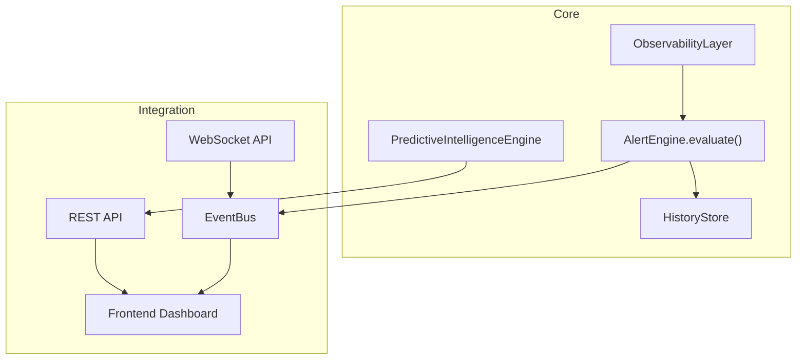
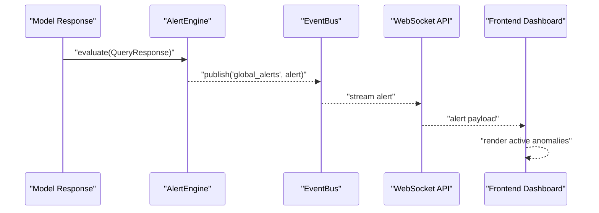
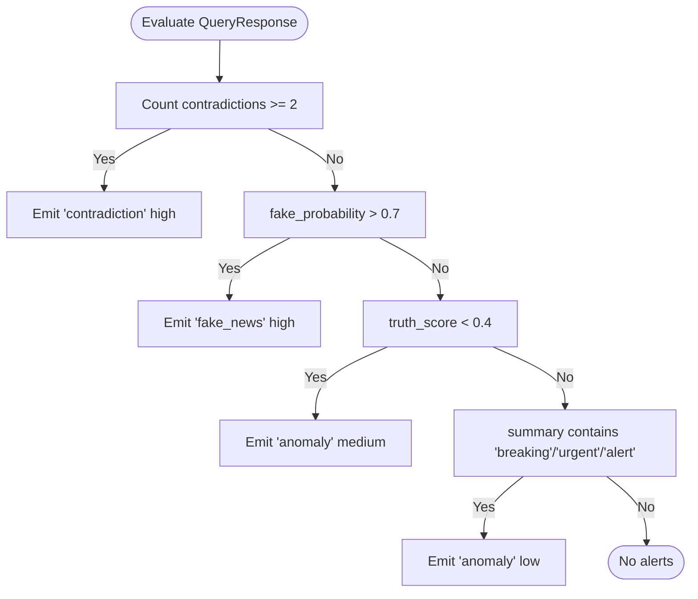
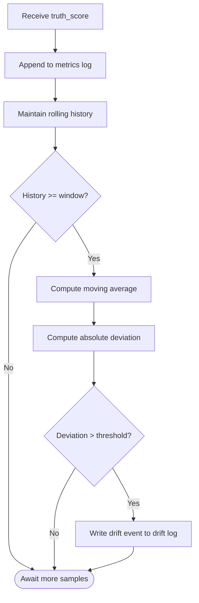
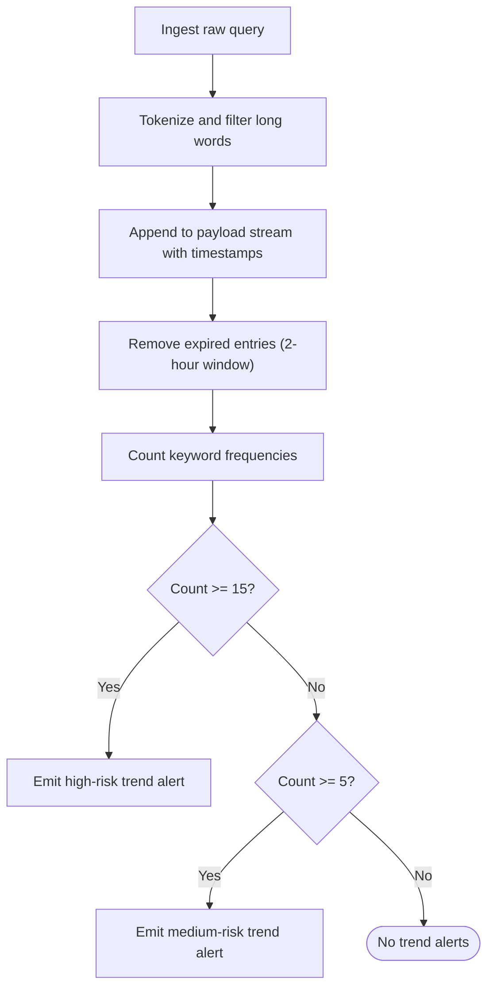
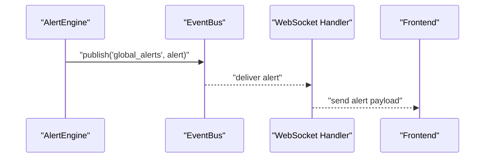
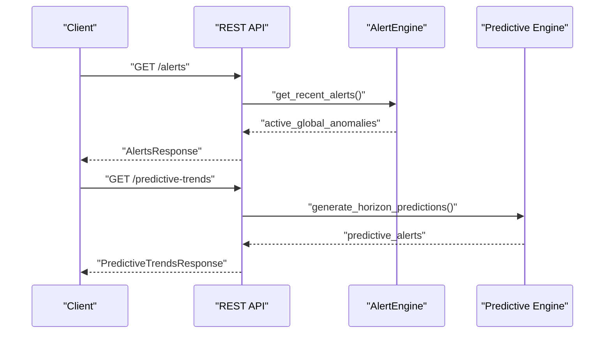
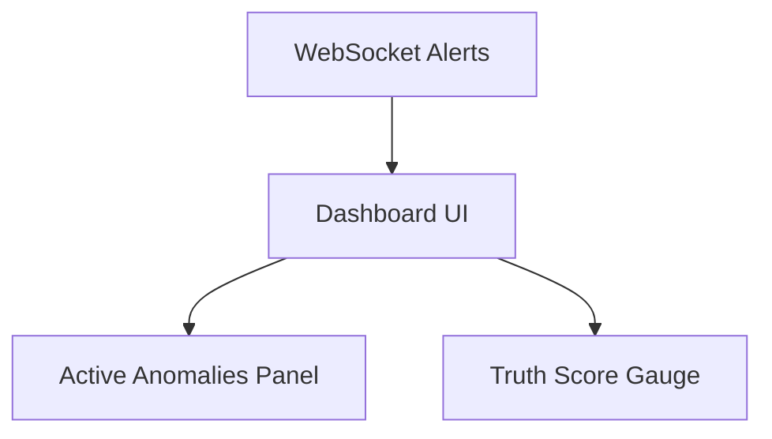
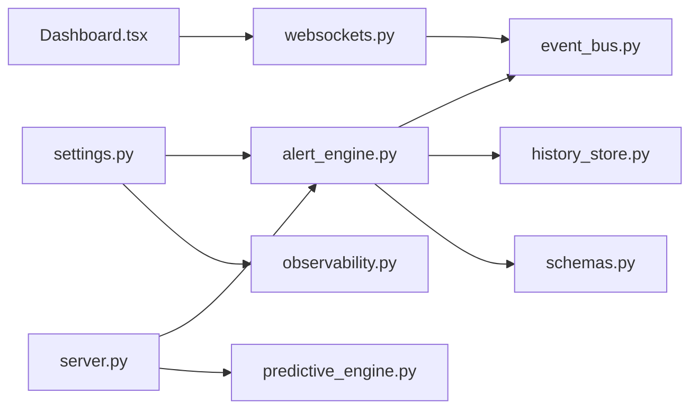

# Alert Engine

<cite>
**Referenced Files in This Document**
- [alert_engine.py](file://veritas-ai/core/alert_engine.py)
- [observability.py](file://veritas-ai/core/observability.py)
- [event_bus.py](file://veritas-ai/pipelines/event_bus.py)
- [websockets.py](file://veritas-ai/api/websockets.py)
- [server.py](file://veritas-ai/api/server.py)
- [schemas.py](file://veritas-ai/models/schemas.py)
- [settings.py](file://veritas-ai/config/settings.py)
- [predictive_engine.py](file://veritas-ai/core/predictive_engine.py)
- [history_store.py](file://veritas-ai/core/history_store.py)
- [Dashboard.tsx](file://veritas-ai/frontend/components/Dashboard.tsx)
- [README.md](file://veritas-ai/README.md)
</cite>

## Table of Contents
1. [Introduction](#introduction)
2. [Project Structure](#project-structure)
3. [Core Components](#core-components)
4. [Architecture Overview](#architecture-overview)
5. [Detailed Component Analysis](#detailed-component-analysis)
6. [Dependency Analysis](#dependency-analysis)
7. [Performance Considerations](#performance-considerations)
8. [Troubleshooting Guide](#troubleshooting-guide)
9. [Conclusion](#conclusion)
10. [Appendices](#appendices)

## Introduction
This document describes the Alert Engine subsystem responsible for detecting incidents, emitting alerts, and integrating with observability and real-time dashboards. It explains the alert generation logic, severity classification, and the event-driven pipeline that streams alerts to clients. It also covers configuration, thresholds, and operational guidance for mitigating alert fatigue and false positives.

## Project Structure
The Alert Engine lives in the backend core and interacts with:
- The event bus for alert distribution
- The WebSocket API for live alert streaming
- The REST API for alert retrieval
- Observability logging for drift detection
- The frontend dashboard for visualization

**Diagram sources**
- [alert_engine.py:20-66](file://veritas-ai/core/alert_engine.py#L20-L66)
- [observability.py:6-74](file://veritas-ai/core/observability.py#L6-L74)
- [event_bus.py:6-73](file://veritas-ai/pipelines/event_bus.py#L6-L73)
- [websockets.py:71-76](file://veritas-ai/api/websockets.py#L71-L76)
- [server.py:125-131](file://veritas-ai/api/server.py#L125-L131)
- [predictive_engine.py:5-62](file://veritas-ai/core/predictive_engine.py#L5-L62)
- [history_store.py:46-63](file://veritas-ai/core/history_store.py#L46-L63)

**Section sources**
- [README.md:33-59](file://veritas-ai/README.md#L33-L59)

## Core Components
- AlertEngine: Evaluates structured model outputs and emits standardized alerts with severity and messages.
- ObservabilityLayer: Logs truth scores and detects drift to produce anomaly events.
- PredictiveIntelligenceEngine: Detects emerging misinformation spikes from query streams.
- EventBus: Asynchronous message broker distributing alerts to subscribers.
- WebSocket API: Streams alerts to connected clients in real time.
- REST API: Provides endpoints to fetch recent alerts and predictive trends.
- Frontend Dashboard: Visualizes active anomalies and truth metrics.

**Section sources**
- [alert_engine.py:20-66](file://veritas-ai/core/alert_engine.py#L20-L66)
- [observability.py:6-74](file://veritas-ai/core/observability.py#L6-L74)
- [predictive_engine.py:5-62](file://veritas-ai/core/predictive_engine.py#L5-L62)
- [event_bus.py:6-73](file://veritas-ai/pipelines/event_bus.py#L6-L73)
- [websockets.py:71-76](file://veritas-ai/api/websockets.py#L71-L76)
- [server.py:125-131](file://veritas-ai/api/server.py#L125-L131)
- [Dashboard.tsx:209-226](file://veritas-ai/frontend/components/Dashboard.tsx#L209-L226)

## Architecture Overview
The Alert Engine participates in an event-driven pipeline:
- Model responses are evaluated for anomalies.
- Alerts are published to a topic and streamed to clients via WebSocket.
- Predictive trends are exposed via REST for early-warning signals.
- Observability metrics support drift detection and anomaly logging.

**Diagram sources**
- [alert_engine.py:26-66](file://veritas-ai/core/alert_engine.py#L26-L66)
- [event_bus.py:31-50](file://veritas-ai/pipelines/event_bus.py#L31-L50)
- [websockets.py:71-76](file://veritas-ai/api/websockets.py#L71-L76)
- [Dashboard.tsx:209-226](file://veritas-ai/frontend/components/Dashboard.tsx#L209-L226)

## Detailed Component Analysis

### Alert Generation and Severity Classification
The AlertEngine evaluates a structured QueryResponse and emits standardized alerts with severity levels. Each rule produces a distinct alert type and severity.

- Alert types: contradiction, fake_news, anomaly
- Severity: high, medium, low
- Timestamps are included for traceability.

**Diagram sources**
- [alert_engine.py:26-66](file://veritas-ai/core/alert_engine.py#L26-L66)

**Section sources**
- [alert_engine.py:20-66](file://veritas-ai/core/alert_engine.py#L20-L66)
- [schemas.py:40-49](file://veritas-ai/models/schemas.py#L40-L49)

### Observability and Drift Detection
The ObservabilityLayer logs truth scores and computes a moving average over a fixed window. When deviation exceeds a threshold, it writes a drift event to a dedicated log file. These drift events can be correlated with alert emissions.

- Window size and drift threshold are configurable.
- Metrics and drift logs are stored under a logs directory.

**Diagram sources**
- [observability.py:45-71](file://veritas-ai/core/observability.py#L45-L71)

**Section sources**
- [observability.py:6-74](file://veritas-ai/core/observability.py#L6-L74)
- [logs/observability_metrics.json:1-15](file://veritas-ai/logs/observability_metrics.json#L1-L15)

### Predictive Trend Alerts
The PredictiveIntelligenceEngine ingests raw queries, extracts keywords, and maintains a sliding-window stream. It detects spikes in keyword topics and emits trend alerts with risk levels.

- Risk levels: medium, high
- Predictive trends endpoint returns aggregated alerts.

**Diagram sources**
- [predictive_engine.py:14-59](file://veritas-ai/core/predictive_engine.py#L14-L59)

**Section sources**
- [predictive_engine.py:5-62](file://veritas-ai/core/predictive_engine.py#L5-L62)
- [server.py:182-193](file://veritas-ai/api/server.py#L182-L193)

### Event Bus and Alert Streaming
The EventBus provides asynchronous pub/sub for alert distribution. The WebSocket handler subscribes to the global topic and forwards alerts to clients.

**Diagram sources**
- [event_bus.py:31-50](file://veritas-ai/pipelines/event_bus.py#L31-L50)
- [websockets.py:71-76](file://veritas-ai/api/websockets.py#L71-L76)

**Section sources**
- [event_bus.py:6-73](file://veritas-ai/pipelines/event_bus.py#L6-L73)
- [websockets.py:71-76](file://veritas-ai/api/websockets.py#L71-L76)

### REST API Integration
The REST API exposes:
- GET /alerts: Returns recent global anomalies
- GET /predictive-trends: Returns trend alerts
- WebSocket endpoints for streaming analysis and alerts

**Diagram sources**
- [server.py:125-131](file://veritas-ai/api/server.py#L125-L131)
- [server.py:182-193](file://veritas-ai/api/server.py#L182-L193)

**Section sources**
- [server.py:125-131](file://veritas-ai/api/server.py#L125-L131)
- [server.py:182-193](file://veritas-ai/api/server.py#L182-L193)

### Frontend Dashboard Integration
The frontend displays active anomalies and truth metrics. Alerts received via WebSocket are shown as cards with severity indicators.

**Diagram sources**
- [Dashboard.tsx:209-226](file://veritas-ai/frontend/components/Dashboard.tsx#L209-L226)

**Section sources**
- [Dashboard.tsx:209-226](file://veritas-ai/frontend/components/Dashboard.tsx#L209-L226)

## Dependency Analysis
- AlertEngine depends on QueryResponse schema and settings for alert limits.
- ObservabilityLayer depends on filesystem logging and a moving average window.
- EventBus is a standalone async pub/sub used by AlertEngine and WebSocket handlers.
- REST API depends on AlertEngine and PredictiveIntelligenceEngine.
- Frontend depends on WebSocket streaming for live updates.

**Diagram sources**
- [settings.py:28](file://veritas-ai/config/settings.py#L28)
- [alert_engine.py:5-6](file://veritas-ai/core/alert_engine.py#L5-L6)
- [observability.py:11-18](file://veritas-ai/core/observability.py#L11-L18)
- [event_bus.py:12-14](file://veritas-ai/pipelines/event_bus.py#L12-L14)
- [schemas.py:14-25](file://veritas-ai/models/schemas.py#L14-L25)
- [server.py:11-13](file://veritas-ai/api/server.py#L11-L13)
- [predictive_engine.py:10-12](file://veritas-ai/core/predictive_engine.py#L10-L12)
- [websockets.py:71-76](file://veritas-ai/api/websockets.py#L71-L76)
- [Dashboard.tsx:21-22](file://veritas-ai/frontend/components/Dashboard.tsx#L21-L22)

**Section sources**
- [settings.py:28](file://veritas-ai/config/settings.py#L28)
- [alert_engine.py:5-6](file://veritas-ai/core/alert_engine.py#L5-L6)
- [observability.py:11-18](file://veritas-ai/core/observability.py#L11-L18)
- [event_bus.py:12-14](file://veritas-ai/pipelines/event_bus.py#L12-L14)
- [schemas.py:14-25](file://veritas-ai/models/schemas.py#L14-L25)
- [server.py:11-13](file://veritas-ai/api/server.py#L11-L13)
- [predictive_engine.py:10-12](file://veritas-ai/core/predictive_engine.py#L10-L12)
- [websockets.py:71-76](file://veritas-ai/api/websockets.py#L71-L76)
- [Dashboard.tsx:21-22](file://veritas-ai/frontend/components/Dashboard.tsx#L21-L22)

## Performance Considerations
- Alert evaluation is O(n) over the payload fields and runs quickly.
- EventBus uses async queues and avoids blocking; ensure subscriber handling remains lightweight.
- Drift detection uses a simple moving average; tune window size and threshold to balance sensitivity vs. noise.
- REST and WebSocket endpoints are rate-limited; adjust limits as needed for production loads.
- Frontend rendering of alerts is client-side; avoid excessive re-renders by limiting alert volume.

[No sources needed since this section provides general guidance]

## Troubleshooting Guide
Common issues and resolutions:
- Alerts not appearing in the dashboard
  - Verify WebSocket subscription and that alerts are being published to the global topic.
  - Confirm REST endpoint access and that recent alerts are retrievable.
- No predictive trends returned
  - Ensure sufficient query volume over the 2-hour window; increase keyword frequency to meet thresholds.
- Drift alerts not logged
  - Check that truth scores are being logged and that the history window is filled.
  - Validate drift threshold and window size configurations.
- Excessive alerts causing fatigue
  - Adjust thresholds in AlertEngine rules and reduce alert volume via filtering.
  - Use the predictive trends to preemptively address spikes.
- Configuration tuning
  - Adjust alert limits and cache sizes via settings.
  - Review rate limits on REST endpoints.

**Section sources**
- [websockets.py:71-76](file://veritas-ai/api/websockets.py#L71-L76)
- [server.py:125-131](file://veritas-ai/api/server.py#L125-L131)
- [observability.py:55-71](file://veritas-ai/core/observability.py#L55-L71)
- [predictive_engine.py:33-59](file://veritas-ai/core/predictive_engine.py#L33-L59)
- [settings.py:28](file://veritas-ai/config/settings.py#L28)

## Conclusion
The Alert Engine integrates tightly with the event-driven architecture to detect anomalies, log drift, and stream alerts to clients. Its severity-based classification and rule-based evaluation provide actionable signals for incident detection and early-warning trend identification. Proper configuration of thresholds, limits, and streaming ensures reliable operation with minimal alert fatigue.

[No sources needed since this section summarizes without analyzing specific files]

## Appendices

### Configuration Examples
- Alert limits
  - Use the alert limit setting to cap recent alerts retained in memory.
- Drift detection
  - Tune the moving window size and drift threshold for sensitivity.
- Rate limits
  - REST endpoints apply rate limiting; adjust as needed for production.

**Section sources**
- [settings.py:28](file://veritas-ai/config/settings.py#L28)
- [observability.py:20-23](file://veritas-ai/core/observability.py#L20-L23)
- [server.py:81-85](file://veritas-ai/api/server.py#L81-L85)

### API Endpoints Related to Alerts
- GET /alerts: Returns recent global anomalies.
- GET /predictive-trends: Returns trend alerts indicating emerging misinformation.

**Section sources**
- [server.py:125-131](file://veritas-ai/api/server.py#L125-L131)
- [server.py:182-193](file://veritas-ai/api/server.py#L182-L193)