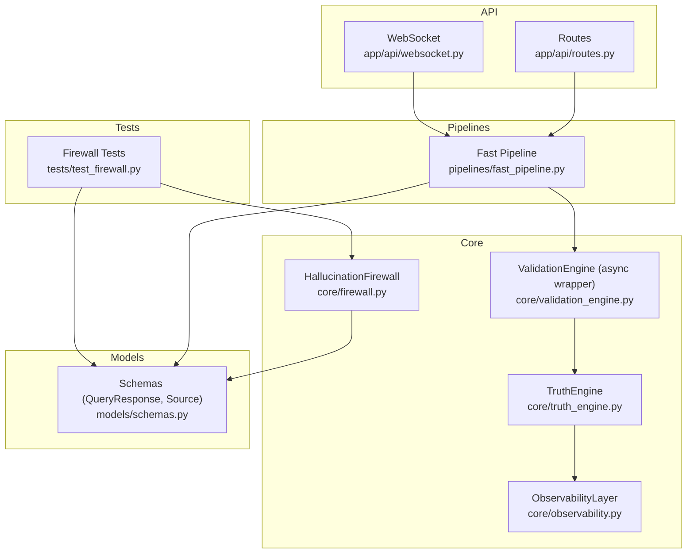
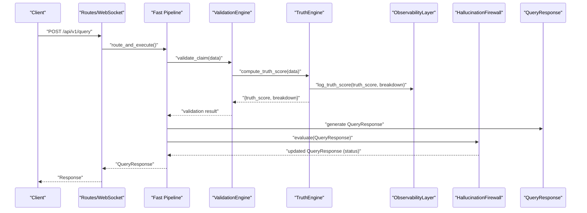
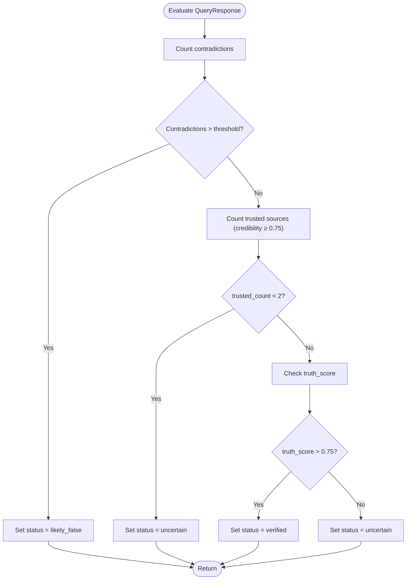
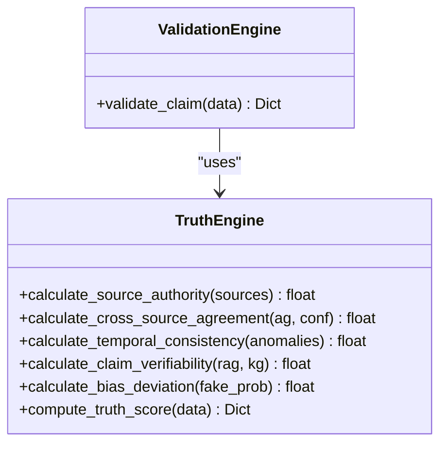
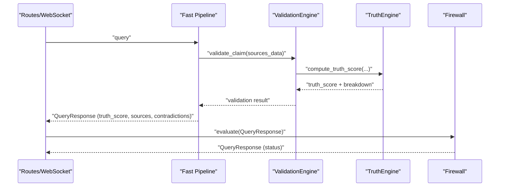
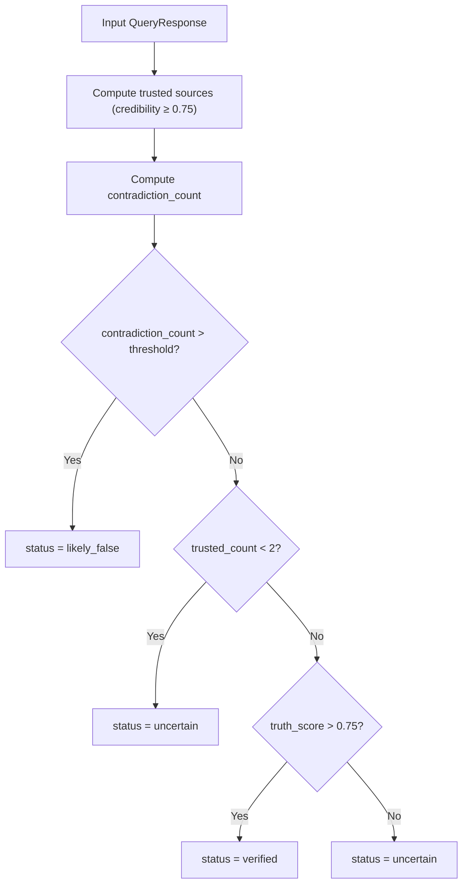
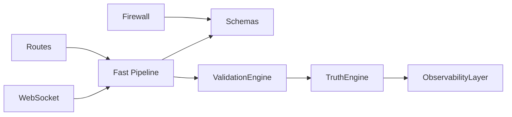
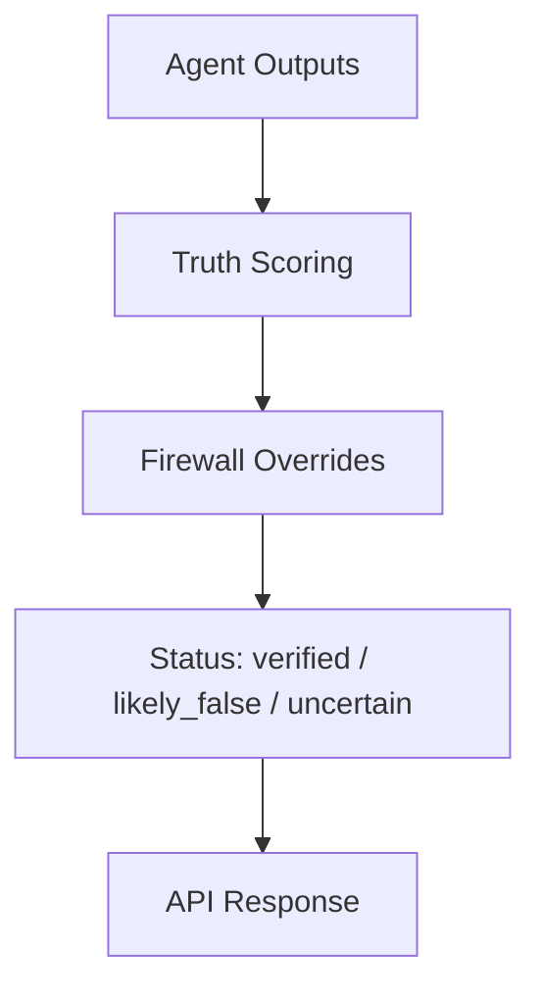

# Hallucination Firewall

<cite>
**Referenced Files in This Document**
- [firewall.py](file://veritas-ai/core/firewall.py)
- [schemas.py](file://veritas-ai/models/schemas.py)
- [validation_engine.py](file://veritas-ai/core/validation_engine.py)
- [truth_engine.py](file://veritas-ai/core/truth_engine.py)
- [fast_pipeline.py](file://veritas-ai/pipelines/fast_pipeline.py)
- [routes.py](file://veritas-ai/app/api/routes.py)
- [websocket.py](file://veritas-ai/app/api/websocket.py)
- [test_firewall.py](file://veritas-ai/tests/test_firewall.py)
- [observability.py](file://veritas-ai/core/observability.py)
- [settings.py](file://veritas-ai/config/settings.py)
- [README.md](file://veritas-ai/README.md)
</cite>

## Table of Contents
1. [Introduction](#introduction)
2. [Project Structure](#project-structure)
3. [Core Components](#core-components)
4. [Architecture Overview](#architecture-overview)
5. [Detailed Component Analysis](#detailed-component-analysis)
6. [Dependency Analysis](#dependency-analysis)
7. [Performance Considerations](#performance-considerations)
8. [Troubleshooting Guide](#troubleshooting-guide)
9. [Conclusion](#conclusion)
10. [Appendices](#appendices)

## Introduction
The Hallucination Firewall is a deterministic rule matrix that evaluates intelligence pipeline outputs to prevent LLM hallucinations and unverified claims from reaching API boundaries. It enforces three override systems:
- Explicit logic constraints for contradiction detection
- Sourcing authority requirements for minimum trusted sources
- Verification array scoring for truth score thresholds

The Firewall produces a status classification of verified, likely_false, or uncertain, and integrates tightly with the truth scoring engine and routing pipeline.

## Project Structure
The Firewall resides in the core layer and interacts with schemas, validation, pipelines, and observability.

**Diagram sources**
- [firewall.py:1-47](file://veritas-ai/core/firewall.py#L1-L47)
- [truth_engine.py:1-117](file://veritas-ai/core/truth_engine.py#L1-L117)
- [validation_engine.py:1-18](file://veritas-ai/core/validation_engine.py#L1-L18)
- [fast_pipeline.py:1-22](file://veritas-ai/pipelines/fast_pipeline.py#L1-L22)
- [routes.py:1-251](file://veritas-ai/app/api/routes.py#L1-L251)
- [websocket.py:1-253](file://veritas-ai/app/api/websocket.py#L1-L253)
- [schemas.py:1-88](file://veritas-ai/models/schemas.py#L1-L88)
- [test_firewall.py:1-43](file://veritas-ai/tests/test_firewall.py#L1-L43)
- [observability.py:1-75](file://veritas-ai/core/observability.py#L1-L75)

**Section sources**
- [firewall.py:1-47](file://veritas-ai/core/firewall.py#L1-L47)
- [schemas.py:1-88](file://veritas-ai/models/schemas.py#L1-L88)
- [validation_engine.py:1-18](file://veritas-ai/core/validation_engine.py#L1-L18)
- [truth_engine.py:1-117](file://veritas-ai/core/truth_engine.py#L1-L117)
- [fast_pipeline.py:1-22](file://veritas-ai/pipelines/fast_pipeline.py#L1-L22)
- [routes.py:1-251](file://veritas-ai/app/api/routes.py#L1-L251)
- [websocket.py:1-253](file://veritas-ai/app/api/websocket.py#L1-L253)
- [test_firewall.py:1-43](file://veritas-ai/tests/test_firewall.py#L1-L43)
- [observability.py:1-75](file://veritas-ai/core/observability.py#L1-L75)

## Core Components
- HallucinationFirewall: Applies deterministic overrides to clamp statuses based on contradiction counts, trusted source thresholds, and truth score thresholds.
- TruthEngine: Computes a mathematically weighted truth score from multiple factors and logs breakdowns.
- ValidationEngine: Async wrapper around TruthEngine to avoid blocking the event loop.
- QueryResponse and Source: Pydantic models defining the shape of pipeline outputs and source metadata.
- Fast Pipeline: Minimal retrieval and validation path that feeds into Firewall evaluation.
- Routes/WebSocket: Entry points that route queries to appropriate pipelines and integrate Firewall evaluation.

Key behaviors:
- Status classification: verified, likely_false, uncertain
- Deterministic overrides: early exit on contradictions, insufficient trusted sources, or truth score thresholds
- Logging and observability: truth score breakdowns and drift detection

**Section sources**
- [firewall.py:10-46](file://veritas-ai/core/firewall.py#L10-L46)
- [truth_engine.py:78-116](file://veritas-ai/core/truth_engine.py#L78-L116)
- [validation_engine.py:9-17](file://veritas-ai/core/validation_engine.py#L9-L17)
- [schemas.py:14-25](file://veritas-ai/models/schemas.py#L14-L25)
- [fast_pipeline.py:8-21](file://veritas-ai/pipelines/fast_pipeline.py#L8-L21)

## Architecture Overview
The Firewall sits after truth scoring and before API responses, ensuring only validated outputs reach clients.

**Diagram sources**
- [routes.py:46-81](file://veritas-ai/app/api/routes.py#L46-L81)
- [websocket.py:63-160](file://veritas-ai/app/api/websocket.py#L63-L160)
- [fast_pipeline.py:8-21](file://veritas-ai/pipelines/fast_pipeline.py#L8-L21)
- [validation_engine.py:9-17](file://veritas-ai/core/validation_engine.py#L9-L17)
- [truth_engine.py:78-116](file://veritas-ai/core/truth_engine.py#L78-L116)
- [observability.py:45-71](file://veritas-ai/core/observability.py#L45-L71)
- [firewall.py:13-46](file://veritas-ai/core/firewall.py#L13-L46)
- [schemas.py:14-25](file://veritas-ai/models/schemas.py#L14-L25)

## Detailed Component Analysis

### HallucinationFirewall
Deterministic rule matrix evaluation:
- Override 1: Explicit Logic Constraints
  - If contradiction count exceeds threshold, mark as likely_false
- Override 2: Sourcing Authority
  - If fewer than two high-credibility sources, mark as uncertain
- Override 3: Verification Array
  - If truth_score exceeds 0.75, mark as verified
- Baseline: Otherwise, mark as uncertain

**Diagram sources**
- [firewall.py:13-46](file://veritas-ai/core/firewall.py#L13-L46)

**Section sources**
- [firewall.py:10-46](file://veritas-ai/core/firewall.py#L10-L46)

### TruthEngine and ValidationEngine
TruthEngine computes a weighted truth score from:
- Source authority (domain mapping)
- Cross-source agreement
- Temporal consistency
- Claim verifiability (RAG + KG hits)
- Bias deviation (inverse of fake probability)

ValidationEngine wraps TruthEngine to run off the event loop.

**Diagram sources**
- [truth_engine.py:3-116](file://veritas-ai/core/truth_engine.py#L3-L116)
- [validation_engine.py:9-17](file://veritas-ai/core/validation_engine.py#L9-L17)

**Section sources**
- [truth_engine.py:19-116](file://veritas-ai/core/truth_engine.py#L19-L116)
- [validation_engine.py:9-17](file://veritas-ai/core/validation_engine.py#L9-L17)

### Integration with Pipelines and API
- Fast Pipeline: retrieves sources, validates claim, generates response, then Firewall evaluates status.
- Routes/WebSocket: resolve query, cache, and route to appropriate pipeline; responses include latency and caching metadata.

**Diagram sources**
- [fast_pipeline.py:8-21](file://veritas-ai/pipelines/fast_pipeline.py#L8-L21)
- [validation_engine.py:9-17](file://veritas-ai/core/validation_engine.py#L9-L17)
- [truth_engine.py:78-116](file://veritas-ai/core/truth_engine.py#L78-L116)
- [firewall.py:13-46](file://veritas-ai/core/firewall.py#L13-L46)
- [routes.py:46-81](file://veritas-ai/app/api/routes.py#L46-L81)
- [websocket.py:63-160](file://veritas-ai/app/api/websocket.py#L63-L160)

**Section sources**
- [fast_pipeline.py:8-21](file://veritas-ai/pipelines/fast_pipeline.py#L8-L21)
- [routes.py:46-81](file://veritas-ai/app/api/routes.py#L46-L81)
- [websocket.py:63-160](file://veritas-ai/app/api/websocket.py#L63-L160)

### Status Classification and Decision Logic
- verified: truth_score > 0.75
- likely_false: contradiction_count > threshold
- uncertain: otherwise (including missing trusted sources)

**Diagram sources**
- [firewall.py:21-46](file://veritas-ai/core/firewall.py#L21-L46)

**Section sources**
- [firewall.py:13-46](file://veritas-ai/core/firewall.py#L13-L46)

### Configuration Parameters and Threshold Tuning Guidelines
- contradiction_threshold: integer controlling override sensitivity for contradictions
- truth_score threshold: 0.75 for verified
- trusted source threshold: minimum number of high-credibility sources (≥ 0.75) required before truth score evaluation
- Pipeline timeouts and caching: configurable via settings for performance and reliability

Guidelines:
- Increase contradiction_threshold to reduce false positives caused by noisy contradiction detection
- Lower threshold to catch more potential hallucinations but risk false positives
- Adjust trusted source requirement based on domain needs; stricter domains may require higher thresholds
- Monitor drift logs to tune thresholds over time

**Section sources**
- [firewall.py:10-11](file://veritas-ai/core/firewall.py#L10-L11)
- [observability.py:45-71](file://veritas-ai/core/observability.py#L45-L71)
- [settings.py:21-28](file://veritas-ai/config/settings.py#L21-L28)

### Integration Examples with Intelligence Pipeline
- REST API: POST /api/v1/query invokes the routing and fast pipeline; Firewall evaluates the final response.
- WebSocket: /ws/stream supports progress streaming and caches results; Firewall applies to the final QueryResponse.
- Tools: Truth Scoring Engine and Domain Credibility Evaluator support external integrations and testing.

**Section sources**
- [routes.py:100-128](file://veritas-ai/app/api/routes.py#L100-L128)
- [websocket.py:63-160](file://veritas-ai/app/api/websocket.py#L63-L160)
- [fast_pipeline.py:8-21](file://veritas-ai/pipelines/fast_pipeline.py#L8-L21)

## Dependency Analysis
- Firewall depends on QueryResponse schema for inputs and outputs.
- TruthEngine depends on observability for logging truth score breakdowns.
- ValidationEngine depends on TruthEngine and runs in thread pool to avoid blocking.
- Fast Pipeline orchestrates retrieval, validation, and response generation.
- Routes/WebSocket depend on cache and routing to select appropriate pipelines.

**Diagram sources**
- [firewall.py:1-47](file://veritas-ai/core/firewall.py#L1-L47)
- [schemas.py:14-25](file://veritas-ai/models/schemas.py#L14-L25)
- [validation_engine.py:1-18](file://veritas-ai/core/validation_engine.py#L1-L18)
- [truth_engine.py:1-117](file://veritas-ai/core/truth_engine.py#L1-L117)
- [observability.py:1-75](file://veritas-ai/core/observability.py#L1-L75)
- [fast_pipeline.py:1-22](file://veritas-ai/pipelines/fast_pipeline.py#L1-L22)
- [routes.py:1-251](file://veritas-ai/app/api/routes.py#L1-L251)
- [websocket.py:1-253](file://veritas-ai/app/api/websocket.py#L1-L253)

**Section sources**
- [firewall.py:1-47](file://veritas-ai/core/firewall.py#L1-L47)
- [validation_engine.py:1-18](file://veritas-ai/core/validation_engine.py#L1-L18)
- [truth_engine.py:1-117](file://veritas-ai/core/truth_engine.py#L1-L117)
- [fast_pipeline.py:1-22](file://veritas-ai/pipelines/fast_pipeline.py#L1-L22)
- [routes.py:1-251](file://veritas-ai/app/api/routes.py#L1-L251)
- [websocket.py:1-253](file://veritas-ai/app/api/websocket.py#L1-L253)

## Performance Considerations
- Asynchronous truth scoring: ValidationEngine runs compute_truth_score in a thread pool to keep the event loop responsive.
- Caching: Routes and WebSocket cache results to reduce repeated computations.
- Lightweight Firewall: Single-pass evaluation with early exits reduces overhead.
- Observability: Drift detection helps maintain stable thresholds over time without manual tuning.

[No sources needed since this section provides general guidance]

## Troubleshooting Guide
Common issues and resolutions:
- False positives (status = likely_false despite valid claims)
  - Reduce contradiction_threshold to allow more nuanced claims
  - Verify contradiction detection logic upstream
- False negatives (status = uncertain despite clear falsehoods)
  - Increase contradiction_threshold to enforce stricter logic constraints
  - Ensure sufficient trusted sources are present (≥ 2 with credibility ≥ 0.75)
- Slow responses
  - Confirm ValidationEngine is used to avoid blocking
  - Review pipeline timeouts and caching configuration
- Drifting thresholds
  - Monitor drift logs to detect when truth score distributions shift
  - Retrain or adjust weights in TruthEngine as needed

**Section sources**
- [firewall.py:27-37](file://veritas-ai/core/firewall.py#L27-L37)
- [observability.py:55-71](file://veritas-ai/core/observability.py#L55-L71)
- [settings.py:21-28](file://veritas-ai/config/settings.py#L21-L28)

## Conclusion
The Hallucination Firewall provides a robust, deterministic safety net for intelligence pipelines. By combining explicit logic constraints, sourcing authority checks, and truth score verification, it maintains high confidence in outputs while remaining lightweight and observable. Proper tuning of thresholds and integration with caching and async validation ensures both accuracy and performance.

[No sources needed since this section summarizes without analyzing specific files]

## Appendices

### API Definitions
- POST /api/v1/query
  - Body: { "query": "text", "deep": boolean }
  - Response: QueryResponse with status and truth_score
- POST /api/v1/verify-news
  - Headers: X-API-KEY required
  - Body: { "claim": "text", "deep": boolean }
  - Response: QueryResponse with status and truth_score

**Section sources**
- [routes.py:100-128](file://veritas-ai/app/api/routes.py#L100-L128)

### Test Coverage Highlights
- likely_false: high contradiction count forces status = likely_false
- uncertain: insufficient trusted sources leads to uncertain
- verified: sufficient trusted sources and truth_score > 0.75 yields verified

**Section sources**
- [test_firewall.py:8-42](file://veritas-ai/tests/test_firewall.py#L8-L42)

### Conceptual Overview

[No sources needed since this diagram shows conceptual workflow, not actual code structure]