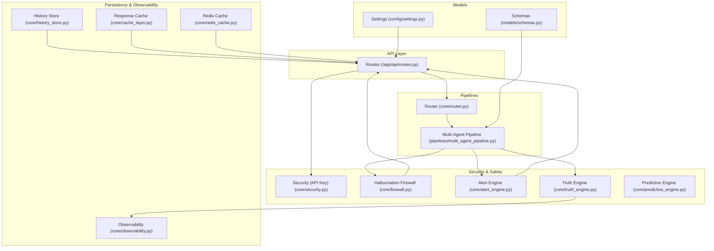
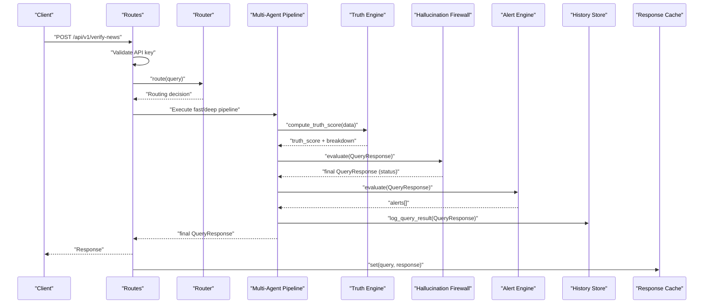
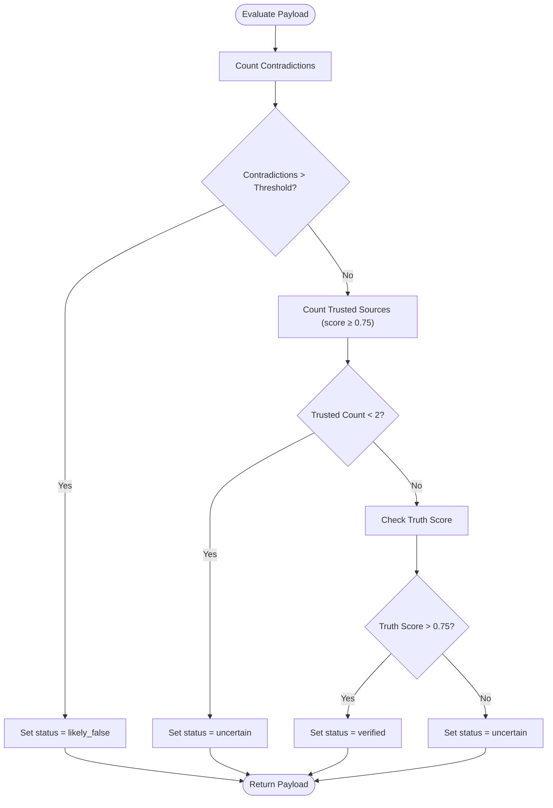
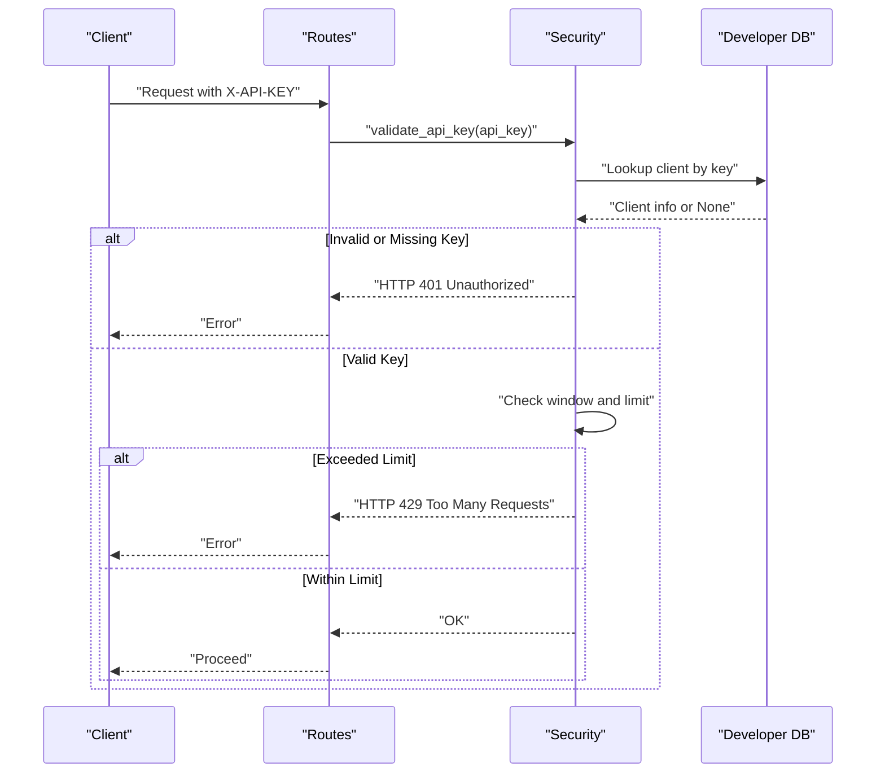
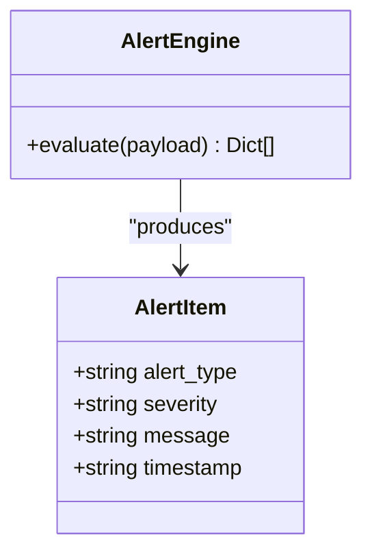
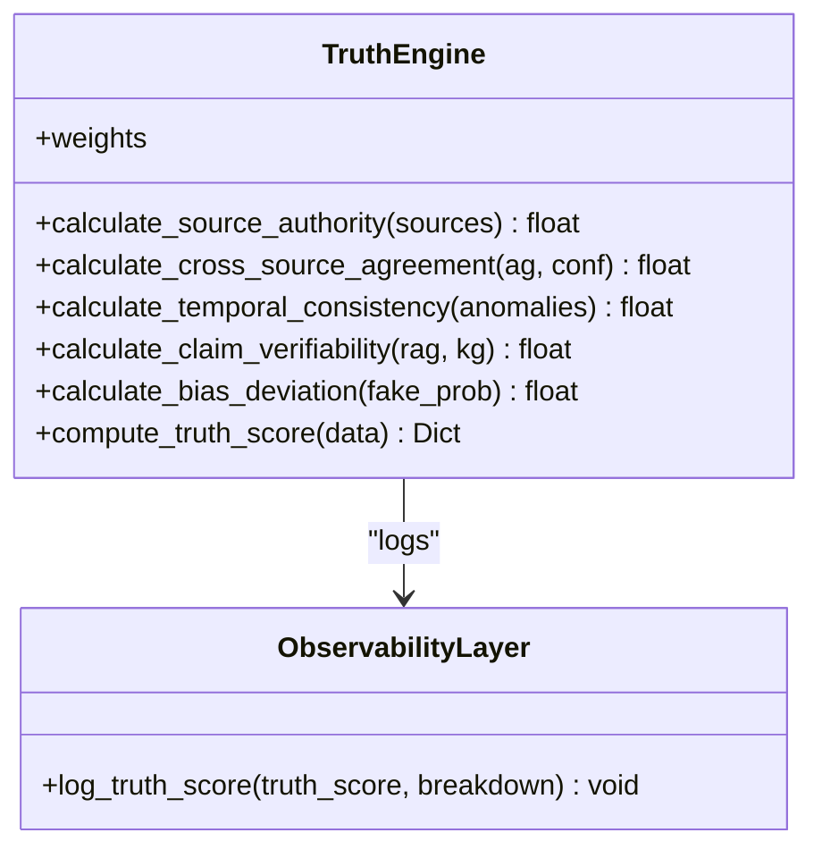
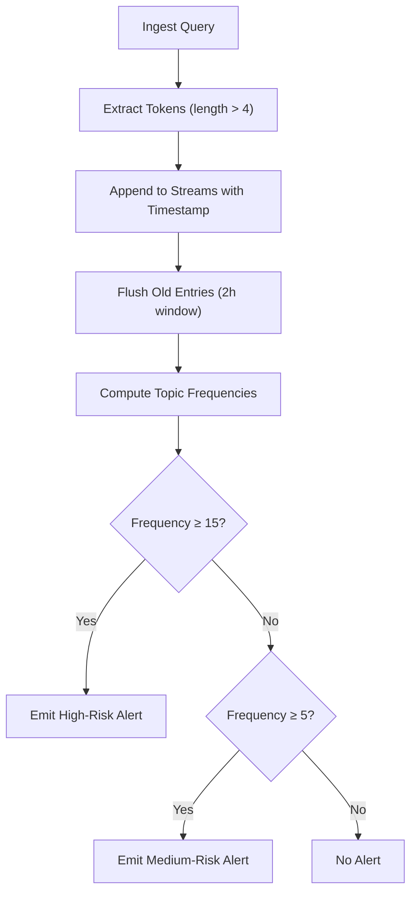
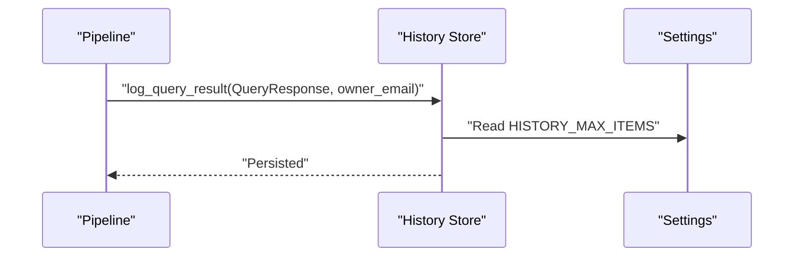
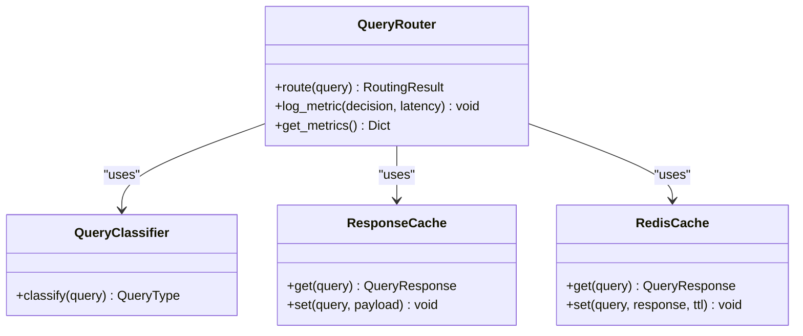
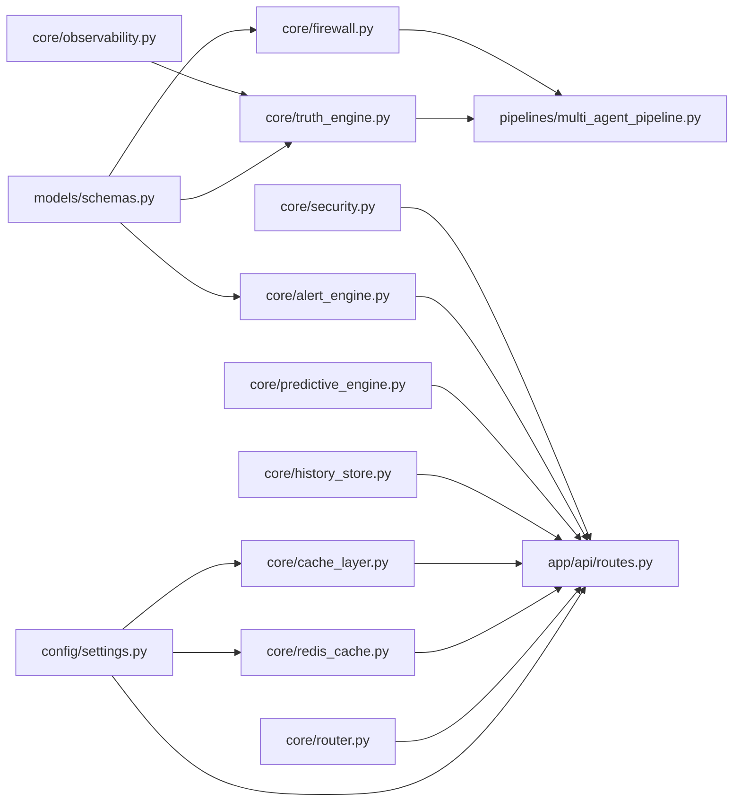

# Security Engines

<cite>
**Referenced Files in This Document**
- [firewall.py](file://veritas-ai/core/firewall.py)
- [security.py](file://veritas-ai/core/security.py)
- [alert_engine.py](file://veritas-ai/core/alert_engine.py)
- [schemas.py](file://veritas-ai/models/schemas.py)
- [settings.py](file://veritas-ai/config/settings.py)
- [truth_engine.py](file://veritas-ai/core/truth_engine.py)
- [predictive_engine.py](file://veritas-ai/core/predictive_engine.py)
- [observability.py](file://veritas-ai/core/observability.py)
- [history_store.py](file://veritas-ai/core/history_store.py)
- [cache_layer.py](file://veritas-ai/core/cache_layer.py)
- [redis_cache.py](file://veritas-ai/core/redis_cache.py)
- [router.py](file://veritas-ai/core/router.py)
- [routes.py](file://veritas-ai/app/api/routes.py)
- [multi_agent_pipeline.py](file://veritas-ai/pipelines/multi_agent_pipeline.py)
- [test_firewall.py](file://veritas-ai/tests/test_firewall.py)
- [README.md](file://veritas-ai/README.md)
</cite>

## Table of Contents
1. [Introduction](#introduction)
2. [Project Structure](#project-structure)
3. [Core Components](#core-components)
4. [Architecture Overview](#architecture-overview)
5. [Detailed Component Analysis](#detailed-component-analysis)
6. [Dependency Analysis](#dependency-analysis)
7. [Performance Considerations](#performance-considerations)
8. [Troubleshooting Guide](#troubleshooting-guide)
9. [Conclusion](#conclusion)
10. [Appendices](#appendices)

## Introduction
This document describes the Security Engine subsystem responsible for AI safety and integrity protection in the Veritas AI platform. It focuses on the proprietary Hallucination Firewall, detection and prevention mechanisms, threat assessment models, automated alerting, and integrated observability and compliance support. The Security Engine ensures that intelligence outputs are verified, consistent, and trustworthy before reaching downstream consumers.

## Project Structure
The Security Engine spans several modules:
- Authentication and API key enforcement
- Hallucination Firewall for deterministic rule-based validation
- Alert Engine for incident detection and escalation
- Truth Engine for multi-factor truth scoring
- Predictive Intelligence Engine for trend and anomaly detection
- Observability and drift detection
- History store for compliance and audit trails
- Caching and routing layers supporting performance and safety

**Diagram sources**
- [routes.py:1-251](file://veritas-ai/app/api/routes.py#L1-L251)
- [security.py:1-129](file://veritas-ai/core/security.py#L1-L129)
- [router.py:1-182](file://veritas-ai/core/router.py#L1-L182)
- [multi_agent_pipeline.py:188-332](file://veritas-ai/pipelines/multi_agent_pipeline.py#L188-L332)
- [truth_engine.py:1-117](file://veritas-ai/core/truth_engine.py#L1-L117)
- [firewall.py:1-47](file://veritas-ai/core/firewall.py#L1-L47)
- [alert_engine.py:1-67](file://veritas-ai/core/alert_engine.py#L1-L67)
- [predictive_engine.py:1-63](file://veritas-ai/core/predictive_engine.py#L1-L63)
- [observability.py:1-75](file://veritas-ai/core/observability.py#L1-L75)
- [history_store.py:1-106](file://veritas-ai/core/history_store.py#L1-L106)
- [cache_layer.py:1-41](file://veritas-ai/core/cache_layer.py#L1-L41)
- [redis_cache.py:1-232](file://veritas-ai/core/redis_cache.py#L1-L232)
- [schemas.py:1-88](file://veritas-ai/models/schemas.py#L1-L88)
- [settings.py:1-83](file://veritas-ai/config/settings.py#L1-L83)

**Section sources**
- [routes.py:1-251](file://veritas-ai/app/api/routes.py#L1-L251)
- [schemas.py:1-88](file://veritas-ai/models/schemas.py#L1-L88)
- [settings.py:1-83](file://veritas-ai/config/settings.py#L1-L83)

## Core Components
- Authentication and API Key Enforcement: Validates API keys, enforces rate limits, and logs unauthorized attempts.
- Hallucination Firewall: Applies deterministic rules to clamp output status based on source trust, contradiction counts, and truth scores.
- Alert Engine: Detects anomalies and emits structured alerts with severity and timing metadata.
- Truth Engine: Computes a multi-factor truth score and breakdown, integrating with observability.
- Predictive Intelligence Engine: Tracks keyword spikes to predict misinformation trends.
- Observability: Logs truth computations and detects drift in scores over time.
- History Store: Persists query results for audit and compliance.
- Caching and Routing: Optimizes performance and ensures safe reuse of prior results.

**Section sources**
- [security.py:1-129](file://veritas-ai/core/security.py#L1-L129)
- [firewall.py:1-47](file://veritas-ai/core/firewall.py#L1-L47)
- [alert_engine.py:1-67](file://veritas-ai/core/alert_engine.py#L1-L67)
- [truth_engine.py:1-117](file://veritas-ai/core/truth_engine.py#L1-L117)
- [predictive_engine.py:1-63](file://veritas-ai/core/predictive_engine.py#L1-L63)
- [observability.py:1-75](file://veritas-ai/core/observability.py#L1-L75)
- [history_store.py:1-106](file://veritas-ai/core/history_store.py#L1-L106)
- [cache_layer.py:1-41](file://veritas-ai/core/cache_layer.py#L1-L41)
- [redis_cache.py:1-232](file://veritas-ai/core/redis_cache.py#L1-L232)
- [router.py:1-182](file://veritas-ai/core/router.py#L1-L182)

## Architecture Overview
The Security Engine integrates tightly with the multi-agent pipeline and API layer. The pipeline computes truth scores, applies the Hallucination Firewall, generates alerts, and persists results. The API layer enforces authentication and exposes endpoints for alerts, trends, and historical records.

**Diagram sources**
- [routes.py:100-128](file://veritas-ai/app/api/routes.py#L100-L128)
- [router.py:99-180](file://veritas-ai/core/router.py#L99-L180)
- [multi_agent_pipeline.py:188-332](file://veritas-ai/pipelines/multi_agent_pipeline.py#L188-L332)
- [truth_engine.py:78-117](file://veritas-ai/core/truth_engine.py#L78-L117)
- [firewall.py:13-46](file://veritas-ai/core/firewall.py#L13-L46)
- [alert_engine.py:26-66](file://veritas-ai/core/alert_engine.py#L26-L66)
- [history_store.py:46-63](file://veritas-ai/core/history_store.py#L46-L63)
- [cache_layer.py:29-37](file://veritas-ai/core/cache_layer.py#L29-L37)

## Detailed Component Analysis

### Hallucination Firewall
The Hallucination Firewall is a deterministic rule matrix applied to the final pipeline output to prevent unverified or contradictory claims from reaching users. It evaluates:
- Contradictions: If the number of contradictions exceeds a configurable threshold, the status is clamped to “likely_false”.
- Trusted Sources: If fewer than two high-credibility sources are present, the status becomes “uncertain”.
- Truth Score: If the computed truth score exceeds a threshold, the status becomes “verified”; otherwise “uncertain”.

**Diagram sources**
- [firewall.py:13-46](file://veritas-ai/core/firewall.py#L13-L46)

**Section sources**
- [firewall.py:1-47](file://veritas-ai/core/firewall.py#L1-L47)
- [test_firewall.py:1-43](file://veritas-ai/tests/test_firewall.py#L1-L43)

### Security Validation Protocols and Threat Assessment
- API Key Validation: Enforces presence and validity of the X-API-KEY header, performs constant-time comparison, and applies fixed-window rate limiting per tier.
- Tiered Limits: Free tier and enterprise tiers with separate limits and reset windows.
- Logging: Records unauthorized attempts and invalid keys with client IP context.

**Diagram sources**
- [security.py:51-84](file://veritas-ai/core/security.py#L51-L84)
- [routes.py:21-31](file://veritas-ai/app/api/routes.py#L21-L31)

**Section sources**
- [security.py:1-129](file://veritas-ai/core/security.py#L1-L129)
- [routes.py:21-42](file://veritas-ai/app/api/routes.py#L21-L42)

### Automated Response Systems and Alert Engine
The Alert Engine inspects the final response and emits structured alerts when:
- Contradictions exceed a threshold
- Fake news probability exceeds a threshold
- Truth score drops below a threshold
- Temporal anomaly keywords appear in the summary

Alerts include type, severity, message, and timestamp. Recent alerts are stored in a bounded deque and exposed via an endpoint.

**Diagram sources**
- [alert_engine.py:20-66](file://veritas-ai/core/alert_engine.py#L20-L66)
- [schemas.py:40-44](file://veritas-ai/models/schemas.py#L40-L44)

**Section sources**
- [alert_engine.py:1-67](file://veritas-ai/core/alert_engine.py#L1-L67)
- [schemas.py:1-88](file://veritas-ai/models/schemas.py#L1-L88)

### Truth Scoring and Anomaly Detection
- Truth Engine computes a weighted truth score from:
  - Source authority (domain-based)
  - Cross-source agreement
  - Temporal consistency
  - Claim verifiability (RAG + KG)
  - Bias deviation (inverse of fake probability)
- Observability logs truth scores and detects drift via moving average comparisons.

**Diagram sources**
- [truth_engine.py:3-117](file://veritas-ai/core/truth_engine.py#L3-L117)
- [observability.py:45-71](file://veritas-ai/core/observability.py#L45-L71)

**Section sources**
- [truth_engine.py:1-117](file://veritas-ai/core/truth_engine.py#L1-L117)
- [observability.py:1-75](file://veritas-ai/core/observability.py#L1-L75)

### Predictive Intelligence and Misinformation Trend Monitoring
The Predictive Intelligence Engine tracks keyword spikes across queries to anticipate misinformation trends. It maintains a sliding window and emits alerts for high- and medium-risk topics.

**Diagram sources**
- [predictive_engine.py:14-59](file://veritas-ai/core/predictive_engine.py#L14-L59)

**Section sources**
- [predictive_engine.py:1-63](file://veritas-ai/core/predictive_engine.py#L1-L63)

### Compliance Monitoring and Audit Trails
- History Store persists query results with owner attribution, enabling auditability and compliance reporting.
- Settings control retention limits and public URLs for generated links.
- Observability logs truth computations and drift events to JSONL files for analysis.

**Diagram sources**
- [history_store.py:46-63](file://veritas-ai/core/history_store.py#L46-L63)
- [settings.py:27-31](file://veritas-ai/config/settings.py#L27-L31)

**Section sources**
- [history_store.py:1-106](file://veritas-ai/core/history_store.py#L1-L106)
- [settings.py:1-83](file://veritas-ai/config/settings.py#L1-L83)
- [observability.py:1-75](file://veritas-ai/core/observability.py#L1-L75)

### Security Rule Enforcement and Logical Loop Avoidance
- Router classifies queries and selects fast-path or full pipeline to reduce unnecessary computation and potential loops.
- ResponseCache and RedisCache provide deterministic caching to avoid recomputation on repeated queries.
- Multi-agent pipeline applies the Firewall and Alert Engine after truth scoring to prevent unsafe outputs.

**Diagram sources**
- [router.py:51-151](file://veritas-ai/core/router.py#L51-L151)
- [cache_layer.py:10-41](file://veritas-ai/core/cache_layer.py#L10-L41)
- [redis_cache.py:18-163](file://veritas-ai/core/redis_cache.py#L18-L163)

**Section sources**
- [router.py:1-182](file://veritas-ai/core/router.py#L1-L182)
- [cache_layer.py:1-41](file://veritas-ai/core/cache_layer.py#L1-L41)
- [redis_cache.py:1-232](file://veritas-ai/core/redis_cache.py#L1-L232)
- [multi_agent_pipeline.py:321-332](file://veritas-ai/pipelines/multi_agent_pipeline.py#L321-L332)

## Dependency Analysis
The Security Engine components depend on shared models and settings, and integrate with the API layer and pipelines.

**Diagram sources**
- [security.py:1-129](file://veritas-ai/core/security.py#L1-L129)
- [firewall.py:1-47](file://veritas-ai/core/firewall.py#L1-L47)
- [alert_engine.py:1-67](file://veritas-ai/core/alert_engine.py#L1-L67)
- [truth_engine.py:1-117](file://veritas-ai/core/truth_engine.py#L1-L117)
- [predictive_engine.py:1-63](file://veritas-ai/core/predictive_engine.py#L1-L63)
- [observability.py:1-75](file://veritas-ai/core/observability.py#L1-L75)
- [history_store.py:1-106](file://veritas-ai/core/history_store.py#L1-L106)
- [cache_layer.py:1-41](file://veritas-ai/core/cache_layer.py#L1-L41)
- [redis_cache.py:1-232](file://veritas-ai/core/redis_cache.py#L1-L232)
- [router.py:1-182](file://veritas-ai/core/router.py#L1-L182)
- [routes.py:1-251](file://veritas-ai/app/api/routes.py#L1-L251)
- [schemas.py:1-88](file://veritas-ai/models/schemas.py#L1-L88)
- [settings.py:1-83](file://veritas-ai/config/settings.py#L1-L83)

**Section sources**
- [schemas.py:1-88](file://veritas-ai/models/schemas.py#L1-L88)
- [settings.py:1-83](file://veritas-ai/config/settings.py#L1-L83)

## Performance Considerations
- Fixed-window rate limiting reduces bursty abuse without complex state machines.
- Deterministic hashing and caching minimize redundant computation.
- Asynchronous Redis cache improves throughput and resilience.
- Router classification avoids expensive full pipelines for simple queries.

[No sources needed since this section provides general guidance]

## Troubleshooting Guide
- API Key Errors: Missing or invalid keys produce 401; repeated invalid attempts are logged with IP context.
- Rate Limiting: Exceeding tier limits yields 429; verify environment variables for limits and reset windows.
- Firewall Overrides: If outputs are marked “uncertain” or “likely_false”, review contradiction counts and trusted source quality.
- Alerts Not Appearing: Confirm AlertEngine thresholds and that pipeline invokes alert recording and event publishing.
- Drift Alerts: Investigate truth score drift logs to identify model or data shifts.

**Section sources**
- [security.py:51-84](file://veritas-ai/core/security.py#L51-L84)
- [firewall.py:13-46](file://veritas-ai/core/firewall.py#L13-L46)
- [alert_engine.py:26-66](file://veritas-ai/core/alert_engine.py#L26-L66)
- [observability.py:55-71](file://veritas-ai/core/observability.py#L55-L71)

## Conclusion
The Security Engine provides a robust, layered defense for AI integrity:
- Authentication and rate limiting protect system resources.
- The Hallucination Firewall enforces deterministic safety rules.
- Alerting and predictive engines detect anomalies and misinformation trends.
- Observability and history store enable compliance and continuous improvement.

[No sources needed since this section summarizes without analyzing specific files]

## Appendices

### Configuration Examples
- API Keys and Limits
  - Environment variables define developer and enterprise keys, tiers, limits, and reset windows.
  - Example keys and limits are loaded into an in-memory database for validation and rate accounting.
- Alerting and Retention
  - Maximum recent alerts retained is controlled by a setting.
  - Public base URLs for API and WebSocket streams are configurable.
- Caching
  - Local and Redis caches are configured with TTL and capacity settings.
  - Query normalization and deterministic hashing ensure cache correctness.

**Section sources**
- [security.py:17-45](file://veritas-ai/core/security.py#L17-L45)
- [settings.py:25-31](file://veritas-ai/config/settings.py#L25-L31)
- [settings.py:55-59](file://veritas-ai/config/settings.py#L55-L59)
- [cache_layer.py:15-19](file://veritas-ai/core/cache_layer.py#L15-L19)
- [redis_cache.py:30-51](file://veritas-ai/core/redis_cache.py#L30-L51)

### Threshold Tuning Guidance
- Hallucination Firewall
  - Contradiction threshold: Adjust based on acceptable risk; higher values reduce false positives but increase missed falsities.
  - Trusted source minimum: Increase to require stronger corroboration.
  - Truth score threshold: Raise to demand stronger evidence; lower to allow more cautious releases.
- Alert Engine
  - Contradiction count threshold: Tune to balance sensitivity and noise.
  - Fake news probability threshold: Calibrate to align with detector performance.
  - Truth score floor: Lower to catch early signs of degradation.
- Predictive Intelligence
  - Spike thresholds: Adjust to reflect acceptable noise vs. urgency.

**Section sources**
- [firewall.py:10-11](file://veritas-ai/core/firewall.py#L10-L11)
- [firewall.py:28-42](file://veritas-ai/core/firewall.py#L28-L42)
- [alert_engine.py:29-58](file://veritas-ai/core/alert_engine.py#L29-L58)
- [predictive_engine.py:44-57](file://veritas-ai/core/predictive_engine.py#L44-L57)

### Integration with External Security Systems
- API Key Enforcement: Use X-API-KEY header for all developer endpoints; integrate with upstream WAF or gateway for additional controls.
- Observability: Export observability logs for SIEM ingestion and drift monitoring dashboards.
- Predictive Trends: Expose trends endpoint to security orchestration platforms for proactive blocking or alerting.

**Section sources**
- [routes.py:99-106](file://veritas-ai/app/api/routes.py#L99-L106)
- [observability.py:25-31](file://veritas-ai/core/observability.py#L25-L31)
- [predictive_engine.py:33-59](file://veritas-ai/core/predictive_engine.py#L33-L59)

### Compliance Reporting and Incident Response Procedures
- Audit Trails: Query history includes owner attribution and key fields for compliance reviews.
- Drift Monitoring: Truth score drift logs assist in identifying model regressions or data drift.
- Incident Escalation: Alerts include severity and timestamp; integrate with ticketing systems for remediation workflows.

**Section sources**
- [history_store.py:46-63](file://veritas-ai/core/history_store.py#L46-L63)
- [observability.py:55-69](file://veritas-ai/core/observability.py#L55-L69)
- [alert_engine.py:26-66](file://veritas-ai/core/alert_engine.py#L26-L66)