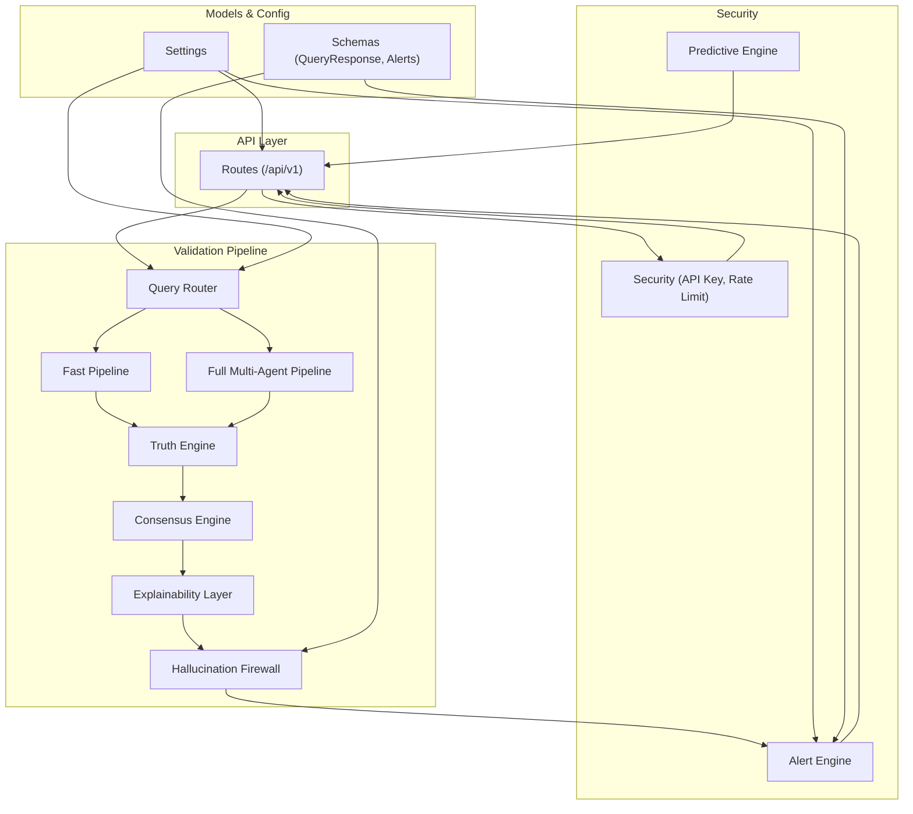
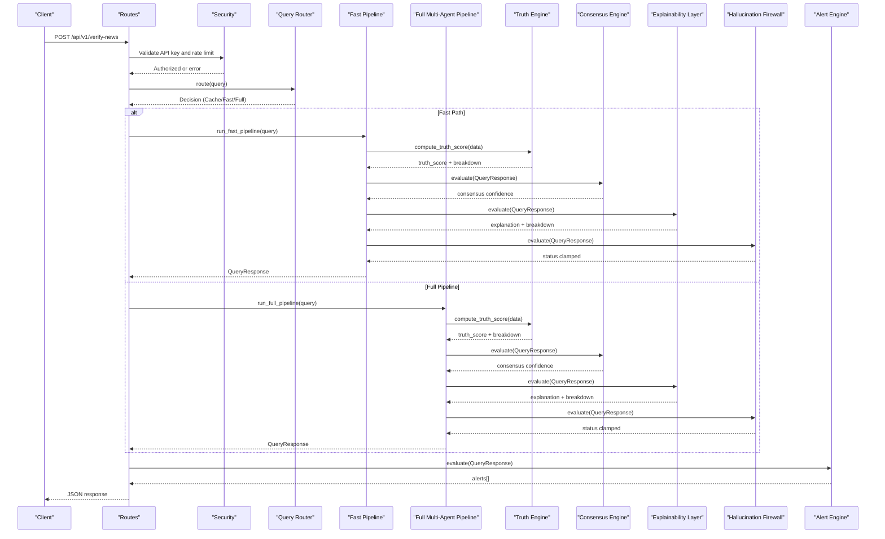
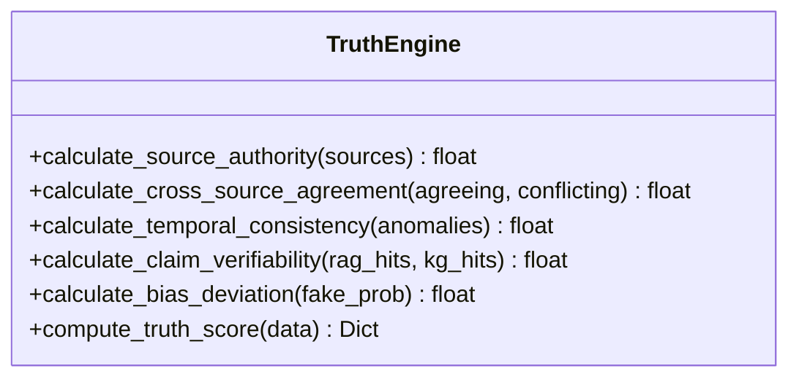
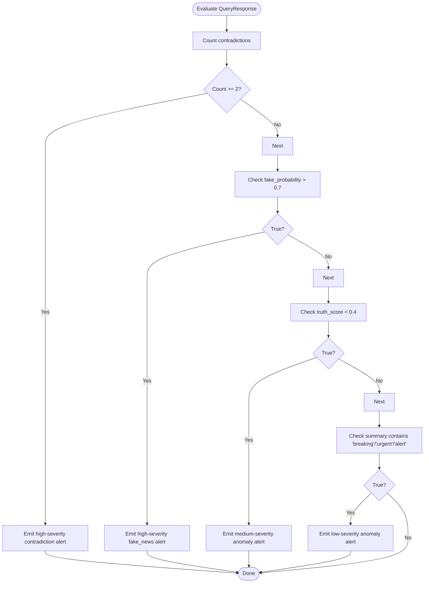
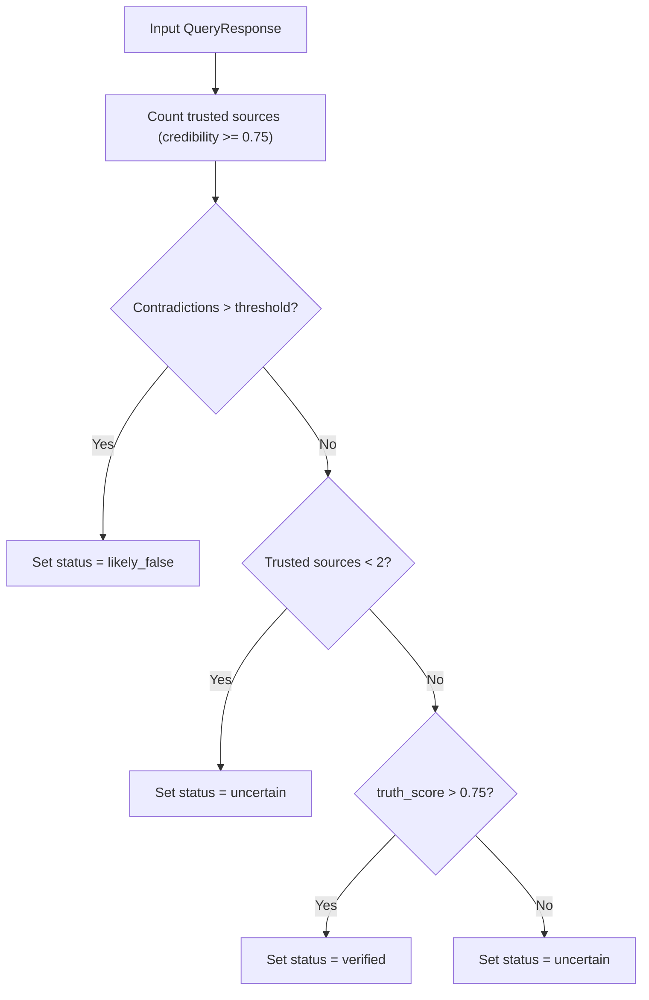
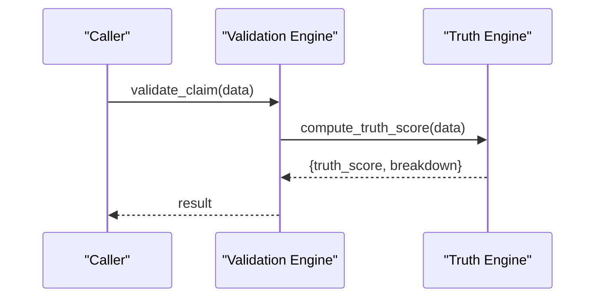
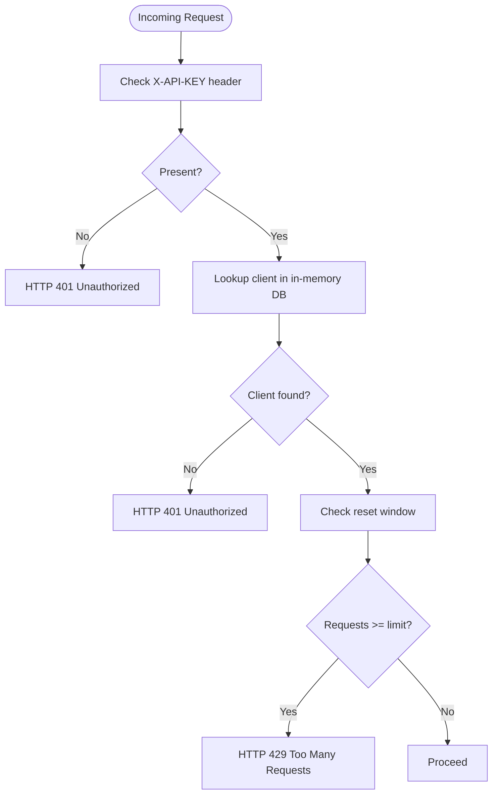
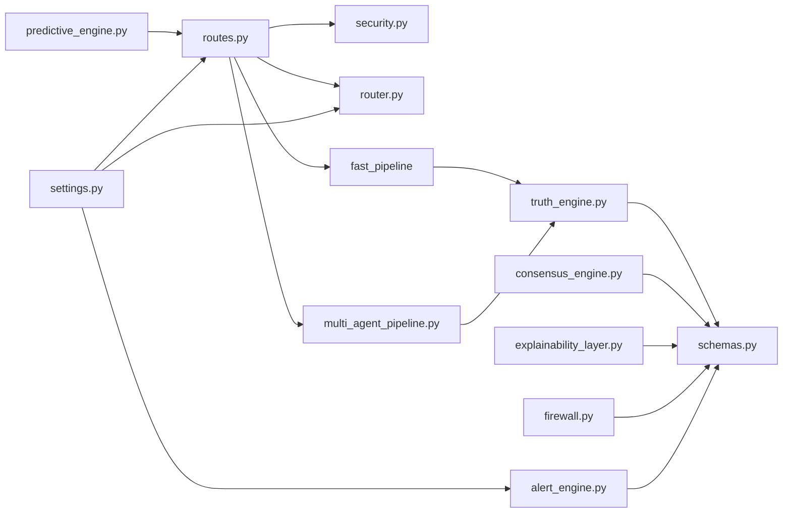
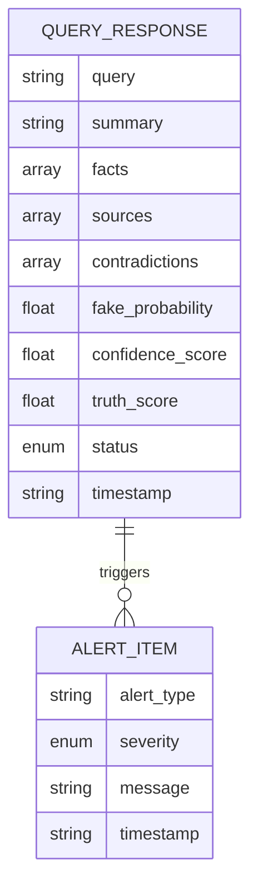

# Security Validation Protocols

<cite>
**Referenced Files in This Document**
- [validation_engine.py](file://veritas-ai/core/validation_engine.py)
- [security.py](file://veritas-ai/core/security.py)
- [firewall.py](file://veritas-ai/core/firewall.py)
- [alert_engine.py](file://veritas-ai/core/alert_engine.py)
- [validation.py](file://veritas-ai/app/agents/validation.py)
- [schemas.py](file://veritas-ai/models/schemas.py)
- [settings.py](file://veritas-ai/config/settings.py)
- [consensus_engine.py](file://veritas-ai/core/consensus_engine.py)
- [explainability_layer.py](file://veritas-ai/core/explainability_layer.py)
- [predictive_engine.py](file://veritas-ai/core/predictive_engine.py)
- [routes.py](file://veritas-ai/app/api/routes.py)
- [router.py](file://veritas-ai/core/router.py)
- [truth_engine.py](file://veritas-ai/core/truth_engine.py)
- [multi_agent_pipeline.py](file://veritas-ai/pipelines/multi_agent_pipeline.py)
</cite>

## Table of Contents
1. [Introduction](#introduction)
2. [Project Structure](#project-structure)
3. [Core Components](#core-components)
4. [Architecture Overview](#architecture-overview)
5. [Detailed Component Analysis](#detailed-component-analysis)
6. [Dependency Analysis](#dependency-analysis)
7. [Performance Considerations](#performance-considerations)
8. [Troubleshooting Guide](#troubleshooting-guide)
9. [Conclusion](#conclusion)
10. [Appendices](#appendices)

## Introduction
This document describes the Security Validation subsystem of the Veritas AI platform. It focuses on the threat assessment models, anomaly detection algorithms, and automated response systems that protect the integrity of intelligence reports. The subsystem integrates rule-based security checks, compliance monitoring, and policy enforcement to prevent hallucinations, unverified claims, and misleading outputs from reaching users. It also covers risk scoring algorithms, policy configurations, validation rules, and integration points with external security systems such as API key enforcement, rate limiting, and predictive trend monitoring.

## Project Structure
The Security Validation subsystem spans several modules:
- Core engines: Truth scoring, firewall, consensus, explainability, and predictive intelligence
- API security: Authentication, authorization, and rate limiting
- Pipelines: Fast and full multi-agent pipelines that orchestrate validation stages
- Configuration: Centralized settings for runtime behavior and limits
- Data models: Typed schemas for validation payloads and alerts

**Diagram sources**
- [routes.py:18-251](file://veritas-ai/app/api/routes.py#L18-L251)
- [security.py:1-129](file://veritas-ai/core/security.py#L1-L129)
- [router.py:83-182](file://veritas-ai/core/router.py#L83-L182)
- [multi_agent_pipeline.py:318-332](file://veritas-ai/pipelines/multi_agent_pipeline.py#L318-L332)
- [truth_engine.py:3-117](file://veritas-ai/core/truth_engine.py#L3-L117)
- [consensus_engine.py:3-26](file://veritas-ai/core/consensus_engine.py#L3-L26)
- [explainability_layer.py:4-52](file://veritas-ai/core/explainability_layer.py#L4-L52)
- [firewall.py:4-47](file://veritas-ai/core/firewall.py#L4-L47)
- [alert_engine.py:20-67](file://veritas-ai/core/alert_engine.py#L20-L67)
- [predictive_engine.py:5-63](file://veritas-ai/core/predictive_engine.py#L5-L63)
- [schemas.py:14-26](file://veritas-ai/models/schemas.py#L14-L26)
- [settings.py:13-83](file://veritas-ai/config/settings.py#L13-L83)

**Section sources**
- [routes.py:18-251](file://veritas-ai/app/api/routes.py#L18-L251)
- [security.py:1-129](file://veritas-ai/core/security.py#L1-L129)
- [router.py:83-182](file://veritas-ai/core/router.py#L83-L182)
- [multi_agent_pipeline.py:318-332](file://veritas-ai/pipelines/multi_agent_pipeline.py#L318-L332)
- [schemas.py:14-26](file://veritas-ai/models/schemas.py#L14-L26)
- [settings.py:13-83](file://veritas-ai/config/settings.py#L13-L83)

## Core Components
- Truth Engine: Computes a multi-factor truth score from source authority, cross-source agreement, temporal consistency, claim verifiability, and bias deviation.
- Consensus Engine: Merges LLM confidence, classifier confidence, and rule-based truth score into a unified confidence.
- Explainability Layer: Produces human-readable explanations and confidence breakdowns.
- Hallucination Firewall: Applies deterministic rule-based overrides to clamp statuses and block unverified claims.
- Alert Engine: Detects anomalies and emits structured alerts with severity and timestamps.
- Predictive Intelligence Engine: Monitors global query streams to identify misinformation spikes and narrative shifts.
- API Security: Enforces API key authentication, validates keys, and applies fixed-window rate limiting.
- Query Router: Classifies queries and routes to fast or full pipelines, with caching and metrics.

**Section sources**
- [truth_engine.py:3-117](file://veritas-ai/core/truth_engine.py#L3-L117)
- [consensus_engine.py:3-26](file://veritas-ai/core/consensus_engine.py#L3-L26)
- [explainability_layer.py:4-52](file://veritas-ai/core/explainability_layer.py#L4-L52)
- [firewall.py:4-47](file://veritas-ai/core/firewall.py#L4-L47)
- [alert_engine.py:20-67](file://veritas-ai/core/alert_engine.py#L20-L67)
- [predictive_engine.py:5-63](file://veritas-ai/core/predictive_engine.py#L5-L63)
- [security.py:51-129](file://veritas-ai/core/security.py#L51-L129)
- [router.py:51-182](file://veritas-ai/core/router.py#L51-L182)

## Architecture Overview
The Security Validation subsystem orchestrates a multi-stage pipeline:
- Authentication and authorization at the API boundary
- Query routing and caching
- Truth scoring and consensus computation
- Explainability and firewall enforcement
- Alert emission and predictive trend monitoring
- Audit trail via history and observability

**Diagram sources**
- [routes.py:100-129](file://veritas-ai/app/api/routes.py#L100-L129)
- [security.py:111-129](file://veritas-ai/core/security.py#L111-L129)
- [router.py:99-182](file://veritas-ai/core/router.py#L99-L182)
- [multi_agent_pipeline.py:318-332](file://veritas-ai/pipelines/multi_agent_pipeline.py#L318-L332)
- [truth_engine.py:78-117](file://veritas-ai/core/truth_engine.py#L78-L117)
- [consensus_engine.py:8-26](file://veritas-ai/core/consensus_engine.py#L8-L26)
- [explainability_layer.py:13-52](file://veritas-ai/core/explainability_layer.py#L13-L52)
- [firewall.py:13-47](file://veritas-ai/core/firewall.py#L13-L47)
- [alert_engine.py:26-67](file://veritas-ai/core/alert_engine.py#L26-L67)

## Detailed Component Analysis

### Threat Assessment Models
- Source Authority: Scores sources by domain type (.gov/.edu/.mil/.int, reputable media, social, unknown).
- Cross-Source Agreement: Ratio of agreeing to conflicting sources.
- Temporal Consistency: Penalizes sudden narrative shifts.
- Claim Verifiability: Based on RAG and KG hits.
- Bias Deviation: Inverse of fake news probability from classifiers.

**Diagram sources**
- [truth_engine.py:3-117](file://veritas-ai/core/truth_engine.py#L3-L117)

**Section sources**
- [truth_engine.py:19-117](file://veritas-ai/core/truth_engine.py#L19-L117)

### Anomaly Detection Algorithms
- Alert Engine: Detects high contradiction counts, fake news probability thresholds, low truth scores, and temporal anomaly keywords.
- Predictive Intelligence Engine: Tracks keyword topics over a sliding window and raises medium/high alerts based on hit counts.

**Diagram sources**
- [alert_engine.py:26-67](file://veritas-ai/core/alert_engine.py#L26-L67)

**Section sources**
- [alert_engine.py:26-67](file://veritas-ai/core/alert_engine.py#L26-L67)
- [predictive_engine.py:14-63](file://veritas-ai/core/predictive_engine.py#L14-L63)

### Automated Response Systems
- Hallucination Firewall: Applies deterministic overrides to clamp status based on:
  - Contradictions exceeding threshold
  - Insufficient trusted sources
  - High truth score threshold
- Alert Recording and Publishing: Stores recent alerts and publishes events to the event bus.
- API Security: Validates API keys and enforces rate limits per tier.

**Diagram sources**
- [firewall.py:13-47](file://veritas-ai/core/firewall.py#L13-L47)

**Section sources**
- [firewall.py:13-47](file://veritas-ai/core/firewall.py#L13-L47)
- [alert_engine.py:12-19](file://veritas-ai/core/alert_engine.py#L12-L19)
- [security.py:51-129](file://veritas-ai/core/security.py#L51-L129)

### Validation Engine and Rule-Based Checks
- Async validation wrapper delegates to TruthEngine and returns a standardized structure.
- Rule-based checks are embedded in the validation agent:
  - Truth scoring with weights
  - Firewall overrides
  - Consensus merging
  - Explanations with confidence breakdowns

**Diagram sources**
- [validation_engine.py:9-18](file://veritas-ai/core/validation_engine.py#L9-L18)
- [truth_engine.py:78-117](file://veritas-ai/core/truth_engine.py#L78-L117)

**Section sources**
- [validation_engine.py:9-18](file://veritas-ai/core/validation_engine.py#L9-L18)
- [validation.py:92-127](file://veritas-ai/app/agents/validation.py#L92-L127)
- [validation.py:161-199](file://veritas-ai/app/agents/validation.py#L161-L199)
- [validation.py:203-213](file://veritas-ai/app/agents/validation.py#L203-L213)
- [validation.py:217-274](file://veritas-ai/app/agents/validation.py#L217-L274)

### Compliance Monitoring and Policy Enforcement
- API Key Enforcement: Validates presence and correctness of X-API-KEY header.
- Rate Limiting: Fixed-window per-tier limits with reset intervals.
- Policy Configuration: Controlled via environment variables in settings (e.g., tiers, limits, reset windows).

**Diagram sources**
- [security.py:51-129](file://veritas-ai/core/security.py#L51-L129)

**Section sources**
- [security.py:51-129](file://veritas-ai/core/security.py#L51-L129)
- [settings.py:16-40](file://veritas-ai/config/settings.py#L16-L40)

### Risk Scoring and Security Policy Configurations
- Risk scoring combines:
  - Source authority thresholds
  - Cross-source agreement ratios
  - Temporal consistency penalties
  - Verifiability from RAG/KG
  - Bias deviation from fake news probability
- Policies:
  - Firewall thresholds (trusted source minimum, contradiction threshold)
  - Alert thresholds (fake probability, truth score, contradiction counts)
  - Predictive thresholds (keyword hit counts)

**Section sources**
- [validation.py:10-16](file://veritas-ai/app/agents/validation.py#L10-L16)
- [validation.py:161-199](file://veritas-ai/app/agents/validation.py#L161-L199)
- [alert_engine.py:29-64](file://veritas-ai/core/alert_engine.py#L29-L64)
- [predictive_engine.py:43-59](file://veritas-ai/core/predictive_engine.py#L43-L59)

### Examples of Validation Rules and Custom Policy Creation
- Validation rules:
  - Trusted source cluster threshold: minimum number of high-credibility sources
  - Contradiction threshold: maximum allowed contradictions before clamping to false
  - Truth score threshold: minimum score to mark as verified
- Custom policy creation:
  - Adjust firewall thresholds and weights in the validation agent
  - Tune alert thresholds in the alert engine
  - Modify predictive thresholds in the predictive engine
  - Configure API tiers and limits via environment variables

**Section sources**
- [validation.py:161-199](file://veritas-ai/app/agents/validation.py#L161-L199)
- [alert_engine.py:29-64](file://veritas-ai/core/alert_engine.py#L29-L64)
- [predictive_engine.py:43-59](file://veritas-ai/core/predictive_engine.py#L43-L59)
- [settings.py:16-40](file://veritas-ai/config/settings.py#L16-L40)

### Integration with External Security Systems
- API Security integrates with FastAPI’s security utilities and enforces API key policies.
- Predictive Intelligence Engine can be extended to integrate with external telemetry or SIEM systems by publishing alerts to an event bus or webhook.
- Audit trail generation:
  - History logging via the history store
  - Observability logging for truth scores and breakdowns

**Section sources**
- [security.py:8-14](file://veritas-ai/core/security.py#L8-L14)
- [multi_agent_pipeline.py:324-332](file://veritas-ai/pipelines/multi_agent_pipeline.py#L324-L332)
- [validation.py:117-123](file://veritas-ai/app/agents/validation.py#L117-L123)

### Automated Response Workflows and Incident Containment
- Workflow:
  - Validation pipeline produces a validated response with status and explanation
  - Alert engine evaluates anomalies and records them
  - Event bus publishes alerts for downstream systems
- Containment:
  - Firewall clamps status to reduce propagation of unverified claims
  - Rate limiting prevents abuse and protects resources

**Section sources**
- [multi_agent_pipeline.py:318-332](file://veritas-ai/pipelines/multi_agent_pipeline.py#L318-L332)
- [firewall.py:13-47](file://veritas-ai/core/firewall.py#L13-L47)
- [alert_engine.py:12-19](file://veritas-ai/core/alert_engine.py#L12-L19)

### Security Audit Trail Generation
- Query responses include timestamps and status for traceability.
- History entries capture query, status, and truth score.
- Observability logs truth scores and breakdowns for auditing.

**Section sources**
- [schemas.py:14-26](file://veritas-ai/models/schemas.py#L14-L26)
- [validation.py:117-123](file://veritas-ai/app/agents/validation.py#L117-L123)

## Dependency Analysis
The subsystem exhibits clear separation of concerns:
- API routes depend on security, router, and pipelines
- Validation agents depend on engines and schemas
- Engines depend on schemas and configuration
- Predictive and alert engines are standalone but integrated via API endpoints

**Diagram sources**
- [routes.py:18-251](file://veritas-ai/app/api/routes.py#L18-L251)
- [security.py:51-129](file://veritas-ai/core/security.py#L51-L129)
- [router.py:83-182](file://veritas-ai/core/router.py#L83-L182)
- [multi_agent_pipeline.py:318-332](file://veritas-ai/pipelines/multi_agent_pipeline.py#L318-L332)
- [truth_engine.py:78-117](file://veritas-ai/core/truth_engine.py#L78-L117)
- [consensus_engine.py:8-26](file://veritas-ai/core/consensus_engine.py#L8-L26)
- [explainability_layer.py:13-52](file://veritas-ai/core/explainability_layer.py#L13-L52)
- [firewall.py:13-47](file://veritas-ai/core/firewall.py#L13-L47)
- [alert_engine.py:26-67](file://veritas-ai/core/alert_engine.py#L26-L67)
- [predictive_engine.py:33-63](file://veritas-ai/core/predictive_engine.py#L33-L63)
- [schemas.py:14-26](file://veritas-ai/models/schemas.py#L14-L26)
- [settings.py:13-83](file://veritas-ai/config/settings.py#L13-L83)

**Section sources**
- [routes.py:18-251](file://veritas-ai/app/api/routes.py#L18-L251)
- [schemas.py:14-26](file://veritas-ai/models/schemas.py#L14-L26)
- [settings.py:13-83](file://veritas-ai/config/settings.py#L13-L83)

## Performance Considerations
- Asynchronous execution: Validation delegates CPU-bound scoring to thread pools to avoid blocking the event loop.
- Caching: Local and Redis caching reduces repeated computations for identical queries.
- Query routing: Classifiers quickly select fast or full pipelines based on query characteristics.
- Metrics: Router tracks latency for each route to optimize selection.

Recommendations:
- Tune cache TTL and max entries via settings
- Monitor hit rates and adjust retrieval K and parallelism
- Use rate limiting to protect downstream systems during spikes

**Section sources**
- [validation_engine.py:9-18](file://veritas-ai/core/validation_engine.py#L9-L18)
- [router.py:99-182](file://veritas-ai/core/router.py#L99-L182)
- [settings.py:21-29](file://veritas-ai/config/settings.py#L21-L29)

## Troubleshooting Guide
Common issues and resolutions:
- Missing or invalid API key: Ensure X-API-KEY header is present and matches configured keys; check tier limits and reset windows.
- Rate limit exceeded: Verify tier-specific limits and reset intervals; consider upgrading tier for higher quotas.
- Unexpected status after firewall: Review trusted source credibility thresholds and contradiction counts.
- Alerts not appearing: Confirm alert thresholds and that the alert engine is invoked in the pipeline.
- Predictive trends not triggering: Adjust keyword hit thresholds or review ingestion logic.

Operational checks:
- Health endpoint provides cache statistics and availability
- Metrics endpoint exposes cache stats and version info
- History endpoint retrieves recent queries for auditing

**Section sources**
- [security.py:51-129](file://veritas-ai/core/security.py#L51-L129)
- [firewall.py:13-47](file://veritas-ai/core/firewall.py#L13-L47)
- [alert_engine.py:26-67](file://veritas-ai/core/alert_engine.py#L26-L67)
- [predictive_engine.py:33-63](file://veritas-ai/core/predictive_engine.py#L33-L63)
- [routes.py:86-98](file://veritas-ai/app/api/routes.py#L86-L98)
- [routes.py:236-244](file://veritas-ai/app/api/routes.py#L236-L244)
- [routes.py:147-160](file://veritas-ai/app/api/routes.py#L147-L160)

## Conclusion
The Security Validation subsystem provides a robust framework for ensuring the integrity of intelligence reports. It combines rule-based validation, anomaly detection, and predictive trend monitoring with strong API security and policy enforcement. The modular design enables customization of thresholds and integration with external systems, while performance optimizations maintain responsiveness under load.

## Appendices

### Data Model: QueryResponse and Alerts

**Diagram sources**
- [schemas.py:14-26](file://veritas-ai/models/schemas.py#L14-L26)
- [schemas.py:40-45](file://veritas-ai/models/schemas.py#L40-L45)