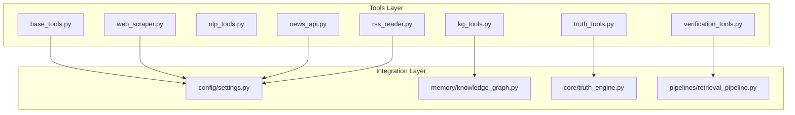
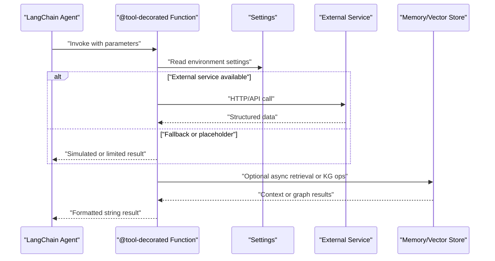
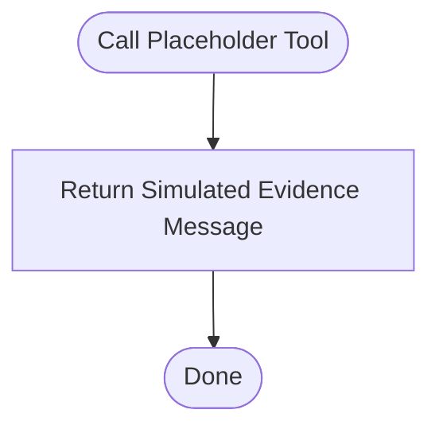
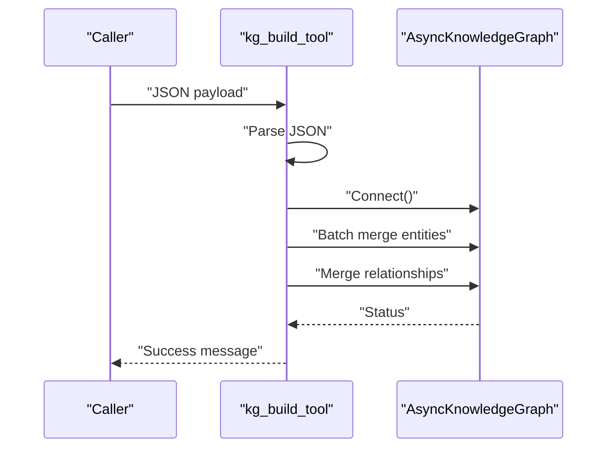
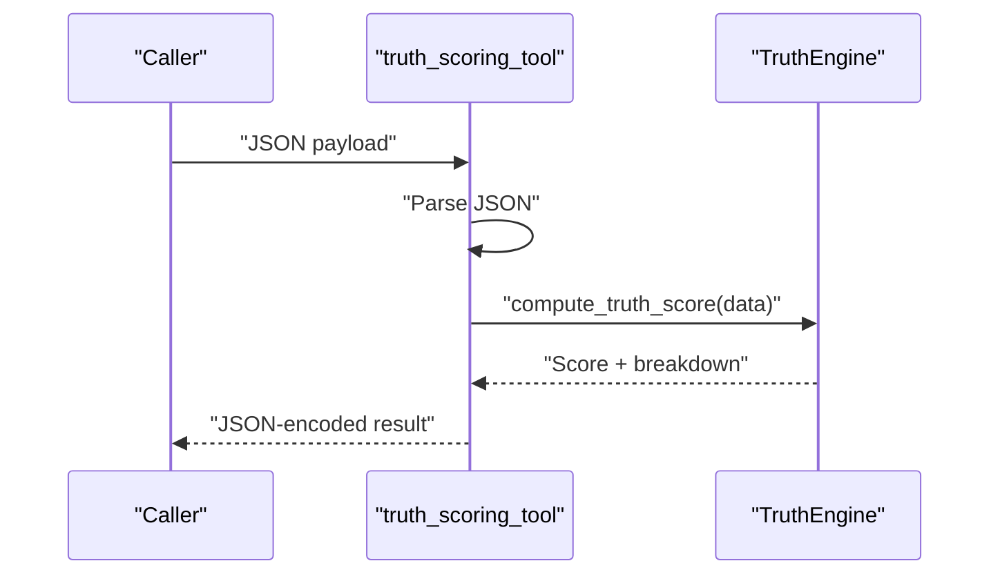
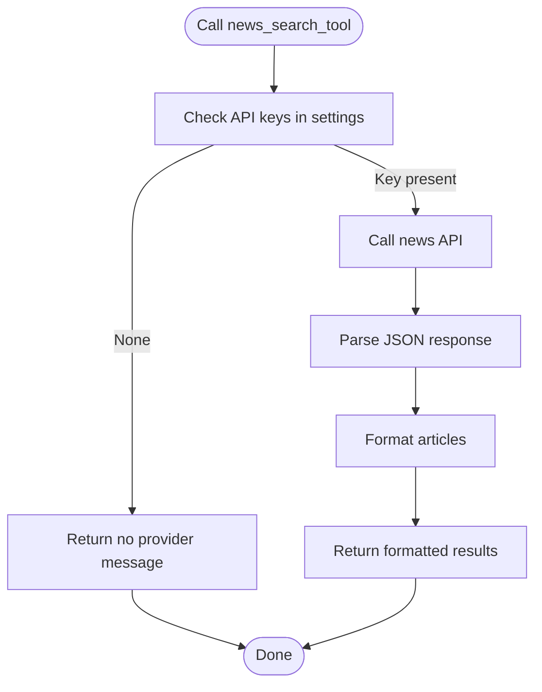
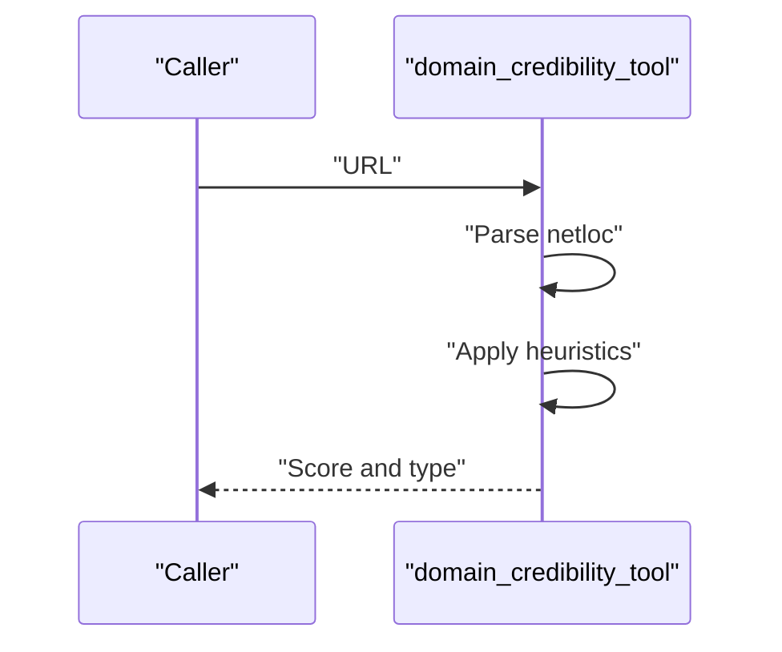
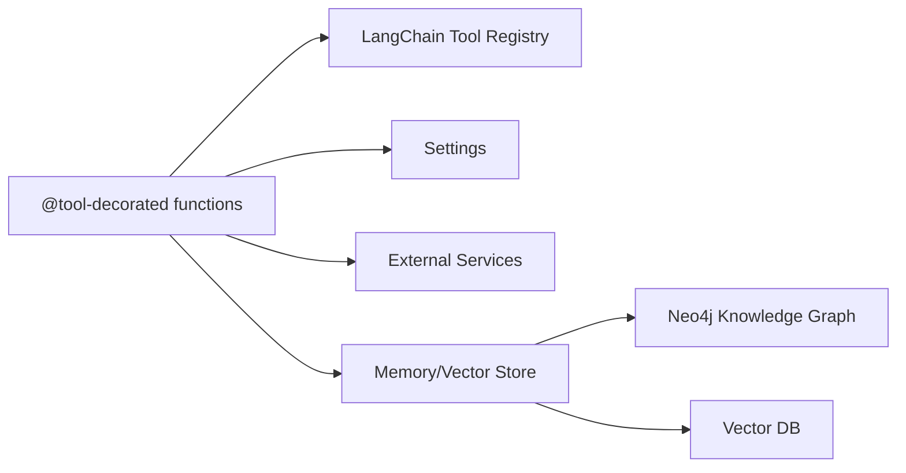

# Base Tools Framework

<cite>
**Referenced Files in This Document**
- [base_tools.py](file://veritas-ai/tools/base_tools.py)
- [kg_tools.py](file://veritas-ai/tools/kg_tools.py)
- [nlp_tools.py](file://veritas-ai/tools/nlp_tools.py)
- [truth_tools.py](file://veritas-ai/tools/truth_tools.py)
- [news_api.py](file://veritas-ai/tools/news_api.py)
- [rss_reader.py](file://veritas-ai/tools/rss_reader.py)
- [verification_tools.py](file://veritas-ai/tools/verification_tools.py)
- [web_scraper.py](file://veritas-ai/tools/web_scraper.py)
- [settings.py](file://veritas-ai/config/settings.py)
- [knowledge_graph.py](file://veritas-ai/memory/knowledge_graph.py)
- [truth_engine.py](file://veritas-ai/core/truth_engine.py)
- [retrieval_pipeline.py](file://veritas-ai/pipelines/retrieval_pipeline.py)
</cite>

## Table of Contents
1. [Introduction](#introduction)
2. [Project Structure](#project-structure)
3. [Core Components](#core-components)
4. [Architecture Overview](#architecture-overview)
5. [Detailed Component Analysis](#detailed-component-analysis)
6. [Dependency Analysis](#dependency-analysis)
7. [Performance Considerations](#performance-considerations)
8. [Troubleshooting Guide](#troubleshooting-guide)
9. [Conclusion](#conclusion)
10. [Appendices](#appendices)

## Introduction
This document describes the Base Tools Framework that powers the foundational tool architecture and development patterns used across the Veritas AI project. It focuses on the @tool decorator pattern, tool registration mechanisms, parameter validation systems, the tool execution lifecycle, error handling patterns, and return value formatting. It also covers placeholder tooling, migration strategies to replace simulated tools with real implementations, and dynamic tool integration patterns compatible with the LangChain ecosystem.

## Project Structure
The Base Tools Framework resides under the tools module and integrates with configuration, memory, and pipeline layers. The tools are decorated with @tool from LangChain to expose them as callable tools. Supporting modules include configuration settings, a knowledge graph abstraction, a truth scoring engine, and a retrieval pipeline for RAG-based fact-checking.

**Diagram sources**
- [base_tools.py:1-10](file://veritas-ai/tools/base_tools.py#L1-L10)
- [kg_tools.py:1-50](file://veritas-ai/tools/kg_tools.py#L1-L50)
- [nlp_tools.py:1-52](file://veritas-ai/tools/nlp_tools.py#L1-L52)
- [truth_tools.py:1-29](file://veritas-ai/tools/truth_tools.py#L1-L29)
- [news_api.py:1-48](file://veritas-ai/tools/news_api.py#L1-L48)
- [rss_reader.py:1-26](file://veritas-ai/tools/rss_reader.py#L1-L26)
- [verification_tools.py:1-52](file://veritas-ai/tools/verification_tools.py#L1-L52)
- [web_scraper.py:1-35](file://veritas-ai/tools/web_scraper.py#L1-L35)
- [settings.py:1-83](file://veritas-ai/config/settings.py#L1-L83)
- [knowledge_graph.py:1-160](file://veritas-ai/memory/knowledge_graph.py#L1-L160)
- [truth_engine.py:1-117](file://veritas-ai/core/truth_engine.py#L1-L117)
- [retrieval_pipeline.py:1-112](file://veritas-ai/pipelines/retrieval_pipeline.py#L1-L112)

**Section sources**
- [base_tools.py:1-10](file://veritas-ai/tools/base_tools.py#L1-L10)
- [settings.py:1-83](file://veritas-ai/config/settings.py#L1-L83)

## Core Components
- @tool decorator pattern: All tools are decorated with @tool from LangChain, enabling automatic registration and exposure as runnable tools. Decorated functions define tool names and signatures that LangChain consumes during agent orchestration.
- Tool registration mechanisms: Decorated functions become part of the LangChain tool registry automatically when imported. There is no explicit manual registration call in the provided files.
- Parameter validation systems: Validation occurs primarily through:
  - JSON parsing for structured inputs (kg_tools, truth_tools).
  - Type hints and docstring constraints (e.g., typed parameters and expected JSON shapes).
  - URL parsing and domain heuristics (verification_tools).
  - Environment-driven availability checks (news_api).
- Execution lifecycle: Tools accept parameters, perform work (HTTP calls, async operations, local computations), and return string-formatted results. Asynchronous tools leverage async/await and event loops where appropriate.
- Error handling patterns: Centralized try/except blocks catch exceptions and return informative messages. Some tools log warnings or errors internally. JSON parsing failures are handled explicitly.
- Return value formatting: Results are returned as strings. Formatters are used to structure lists and summaries (e.g., article formatting, relationship mapping, classification outputs).

**Section sources**
- [base_tools.py:1-10](file://veritas-ai/tools/base_tools.py#L1-L10)
- [kg_tools.py:1-50](file://veritas-ai/tools/kg_tools.py#L1-L50)
- [truth_tools.py:1-29](file://veritas-ai/tools/truth_tools.py#L1-L29)
- [verification_tools.py:1-52](file://veritas-ai/tools/verification_tools.py#L1-L52)
- [news_api.py:1-48](file://veritas-ai/tools/news_api.py#L1-L48)
- [rss_reader.py:1-26](file://veritas-ai/tools/rss_reader.py#L1-L26)
- [web_scraper.py:1-35](file://veritas-ai/tools/web_scraper.py#L1-L35)
- [nlp_tools.py:1-52](file://veritas-ai/tools/nlp_tools.py#L1-L52)

## Architecture Overview
The Base Tools Framework leverages LangChain’s @tool decorator to register tools. Tools integrate with configuration (environment variables), external services (Neo4j, news APIs, RSS), and internal systems (RAG retrieval, truth engine). Asynchronous tools use async/await and event loops to avoid blocking. Error handling is defensive, returning user-friendly messages when external services are unavailable or inputs are invalid.

**Diagram sources**
- [news_api.py:1-48](file://veritas-ai/tools/news_api.py#L1-L48)
- [verification_tools.py:1-52](file://veritas-ai/tools/verification_tools.py#L1-L52)
- [retrieval_pipeline.py:1-112](file://veritas-ai/pipelines/retrieval_pipeline.py#L1-L112)
- [settings.py:1-83](file://veritas-ai/config/settings.py#L1-L83)

## Detailed Component Analysis

### Placeholder Tool System
- Purpose: Provides a simulated tool to stand in for future implementations during early development phases.
- Behavior: Returns a deterministic message indicating simulated evidence extraction.
- Migration path: Replace the placeholder with a real implementation (e.g., integrate a news API or web scraper) while preserving the same signature and return format.

**Diagram sources**
- [base_tools.py:1-10](file://veritas-ai/tools/base_tools.py#L1-L10)

**Section sources**
- [base_tools.py:1-10](file://veritas-ai/tools/base_tools.py#L1-L10)

### Knowledge Graph Tools
- kg_build_tool: Accepts a JSON payload describing entities and relationships, parses it, connects to the async knowledge graph, merges entities and relationships, and returns a status message. Includes JSON parsing and general exception handling.
- kg_validate_tool: Connects to the knowledge graph and queries relationships for a given entity, returning a formatted string of relationships.

**Diagram sources**
- [kg_tools.py:1-50](file://veritas-ai/tools/kg_tools.py#L1-L50)
- [knowledge_graph.py:1-160](file://veritas-ai/memory/knowledge_graph.py#L1-L160)

**Section sources**
- [kg_tools.py:1-50](file://veritas-ai/tools/kg_tools.py#L1-L50)
- [knowledge_graph.py:1-160](file://veritas-ai/memory/knowledge_graph.py#L1-L160)

### Truth Scoring Engine Tool
- truth_scoring_tool: Validates JSON input, constructs a TruthEngine, computes a truth score, and returns a JSON-encoded result. Includes JSON parsing and general exception handling.

**Diagram sources**
- [truth_tools.py:1-29](file://veritas-ai/tools/truth_tools.py#L1-L29)
- [truth_engine.py:1-117](file://veritas-ai/core/truth_engine.py#L1-L117)

**Section sources**
- [truth_tools.py:1-29](file://veritas-ai/tools/truth_tools.py#L1-L29)
- [truth_engine.py:1-117](file://veritas-ai/core/truth_engine.py#L1-L117)

### News Search Tool
- news_search_tool: Selectively uses configured news APIs (GNews or NewsAPI) to fetch recent articles, formats them, and returns a string. Falls back gracefully when no provider is configured.

**Diagram sources**
- [news_api.py:1-48](file://veritas-ai/tools/news_api.py#L1-L48)
- [settings.py:60-63](file://veritas-ai/config/settings.py#L60-L63)

**Section sources**
- [news_api.py:1-48](file://veritas-ai/tools/news_api.py#L1-L48)
- [settings.py:60-63](file://veritas-ai/config/settings.py#L60-L63)

### RSS Reader Tool
- rss_reader_tool: Parses an RSS feed, extracts top entries, and returns a formatted string. Handles malformed feeds and missing entries gracefully.

**Section sources**
- [rss_reader.py:1-26](file://veritas-ai/tools/rss_reader.py#L1-L26)

### Domain Credibility and RAG Fact Check Tools
- domain_credibility_tool: Evaluates a URL’s domain type and returns a score and category using heuristics.
- rag_fact_check_tool: Retrieves relevant context asynchronously from a vector database and compiles evidence with relevance scores.

**Diagram sources**
- [verification_tools.py:1-52](file://veritas-ai/tools/verification_tools.py#L1-L52)

**Section sources**
- [verification_tools.py:1-52](file://veritas-ai/tools/verification_tools.py#L1-L52)
- [retrieval_pipeline.py:1-112](file://veritas-ai/pipelines/retrieval_pipeline.py#L1-L112)

### Web Scraper Tool
- web_scrape_tool: Uses Playwright to navigate a URL, extract main content, clean and truncate it, and return a string. Includes robust exception handling and resource cleanup.

**Section sources**
- [web_scraper.py:1-35](file://veritas-ai/tools/web_scraper.py#L1-L35)

### NLP Fake News Detector Tool
- fake_news_detector_tool: Lazily loads a transformer-based classifier, truncates input to fit token limits, performs classification, and returns formatted predictions. Handles missing dependencies and errors gracefully.

**Section sources**
- [nlp_tools.py:1-52](file://veritas-ai/tools/nlp_tools.py#L1-L52)

## Dependency Analysis
- LangChain integration: All tools rely on the @tool decorator to register themselves with LangChain’s tooling.
- Configuration dependencies: Tools read environment variables from settings for API keys, timeouts, and feature toggles.
- Memory and retrieval: Knowledge graph tools depend on AsyncKnowledgeGraph; RAG-based tools depend on retrieval_pipeline and vector stores.
- External services: News and RSS tools depend on external APIs; web scraping depends on Playwright.

**Diagram sources**
- [settings.py:1-83](file://veritas-ai/config/settings.py#L1-L83)
- [kg_tools.py:1-50](file://veritas-ai/tools/kg_tools.py#L1-L50)
- [news_api.py:1-48](file://veritas-ai/tools/news_api.py#L1-L48)
- [rss_reader.py:1-26](file://veritas-ai/tools/rss_reader.py#L1-L26)
- [web_scraper.py:1-35](file://veritas-ai/tools/web_scraper.py#L1-L35)
- [retrieval_pipeline.py:1-112](file://veritas-ai/pipelines/retrieval_pipeline.py#L1-L112)
- [knowledge_graph.py:1-160](file://veritas-ai/memory/knowledge_graph.py#L1-L160)

**Section sources**
- [settings.py:1-83](file://veritas-ai/config/settings.py#L1-L83)
- [kg_tools.py:1-50](file://veritas-ai/tools/kg_tools.py#L1-L50)
- [news_api.py:1-48](file://veritas-ai/tools/news_api.py#L1-L48)
- [rss_reader.py:1-26](file://veritas-ai/tools/rss_reader.py#L1-L26)
- [web_scraper.py:1-35](file://veritas-ai/tools/web_scraper.py#L1-L35)
- [retrieval_pipeline.py:1-112](file://veritas-ai/pipelines/retrieval_pipeline.py#L1-L112)
- [knowledge_graph.py:1-160](file://veritas-ai/memory/knowledge_graph.py#L1-L160)

## Performance Considerations
- Asynchronous operations: Use async/await for I/O-bound tasks (e.g., knowledge graph operations, retrieval pipeline) to avoid blocking.
- Event loop bridging: Use run_in_executor for synchronous operations within async contexts to prevent thread contention.
- Caching: Leverage vector cache for retrieval pipeline results to reduce repeated computations.
- Concurrency limits: Respect environment-configured limits for parallelism to balance throughput and stability.
- Resource cleanup: Ensure browser instances and external connections are closed in finally blocks to prevent leaks.

[No sources needed since this section provides general guidance]

## Troubleshooting Guide
- Missing dependencies: If optional libraries are unavailable, tools return informative fallback messages. Install required packages to enable full functionality.
- API key misconfiguration: When news APIs are not configured, tools return a message indicating no providers are available. Set the appropriate environment variables.
- JSON parsing errors: Tools that expect structured inputs handle JSON decode errors and return descriptive messages.
- Network timeouts and errors: HTTP-based tools catch exceptions and return error messages with context.
- Knowledge graph connectivity: If the graph is offline, tools return offline messages and log errors.

**Section sources**
- [nlp_tools.py:1-52](file://veritas-ai/tools/nlp_tools.py#L1-L52)
- [news_api.py:1-48](file://veritas-ai/tools/news_api.py#L1-L48)
- [kg_tools.py:1-50](file://veritas-ai/tools/kg_tools.py#L1-L50)
- [knowledge_graph.py:1-160](file://veritas-ai/memory/knowledge_graph.py#L1-L160)

## Conclusion
The Base Tools Framework demonstrates a clean, extensible architecture built around the @tool decorator and LangChain integration. It emphasizes robust error handling, structured parameter validation, asynchronous execution patterns, and graceful fallbacks. The framework supports migration from placeholder tools to production-grade implementations while maintaining consistent interfaces and return formats.

[No sources needed since this section summarizes without analyzing specific files]

## Appendices

### Creating Custom Tools
- Define a function decorated with @tool and include a descriptive tool name.
- Accept parameters with type hints and document expected input formats.
- Validate inputs (e.g., JSON parsing, URL parsing).
- Perform work synchronously or asynchronously as appropriate.
- Return a string-formatted result suitable for downstream processing.

**Section sources**
- [base_tools.py:1-10](file://veritas-ai/tools/base_tools.py#L1-L10)
- [kg_tools.py:1-50](file://veritas-ai/tools/kg_tools.py#L1-L50)
- [truth_tools.py:1-29](file://veritas-ai/tools/truth_tools.py#L1-L29)
- [verification_tools.py:1-52](file://veritas-ai/tools/verification_tools.py#L1-L52)
- [news_api.py:1-48](file://veritas-ai/tools/news_api.py#L1-L48)
- [rss_reader.py:1-26](file://veritas-ai/tools/rss_reader.py#L1-L26)
- [web_scraper.py:1-35](file://veritas-ai/tools/web_scraper.py#L1-L35)
- [nlp_tools.py:1-52](file://veritas-ai/tools/nlp_tools.py#L1-L52)

### Extending the Framework
- Add new tools under the tools module following the existing patterns.
- Integrate with configuration via settings for environment-specific behavior.
- Use retrieval_pipeline for RAG-based operations and knowledge_graph for graph operations.
- Wrap synchronous operations in run_in_executor when called from async contexts.

**Section sources**
- [settings.py:1-83](file://veritas-ai/config/settings.py#L1-L83)
- [retrieval_pipeline.py:1-112](file://veritas-ai/pipelines/retrieval_pipeline.py#L1-L112)
- [knowledge_graph.py:1-160](file://veritas-ai/memory/knowledge_graph.py#L1-L160)

### Integrating with LangChain
- Import @tool from langchain.tools and decorate functions to register them automatically.
- Ensure tools are imported before agent execution so they appear in the tool registry.
- Maintain consistent parameter names and return types to align with agent expectations.

**Section sources**
- [base_tools.py:1-10](file://veritas-ai/tools/base_tools.py#L1-L10)
- [kg_tools.py:1-50](file://veritas-ai/tools/kg_tools.py#L1-L50)
- [truth_tools.py:1-29](file://veritas-ai/tools/truth_tools.py#L1-L29)
- [verification_tools.py:1-52](file://veritas-ai/tools/verification_tools.py#L1-L52)
- [news_api.py:1-48](file://veritas-ai/tools/news_api.py#L1-L48)
- [rss_reader.py:1-26](file://veritas-ai/tools/rss_reader.py#L1-L26)
- [web_scraper.py:1-35](file://veritas-ai/tools/web_scraper.py#L1-L35)
- [nlp_tools.py:1-52](file://veritas-ai/tools/nlp_tools.py#L1-L52)

### Placeholder Migration Patterns
- Replace placeholder implementations with real integrations (e.g., news APIs, web scrapers).
- Preserve the same function signature and return type to maintain compatibility.
- Use environment flags to toggle between placeholder and real implementations during development.

**Section sources**
- [base_tools.py:1-10](file://veritas-ai/tools/base_tools.py#L1-L10)
- [news_api.py:1-48](file://veritas-ai/tools/news_api.py#L1-L48)
- [web_scraper.py:1-35](file://veritas-ai/tools/web_scraper.py#L1-L35)