# Knowledge Graph Tools

<cite>
**Referenced Files in This Document**
- [kg_tools.py](file://veritas-ai/tools/kg_tools.py)
- [knowledge_graph.py](file://veritas-ai/memory/knowledge_graph.py)
- [settings.py](file://veritas-ai/config/settings.py)
- [multi_agent_pipeline.py](file://veritas-ai/pipelines/multi_agent_pipeline.py)
- [validation.py](file://veritas-ai/app/agents/validation.py)
- [schemas.py](file://veritas-ai/models/schemas.py)
- [vector_store.py](file://veritas-ai/memory/vector_store.py)
- [deep_pipeline.py](file://veritas-ai/pipelines/deep_pipeline.py)
- [fast_pipeline.py](file://veritas-ai/pipelines/fast_pipeline.py)
- [veritas_agents.py](file://veritas-ai/agents/veritas_agents.py)
- [base_tools.py](file://veritas-ai/tools/base_tools.py)
</cite>

## Table of Contents
1. [Introduction](#introduction)
2. [Project Structure](#project-structure)
3. [Core Components](#core-components)
4. [Architecture Overview](#architecture-overview)
5. [Detailed Component Analysis](#detailed-component-analysis)
6. [Dependency Analysis](#dependency-analysis)
7. [Performance Considerations](#performance-considerations)
8. [Troubleshooting Guide](#troubleshooting-guide)
9. [Conclusion](#conclusion)
10. [Appendices](#appendices)

## Introduction
This document describes the Knowledge Graph Tools within the Veritas AI system, focusing on entity linking, relationship extraction, and semantic graph construction. It explains entity disambiguation and resolution workflows, confidence scoring, cross-referencing against the knowledge graph, integration with external knowledge bases, and graph querying patterns. It also covers configuration options for different knowledge sources, performance optimization for large-scale graphs, and maintenance procedures for knowledge base updates.

## Project Structure
The Knowledge Graph Tools reside primarily under the tools and memory modules, with orchestration handled by the multi-agent pipelines and validation agents. Configuration for Neo4j connectivity and other runtime settings is centralized in settings.

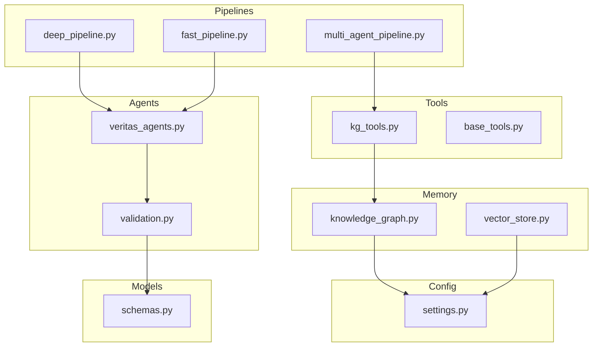

**Diagram sources**
- [kg_tools.py:1-50](file://veritas-ai/tools/kg_tools.py#L1-L50)
- [knowledge_graph.py:1-160](file://veritas-ai/memory/knowledge_graph.py#L1-L160)
- [settings.py:1-83](file://veritas-ai/config/settings.py#L1-L83)
- [multi_agent_pipeline.py:1-379](file://veritas-ai/pipelines/multi_agent_pipeline.py#L1-L379)
- [validation.py:1-314](file://veritas-ai/app/agents/validation.py#L1-L314)
- [schemas.py:1-88](file://veritas-ai/models/schemas.py#L1-L88)
- [vector_store.py:1-27](file://veritas-ai/memory/vector_store.py#L1-L27)
- [deep_pipeline.py:1-17](file://veritas-ai/pipelines/deep_pipeline.py#L1-L17)
- [fast_pipeline.py:1-22](file://veritas-ai/pipelines/fast_pipeline.py#L1-L22)
- [veritas_agents.py:1-44](file://veritas-ai/agents/veritas_agents.py#L1-L44)
- [base_tools.py:1-10](file://veritas-ai/tools/base_tools.py#L1-L10)

**Section sources**
- [kg_tools.py:1-50](file://veritas-ai/tools/kg_tools.py#L1-L50)
- [knowledge_graph.py:1-160](file://veritas-ai/memory/knowledge_graph.py#L1-L160)
- [settings.py:1-83](file://veritas-ai/config/settings.py#L1-L83)
- [multi_agent_pipeline.py:1-379](file://veritas-ai/pipelines/multi_agent_pipeline.py#L1-L379)
- [validation.py:1-314](file://veritas-ai/app/agents/validation.py#L1-L314)
- [schemas.py:1-88](file://veritas-ai/models/schemas.py#L1-L88)
- [vector_store.py:1-27](file://veritas-ai/memory/vector_store.py#L1-L27)
- [deep_pipeline.py:1-17](file://veritas-ai/pipelines/deep_pipeline.py#L1-L17)
- [fast_pipeline.py:1-22](file://veritas-ai/pipelines/fast_pipeline.py#L1-L22)
- [veritas_agents.py:1-44](file://veritas-ai/agents/veritas_agents.py#L1-L44)
- [base_tools.py:1-10](file://veritas-ai/tools/base_tools.py#L1-L10)

## Core Components
- Knowledge Graph Entity Builder Tool: Accepts JSON with entities and relationships, connects to the AsyncKnowledgeGraph, performs batch entity merges, and merges each relationship.
- Knowledge Graph Validator Tool: Connects to the AsyncKnowledgeGraph and returns a string summary of relationships for a given entity.
- AsyncKnowledgeGraph: Manages Neo4j connectivity, enforces allowed labels and relationships, supports batch entity merging, and relationship creation and querying.
- Multi-Agent Pipeline: Orchestrates research, parallel validation, and response building; integrates the KG validator tool.
- Validation Agent: Computes truth score, applies firewall and consensus logic, and generates explanations.
- Vector Store: Provides local Chroma-backed vector storage with Ollama embeddings.
- Pipelines (Fast/Deep): Offer two execution modes—fast single-pass and deep multi-agent orchestration.

**Section sources**
- [kg_tools.py:5-49](file://veritas-ai/tools/kg_tools.py#L5-L49)
- [knowledge_graph.py:12-160](file://veritas-ai/memory/knowledge_graph.py#L12-L160)
- [multi_agent_pipeline.py:107-206](file://veritas-ai/pipelines/multi_agent_pipeline.py#L107-L206)
- [validation.py:92-314](file://veritas-ai/app/agents/validation.py#L92-L314)
- [vector_store.py:8-27](file://veritas-ai/memory/vector_store.py#L8-L27)
- [fast_pipeline.py:8-22](file://veritas-ai/pipelines/fast_pipeline.py#L8-L22)
- [deep_pipeline.py:7-17](file://veritas-ai/pipelines/deep_pipeline.py#L7-L17)

## Architecture Overview
The Knowledge Graph Tools integrate with the broader verification pipeline. At a high level:
- Tools ingest structured entity/relationship data and write to Neo4j.
- Validation agents compute truth scores and cross-reference KG and RAG hits.
- Pipelines coordinate research, validation, and response building.

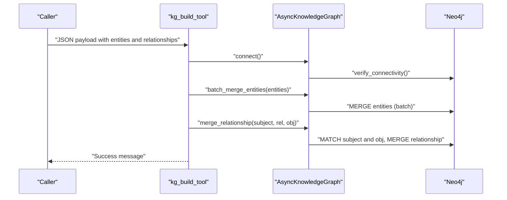

**Diagram sources**
- [kg_tools.py:5-37](file://veritas-ai/tools/kg_tools.py#L5-L37)
- [knowledge_graph.py:25-86](file://veritas-ai/memory/knowledge_graph.py#L25-L86)

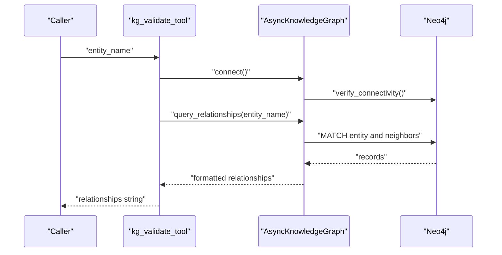

**Diagram sources**
- [kg_tools.py:39-49](file://veritas-ai/tools/kg_tools.py#L39-L49)
- [knowledge_graph.py:88-112](file://veritas-ai/memory/knowledge_graph.py#L88-L112)

## Detailed Component Analysis

### Knowledge Graph Entity Builder Tool
- Purpose: Insert entities and relationships into the knowledge graph from structured JSON.
- Input schema: Entities array with label/name pairs; relationships array with subject/subject_label/relationship/obj/obj_label.
- Processing:
  - Parses JSON and connects to AsyncKnowledgeGraph.
  - Builds tuples for entities and calls batch_merge_entities.
  - Iterates relationships and calls merge_relationship for each.
- Error handling: Strict JSON parsing guard and generic exception handling returning actionable messages.

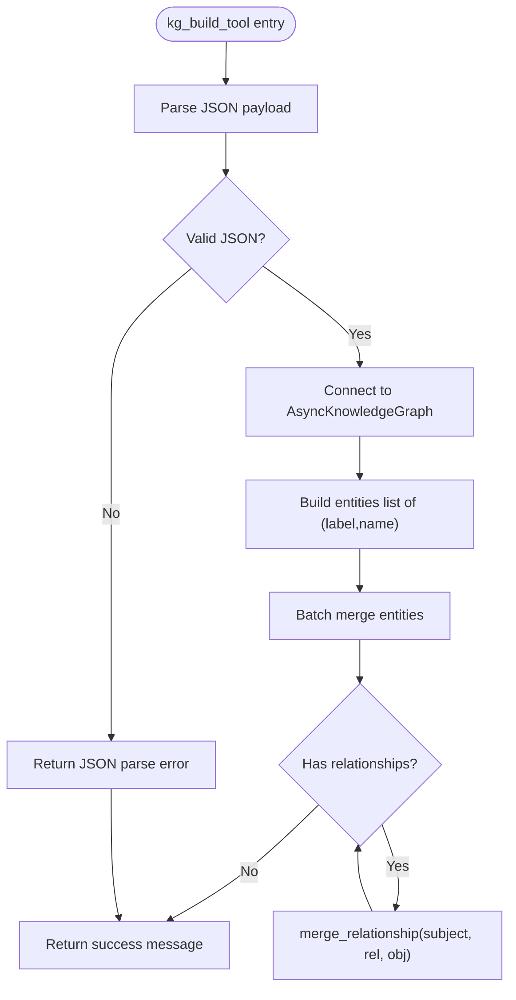

**Diagram sources**
- [kg_tools.py:5-37](file://veritas-ai/tools/kg_tools.py#L5-L37)
- [knowledge_graph.py:114-131](file://veritas-ai/memory/knowledge_graph.py#L114-L131)

**Section sources**
- [kg_tools.py:5-37](file://veritas-ai/tools/kg_tools.py#L5-L37)
- [knowledge_graph.py:114-131](file://veritas-ai/memory/knowledge_graph.py#L114-L131)

### Knowledge Graph Validator Tool
- Purpose: Query the knowledge graph for structural relationships of a given entity.
- Processing:
  - Connects to AsyncKnowledgeGraph.
  - Executes a Cypher query to return up to a fixed limit of relationships.
  - Formats results into a human-readable string.
- Output: Relationship statements or a message indicating no relationships were found.

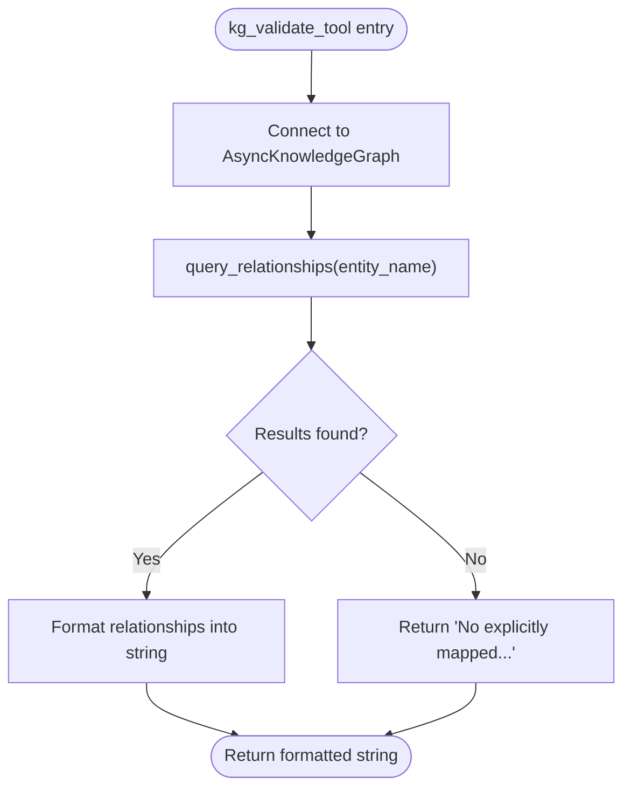

**Diagram sources**
- [kg_tools.py:39-49](file://veritas-ai/tools/kg_tools.py#L39-L49)
- [knowledge_graph.py:88-112](file://veritas-ai/memory/knowledge_graph.py#L88-L112)

**Section sources**
- [kg_tools.py:39-49](file://veritas-ai/tools/kg_tools.py#L39-L49)
- [knowledge_graph.py:88-112](file://veritas-ai/memory/knowledge_graph.py#L88-L112)

### AsyncKnowledgeGraph
- Responsibilities:
  - Singleton async driver management with connection pooling.
  - Entity merging with label validation.
  - Relationship merging with label and relationship validation.
  - Batch entity merging with concurrency control.
  - Relationship querying with a fixed limit.
- Security and constraints:
  - Enforces allowed labels and relationships sets.
  - Logs warnings and errors for invalid inputs.
- Configuration:
  - Reads Neo4j URI, user, and password from settings.
  - Configures connection pool size and acquisition timeout.

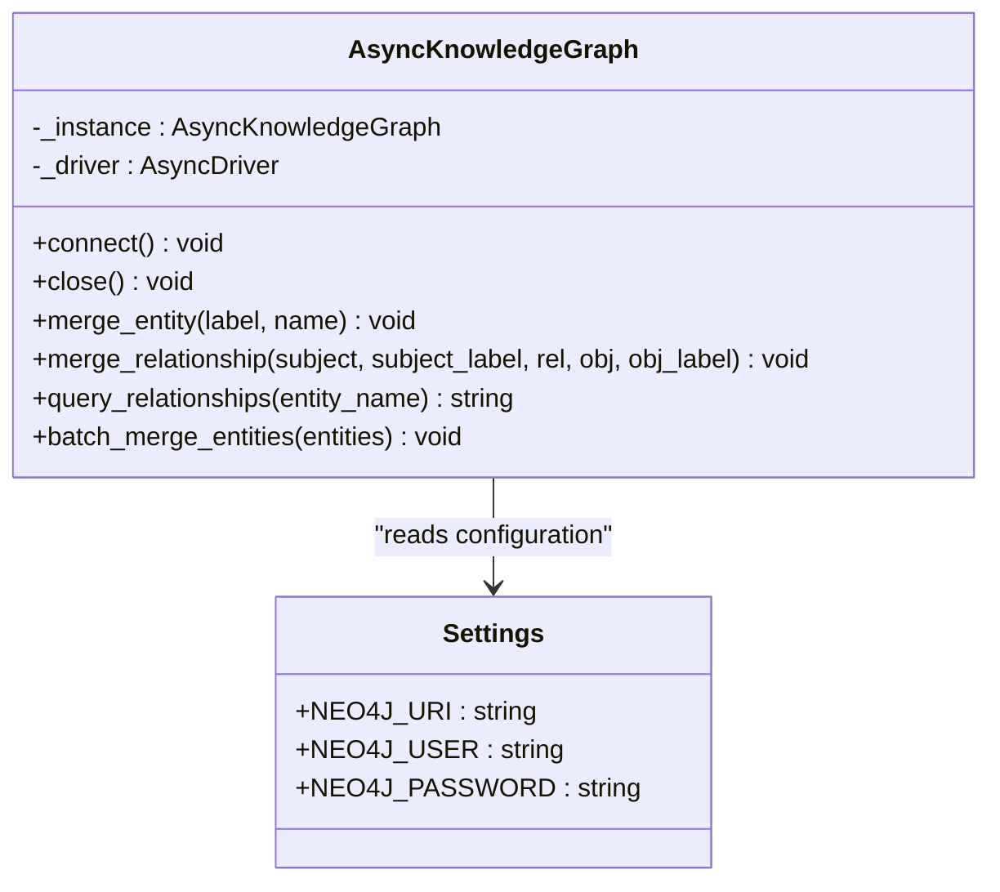

**Diagram sources**
- [knowledge_graph.py:12-160](file://veritas-ai/memory/knowledge_graph.py#L12-L160)
- [settings.py:64-68](file://veritas-ai/config/settings.py#L64-L68)

**Section sources**
- [knowledge_graph.py:12-160](file://veritas-ai/memory/knowledge_graph.py#L12-L160)
- [settings.py:64-68](file://veritas-ai/config/settings.py#L64-L68)

### Multi-Agent Pipeline Integration
- The multi-agent pipeline invokes the KG validator tool alongside other verification tools.
- Parallel validation agents run concurrently, reducing latency.
- The pipeline coordinates research, validation, and response building, integrating KG validation into the broader truth assessment.

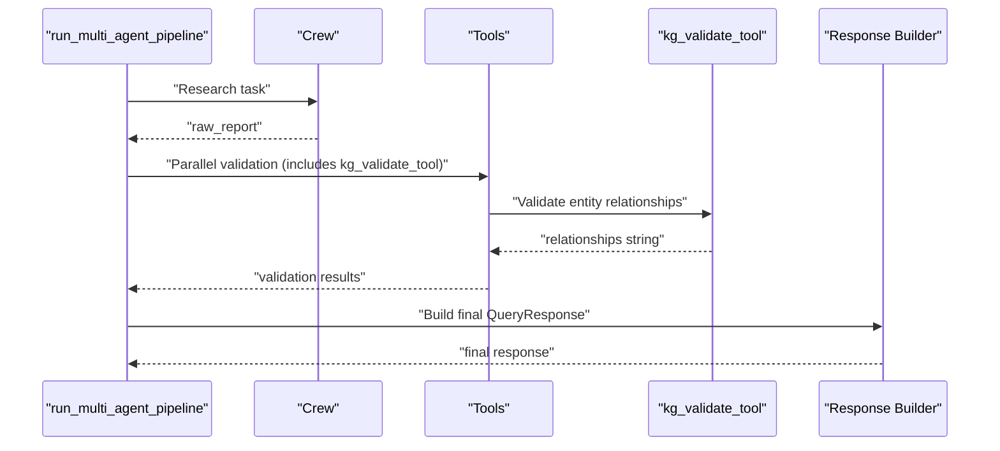

**Diagram sources**
- [multi_agent_pipeline.py:146-206](file://veritas-ai/pipelines/multi_agent_pipeline.py#L146-L206)
- [kg_tools.py:39-49](file://veritas-ai/tools/kg_tools.py#L39-L49)

**Section sources**
- [multi_agent_pipeline.py:146-206](file://veritas-ai/pipelines/multi_agent_pipeline.py#L146-L206)
- [kg_tools.py:39-49](file://veritas-ai/tools/kg_tools.py#L39-L49)

### Validation Agent and Confidence Scoring
- Truth scoring computes a composite score from multiple factors:
  - Source authority
  - Cross-source agreement
  - Temporal consistency
  - Claim verifiability (RAG + KG hits)
  - Bias deviation
- Firewall applies deterministic overrides based on contradictions, trusted sources, and truth thresholds.
- Consensus combines LLM confidence, classifier confidence, and rule-based confidence.
- Explanation layer produces human-readable rationales and breakdowns.

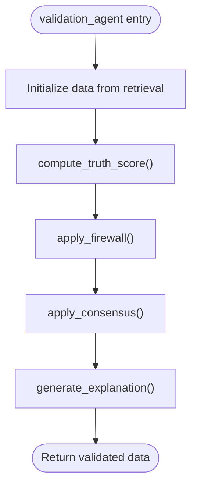

**Diagram sources**
- [validation.py:278-314](file://veritas-ai/app/agents/validation.py#L278-L314)
- [validation.py:92-126](file://veritas-ai/app/agents/validation.py#L92-L126)
- [validation.py:161-198](file://veritas-ai/app/agents/validation.py#L161-L198)
- [validation.py:203-212](file://veritas-ai/app/agents/validation.py#L203-L212)
- [validation.py:217-273](file://veritas-ai/app/agents/validation.py#L217-L273)

**Section sources**
- [validation.py:92-314](file://veritas-ai/app/agents/validation.py#L92-L314)

### Fast and Deep Pipelines
- Fast pipeline: Minimal retrieval and validation, designed to complete quickly.
- Deep pipeline: Full multi-agent orchestration with background task execution.

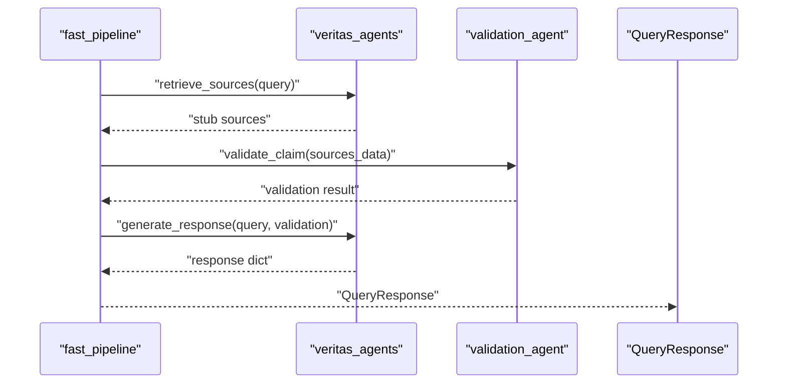

**Diagram sources**
- [fast_pipeline.py:8-22](file://veritas-ai/pipelines/fast_pipeline.py#L8-L22)
- [veritas_agents.py:7-41](file://veritas-ai/agents/veritas_agents.py#L7-L41)
- [validation.py:278-314](file://veritas-ai/app/agents/validation.py#L278-L314)

**Section sources**
- [fast_pipeline.py:8-22](file://veritas-ai/pipelines/fast_pipeline.py#L8-L22)
- [veritas_agents.py:7-41](file://veritas-ai/agents/veritas_agents.py#L7-L41)
- [deep_pipeline.py:7-17](file://veritas-ai/pipelines/deep_pipeline.py#L7-L17)

### Vector Store Integration
- Local Chroma vector store with Ollama embeddings.
- Persistent collection configured with a named collection and persistence directory.
- Used by retrieval agents to support RAG-based verifiability scoring.

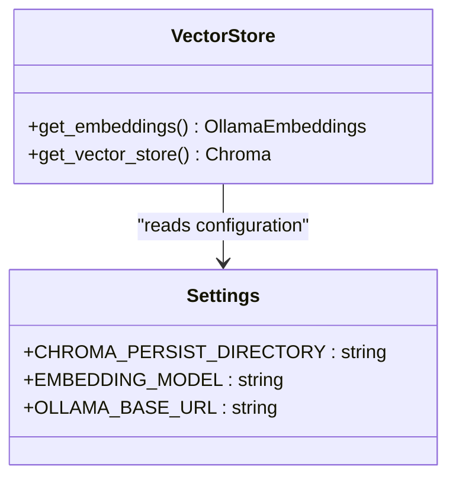

**Diagram sources**
- [vector_store.py:8-27](file://veritas-ai/memory/vector_store.py#L8-L27)
- [settings.py:50-54](file://veritas-ai/config/settings.py#L50-L54)

**Section sources**
- [vector_store.py:8-27](file://veritas-ai/memory/vector_store.py#L8-L27)
- [settings.py:50-54](file://veritas-ai/config/settings.py#L50-L54)

## Dependency Analysis
- Tools depend on AsyncKnowledgeGraph for Neo4j operations.
- Pipelines orchestrate tools and agents; validation agents rely on scoring and firewall logic.
- Memory components depend on settings for configuration.
- Models define the response schema used across the system.

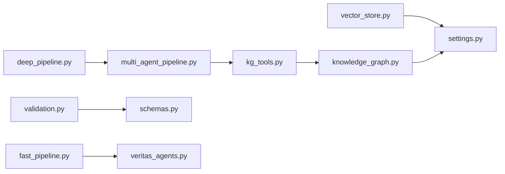

**Diagram sources**
- [kg_tools.py:1-50](file://veritas-ai/tools/kg_tools.py#L1-L50)
- [knowledge_graph.py:1-160](file://veritas-ai/memory/knowledge_graph.py#L1-L160)
- [multi_agent_pipeline.py:1-379](file://veritas-ai/pipelines/multi_agent_pipeline.py#L1-L379)
- [validation.py:1-314](file://veritas-ai/app/agents/validation.py#L1-L314)
- [schemas.py:1-88](file://veritas-ai/models/schemas.py#L1-L88)
- [vector_store.py:1-27](file://veritas-ai/memory/vector_store.py#L1-L27)
- [settings.py:1-83](file://veritas-ai/config/settings.py#L1-L83)
- [fast_pipeline.py:1-22](file://veritas-ai/pipelines/fast_pipeline.py#L1-L22)
- [deep_pipeline.py:1-17](file://veritas-ai/pipelines/deep_pipeline.py#L1-L17)
- [veritas_agents.py:1-44](file://veritas-ai/agents/veritas_agents.py#L1-L44)

**Section sources**
- [kg_tools.py:1-50](file://veritas-ai/tools/kg_tools.py#L1-L50)
- [knowledge_graph.py:1-160](file://veritas-ai/memory/knowledge_graph.py#L1-L160)
- [multi_agent_pipeline.py:1-379](file://veritas-ai/pipelines/multi_agent_pipeline.py#L1-L379)
- [validation.py:1-314](file://veritas-ai/app/agents/validation.py#L1-L314)
- [schemas.py:1-88](file://veritas-ai/models/schemas.py#L1-L88)
- [vector_store.py:1-27](file://veritas-ai/memory/vector_store.py#L1-L27)
- [settings.py:1-83](file://veritas-ai/config/settings.py#L1-L83)
- [fast_pipeline.py:1-22](file://veritas-ai/pipelines/fast_pipeline.py#L1-L22)
- [deep_pipeline.py:1-17](file://veritas-ai/pipelines/deep_pipeline.py#L1-L17)
- [veritas_agents.py:1-44](file://veritas-ai/agents/veritas_agents.py#L1-L44)

## Performance Considerations
- Async I/O: Knowledge graph operations use async sessions and batching to minimize latency.
- Connection pooling: Neo4j driver is configured with a bounded pool and acquisition timeout.
- Batch entity merging: Entities are merged in batches to reduce round-trips.
- Parallelism: Multi-agent pipeline runs validation agents concurrently.
- Vector store locality: Chroma persists locally to reduce network overhead.
- Model selection: Lightweight models for fast pipeline to meet sub-second SLAs.

[No sources needed since this section provides general guidance]

## Troubleshooting Guide
- JSON parsing failures: The entity builder tool returns a strict error when the payload fails JSON parsing.
- Neo4j connectivity: Connection verification occurs on first connect; errors are logged and the driver remains unset.
- Unsupported labels/relationships: Operations are skipped with warnings; ensure labels and relationships match allowed sets.
- Query timeouts: Multi-agent pipeline applies timeouts to agent execution; adjust configuration as needed.
- Validation errors: Validation agent runs scoring in a thread pool; exceptions are caught and surfaced via fallback responses.

**Section sources**
- [kg_tools.py:34-37](file://veritas-ai/tools/kg_tools.py#L34-L37)
- [knowledge_graph.py:25-38](file://veritas-ai/memory/knowledge_graph.py#L25-L38)
- [knowledge_graph.py:48-50](file://veritas-ai/memory/knowledge_graph.py#L48-L50)
- [knowledge_graph.py:64-75](file://veritas-ai/memory/knowledge_graph.py#L64-L75)
- [multi_agent_pipeline.py:56-72](file://veritas-ai/pipelines/multi_agent_pipeline.py#L56-L72)
- [validation.py:354-366](file://veritas-ai/app/agents/validation.py#L354-L366)

## Conclusion
The Knowledge Graph Tools provide robust primitives for entity linking and relationship extraction, integrated tightly with validation and pipeline orchestration. Async patterns, batching, and connection pooling enable scalable operation against Neo4j. The validation stack computes a comprehensive truth score, applies deterministic firewalls, and surfaces explanations. Configuration is centralized for Neo4j and vector store parameters, enabling straightforward integration with external knowledge sources and maintenance of the knowledge graph.

[No sources needed since this section summarizes without analyzing specific files]

## Appendices

### Configuration Options for Knowledge Sources
- Neo4j connectivity:
  - NEO4J_URI, NEO4J_USER, NEO4J_PASSWORD
- Vector store:
  - CHROMA_PERSIST_DIRECTORY, EMBEDDING_MODEL, OLLAMA_BASE_URL
- Pipeline and performance:
  - PIPELINE_TIMEOUT_SECONDS, MAX_PARALLEL_TOOLS, ENABLE_STREAMING, STREAM_CHUNK_SIZE

**Section sources**
- [settings.py:64-68](file://veritas-ai/config/settings.py#L64-L68)
- [settings.py:50-54](file://veritas-ai/config/settings.py#L50-L54)
- [settings.py:21-28](file://veritas-ai/config/settings.py#L21-L28)
- [settings.py:72-76](file://veritas-ai/config/settings.py#L72-L76)

### Entity Resolution Workflow
- Input: JSON with entities and relationships.
- Resolution steps:
  - Validate and normalize labels/relationships.
  - Batch merge entities to ensure existence.
  - Merge directed relationships with directionality preserved.
- Output: Confirmation message or error string.

**Section sources**
- [kg_tools.py:5-37](file://veritas-ai/tools/kg_tools.py#L5-L37)
- [knowledge_graph.py:114-131](file://veritas-ai/memory/knowledge_graph.py#L114-L131)

### Confidence Scoring and Cross-Referencing
- Cross-reference KG and RAG hits to compute verifiability.
- Combine truth score, firewall overrides, and consensus to produce final confidence and status.
- Explanations include breakdowns and reasons for true/false determinations.

**Section sources**
- [validation.py:92-126](file://veritas-ai/app/agents/validation.py#L92-L126)
- [validation.py:161-198](file://veritas-ai/app/agents/validation.py#L161-L198)
- [validation.py:203-212](file://veritas-ai/app/agents/validation.py#L203-L212)
- [validation.py:217-273](file://veritas-ai/app/agents/validation.py#L217-L273)

### Integration Patterns and Maintenance
- Integration with external knowledge bases:
  - Use the entity builder tool to insert structured triples.
  - Use the validator tool to cross-check assertions.
- RDF serialization:
  - Current implementation uses Neo4j Cypher; no explicit RDF export is present in the referenced files.
- Maintenance:
  - Monitor Neo4j connectivity and pool health.
  - Rotate credentials and update URIs via environment variables.
  - Periodically review allowed labels and relationships to maintain graph integrity.

**Section sources**
- [kg_tools.py:5-49](file://veritas-ai/tools/kg_tools.py#L5-L49)
- [knowledge_graph.py:12-160](file://veritas-ai/memory/knowledge_graph.py#L12-L160)
- [settings.py:64-68](file://veritas-ai/config/settings.py#L64-L68)