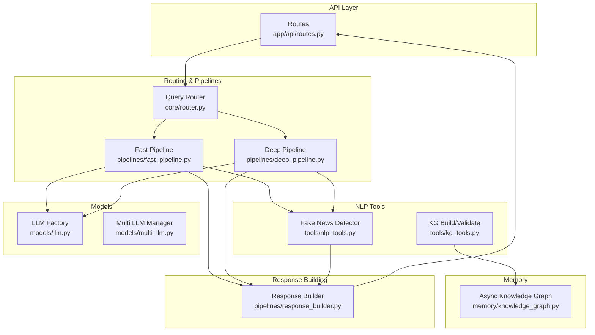
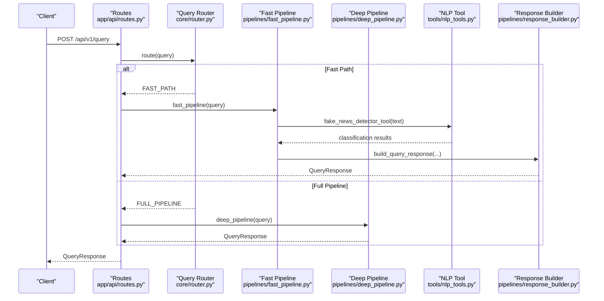
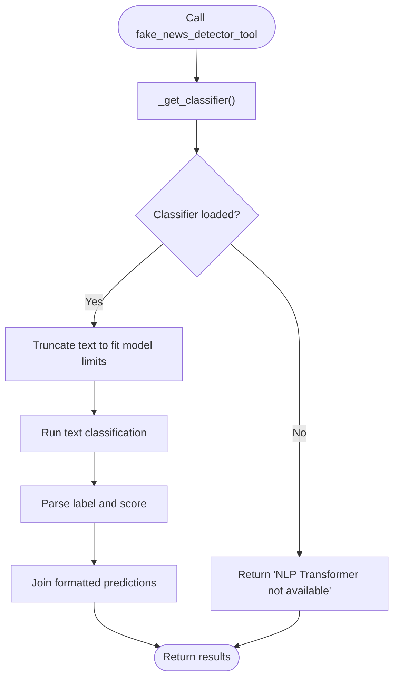
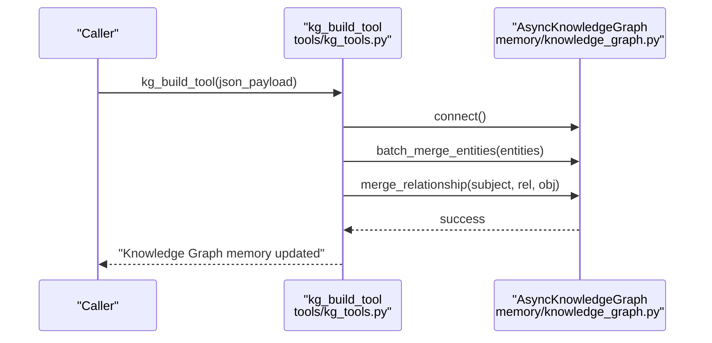
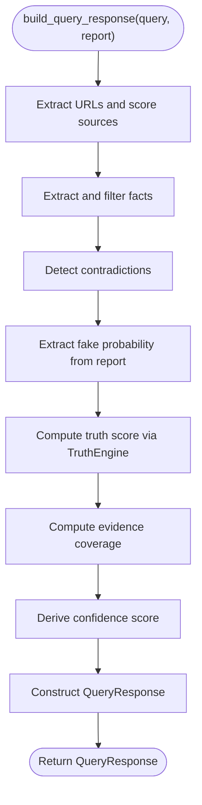
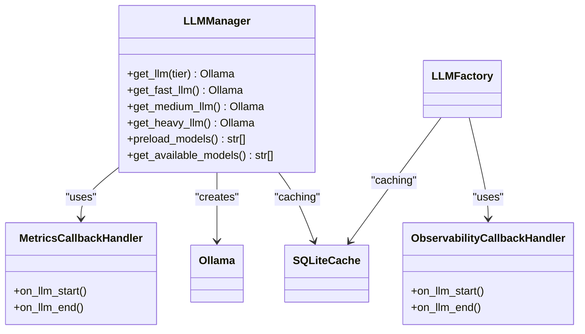
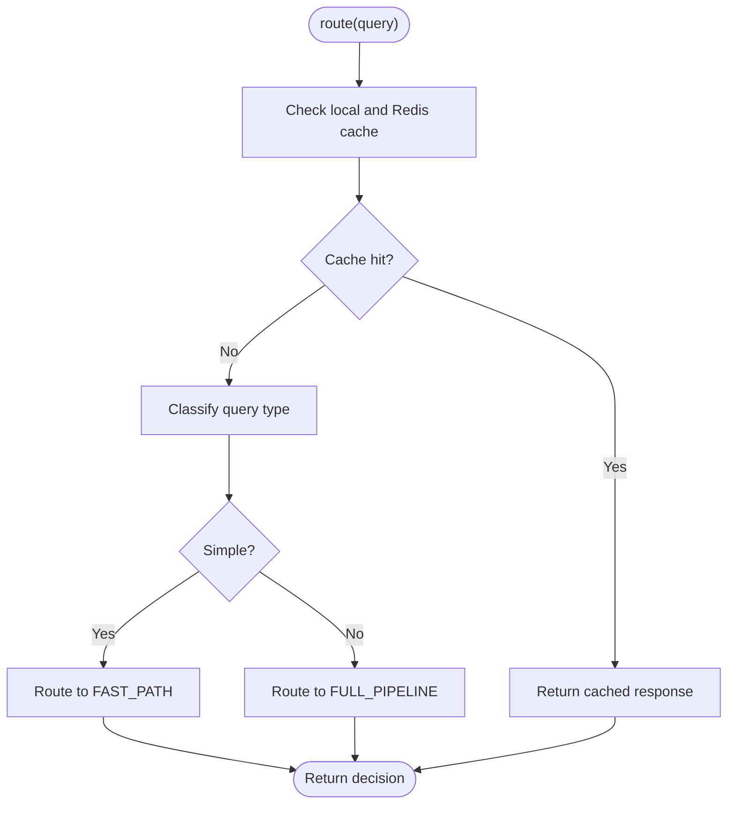
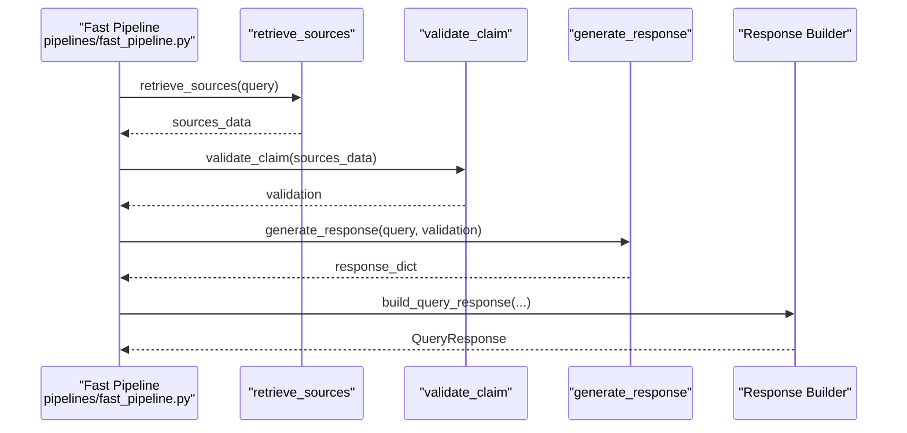
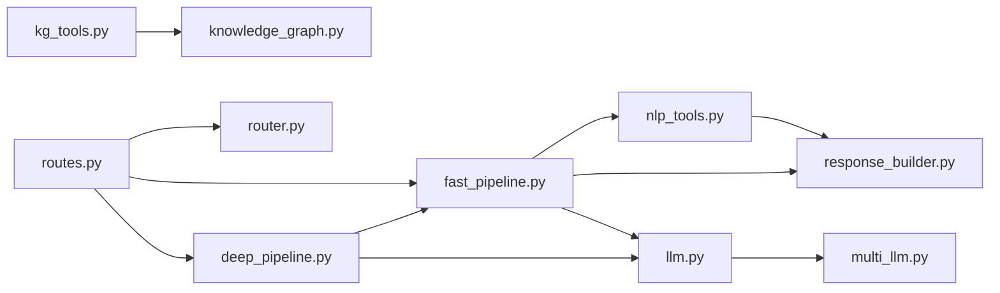

# NLP Processing Tools

<cite>
**Referenced Files in This Document**
- [nlp_tools.py](file://veritas-ai/tools/nlp_tools.py)
- [kg_tools.py](file://veritas-ai/tools/kg_tools.py)
- [knowledge_graph.py](file://veritas-ai/memory/knowledge_graph.py)
- [response_builder.py](file://veritas-ai/pipelines/response_builder.py)
- [settings.py](file://veritas-ai/config/settings.py)
- [schemas.py](file://veritas-ai/models/schemas.py)
- [llm.py](file://veritas-ai/models/llm.py)
- [multi_llm.py](file://veritas-ai/models/multi_llm.py)
- [router.py](file://veritas-ai/core/router.py)
- [fast_pipeline.py](file://veritas-ai/pipelines/fast_pipeline.py)
- [deep_pipeline.py](file://veritas-ai/pipelines/deep_pipeline.py)
- [routes.py](file://veritas-ai/app/api/routes.py)
- [query_agent.py](file://veritas-ai/agents/query_agent.py)
</cite>

## Table of Contents
1. [Introduction](#introduction)
2. [Project Structure](#project-structure)
3. [Core Components](#core-components)
4. [Architecture Overview](#architecture-overview)
5. [Detailed Component Analysis](#detailed-component-analysis)
6. [Dependency Analysis](#dependency-analysis)
7. [Performance Considerations](#performance-considerations)
8. [Troubleshooting Guide](#troubleshooting-guide)
9. [Conclusion](#conclusion)
10. [Appendices](#appendices)

## Introduction
This document describes the NLP Processing Tools within the Veritas AI project, focusing on natural language understanding and text analysis capabilities. It covers:
- Text classification for clickbait and fake news detection
- Named Entity Recognition (NER) via knowledge graph integration
- Sentiment analysis patterns and text summarization logic
- Keyword extraction and fact/contradiction extraction
- Text preprocessing, normalization, and multilingual considerations
- Configuration options for models and performance tuning
- Batch processing capabilities
- Privacy considerations and external service integrations

## Project Structure
The NLP-related capabilities are distributed across tools, pipelines, models, memory, and API layers:
- Tools: NLP classification and KG ingestion/validation
- Pipelines: Fast and deep processing paths
- Models: LLM initialization and multi-tier model management
- Memory: Async knowledge graph for entity and relationship storage
- API: Route queries to appropriate pipelines and expose endpoints

**Diagram sources**
- [routes.py:1-251](file://veritas-ai/app/api/routes.py#L1-L251)
- [router.py:1-182](file://veritas-ai/core/router.py#L1-L182)
- [fast_pipeline.py:1-22](file://veritas-ai/pipelines/fast_pipeline.py#L1-L22)
- [deep_pipeline.py:1-17](file://veritas-ai/pipelines/deep_pipeline.py#L1-L17)
- [nlp_tools.py:1-52](file://veritas-ai/tools/nlp_tools.py#L1-L52)
- [kg_tools.py:1-49](file://veritas-ai/tools/kg_tools.py#L1-L49)
- [knowledge_graph.py:1-160](file://veritas-ai/memory/knowledge_graph.py#L1-L160)
- [response_builder.py:1-145](file://veritas-ai/pipelines/response_builder.py#L1-L145)
- [llm.py:1-61](file://veritas-ai/models/llm.py#L1-L61)
- [multi_llm.py:1-143](file://veritas-ai/models/multi_llm.py#L1-L143)

**Section sources**
- [routes.py:1-251](file://veritas-ai/app/api/routes.py#L1-L251)
- [router.py:1-182](file://veritas-ai/core/router.py#L1-L182)
- [fast_pipeline.py:1-22](file://veritas-ai/pipelines/fast_pipeline.py#L1-L22)
- [deep_pipeline.py:1-17](file://veritas-ai/pipelines/deep_pipeline.py#L1-L17)
- [nlp_tools.py:1-52](file://veritas-ai/tools/nlp_tools.py#L1-L52)
- [kg_tools.py:1-49](file://veritas-ai/tools/kg_tools.py#L1-L49)
- [knowledge_graph.py:1-160](file://veritas-ai/memory/knowledge_graph.py#L1-L160)
- [response_builder.py:1-145](file://veritas-ai/pipelines/response_builder.py#L1-L145)
- [llm.py:1-61](file://veritas-ai/models/llm.py#L1-L61)
- [multi_llm.py:1-143](file://veritas-ai/models/multi_llm.py#L1-L143)

## Core Components
- NLP Classification Tool: Provides clickbait and fake news detection using a transformer-based text classifier.
- Knowledge Graph Tools: Insert and validate entities and relationships into a Neo4j-backed knowledge graph.
- Response Builder: Extracts facts, contradictions, sources, and computes derived scores from agent reports.
- LLM Factories: Configure and reuse LLM clients with observability and caching.
- Multi-tier LLM Manager: Select and manage different model tiers for performance and cost.
- Query Router: Classifies queries and routes to fast or full pipelines with caching.
- Pipelines: Fast path for quick verification and deep path for full multi-agent analysis.

**Section sources**
- [nlp_tools.py:1-52](file://veritas-ai/tools/nlp_tools.py#L1-L52)
- [kg_tools.py:1-49](file://veritas-ai/tools/kg_tools.py#L1-L49)
- [response_builder.py:1-145](file://veritas-ai/pipelines/response_builder.py#L1-L145)
- [llm.py:1-61](file://veritas-ai/models/llm.py#L1-L61)
- [multi_llm.py:1-143](file://veritas-ai/models/multi_llm.py#L1-L143)
- [router.py:1-182](file://veritas-ai/core/router.py#L1-L182)
- [fast_pipeline.py:1-22](file://veritas-ai/pipelines/fast_pipeline.py#L1-L22)
- [deep_pipeline.py:1-17](file://veritas-ai/pipelines/deep_pipeline.py#L1-L17)

## Architecture Overview
The system orchestrates NLP tasks through a routing layer that selects between a fast verification pipeline and a deep multi-agent pipeline. The fast pipeline performs minimal retrieval and validation, while the deep pipeline delegates to the multi-agent system. NLP classification and knowledge graph operations are integrated into the response building and validation stages.

**Diagram sources**
- [routes.py:100-128](file://veritas-ai/app/api/routes.py#L100-L128)
- [router.py:99-136](file://veritas-ai/core/router.py#L99-L136)
- [fast_pipeline.py:8-21](file://veritas-ai/pipelines/fast_pipeline.py#L8-L21)
- [deep_pipeline.py:7-16](file://veritas-ai/pipelines/deep_pipeline.py#L7-L16)
- [nlp_tools.py:27-51](file://veritas-ai/tools/nlp_tools.py#L27-L51)
- [response_builder.py:111-144](file://veritas-ai/pipelines/response_builder.py#L111-L144)

## Detailed Component Analysis

### NLP Classification Tool: Fake News Detection
- Purpose: Detect sensationalism and misleading content using a transformer-based text classifier.
- Behavior:
  - Lazily initializes the classifier once per process.
  - Truncates input text to fit model token limits.
  - Returns classification labels and confidence scores.
  - Gracefully handles missing dependencies and runtime errors.

**Diagram sources**
- [nlp_tools.py:8-25](file://veritas-ai/tools/nlp_tools.py#L8-L25)
- [nlp_tools.py:27-51](file://veritas-ai/tools/nlp_tools.py#L27-L51)

**Section sources**
- [nlp_tools.py:1-52](file://veritas-ai/tools/nlp_tools.py#L1-L52)

### Knowledge Graph Tools: Entity and Relationship Management
- Purpose: Insert entities and relationships into a Neo4j-backed knowledge graph and validate relationships for a given entity.
- Features:
  - Strict JSON schema for inputs.
  - Batch entity insertion for performance.
  - Validation queries returning explicit relationship mappings.

**Diagram sources**
- [kg_tools.py:5-37](file://veritas-ai/tools/kg_tools.py#L5-L37)
- [knowledge_graph.py:25-131](file://veritas-ai/memory/knowledge_graph.py#L25-L131)

**Section sources**
- [kg_tools.py:1-49](file://veritas-ai/tools/kg_tools.py#L1-L49)
- [knowledge_graph.py:1-160](file://veritas-ai/memory/knowledge_graph.py#L1-L160)

### Response Builder: Fact, Contradiction, Source Extraction and Summarization
- Purpose: Parse agent reports and construct structured QueryResponse objects.
- Extraction logic:
  - Facts: Sentence-based extraction with length and content filters.
  - Contradictions: Keyword-based detection across lines.
  - Sources: URL discovery, deduplication, and scoring by domain.
  - Fake probability: Extracted from NLP classification output.
- Summarization: Builds concise summaries based on evidence availability and report markers.

**Diagram sources**
- [response_builder.py:111-144](file://veritas-ai/pipelines/response_builder.py#L111-L144)
- [response_builder.py:47-97](file://veritas-ai/pipelines/response_builder.py#L47-L97)

**Section sources**
- [response_builder.py:1-145](file://veritas-ai/pipelines/response_builder.py#L1-L145)
- [schemas.py:14-26](file://veritas-ai/models/schemas.py#L14-L26)

### LLM Factories and Multi-tier Model Management
- Purpose: Provide consistent LLM initialization with observability and caching.
- Features:
  - Single LLM factory with SQLite cache.
  - Multi-tier manager supporting FAST, MEDIUM, HEAVY tiers with configurable timeouts and temperatures.
  - Preloading and availability checks for models.

**Diagram sources**
- [multi_llm.py:81-143](file://veritas-ai/models/multi_llm.py#L81-L143)
- [llm.py:11-61](file://veritas-ai/models/llm.py#L11-L61)

**Section sources**
- [llm.py:1-61](file://veritas-ai/models/llm.py#L1-L61)
- [multi_llm.py:1-143](file://veritas-ai/models/multi_llm.py#L1-L143)

### Query Router: Classification and Path Selection
- Purpose: Classify queries and route to fast or full pipelines with caching.
- Classification logic:
  - Regex-based patterns for simple vs complex queries.
  - Trigger words increase likelihood of complex routing.
  - TTL-based caching with Redis fallback.
- Decision outcomes: CACHE_HIT, FAST_PATH, FULL_PIPELINE.

**Diagram sources**
- [router.py:99-136](file://veritas-ai/core/router.py#L99-L136)
- [router.py:51-81](file://veritas-ai/core/router.py#L51-L81)

**Section sources**
- [router.py:1-182](file://veritas-ai/core/router.py#L1-L182)

### Pipelines: Fast and Deep Paths
- Fast Pipeline: Minimal retrieval and validation, designed to complete quickly.
- Deep Pipeline: Runs the multi-agent pipeline in a background task and awaits results.

**Diagram sources**
- [fast_pipeline.py:8-21](file://veritas-ai/pipelines/fast_pipeline.py#L8-L21)
- [response_builder.py:111-144](file://veritas-ai/pipelines/response_builder.py#L111-L144)

**Section sources**
- [fast_pipeline.py:1-22](file://veritas-ai/pipelines/fast_pipeline.py#L1-L22)
- [deep_pipeline.py:1-17](file://veritas-ai/pipelines/deep_pipeline.py#L1-L17)

### API Layer: Endpoints and Authorization
- Endpoints:
  - GET /health: Health and cache stats
  - POST /query: Direct query resolution
  - POST /verify-news: Authenticated news verification
  - POST /stream-analysis: WebSocket stream authorization
  - GET /history: Query history
  - POST /feedback: Submit feedback
  - POST /trigger-network-effect: Dataset aggregation
  - GET /alerts: Active alerts
  - GET /predictive-trends: Predictive trends
  - POST /voice/set: Set TTS voice profile
  - GET /metrics: System metrics
  - POST /cache/clear: Clear caches
- Authorization: X-API-KEY header required for protected endpoints.

**Section sources**
- [routes.py:1-251](file://veritas-ai/app/api/routes.py#L1-L251)

## Dependency Analysis
- Tools depend on LangChain tools decorator and optional transformers library.
- Pipelines depend on LLM factories and response builder.
- Router depends on TTL cache and Redis cache.
- Knowledge Graph tools depend on AsyncKnowledgeGraph.
- API routes depend on router and pipelines.

**Diagram sources**
- [nlp_tools.py:1-52](file://veritas-ai/tools/nlp_tools.py#L1-L52)
- [response_builder.py:1-145](file://veritas-ai/pipelines/response_builder.py#L1-L145)
- [kg_tools.py:1-49](file://veritas-ai/tools/kg_tools.py#L1-L49)
- [knowledge_graph.py:1-160](file://veritas-ai/memory/knowledge_graph.py#L1-L160)
- [fast_pipeline.py:1-22](file://veritas-ai/pipelines/fast_pipeline.py#L1-L22)
- [deep_pipeline.py:1-17](file://veritas-ai/pipelines/deep_pipeline.py#L1-L17)
- [routes.py:1-251](file://veritas-ai/app/api/routes.py#L1-L251)
- [router.py:1-182](file://veritas-ai/core/router.py#L1-L182)
- [llm.py:1-61](file://veritas-ai/models/llm.py#L1-L61)
- [multi_llm.py:1-143](file://veritas-ai/models/multi_llm.py#L1-L143)

**Section sources**
- [nlp_tools.py:1-52](file://veritas-ai/tools/nlp_tools.py#L1-L52)
- [kg_tools.py:1-49](file://veritas-ai/tools/kg_tools.py#L1-L49)
- [knowledge_graph.py:1-160](file://veritas-ai/memory/knowledge_graph.py#L1-L160)
- [response_builder.py:1-145](file://veritas-ai/pipelines/response_builder.py#L1-L145)
- [fast_pipeline.py:1-22](file://veritas-ai/pipelines/fast_pipeline.py#L1-L22)
- [deep_pipeline.py:1-17](file://veritas-ai/pipelines/deep_pipeline.py#L1-L17)
- [routes.py:1-251](file://veritas-ai/app/api/routes.py#L1-L251)
- [router.py:1-182](file://veritas-ai/core/router.py#L1-L182)
- [llm.py:1-61](file://veritas-ai/models/llm.py#L1-L61)
- [multi_llm.py:1-143](file://veritas-ai/models/multi_llm.py#L1-L143)

## Performance Considerations
- Model selection and tiering:
  - Use FAST tier for latency-sensitive tasks; adjust timeouts accordingly.
  - Preload models to reduce cold-start latency.
- Caching:
  - Local TTL cache and Redis cache reduce repeated computation.
  - Response builder deduplicates facts and contradictions to minimize downstream processing.
- Streaming and parallelism:
  - Streaming chunk size and maximum parallel tools configurable via settings.
- Pipeline orchestration:
  - Fast pipeline targets sub-two-second responses by limiting retrieval and validation steps.
  - Deep pipeline runs in a background task to avoid blocking the main thread.

[No sources needed since this section provides general guidance]

## Troubleshooting Guide
- NLP Transformers unavailable:
  - Symptom: Warning about missing transformers/torch and fallback message.
  - Action: Install required packages or ensure environment supports transformers.
- Classification tensor errors:
  - Symptom: Exception caught and reported as classification tensor error.
  - Action: Verify text truncation and model compatibility.
- Knowledge Graph connectivity:
  - Symptom: Errors connecting to Neo4j or merging entities/relationships.
  - Action: Confirm Neo4j URI, credentials, and network accessibility.
- Response builder parsing:
  - Symptom: Insufficient verified evidence or uncertain status.
  - Action: Ensure agent reports include URLs and classification outputs; review extraction patterns.

**Section sources**
- [nlp_tools.py:19-24](file://veritas-ai/tools/nlp_tools.py#L19-L24)
- [nlp_tools.py:50-51](file://veritas-ai/tools/nlp_tools.py#L50-L51)
- [knowledge_graph.py:36-38](file://veritas-ai/memory/knowledge_graph.py#L36-L38)
- [knowledge_graph.py:56-57](file://veritas-ai/memory/knowledge_graph.py#L56-L57)
- [response_builder.py:102-108](file://veritas-ai/pipelines/response_builder.py#L102-L108)

## Conclusion
The NLP Processing Tools integrate classification, knowledge graph management, and structured response building into a scalable pipeline. The system emphasizes performance via tiered models, caching, and fast-path routing, while providing extensibility for deeper analysis. Privacy and external integrations are addressed through secure endpoints and configurable model backends.

[No sources needed since this section summarizes without analyzing specific files]

## Appendices

### Configuration Options
- Environment-driven settings:
  - LLM and model names, timeouts, and streaming parameters.
  - Vector DB and embedding model configurations.
  - Redis and cache parameters.
  - Knowledge Graph connection settings.
  - Security and CORS policies.
- Example keys:
  - OLLAMA_BASE_URL, MODEL_NAME, FAST_MODEL, ROUTER_MODEL
  - PIPELINE_TIMEOUT_SECONDS, AGENT_TASK_TIMEOUT_SECONDS
  - MAX_PARALLEL_TOOLS, ENABLE_STREAMING, STREAM_CHUNK_SIZE

**Section sources**
- [settings.py:13-83](file://veritas-ai/config/settings.py#L13-L83)

### Text Preprocessing and Normalization
- URL extraction and source scoring:
  - Deduplication and domain-based credibility scoring.
- Fact and contradiction filtering:
  - Sentence splitting and keyword-based contradiction detection.
- Fake probability extraction:
  - Pattern matching on classification outputs.

**Section sources**
- [response_builder.py:10-14](file://veritas-ai/pipelines/response_builder.py#L10-L14)
- [response_builder.py:83-97](file://veritas-ai/pipelines/response_builder.py#L83-L97)

### Multilingual Support
- Current implementation focuses on English-language processing via regex patterns and domain heuristics.
- No explicit multilingual tokenization or language detection is present in the analyzed files.

[No sources needed since this section provides general guidance]

### Batch Processing Capabilities
- Knowledge Graph batch entity merges:
  - Asynchronous batching with configurable batch sizes.
- LLM model preloading:
  - Attempts to warm models for FAST and MEDIUM tiers.

**Section sources**
- [knowledge_graph.py:114-131](file://veritas-ai/memory/knowledge_graph.py#L114-L131)
- [multi_llm.py:111-121](file://veritas-ai/models/multi_llm.py#L111-L121)

### Privacy Considerations
- API key enforcement for protected endpoints.
- Public query endpoint available without authentication.
- Secure WebSocket stream authorization via API key.
- History logging performed asynchronously and non-blockingly.

**Section sources**
- [routes.py:23-42](file://veritas-ai/app/api/routes.py#L23-L42)
- [routes.py:131-144](file://veritas-ai/app/api/routes.py#L131-L144)
- [routes.py:72-80](file://veritas-ai/app/api/routes.py#L72-L80)