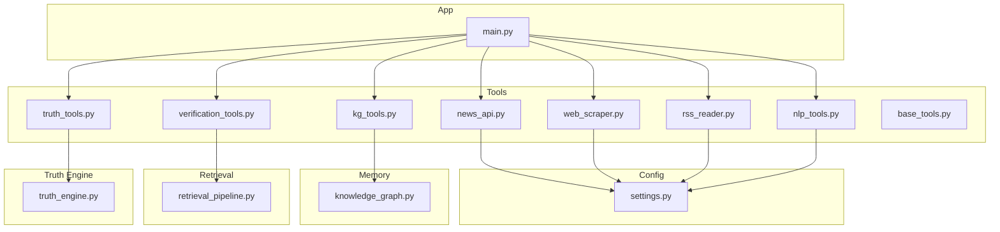
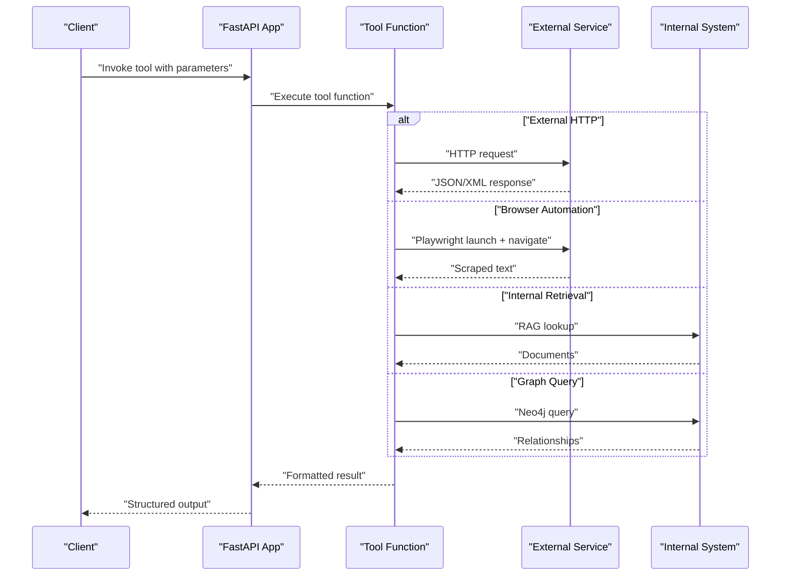
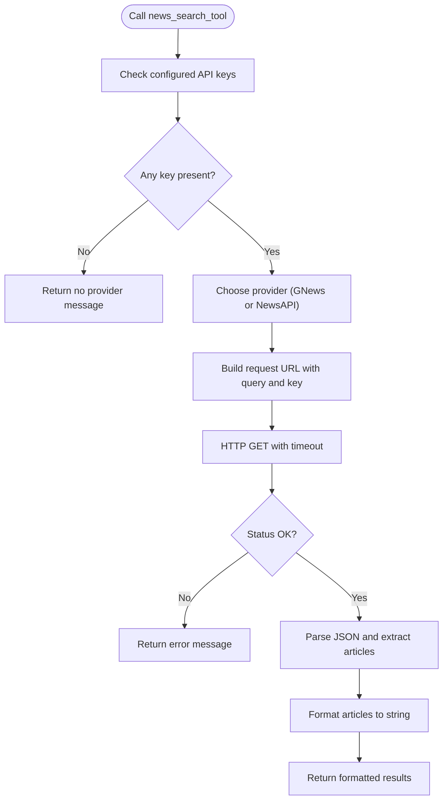
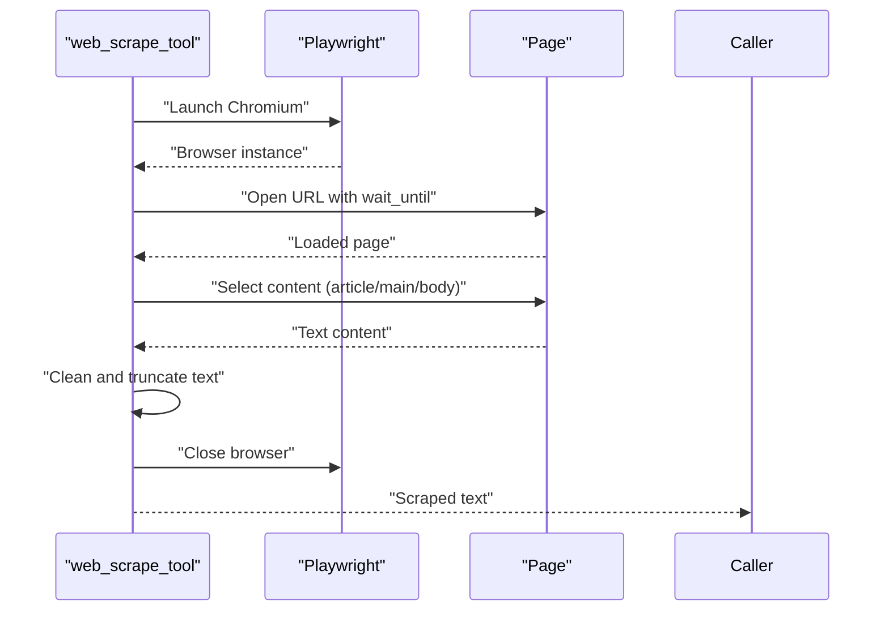
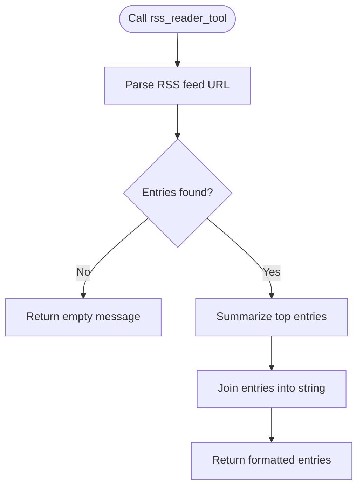
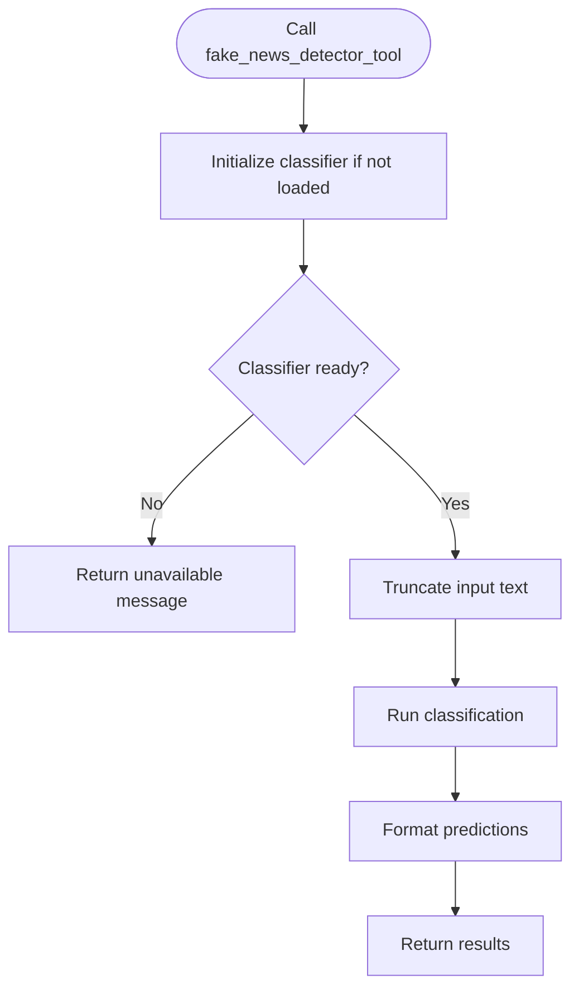
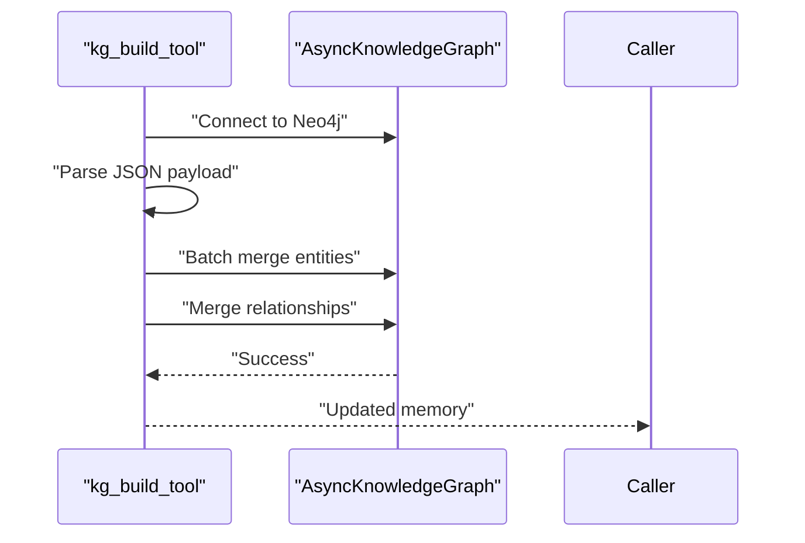
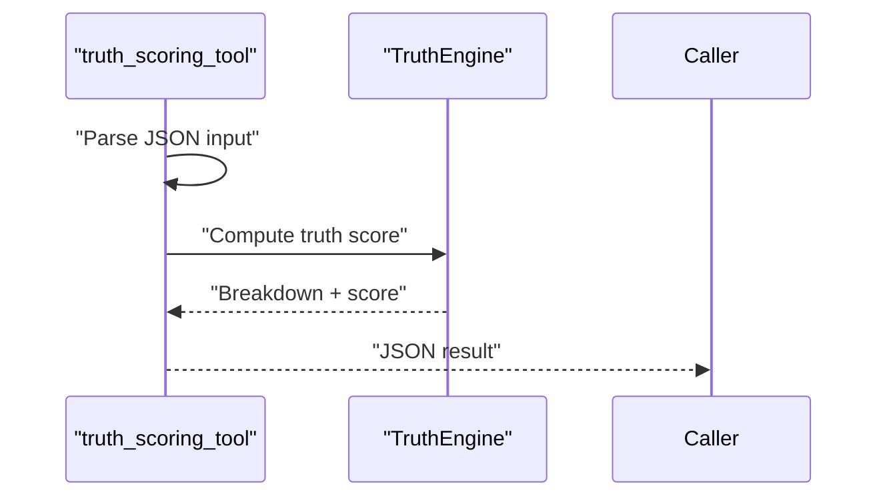
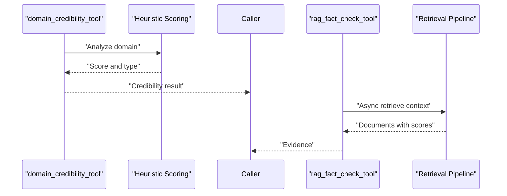
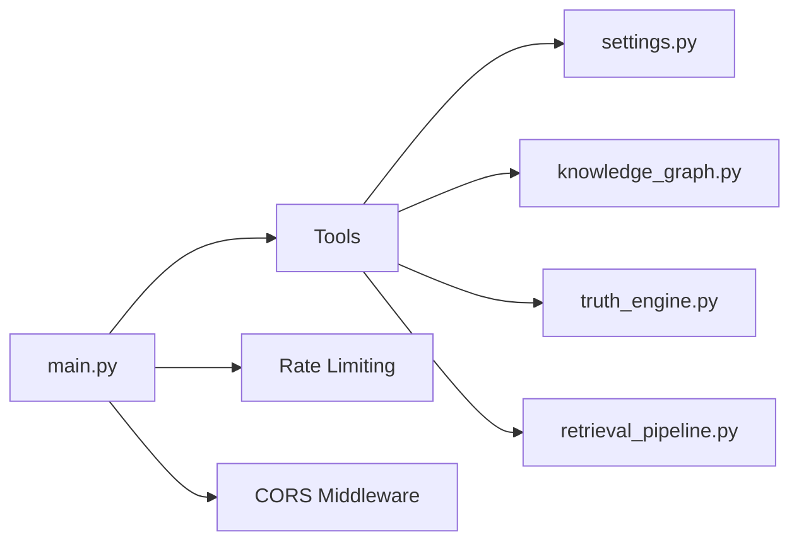

# Tools & Integrations

<cite>
**Referenced Files in This Document**
- [README.md](file://veritas-ai/README.md)
- [main.py](file://veritas-ai/main.py)
- [settings.py](file://veritas-ai/config/settings.py)
- [base_tools.py](file://veritas-ai/tools/base_tools.py)
- [news_api.py](file://veritas-ai/tools/news_api.py)
- [web_scraper.py](file://veritas-ai/tools/web_scraper.py)
- [rss_reader.py](file://veritas-ai/tools/rss_reader.py)
- [nlp_tools.py](file://veritas-ai/tools/nlp_tools.py)
- [kg_tools.py](file://veritas-ai/tools/kg_tools.py)
- [truth_tools.py](file://veritas-ai/tools/truth_tools.py)
- [verification_tools.py](file://veritas-ai/tools/verification_tools.py)
- [knowledge_graph.py](file://veritas-ai/memory/knowledge_graph.py)
- [truth_engine.py](file://veritas-ai/core/truth_engine.py)
- [retrieval_pipeline.py](file://veritas-ai/pipelines/retrieval_pipeline.py)
</cite>

## Table of Contents
1. [Introduction](#introduction)
2. [Project Structure](#project-structure)
3. [Core Components](#core-components)
4. [Architecture Overview](#architecture-overview)
5. [Detailed Component Analysis](#detailed-component-analysis)
6. [Dependency Analysis](#dependency-analysis)
7. [Performance Considerations](#performance-considerations)
8. [Troubleshooting Guide](#troubleshooting-guide)
9. [Conclusion](#conclusion)
10. [Appendices](#appendices)

## Introduction
This document describes the Tools and Integrations system responsible for external service connectivity and data processing. It covers the Base Tools framework, News API integration, Web Scraper, RSS Reader, NLP Tools, Knowledge Graph tools, Truth Tools, and Verification Tools. It also outlines implementation patterns for building custom tools, API integration strategies, error handling, rate limiting, authentication, and performance optimization for external service calls.

## Project Structure
The Tools and Integrations system resides under the veritas-ai/tools directory and integrates with configuration, memory, retrieval, and truth engines. The high-level structure is:
- Tools: individual tool modules exposing LangChain-compatible functions
- Config: centralized settings for API keys, caches, and runtime parameters
- Memory: Knowledge Graph client and Neo4j integration
- Retrieval: RAG-based retrieval pipeline with caching
- Truth Engine: mathematical truth scoring engine
- Main: FastAPI application wiring and rate limiting

**Diagram sources**
- [news_api.py:1-48](file://veritas-ai/tools/news_api.py#L1-L48)
- [web_scraper.py:1-35](file://veritas-ai/tools/web_scraper.py#L1-L35)
- [rss_reader.py:1-26](file://veritas-ai/tools/rss_reader.py#L1-L26)
- [nlp_tools.py:1-52](file://veritas-ai/tools/nlp_tools.py#L1-L52)
- [kg_tools.py:1-50](file://veritas-ai/tools/kg_tools.py#L1-L50)
- [truth_tools.py:1-29](file://veritas-ai/tools/truth_tools.py#L1-L29)
- [verification_tools.py:1-52](file://veritas-ai/tools/verification_tools.py#L1-L52)
- [settings.py:1-83](file://veritas-ai/config/settings.py#L1-L83)
- [knowledge_graph.py:1-160](file://veritas-ai/memory/knowledge_graph.py#L1-L160)
- [truth_engine.py:1-117](file://veritas-ai/core/truth_engine.py#L1-L117)
- [retrieval_pipeline.py:1-112](file://veritas-ai/pipelines/retrieval_pipeline.py#L1-L112)
- [main.py:1-141](file://veritas-ai/main.py#L1-L141)

**Section sources**
- [README.md:1-157](file://veritas-ai/README.md#L1-L157)
- [main.py:1-141](file://veritas-ai/main.py#L1-L141)

## Core Components
- Base Tools framework: LangChain-compatible decorators and placeholders for tool registration and execution patterns
- News API integration: GNews and NewsAPI clients with API key configuration and response formatting
- Web Scraper: Playwright-based content extraction with timeouts and headless browser management
- RSS Reader: feedparser-based feed parsing with entry summarization
- NLP Tools: Transformers-based fake news detection with model loading and truncation
- Knowledge Graph tools: Async ingestion and validation against Neo4j
- Truth Tools: Mathematical truth scoring engine with weighted factors
- Verification Tools: Domain credibility scoring and RAG-based fact checking

**Section sources**
- [base_tools.py:1-10](file://veritas-ai/tools/base_tools.py#L1-L10)
- [news_api.py:1-48](file://veritas-ai/tools/news_api.py#L1-L48)
- [web_scraper.py:1-35](file://veritas-ai/tools/web_scraper.py#L1-L35)
- [rss_reader.py:1-26](file://veritas-ai/tools/rss_reader.py#L1-L26)
- [nlp_tools.py:1-52](file://veritas-ai/tools/nlp_tools.py#L1-L52)
- [kg_tools.py:1-50](file://veritas-ai/tools/kg_tools.py#L1-L50)
- [truth_tools.py:1-29](file://veritas-ai/tools/truth_tools.py#L1-L29)
- [verification_tools.py:1-52](file://veritas-ai/tools/verification_tools.py#L1-L52)

## Architecture Overview
The Tools and Integrations system is invoked through LangChain-compatible tool decorators and integrated into the FastAPI application. External services are accessed via HTTP clients or browser automation, while internal systems (RAG, Knowledge Graph, Truth Engine) are accessed asynchronously. Rate limiting and CORS are enforced at the gateway level.

**Diagram sources**
- [main.py:76-123](file://veritas-ai/main.py#L76-L123)
- [news_api.py:18-48](file://veritas-ai/tools/news_api.py#L18-L48)
- [web_scraper.py:4-35](file://veritas-ai/tools/web_scraper.py#L4-L35)
- [rss_reader.py:4-26](file://veritas-ai/tools/rss_reader.py#L4-L26)
- [verification_tools.py:35-52](file://veritas-ai/tools/verification_tools.py#L35-L52)
- [kg_tools.py:5-50](file://veritas-ai/tools/kg_tools.py#L5-L50)
- [retrieval_pipeline.py:48-72](file://veritas-ai/pipelines/retrieval_pipeline.py#L48-L72)
- [knowledge_graph.py:25-112](file://veritas-ai/memory/knowledge_graph.py#L25-L112)

## Detailed Component Analysis

### Base Tools Framework
- Purpose: Provide a standardized decorator and execution pattern for tools
- Registration: Uses LangChain’s tool decorator to register functions
- Execution: Functions accept typed parameters and return structured strings
- Pattern: Encapsulate external calls, handle exceptions, and normalize outputs

Implementation example references:
- [Base tool decorator usage:3-9](file://veritas-ai/tools/base_tools.py#L3-L9)

**Section sources**
- [base_tools.py:1-10](file://veritas-ai/tools/base_tools.py#L1-L10)

### News API Integration
- Providers: Supports GNews and NewsAPI based on configured API keys
- Parameters: Query string with language and pagination constraints
- Formatting: Converts article lists to a compact markdown-like string
- Error handling: Graceful fallbacks and error messages; respects timeouts

**Diagram sources**
- [news_api.py:18-48](file://veritas-ai/tools/news_api.py#L18-L48)

**Section sources**
- [news_api.py:1-48](file://veritas-ai/tools/news_api.py#L1-L48)
- [settings.py:60-68](file://veritas-ai/config/settings.py#L60-L68)

### Web Scraper
- Purpose: Extract main textual content from a given URL
- Mechanism: Launches a headless Chromium instance, navigates to URL, and selects content using heuristics
- Limits: Enforces timeouts and caps output length
- Cleanup: Ensures browser resources are closed

**Diagram sources**
- [web_scraper.py:4-35](file://veritas-ai/tools/web_scraper.py#L4-L35)

**Section sources**
- [web_scraper.py:1-35](file://veritas-ai/tools/web_scraper.py#L1-L35)

### RSS Reader
- Purpose: Parse RSS feeds and return summarized entries
- Behavior: Parses feed, selects top entries, and formats title/link/summary
- Robustness: Handles empty feeds and parsing errors gracefully

**Diagram sources**
- [rss_reader.py:4-26](file://veritas-ai/tools/rss_reader.py#L4-L26)

**Section sources**
- [rss_reader.py:1-26](file://veritas-ai/tools/rss_reader.py#L1-L26)

### NLP Tools: Fake News Detection
- Model: Uses a Transformers pipeline for text classification
- Loading: Lazy initialization with error handling and warnings
- Truncation: Applies text truncation to fit model constraints
- Output: Returns classification labels and confidence scores

**Diagram sources**
- [nlp_tools.py:8-52](file://veritas-ai/tools/nlp_tools.py#L8-L52)

**Section sources**
- [nlp_tools.py:1-52](file://veritas-ai/tools/nlp_tools.py#L1-L52)

### Knowledge Graph Tools
- Entity Builder: Accepts JSON with entities and relationships; merges into Neo4j asynchronously
- Validator: Queries relationships for a given entity and returns mapped results
- Safety: Validates labels and relationship types; handles JSON parsing errors

**Diagram sources**
- [kg_tools.py:5-37](file://veritas-ai/tools/kg_tools.py#L5-L37)
- [knowledge_graph.py:25-131](file://veritas-ai/memory/knowledge_graph.py#L25-L131)

**Section sources**
- [kg_tools.py:1-50](file://veritas-ai/tools/kg_tools.py#L1-L50)
- [knowledge_graph.py:1-160](file://veritas-ai/memory/knowledge_graph.py#L1-L160)

### Truth Tools: Truth Scoring Engine
- Input: Strictly formatted JSON with sources, counts, flags, and probabilities
- Processing: Delegates to TruthEngine for mathematical scoring
- Output: JSON-encoded breakdown and final score

**Diagram sources**
- [truth_tools.py:5-28](file://veritas-ai/tools/truth_tools.py#L5-L28)
- [truth_engine.py:78-117](file://veritas-ai/core/truth_engine.py#L78-L117)

**Section sources**
- [truth_tools.py:1-29](file://veritas-ai/tools/truth_tools.py#L1-L29)
- [truth_engine.py:1-117](file://veritas-ai/core/truth_engine.py#L1-L117)

### Verification Tools
- Domain Credibility Evaluator: Heuristic-based scoring by domain type
- RAG Fact Checker: Asynchronously retrieves relevant context from vector DB

**Diagram sources**
- [verification_tools.py:5-33](file://veritas-ai/tools/verification_tools.py#L5-L33)
- [verification_tools.py:35-52](file://veritas-ai/tools/verification_tools.py#L35-L52)
- [retrieval_pipeline.py:48-72](file://veritas-ai/pipelines/retrieval_pipeline.py#L48-L72)

**Section sources**
- [verification_tools.py:1-52](file://veritas-ai/tools/verification_tools.py#L1-L52)
- [retrieval_pipeline.py:1-112](file://veritas-ai/pipelines/retrieval_pipeline.py#L1-L112)

## Dependency Analysis
- Tools depend on configuration for credentials and runtime parameters
- Knowledge Graph tools depend on the AsyncKnowledgeGraph client
- Truth Tools depend on the TruthEngine
- Verification Tools depend on the retrieval pipeline and domain heuristics
- Application wiring enforces rate limiting and CORS

**Diagram sources**
- [settings.py:1-83](file://veritas-ai/config/settings.py#L1-L83)
- [kg_tools.py:1-50](file://veritas-ai/tools/kg_tools.py#L1-L50)
- [truth_tools.py:1-29](file://veritas-ai/tools/truth_tools.py#L1-L29)
- [verification_tools.py:1-52](file://veritas-ai/tools/verification_tools.py#L1-L52)
- [retrieval_pipeline.py:1-112](file://veritas-ai/pipelines/retrieval_pipeline.py#L1-L112)
- [main.py:76-123](file://veritas-ai/main.py#L76-L123)

**Section sources**
- [main.py:76-123](file://veritas-ai/main.py#L76-L123)
- [settings.py:60-76](file://veritas-ai/config/settings.py#L60-L76)

## Performance Considerations
- Asynchronous retrieval: The retrieval pipeline uses async execution with thread pool offloading to reduce blocking
- Caching: Vector cache stores retrieval results for reuse; query hashing normalizes cache keys
- Parallelism limits: Global setting controls maximum parallel tools to avoid resource contention
- Browser automation: Headless mode and explicit timeouts minimize overhead
- Model loading: Lazy initialization prevents unnecessary startup costs for optional NLP features

Recommendations:
- Tune retrieval K and cache TTL for workload characteristics
- Monitor rate limits and scale upstream providers accordingly
- Use domain heuristics to prioritize high-authority sources
- Apply truncation and chunking to keep downstream processing efficient

**Section sources**
- [retrieval_pipeline.py:48-72](file://veritas-ai/pipelines/retrieval_pipeline.py#L48-L72)
- [settings.py:25-26](file://veritas-ai/config/settings.py#L25-L26)
- [settings.py:73-74](file://veritas-ai/config/settings.py#L73-L74)
- [web_scraper.py:10-16](file://veritas-ai/tools/web_scraper.py#L10-L16)
- [nlp_tools.py:16-25](file://veritas-ai/tools/nlp_tools.py#L16-L25)

## Troubleshooting Guide
Common issues and resolutions:
- External API failures: Tools return descriptive error messages; verify API keys and quotas
- Network timeouts: Adjust tool-specific timeouts and retry policies
- Browser automation errors: Ensure Playwright dependencies and headless Chromium availability
- Knowledge Graph connectivity: Verify Neo4j URI, credentials, and driver connectivity
- JSON payload errors: Validate strict JSON schemas for Knowledge Graph and Truth Tools
- Rate limiting: Configure upstream provider limits and application rate limits appropriately

Operational references:
- [Rate limiting handler:84-88](file://veritas-ai/main.py#L84-L88)
- [Validation exception handler:99-119](file://veritas-ai/main.py#L99-L119)
- [News API error handling:33-34](file://veritas-ai/tools/news_api.py#L33-L34)
- [Web scraper error handling:27-28](file://veritas-ai/tools/web_scraper.py#L27-L28)
- [RSS reader error handling:24-25](file://veritas-ai/tools/rss_reader.py#L24-L25)
- [Knowledge Graph connection errors:36-38](file://veritas-ai/memory/knowledge_graph.py#L36-L38)
- [Truth scoring JSON errors:25-26](file://veritas-ai/tools/truth_tools.py#L25-L26)
- [NLP model loading errors:19-24](file://veritas-ai/tools/nlp_tools.py#L19-L24)

**Section sources**
- [main.py:84-119](file://veritas-ai/main.py#L84-L119)
- [news_api.py:33-34](file://veritas-ai/tools/news_api.py#L33-L34)
- [web_scraper.py:27-28](file://veritas-ai/tools/web_scraper.py#L27-L28)
- [rss_reader.py:24-25](file://veritas-ai/tools/rss_reader.py#L24-L25)
- [knowledge_graph.py:36-38](file://veritas-ai/memory/knowledge_graph.py#L36-L38)
- [truth_tools.py:25-26](file://veritas-ai/tools/truth_tools.py#L25-L26)
- [nlp_tools.py:19-24](file://veritas-ai/tools/nlp_tools.py#L19-L24)

## Conclusion
The Tools and Integrations system provides a robust, modular foundation for connecting to external services and processing data. It leverages LangChain-compatible tooling, asynchronous internals, and strong error handling. With configurable rate limiting, caching, and validation, it supports scalable real-time verification workflows.

## Appendices

### Implementation Examples for Custom Tools
- Define a LangChain-compatible tool function with typed parameters
- Use configuration settings for credentials and timeouts
- Normalize outputs to concise, structured strings
- Wrap external calls with try/catch and return informative messages

References:
- [Base tool pattern:3-9](file://veritas-ai/tools/base_tools.py#L3-L9)
- [News API tool:18-48](file://veritas-ai/tools/news_api.py#L18-L48)
- [Web scraper tool:4-35](file://veritas-ai/tools/web_scraper.py#L4-L35)
- [RSS reader tool:4-26](file://veritas-ai/tools/rss_reader.py#L4-L26)
- [NLP tool:27-52](file://veritas-ai/tools/nlp_tools.py#L27-L52)
- [Knowledge Graph tools:5-49](file://veritas-ai/tools/kg_tools.py#L5-L49)
- [Truth scoring tool:5-28](file://veritas-ai/tools/truth_tools.py#L5-L28)
- [Verification tools:5-52](file://veritas-ai/tools/verification_tools.py#L5-L52)

### API Integration Patterns
- HTTP clients: Use requests with timeouts and status checks
- Authentication: Pass API keys via headers or query parameters as required by providers
- Parsing: Normalize responses into a consistent string format
- Fallbacks: Prefer alternate providers when one is unavailable

References:
- [News API integration:25-45](file://veritas-ai/tools/news_api.py#L25-L45)
- [Settings for API keys:60-68](file://veritas-ai/config/settings.py#L60-L68)

### Error Handling Strategies
- Centralized exception handlers for validation and unhandled errors
- Tool-level try/catch blocks returning user-friendly messages
- Logging for diagnostics and observability

References:
- [Application exception handlers:99-119](file://veritas-ai/main.py#L99-L119)
- [Tool error handling examples:33-34](file://veritas-ai/tools/news_api.py#L33-L34)

### Rate Limiting and Authentication
- Rate limiting: Enforced at the gateway with custom handlers
- Authentication: API keys configured via environment variables and injected into tool calls

References:
- [Rate limiting configuration:84-88](file://veritas-ai/main.py#L84-L88)
- [Settings for API keys:60-68](file://veritas-ai/config/settings.py#L60-L68)