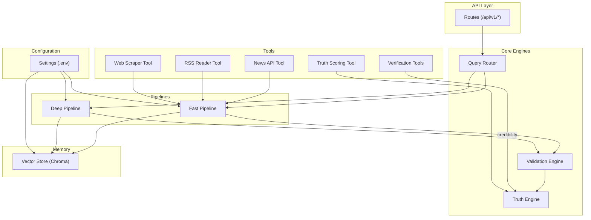
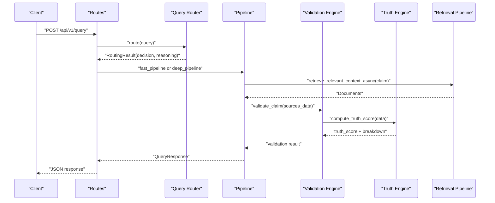
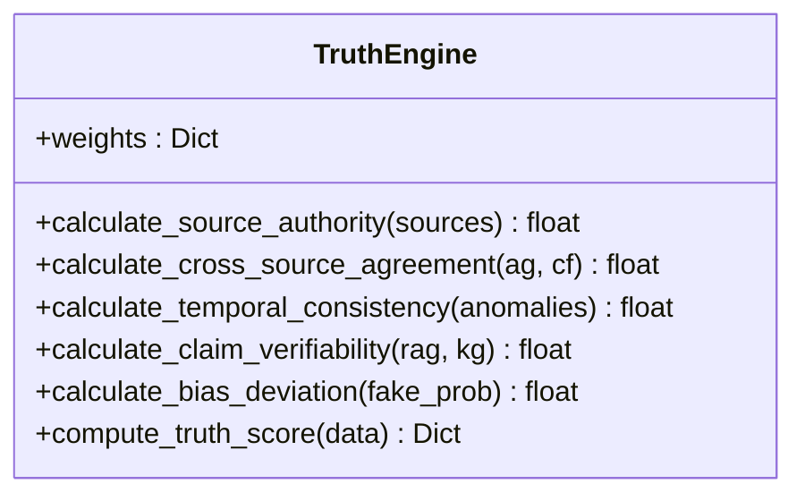
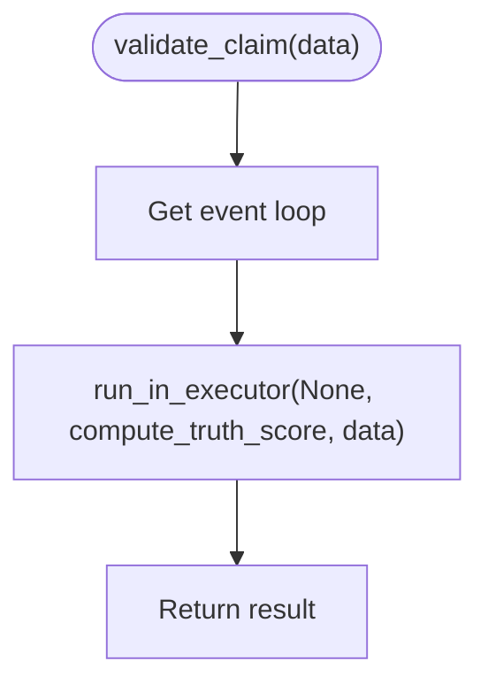
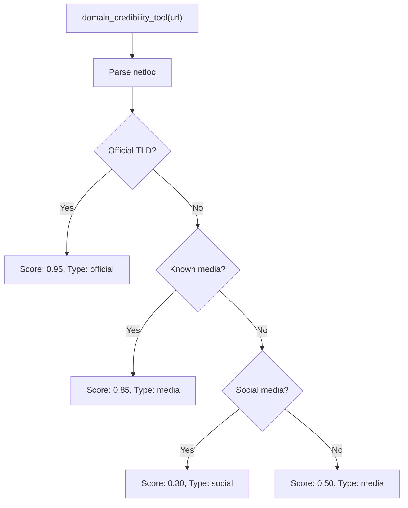
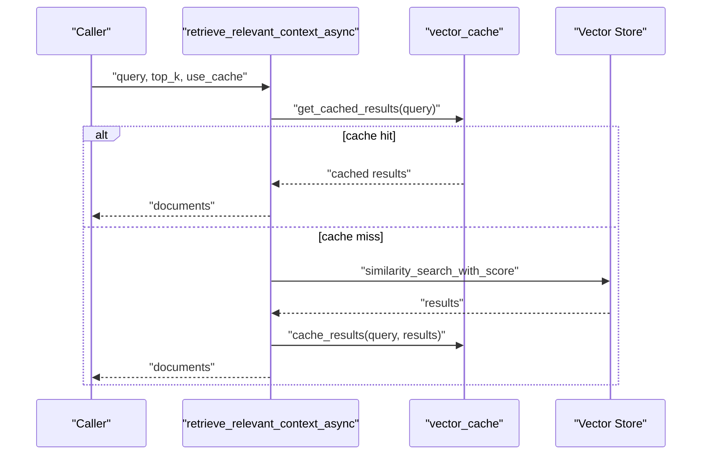
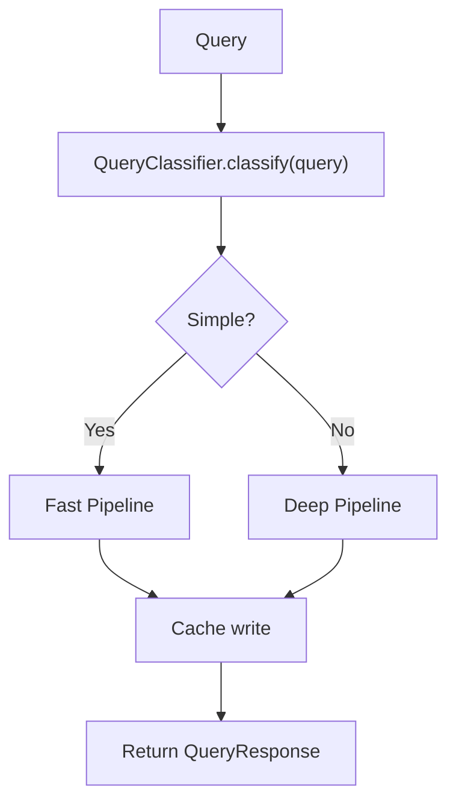
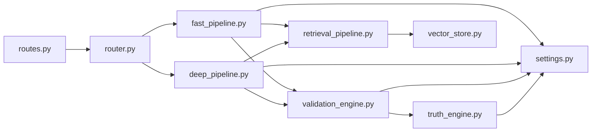

# Verification & Truth Tools

<cite>
**Referenced Files in This Document**
- [README.md](file://veritas-ai/README.md)
- [truth_tools.py](file://veritas-ai/tools/truth_tools.py)
- [verification_tools.py](file://veritas-ai/tools/verification_tools.py)
- [truth_engine.py](file://veritas-ai/core/truth_engine.py)
- [validation_engine.py](file://veritas-ai/core/validation_engine.py)
- [fast_pipeline.py](file://veritas-ai/pipelines/fast_pipeline.py)
- [deep_pipeline.py](file://veritas-ai/pipelines/deep_pipeline.py)
- [retrieval_pipeline.py](file://veritas-ai/pipelines/retrieval_pipeline.py)
- [settings.py](file://veritas-ai/config/settings.py)
- [router.py](file://veritas-ai/core/router.py)
- [routes.py](file://veritas-ai/app/api/routes.py)
- [schemas.py](file://veritas-ai/models/schemas.py)
- [vector_store.py](file://veritas-ai/memory/vector_store.py)
- [cache_layer.py](file://veritas-ai/core/cache_layer.py)
- [news_api.py](file://veritas-ai/tools/news_api.py)
- [rss_reader.py](file://veritas-ai/tools/rss_reader.py)
- [web_scraper.py](file://veritas-ai/tools/web_scraper.py)
</cite>

## Table of Contents
1. [Introduction](#introduction)
2. [Project Structure](#project-structure)
3. [Core Components](#core-components)
4. [Architecture Overview](#architecture-overview)
5. [Detailed Component Analysis](#detailed-component-analysis)
6. [Dependency Analysis](#dependency-analysis)
7. [Performance Considerations](#performance-considerations)
8. [Troubleshooting Guide](#troubleshooting-guide)
9. [Conclusion](#conclusion)
10. [Appendices](#appendices)

## Introduction
This document describes the Verification and Truth Tools ecosystem for fact-checking workflows and evidence validation. It explains the truth verification pipeline, source credibility assessment, cross-referencing mechanisms, confidence scoring, tool integration patterns, external API connections, automated workflows, evidence collection strategies, source prioritization, temporal validation, configuration options, and quality assurance processes.

## Project Structure
The system is organized around:
- Tools: Fact-checking and verification utilities (credibility scoring, RAG retrieval, web scraping, news APIs).
- Core Engines: Truth scoring, validation, routing, and caching.
- Pipelines: Fast and deep verification workflows.
- API: REST endpoints for query resolution, streaming, alerts, trends, and feedback.
- Memory: Vector store for retrieval augmented generation (RAG).
- Configuration: Environment-driven settings for models, retrieval, cache, and external services.

**Diagram sources**
- [routes.py:1-251](file://veritas-ai/app/api/routes.py#L1-L251)
- [router.py:1-182](file://veritas-ai/core/router.py#L1-L182)
- [fast_pipeline.py:1-22](file://veritas-ai/pipelines/fast_pipeline.py#L1-L22)
- [deep_pipeline.py:1-17](file://veritas-ai/pipelines/deep_pipeline.py#L1-L17)
- [validation_engine.py:1-18](file://veritas-ai/core/validation_engine.py#L1-L18)
- [truth_engine.py:1-117](file://veritas-ai/core/truth_engine.py#L1-L117)
- [verification_tools.py:1-52](file://veritas-ai/tools/verification_tools.py#L1-L52)
- [truth_tools.py:1-29](file://veritas-ai/tools/truth_tools.py#L1-L29)
- [news_api.py:1-48](file://veritas-ai/tools/news_api.py#L1-L48)
- [rss_reader.py:1-26](file://veritas-ai/tools/rss_reader.py#L1-L26)
- [web_scraper.py:1-35](file://veritas-ai/tools/web_scraper.py#L1-L35)
- [vector_store.py:1-27](file://veritas-ai/memory/vector_store.py#L1-L27)
- [settings.py:1-83](file://veritas-ai/config/settings.py#L1-L83)

**Section sources**
- [README.md:1-157](file://veritas-ai/README.md#L1-L157)
- [routes.py:1-251](file://veritas-ai/app/api/routes.py#L1-L251)
- [settings.py:1-83](file://veritas-ai/config/settings.py#L1-L83)

## Core Components
- Truth Engine: Computes a multi-factor truth score from source authority, cross-source agreement, temporal consistency, verifiability, and bias deviation.
- Validation Engine: Async executor wrapper around Truth Engine to avoid blocking the event loop.
- Verification Tools: Domain credibility evaluator and RAG-based fact checker.
- Truth Scoring Tool: LangChain tool adapter for Truth Engine.
- Retrieval Pipeline: Vector similarity search with caching and batching.
- Router: Query classification and routing to fast or deep pipelines.
- API Routes: REST endpoints for query, verification, streaming, alerts, trends, feedback, and metrics.
- Configuration: Centralized settings for models, retrieval, cache, and external services.
- Memory: Persistent vector store for RAG.
- Evidence Collection Tools: News API, RSS reader, and web scraper.

**Section sources**
- [truth_engine.py:1-117](file://veritas-ai/core/truth_engine.py#L1-L117)
- [validation_engine.py:1-18](file://veritas-ai/core/validation_engine.py#L1-L18)
- [verification_tools.py:1-52](file://veritas-ai/tools/verification_tools.py#L1-L52)
- [truth_tools.py:1-29](file://veritas-ai/tools/truth_tools.py#L1-L29)
- [retrieval_pipeline.py:1-112](file://veritas-ai/pipelines/retrieval_pipeline.py#L1-L112)
- [router.py:1-182](file://veritas-ai/core/router.py#L1-L182)
- [routes.py:1-251](file://veritas-ai/app/api/routes.py#L1-L251)
- [settings.py:1-83](file://veritas-ai/config/settings.py#L1-L83)
- [vector_store.py:1-27](file://veritas-ai/memory/vector_store.py#L1-L27)
- [news_api.py:1-48](file://veritas-ai/tools/news_api.py#L1-L48)
- [rss_reader.py:1-26](file://veritas-ai/tools/rss_reader.py#L1-L26)
- [web_scraper.py:1-35](file://veritas-ai/tools/web_scraper.py#L1-L35)

## Architecture Overview
The system follows an event-driven, asynchronous architecture:
- API receives queries and routes them via a router to either a fast or deep pipeline.
- Fast pipeline retrieves a small number of sources, validates via Validation Engine, and generates a concise response.
- Deep pipeline executes a full multi-agent workflow asynchronously.
- Truth Engine computes a mathematical truth score from structured inputs.
- Retrieval Pipeline performs vector similarity search with caching and optional filters.
- External integrations include news APIs, RSS feeds, and web scraping.
- Configuration is environment-driven for models, retrieval parameters, cache behavior, and external keys.

**Diagram sources**
- [routes.py:100-128](file://veritas-ai/app/api/routes.py#L100-L128)
- [router.py:99-136](file://veritas-ai/core/router.py#L99-L136)
- [fast_pipeline.py:8-21](file://veritas-ai/pipelines/fast_pipeline.py#L8-L21)
- [validation_engine.py:9-17](file://veritas-ai/core/validation_engine.py#L9-L17)
- [truth_engine.py:78-116](file://veritas-ai/core/truth_engine.py#L78-L116)
- [retrieval_pipeline.py:48-72](file://veritas-ai/pipelines/retrieval_pipeline.py#L48-L72)

## Detailed Component Analysis

### Truth Engine
Computes a weighted truth score from five factors:
- Source Authority: Heuristic domain mapping (official, media, social, unknown).
- Cross-Source Agreement: Ratio of agreeing vs. conflicting sources.
- Temporal Consistency: Penalty for temporal anomalies.
- Claim Verifiability: Based on RAG and KG hits.
- Bias Deviation: Inverse of fake probability.

**Diagram sources**
- [truth_engine.py:3-117](file://veritas-ai/core/truth_engine.py#L3-L117)

**Section sources**
- [truth_engine.py:19-116](file://veritas-ai/core/truth_engine.py#L19-L116)

### Validation Engine
Wraps Truth Engine to run synchronously inside an executor to avoid blocking the event loop.

**Diagram sources**
- [validation_engine.py:9-17](file://veritas-ai/core/validation_engine.py#L9-L17)

**Section sources**
- [validation_engine.py:1-18](file://veritas-ai/core/validation_engine.py#L1-L18)

### Verification Tools
- Domain Credibility Evaluator: Scores domains by TLD/media/social/unknown categories.
- RAG Fact Checker: Asynchronously retrieves relevant context from the vector store.

**Diagram sources**
- [verification_tools.py:5-33](file://veritas-ai/tools/verification_tools.py#L5-L33)

**Section sources**
- [verification_tools.py:1-52](file://veritas-ai/tools/verification_tools.py#L1-L52)

### Truth Scoring Tool
LangChain tool adapter that parses JSON input and delegates to Truth Engine.

**Section sources**
- [truth_tools.py:1-29](file://veritas-ai/tools/truth_tools.py#L1-L29)

### Retrieval Pipeline
Performs vector similarity search with caching, batching, and optional metadata filtering.

**Diagram sources**
- [retrieval_pipeline.py:48-72](file://veritas-ai/pipelines/retrieval_pipeline.py#L48-L72)

**Section sources**
- [retrieval_pipeline.py:29-112](file://veritas-ai/pipelines/retrieval_pipeline.py#L29-L112)

### Router and Pipelines
- Router classifies queries and selects fast or deep path, with local and Redis caching.
- Fast pipeline: minimal retrieval and validation for sub-two-second responses.
- Deep pipeline: runs the full multi-agent pipeline in a background task.

**Diagram sources**
- [router.py:61-81](file://veritas-ai/core/router.py#L61-L81)
- [router.py:124-136](file://veritas-ai/core/router.py#L124-L136)
- [fast_pipeline.py:8-21](file://veritas-ai/pipelines/fast_pipeline.py#L8-L21)
- [deep_pipeline.py:7-16](file://veritas-ai/pipelines/deep_pipeline.py#L7-L16)

**Section sources**
- [router.py:1-182](file://veritas-ai/core/router.py#L1-L182)
- [fast_pipeline.py:1-22](file://veritas-ai/pipelines/fast_pipeline.py#L1-L22)
- [deep_pipeline.py:1-17](file://veritas-ai/pipelines/deep_pipeline.py#L1-L17)

### API Routes
- Authentication: X-API-KEY required for most endpoints.
- Endpoints: /query, /verify-news, /stream-analysis, /alerts, /predictive-trends, /feedback, /metrics, /history.
- Caching and history logging are integrated.

**Section sources**
- [routes.py:21-251](file://veritas-ai/app/api/routes.py#L21-L251)

### Configuration Options
Environment-driven settings include:
- Runtime: timeouts, cache TTL/max entries, history/alert limits, anonymous access toggles.
- Public URLs: base API and WS endpoints.
- Models: Ollama base URL, router/fast model names.
- Vector DB: persist directory, embedding model, retrieval K.
- Redis: host/port/db.
- Collector API keys: NewsAPI and GNews.
- Knowledge Graph: Neo4j URI/user/password.
- HTTP security: CORS origins.
- Performance: parallel tools, streaming, chunk size.

**Section sources**
- [settings.py:13-83](file://veritas-ai/config/settings.py#L13-L83)

### Evidence Collection Strategies
- News Search API: GNews or NewsAPI depending on configured keys.
- RSS Reader: Extracts latest entries from official feeds.
- Web Scraper: Uses Playwright to extract article/main/body content.

**Section sources**
- [news_api.py:18-48](file://veritas-ai/tools/news_api.py#L18-L48)
- [rss_reader.py:4-26](file://veritas-ai/tools/rss_reader.py#L4-L26)
- [web_scraper.py:4-35](file://veritas-ai/tools/web_scraper.py#L4-L35)

### Source Prioritization and Temporal Validation
- Source Authority: Official domains (e.g., .gov/.edu) receive higher scores; social media lower.
- Cross-Source Agreement: Encourages consensus among sources.
- Temporal Consistency: Penalizes temporal anomalies to detect narrative shifts.
- Claim Verifiability: Higher weight for multiple hits in RAG/KG.

**Section sources**
- [truth_engine.py:19-76](file://veritas-ai/core/truth_engine.py#L19-L76)

### Confidence Scoring and Output Schema
- Truth Engine returns a truth score and a breakdown of contributing factors.
- API responses conform to QueryResponse schema with fields for summary, facts, sources, contradictions, probabilities, confidence, status, and timestamp.

**Section sources**
- [truth_engine.py:110-116](file://veritas-ai/core/truth_engine.py#L110-L116)
- [schemas.py:14-26](file://veritas-ai/models/schemas.py#L14-L26)

### Automated Workflows and Quality Assurance
- Fast pipeline for quick responses; deep pipeline for comprehensive analysis.
- Caching at multiple layers (local TTL and Redis) improves latency and throughput.
- Metrics logging tracks routing latencies.
- Feedback loop integrates user corrections into a dataset builder for model refinement.

**Section sources**
- [fast_pipeline.py:8-21](file://veritas-ai/pipelines/fast_pipeline.py#L8-L21)
- [router.py:138-149](file://veritas-ai/core/router.py#L138-L149)
- [routes.py:162-195](file://veritas-ai/app/api/routes.py#L162-L195)

## Dependency Analysis
Key dependencies and relationships:
- API routes depend on router and pipelines.
- Pipelines depend on retrieval pipeline and validation engine.
- Validation engine depends on Truth Engine.
- Tools integrate with external services and are invoked by agents or pipelines.
- Vector store and settings configure RAG and model behavior.

**Diagram sources**
- [routes.py:1-251](file://veritas-ai/app/api/routes.py#L1-L251)
- [router.py:1-182](file://veritas-ai/core/router.py#L1-L182)
- [fast_pipeline.py:1-22](file://veritas-ai/pipelines/fast_pipeline.py#L1-L22)
- [deep_pipeline.py:1-17](file://veritas-ai/pipelines/deep_pipeline.py#L1-L17)
- [validation_engine.py:1-18](file://veritas-ai/core/validation_engine.py#L1-L18)
- [truth_engine.py:1-117](file://veritas-ai/core/truth_engine.py#L1-L117)
- [retrieval_pipeline.py:1-112](file://veritas-ai/pipelines/retrieval_pipeline.py#L1-L112)
- [vector_store.py:1-27](file://veritas-ai/memory/vector_store.py#L1-L27)
- [settings.py:1-83](file://veritas-ai/config/settings.py#L1-L83)

**Section sources**
- [routes.py:1-251](file://veritas-ai/app/api/routes.py#L1-L251)
- [router.py:1-182](file://veritas-ai/core/router.py#L1-L182)
- [fast_pipeline.py:1-22](file://veritas-ai/pipelines/fast_pipeline.py#L1-L22)
- [deep_pipeline.py:1-17](file://veritas-ai/pipelines/deep_pipeline.py#L1-L17)
- [validation_engine.py:1-18](file://veritas-ai/core/validation_engine.py#L1-L18)
- [truth_engine.py:1-117](file://veritas-ai/core/truth_engine.py#L1-L117)
- [retrieval_pipeline.py:1-112](file://veritas-ai/pipelines/retrieval_pipeline.py#L1-L112)
- [vector_store.py:1-27](file://veritas-ai/memory/vector_store.py#L1-L27)
- [settings.py:1-83](file://veritas-ai/config/settings.py#L1-L83)

## Performance Considerations
- Asynchronous retrieval and validation reduce blocking.
- Caching (local TTL and Redis) accelerates repeated queries.
- Batch retrieval supports concurrent queries.
- Adjustable retrieval K and parallel tool limits optimize throughput.
- Streaming and chunk size configurable for high-volume scenarios.

[No sources needed since this section provides general guidance]

## Troubleshooting Guide
Common issues and resolutions:
- API key errors: Ensure X-API-KEY is present and valid for protected endpoints.
- No configured news providers: Set NEWS_API_KEY or GNEWS_API_KEY in environment.
- Vector store initialization failures: Verify CHROMA_PERSIST_DIRECTORY and Ollama availability.
- Slow responses: Tune RETRIEVAL_K, CACHE_TTL_SECONDS, and MAX_PARALLEL_TOOLS.
- Cache misses: Confirm Redis connectivity and CACHE_MAX_ENTRIES/CACHE_TTL_SECONDS.

**Section sources**
- [routes.py:23-31](file://veritas-ai/app/api/routes.py#L23-L31)
- [news_api.py:25-47](file://veritas-ai/tools/news_api.py#L25-L47)
- [vector_store.py:15-26](file://veritas-ai/memory/vector_store.py#L15-L26)
- [settings.py:50-76](file://veritas-ai/config/settings.py#L50-L76)

## Conclusion
The Verification and Truth Tools platform combines a robust truth scoring engine, asynchronous pipelines, and external integrations to deliver fast, accurate, and explainable fact-checking. Its modular design enables scalable deployment, configurable behavior, and continuous improvement through user feedback.

[No sources needed since this section summarizes without analyzing specific files]

## Appendices

### API Endpoints Summary
- POST /api/v1/query: Direct query resolution.
- POST /api/v1/verify-news: Synchronous verification with authentication.
- POST /api/v1/stream-analysis: Authorize WebSocket streaming.
- GET /api/v1/alerts: Fetch active global truth-risk anomalies.
- GET /api/v1/predictive-trends: Emerging misinformation spikes.
- POST /api/v1/feedback: Submit user corrections.
- GET /api/v1/history: Fetch query history.
- GET /api/v1/metrics: System cache and version metrics.
- POST /api/v1/cache/clear: Clear caches.

**Section sources**
- [routes.py:100-251](file://veritas-ai/app/api/routes.py#L100-L251)

### Output Schema Highlights
- QueryResponse includes query, summary, facts, sources, contradictions, fake_probability, confidence_score, truth_score, status, explanation, and timestamp.

**Section sources**
- [schemas.py:14-26](file://veritas-ai/models/schemas.py#L14-L26)