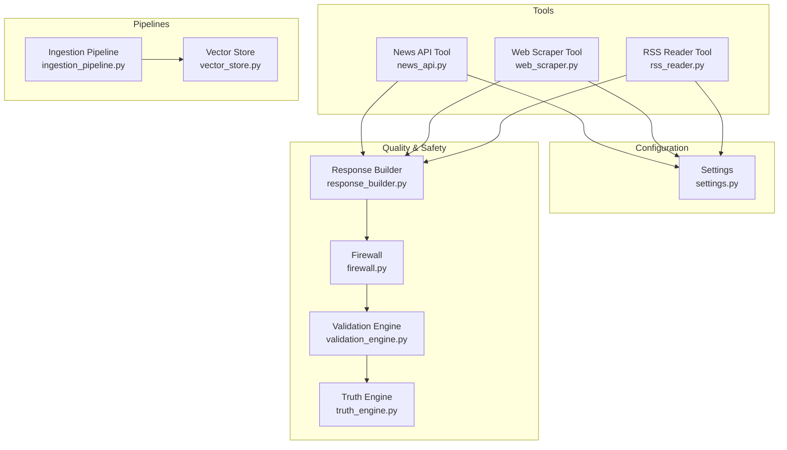
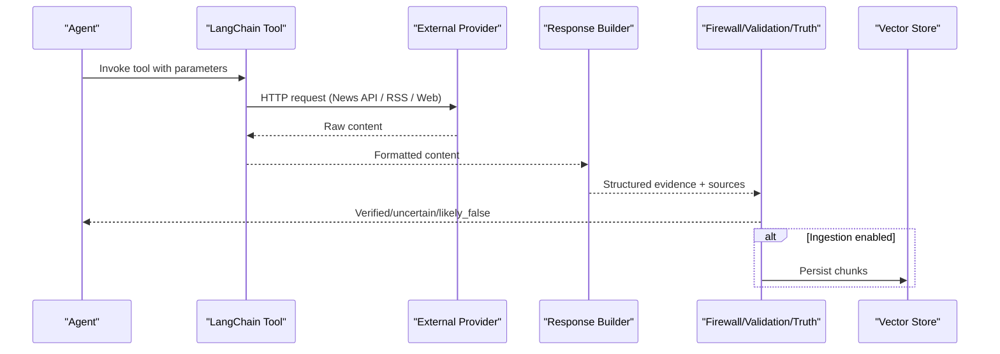
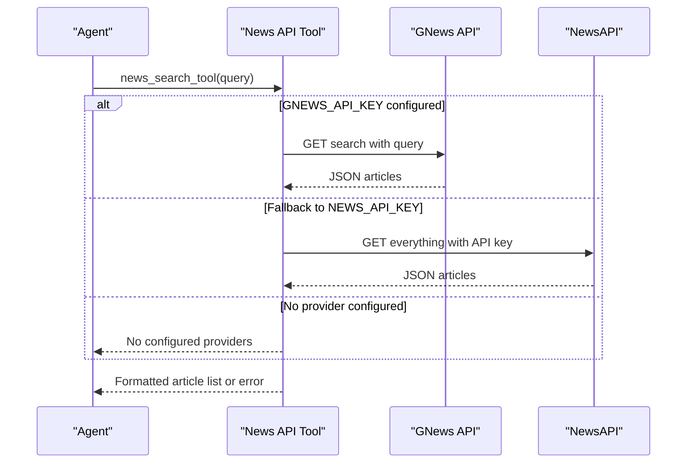
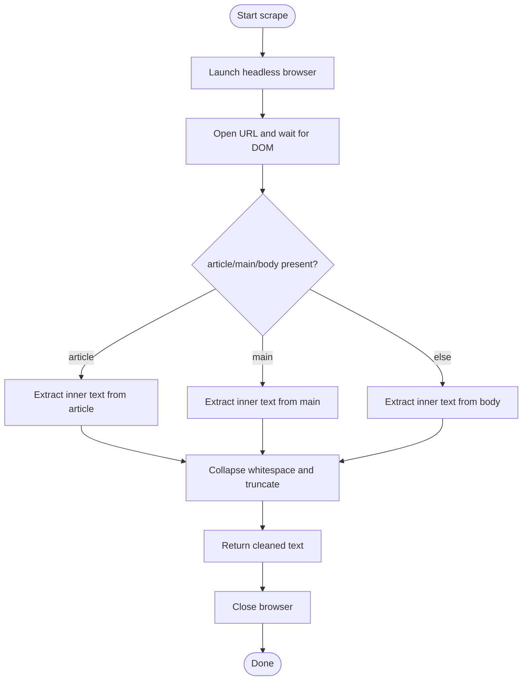
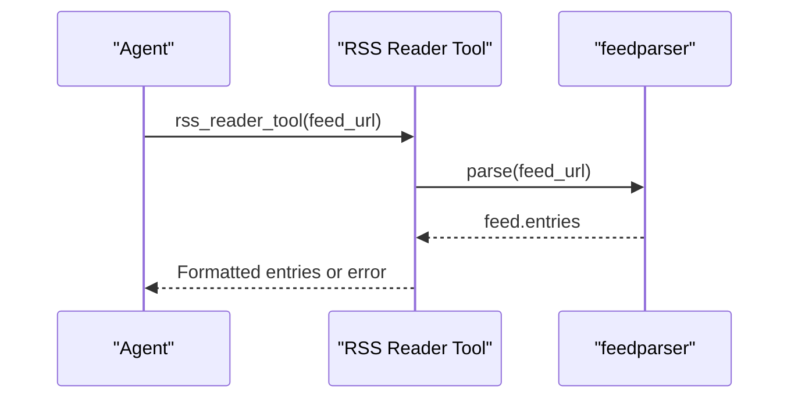
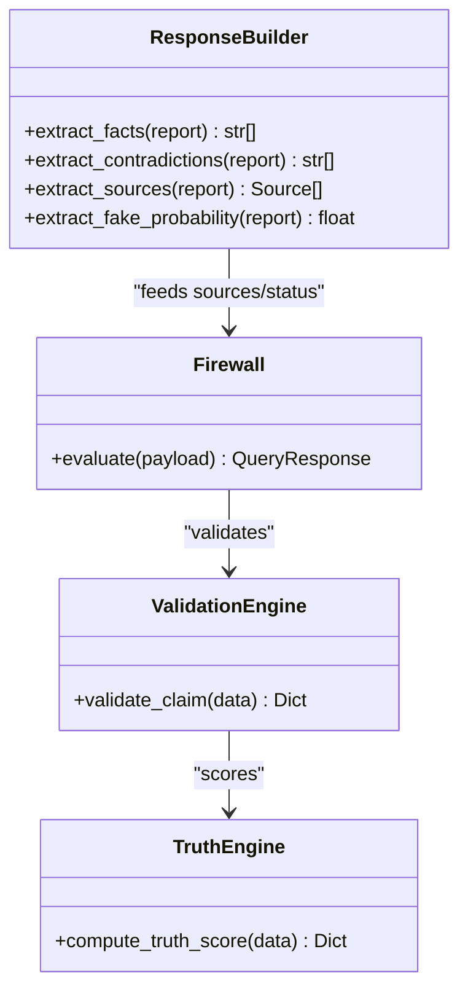
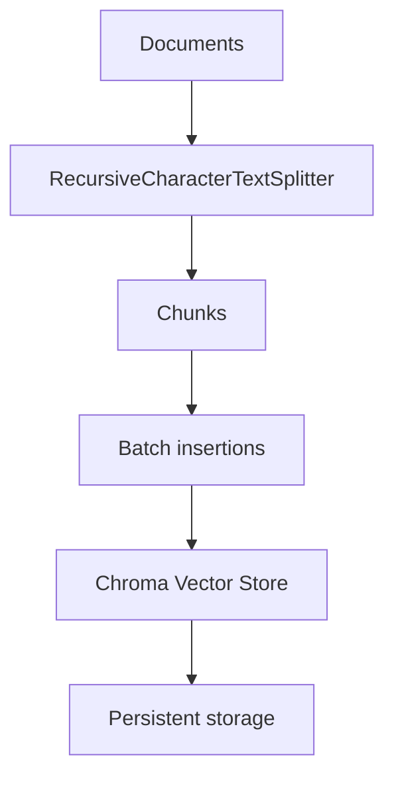
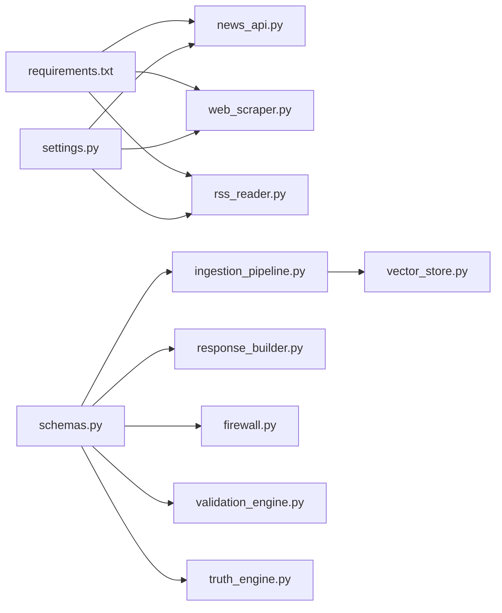

# Web Data Integrations

<cite>
**Referenced Files in This Document**
- [news_api.py](file://veritas-ai/tools/news_api.py)
- [web_scraper.py](file://veritas-ai/tools/web_scraper.py)
- [rss_reader.py](file://veritas-ai/tools/rss_reader.py)
- [settings.py](file://veritas-ai/config/settings.py)
- [vector_store.py](file://veritas-ai/memory/vector_store.py)
- [ingestion_pipeline.py](file://veritas-ai/pipelines/ingestion_pipeline.py)
- [schemas.py](file://veritas-ai/models/schemas.py)
- [security.py](file://veritas-ai/core/security.py)
- [firewall.py](file://veritas-ai/core/firewall.py)
- [validation_engine.py](file://veritas-ai/core/validation_engine.py)
- [truth_engine.py](file://veritas-ai/core/truth_engine.py)
- [response_builder.py](file://veritas-ai/pipelines/response_builder.py)
- [cache_layer.py](file://veritas-ai/core/cache_layer.py)
- [requirements.txt](file://veritas-ai/requirements.txt)
- [Dockerfile](file://veritas-ai/Dockerfile)
</cite>

## Table of Contents
1. [Introduction](#introduction)
2. [Project Structure](#project-structure)
3. [Core Components](#core-components)
4. [Architecture Overview](#architecture-overview)
5. [Detailed Component Analysis](#detailed-component-analysis)
6. [Dependency Analysis](#dependency-analysis)
7. [Performance Considerations](#performance-considerations)
8. [Troubleshooting Guide](#troubleshooting-guide)
9. [Conclusion](#conclusion)
10. [Appendices](#appendices)

## Introduction
This document describes the Web Data Integration tools that power external content acquisition and processing. It covers:
- News API integration with authentication and endpoint selection
- Web Scraper using Playwright for dynamic content extraction
- RSS Reader for feed processing and content aggregation
- Configuration, error handling, performance optimization, and quality assessment patterns

These tools are part of a broader system that ingests, validates, and stores content for downstream reasoning and verification.

## Project Structure
The Web Data Integration capabilities are implemented as LangChain tools under the tools module, backed by configuration, caching, and ingestion pipelines.

**Diagram sources**
- [news_api.py:1-48](file://veritas-ai/tools/news_api.py#L1-L48)
- [web_scraper.py:1-35](file://veritas-ai/tools/web_scraper.py#L1-L35)
- [rss_reader.py:1-26](file://veritas-ai/tools/rss_reader.py#L1-L26)
- [settings.py:1-83](file://veritas-ai/config/settings.py#L1-L83)
- [ingestion_pipeline.py:1-38](file://veritas-ai/pipelines/ingestion_pipeline.py#L1-L38)
- [vector_store.py:1-27](file://veritas-ai/memory/vector_store.py#L1-L27)
- [firewall.py:1-47](file://veritas-ai/core/firewall.py#L1-L47)
- [validation_engine.py:1-18](file://veritas-ai/core/validation_engine.py#L1-L18)
- [truth_engine.py:1-117](file://veritas-ai/core/truth_engine.py#L1-L117)
- [response_builder.py:66-97](file://veritas-ai/pipelines/response_builder.py#L66-L97)

**Section sources**
- [news_api.py:1-48](file://veritas-ai/tools/news_api.py#L1-L48)
- [web_scraper.py:1-35](file://veritas-ai/tools/web_scraper.py#L1-L35)
- [rss_reader.py:1-26](file://veritas-ai/tools/rss_reader.py#L1-L26)
- [settings.py:1-83](file://veritas-ai/config/settings.py#L1-L83)
- [ingestion_pipeline.py:1-38](file://veritas-ai/pipelines/ingestion_pipeline.py#L1-L38)
- [vector_store.py:1-27](file://veritas-ai/memory/vector_store.py#L1-L27)
- [firewall.py:1-47](file://veritas-ai/core/firewall.py#L1-L47)
- [validation_engine.py:1-18](file://veritas-ai/core/validation_engine.py#L1-L18)
- [truth_engine.py:1-117](file://veritas-ai/core/truth_engine.py#L1-L117)
- [response_builder.py:66-97](file://veritas-ai/pipelines/response_builder.py#L66-L97)

## Core Components
- News API Tool: Selects between two providers based on configured keys, fetches recent articles, and formats results.
- Web Scraper Tool: Uses Playwright to render pages and extract main textual content heuristically.
- RSS Reader Tool: Parses RSS feeds and extracts recent entries with titles, links, and summaries.
- Configuration: Centralized settings for API keys, timeouts, and runtime parameters.
- Ingestion Pipeline: Splits content into chunks and persists them to a vector store.
- Quality & Safety: Firewall, Validation Engine, Truth Engine, and Response Builder implement filtering, deduplication, and scoring.

**Section sources**
- [news_api.py:18-47](file://veritas-ai/tools/news_api.py#L18-L47)
- [web_scraper.py:4-34](file://veritas-ai/tools/web_scraper.py#L4-L34)
- [rss_reader.py:4-25](file://veritas-ai/tools/rss_reader.py#L4-L25)
- [settings.py:60-76](file://veritas-ai/config/settings.py#L60-L76)
- [ingestion_pipeline.py:7-37](file://veritas-ai/pipelines/ingestion_pipeline.py#L7-L37)
- [vector_store.py:8-26](file://veritas-ai/memory/vector_store.py#L8-L26)
- [firewall.py:13-46](file://veritas-ai/core/firewall.py#L13-L46)
- [validation_engine.py:9-17](file://veritas-ai/core/validation_engine.py#L9-L17)
- [truth_engine.py:78-116](file://veritas-ai/core/truth_engine.py#L78-L116)
- [response_builder.py:66-97](file://veritas-ai/pipelines/response_builder.py#L66-L97)

## Architecture Overview
The Web Data Integration tools are LangChain-compatible functions invoked by agents. They produce structured content that is validated, scored, and optionally ingested into a vector store.

**Diagram sources**
- [news_api.py:18-47](file://veritas-ai/tools/news_api.py#L18-L47)
- [web_scraper.py:4-34](file://veritas-ai/tools/web_scraper.py#L4-L34)
- [rss_reader.py:4-25](file://veritas-ai/tools/rss_reader.py#L4-L25)
- [response_builder.py:66-97](file://veritas-ai/pipelines/response_builder.py#L66-L97)
- [firewall.py:13-46](file://veritas-ai/core/firewall.py#L13-L46)
- [validation_engine.py:9-17](file://veritas-ai/core/validation_engine.py#L9-L17)
- [truth_engine.py:78-116](file://veritas-ai/core/truth_engine.py#L78-L116)
- [ingestion_pipeline.py:7-37](file://veritas-ai/pipelines/ingestion_pipeline.py#L7-L37)
- [vector_store.py:15-26](file://veritas-ai/memory/vector_store.py#L15-L26)

## Detailed Component Analysis

### News API Integration
- Authentication and provider selection:
  - Uses a GNews key if present; otherwise falls back to NewsAPI with an API key header.
  - Returns a formatted string of up to four articles with title, URL, and description.
- Endpoint behavior:
  - GNews endpoint: search by query, language, and maximum count.
  - NewsAPI endpoint: everything search with pagination and language filter.
- Error handling:
  - Wraps HTTP calls with timeouts and exception handling, returning user-friendly messages.
- Data transformation:
  - Formats article lists into a compact string representation suitable for downstream consumption.

**Diagram sources**
- [news_api.py:18-47](file://veritas-ai/tools/news_api.py#L18-L47)

**Section sources**
- [news_api.py:18-47](file://veritas-ai/tools/news_api.py#L18-L47)
- [settings.py:60-62](file://veritas-ai/config/settings.py#L60-L62)

### Web Scraper Implementation (Playwright)
- Dynamic rendering:
  - Launches a headless Chromium instance, navigates to the URL, waits for DOM content loaded, and extracts text.
- Heuristic extraction:
  - Prefers content inside article or main tags; defaults to body if none found.
- Output sanitization:
  - Collapses whitespace and truncates to a safe length to prevent oversized payloads.
- Error handling:
  - Closes the browser in a finally block and returns a descriptive error message on failure.

**Diagram sources**
- [web_scraper.py:10-34](file://veritas-ai/tools/web_scraper.py#L10-L34)

**Section sources**
- [web_scraper.py:4-34](file://veritas-ai/tools/web_scraper.py#L4-L34)
- [Dockerfile:69-69](file://veritas-ai/Dockerfile#L69-L69)

### RSS Reader
- Feed parsing:
  - Uses feedparser to parse RSS feeds and iterates over the most recent entries.
- Output construction:
  - Builds a concise list of titles, links, and summaries for the top entries.
- Error handling:
  - Returns a descriptive message if parsing fails or no entries are found.

**Diagram sources**
- [rss_reader.py:4-25](file://veritas-ai/tools/rss_reader.py#L4-L25)

**Section sources**
- [rss_reader.py:4-25](file://veritas-ai/tools/rss_reader.py#L4-L25)

### Data Transformation and Quality Assessment
- Filtering and deduplication:
  - Response Builder extracts facts, contradictions, and sources, applying deduplication to lists and URLs.
- Source scoring:
  - Validation and Firewall modules compute source credibility and clamp statuses based on thresholds.
- Truth scoring:
  - Truth Engine computes a weighted truth score from multiple factors (authority, agreement, temporal consistency, verifiability, bias deviation).

**Diagram sources**
- [response_builder.py:66-97](file://veritas-ai/pipelines/response_builder.py#L66-L97)
- [firewall.py:13-46](file://veritas-ai/core/firewall.py#L13-L46)
- [validation_engine.py:9-17](file://veritas-ai/core/validation_engine.py#L9-L17)
- [truth_engine.py:78-116](file://veritas-ai/core/truth_engine.py#L78-L116)

**Section sources**
- [response_builder.py:66-97](file://veritas-ai/pipelines/response_builder.py#L66-L97)
- [firewall.py:13-46](file://veritas-ai/core/firewall.py#L13-L46)
- [validation_engine.py:9-17](file://veritas-ai/core/validation_engine.py#L9-L17)
- [truth_engine.py:78-116](file://veritas-ai/core/truth_engine.py#L78-L116)

### Ingestion Pipeline and Vector Store
- Chunking:
  - Documents are split into overlapping chunks using a recursive splitter with logical separators.
- Batch insertion:
  - Chunks are inserted asynchronously in batches to the vector store to avoid blocking and tensor collisions.
- Persistence:
  - Embeddings are produced locally via Ollama and stored in a persistent Chroma collection.

**Diagram sources**
- [ingestion_pipeline.py:7-37](file://veritas-ai/pipelines/ingestion_pipeline.py#L7-L37)
- [vector_store.py:15-26](file://veritas-ai/memory/vector_store.py#L15-L26)

**Section sources**
- [ingestion_pipeline.py:7-37](file://veritas-ai/pipelines/ingestion_pipeline.py#L7-L37)
- [vector_store.py:8-26](file://veritas-ai/memory/vector_store.py#L8-L26)

## Dependency Analysis
- External libraries:
  - Requests, feedparser, and Playwright are declared for HTTP, RSS parsing, and browser automation respectively.
- Internal dependencies:
  - Tools depend on configuration settings for API keys.
  - Ingestion depends on vector store initialization and settings for persistence.
  - Quality modules depend on shared schemas for typed payloads.

**Diagram sources**
- [requirements.txt:14-16](file://veritas-ai/requirements.txt#L14-L16)
- [news_api.py:1-4](file://veritas-ai/tools/news_api.py#L1-L4)
- [web_scraper.py:1-2](file://veritas-ai/tools/web_scraper.py#L1-L2)
- [rss_reader.py:1-2](file://veritas-ai/tools/rss_reader.py#L1-L2)
- [settings.py:60-62](file://veritas-ai/config/settings.py#L60-L62)
- [ingestion_pipeline.py:1-6](file://veritas-ai/pipelines/ingestion_pipeline.py#L1-L6)
- [vector_store.py:1-6](file://veritas-ai/memory/vector_store.py#L1-L6)
- [schemas.py:5-26](file://veritas-ai/models/schemas.py#L5-L26)
- [response_builder.py:66-97](file://veritas-ai/pipelines/response_builder.py#L66-L97)
- [firewall.py:1-8](file://veritas-ai/core/firewall.py#L1-L8)
- [validation_engine.py:1-7](file://veritas-ai/core/validation_engine.py#L1-L7)
- [truth_engine.py:1-7](file://veritas-ai/core/truth_engine.py#L1-L7)

**Section sources**
- [requirements.txt:14-16](file://veritas-ai/requirements.txt#L14-L16)
- [settings.py:60-62](file://veritas-ai/config/settings.py#L60-L62)
- [schemas.py:5-26](file://veritas-ai/models/schemas.py#L5-L26)

## Performance Considerations
- Network timeouts:
  - News API calls use short timeouts to avoid blocking.
  - Web scraper sets explicit navigation timeouts and truncates output to cap payload sizes.
- Concurrency and batching:
  - Ingestion uses asynchronous batches and a recursive splitter to manage large DOM mappings and prevent CPU bottlenecks.
- Caching:
  - Local TTL cache normalizes queries and reduces repeated computation.
- Container provisioning:
  - Playwright Chromium installation is attempted during build but does not fail the build, enabling graceful degradation if headless rendering is unavailable.

**Section sources**
- [news_api.py:28-28](file://veritas-ai/tools/news_api.py#L28-L28)
- [web_scraper.py:15-26](file://veritas-ai/tools/web_scraper.py#L15-L26)
- [ingestion_pipeline.py:16-31](file://veritas-ai/pipelines/ingestion_pipeline.py#L16-L31)
- [cache_layer.py:15-37](file://veritas-ai/core/cache_layer.py#L15-L37)
- [Dockerfile:69-69](file://veritas-ai/Dockerfile#L69-L69)

## Troubleshooting Guide
- News API errors:
  - Verify API keys are set in environment variables and that the selected provider is reachable.
  - Check for exceptions during HTTP calls and review returned error messages.
- Web scraping failures:
  - Confirm the target URL is accessible and renders content after DOMContentLoaded.
  - Ensure Playwright Chromium is installed; the container attempts installation but may fail in restricted environments.
- RSS parsing issues:
  - Validate the feed URL and confirm the feed is parsable; the tool returns a descriptive message if entries are missing.
- Authentication and rate limits:
  - The system enforces API key validation and fixed-window rate limiting; ensure requests include the required header and respect per-hour limits.
- Vector store persistence:
  - Confirm the persistence directory exists and is writable; embeddings are produced via Ollama and stored in Chroma.

**Section sources**
- [news_api.py:33-45](file://veritas-ai/tools/news_api.py#L33-L45)
- [web_scraper.py:27-34](file://veritas-ai/tools/web_scraper.py#L27-L34)
- [rss_reader.py:24-25](file://veritas-ai/tools/rss_reader.py#L24-L25)
- [security.py:51-84](file://veritas-ai/core/security.py#L51-L84)
- [vector_store.py:20-26](file://veritas-ai/memory/vector_store.py#L20-L26)
- [Dockerfile:69-69](file://veritas-ai/Dockerfile#L69-L69)

## Conclusion
The Web Data Integration tools provide robust mechanisms for acquiring, transforming, and validating external content. By combining configurable providers, resilient scraping, structured parsing, and quality gates, the system supports reliable downstream reasoning and verification workflows. Proper configuration, error handling, and performance tuning ensure scalable operation across diverse environments.

## Appendices

### Configuration Examples
- Environment variables for API keys:
  - Set one of the supported keys to enable the corresponding provider.
- Runtime parameters:
  - Tune timeouts, cache TTL and capacity, and parallelism to balance responsiveness and resource usage.

**Section sources**
- [settings.py:60-76](file://veritas-ai/config/settings.py#L60-L76)

### API Contracts and Data Models
- Query and response models define the shape of inputs and outputs used across the system.

**Section sources**
- [schemas.py:10-26](file://veritas-ai/models/schemas.py#L10-L26)