# Consensus Engine

<cite>
**Referenced Files in This Document**
- [consensus_engine.py](file://veritas-ai/core/consensus_engine.py)
- [truth_engine.py](file://veritas-ai/core/truth_engine.py)
- [explainability_layer.py](file://veritas-ai/core/explainability_layer.py)
- [firewall.py](file://veritas-ai/core/firewall.py)
- [validation_engine.py](file://veritas-ai/core/validation_engine.py)
- [schemas.py](file://veritas-ai/models/schemas.py)
- [multi_agent_pipeline.py](file://veritas-ai/pipelines/multi_agent_pipeline.py)
- [response_builder.py](file://veritas-ai/pipelines/response_builder.py)
- [truth_tools.py](file://veritas-ai/tools/truth_tools.py)
- [verification_tools.py](file://veritas-ai/tools/verification_tools.py)
- [vector_store.py](file://veritas-ai/memory/vector_store.py)
- [settings.py](file://veritas-ai/config/settings.py)
- [test_consensus.py](file://veritas-ai/tests/test_consensus.py)
</cite>

## Table of Contents
1. [Introduction](#introduction)
2. [Project Structure](#project-structure)
3. [Core Components](#core-components)
4. [Architecture Overview](#architecture-overview)
5. [Detailed Component Analysis](#detailed-component-analysis)
6. [Dependency Analysis](#dependency-analysis)
7. [Performance Considerations](#performance-considerations)
8. [Troubleshooting Guide](#troubleshooting-guide)
9. [Conclusion](#conclusion)
10. [Appendices](#appendices)

## Introduction
This document describes the Consensus Engine and its surrounding collaborative decision-making ecosystem within the Veritas AI platform. The Consensus Engine synthesizes multiple confidence signals—LLM-generated baselines, classifier-derived bias corrections, and rule-based truth metrics—into a unified, deterministic confidence score. It integrates with multi-agent validation workflows, explainability, and safety enforcement layers to produce robust, auditable assessments suitable for large-scale, low-latency operations.

## Project Structure
The consensus pipeline spans several modules:
- Core engines: TruthEngine, ConsensusEngine, ExplainabilityLayer, HallucinationFirewall, ValidationEngine
- Pipelines: Multi-agent orchestration and response building
- Tools: Truth scoring and verification utilities
- Models: Shared data schemas
- Config: Runtime tuning knobs

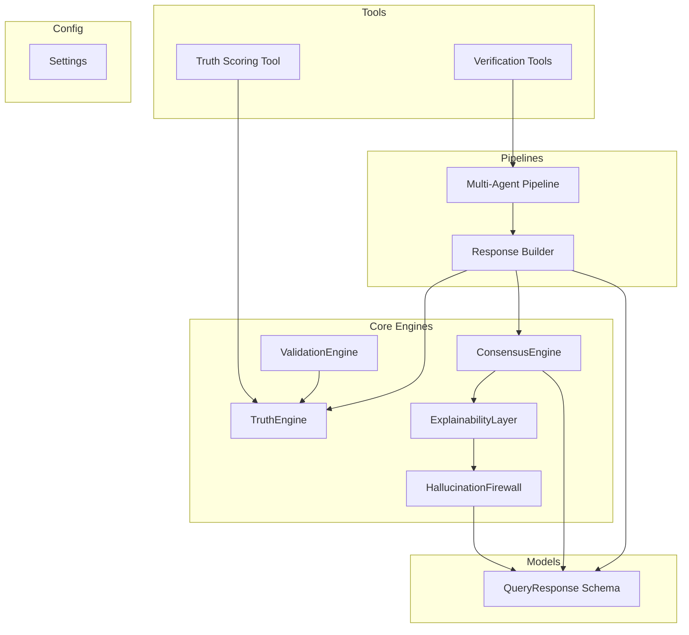

**Diagram sources**
- [multi_agent_pipeline.py](file://veritas-ai/pipelines/multi_agent_pipeline.py)
- [response_builder.py](file://veritas-ai/pipelines/response_builder.py)
- [consensus_engine.py](file://veritas-ai/core/consensus_engine.py)
- [truth_engine.py](file://veritas-ai/core/truth_engine.py)
- [explainability_layer.py](file://veritas-ai/core/explainability_layer.py)
- [firewall.py](file://veritas-ai/core/firewall.py)
- [validation_engine.py](file://veritas-ai/core/validation_engine.py)
- [truth_tools.py](file://veritas-ai/tools/truth_tools.py)
- [verification_tools.py](file://veritas-ai/tools/verification_tools.py)
- [schemas.py](file://veritas-ai/models/schemas.py)
- [settings.py](file://veritas-ai/config/settings.py)

**Section sources**
- [multi_agent_pipeline.py](file://veritas-ai/pipelines/multi_agent_pipeline.py)
- [response_builder.py](file://veritas-ai/pipelines/response_builder.py)
- [consensus_engine.py](file://veritas-ai/core/consensus_engine.py)
- [truth_engine.py](file://veritas-ai/core/truth_engine.py)
- [explainability_layer.py](file://veritas-ai/core/explainability_layer.py)
- [firewall.py](file://veritas-ai/core/firewall.py)
- [validation_engine.py](file://veritas-ai/core/validation_engine.py)
- [truth_tools.py](file://veritas-ai/tools/truth_tools.py)
- [verification_tools.py](file://veritas-ai/tools/verification_tools.py)
- [schemas.py](file://veritas-ai/models/schemas.py)
- [settings.py](file://veritas-ai/config/settings.py)

## Core Components
- ConsensusEngine: Aggregates three confidence streams into a unified score and updates the response payload deterministically.
- TruthEngine: Computes a weighted truth score from multiple structured factors (source authority, cross-source agreement, temporal consistency, verifiability, bias deviation).
- ExplainabilityLayer: Produces human-readable rationales and confidence breakdowns.
- HallucinationFirewall: Applies hard safety thresholds to clamp statuses and prevent unsafe outputs.
- ValidationEngine: Wraps TruthEngine for non-blocking execution in async contexts.
- Response Builder: Parses agent outputs, extracts structured fields, computes truth and confidence, and constructs QueryResponse.
- Multi-Agent Pipeline: Orchestrates parallel agents, caches intermediate results, and invokes the consensus pipeline.

**Section sources**
- [consensus_engine.py](file://veritas-ai/core/consensus_engine.py)
- [truth_engine.py](file://veritas-ai/core/truth_engine.py)
- [explainability_layer.py](file://veritas-ai/core/explainability_layer.py)
- [firewall.py](file://veritas-ai/core/firewall.py)
- [validation_engine.py](file://veritas-ai/core/validation_engine.py)
- [response_builder.py](file://veritas-ai/pipelines/response_builder.py)
- [multi_agent_pipeline.py](file://veritas-ai/pipelines/multi_agent_pipeline.py)

## Architecture Overview
The consensus pipeline operates in stages:
1. Data collection and parallel validation by specialized agents
2. Structured extraction and truth scoring
3. Consensus aggregation
4. Explainability mapping
5. Safety enforcement
6. Alerting and persistence hooks

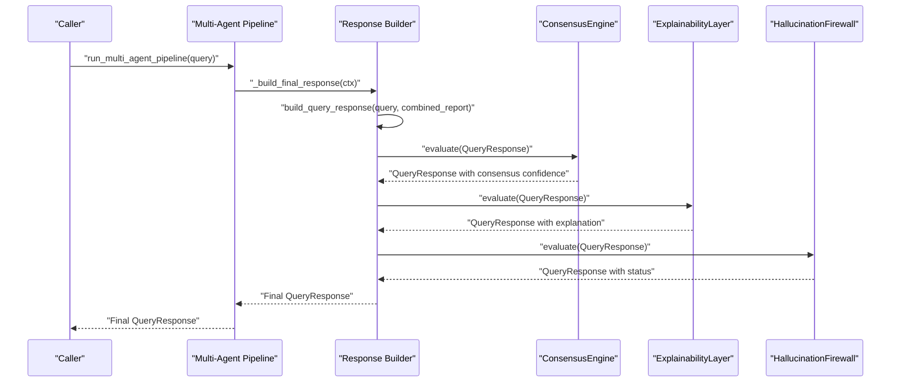

**Diagram sources**
- [multi_agent_pipeline.py](file://veritas-ai/pipelines/multi_agent_pipeline.py)
- [response_builder.py](file://veritas-ai/pipelines/response_builder.py)
- [consensus_engine.py](file://veritas-ai/core/consensus_engine.py)
- [explainability_layer.py](file://veritas-ai/core/explainability_layer.py)
- [firewall.py](file://veritas-ai/core/firewall.py)

## Detailed Component Analysis

### ConsensusEngine
- Purpose: Merge three confidence signals into a single deterministic score.
- Inputs: LLM confidence, classifier-derived confidence (inverted fake probability), and truth score.
- Method: Arithmetic mean across the three signals; result rounded and written back to the response payload.
- Outputs: Updated QueryResponse with consensus confidence.

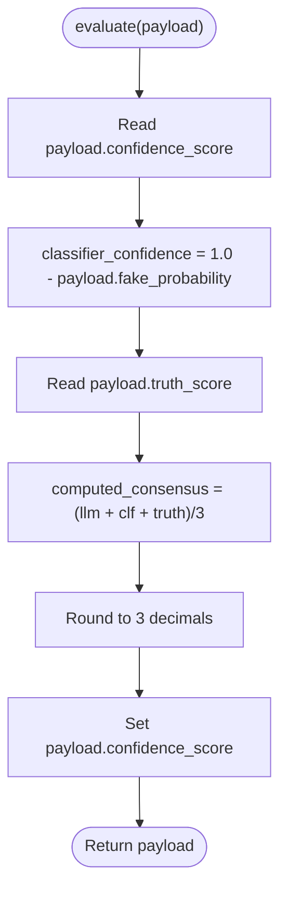

**Diagram sources**
- [consensus_engine.py](file://veritas-ai/core/consensus_engine.py)

**Section sources**
- [consensus_engine.py](file://veritas-ai/core/consensus_engine.py)
- [test_consensus.py](file://veritas-ai/tests/test_consensus.py)

### TruthEngine
- Purpose: Compute a mathematically grounded truth score from five weighted factors.
- Factors:
  - Source authority: Domain trustworthiness mapping
  - Cross-source agreement: Ratio of agreeing vs. conflicting sources
  - Temporal consistency: Penalty for narrative shifts
  - Claim verifiability: Evidence presence in RAG/KG
  - Bias deviation: Inverse of fake-news probability
- Output: Final truth score and per-factor breakdown; logged for observability.

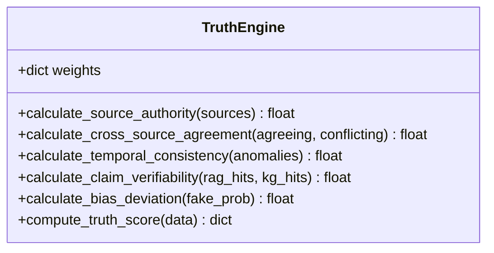

**Diagram sources**
- [truth_engine.py](file://veritas-ai/core/truth_engine.py)

**Section sources**
- [truth_engine.py](file://veritas-ai/core/truth_engine.py)
- [truth_tools.py](file://veritas-ai/tools/truth_tools.py)

### ExplainabilityLayer
- Purpose: Translate numeric scores and contradictions into human-readable explanations.
- Logic:
  - Why true: authoritative sources, low fake probability, absence of contradictions
  - Why false: presence of contradictions, high fake probability, lack of trusted sources
  - Confidence breakdown: authority, agreement, bias
- Output: QueryResponse enriched with explanation metadata.

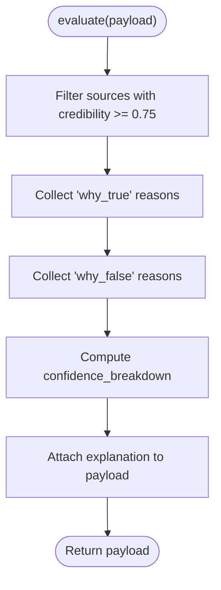

**Diagram sources**
- [explainability_layer.py](file://veritas-ai/core/explainability_layer.py)

**Section sources**
- [explainability_layer.py](file://veritas-ai/core/explainability_layer.py)

### HallucinationFirewall
- Purpose: Enforce hard safety rules to prevent unsafe outputs.
- Rules:
  - If contradictions exceed threshold → status = likely_false
  - Else if trusted sources < 2 → status = uncertain
  - Else if truth_score > 0.75 → status = verified
  - Else status = uncertain
- Output: Potentially overridden QueryResponse.

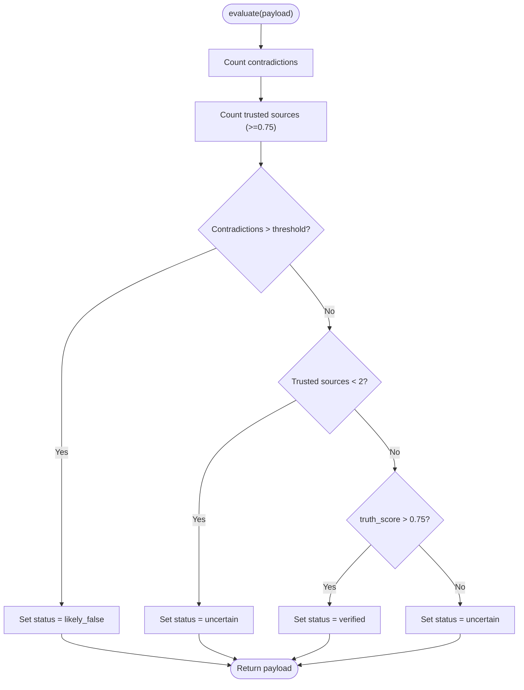

**Diagram sources**
- [firewall.py](file://veritas-ai/core/firewall.py)

**Section sources**
- [firewall.py](file://veritas-ai/core/firewall.py)

### ValidationEngine
- Purpose: Run truth scoring in a thread pool to avoid blocking the event loop.
- Behavior: Delegates to TruthEngine and returns the same structured result.

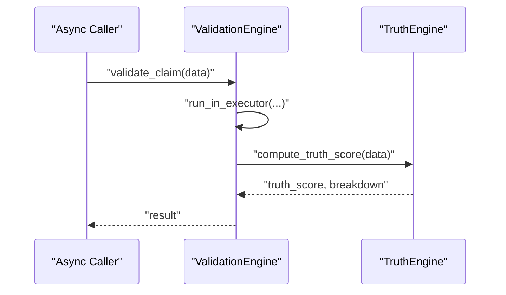

**Diagram sources**
- [validation_engine.py](file://veritas-ai/core/validation_engine.py)
- [truth_engine.py](file://veritas-ai/core/truth_engine.py)

**Section sources**
- [validation_engine.py](file://veritas-ai/core/validation_engine.py)

### Response Builder
- Purpose: Parse agent outputs, extract structured fields, compute truth and confidence, and construct QueryResponse.
- Extraction:
  - Sources: URLs parsed and scored by domain heuristics
  - Facts: Sentence-based deduplication and filtering
  - Contradictions: Keyword-based detection
  - Fake probability: Regex-based extraction from agent output
- Truth scoring: Invokes TruthEngine with computed counts and flags
- Confidence: Averaged between truth score and evidence coverage

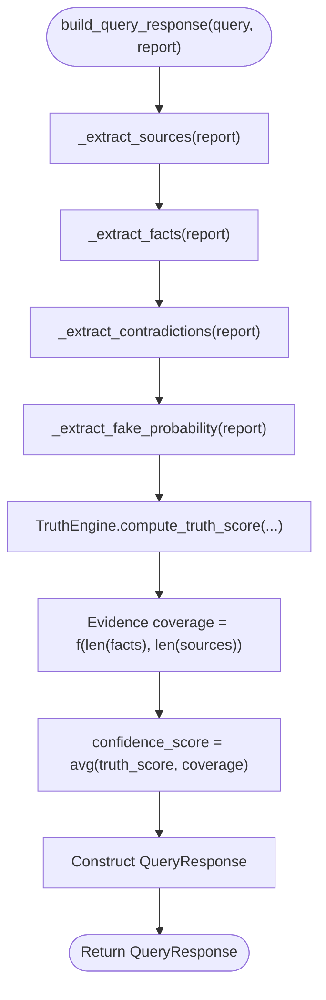

**Diagram sources**
- [response_builder.py](file://veritas-ai/pipelines/response_builder.py)
- [truth_engine.py](file://veritas-ai/core/truth_engine.py)

**Section sources**
- [response_builder.py](file://veritas-ai/pipelines/response_builder.py)

### Multi-Agent Pipeline
- Purpose: Orchestrate parallel agents, cache outputs, and assemble a unified response.
- Parallelism: Semaphore-controlled concurrency for agent tasks
- Caching: Redis-backed hash-based caching for agent outputs and research
- Stages: Research → Parallel validation → Response building → Consensus → Explainability → Firewall → Alerts

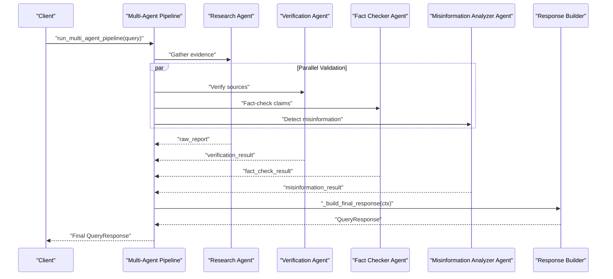

**Diagram sources**
- [multi_agent_pipeline.py](file://veritas-ai/pipelines/multi_agent_pipeline.py)

**Section sources**
- [multi_agent_pipeline.py](file://veritas-ai/pipelines/multi_agent_pipeline.py)

### Tools and Integrations
- Truth Scoring Tool: Exposes TruthEngine via LangChain tool interface with strict input schema.
- Verification Tools:
  - Domain Credibility Evaluator: Heuristic-based source scoring
  - RAG Fact Checker: Async retrieval from vector store

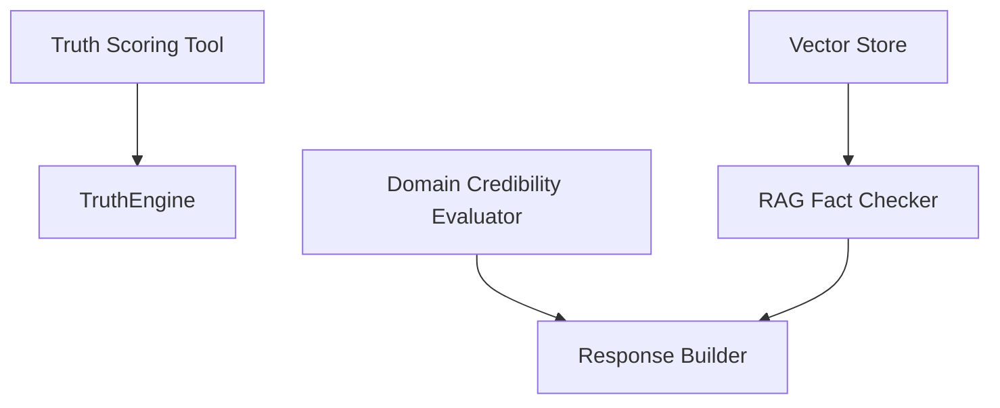

**Diagram sources**
- [truth_tools.py](file://veritas-ai/tools/truth_tools.py)
- [verification_tools.py](file://veritas-ai/tools/verification_tools.py)
- [vector_store.py](file://veritas-ai/memory/vector_store.py)
- [response_builder.py](file://veritas-ai/pipelines/response_builder.py)

**Section sources**
- [truth_tools.py](file://veritas-ai/tools/truth_tools.py)
- [verification_tools.py](file://veritas-ai/tools/verification_tools.py)
- [vector_store.py](file://veritas-ai/memory/vector_store.py)

## Dependency Analysis
- Cohesion: Each engine/module encapsulates a single responsibility (consensus, truth, explainability, safety).
- Coupling:
  - Response Builder depends on TruthEngine and schema
  - ConsensusEngine depends on schema fields
  - ExplainabilityLayer depends on TruthEngine and schema
  - Firewall depends on schema fields
  - Multi-Agent Pipeline orchestrates and passes QueryResponse between modules
- External dependencies:
  - Redis cache for agent output caching
  - Vector DB for RAG fact-checking
  - LangChain tools for external integrations

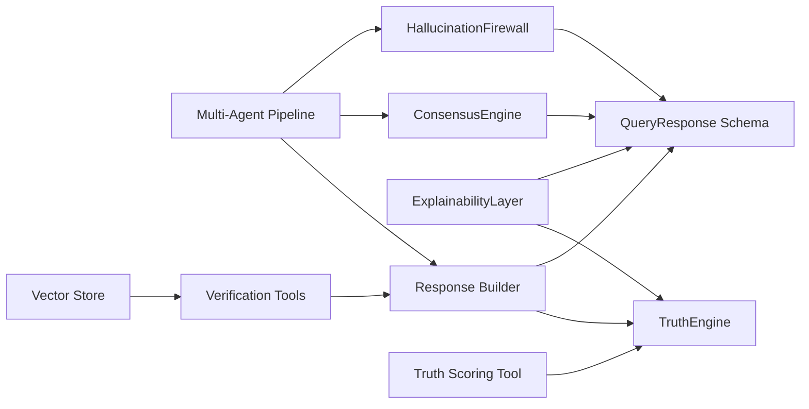

**Diagram sources**
- [response_builder.py](file://veritas-ai/pipelines/response_builder.py)
- [truth_engine.py](file://veritas-ai/core/truth_engine.py)
- [consensus_engine.py](file://veritas-ai/core/consensus_engine.py)
- [explainability_layer.py](file://veritas-ai/core/explainability_layer.py)
- [firewall.py](file://veritas-ai/core/firewall.py)
- [multi_agent_pipeline.py](file://veritas-ai/pipelines/multi_agent_pipeline.py)
- [verification_tools.py](file://veritas-ai/tools/verification_tools.py)
- [truth_tools.py](file://veritas-ai/tools/truth_tools.py)
- [vector_store.py](file://veritas-ai/memory/vector_store.py)
- [schemas.py](file://veritas-ai/models/schemas.py)

**Section sources**
- [multi_agent_pipeline.py](file://veritas-ai/pipelines/multi_agent_pipeline.py)
- [response_builder.py](file://veritas-ai/pipelines/response_builder.py)
- [consensus_engine.py](file://veritas-ai/core/consensus_engine.py)
- [truth_engine.py](file://veritas-ai/core/truth_engine.py)
- [explainability_layer.py](file://veritas-ai/core/explainability_layer.py)
- [firewall.py](file://veritas-ai/core/firewall.py)
- [verification_tools.py](file://veritas-ai/tools/verification_tools.py)
- [truth_tools.py](file://veritas-ai/tools/truth_tools.py)
- [vector_store.py](file://veritas-ai/memory/vector_store.py)
- [schemas.py](file://veritas-ai/models/schemas.py)

## Performance Considerations
- Concurrency and parallelism:
  - Semaphore-controlled agent execution prevents resource saturation
  - Parallel validation reduces end-to-end latency
- Caching:
  - Hash-based caching for agent outputs and research minimizes repeated work
- Lightweight fast path:
  - Dedicated fast pipeline for reduced latency when full analysis is unnecessary
- Asynchronous execution:
  - Non-blocking RAG retrieval and thread-pool execution for heavy computations
- Tunable settings:
  - MAX_PARALLEL_TOOLS controls concurrency
  - PIPELINE_TIMEOUT_SECONDS and task timeouts bound resource usage

**Section sources**
- [multi_agent_pipeline.py](file://veritas-ai/pipelines/multi_agent_pipeline.py)
- [settings.py](file://veritas-ai/config/settings.py)
- [response_builder.py](file://veritas-ai/pipelines/response_builder.py)

## Troubleshooting Guide
- Consensus score not updating:
  - Verify that the response payload contains the expected fields and that evaluate is invoked after truth scoring.
- Unexpected status after firewall:
  - Check contradiction count, trusted source count, and truth score thresholds.
- Explainability missing:
  - Ensure the payload includes sources, contradictions, and fake probability; verify ExplainabilityLayer is called after consensus.
- Validation hangs or blocks:
  - Confirm ValidationEngine is used for truth scoring in async contexts; check thread pool and timeout settings.
- RAG hits zero:
  - Verify vector store initialization and embedding model configuration; ensure retrieval queries are meaningful.

**Section sources**
- [consensus_engine.py](file://veritas-ai/core/consensus_engine.py)
- [firewall.py](file://veritas-ai/core/firewall.py)
- [explainability_layer.py](file://veritas-ai/core/explainability_layer.py)
- [validation_engine.py](file://veritas-ai/core/validation_engine.py)
- [vector_store.py](file://veritas-ai/memory/vector_store.py)

## Conclusion
The Consensus Engine provides a deterministic, multi-signal fusion of LLM confidence, classifier bias correction, and rule-based truth metrics. Combined with parallel multi-agent validation, explainability, and safety enforcement, it delivers robust, auditable assessments at scale. Tuning thresholds, leveraging caching, and controlling concurrency enable performance scaling while maintaining accuracy.

## Appendices

### Agreement Thresholds and Voting Systems
- Cross-source agreement ratio is computed as agreeing_count / (agreeing_count + conflicting_count); used directly in truth scoring.
- No explicit majority vote is applied; consensus merges continuous scores rather than discrete votes.

**Section sources**
- [truth_engine.py](file://veritas-ai/core/truth_engine.py)
- [response_builder.py](file://veritas-ai/pipelines/response_builder.py)

### Dissent Handling Procedures
- Contradictions are extracted and counted; they influence both the truth score (via agreement factor) and the final status via the firewall.
- ExplainabilityLayer surfaces contradictions as “why_false” reasons.

**Section sources**
- [response_builder.py](file://veritas-ai/pipelines/response_builder.py)
- [explainability_layer.py](file://veritas-ai/core/explainability_layer.py)
- [firewall.py](file://veritas-ai/core/firewall.py)

### Integration with Verification Agents
- Multi-Agent Pipeline runs three specialized agents in parallel: Verification, Fact Checking, and Misinformation Analysis.
- Tools include domain credibility evaluation and RAG-based fact-checking.

**Section sources**
- [multi_agent_pipeline.py](file://veritas-ai/pipelines/multi_agent_pipeline.py)
- [verification_tools.py](file://veritas-ai/tools/verification_tools.py)

### Decision Aggregation Methods
- TruthEngine aggregates weighted factors into a single score.
- ConsensusEngine averages three confidence streams (LLM, classifier, truth).
- Response Builder additionally incorporates evidence coverage.

**Section sources**
- [truth_engine.py](file://veritas-ai/core/truth_engine.py)
- [consensus_engine.py](file://veritas-ai/core/consensus_engine.py)
- [response_builder.py](file://veritas-ai/pipelines/response_builder.py)

### Consensus Quality Metrics
- Per-factor breakdown from TruthEngine
- Explanation metadata from ExplainabilityLayer
- Status overrides from HallucinationFirewall
- Observability logging of truth scores

**Section sources**
- [truth_engine.py](file://veritas-ai/core/truth_engine.py)
- [explainability_layer.py](file://veritas-ai/core/explainability_layer.py)
- [firewall.py](file://veritas-ai/core/firewall.py)

### Examples of Scenario Configurations
- Fast path: Use the dedicated fast pipeline for quick assessments.
- Deep path: Full multi-agent orchestration with parallel validation and consensus.
- Custom thresholds: Adjust firewall contradiction threshold and truth score cutoffs as needed.

**Section sources**
- [multi_agent_pipeline.py](file://veritas-ai/pipelines/multi_agent_pipeline.py)
- [firewall.py](file://veritas-ai/core/firewall.py)

### Conflict Resolution Workflows
- If contradictions exceed threshold → status = likely_false
- Else if insufficient trusted sources → status = uncertain
- Else if truth score exceeds verification threshold → status = verified
- Otherwise → status = uncertain

**Section sources**
- [firewall.py](file://veritas-ai/core/firewall.py)

### Consensus Accuracy Optimization
- Increase evidence coverage by expanding retrieved facts and sources
- Improve classifier quality to reduce fake probability
- Tune TruthEngine weights and thresholds to reflect domain priorities

**Section sources**
- [response_builder.py](file://veritas-ai/pipelines/response_builder.py)
- [truth_engine.py](file://veritas-ai/core/truth_engine.py)

### Agent Coordination Strategies
- Parallel execution with semaphore control
- Hash-based caching to avoid redundant work
- Centralized response building and consensus application

**Section sources**
- [multi_agent_pipeline.py](file://veritas-ai/pipelines/multi_agent_pipeline.py)

### Performance Scaling Considerations
- Control MAX_PARALLEL_TOOLS to balance throughput and resource usage
- Use Redis caching for agent outputs and research
- Prefer fast pipeline for low-latency scenarios
- Monitor pipeline timeouts and adjust task-specific timeouts accordingly

**Section sources**
- [settings.py](file://veritas-ai/config/settings.py)
- [multi_agent_pipeline.py](file://veritas-ai/pipelines/multi_agent_pipeline.py)