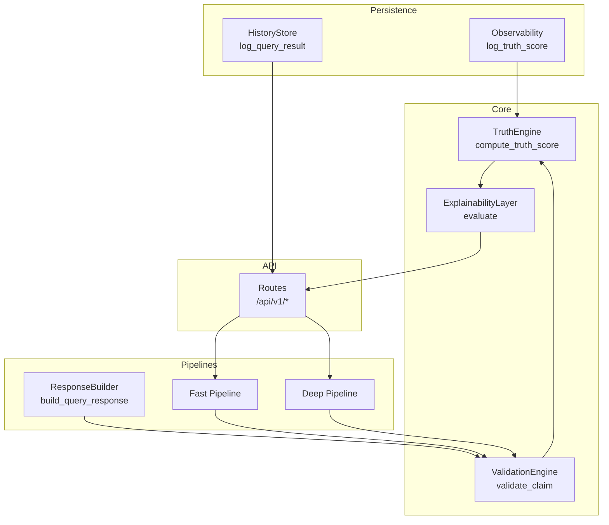
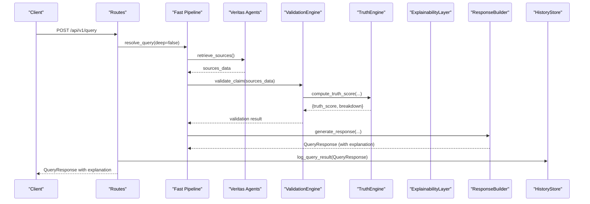
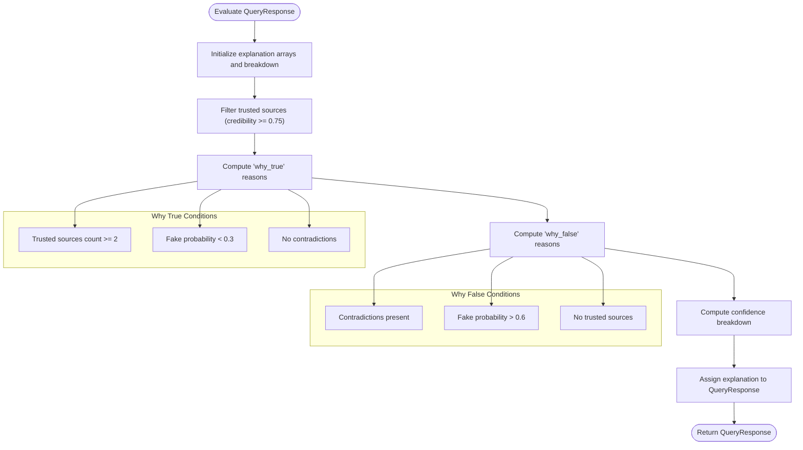
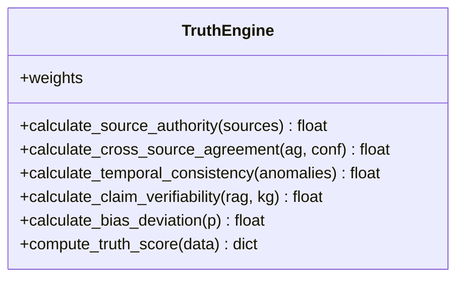
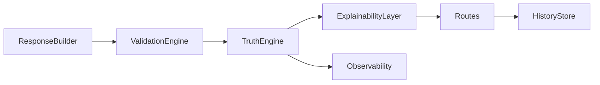

# Explainability Layer

<cite>
**Referenced Files in This Document**
- [explainability_layer.py](file://veritas-ai/core/explainability_layer.py)
- [validation_engine.py](file://veritas-ai/core/validation_engine.py)
- [truth_engine.py](file://veritas-ai/core/truth_engine.py)
- [schemas.py](file://veritas-ai/models/schemas.py)
- [response_builder.py](file://veritas-ai/pipelines/response_builder.py)
- [routes.py](file://veritas-ai/app/api/routes.py)
- [history_store.py](file://veritas-ai/core/history_store.py)
- [observability.py](file://veritas-ai/core/observability.py)
- [veritas_agents.py](file://veritas-ai/agents/veritas_agents.py)
- [fast_pipeline.py](file://veritas-ai/pipelines/fast_pipeline.py)
- [deep_pipeline.py](file://veritas-ai/pipelines/deep_pipeline.py)
- [test_explainability.py](file://veritas-ai/tests/test_explainability.py)
</cite>

## Table of Contents
1. [Introduction](#introduction)
2. [Project Structure](#project-structure)
3. [Core Components](#core-components)
4. [Architecture Overview](#architecture-overview)
5. [Detailed Component Analysis](#detailed-component-analysis)
6. [Dependency Analysis](#dependency-analysis)
7. [Performance Considerations](#performance-considerations)
8. [Troubleshooting Guide](#troubleshooting-guide)
9. [Conclusion](#conclusion)
10. [Appendices](#appendices)

## Introduction
This document describes the Explainability Layer of the Veritas AI platform. It focuses on transparency features and decision justification systems, including reasoning trace generation, explanation formatting, and audit trail creation. It also covers integration with validation engines, score breakdown presentation, and compliance reporting capabilities. The goal is to make the system’s decisions interpretable, auditable, and communicable to stakeholders while maintaining performance and scalability.

## Project Structure
The Explainability Layer is part of the core backend and integrates with the Truth Engine, Validation Engine, and response pipelines. It produces human-readable explanations and structured confidence breakdowns appended to QueryResponse objects. The layer is invoked after truth scoring and before responses are returned to clients.

**Diagram sources**
- [explainability_layer.py:1-52](file://veritas-ai/core/explainability_layer.py#L1-L52)
- [validation_engine.py:1-18](file://veritas-ai/core/validation_engine.py#L1-L18)
- [truth_engine.py:1-117](file://veritas-ai/core/truth_engine.py#L1-L117)
- [response_builder.py:1-145](file://veritas-ai/pipelines/response_builder.py#L1-L145)
- [routes.py:1-251](file://veritas-ai/app/api/routes.py#L1-L251)
- [history_store.py:1-106](file://veritas-ai/core/history_store.py#L1-L106)
- [observability.py:1-75](file://veritas-ai/core/observability.py#L1-L75)
- [fast_pipeline.py:1-22](file://veritas-ai/pipelines/fast_pipeline.py#L1-L22)
- [deep_pipeline.py:1-17](file://veritas-ai/pipelines/deep_pipeline.py#L1-L17)

**Section sources**
- [explainability_layer.py:1-52](file://veritas-ai/core/explainability_layer.py#L1-L52)
- [validation_engine.py:1-18](file://veritas-ai/core/validation_engine.py#L1-L18)
- [truth_engine.py:1-117](file://veritas-ai/core/truth_engine.py#L1-L117)
- [response_builder.py:1-145](file://veritas-ai/pipelines/response_builder.py#L1-L145)
- [routes.py:1-251](file://veritas-ai/app/api/routes.py#L1-L251)
- [history_store.py:1-106](file://veritas-ai/core/history_store.py#L1-L106)
- [observability.py:1-75](file://veritas-ai/core/observability.py#L1-L75)
- [fast_pipeline.py:1-22](file://veritas-ai/pipelines/fast_pipeline.py#L1-L22)
- [deep_pipeline.py:1-17](file://veritas-ai/pipelines/deep_pipeline.py#L1-L17)

## Core Components
- ExplainabilityLayer: Generates “why_true,” “why_false,” and “confidence_breakdown” explanations from a QueryResponse. It uses TruthEngine-derived scores and payload metadata to produce readable rationales and numerical breakdowns.
- TruthEngine: Computes a multi-factor truth score and breakdown, feeding the ExplainabilityLayer with authority, agreement, temporal consistency, verifiability, and bias deviation scores.
- ValidationEngine: Provides a thread-pool validated claim result for fast pipeline integration.
- ResponseBuilder: Constructs QueryResponse objects from raw reports, including sources, contradictions, and fake probability, enabling downstream explainability.
- Schemas: Define QueryResponse with optional explanation field for transparent output.
- API Routes: Orchestrate pipelines, cache, and history logging; responses carry explanations.
- HistoryStore: Persists query results for audit trails and compliance.
- Observability: Logs truth computations and detects drift for monitoring and compliance.

**Section sources**
- [explainability_layer.py:1-52](file://veritas-ai/core/explainability_layer.py#L1-L52)
- [truth_engine.py:1-117](file://veritas-ai/core/truth_engine.py#L1-L117)
- [validation_engine.py:1-18](file://veritas-ai/core/validation_engine.py#L1-L18)
- [response_builder.py:1-145](file://veritas-ai/pipelines/response_builder.py#L1-L145)
- [schemas.py:1-88](file://veritas-ai/models/schemas.py#L1-L88)
- [routes.py:1-251](file://veritas-ai/app/api/routes.py#L1-L251)
- [history_store.py:1-106](file://veritas-ai/core/history_store.py#L1-L106)
- [observability.py:1-75](file://veritas-ai/core/observability.py#L1-L75)

## Architecture Overview
The Explainability Layer sits after truth scoring and before response delivery. It transforms numeric scores and structural facts into human-readable explanations and structured breakdowns. The system maintains auditability through persisted histories and observability logs.

**Diagram sources**
- [routes.py:46-81](file://veritas-ai/app/api/routes.py#L46-L81)
- [fast_pipeline.py:8-22](file://veritas-ai/pipelines/fast_pipeline.py#L8-L22)
- [veritas_agents.py:18-25](file://veritas-ai/agents/veritas_agents.py#L18-L25)
- [validation_engine.py:9-17](file://veritas-ai/core/validation_engine.py#L9-L17)
- [truth_engine.py:78-116](file://veritas-ai/core/truth_engine.py#L78-L116)
- [response_builder.py:111-144](file://veritas-ai/pipelines/response_builder.py#L111-L144)
- [explainability_layer.py:13-51](file://veritas-ai/core/explainability_layer.py#L13-L51)
- [history_store.py:46-63](file://veritas-ai/core/history_store.py#L46-L63)

## Detailed Component Analysis

### ExplainabilityLayer
Purpose:
- Translate truth scoring and payload metadata into user-readable explanations (“why_true,” “why_false”) and a confidence breakdown dictionary.
- Aggregate logic conditions to form coherent rationales for stakeholders.

Key behaviors:
- “Why True”: Adds reasons when authoritative sources confirm the claim, when NLP classification indicates low fake probability, and when no contradictions are present.
- “Why False”: Adds reasons when contradictions are detected, when fake probability exceeds thresholds, and when no high-authority sources support the claim.
- Confidence breakdown: Uses TruthEngine-calculated authority, agreement, and bias deviation, with agreement derived from contradiction counts.

Integration points:
- Depends on TruthEngine for authority and bias calculations.
- Consumes QueryResponse fields: sources, contradictions, fake_probability.

**Diagram sources**
- [explainability_layer.py:13-51](file://veritas-ai/core/explainability_layer.py#L13-L51)

**Section sources**
- [explainability_layer.py:1-52](file://veritas-ai/core/explainability_layer.py#L1-L52)

### TruthEngine
Purpose:
- Compute a weighted truth score and a detailed breakdown across five factors: source authority, cross-source agreement, temporal consistency, claim verifiability, and bias deviation.

Key behaviors:
- Authority: Domain-based scoring for official, media, and social sources.
- Agreement: Ratio of agreeing to total sources.
- Temporal consistency: Penalizes temporal anomalies.
- Verifiability: Based on RAG and KG hits.
- Bias deviation: Inverse of fake probability.

Observability:
- Logs truth scores and breakdowns for drift detection and compliance.

**Diagram sources**
- [truth_engine.py:3-117](file://veritas-ai/core/truth_engine.py#L3-L117)

**Section sources**
- [truth_engine.py:1-117](file://veritas-ai/core/truth_engine.py#L1-L117)
- [observability.py:45-71](file://veritas-ai/core/observability.py#L45-L71)

### ValidationEngine
Purpose:
- Provide a non-blocking validation wrapper around TruthEngine by running compute_truth_score in a thread pool.

Integration:
- Used by fast pipeline to validate claims asynchronously.

**Section sources**
- [validation_engine.py:1-18](file://veritas-ai/core/validation_engine.py#L1-L18)
- [veritas_agents.py:18-25](file://veritas-ai/agents/veritas_agents.py#L18-L25)

### ResponseBuilder
Purpose:
- Construct QueryResponse from raw reports, extracting sources, facts, contradictions, and fake probability, then invoking TruthEngine to compute truth score and confidence.

Integration:
- Supplies inputs to TruthEngine and populates QueryResponse fields consumed by ExplainabilityLayer.

**Section sources**
- [response_builder.py:111-144](file://veritas-ai/pipelines/response_builder.py#L111-L144)

### Schemas
Purpose:
- Define QueryResponse with an optional explanation field to carry explanations and breakdowns.

**Section sources**
- [schemas.py:14-25](file://veritas-ai/models/schemas.py#L14-L25)

### API Routes and Audit Trail
Purpose:
- Resolve queries via fast or deep pipelines, cache results, and persist history for auditability.
- Return QueryResponse with explanations to clients.

Audit trail:
- HistoryStore persists truth_score, confidence_score, status, and summary for compliance and reporting.

**Section sources**
- [routes.py:46-81](file://veritas-ai/app/api/routes.py#L46-L81)
- [history_store.py:46-102](file://veritas-ai/core/history_store.py#L46-L102)

### Test Coverage
Purpose:
- Validate explanation arrays and confidence breakdown mapping.

Highlights:
- Ensures “why_true” and “why_false” arrays are populated based on fake probability and contradictions.
- Confirms authority breakdown reflects credible sources.

**Section sources**
- [test_explainability.py:8-31](file://veritas-ai/tests/test_explainability.py#L8-L31)

## Dependency Analysis
The Explainability Layer depends on TruthEngine and QueryResponse metadata. ValidationEngine and ResponseBuilder feed TruthEngine results into ExplainabilityLayer. API routes coordinate pipelines and persistence. Observability logs truth computations for drift detection.

**Diagram sources**
- [response_builder.py:111-144](file://veritas-ai/pipelines/response_builder.py#L111-L144)
- [validation_engine.py:9-17](file://veritas-ai/core/validation_engine.py#L9-L17)
- [truth_engine.py:78-116](file://veritas-ai/core/truth_engine.py#L78-L116)
- [explainability_layer.py:13-51](file://veritas-ai/core/explainability_layer.py#L13-L51)
- [routes.py:46-81](file://veritas-ai/app/api/routes.py#L46-L81)
- [history_store.py:46-63](file://veritas-ai/core/history_store.py#L46-L63)
- [observability.py:45-71](file://veritas-ai/core/observability.py#L45-L71)

**Section sources**
- [explainability_layer.py:1-52](file://veritas-ai/core/explainability_layer.py#L1-L52)
- [truth_engine.py:1-117](file://veritas-ai/core/truth_engine.py#L1-L117)
- [validation_engine.py:1-18](file://veritas-ai/core/validation_engine.py#L1-L18)
- [response_builder.py:1-145](file://veritas-ai/pipelines/response_builder.py#L1-L145)
- [routes.py:1-251](file://veritas-ai/app/api/routes.py#L1-L251)
- [history_store.py:1-106](file://veritas-ai/core/history_store.py#L1-L106)
- [observability.py:1-75](file://veritas-ai/core/observability.py#L1-L75)

## Performance Considerations
- Non-blocking validation: ValidationEngine runs TruthEngine in a thread pool to avoid blocking the event loop.
- Lightweight explanation computation: ExplainabilityLayer performs simple condition checks and basic arithmetic, adding minimal overhead.
- Caching: API routes cache responses to reduce repeated computations.
- Observability logging: Truth score logs are append-only JSON lines, minimizing I/O contention.

Recommendations:
- Keep explanation logic deterministic and bounded to maintain sub-second latency.
- Monitor drift logs to detect potential model degradation and schedule retraining.
- Consider precomputing authority scores per domain to reduce repeated calculations.

[No sources needed since this section provides general guidance]

## Troubleshooting Guide
Common issues and resolutions:
- Missing explanation in response: Ensure QueryResponse.explanation is populated by ExplainabilityLayer.evaluate and returned by API routes.
- Empty “why_true” or “why_false”: Verify payload fields (sources, contradictions, fake_probability) are correctly set by ResponseBuilder.
- Incorrect confidence breakdown: Confirm TruthEngine weights and score normalization are applied consistently.
- Audit trail gaps: Check HistoryStore initialization and connection timeouts; ensure owner_email is propagated from API routes.

**Section sources**
- [explainability_layer.py:13-51](file://veritas-ai/core/explainability_layer.py#L13-L51)
- [response_builder.py:111-144](file://veritas-ai/pipelines/response_builder.py#L111-L144)
- [routes.py:46-81](file://veritas-ai/app/api/routes.py#L46-L81)
- [history_store.py:23-63](file://veritas-ai/core/history_store.py#L23-L63)

## Conclusion
The Explainability Layer transforms quantitative truth scores and structural facts into transparent, stakeholder-friendly explanations and structured breakdowns. Integrated with ValidationEngine, TruthEngine, and ResponseBuilder, it ensures decisions are interpretable, auditable, and compliant. Observability and history persistence further support monitoring and reporting needs.

[No sources needed since this section summarizes without analyzing specific files]

## Appendices

### Example Scenarios and Explanation Patterns
- High-confidence true claim:
  - “Why True”: Multiple authoritative sources and low fake probability.
  - “Why False”: Empty/false.
  - Confidence breakdown: High authority and agreement; low bias.
- Contradictory claim:
  - “Why True”: None.
  - “Why False”: Contradictions detected and high fake probability.
  - Confidence breakdown: Low agreement; moderate authority; high bias.
- Unverified claim:
  - “Why True”: None.
  - “Why False”: No trusted sources.
  - Confidence breakdown: Moderate authority; neutral agreement; inverse bias.

[No sources needed since this section provides conceptual examples]

### Compliance and Reporting Guidance
- Maintain audit trail: Persist QueryResponse fields (timestamp, query, status, truth_score, confidence_score, summary) via HistoryStore.
- Monitor drift: Use Observability logs to track truth score stability and trigger alerts on significant deviations.
- Standardized output: Return explanation and breakdown in QueryResponse to support external reporting systems.

**Section sources**
- [history_store.py:46-102](file://veritas-ai/core/history_store.py#L46-L102)
- [observability.py:45-71](file://veritas-ai/core/observability.py#L45-L71)
- [schemas.py:14-25](file://veritas-ai/models/schemas.py#L14-L25)