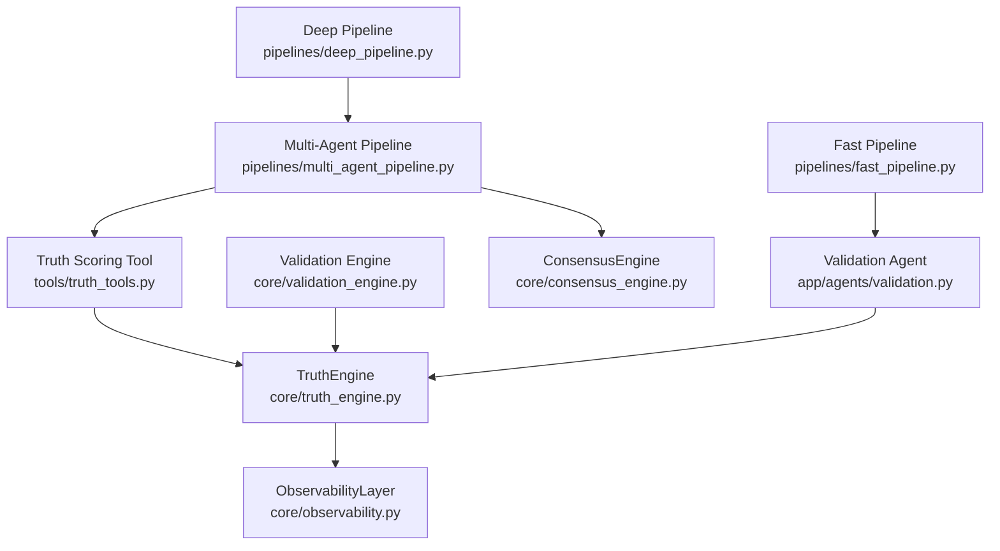
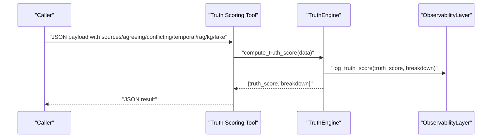
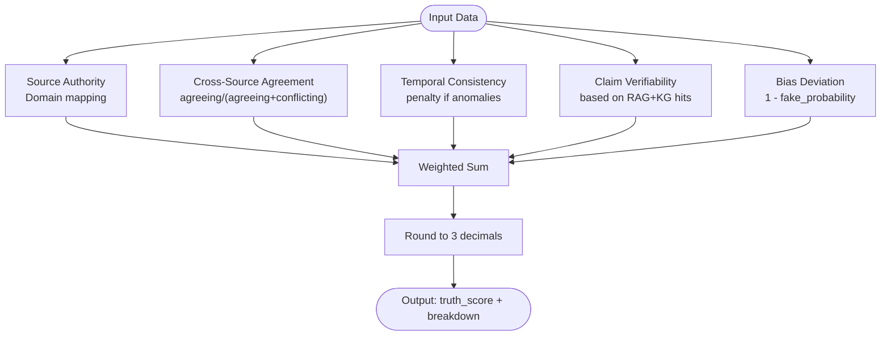
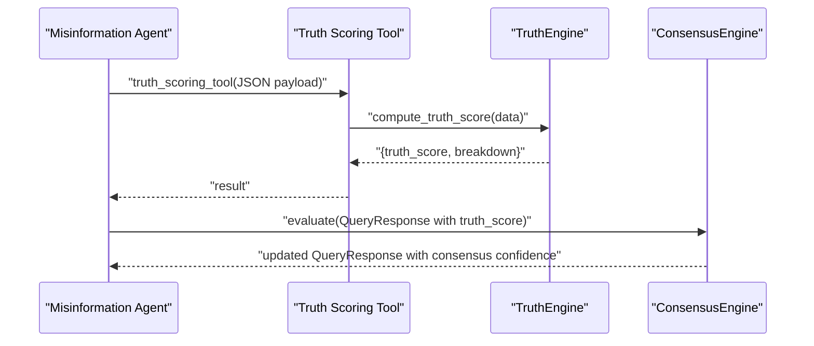
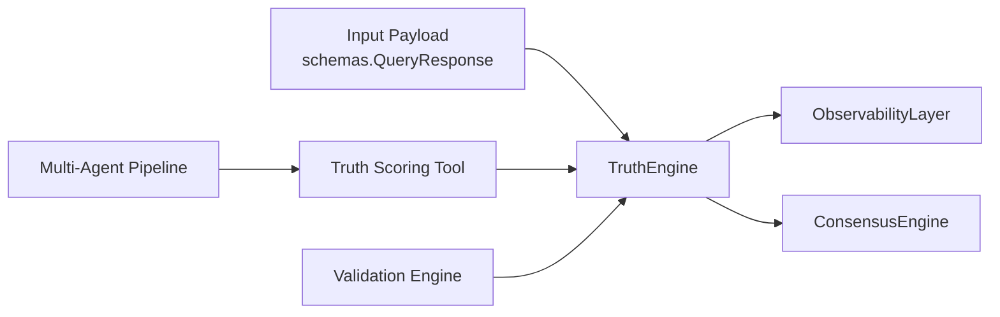

# Truth Engine

<cite>
**Referenced Files in This Document**
- [truth_engine.py](file://veritas-ai/core/truth_engine.py)
- [test_truth_engine.py](file://veritas-ai/tests/test_truth_engine.py)
- [truth_tools.py](file://veritas-ai/tools/truth_tools.py)
- [validation_engine.py](file://veritas-ai/core/validation_engine.py)
- [consensus_engine.py](file://veritas-ai/core/consensus_engine.py)
- [schemas.py](file://veritas-ai/models/schemas.py)
- [observability.py](file://veritas-ai/core/observability.py)
- [multi_agent_pipeline.py](file://veritas-ai/pipelines/multi_agent_pipeline.py)
- [fast_pipeline.py](file://veritas-ai/pipelines/fast_pipeline.py)
- [deep_pipeline.py](file://veritas-ai/pipelines/deep_pipeline.py)
- [validation.py](file://veritas-ai/app/agents/validation.py)
- [TruthGauge.tsx](file://veritas-ai/frontend/components/TruthGauge.tsx)
- [verification_tools.py](file://veritas-ai/tools/verification_tools.py)
- [nlp_tools.py](file://veritas-ai/tools/nlp_tools.py)
- [router.py](file://veritas-ai/core/router.py)
</cite>

## Table of Contents
1. [Introduction](#introduction)
2. [Project Structure](#project-structure)
3. [Core Components](#core-components)
4. [Architecture Overview](#architecture-overview)
5. [Detailed Component Analysis](#detailed-component-analysis)
6. [Dependency Analysis](#dependency-analysis)
7. [Performance Considerations](#performance-considerations)
8. [Troubleshooting Guide](#troubleshooting-guide)
9. [Conclusion](#conclusion)
10. [Appendices](#appendices)

## Introduction
This document explains the Truth Engine’s mathematical truth computation and scoring algorithms. It documents the five-factor scoring system, the weight-based aggregation formula, and how the Truth Engine integrates with the broader verification system. It also covers domain-based source credibility scoring, consensus ratio calculations, anomaly detection penalties, fake news probability inversion, practical examples, weight adjustment strategies, performance optimizations, and guidelines for extending the system with custom factors.

## Project Structure
The Truth Engine resides in the core module and is invoked by tools, pipelines, and agents. It produces a truth score and a per-factor breakdown, which are consumed by downstream systems such as the Consensus Engine and the frontend.

**Diagram sources**
- [truth_engine.py:1-117](file://veritas-ai/core/truth_engine.py#L1-L117)
- [truth_tools.py:1-29](file://veritas-ai/tools/truth_tools.py#L1-L29)
- [validation_engine.py:1-18](file://veritas-ai/core/validation_engine.py#L1-L18)
- [consensus_engine.py:1-26](file://veritas-ai/core/consensus_engine.py#L1-L26)
- [observability.py:1-75](file://veritas-ai/core/observability.py#L1-L75)
- [multi_agent_pipeline.py:1-379](file://veritas-ai/pipelines/multi_agent_pipeline.py#L1-L379)
- [fast_pipeline.py:1-22](file://veritas-ai/pipelines/fast_pipeline.py#L1-L22)
- [deep_pipeline.py:1-17](file://veritas-ai/pipelines/deep_pipeline.py#L1-L17)
- [validation.py:1-314](file://veritas-ai/app/agents/validation.py#L1-L314)

**Section sources**
- [truth_engine.py:1-117](file://veritas-ai/core/truth_engine.py#L1-L117)
- [truth_tools.py:1-29](file://veritas-ai/tools/truth_tools.py#L1-L29)
- [validation_engine.py:1-18](file://veritas-ai/core/validation_engine.py#L1-L18)
- [consensus_engine.py:1-26](file://veritas-ai/core/consensus_engine.py#L1-L26)
- [observability.py:1-75](file://veritas-ai/core/observability.py#L1-L75)
- [multi_agent_pipeline.py:1-379](file://veritas-ai/pipelines/multi_agent_pipeline.py#L1-L379)
- [fast_pipeline.py:1-22](file://veritas-ai/pipelines/fast_pipeline.py#L1-L22)
- [deep_pipeline.py:1-17](file://veritas-ai/pipelines/deep_pipeline.py#L1-L17)
- [validation.py:1-314](file://veritas-ai/app/agents/validation.py#L1-L314)

## Core Components
- TruthEngine: Implements the five-factor scoring system and computes the final weighted truth score. It also logs observability metrics.
- Truth Scoring Tool: Exposes the TruthEngine via a LangChain tool interface.
- Validation Engine: Provides an async wrapper around TruthEngine to avoid blocking the event loop.
- ConsensusEngine: Aggregates LLM confidence, classifier confidence (inverted fake probability), and rule-based truth score into a unified confidence.
- ObservabilityLayer: Logs truth computations and detects drift over a moving window.
- Multi-Agent Pipeline: Integrates truth scoring among verification, fact-checking, and misinformation analysis agents.
- Frontend Gauge: Visualizes the truth score as a colored gauge.

Key implementation references:
- Five-factor scoring and weights: [truth_engine.py:9-17](file://veritas-ai/core/truth_engine.py#L9-L17)
- Source authority calculation: [truth_engine.py:19-42](file://veritas-ai/core/truth_engine.py#L19-L42)
- Cross-source agreement (consensus ratio): [truth_engine.py:44-51](file://veritas-ai/core/truth_engine.py#L44-L51)
- Temporal consistency penalty: [truth_engine.py:53-57](file://veritas-ai/core/truth_engine.py#L53-L57)
- Claim verifiability assessment: [truth_engine.py:59-70](file://veritas-ai/core/truth_engine.py#L59-L70)
- Bias deviation quantification (fake news probability inversion): [truth_engine.py:72-76](file://veritas-ai/core/truth_engine.py#L72-L76)
- Final weighted aggregation: [truth_engine.py:78-100](file://veritas-ai/core/truth_engine.py#L78-L100)
- Observability logging: [truth_engine.py:110-111](file://veritas-ai/core/truth_engine.py#L110-L111), [observability.py:45-71](file://veritas-ai/core/observability.py#L45-L71)

**Section sources**
- [truth_engine.py:1-117](file://veritas-ai/core/truth_engine.py#L1-L117)
- [observability.py:1-75](file://veritas-ai/core/observability.py#L1-L75)

## Architecture Overview
The Truth Engine participates in two primary flows:
- Direct tool invocation via the Truth Scoring Tool.
- Integrated pipeline execution via the Multi-Agent Pipeline, which invokes the Truth Scoring Tool and then merges results with LLM and classifier confidence.

**Diagram sources**
- [truth_tools.py:1-29](file://veritas-ai/tools/truth_tools.py#L1-L29)
- [truth_engine.py:78-117](file://veritas-ai/core/truth_engine.py#L78-L117)
- [observability.py:45-71](file://veritas-ai/core/observability.py#L45-L71)

## Detailed Component Analysis

### Truth Engine: Five-Factor Scoring System
The Truth Engine computes a weighted sum across five factors:
- Source Authority: Domain-based credibility mapping.
- Cross-Source Agreement: Consensus ratio derived from agreeing vs. conflicting sources.
- Temporal Consistency: Penalty applied when temporal anomalies are detected.
- Claim Verifiability: Evidence strength from RAG and KG hits.
- Bias Deviation: Inverse of fake news probability from NLP classification.

Weight-based formula:
- Final Truth Score = Σ(factor_i × weight_i)

Implementation references:
- Weights initialization: [truth_engine.py:11-17](file://veritas-ai/core/truth_engine.py#L11-L17)
- Source authority: [truth_engine.py:19-42](file://veritas-ai/core/truth_engine.py#L19-L42)
- Cross-source agreement: [truth_engine.py:44-51](file://veritas-ai/core/truth_engine.py#L44-L51)
- Temporal consistency: [truth_engine.py:53-57](file://veritas-ai/core/truth_engine.py#L53-L57)
- Claim verifiability: [truth_engine.py:59-70](file://veritas-ai/core/truth_engine.py#L59-L70)
- Bias deviation: [truth_engine.py:72-76](file://veritas-ai/core/truth_engine.py#L72-L76)
- Aggregation and rounding: [truth_engine.py:78-100](file://veritas-ai/core/truth_engine.py#L78-L100)

**Diagram sources**
- [truth_engine.py:19-100](file://veritas-ai/core/truth_engine.py#L19-L100)

**Section sources**
- [truth_engine.py:1-117](file://veritas-ai/core/truth_engine.py#L1-L117)

### Domain-Based Source Credibility Scoring
The Truth Engine assigns domain-based authority scores:
- Official (.gov, .edu, .mil, .int): high weight
- Known media (e.g., major outlets): medium-high
- Social platforms: low
- Others: neutral

Integration points:
- TruthEngine.calculate_source_authority: [truth_engine.py:19-42](file://veritas-ai/core/truth_engine.py#L19-L42)
- Domain Credibility Tool (utility): [verification_tools.py:5-34](file://veritas-ai/tools/verification_tools.py#L5-L34)

Practical example:
- Mixed sources including official and social media are averaged to produce a representative authority score.

**Section sources**
- [truth_engine.py:19-42](file://veritas-ai/core/truth_engine.py#L19-L42)
- [verification_tools.py:5-34](file://veritas-ai/tools/verification_tools.py#L5-L34)

### Cross-Source Agreement Metrics (Consensus Ratio)
Consensus ratio normalizes agreement against conflict:
- If total = 0, defaults to neutral mapping.
- Otherwise, ratio = agreeing / (agreeing + conflicting).

Reference:
- [truth_engine.py:44-51](file://veritas-ai/core/truth_engine.py#L44-L51)

**Section sources**
- [truth_engine.py:44-51](file://veritas-ai/core/truth_engine.py#L44-L51)

### Temporal Consistency Analysis
Temporal consistency penalizes sudden narrative shifts:
- If anomalies detected, applies a lower score; otherwise, a higher score.

Reference:
- [truth_engine.py:53-57](file://veritas-ai/core/truth_engine.py#L53-L57)

**Section sources**
- [truth_engine.py:53-57](file://veritas-ai/core/truth_engine.py#L53-L57)

### Claim Verifiability Assessment
Verifiability is determined by combined RAG and KG hits:
- ≥3 hits: perfect score
- 2 hits: strong score
- 1 hit: moderate score
- 0 hits: weak score

Reference:
- [truth_engine.py:59-70](file://veritas-ai/core/truth_engine.py#L59-L70)

**Section sources**
- [truth_engine.py:59-70](file://veritas-ai/core/truth_engine.py#L59-L70)

### Bias Deviation Quantification (Fake News Probability Inversion)
Bias deviation is the inverse of the fake news probability:
- Bias Deviation = max(0.0, 1.0 − fake_probability)

References:
- [truth_engine.py:72-76](file://veritas-ai/core/truth_engine.py#L72-L76)
- [consensus_engine.py:13-14](file://veritas-ai/core/consensus_engine.py#L13-L14)

**Section sources**
- [truth_engine.py:72-76](file://veritas-ai/core/truth_engine.py#L72-L76)
- [consensus_engine.py:13-14](file://veritas-ai/core/consensus_engine.py#L13-L14)

### Final Truth Score Computation and Breakdown
The Truth Engine returns:
- truth_score: rounded weighted sum
- breakdown: per-factor scores rounded to three decimals

Logging:
- ObservabilityLayer records truth_score and breakdown and monitors drift.

References:
- [truth_engine.py:78-117](file://veritas-ai/core/truth_engine.py#L78-L117)
- [observability.py:45-71](file://veritas-ai/core/observability.py#L45-L71)

**Section sources**
- [truth_engine.py:78-117](file://veritas-ai/core/truth_engine.py#L78-L117)
- [observability.py:45-71](file://veritas-ai/core/observability.py#L45-L71)

### Integration Patterns with the Broader Verification System
- Direct tool usage: LangChain tool wraps TruthEngine for external invocation.
- Async validation: Validation Engine runs TruthEngine in a thread pool to remain responsive.
- Multi-agent pipeline: Truth Scoring Tool is used by the Misinformation Analyzer agent.
- Consensus fusion: ConsensusEngine averages LLM confidence, inverted fake probability, and rule-based truth score.

References:
- Tool wrapper: [truth_tools.py:1-29](file://veritas-ai/tools/truth_tools.py#L1-L29)
- Async validation: [validation_engine.py:1-18](file://veritas-ai/core/validation_engine.py#L1-L18)
- Pipeline integration: [multi_agent_pipeline.py:146-206](file://veritas-ai/pipelines/multi_agent_pipeline.py#L146-L206)
- Consensus fusion: [consensus_engine.py:1-26](file://veritas-ai/core/consensus_engine.py#L1-L26)

**Diagram sources**
- [multi_agent_pipeline.py:146-206](file://veritas-ai/pipelines/multi_agent_pipeline.py#L146-L206)
- [truth_tools.py:1-29](file://veritas-ai/tools/truth_tools.py#L1-L29)
- [truth_engine.py:78-117](file://veritas-ai/core/truth_engine.py#L78-L117)
- [consensus_engine.py:1-26](file://veritas-ai/core/consensus_engine.py#L1-L26)

**Section sources**
- [truth_tools.py:1-29](file://veritas-ai/tools/truth_tools.py#L1-L29)
- [validation_engine.py:1-18](file://veritas-ai/core/validation_engine.py#L1-L18)
- [multi_agent_pipeline.py:146-206](file://veritas-ai/pipelines/multi_agent_pipeline.py#L146-L206)
- [consensus_engine.py:1-26](file://veritas-ai/core/consensus_engine.py#L1-L26)

### Practical Examples of Truth Score Computation
Example 1: Balanced scenario with strong agreement and verifiability
- Inputs: official and reputable sources, no conflicts, no temporal anomalies, multiple hits, low fake probability.
- Expected outcome: high truth score with strong contributions from agreement and verifiability.

Example 2: Social media-heavy scenario
- Inputs: mostly social sources, some conflicts, minor anomalies, few hits, moderate fake probability.
- Expected outcome: moderate truth score, downweighted by authority and verifiability.

Example 3: Contradictory claims
- Inputs: contradicting sources, high fake probability, weak verifiability.
- Expected outcome: low truth score, overridden by firewall logic in downstream processing.

Reference test:
- [test_truth_engine.py:15-36](file://veritas-ai/tests/test_truth_engine.py#L15-L36)

**Section sources**
- [test_truth_engine.py:1-37](file://veritas-ai/tests/test_truth_engine.py#L1-L37)

### Weight Adjustment Strategies
Weights define the relative influence of each factor:
- source_authority: 0.25
- cross_source_agreement: 0.25
- temporal_consistency: 0.15
- claim_verifiability: 0.20
- bias_deviation: 0.15

Adjustment guidelines:
- Increase verifiability weight if RAG/KG coverage improves.
- Increase agreement weight if cross-source corroboration strengthens.
- Adjust temporal weight to reflect domain-specific stability needs.
- Tune bias weight to calibrate sensitivity to fake news classification.

Reference:
- [truth_engine.py:11-17](file://veritas-ai/core/truth_engine.py#L11-L17)

**Section sources**
- [truth_engine.py:11-17](file://veritas-ai/core/truth_engine.py#L11-L17)

### Custom Factor Implementation Guidelines
To add a new factor:
1. Define a new method in TruthEngine to compute the factor score.
2. Add a weight for the factor.
3. Incorporate the factor into compute_truth_score.
4. Extend the breakdown dictionary.
5. Optionally update the observability logging to include the new factor.
6. Integrate via the Truth Scoring Tool or a new tool if needed.

References:
- [truth_engine.py:9-17](file://veritas-ai/core/truth_engine.py#L9-L17)
- [truth_engine.py:78-117](file://veritas-ai/core/truth_engine.py#L78-L117)

**Section sources**
- [truth_engine.py:9-17](file://veritas-ai/core/truth_engine.py#L9-L17)
- [truth_engine.py:78-117](file://veritas-ai/core/truth_engine.py#L78-L117)

## Dependency Analysis
The Truth Engine depends on:
- Input data fields: sources, agreeing_sources, conflicting_sources, temporal_anomalies, rag_hits, kg_hits, fake_probability.
- ObservabilityLayer for logging and drift detection.
- ConsensusEngine for confidence fusion.

**Diagram sources**
- [schemas.py:14-26](file://veritas-ai/models/schemas.py#L14-L26)
- [truth_engine.py:78-117](file://veritas-ai/core/truth_engine.py#L78-L117)
- [observability.py:45-71](file://veritas-ai/core/observability.py#L45-L71)
- [consensus_engine.py:1-26](file://veritas-ai/core/consensus_engine.py#L1-L26)
- [truth_tools.py:1-29](file://veritas-ai/tools/truth_tools.py#L1-L29)
- [validation_engine.py:1-18](file://veritas-ai/core/validation_engine.py#L1-L18)
- [multi_agent_pipeline.py:146-206](file://veritas-ai/pipelines/multi_agent_pipeline.py#L146-L206)

**Section sources**
- [schemas.py:14-26](file://veritas-ai/models/schemas.py#L14-L26)
- [truth_engine.py:78-117](file://veritas-ai/core/truth_engine.py#L78-L117)
- [observability.py:45-71](file://veritas-ai/core/observability.py#L45-L71)
- [consensus_engine.py:1-26](file://veritas-ai/core/consensus_engine.py#L1-L26)
- [truth_tools.py:1-29](file://veritas-ai/tools/truth_tools.py#L1-L29)
- [validation_engine.py:1-18](file://veritas-ai/core/validation_engine.py#L1-L18)
- [multi_agent_pipeline.py:146-206](file://veritas-ai/pipelines/multi_agent_pipeline.py#L146-L206)

## Performance Considerations
- Asynchronous execution: Use Validation Engine to run TruthEngine in a thread pool to avoid blocking the event loop.
- Tool-level caching: The Multi-Agent Pipeline caches agent outputs to reduce repeated computations.
- Router-based routing: The Query Router selects fast or full pipelines based on query characteristics, reducing unnecessary heavy processing.
- Observability drift monitoring: Detects statistical drift in truth scores to maintain quality over time.

References:
- [validation_engine.py:9-17](file://veritas-ai/core/validation_engine.py#L9-L17)
- [multi_agent_pipeline.py:74-92](file://veritas-ai/pipelines/multi_agent_pipeline.py#L74-L92)
- [router.py:83-151](file://veritas-ai/core/router.py#L83-L151)
- [observability.py:20-24](file://veritas-ai/core/observability.py#L20-L24)

**Section sources**
- [validation_engine.py:9-17](file://veritas-ai/core/validation_engine.py#L9-L17)
- [multi_agent_pipeline.py:74-92](file://veritas-ai/pipelines/multi_agent_pipeline.py#L74-L92)
- [router.py:83-151](file://veritas-ai/core/router.py#L83-L151)
- [observability.py:20-24](file://veritas-ai/core/observability.py#L20-L24)

## Troubleshooting Guide
Common issues and resolutions:
- Invalid JSON input to the Truth Scoring Tool: Ensure the payload matches the required structure.
- Missing or zero counts for agreement/conflict: The consensus ratio defaults to a neutral mapping when total equals zero.
- No temporal anomalies but still penalized: Verify the anomaly flag is correctly set based on domain logic.
- Low verifiability despite RAG hits: Confirm RAG and KG hit counts are correctly populated.
- Fake probability inversion yields unexpected bias deviation: Ensure the fake probability is bounded between 0.0 and 1.0.

References:
- [truth_tools.py:20-28](file://veritas-ai/tools/truth_tools.py#L20-L28)
- [truth_engine.py:48-51](file://veritas-ai/core/truth_engine.py#L48-L51)
- [truth_engine.py:63-70](file://veritas-ai/core/truth_engine.py#L63-L70)
- [consensus_engine.py:13-14](file://veritas-ai/core/consensus_engine.py#L13-L14)

**Section sources**
- [truth_tools.py:20-28](file://veritas-ai/tools/truth_tools.py#L20-L28)
- [truth_engine.py:48-51](file://veritas-ai/core/truth_engine.py#L48-L51)
- [truth_engine.py:63-70](file://veritas-ai/core/truth_engine.py#L63-L70)
- [consensus_engine.py:13-14](file://veritas-ai/core/consensus_engine.py#L13-L14)

## Conclusion
The Truth Engine provides a robust, mathematically grounded framework for computing truth scores across five complementary factors. Its integration with the verification system ensures that rule-based assessments are fused with LLM and classifier confidence, while observability and routing mechanisms maintain performance and quality over time. Extensibility is straightforward through adding new factors and weights, and the provided examples and guidelines enable effective tuning and deployment.

## Appendices

### API Definitions
- Truth Scoring Tool Input Schema (JSON):
  - Required keys: sources (list of URLs), agreeing_sources (int), conflicting_sources (int), temporal_anomalies (bool), rag_hits (int), fake_probability (float in [0.0, 1.0])
- Truth Scoring Tool Output Schema (JSON):
  - Fields: truth_score (float), breakdown (dict of factor scores)

References:
- [truth_tools.py:9-18](file://veritas-ai/tools/truth_tools.py#L9-L18)
- [truth_engine.py:102-116](file://veritas-ai/core/truth_engine.py#L102-L116)

**Section sources**
- [truth_tools.py:9-18](file://veritas-ai/tools/truth_tools.py#L9-L18)
- [truth_engine.py:102-116](file://veritas-ai/core/truth_engine.py#L102-L116)

### Frontend Visualization
- TruthGauge renders the truth score as a color-coded SVG gauge with thresholds for red/yellow/green.

References:
- [TruthGauge.tsx:1-52](file://veritas-ai/frontend/components/TruthGauge.tsx#L1-L52)

**Section sources**
- [TruthGauge.tsx:1-52](file://veritas-ai/frontend/components/TruthGauge.tsx#L1-L52)