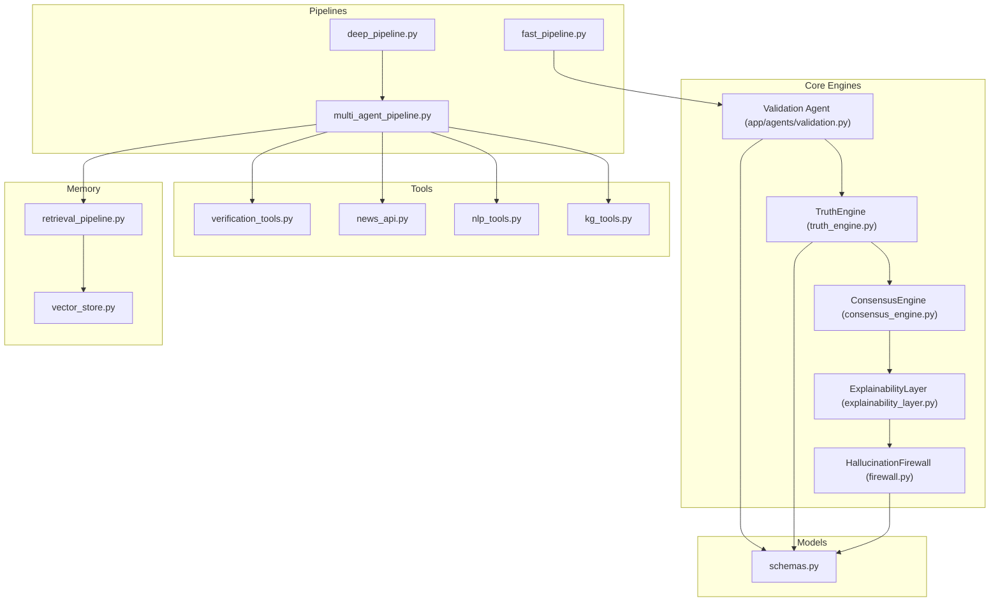
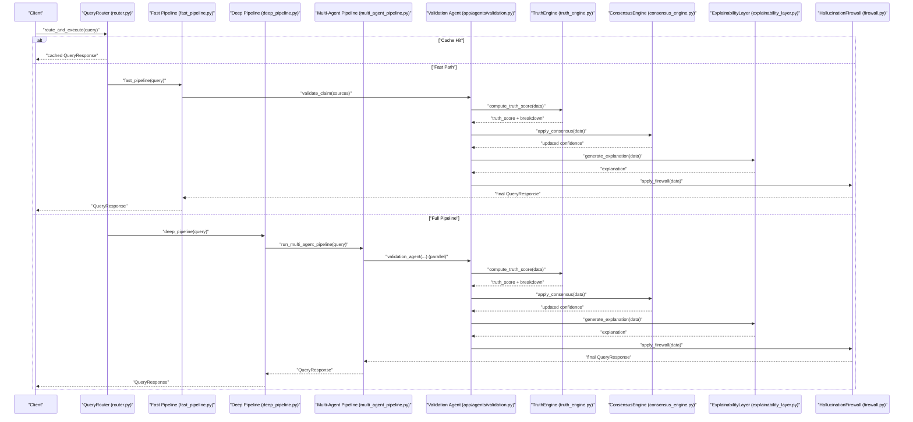
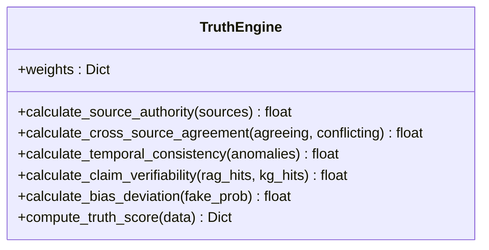
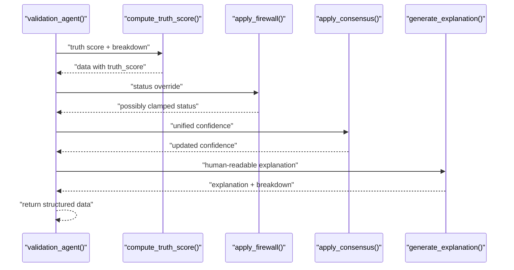
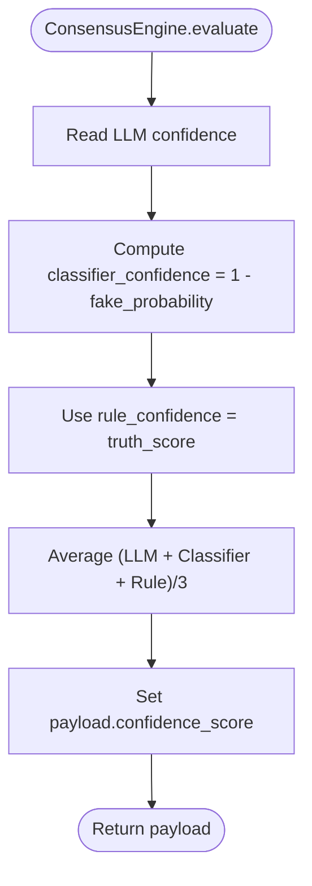
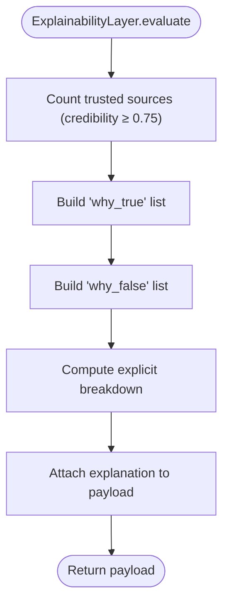
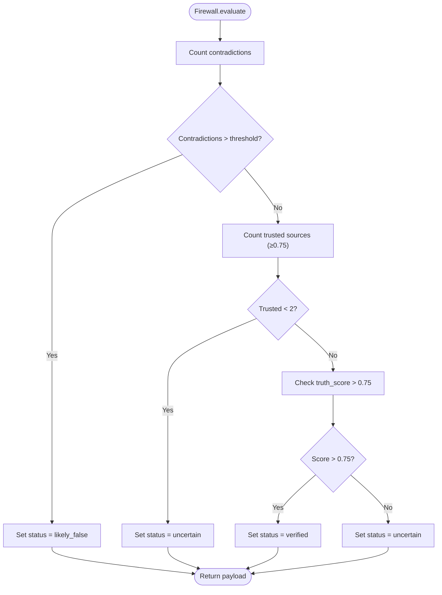
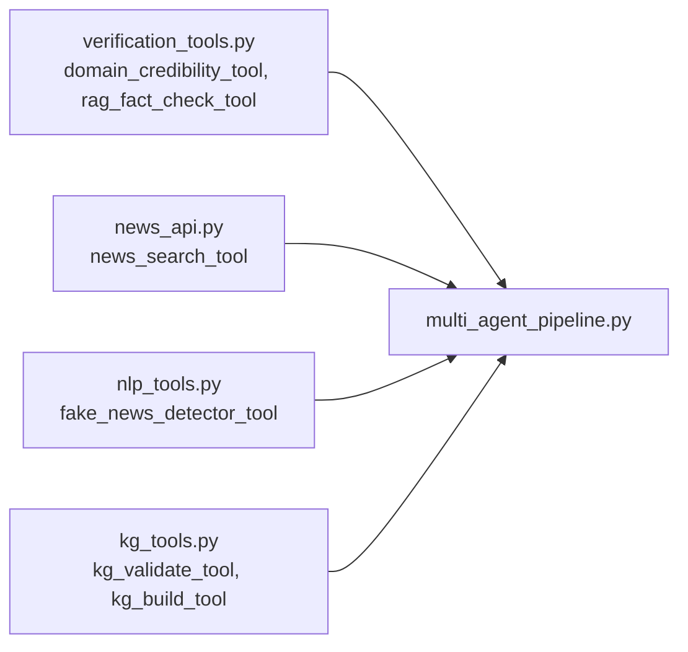
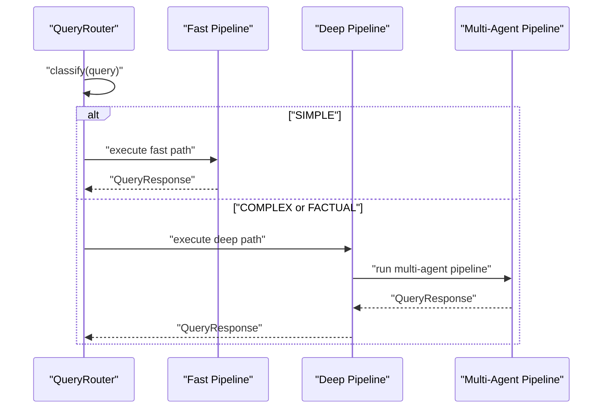
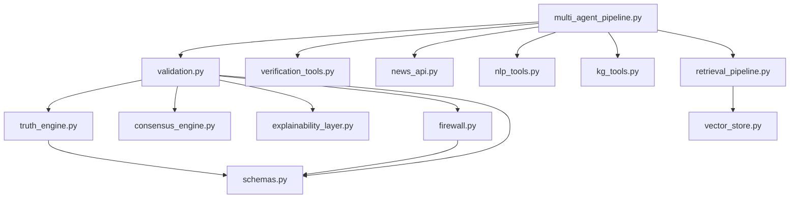

# Validation Engine

<cite>
**Referenced Files in This Document**
- [validation_engine.py](file://veritas-ai/core/validation_engine.py)
- [truth_engine.py](file://veritas-ai/core/truth_engine.py)
- [firewall.py](file://veritas-ai/core/firewall.py)
- [consensus_engine.py](file://veritas-ai/core/consensus_engine.py)
- [explainability_layer.py](file://veritas-ai/core/explainability_layer.py)
- [validation.py](file://veritas-ai/app/agents/validation.py)
- [multi_agent_pipeline.py](file://veritas-ai/pipelines/multi_agent_pipeline.py)
- [fast_pipeline.py](file://veritas-ai/pipelines/fast_pipeline.py)
- [deep_pipeline.py](file://veritas-ai/pipelines/deep_pipeline.py)
- [router.py](file://veritas-ai/core/router.py)
- [schemas.py](file://veritas-ai/models/schemas.py)
- [verification_tools.py](file://veritas-ai/tools/verification_tools.py)
- [news_api.py](file://veritas-ai/tools/news_api.py)
- [nlp_tools.py](file://veritas-ai/tools/nlp_tools.py)
- [kg_tools.py](file://veritas-ai/tools/kg_tools.py)
- [retrieval_pipeline.py](file://veritas-ai/pipelines/retrieval_pipeline.py)
- [vector_store.py](file://veritas-ai/memory/vector_store.py)
- [observability.py](file://veritas-ai/core/observability.py)
</cite>

## Table of Contents
1. [Introduction](#introduction)
2. [Project Structure](#project-structure)
3. [Core Components](#core-components)
4. [Architecture Overview](#architecture-overview)
5. [Detailed Component Analysis](#detailed-component-analysis)
6. [Dependency Analysis](#dependency-analysis)
7. [Performance Considerations](#performance-considerations)
8. [Troubleshooting Guide](#troubleshooting-guide)
9. [Conclusion](#conclusion)
10. [Appendices](#appendices)

## Introduction
This document describes the Validation Engine responsible for multi-layered claim assessment and verification in the Veritas AI system. It covers the truth scoring algorithms, source credibility evaluation, logical consistency validation, integration with external verification services, custom validation rule implementation, automated quality assurance workflows, and the claim processing pipeline. It also explains evidence gathering strategies, validation result interpretation, examples of rule configuration, custom verifier development, performance monitoring, accuracy optimization, and integration with the Truth Engine scoring system.

## Project Structure
The Validation Engine spans core scoring, pipeline orchestration, tools, and memory layers:
- Core engines: TruthEngine, ConsensusEngine, ExplainabilityLayer, HallucinationFirewall
- Pipelines: fast_pipeline, deep_pipeline, multi_agent_pipeline
- Tools: verification, news search, NLP classification, knowledge graph
- Memory: vector store and retrieval
- Models: typed schemas for inputs and outputs
- Observability: metrics and drift detection

**Diagram sources**
- [fast_pipeline.py:1-22](file://veritas-ai/pipelines/fast_pipeline.py#L1-L22)
- [deep_pipeline.py:1-17](file://veritas-ai/pipelines/deep_pipeline.py#L1-L17)
- [multi_agent_pipeline.py:1-379](file://veritas-ai/pipelines/multi_agent_pipeline.py#L1-L379)
- [validation.py:1-314](file://veritas-ai/app/agents/validation.py#L1-L314)
- [truth_engine.py:1-117](file://veritas-ai/core/truth_engine.py#L1-L117)
- [consensus_engine.py:1-26](file://veritas-ai/core/consensus_engine.py#L1-L26)
- [explainability_layer.py:1-52](file://veritas-ai/core/explainability_layer.py#L1-L52)
- [firewall.py:1-47](file://veritas-ai/core/firewall.py#L1-L47)
- [verification_tools.py:1-52](file://veritas-ai/tools/verification_tools.py#L1-L52)
- [news_api.py:1-48](file://veritas-ai/tools/news_api.py#L1-L48)
- [nlp_tools.py:1-52](file://veritas-ai/tools/nlp_tools.py#L1-L52)
- [kg_tools.py:1-50](file://veritas-ai/tools/kg_tools.py#L1-L50)
- [retrieval_pipeline.py:1-112](file://veritas-ai/pipelines/retrieval_pipeline.py#L1-L112)
- [vector_store.py:1-27](file://veritas-ai/memory/vector_store.py#L1-L27)
- [schemas.py:1-88](file://veritas-ai/models/schemas.py#L1-L88)

**Section sources**
- [fast_pipeline.py:1-22](file://veritas-ai/pipelines/fast_pipeline.py#L1-L22)
- [deep_pipeline.py:1-17](file://veritas-ai/pipelines/deep_pipeline.py#L1-L17)
- [multi_agent_pipeline.py:1-379](file://veritas-ai/pipelines/multi_agent_pipeline.py#L1-L379)
- [validation.py:1-314](file://veritas-ai/app/agents/validation.py#L1-L314)
- [truth_engine.py:1-117](file://veritas-ai/core/truth_engine.py#L1-L117)
- [consensus_engine.py:1-26](file://veritas-ai/core/consensus_engine.py#L1-L26)
- [explainability_layer.py:1-52](file://veritas-ai/core/explainability_layer.py#L1-L52)
- [firewall.py:1-47](file://veritas-ai/core/firewall.py#L1-L47)
- [verification_tools.py:1-52](file://veritas-ai/tools/verification_tools.py#L1-L52)
- [news_api.py:1-48](file://veritas-ai/tools/news_api.py#L1-L48)
- [nlp_tools.py:1-52](file://veritas-ai/tools/nlp_tools.py#L1-L52)
- [kg_tools.py:1-50](file://veritas-ai/tools/kg_tools.py#L1-L50)
- [retrieval_pipeline.py:1-112](file://veritas-ai/pipelines/retrieval_pipeline.py#L1-L112)
- [vector_store.py:1-27](file://veritas-ai/memory/vector_store.py#L1-L27)
- [schemas.py:1-88](file://veritas-ai/models/schemas.py#L1-L88)

## Core Components
- TruthEngine: computes a weighted truth score from five factors—source authority, cross-source agreement, temporal consistency, claim verifiability, and bias deviation—and emits breakdown metrics for observability.
- ConsensusEngine: merges LLM confidence, classifier confidence (inverted fake probability), and rule-based truth score into a unified confidence.
- ExplainabilityLayer: generates human-readable explanations (“why true/false”) and a confidence breakdown for stakeholders.
- HallucinationFirewall: applies deterministic overrides to clamp statuses and prevent unverified or contradictory claims from passing.
- Validation Agent: orchestrates truth scoring, firewall, consensus, and explanation generation in a single synchronous unit executed in a thread pool to avoid blocking async loops.
- Tools: domain credibility evaluator, RAG fact checker, news search, NLP fake news detector, and knowledge graph validator/builders.
- Pipelines: fast and deep paths, plus the multi-agent pipeline that coordinates parallel validations and builds the final response.

**Section sources**
- [truth_engine.py:1-117](file://veritas-ai/core/truth_engine.py#L1-L117)
- [consensus_engine.py:1-26](file://veritas-ai/core/consensus_engine.py#L1-L26)
- [explainability_layer.py:1-52](file://veritas-ai/core/explainability_layer.py#L1-L52)
- [firewall.py:1-47](file://veritas-ai/core/firewall.py#L1-L47)
- [validation.py:1-314](file://veritas-ai/app/agents/validation.py#L1-L314)
- [verification_tools.py:1-52](file://veritas-ai/tools/verification_tools.py#L1-L52)
- [news_api.py:1-48](file://veritas-ai/tools/news_api.py#L1-L48)
- [nlp_tools.py:1-52](file://veritas-ai/tools/nlp_tools.py#L1-L52)
- [kg_tools.py:1-50](file://veritas-ai/tools/kg_tools.py#L1-L50)

## Architecture Overview
The Validation Engine integrates asynchronous pipelines with synchronous scoring and deterministic safeguards. Evidence is gathered via tools and memory, truth scoring is computed, and the result is interpreted and constrained by consensus, explainability, and firewall logic.

**Diagram sources**
- [router.py:153-182](file://veritas-ai/core/router.py#L153-L182)
- [fast_pipeline.py:1-22](file://veritas-ai/pipelines/fast_pipeline.py#L1-L22)
- [deep_pipeline.py:1-17](file://veritas-ai/pipelines/deep_pipeline.py#L1-L17)
- [multi_agent_pipeline.py:209-332](file://veritas-ai/pipelines/multi_agent_pipeline.py#L209-L332)
- [validation.py:278-314](file://veritas-ai/app/agents/validation.py#L278-L314)
- [truth_engine.py:78-117](file://veritas-ai/core/truth_engine.py#L78-L117)
- [consensus_engine.py:8-26](file://veritas-ai/core/consensus_engine.py#L8-L26)
- [explainability_layer.py:13-52](file://veritas-ai/core/explainability_layer.py#L13-L52)
- [firewall.py:13-47](file://veritas-ai/core/firewall.py#L13-L47)

## Detailed Component Analysis

### Truth Engine
Computes a multi-factor truth score using fixed weights and factor-specific functions:
- Source Authority: domain-based mapping (.gov/.edu/.mil/.int, reputable media, social, others).
- Cross-Source Agreement: ratio of agreeing to total sources.
- Temporal Consistency: penalty for anomalies.
- Claim Verifiability: based on RAG + KG hits.
- Bias Deviation: inverse of fake-news probability.

**Diagram sources**
- [truth_engine.py:3-117](file://veritas-ai/core/truth_engine.py#L3-L117)

**Section sources**
- [truth_engine.py:1-117](file://veritas-ai/core/truth_engine.py#L1-L117)

### Validation Agent (App-Level)
Aggregates inputs, computes truth score, applies firewall, consensus, and explanation, and returns a structured result. Uses a thread pool to keep async loops responsive.

**Diagram sources**
- [validation.py:278-314](file://veritas-ai/app/agents/validation.py#L278-L314)
- [validation.py:92-127](file://veritas-ai/app/agents/validation.py#L92-L127)
- [validation.py:161-199](file://veritas-ai/app/agents/validation.py#L161-L199)
- [validation.py:203-213](file://veritas-ai/app/agents/validation.py#L203-L213)
- [validation.py:217-274](file://veritas-ai/app/agents/validation.py#L217-L274)

**Section sources**
- [validation.py:1-314](file://veritas-ai/app/agents/validation.py#L1-L314)

### Consensus Engine
Merges three confidence signals:
- LLM confidence
- Classifier confidence (1 − fake probability)
- Rule-based truth score

Then averages them deterministically.

**Diagram sources**
- [consensus_engine.py:8-26](file://veritas-ai/core/consensus_engine.py#L8-L26)

**Section sources**
- [consensus_engine.py:1-26](file://veritas-ai/core/consensus_engine.py#L1-L26)

### Explainability Layer
Generates:
- “Why true” statements based on trusted sources, absence of contradictions, and low fake probability.
- “Why false” statements based on contradictions, high fake probability, and lack of trusted sources.
- Confidence breakdown: authority, agreement, bias.

**Diagram sources**
- [explainability_layer.py:13-52](file://veritas-ai/core/explainability_layer.py#L13-L52)

**Section sources**
- [explainability_layer.py:1-52](file://veritas-ai/core/explainability_layer.py#L1-L52)

### Hallucination Firewall
Deterministic overrides:
- If contradictions exceed threshold → status = likely_false
- If trusted source count < 2 → status = uncertain
- If truth_score > 0.75 → status = verified
- Else → status = uncertain

**Diagram sources**
- [firewall.py:13-47](file://veritas-ai/core/firewall.py#L13-L47)

**Section sources**
- [firewall.py:1-47](file://veritas-ai/core/firewall.py#L1-L47)

### Tools and Evidence Gathering
- Domain Credibility Evaluator: heuristic-based domain scoring and categorization.
- RAG Fact Checker: retrieves relevant context from the vector database asynchronously.
- News Search API: fetches recent articles from configured providers.
- NLP Fake News Detector: classifies content using a transformer model.
- Knowledge Graph Validator/Builder: queries and ingests structured relationships.

**Diagram sources**
- [verification_tools.py:1-52](file://veritas-ai/tools/verification_tools.py#L1-L52)
- [news_api.py:1-48](file://veritas-ai/tools/news_api.py#L1-L48)
- [nlp_tools.py:1-52](file://veritas-ai/tools/nlp_tools.py#L1-L52)
- [kg_tools.py:1-50](file://veritas-ai/tools/kg_tools.py#L1-L50)
- [multi_agent_pipeline.py:146-207](file://veritas-ai/pipelines/multi_agent_pipeline.py#L146-L207)

**Section sources**
- [verification_tools.py:1-52](file://veritas-ai/tools/verification_tools.py#L1-L52)
- [news_api.py:1-48](file://veritas-ai/tools/news_api.py#L1-L48)
- [nlp_tools.py:1-52](file://veritas-ai/tools/nlp_tools.py#L1-L52)
- [kg_tools.py:1-50](file://veritas-ai/tools/kg_tools.py#L1-L50)

### Pipelines and Routing
- Fast Pipeline: minimal retrieval and validation for sub-second responses.
- Deep Pipeline: runs the full multi-agent pipeline in a background task.
- Multi-Agent Pipeline: orchestrates parallel verification, fact-checking, and misinformation analysis, then builds a final response through consensus, explainability, and firewall.
- Router: classifies queries and selects fast path or full pipeline, with caching and metrics.

**Diagram sources**
- [router.py:83-151](file://veritas-ai/core/router.py#L83-L151)
- [fast_pipeline.py:8-22](file://veritas-ai/pipelines/fast_pipeline.py#L8-L22)
- [deep_pipeline.py:7-17](file://veritas-ai/pipelines/deep_pipeline.py#L7-L17)
- [multi_agent_pipeline.py:209-332](file://veritas-ai/pipelines/multi_agent_pipeline.py#L209-L332)

**Section sources**
- [router.py:1-182](file://veritas-ai/core/router.py#L1-L182)
- [fast_pipeline.py:1-22](file://veritas-ai/pipelines/fast_pipeline.py#L1-L22)
- [deep_pipeline.py:1-17](file://veritas-ai/pipelines/deep_pipeline.py#L1-L17)
- [multi_agent_pipeline.py:1-379](file://veritas-ai/pipelines/multi_agent_pipeline.py#L1-L379)

### Validation Result Interpretation
- truth_score: normalized composite score from TruthEngine.
- breakdown: per-factor scores for transparency.
- status: verified, likely_false, or uncertain after firewall.
- explanation: human-readable rationales and confidence breakdown.
- confidence_score: consensus-derived confidence.

**Section sources**
- [validation.py:92-127](file://veritas-ai/app/agents/validation.py#L92-L127)
- [schemas.py:14-26](file://veritas-ai/models/schemas.py#L14-L26)

## Dependency Analysis
The Validation Engine composes modular components with clear boundaries:
- App-level Validation Agent depends on TruthEngine for scoring and on ConsensusEngine, ExplainabilityLayer, and Firewall for downstream processing.
- Multi-agent pipeline orchestrates tools and memory retrieval to feed the Validation Agent.
- Router selects appropriate execution paths and caches results.

**Diagram sources**
- [validation.py:1-314](file://veritas-ai/app/agents/validation.py#L1-L314)
- [truth_engine.py:1-117](file://veritas-ai/core/truth_engine.py#L1-L117)
- [consensus_engine.py:1-26](file://veritas-ai/core/consensus_engine.py#L1-L26)
- [explainability_layer.py:1-52](file://veritas-ai/core/explainability_layer.py#L1-L52)
- [firewall.py:1-47](file://veritas-ai/core/firewall.py#L1-L47)
- [multi_agent_pipeline.py:1-379](file://veritas-ai/pipelines/multi_agent_pipeline.py#L1-L379)
- [verification_tools.py:1-52](file://veritas-ai/tools/verification_tools.py#L1-L52)
- [news_api.py:1-48](file://veritas-ai/tools/news_api.py#L1-L48)
- [nlp_tools.py:1-52](file://veritas-ai/tools/nlp_tools.py#L1-L52)
- [kg_tools.py:1-50](file://veritas-ai/tools/kg_tools.py#L1-L50)
- [retrieval_pipeline.py:1-112](file://veritas-ai/pipelines/retrieval_pipeline.py#L1-L112)
- [vector_store.py:1-27](file://veritas-ai/memory/vector_store.py#L1-L27)
- [schemas.py:1-88](file://veritas-ai/models/schemas.py#L1-L88)

**Section sources**
- [validation.py:1-314](file://veritas-ai/app/agents/validation.py#L1-L314)
- [multi_agent_pipeline.py:1-379](file://veritas-ai/pipelines/multi_agent_pipeline.py#L1-L379)

## Performance Considerations
- Asynchronous execution: retrieval and heavy computations are offloaded to threads or async executors to avoid blocking the event loop.
- Caching: vector store results and agent outputs reduce repeated computation.
- Fast path: designed to complete under a target latency with minimal retrieval and validation.
- Parallelism: multi-agent pipeline executes verification, fact-checking, and misinformation analysis concurrently.
- Metrics and observability: logging truth scores and drift detection enable performance monitoring and anomaly detection.

[No sources needed since this section provides general guidance]

## Troubleshooting Guide
Common issues and remedies:
- NLP model unavailable: ensure transformers and torch are installed; otherwise, the fake news detector returns a message indicating unavailability.
- News API keys missing: configure GNews or NewsAPI keys; otherwise, the news search tool informs that no providers are available.
- Vector store initialization: verify embedding and persistence settings; the vector store initializes with configured parameters.
- Firewall overrides: if a claim is marked likely_false or uncertain, review contradictions, trusted source counts, and truth score thresholds.
- Observability logs: check truth score logs and drift alerts to diagnose scoring anomalies.

**Section sources**
- [nlp_tools.py:8-26](file://veritas-ai/tools/nlp_tools.py#L8-L26)
- [news_api.py:25-47](file://veritas-ai/tools/news_api.py#L25-L47)
- [vector_store.py:15-27](file://veritas-ai/memory/vector_store.py#L15-L27)
- [firewall.py:13-47](file://veritas-ai/core/firewall.py#L13-L47)
- [observability.py:45-72](file://veritas-ai/core/observability.py#L45-L72)

## Conclusion
The Validation Engine provides a robust, multi-layered framework for claim assessment. It combines precise truth scoring, consensus fusion, explainability, and deterministic safeguards to produce reliable, interpretable results. Its integration with external verification services, memory-backed evidence gathering, and observability enables scalable, high-performance operation with strong quality assurance.

[No sources needed since this section summarizes without analyzing specific files]

## Appendices

### Validation Rule Configuration Examples
- Source Authority weights and categories: adjust domain mappings and scores to reflect institutional trust and media reliability.
- Cross-Source Agreement thresholds: tune the balance between agreement and conflict counts to reflect domain-specific reliability.
- Temporal Consistency penalties: modify anomaly detection logic to penalize rapid narrative shifts when applicable.
- Claim Verifiability thresholds: adjust RAG + KG hit counts to require stronger corroboration for higher confidence.
- Bias Deviation inversion: calibrate the relationship between fake-news probability and truth scaling.

**Section sources**
- [validation.py:10-16](file://veritas-ai/app/agents/validation.py#L10-L16)
- [validation.py:19-56](file://veritas-ai/app/agents/validation.py#L19-L56)
- [truth_engine.py:11-17](file://veritas-ai/core/truth_engine.py#L11-L17)

### Custom Verifier Development
To add a custom verifier:
- Define a LangChain tool that encapsulates the verification logic.
- Integrate it into the multi-agent pipeline’s parallel validation stage alongside existing tools.
- Ensure the tool returns structured, parseable results that the Validation Agent can consume.

**Section sources**
- [multi_agent_pipeline.py:146-207](file://veritas-ai/pipelines/multi_agent_pipeline.py#L146-L207)
- [verification_tools.py:1-52](file://veritas-ai/tools/verification_tools.py#L1-L52)

### Performance Monitoring Approaches
- Enable observability logging to capture truth scores and breakdowns.
- Track drift in truth scores over time to detect model or data shifts.
- Monitor pipeline latencies and cache hit rates via the router metrics.
- Use logs to correlate scoring anomalies with upstream data or model changes.

**Section sources**
- [observability.py:45-72](file://veritas-ai/core/observability.py#L45-L72)
- [router.py:138-149](file://veritas-ai/core/router.py#L138-L149)

### Validation Accuracy Optimization and False Positive Reduction
- Increase trusted source thresholds to reduce reliance on weak sources.
- Strengthen contradiction detection and penalize anomalies to lower false positives.
- Calibrate fake-news probability thresholds to align with domain-specific risk profiles.
- Incorporate domain-specific heuristics and leverage KG relationships to improve verifiability.

**Section sources**
- [validation.py:161-199](file://veritas-ai/app/agents/validation.py#L161-L199)
- [validation.py:217-274](file://veritas-ai/app/agents/validation.py#L217-L274)
- [kg_tools.py:39-50](file://veritas-ai/tools/kg_tools.py#L39-L50)

### Integration with Truth Engine Scoring System
- The Validation Agent delegates truth scoring to the TruthEngine and uses the returned breakdown for explainability and observability.
- ConsensusEngine and Firewall operate on the scored payload to finalize confidence and status.

**Section sources**
- [validation_engine.py:9-18](file://veritas-ai/core/validation_engine.py#L9-L18)
- [validation.py:92-127](file://veritas-ai/app/agents/validation.py#L92-L127)
- [truth_engine.py:78-117](file://veritas-ai/core/truth_engine.py#L78-L117)