# Verification Systems

<cite>
**Referenced Files in This Document**
- [README.md](file://README.md)
- [truth_engine.py](file://veritas-ai/core/truth_engine.py)
- [validation_engine.py](file://veritas-ai/core/validation_engine.py)
- [consensus_engine.py](file://veritas-ai/core/consensus_engine.py)
- [explainability_layer.py](file://veritas-ai/core/explainability_layer.py)
- [firewall.py](file://veritas-ai/core/firewall.py)
- [alert_engine.py](file://veritas-ai/core/alert_engine.py)
- [observability.py](file://veritas-ai/core/observability.py)
- [schemas.py](file://veritas-ai/models/schemas.py)
- [llm.py](file://veritas-ai/models/llm.py)
- [multi_llm.py](file://veritas-ai/models/multi_llm.py)
- [router.py](file://veritas-ai/core/router.py)
- [fast_pipeline.py](file://veritas-ai/pipelines/fast_pipeline.py)
- [deep_pipeline.py](file://veritas-ai/pipelines/deep_pipeline.py)
- [truth_tools.py](file://veritas-ai/tools/truth_tools.py)
- [security.py](file://veritas-ai/core/security.py)
- [main.py](file://veritas-ai/app/main.py)
</cite>

## Table of Contents
1. [Introduction](#introduction)
2. [Project Structure](#project-structure)
3. [Core Components](#core-components)
4. [Architecture Overview](#architecture-overview)
5. [Detailed Component Analysis](#detailed-component-analysis)
6. [Dependency Analysis](#dependency-analysis)
7. [Performance Considerations](#performance-considerations)
8. [Troubleshooting Guide](#troubleshooting-guide)
9. [Conclusion](#conclusion)
10. [Appendices](#appendices)

## Introduction
This document describes the Verification Systems that power mathematical truth assessment and collaborative validation within the Veritas AI platform. It focuses on:
- Truth Engine: mathematical verification processes, claim scoring, and evidence weight calculations
- Validation Engine: multi-faceted claim assessment including fact-checking, source credibility evaluation, and logical consistency checks
- Consensus Engine: collaborative decision-making, agent agreement protocols, and conflict resolution strategies
- Explainability Layer: transparency features, reasoning trace generation, and decision justification systems
It also provides implementation examples for custom validation rules, scoring modifications, and integration with external verification services, alongside performance optimization, accuracy tuning, and quality assurance methodologies.

## Project Structure
The repository organizes verification logic into modular components:
- Core engines: Truth Engine, Validation Engine, Consensus Engine, Explainability Layer, Firewall, Alert Engine, Observability Layer
- Data models: Pydantic schemas for queries and responses
- Pipelines: Fast and Deep verification pipelines
- Tools: LangChain tools exposing Truth Engine capabilities
- Security and routing: API key enforcement, rate limiting, and intelligent query routing
- Application entry point: FastAPI app with startup/shutdown lifecycle and middleware

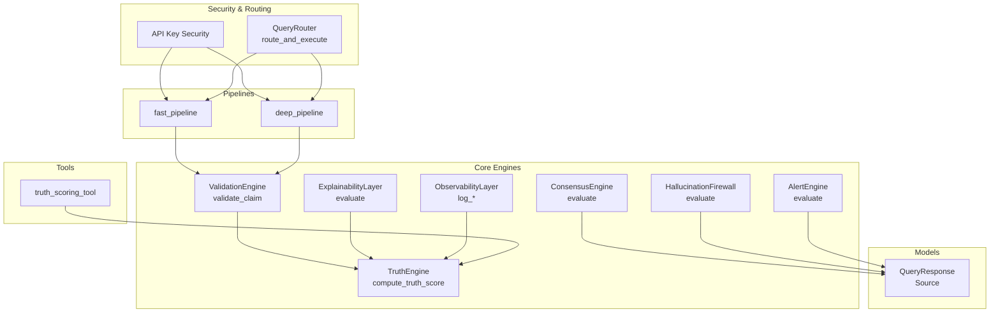

**Diagram sources**
- [truth_engine.py:1-117](file://veritas-ai/core/truth_engine.py#L1-L117)
- [validation_engine.py:1-18](file://veritas-ai/core/validation_engine.py#L1-L18)
- [consensus_engine.py:1-26](file://veritas-ai/core/consensus_engine.py#L1-L26)
- [explainability_layer.py:1-52](file://veritas-ai/core/explainability_layer.py#L1-L52)
- [firewall.py:1-47](file://veritas-ai/core/firewall.py#L1-L47)
- [alert_engine.py:1-67](file://veritas-ai/core/alert_engine.py#L1-L67)
- [observability.py:1-75](file://veritas-ai/core/observability.py#L1-L75)
- [schemas.py:1-88](file://veritas-ai/models/schemas.py#L1-L88)
- [fast_pipeline.py:1-22](file://veritas-ai/pipelines/fast_pipeline.py#L1-L22)
- [deep_pipeline.py:1-17](file://veritas-ai/pipelines/deep_pipeline.py#L1-L17)
- [truth_tools.py:1-29](file://veritas-ai/tools/truth_tools.py#L1-L29)
- [security.py:1-129](file://veritas-ai/core/security.py#L1-L129)
- [router.py:1-182](file://veritas-ai/core/router.py#L1-L182)

**Section sources**
- [README.md:33-59](file://README.md#L33-L59)
- [main.py:106-208](file://veritas-ai/app/main.py#L106-L208)

## Core Components
This section outlines the primary engines and their responsibilities.

- Truth Engine: computes a weighted, multi-factor truth score from source authority, cross-source agreement, temporal consistency, claim verifiability, and bias deviation. It logs observability metrics and returns a structured breakdown.
- Validation Engine: wraps the Truth Engine in an async executor to avoid blocking the event loop, returning the same structure as the Truth Engine.
- Consensus Engine: merges LLM confidence, classifier-derived confidence, and truth score into a deterministic consensus score mapped back to the payload.
- Explainability Layer: generates human-readable explanations ("why true/false") and a confidence breakdown derived from the Truth Engine’s computations.
- Firewall: applies hard constraints to clamp statuses based on contradiction counts, trusted source thresholds, and truth score thresholds.
- Alert Engine: emits structured alerts for contradictions, fake news probability, low truth scores, and temporal anomaly keywords.
- Observability Layer: logs inference metrics and detects drift in truth scores over a moving window.

**Section sources**
- [truth_engine.py:1-117](file://veritas-ai/core/truth_engine.py#L1-L117)
- [validation_engine.py:1-18](file://veritas-ai/core/validation_engine.py#L1-L18)
- [consensus_engine.py:1-26](file://veritas-ai/core/consensus_engine.py#L1-L26)
- [explainability_layer.py:1-52](file://veritas-ai/core/explainability_layer.py#L1-L52)
- [firewall.py:1-47](file://veritas-ai/core/firewall.py#L1-L47)
- [alert_engine.py:1-67](file://veritas-ai/core/alert_engine.py#L1-L67)
- [observability.py:1-75](file://veritas-ai/core/observability.py#L1-L75)

## Architecture Overview
The system follows an event-driven, asynchronous architecture with intelligent routing and caching. The FastAPI gateway accepts requests, routes them via the Query Router, executes either the fast or full pipeline, and passes results through the Firewall, Explainability Layer, and Alert Engine before returning to the UI or client.

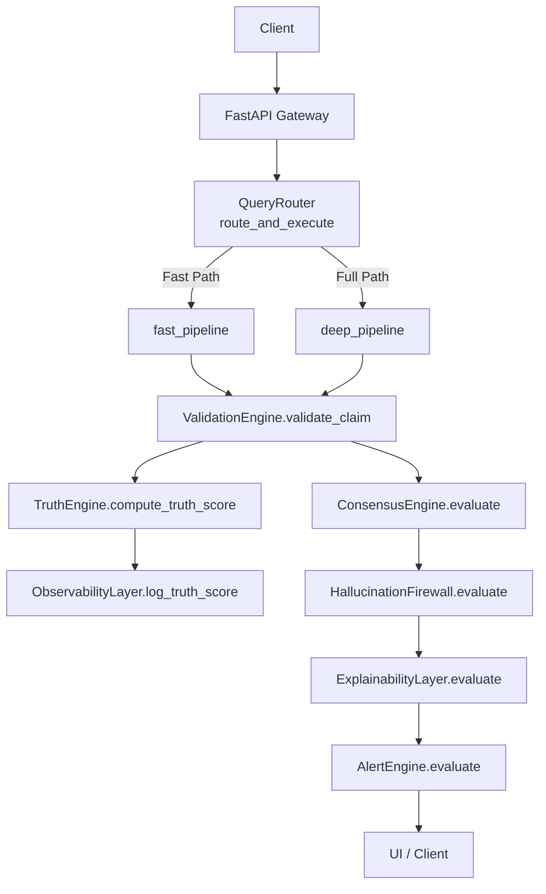

**Diagram sources**
- [router.py:83-182](file://veritas-ai/core/router.py#L83-L182)
- [fast_pipeline.py:1-22](file://veritas-ai/pipelines/fast_pipeline.py#L1-L22)
- [deep_pipeline.py:1-17](file://veritas-ai/pipelines/deep_pipeline.py#L1-L17)
- [validation_engine.py:1-18](file://veritas-ai/core/validation_engine.py#L1-L18)
- [truth_engine.py:78-117](file://veritas-ai/core/truth_engine.py#L78-L117)
- [consensus_engine.py:8-26](file://veritas-ai/core/consensus_engine.py#L8-L26)
- [firewall.py:13-47](file://veritas-ai/core/firewall.py#L13-L47)
- [explainability_layer.py:13-52](file://veritas-ai/core/explainability_layer.py#L13-L52)
- [alert_engine.py:26-67](file://veritas-ai/core/alert_engine.py#L26-L67)
- [observability.py:45-72](file://veritas-ai/core/observability.py#L45-L72)

## Detailed Component Analysis

### Truth Engine
The Truth Engine computes a weighted truth score across five factors:
- Source Authority: scores based on domain types (e.g., .gov/.edu/.mil/.int, known media, social, unknown)
- Cross-Source Agreement: ratio of agreeing to total sources
- Temporal Consistency: penalizes anomalies
- Claim Verifiability: based on RAG and KG hits
- Bias Deviation: inverse of fake news probability

It logs observability metrics and returns the final score and a breakdown.

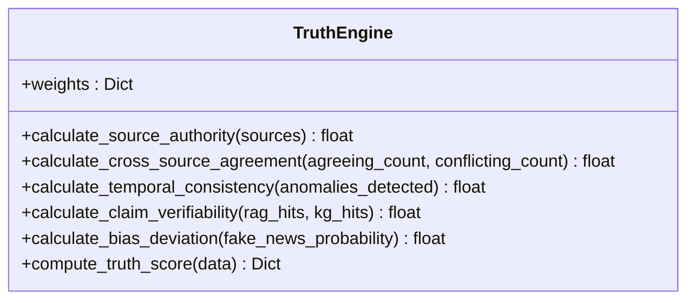

**Diagram sources**
- [truth_engine.py:3-117](file://veritas-ai/core/truth_engine.py#L3-L117)

**Section sources**
- [truth_engine.py:19-117](file://veritas-ai/core/truth_engine.py#L19-L117)

### Validation Engine
The Validation Engine delegates truth scoring to the Truth Engine while ensuring non-blocking execution via a thread pool executor. It preserves the Truth Engine’s output structure.

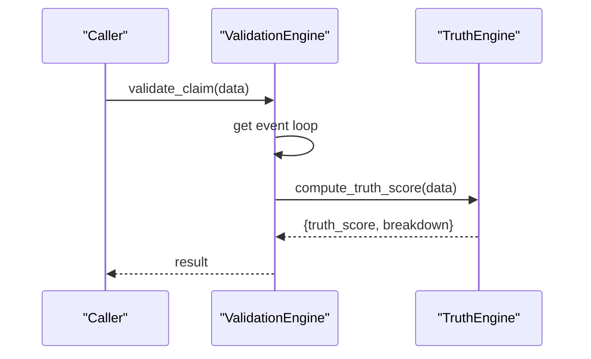

**Diagram sources**
- [validation_engine.py:9-18](file://veritas-ai/core/validation_engine.py#L9-L18)
- [truth_engine.py:78-117](file://veritas-ai/core/truth_engine.py#L78-L117)

**Section sources**
- [validation_engine.py:1-18](file://veritas-ai/core/validation_engine.py#L1-L18)

### Consensus Engine
The Consensus Engine merges three confidence signals:
- LLM Confidence
- Classifier Confidence (derived from fake probability)
- Truth Score (from Truth Engine)

It averages these into a deterministic consensus and updates the payload.

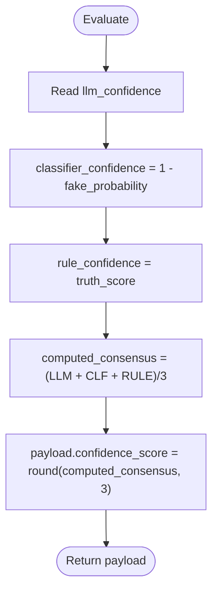

**Diagram sources**
- [consensus_engine.py:8-26](file://veritas-ai/core/consensus_engine.py#L8-L26)

**Section sources**
- [consensus_engine.py:1-26](file://veritas-ai/core/consensus_engine.py#L1-L26)

### Explainability Layer
The Explainability Layer builds:
- Why True: multiple reasons based on trusted sources, low fake probability, and absence of contradictions
- Why False: reasons based on contradictions, high fake probability, and lack of trusted sources
- Confidence Breakdown: authority, agreement, and bias scores derived from Truth Engine computations

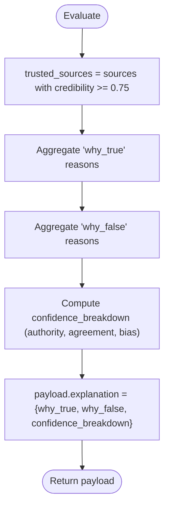

**Diagram sources**
- [explainability_layer.py:13-52](file://veritas-ai/core/explainability_layer.py#L13-L52)
- [truth_engine.py:19-76](file://veritas-ai/core/truth_engine.py#L19-L76)

**Section sources**
- [explainability_layer.py:1-52](file://veritas-ai/core/explainability_layer.py#L1-L52)

### Firewall
The Firewall enforces hard constraints:
- If contradictions exceed threshold → status = likely_false
- Else if trusted sources < 2 → status = uncertain
- Else if truth_score > 0.75 → status = verified
- Otherwise → status = uncertain

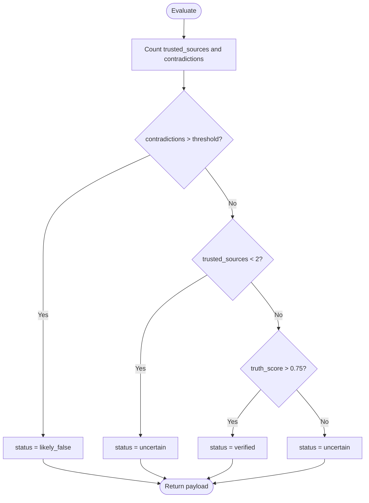

**Diagram sources**
- [firewall.py:13-47](file://veritas-ai/core/firewall.py#L13-L47)

**Section sources**
- [firewall.py:1-47](file://veritas-ai/core/firewall.py#L1-L47)

### Alert Engine
The Alert Engine emits structured alerts for:
- High contradiction counts
- Elevated fake news probability
- Low truth scores
- Temporal anomaly keywords in summaries

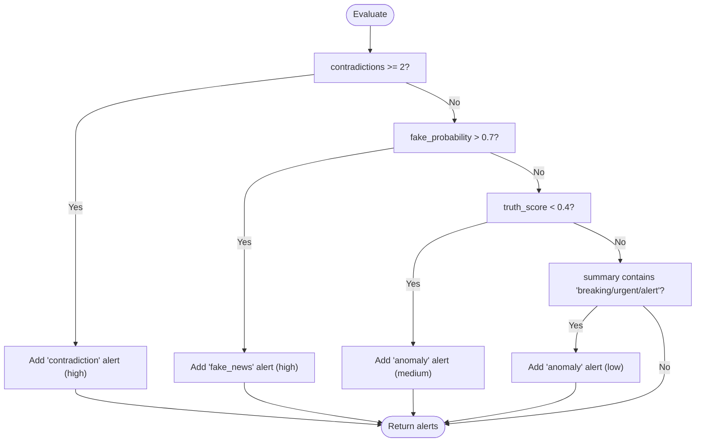

**Diagram sources**
- [alert_engine.py:26-67](file://veritas-ai/core/alert_engine.py#L26-L67)

**Section sources**
- [alert_engine.py:1-67](file://veritas-ai/core/alert_engine.py#L1-L67)

### Observability Layer
The Observability Layer logs:
- LLM inference metrics (latency, tokens, confidence)
- Truth score computations and breakdowns
- Detects drift in truth scores using a moving average and threshold

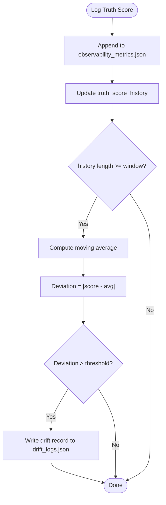

**Diagram sources**
- [observability.py:45-72](file://veritas-ai/core/observability.py#L45-L72)

**Section sources**
- [observability.py:1-75](file://veritas-ai/core/observability.py#L1-L75)

### Data Models
The system uses Pydantic models to define request/response structures, ensuring type safety and validation.

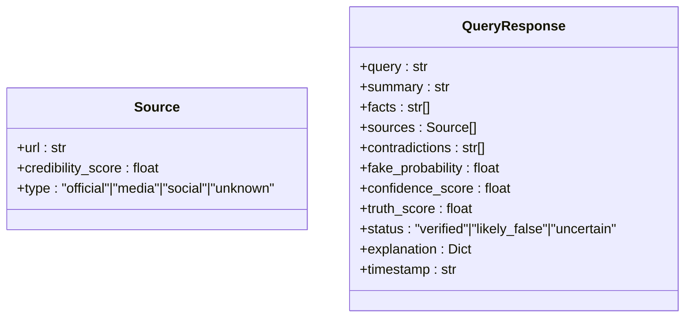

**Diagram sources**
- [schemas.py:5-26](file://veritas-ai/models/schemas.py#L5-L26)

**Section sources**
- [schemas.py:1-88](file://veritas-ai/models/schemas.py#L1-L88)

### Pipelines
- Fast Pipeline: retrieves sources, validates the claim, and generates a concise response, targeting sub-2 second latency.
- Deep Pipeline: runs the multi-agent pipeline in a background task and returns the final response.

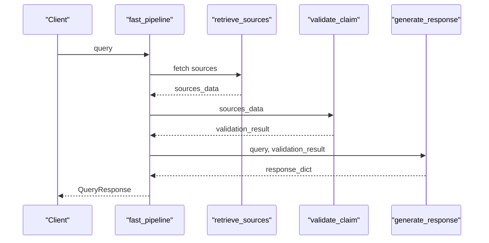

**Diagram sources**
- [fast_pipeline.py:8-22](file://veritas-ai/pipelines/fast_pipeline.py#L8-L22)

**Section sources**
- [fast_pipeline.py:1-22](file://veritas-ai/pipelines/fast_pipeline.py#L1-L22)
- [deep_pipeline.py:1-17](file://veritas-ai/pipelines/deep_pipeline.py#L1-L17)

### Tools
- Truth Scoring Tool: exposes Truth Engine computations as a LangChain tool, accepting a JSON payload and returning a unified score.

**Section sources**
- [truth_tools.py:1-29](file://veritas-ai/tools/truth_tools.py#L1-L29)

### Security and Routing
- API Key Security: validates keys, enforces rate limits, and supports dynamic key generation.
- Query Router: classifies queries, selects fast vs. full pipeline, and caches results.

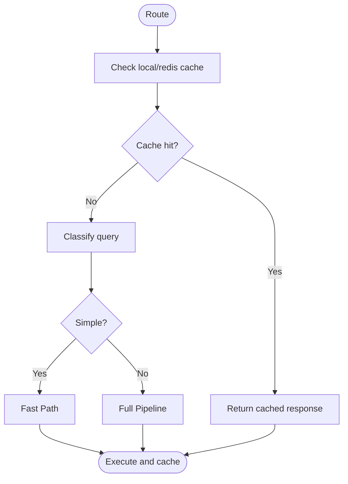

**Diagram sources**
- [router.py:99-136](file://veritas-ai/core/router.py#L99-L136)
- [security.py:51-84](file://veritas-ai/core/security.py#L51-L84)

**Section sources**
- [security.py:1-129](file://veritas-ai/core/security.py#L1-L129)
- [router.py:1-182](file://veritas-ai/core/router.py#L1-L182)

## Dependency Analysis
The engines depend on shared models and utilities. The Validation Engine depends on the Truth Engine, while the Consensus Engine, Explainability Layer, Firewall, and Alert Engine operate on QueryResponse models. The LLM managers provide configurable inference backends.

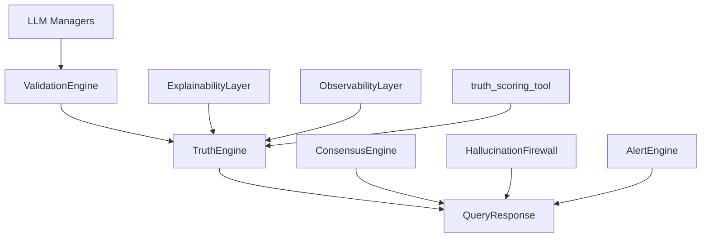

**Diagram sources**
- [truth_engine.py:1-117](file://veritas-ai/core/truth_engine.py#L1-L117)
- [validation_engine.py:1-18](file://veritas-ai/core/validation_engine.py#L1-L18)
- [consensus_engine.py:1-26](file://veritas-ai/core/consensus_engine.py#L1-L26)
- [explainability_layer.py:1-52](file://veritas-ai/core/explainability_layer.py#L1-L52)
- [firewall.py:1-47](file://veritas-ai/core/firewall.py#L1-L47)
- [alert_engine.py:1-67](file://veritas-ai/core/alert_engine.py#L1-L67)
- [observability.py:1-75](file://veritas-ai/core/observability.py#L1-L75)
- [schemas.py:1-88](file://veritas-ai/models/schemas.py#L1-L88)
- [truth_tools.py:1-29](file://veritas-ai/tools/truth_tools.py#L1-L29)
- [multi_llm.py:81-143](file://veritas-ai/models/multi_llm.py#L81-L143)

**Section sources**
- [multi_llm.py:1-143](file://veritas-ai/models/multi_llm.py#L1-L143)

## Performance Considerations
- Asynchronous Execution: Validation Engine runs truth scoring in a thread pool to avoid blocking the event loop.
- Fast Pipeline Target: The fast pipeline aims to complete in under 2 seconds by minimizing retrieval and validation steps.
- Model Preloading: LLMs are preloaded in the background to reduce cold-start latency.
- Caching: Local TTL cache and Redis-backed cache accelerate repeated queries.
- Startup Optimization: FastAPI app initializes cache and databases concurrently, with background model preload.

Recommendations:
- Tune weights and thresholds in Truth Engine and Firewall to balance precision and recall.
- Monitor drift logs to detect concept drift and recalibrate models.
- Adjust pipeline timeouts and rate limits to match SLAs.
- Profile LLM callbacks and observability logs to optimize inference costs.

**Section sources**
- [validation_engine.py:15-16](file://veritas-ai/core/validation_engine.py#L15-L16)
- [fast_pipeline.py:8-13](file://veritas-ai/pipelines/fast_pipeline.py#L8-L13)
- [main.py:60-68](file://veritas-ai/app/main.py#L60-L68)
- [router.py:90-136](file://veritas-ai/core/router.py#L90-L136)
- [observability.py:55-72](file://veritas-ai/core/observability.py#L55-L72)

## Troubleshooting Guide
Common issues and resolutions:
- API Key Errors: Ensure the X-API-KEY header is present and valid; check rate limit violations.
- Timeouts: Requests exceeding the pipeline timeout return a 504; adjust timeout settings or switch to the fast pipeline.
- Drift Alerts: Investigate recent truth score deviations; review model updates and data drift.
- Firewall Overrides: If claims are marked likely_false or uncertain, verify source credibility, reduce contradictions, and improve truth scores.
- Tool Errors: The Truth Scoring Tool expects a properly formatted JSON payload; validate inputs before invoking.

**Section sources**
- [security.py:51-84](file://veritas-ai/core/security.py#L51-L84)
- [main.py:127-149](file://veritas-ai/app/main.py#L127-L149)
- [observability.py:55-72](file://veritas-ai/core/observability.py#L55-L72)
- [firewall.py:28-46](file://veritas-ai/core/firewall.py#L28-L46)
- [truth_tools.py:20-29](file://veritas-ai/tools/truth_tools.py#L20-L29)

## Conclusion
The Verification Systems combine mathematical rigor (Truth Engine), collaborative validation (Consensus Engine), and transparency (Explainability Layer) to deliver robust, explainable truth assessments. The Firewall and Alert Engine ensure safety and awareness, while the routing, caching, and LLM infrastructure support sub-2-second performance at scale. The provided examples enable customization and integration with external services.

## Appendices

### Implementation Examples

- Custom Validation Rules
  - Modify thresholds in the Firewall to tighten or relax status overrides.
  - Adjust weights in the Truth Engine to emphasize or de-emphasize factors like bias deviation or temporal consistency.
  - Extend the Alert Engine to emit domain-specific alerts.

- Scoring Modifications
  - Update the Truth Engine’s scoring functions to incorporate domain-specific heuristics.
  - Integrate external NLP models to refine fake news probability and bias deviation.

- Integration with External Verification Services
  - Wrap external APIs behind a LangChain tool similar to the Truth Scoring Tool.
  - Normalize external outputs into the QueryResponse schema and feed them into the Consensus Engine.

- Quality Assurance Methodologies
  - Use the Observability Layer to track truth score drift and inference latency.
  - Run A/B tests on modified weights and thresholds; compare status distributions and user feedback.
  - Employ the Fast Pipeline for smoke testing and the Deep Pipeline for regression validation.

**Section sources**
- [firewall.py:10-46](file://veritas-ai/core/firewall.py#L10-L46)
- [truth_engine.py:9-17](file://veritas-ai/core/truth_engine.py#L9-L17)
- [alert_engine.py:26-67](file://veritas-ai/core/alert_engine.py#L26-L67)
- [truth_tools.py:5-29](file://veritas-ai/tools/truth_tools.py#L5-L29)
- [observability.py:45-72](file://veritas-ai/core/observability.py#L45-L72)
- [consensus_engine.py:19-23](file://veritas-ai/core/consensus_engine.py#L19-L23)