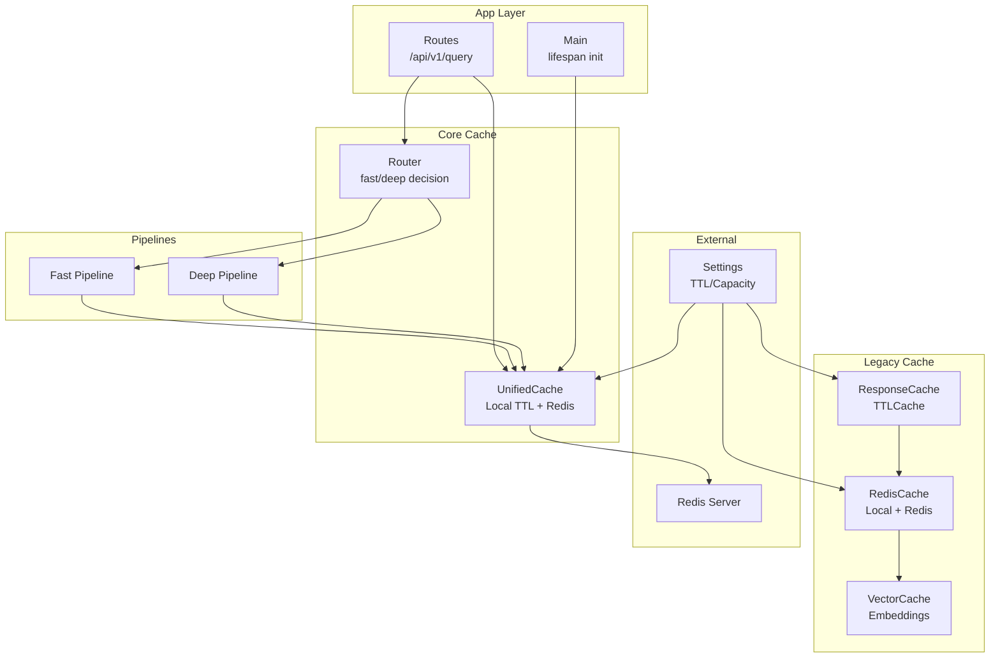
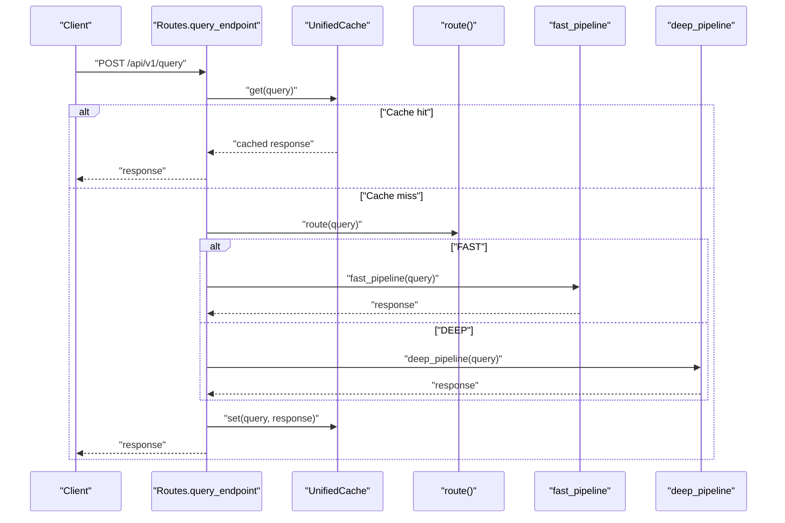
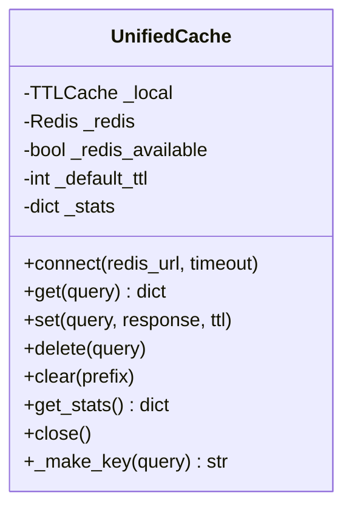
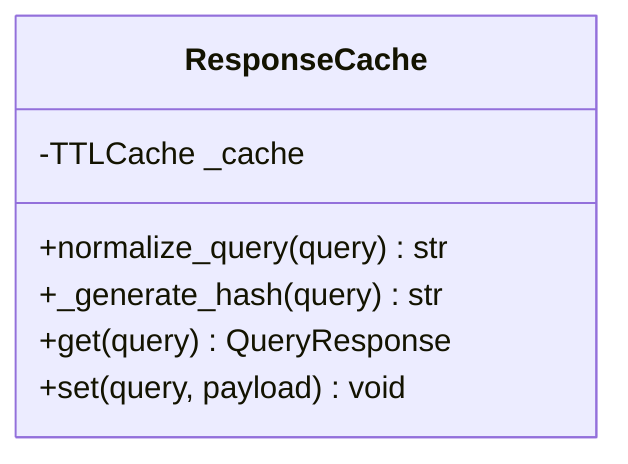
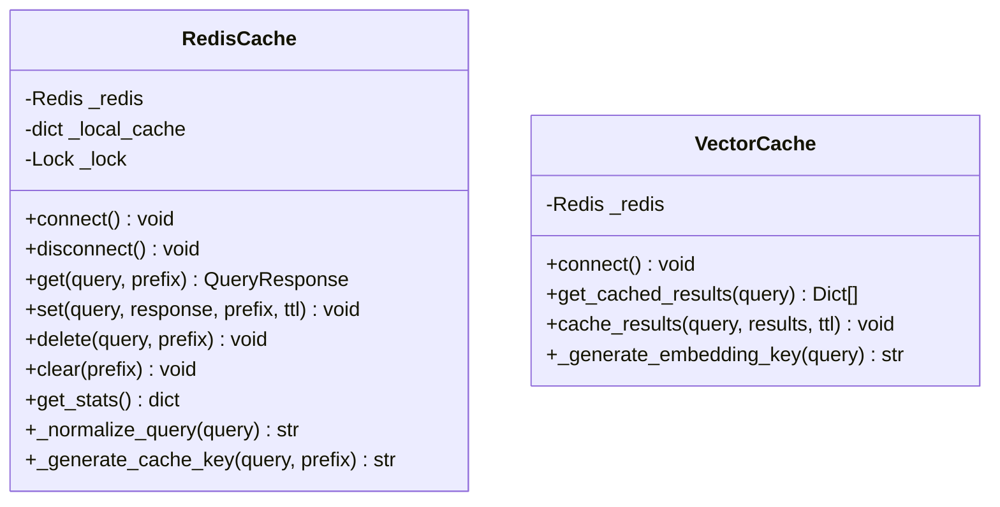
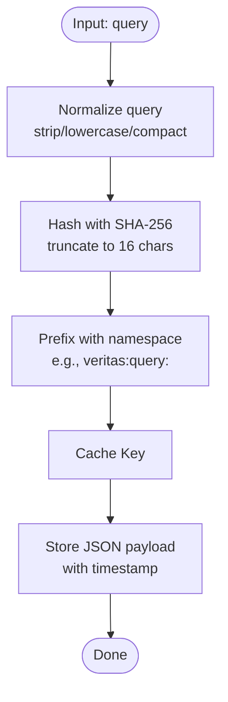
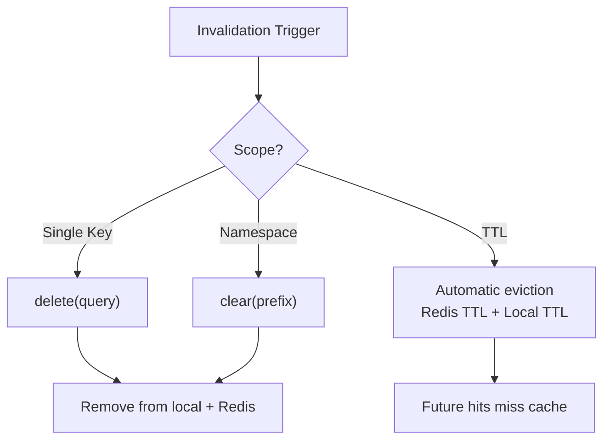
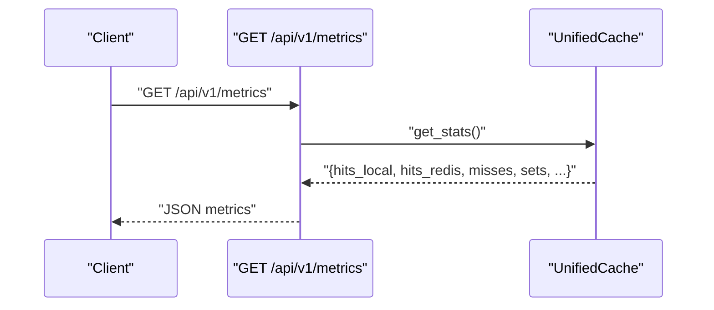
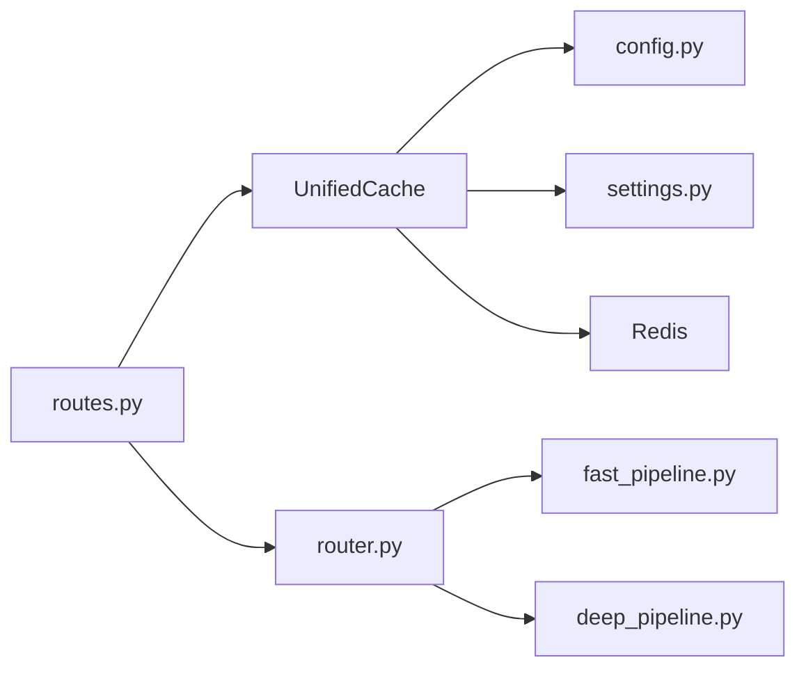

# Cache Layer Architecture

<cite>
**Referenced Files in This Document**
- [cache.py](file://veritas-ai/app/core/cache.py)
- [redis_cache.py](file://veritas-ai/core/redis_cache.py)
- [cache_layer.py](file://veritas-ai/core/cache_layer.py)
- [config.py](file://veritas-ai/app/core/config.py)
- [settings.py](file://veritas-ai/config/settings.py)
- [schemas.py](file://veritas-ai/models/schemas.py)
- [routes.py](file://veritas-ai/app/api/routes.py)
- [main.py](file://veritas-ai/app/main.py)
- [router.py](file://veritas-ai/app/core/router.py)
- [fast_pipeline.py](file://veritas-ai/app/pipeline/fast_pipeline.py)
- [deep_pipeline.py](file://veritas-ai/app/pipeline/deep_pipeline.py)
</cite>

## Table of Contents
1. [Introduction](#introduction)
2. [Project Structure](#project-structure)
3. [Core Components](#core-components)
4. [Architecture Overview](#architecture-overview)
5. [Detailed Component Analysis](#detailed-component-analysis)
6. [Dependency Analysis](#dependency-analysis)
7. [Performance Considerations](#performance-considerations)
8. [Troubleshooting Guide](#troubleshooting-guide)
9. [Conclusion](#conclusion)
10. [Appendices](#appendices)

## Introduction
This document describes the cache layer architecture designed for query optimization and session-aware operations in the system. It covers a two-tier caching strategy combining an in-memory TTL cache and Redis persistence, with TTL-based expiration, deterministic cache key generation, and JSON serialization. It also documents cache invalidation strategies, statistics collection, hit ratio monitoring, and operational guidance for multi-instance deployments and cache warming.

## Project Structure
The cache layer spans several modules:
- Unified cache abstraction for local and Redis tiers
- Legacy cache implementations for response caching and vector embeddings
- Configuration for cache TTL and capacity
- API integration to expose cache metrics and clearing operations
- Pipeline routing and query resolution that leverage caching

**Diagram sources**
- [routes.py:46-81](file://veritas-ai/app/api/routes.py#L46-L81)
- [main.py:33-39](file://veritas-ai/app/main.py#L33-L39)
- [cache.py:15-171](file://veritas-ai/app/core/cache.py#L15-L171)
- [redis_cache.py:18-232](file://veritas-ai/core/redis_cache.py#L18-L232)
- [cache_layer.py:10-41](file://veritas-ai/core/cache_layer.py#L10-L41)
- [config.py:19-87](file://veritas-ai/app/core/config.py#L19-L87)
- [settings.py:13-82](file://veritas-ai/config/settings.py#L13-L82)
- [router.py:10-18](file://veritas-ai/app/core/router.py#L10-L18)
- [fast_pipeline.py:13-48](file://veritas-ai/app/pipeline/fast_pipeline.py#L13-L48)
- [deep_pipeline.py:13-42](file://veritas-ai/app/pipeline/deep_pipeline.py#L13-L42)

**Section sources**
- [routes.py:18-82](file://veritas-ai/app/api/routes.py#L18-L82)
- [main.py:31-101](file://veritas-ai/app/main.py#L31-L101)
- [cache.py:15-171](file://veritas-ai/app/core/cache.py#L15-L171)
- [redis_cache.py:18-232](file://veritas-ai/core/redis_cache.py#L18-L232)
- [cache_layer.py:10-41](file://veritas-ai/core/cache_layer.py#L10-L41)
- [config.py:19-87](file://veritas-ai/app/core/config.py#L19-L87)
- [settings.py:13-82](file://veritas-ai/config/settings.py#L13-L82)
- [router.py:10-18](file://veritas-ai/app/core/router.py#L10-L18)
- [fast_pipeline.py:13-48](file://veritas-ai/app/pipeline/fast_pipeline.py#L13-L48)
- [deep_pipeline.py:13-42](file://veritas-ai/app/pipeline/deep_pipeline.py#L13-L42)

## Core Components
- UnifiedCache: Provides a single interface for a two-tier cache (L1 local TTL cache + L2 Redis). Implements graceful degradation when Redis is unavailable, maintains hit/miss/set counters, and exposes hit-rate metrics.
- ResponseCache: Legacy in-memory cache using TTLCache for normalized queries and SHA-256 hashing.
- RedisCache: Multi-tier cache with local dictionary fallback and Redis backend. Supports get/set/delete/clear with TTL and key normalization.
- VectorCache: Dedicated cache for embedding/vector results stored in Redis.
- Configuration: Centralized settings for cache TTL and capacity, plus Redis connection parameters.

Key behaviors:
- Deterministic cache keys derived from normalized query strings
- JSON serialization/deserialization for cache payloads
- TTL enforcement via Redis EX and local TTLCache
- Stats exposed via health and metrics endpoints

**Section sources**
- [cache.py:15-171](file://veritas-ai/app/core/cache.py#L15-L171)
- [cache_layer.py:10-41](file://veritas-ai/core/cache_layer.py#L10-L41)
- [redis_cache.py:18-232](file://veritas-ai/core/redis_cache.py#L18-L232)
- [config.py:19-87](file://veritas-ai/app/core/config.py#L19-L87)
- [settings.py:13-82](file://veritas-ai/config/settings.py#L13-L82)

## Architecture Overview
The cache layer integrates with the API layer to accelerate query responses. The flow:
- On query, the API checks the unified cache for a hit
- If miss, the router selects fast or deep pipeline
- Pipelines execute and produce a response
- Response is cached in both local and Redis tiers
- Metrics are exposed via health and metrics endpoints

**Diagram sources**
- [routes.py:100-81](file://veritas-ai/app/api/routes.py#L100-L81)
- [router.py:10-18](file://veritas-ai/app/core/router.py#L10-L18)
- [fast_pipeline.py:13-48](file://veritas-ai/app/pipeline/fast_pipeline.py#L13-L48)
- [deep_pipeline.py:13-42](file://veritas-ai/app/pipeline/deep_pipeline.py#L13-L42)
- [cache.py:66-115](file://veritas-ai/app/core/cache.py#L66-L115)

## Detailed Component Analysis

### UnifiedCache: Two-Tier Cache
- Local tier: TTLCache with configurable max entries and TTL
- Redis tier: Optional, with graceful fallback to local-only mode
- Key generation: Normalizes query and hashes to a short SHA-256 prefix with a namespace
- Serialization: JSON for payloads
- Invalidation: delete and clear operations supported
- Statistics: hits (local/redis), misses, sets, totals, hit rate, availability, local size

**Diagram sources**
- [cache.py:15-171](file://veritas-ai/app/core/cache.py#L15-L171)

**Section sources**
- [cache.py:15-171](file://veritas-ai/app/core/cache.py#L15-L171)
- [config.py:33-34](file://veritas-ai/app/core/config.py#L33-L34)
- [settings.py:25-26](file://veritas-ai/config/settings.py#L25-L26)

### ResponseCache: Legacy In-Memory Cache
- Uses TTLCache with settings-driven capacity and TTL
- Normalizes queries and hashes them deterministically
- Stores QueryResponse objects

**Diagram sources**
- [cache_layer.py:10-41](file://veritas-ai/core/cache_layer.py#L10-L41)
- [schemas.py:14-26](file://veritas-ai/models/schemas.py#L14-L26)

**Section sources**
- [cache_layer.py:10-41](file://veritas-ai/core/cache_layer.py#L10-L41)
- [schemas.py:14-26](file://veritas-ai/models/schemas.py#L14-L26)

### RedisCache: Local + Redis Cache
- Singleton with local dictionary cache and Redis client
- Normalizes queries and generates keys with a namespace prefix
- JSON serialization with timestamp injection
- TTL enforcement via Redis EX
- Invalidation: delete and clear with pattern matching
- Stats: local size and Redis connectivity; Redis stats via INFO

**Diagram sources**
- [redis_cache.py:18-232](file://veritas-ai/core/redis_cache.py#L18-L232)

**Section sources**
- [redis_cache.py:18-232](file://veritas-ai/core/redis_cache.py#L18-L232)
- [schemas.py:14-26](file://veritas-ai/models/schemas.py#L14-L26)

### Cache Key Generation and Serialization
- Key generation:
  - Normalize query (trim, lowercase, collapse whitespace)
  - Hash normalized query (SHA-256) and truncate to a short prefix
  - Prefix with a namespace indicating cache domain (e.g., veritas:query:, veritas:embedding:)
- Serialization:
  - Responses are serialized to JSON before storage
  - Timestamps are included in serialized payloads for freshness tracking

**Diagram sources**
- [cache.py:37-41](file://veritas-ai/app/core/cache.py#L37-L41)
- [redis_cache.py:61-64](file://veritas-ai/core/redis_cache.py#L61-L64)
- [redis_cache.py:190-193](file://veritas-ai/core/redis_cache.py#L190-L193)

**Section sources**
- [cache.py:37-41](file://veritas-ai/app/core/cache.py#L37-L41)
- [redis_cache.py:61-64](file://veritas-ai/core/redis_cache.py#L61-L64)
- [redis_cache.py:190-193](file://veritas-ai/core/redis_cache.py#L190-L193)

### Cache Invalidation Strategies
- Selective deletion: delete a specific key by query
- Bulk clearing: clear by namespace/prefix
- TTL-based expiration: relies on Redis EX and local TTLCache eviction
- Clear cache endpoint: exposed via API for administrative control

**Diagram sources**
- [cache.py:116-142](file://veritas-ai/app/core/cache.py#L116-L142)
- [redis_cache.py:107-144](file://veritas-ai/core/redis_cache.py#L107-L144)

**Section sources**
- [cache.py:116-142](file://veritas-ai/app/core/cache.py#L116-L142)
- [redis_cache.py:107-144](file://veritas-ai/core/redis_cache.py#L107-L144)
- [routes.py:246-250](file://veritas-ai/app/api/routes.py#L246-L250)

### Session State Management and Multi-Step Workflows
- The cache layer itself is stateless and keyed by normalized queries.
- Session-awareness is achieved by associating cache keys with user context at the API boundary (e.g., owner email) and by including timestamps in cached payloads to support freshness checks.
- Multi-step verification workflows are orchestrated by the router and pipelines; caching ensures repeated queries benefit from prior work.

**Section sources**
- [routes.py:46-81](file://veritas-ai/app/api/routes.py#L46-L81)
- [router.py:10-18](file://veritas-ai/app/core/router.py#L10-L18)
- [fast_pipeline.py:13-48](file://veritas-ai/app/pipeline/fast_pipeline.py#L13-L48)
- [deep_pipeline.py:13-42](file://veritas-ai/app/pipeline/deep_pipeline.py#L13-L42)

### Cache Statistics, Hit Ratio, and Metrics
- UnifiedCache tracks:
  - hits_local, hits_redis, misses, sets
  - Computes total_hits, total_requests, hit_rate
  - Reports redis_available and local_size
- Exposed via:
  - Health endpoint: includes redis availability and hit_rate
  - Metrics endpoint: returns full stats object

**Diagram sources**
- [routes.py:236-243](file://veritas-ai/app/api/routes.py#L236-L243)
- [cache.py:144-155](file://veritas-ai/app/core/cache.py#L144-L155)

**Section sources**
- [cache.py:144-155](file://veritas-ai/app/core/cache.py#L144-L155)
- [routes.py:86-97](file://veritas-ai/app/api/routes.py#L86-L97)
- [routes.py:236-243](file://veritas-ai/app/api/routes.py#L236-L243)

### Distributed Caching and Cache Warming
- Distributed caching:
  - Redis backend enables sharing cache across instances
  - Graceful degradation to local-only cache if Redis is unavailable
- Cache warming:
  - Pre-warm hot queries by invoking them during startup or periodically
  - Use bulk clear and targeted set operations to seed frequently accessed keys

**Section sources**
- [cache.py:43-65](file://veritas-ai/app/core/cache.py#L43-L65)
- [main.py:33-39](file://veritas-ai/app/main.py#L33-L39)

## Dependency Analysis
- API routes depend on UnifiedCache for query resolution and on router for pipeline selection.
- UnifiedCache depends on configuration for TTL and capacity and optionally on Redis for persistence.
- Legacy cache modules (ResponseCache, RedisCache, VectorCache) demonstrate earlier designs and are superseded by UnifiedCache.

**Diagram sources**
- [routes.py:100-81](file://veritas-ai/app/api/routes.py#L100-L81)
- [router.py:10-18](file://veritas-ai/app/core/router.py#L10-L18)
- [fast_pipeline.py:13-48](file://veritas-ai/app/pipeline/fast_pipeline.py#L13-L48)
- [deep_pipeline.py:13-42](file://veritas-ai/app/pipeline/deep_pipeline.py#L13-L42)
- [cache.py:43-65](file://veritas-ai/app/core/cache.py#L43-L65)
- [config.py:19-87](file://veritas-ai/app/core/config.py#L19-L87)
- [settings.py:13-82](file://veritas-ai/config/settings.py#L13-L82)

**Section sources**
- [routes.py:18-82](file://veritas-ai/app/api/routes.py#L18-L82)
- [cache.py:15-171](file://veritas-ai/app/core/cache.py#L15-L171)
- [config.py:19-87](file://veritas-ai/app/core/config.py#L19-L87)
- [settings.py:13-82](file://veritas-ai/config/settings.py#L13-L82)

## Performance Considerations
- Prefer the unified cache for new integrations to benefit from dual-tier performance and resilience.
- Tune CACHE_TTL_SECONDS and CACHE_MAX_ENTRIES to balance memory usage and hit rates.
- Monitor hit_rate and redis_available to assess cache effectiveness and Redis health.
- Use JSON serialization efficiently; avoid storing excessively large payloads.

[No sources needed since this section provides general guidance]

## Troubleshooting Guide
Common issues and remedies:
- Redis unavailable:
  - Behavior: UnifiedCache falls back to local-only mode
  - Action: Verify Redis host/port/db and network connectivity; check logs for warnings
- Cache misses despite recent queries:
  - Behavior: TTL expiration or key mismatch due to normalization differences
  - Action: Confirm query normalization and key generation; ensure consistent input
- Slow cache operations:
  - Behavior: Redis latency or scan/clear operations
  - Action: Monitor Redis INFO stats; reduce clear scope; optimize TTL

**Section sources**
- [cache.py:43-65](file://veritas-ai/app/core/cache.py#L43-L65)
- [cache.py:144-155](file://veritas-ai/app/core/cache.py#L144-L155)
- [redis_cache.py:30-56](file://veritas-ai/core/redis_cache.py#L30-L56)
- [redis_cache.py:146-163](file://veritas-ai/core/redis_cache.py#L146-L163)

## Conclusion
The cache layer provides a robust, two-tier solution for query acceleration with graceful degradation and Redis-backed persistence. Deterministic key generation, JSON serialization, and TTL-based expiration ensure predictable performance and scalability. The unified cache simplifies integration, while legacy modules illustrate prior approaches. Operational controls include metrics exposure, selective invalidation, and administrative cache clearing.

[No sources needed since this section summarizes without analyzing specific files]

## Appendices

### Configuration Options
- CACHE_TTL_SECONDS: Default TTL for cached entries
- CACHE_MAX_ENTRIES: Maximum number of entries in local cache
- REDIS_HOST, REDIS_PORT, REDIS_DB: Redis connection parameters

**Section sources**
- [config.py:33-34](file://veritas-ai/app/core/config.py#L33-L34)
- [config.py:55-59](file://veritas-ai/app/core/config.py#L55-L59)
- [settings.py:25-26](file://veritas-ai/config/settings.py#L25-L26)
- [settings.py:55-58](file://veritas-ai/config/settings.py#L55-L58)