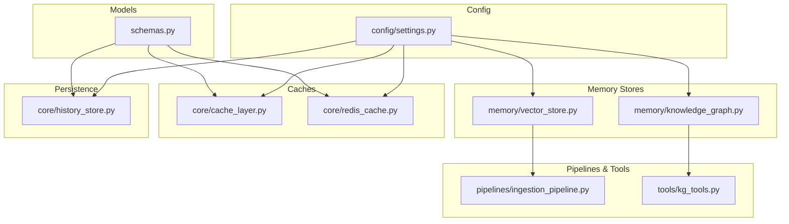
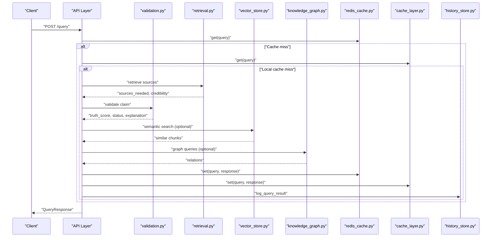
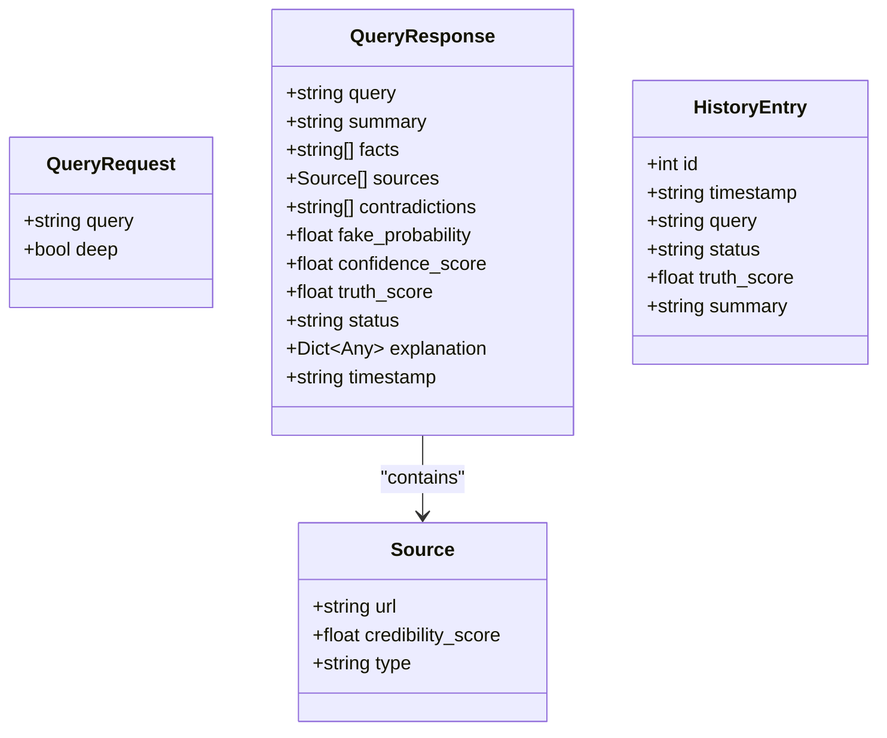
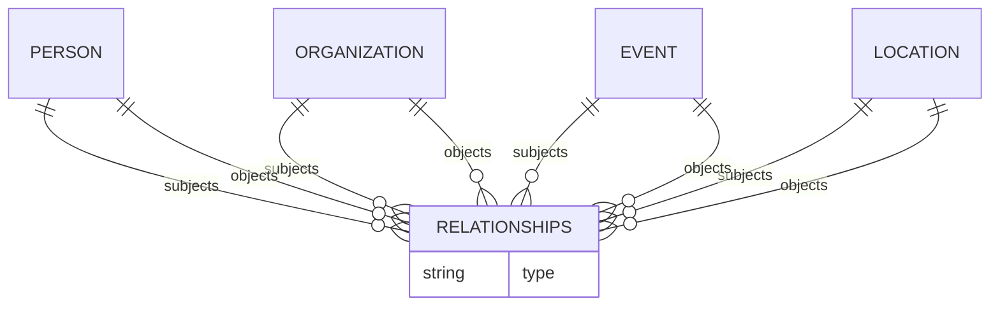
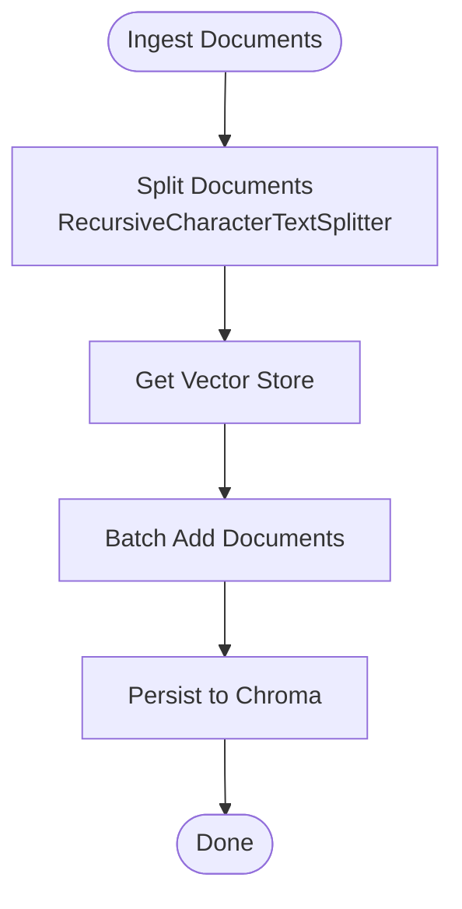
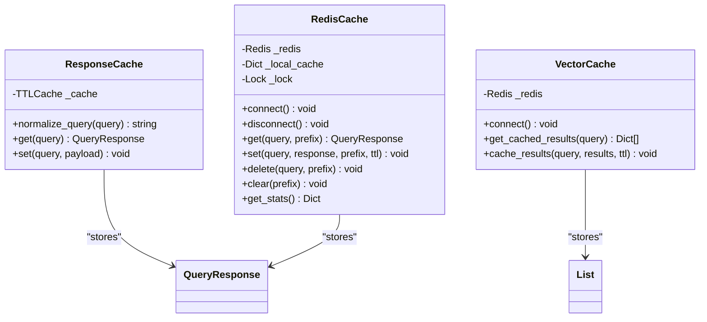
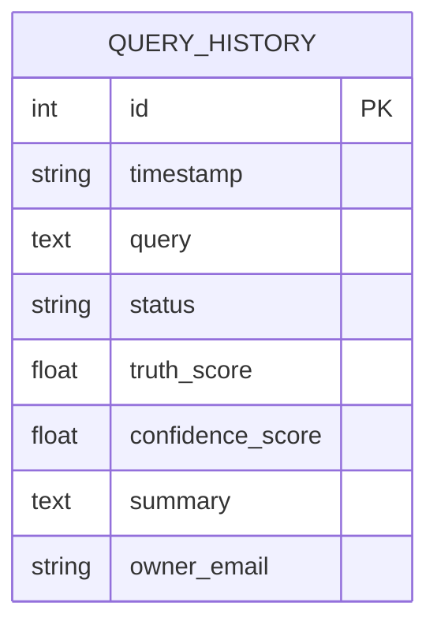
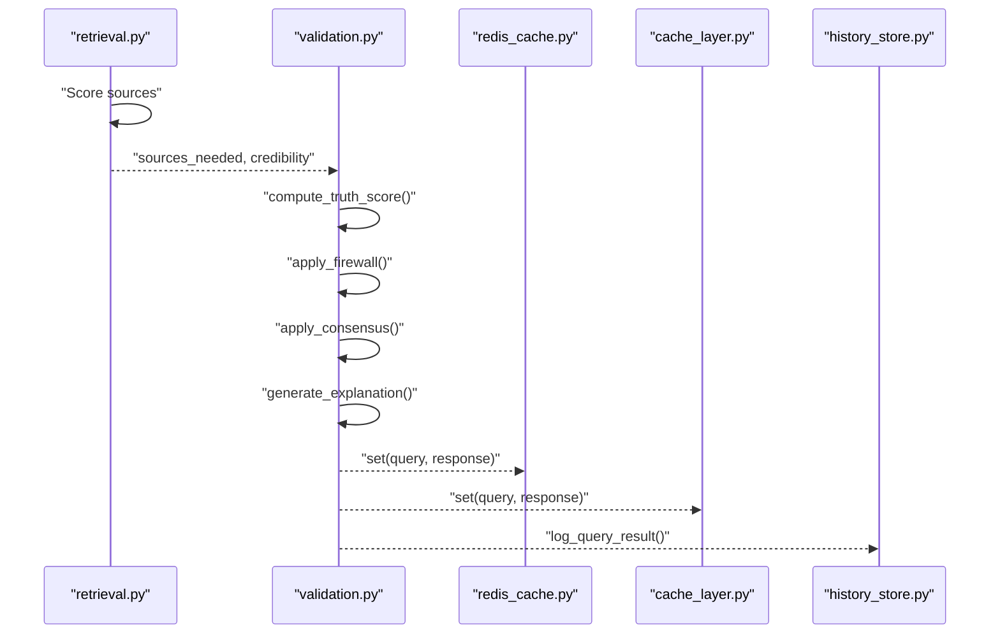
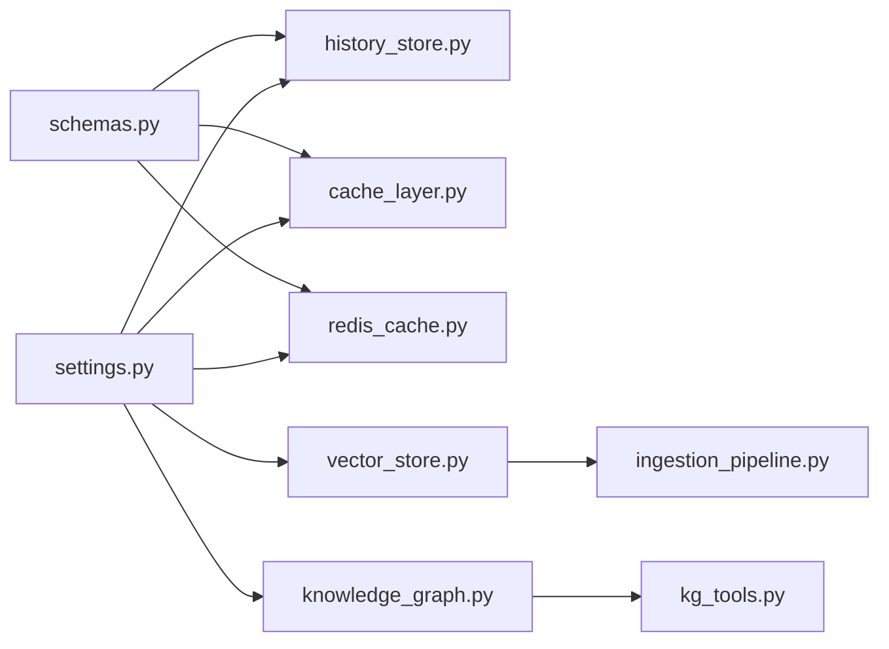

# Data Models & Storage

<cite>
**Referenced Files in This Document**
- [schemas.py](file://veritas-ai/models/schemas.py)
- [knowledge_graph.py](file://veritas-ai/memory/knowledge_graph.py)
- [vector_store.py](file://veritas-ai/memory/vector_store.py)
- [history_store.py](file://veritas-ai/core/history_store.py)
- [cache_layer.py](file://veritas-ai/core/cache_layer.py)
- [redis_cache.py](file://veritas-ai/core/redis_cache.py)
- [settings.py](file://veritas-ai/config/settings.py)
- [ingestion_pipeline.py](file://veritas-ai/pipelines/ingestion_pipeline.py)
- [kg_tools.py](file://veritas-ai/tools/kg_tools.py)
- [validation.py](file://veritas-ai/app/agents/validation.py)
- [retrieval.py](file://veritas-ai/app/agents/retrieval.py)
</cite>

## Table of Contents
1. [Introduction](#introduction)
2. [Project Structure](#project-structure)
3. [Core Components](#core-components)
4. [Architecture Overview](#architecture-overview)
5. [Detailed Component Analysis](#detailed-component-analysis)
6. [Dependency Analysis](#dependency-analysis)
7. [Performance Considerations](#performance-considerations)
8. [Troubleshooting Guide](#troubleshooting-guide)
9. [Conclusion](#conclusion)
10. [Appendices](#appendices)

## Introduction
This document describes the data models and storage architecture for Veritas AI’s multi-modal verification system. It covers:
- Entity-relationship models for claims, sources, facts, and verification results in the knowledge graph
- Vector store schema for semantic similarity and embeddings
- Cache layer data structures for query optimization and session management
- History store schema for audit trails and trend analysis
- Validation rules, indexing strategies, and performance optimizations
- Data lifecycle management, security, access control, privacy compliance, and schema evolution strategies

## Project Structure
The storage-related components are organized by responsibility:
- Models and schemas define typed request/response contracts
- Memory stores encapsulate persistence for knowledge graph and vector embeddings
- Core caches provide in-memory and distributed caching for queries and embeddings
- History store persists query sessions for auditing and analytics
- Pipelines and tools integrate ingestion and KG updates

**Diagram sources**
- [schemas.py:1-88](file://veritas-ai/models/schemas.py#L1-L88)
- [knowledge_graph.py:1-160](file://veritas-ai/memory/knowledge_graph.py#L1-L160)
- [vector_store.py:1-27](file://veritas-ai/memory/vector_store.py#L1-L27)
- [history_store.py:1-106](file://veritas-ai/core/history_store.py#L1-L106)
- [cache_layer.py:1-41](file://veritas-ai/core/cache_layer.py#L1-L41)
- [redis_cache.py:1-232](file://veritas-ai/core/redis_cache.py#L1-L232)
- [settings.py:1-83](file://veritas-ai/config/settings.py#L1-L83)
- [ingestion_pipeline.py:1-38](file://veritas-ai/pipelines/ingestion_pipeline.py#L1-L38)
- [kg_tools.py:1-50](file://veritas-ai/tools/kg_tools.py#L1-L50)

**Section sources**
- [schemas.py:1-88](file://veritas-ai/models/schemas.py#L1-L88)
- [settings.py:1-83](file://veritas-ai/config/settings.py#L1-L83)

## Core Components
- Typed request/response models for queries, responses, alerts, trends, and history entries
- Knowledge Graph abstraction for entity and relationship persistence
- Vector store abstraction for embeddings and similarity search
- Local and distributed caches for query and embedding reuse
- SQLite-backed history store for audit and trend analysis
- Configuration-driven settings for all storage parameters

Key responsibilities:
- Enforce validation rules and normalization for inputs and outputs
- Provide async and sync abstractions for graph operations
- Manage embedding generation and vector persistence
- Optimize repeated queries and retrievals via caching
- Persist and query historical sessions for analytics

**Section sources**
- [schemas.py:1-88](file://veritas-ai/models/schemas.py#L1-L88)
- [knowledge_graph.py:12-160](file://veritas-ai/memory/knowledge_graph.py#L12-L160)
- [vector_store.py:8-27](file://veritas-ai/memory/vector_store.py#L8-L27)
- [cache_layer.py:10-41](file://veritas-ai/core/cache_layer.py#L10-L41)
- [redis_cache.py:18-232](file://veritas-ai/core/redis_cache.py#L18-L232)
- [history_store.py:23-106](file://veritas-ai/core/history_store.py#L23-L106)
- [settings.py:13-83](file://veritas-ai/config/settings.py#L13-L83)

## Architecture Overview
The storage architecture integrates typed models, memory stores, caches, and persistence layers. The ingestion pipeline builds the vector store; retrieval and validation agents produce structured results; caches optimize performance; and the history store maintains audit trails.

**Diagram sources**
- [validation.py:278-314](file://veritas-ai/app/agents/validation.py#L278-L314)
- [retrieval.py:36-101](file://veritas-ai/app/agents/retrieval.py#L36-L101)
- [vector_store.py:15-27](file://veritas-ai/memory/vector_store.py#L15-L27)
- [knowledge_graph.py:88-113](file://veritas-ai/memory/knowledge_graph.py#L88-L113)
- [redis_cache.py:66-106](file://veritas-ai/core/redis_cache.py#L66-L106)
- [cache_layer.py:29-38](file://veritas-ai/core/cache_layer.py#L29-L38)
- [history_store.py:46-63](file://veritas-ai/core/history_store.py#L46-L63)

## Detailed Component Analysis

### Typed Models and Validation Rules
- QueryRequest and QueryResponse define the contract for user queries and verification outcomes, including scores and categorical statuses
- Validation enforces numeric ranges (e.g., probabilities and scores) and categorical enums
- Additional models support alerts, trends, streaming authorization, and error responses

**Diagram sources**
- [schemas.py:5-26](file://veritas-ai/models/schemas.py#L5-L26)
- [schemas.py:71-78](file://veritas-ai/models/schemas.py#L71-L78)

**Section sources**
- [schemas.py:1-88](file://veritas-ai/models/schemas.py#L1-L88)
- [validation.py:92-127](file://veritas-ai/app/agents/validation.py#L92-L127)

### Knowledge Graph Schema and Operations
- Supported labels: Person, Organization, Event, Location
- Supported relationships: ANNOUNCED, OCCURRED_AT, AFFILIATED_WITH, REPORTED_BY
- Async driver with connection pooling and safe MERGE semantics
- Batch entity merging for performance
- Relationship query returns up to a fixed limit

**Diagram sources**
- [knowledge_graph.py:8-9](file://veritas-ai/memory/knowledge_graph.py#L8-L9)
- [knowledge_graph.py:77-81](file://veritas-ai/memory/knowledge_graph.py#L77-L81)

**Section sources**
- [knowledge_graph.py:12-160](file://veritas-ai/memory/knowledge_graph.py#L12-L160)
- [kg_tools.py:5-50](file://veritas-ai/tools/kg_tools.py#L5-L50)

### Vector Store Schema and Embedding Representation
- Embedding function configured via Ollama with configurable model and base URL
- Persistent Chroma collection named for the knowledge base
- Ingestion pipeline splits documents and batches inserts to avoid resource contention

**Diagram sources**
- [ingestion_pipeline.py:7-34](file://veritas-ai/pipelines/ingestion_pipeline.py#L7-L34)
- [vector_store.py:15-27](file://veritas-ai/memory/vector_store.py#L15-L27)

**Section sources**
- [vector_store.py:8-27](file://veritas-ai/memory/vector_store.py#L8-L27)
- [ingestion_pipeline.py:1-38](file://veritas-ai/pipelines/ingestion_pipeline.py#L1-L38)

### Cache Layer Data Structures
- Local TTL cache keyed by normalized and hashed queries
- Distributed Redis cache with local in-memory fallback and shared keyspace
- Vector cache specialized for embedding results
- Stats exposed for monitoring cache effectiveness

**Diagram sources**
- [cache_layer.py:10-41](file://veritas-ai/core/cache_layer.py#L10-L41)
- [redis_cache.py:18-232](file://veritas-ai/core/redis_cache.py#L18-L232)

**Section sources**
- [cache_layer.py:10-41](file://veritas-ai/core/cache_layer.py#L10-L41)
- [redis_cache.py:18-232](file://veritas-ai/core/redis_cache.py#L18-L232)

### History Store Schema and Audit Trail
- SQLite WAL mode for durability and concurrency
- Table includes owner scoping for public vs private sessions
- Insert and fetch APIs with optional owner filtering and limits

**Diagram sources**
- [history_store.py:27-36](file://veritas-ai/core/history_store.py#L27-L36)

**Section sources**
- [history_store.py:23-106](file://veritas-ai/core/history_store.py#L23-L106)
- [schemas.py:71-83](file://veritas-ai/models/schemas.py#L71-L83)

### Retrieval and Validation Workflows
- Retrieval agent identifies sources and initial credibility using a lightweight LLM
- Validation agent computes truth score, applies firewall overrides, consensus fusion, and generates explanations
- These steps feed into caching and history logging

**Diagram sources**
- [retrieval.py:36-101](file://veritas-ai/app/agents/retrieval.py#L36-L101)
- [validation.py:278-314](file://veritas-ai/app/agents/validation.py#L278-L314)
- [redis_cache.py:85-106](file://veritas-ai/core/redis_cache.py#L85-L106)
- [cache_layer.py:34-38](file://veritas-ai/core/cache_layer.py#L34-L38)
- [history_store.py:46-63](file://veritas-ai/core/history_store.py#L46-L63)

## Dependency Analysis
- Models depend on Pydantic for validation and are consumed across agents and persistence
- Memory stores depend on configuration for URIs, credentials, and paths
- Caches depend on Redis availability and fall back to local memory
- Pipelines depend on vector store initialization and embedding settings
- Tools depend on memory stores for KG updates

**Diagram sources**
- [schemas.py:1-88](file://veritas-ai/models/schemas.py#L1-L88)
- [settings.py:1-83](file://veritas-ai/config/settings.py#L1-L83)
- [vector_store.py:1-27](file://veritas-ai/memory/vector_store.py#L1-L27)
- [ingestion_pipeline.py:1-38](file://veritas-ai/pipelines/ingestion_pipeline.py#L1-L38)
- [knowledge_graph.py:1-160](file://veritas-ai/memory/knowledge_graph.py#L1-L160)
- [kg_tools.py:1-50](file://veritas-ai/tools/kg_tools.py#L1-L50)
- [history_store.py:1-106](file://veritas-ai/core/history_store.py#L1-L106)
- [cache_layer.py:1-41](file://veritas-ai/core/cache_layer.py#L1-L41)
- [redis_cache.py:1-232](file://veritas-ai/core/redis_cache.py#L1-L232)

**Section sources**
- [settings.py:13-83](file://veritas-ai/config/settings.py#L13-L83)

## Performance Considerations
- Vector ingestion batching reduces CPU and memory spikes during embedding
- Async graph operations and connection pooling improve throughput
- TTL-based caching avoids recomputation for repeated queries
- Redis cache provides horizontal scalability and low-latency reads
- SQLite WAL mode improves concurrent writes and crash safety
- Configurable retrieval K and embedding model selection balance accuracy and latency

Recommendations:
- Monitor cache hit rates and adjust TTL and max entries per workload
- Tune chunk size and overlap for optimal embedding quality and recall
- Scale Redis and Neo4j based on concurrent load and query patterns
- Use prefix-based cache clearing for targeted invalidation

**Section sources**
- [ingestion_pipeline.py:7-34](file://veritas-ai/pipelines/ingestion_pipeline.py#L7-L34)
- [knowledge_graph.py:25-43](file://veritas-ai/memory/knowledge_graph.py#L25-L43)
- [redis_cache.py:30-52](file://veritas-ai/core/redis_cache.py#L30-L52)
- [history_store.py:15-21](file://veritas-ai/core/history_store.py#L15-L21)
- [settings.py:50-54](file://veritas-ai/config/settings.py#L50-L54)

## Troubleshooting Guide
Common issues and resolutions:
- Neo4j connectivity failures: check URI, credentials, and network; confirm driver verification and pooling settings
- Redis unavailability: verify host/port; fallback to local cache is automatic; inspect ping and set/get exceptions
- SQLite busy timeout: WAL mode is enabled; reduce contention by avoiding long transactions and ensuring proper connection handling
- Vector store persistence: ensure persist directory exists and is writable; confirm collection name alignment
- Cache misses: normalize query strings consistently; verify hash generation and TTL configuration

**Section sources**
- [knowledge_graph.py:25-43](file://veritas-ai/memory/knowledge_graph.py#L25-L43)
- [redis_cache.py:30-52](file://veritas-ai/core/redis_cache.py#L30-L52)
- [history_store.py:15-21](file://veritas-ai/core/history_store.py#L15-L21)
- [vector_store.py:20-26](file://veritas-ai/memory/vector_store.py#L20-L26)
- [cache_layer.py:21-27](file://veritas-ai/core/cache_layer.py#L21-L27)

## Conclusion
Veritas AI’s storage architecture combines typed models, a knowledge graph, a vector store, robust caching, and a durable history store. The design emphasizes validation, performance, and auditability, with clear separation of concerns and configuration-driven tuning. The provided components enable scalable multi-modal verification workflows with strong operational controls.

## Appendices

### Data Lifecycle Management
- Retention: configure maximum history items and cache TTL via settings; history entries can be filtered by owner
- Archival: consider offloading older history entries to cold storage; current schema supports owner scoping for privacy
- Cleanup: Redis cache supports prefix-based deletion; local cache clears on demand; SQLite vacuum and checkpoint recommended periodically

**Section sources**
- [settings.py:25-28](file://veritas-ai/config/settings.py#L25-L28)
- [redis_cache.py:118-145](file://veritas-ai/core/redis_cache.py#L118-L145)
- [history_store.py:66-102](file://veritas-ai/core/history_store.py#L66-L102)

### Security, Access Control, and Privacy
- Owner scoping in history store allows public vs private query isolation
- Redis and Neo4j credentials configured via environment variables
- CORS origins configurable for API exposure
- Recommendations: enforce least-privilege access to Redis/Neo4j, encrypt sensitive fields, and apply rate-limiting at the API boundary

**Section sources**
- [history_store.py:35](file://veritas-ai/core/history_store.py#L35)
- [settings.py:65-71](file://veritas-ai/config/settings.py#L65-L71)

### Migration Strategies and Version Management
- Schema evolution:
  - SQLite: use ALTER TABLE with defensive error handling for additive changes; maintain defaults for new columns
  - Neo4j: evolve labels and relationships carefully; guard merges with allowed sets; keep backward-compatible queries
  - Vector store: version collection names or embedding models via settings; re-ingest when model changes
- Versioning:
  - Model versions via settings for embedding and LLMs
  - Cache key prefixes to isolate incompatible caches across versions
  - Tooling to migrate historical entries and invalidate stale caches

**Section sources**
- [history_store.py:39-43](file://veritas-ai/core/history_store.py#L39-L43)
- [knowledge_graph.py:48-50](file://veritas-ai/memory/knowledge_graph.py#L48-L50)
- [vector_store.py:23](file://veritas-ai/memory/vector_store.py#L23)
- [settings.py:42-54](file://veritas-ai/config/settings.py#L42-L54)
- [redis_cache.py:61-64](file://veritas-ai/core/redis_cache.py#L61-L64)