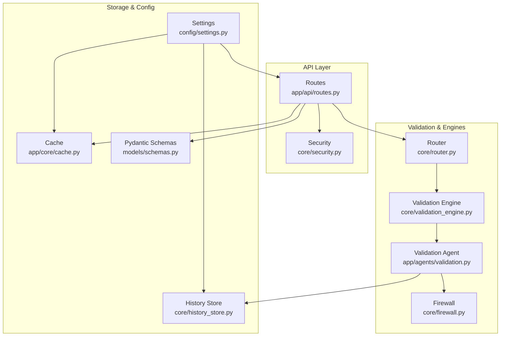
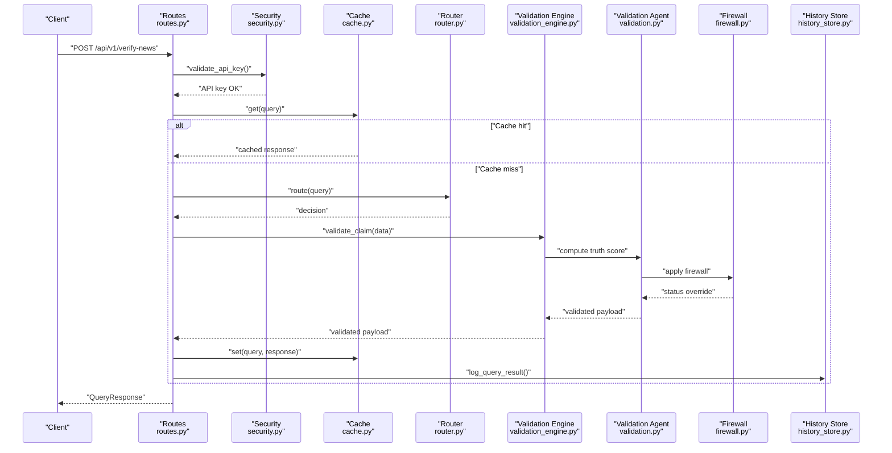
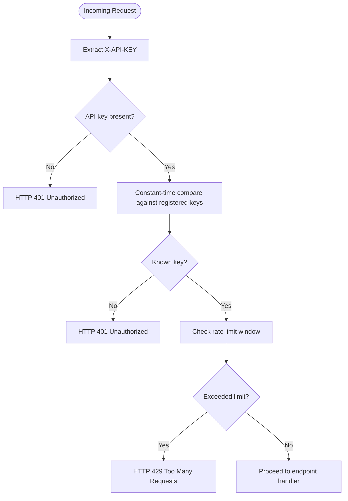
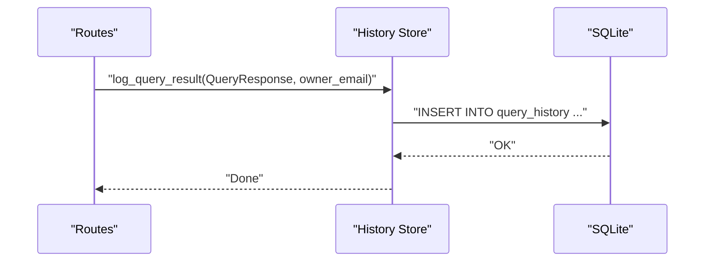
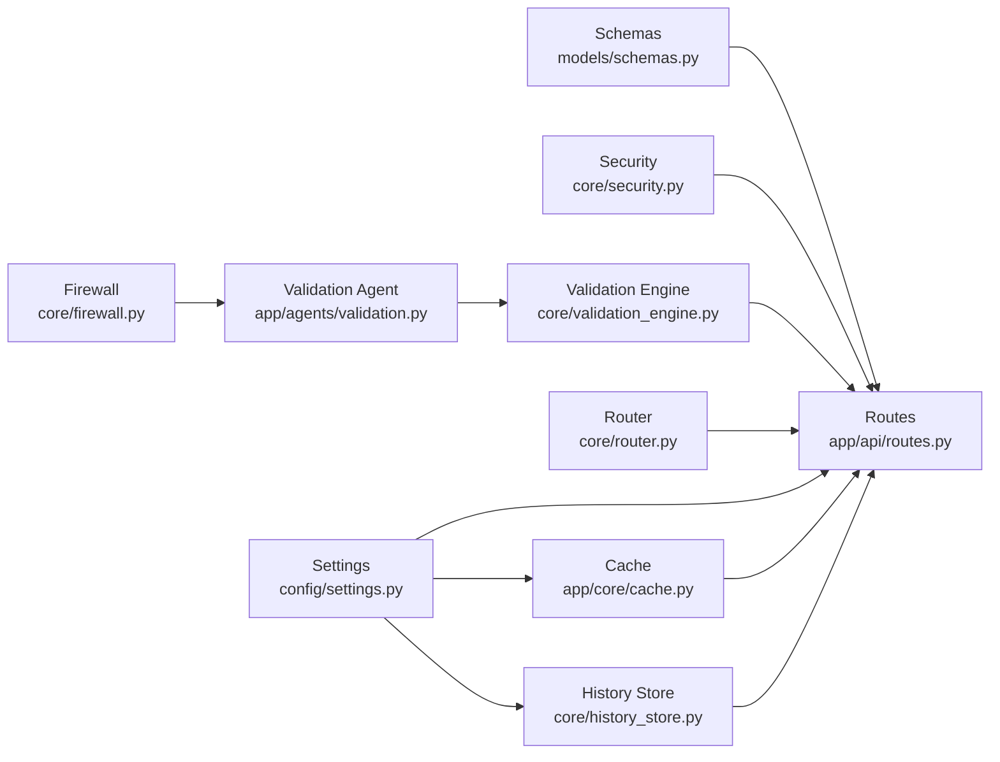

# Data Validation & Security

<cite>
**Referenced Files in This Document**
- [schemas.py](file://veritas-ai/models/schemas.py)
- [security.py](file://veritas-ai/core/security.py)
- [routes.py](file://veritas-ai/app/api/routes.py)
- [validation_engine.py](file://veritas-ai/core/validation_engine.py)
- [validation.py](file://veritas-ai/app/agents/validation.py)
- [firewall.py](file://veritas-ai/core/firewall.py)
- [history_store.py](file://veritas-ai/core/history_store.py)
- [settings.py](file://veritas-ai/config/settings.py)
- [cache.py](file://veritas-ai/app/core/cache.py)
- [router.py](file://veritas-ai/core/router.py)
</cite>

## Table of Contents
1. [Introduction](#introduction)
2. [Project Structure](#project-structure)
3. [Core Components](#core-components)
4. [Architecture Overview](#architecture-overview)
5. [Detailed Component Analysis](#detailed-component-analysis)
6. [Dependency Analysis](#dependency-analysis)
7. [Performance Considerations](#performance-considerations)
8. [Troubleshooting Guide](#troubleshooting-guide)
9. [Conclusion](#conclusion)
10. [Appendices](#appendices)

## Introduction
This document provides comprehensive coverage of data validation rules and security measures across the storage and processing components of the system. It documents Pydantic model validation schemas, field constraints, type checking, and business rule enforcement. It also explains input sanitization processes, access control mechanisms, encryption strategies, audit logging, data masking techniques, and backup/recovery procedures. The goal is to make these controls understandable for both technical and non-technical stakeholders.

## Project Structure
The system organizes validation and security concerns across models, APIs, engines, and persistence layers:
- Models define strict Pydantic schemas for request/response structures.
- API routes enforce authentication and authorization, and delegate processing to pipelines.
- Engines implement truth scoring, firewalling, and explainability.
- Persistence stores query history in SQLite with controlled access.
- Configuration centralizes environment-driven settings for security and performance.

**Diagram sources**
- [routes.py:1-251](file://veritas-ai/app/api/routes.py#L1-L251)
- [security.py:1-129](file://veritas-ai/core/security.py#L1-L129)
- [validation_engine.py:1-18](file://veritas-ai/core/validation_engine.py#L1-L18)
- [validation.py:1-314](file://veritas-ai/app/agents/validation.py#L1-L314)
- [firewall.py:1-47](file://veritas-ai/core/firewall.py#L1-L47)
- [router.py:1-182](file://veritas-ai/core/router.py#L1-L182)
- [history_store.py:1-106](file://veritas-ai/core/history_store.py#L1-L106)
- [cache.py:1-172](file://veritas-ai/app/core/cache.py#L1-L172)
- [settings.py:1-83](file://veritas-ai/config/settings.py#L1-L83)
- [schemas.py:1-88](file://veritas-ai/models/schemas.py#L1-L88)

**Section sources**
- [routes.py:1-251](file://veritas-ai/app/api/routes.py#L1-L251)
- [schemas.py:1-88](file://veritas-ai/models/schemas.py#L1-L88)
- [settings.py:1-83](file://veritas-ai/config/settings.py#L1-L83)

## Core Components
This section documents the primary components involved in validation and security.

- Pydantic Schemas: Define strict field types, literal enums, and numeric bounds for all request/response models. These act as the first line of validation for incoming and outgoing data.
- Security: Implements API key extraction, validation, rate limiting, and user resolution with secure comparison.
- Validation Engine: Bridges asynchronous orchestration with synchronous truth scoring to avoid blocking the event loop.
- Validation Agent: Computes truth scores, applies firewall rules, merges consensus, and generates explanations.
- Firewall: Applies deterministic overrides to clamp statuses based on source credibility, contradictions, and truth thresholds.
- History Store: Persists query results to SQLite with owner scoping and controlled access.
- Router: Classifies queries and routes to appropriate pipelines with caching and metrics.
- Cache: Provides a two-tier caching layer with graceful degradation and statistics.

**Section sources**
- [schemas.py:1-88](file://veritas-ai/models/schemas.py#L1-L88)
- [security.py:1-129](file://veritas-ai/core/security.py#L1-L129)
- [validation_engine.py:1-18](file://veritas-ai/core/validation_engine.py#L1-L18)
- [validation.py:1-314](file://veritas-ai/app/agents/validation.py#L1-L314)
- [firewall.py:1-47](file://veritas-ai/core/firewall.py#L1-L47)
- [history_store.py:1-106](file://veritas-ai/core/history_store.py#L1-L106)
- [router.py:1-182](file://veritas-ai/core/router.py#L1-L182)
- [cache.py:1-172](file://veritas-ai/app/core/cache.py#L1-L172)

## Architecture Overview
The system enforces validation and security at multiple layers:
- API boundary validates presence and correctness of inputs and enforces authentication.
- Pydantic schemas ensure type safety and numeric constraints.
- Engines and agents apply business rules and determinism to prevent hallucinations and inconsistent outputs.
- Persistence is protected by owner-scoped queries and controlled column additions.
- Configuration governs timeouts, limits, and security-related toggles.

**Diagram sources**
- [routes.py:100-128](file://veritas-ai/app/api/routes.py#L100-L128)
- [security.py:51-84](file://veritas-ai/core/security.py#L51-L84)
- [cache.py:66-95](file://veritas-ai/app/core/cache.py#L66-L95)
- [router.py:99-136](file://veritas-ai/core/router.py#L99-L136)
- [validation_engine.py:9-17](file://veritas-ai/core/validation_engine.py#L9-L17)
- [validation.py:278-313](file://veritas-ai/app/agents/validation.py#L278-L313)
- [firewall.py:13-46](file://veritas-ai/core/firewall.py#L13-L46)
- [history_store.py:46-63](file://veritas-ai/core/history_store.py#L46-L63)

## Detailed Component Analysis

### Pydantic Model Validation Schemas
The schemas module defines strict validation rules for all structured data exchanged by the system:
- Numeric bounds: credibility_score, fake_probability, confidence_score, truth_score constrained to [0.0, 1.0].
- Literal enums: status, severity, alert_type, and other fields restrict values to predefined sets.
- Type enforcement: strings, floats, lists, optional fields, and nested models ensure consistent serialization and deserialization.
- Business rule enforcement: derived fields and defaults (e.g., default status, default lists) maintain coherent outputs.

These schemas are used across endpoints and internal processing to guarantee data integrity and prevent injection-like corruption by rejecting out-of-range values and unexpected types.

**Section sources**
- [schemas.py:5-26](file://veritas-ai/models/schemas.py#L5-L26)
- [schemas.py:14-25](file://veritas-ai/models/schemas.py#L14-L25)
- [schemas.py:71-78](file://veritas-ai/models/schemas.py#L71-L78)

### Input Sanitization and Injection Prevention
While the codebase primarily relies on Pydantic validation and FastAPI’s request parsing, additional safeguards are implemented:
- API routes strip whitespace and enforce required fields for queries and claims.
- Authentication middleware extracts and validates API keys from headers, ensuring only authorized requests proceed.
- Logging captures attempts with missing or invalid API keys for monitoring and auditing.

Recommendations for further hardening:
- Apply HTML/text sanitization libraries for untrusted text inputs before storage or rendering.
- Enforce maximum payload sizes and depth limits at the API gateway or framework level.
- Normalize and truncate inputs consistently (already partially addressed by stripping and schema constraints).

**Section sources**
- [routes.py:104-108](file://veritas-ai/app/api/routes.py#L104-L108)
- [routes.py:120-125](file://veritas-ai/app/api/routes.py#L120-L125)
- [security.py:87-109](file://veritas-ai/core/security.py#L87-L109)

### Access Control Mechanisms
Access control is enforced via API keys with tiered rate limits:
- API key extraction from the X-API-KEY header.
- Secure constant-time comparison to mitigate timing attacks.
- Fixed-window rate limiting per tier (free/enterprise) with hourly reset.
- User resolution returns owner metadata for scoping downstream operations.

Endpoints requiring authentication include verification, streaming authorization, alerts, trends, and history access. Public endpoints (e.g., general query) may be optionally allowed via configuration.

**Diagram sources**
- [security.py:51-84](file://veritas-ai/core/security.py#L51-L84)
- [security.py:111-113](file://veritas-ai/core/security.py#L111-L113)

**Section sources**
- [security.py:17-45](file://veritas-ai/core/security.py#L17-L45)
- [security.py:51-84](file://veritas-ai/core/security.py#L51-L84)
- [security.py:87-109](file://veritas-ai/core/security.py#L87-L109)
- [routes.py:114-128](file://veritas-ai/app/api/routes.py#L114-L128)

### Encryption Strategies
- In-transit encryption: The codebase integrates TLS streams and HTTP/TLS libraries, indicating transport-layer encryption for network communications.
- At-rest encryption: No explicit database encryption or file encryption is implemented in the analyzed components. For sensitive data at rest, enable filesystem encryption, database encryption-at-rest, and secure key management.

Note: While TLS is used for secure communication, additional protections should be considered for stored sensitive data.

**Section sources**
- [validation.py:1-314](file://veritas-ai/app/agents/validation.py#L1-L314)

### Audit Logging and Modification Tracking
Audit capabilities are implemented through:
- History store: Persisted query results with owner scoping, timestamps, and key metrics (truth_score, confidence_score).
- Owner tagging: Endpoints resolve owner_email from API keys and tag persisted records for access control and auditability.
- Non-blocking writes: Asynchronous logging avoids impacting response latency.

**Diagram sources**
- [routes.py:72-79](file://veritas-ai/app/api/routes.py#L72-L79)
- [history_store.py:46-63](file://veritas-ai/core/history_store.py#L46-L63)

**Section sources**
- [history_store.py:23-43](file://veritas-ai/core/history_store.py#L23-L43)
- [history_store.py:66-102](file://veritas-ai/core/history_store.py#L66-L102)
- [routes.py:34-41](file://veritas-ai/app/api/routes.py#L34-L41)

### Data Masking Techniques
Privacy protection and compliance:
- Owner scoping: History queries filter by owner_email to limit visibility to requester’s own records.
- Header obfuscation: The environment exposes mechanisms to mask sensitive header values in logs and diagnostics.
- Recommendation: Apply field-level masking for PII in logs and telemetry; redact tokens and personally identifiable attributes before persisting or exposing.

**Section sources**
- [history_store.py:66-90](file://veritas-ai/core/history_store.py#L66-L90)
- [settings.py:69-80](file://veritas-ai/config/settings.py#L69-L80)

### Backup and Recovery Procedures
Current persistence layer:
- SQLite-backed history store with WAL mode and NORMAL sync for durability and concurrency.
- Controlled initialization with safe defaults and defensive column addition.

Recommended backup and recovery practices:
- Schedule regular snapshots of the SQLite database file.
- Maintain offsite backups with integrity checks.
- Test restoration procedures periodically.
- For high availability, consider clustered databases or replication.

**Section sources**
- [history_store.py:15-20](file://veritas-ai/core/history_store.py#L15-L20)
- [history_store.py:23-43](file://veritas-ai/core/history_store.py#L23-L43)

## Dependency Analysis
The following diagram shows key dependencies among components involved in validation and security:

**Diagram sources**
- [schemas.py:1-88](file://veritas-ai/models/schemas.py#L1-L88)
- [routes.py:1-251](file://veritas-ai/app/api/routes.py#L1-L251)
- [security.py:1-129](file://veritas-ai/core/security.py#L1-L129)
- [cache.py:1-172](file://veritas-ai/app/core/cache.py#L1-L172)
- [router.py:1-182](file://veritas-ai/core/router.py#L1-L182)
- [validation_engine.py:1-18](file://veritas-ai/core/validation_engine.py#L1-L18)
- [validation.py:1-314](file://veritas-ai/app/agents/validation.py#L1-L314)
- [firewall.py:1-47](file://veritas-ai/core/firewall.py#L1-L47)
- [history_store.py:1-106](file://veritas-ai/core/history_store.py#L1-L106)
- [settings.py:1-83](file://veritas-ai/config/settings.py#L1-L83)

**Section sources**
- [routes.py:1-251](file://veritas-ai/app/api/routes.py#L1-L251)
- [validation_engine.py:1-18](file://veritas-ai/core/validation_engine.py#L1-L18)
- [validation.py:1-314](file://veritas-ai/app/agents/validation.py#L1-L314)
- [firewall.py:1-47](file://veritas-ai/core/firewall.py#L1-L47)
- [history_store.py:1-106](file://veritas-ai/core/history_store.py#L1-L106)
- [cache.py:1-172](file://veritas-ai/app/core/cache.py#L1-L172)
- [router.py:1-182](file://veritas-ai/core/router.py#L1-L182)
- [settings.py:1-83](file://veritas-ai/config/settings.py#L1-L83)
- [schemas.py:1-88](file://veritas-ai/models/schemas.py#L1-L88)

## Performance Considerations
- Asynchronous orchestration: Validation engine delegates CPU-intensive scoring to a thread pool to avoid blocking the event loop.
- Caching: Two-tier cache (local TTL + Redis) reduces latency and load; fallback to local-only cache ensures resilience.
- Router classification: Regex-based classification quickly routes simple queries to fast paths, reducing cost for straightforward cases.
- Metrics: Router tracks average latencies per route to inform tuning.

Recommendations:
- Monitor cache hit rates and tune TTL and capacity based on workload.
- Scale Redis horizontally for high-throughput deployments.
- Profile scoring functions and consider batching where feasible.

**Section sources**
- [validation_engine.py:9-17](file://veritas-ai/core/validation_engine.py#L9-L17)
- [cache.py:66-95](file://veritas-ai/app/core/cache.py#L66-L95)
- [router.py:99-136](file://veritas-ai/core/router.py#L99-L136)
- [router.py:142-149](file://veritas-ai/core/router.py#L142-L149)

## Troubleshooting Guide
Common issues and resolutions:
- Authentication failures:
  - Symptom: 401 errors on protected endpoints.
  - Cause: Missing or invalid X-API-KEY.
  - Action: Verify API key presence and validity; confirm rate limit windows.
- Rate limit exceeded:
  - Symptom: 429 responses after repeated requests.
  - Cause: Tier-specific limits reached within the hourly window.
  - Action: Reduce request frequency or upgrade tier.
- Cache connectivity issues:
  - Symptom: Degraded performance or cache misses.
  - Cause: Redis unavailability.
  - Action: Confirm Redis connectivity; monitor fallback to local cache.
- History persistence errors:
  - Symptom: Missing or partial history entries.
  - Cause: SQLite write failures or permission issues.
  - Action: Check database file permissions and disk space; review WAL mode settings.

**Section sources**
- [security.py:51-84](file://veritas-ai/core/security.py#L51-L84)
- [cache.py:43-65](file://veritas-ai/app/core/cache.py#L43-L65)
- [history_store.py:15-20](file://veritas-ai/core/history_store.py#L15-L20)

## Conclusion
The system employs robust validation through Pydantic schemas, deterministic business rules via the validation agent and firewall, and layered security with API key-based access control and rate limiting. Persistence is auditable with owner-scoped history storage, and performance is optimized through asynchronous processing and caching. To strengthen data protection, deploy transport encryption, consider database encryption-at-rest, implement data masking, and establish formal backup and recovery procedures.

## Appendices

### Pydantic Schema Reference
- Source: [schemas.py:5-26](file://veritas-ai/models/schemas.py#L5-L26)
- QueryResponse: Includes numeric bounds for scores, literal status, and nested Source list.
- HistoryEntry: Stores query metadata with owner scoping for auditability.

**Section sources**
- [schemas.py:5-26](file://veritas-ai/models/schemas.py#L5-L26)
- [schemas.py:71-78](file://veritas-ai/models/schemas.py#L71-L78)

### Security Configuration Checklist
- Environment variables:
  - VERITAS_DEV_API_KEY, VERITAS_ENTERPRISE_API_KEY
  - VERITAS_FREE_TIER_LIMIT, VERITAS_ENTERPRISE_LIMIT
  - VERITAS_DEV_API_OWNER, VERITAS_ENTERPRISE_OWNER
  - REDIS_HOST, REDIS_PORT, REDIS_DB
  - PUBLIC_API_BASE_URL, PUBLIC_WS_BASE_URL
- Recommendations:
  - Rotate API keys regularly.
  - Enforce HTTPS and TLS for all endpoints.
  - Restrict CORS origins to trusted domains.

**Section sources**
- [security.py:17-45](file://veritas-ai/core/security.py#L17-L45)
- [settings.py:69-80](file://veritas-ai/config/settings.py#L69-L80)