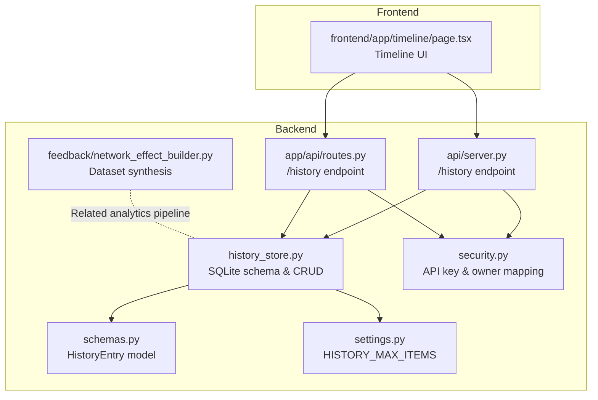
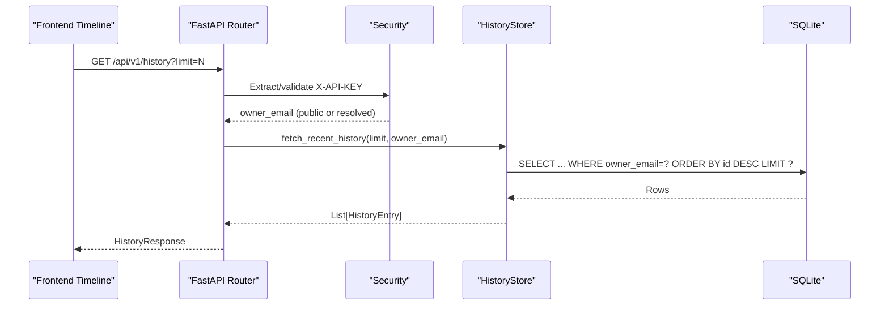
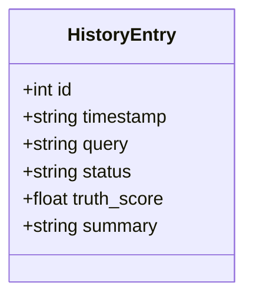
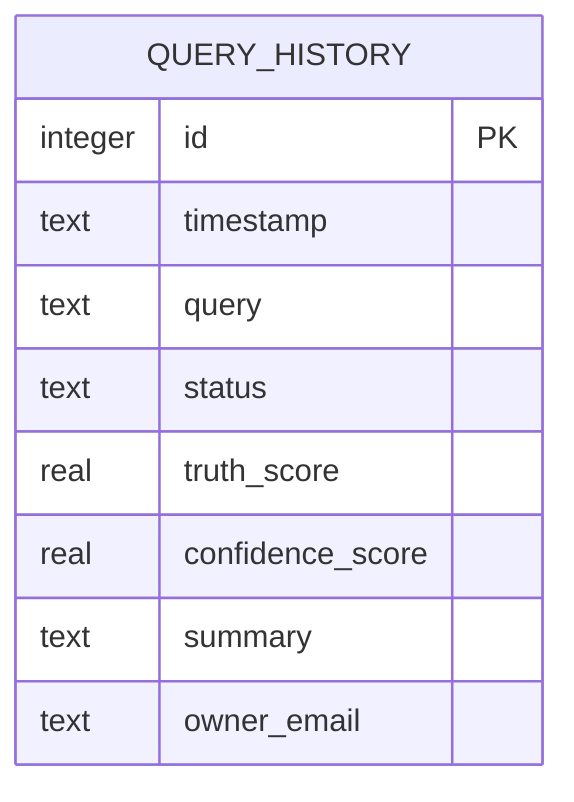
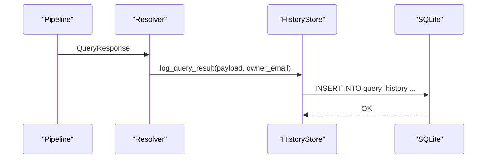
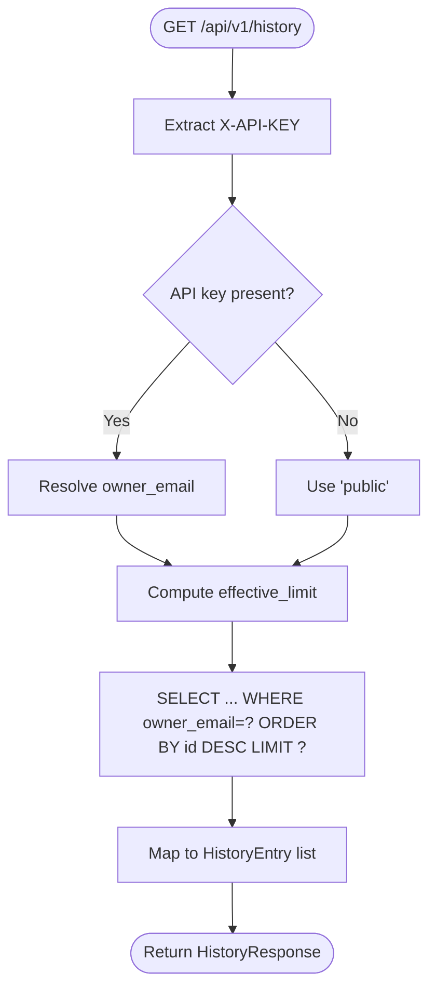
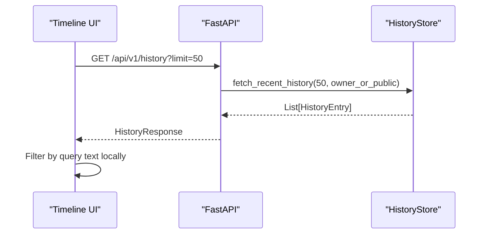
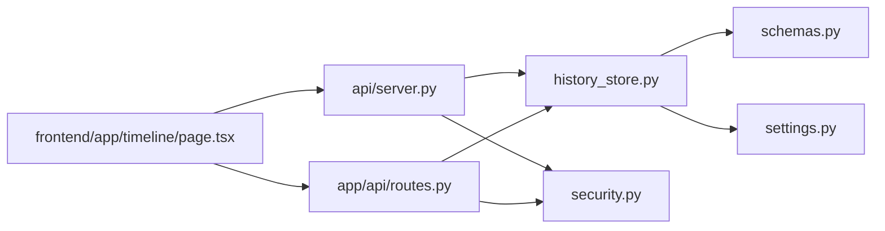

# History Store Schema

<cite>
**Referenced Files in This Document**
- [history_store.py](file://veritas-ai/core/history_store.py)
- [schemas.py](file://veritas-ai/models/schemas.py)
- [settings.py](file://veritas-ai/config/settings.py)
- [server.py](file://veritas-ai/api/server.py)
- [routes.py](file://veritas-ai/app/api/routes.py)
- [page.tsx](file://veritas-ai/frontend/app/timeline/page.tsx)
- [security.py](file://veritas-ai/core/security.py)
- [network_effect_builder.py](file://veritas-ai/feedback/network_effect_builder.py)
</cite>

## Table of Contents
1. [Introduction](#introduction)
2. [Project Structure](#project-structure)
3. [Core Components](#core-components)
4. [Architecture Overview](#architecture-overview)
5. [Detailed Component Analysis](#detailed-component-analysis)
6. [Dependency Analysis](#dependency-analysis)
7. [Performance Considerations](#performance-considerations)
8. [Troubleshooting Guide](#troubleshooting-guide)
9. [Conclusion](#conclusion)
10. [Appendices](#appendices)

## Introduction
This document specifies the history store schema used for audit trails and trend analysis. It documents the HistoryEntry model, the underlying SQLite-backed query history table, logging and retrieval flows, data retention and privacy controls, and the aggregation and export mechanisms that enable trend analysis and reporting. It also outlines the query interface for historical data retrieval and filtering, and highlights current limitations and recommended extensions for advanced analytics and compliance.

## Project Structure
The history store spans Python backend components, shared Pydantic models, configuration, and a simple frontend timeline view. The primary persistence layer is a SQLite database located under the project’s data directory.

**Diagram sources**
- [history_store.py:1-106](file://veritas-ai/core/history_store.py#L1-L106)
- [schemas.py:71-83](file://veritas-ai/models/schemas.py#L71-L83)
- [settings.py:27](file://veritas-ai/config/settings.py#L27)
- [security.py:87-109](file://veritas-ai/core/security.py#L87-L109)
- [server.py:132-140](file://veritas-ai/api/server.py#L132-L140)
- [routes.py:147-160](file://veritas-ai/app/api/routes.py#L147-L160)
- [page.tsx:16-34](file://veritas-ai/frontend/app/timeline/page.tsx#L16-L34)
- [network_effect_builder.py:24-79](file://veritas-ai/feedback/network_effect_builder.py#L24-L79)

**Section sources**
- [history_store.py:1-106](file://veritas-ai/core/history_store.py#L1-L106)
- [schemas.py:71-83](file://veritas-ai/models/schemas.py#L71-L83)
- [settings.py:27](file://veritas-ai/config/settings.py#L27)
- [server.py:132-140](file://veritas-ai/api/server.py#L132-L140)
- [routes.py:147-160](file://veritas-ai/app/api/routes.py#L147-L160)
- [page.tsx:16-34](file://veritas-ai/frontend/app/timeline/page.tsx#L16-L34)
- [network_effect_builder.py:24-79](file://veritas-ai/feedback/network_effect_builder.py#L24-L79)

## Core Components
- HistoryEntry model: Defines the shape of stored history items returned to clients, including identifiers, timestamps, query text, status, truth score, and summary.
- SQLite schema: Stores timestamped query records with status, truth/confidence scores, summary, and owner association.
- Logging and retrieval: Asynchronous logging of query results and retrieval with configurable limits and owner scoping.
- Configuration: Centralized limit for history items via settings.
- Authentication and privacy: Owner scoping via API key-resolved owner emails; public fallback when unauthenticated.

**Section sources**
- [schemas.py:71-83](file://veritas-ai/models/schemas.py#L71-L83)
- [history_store.py:23-43](file://veritas-ai/core/history_store.py#L23-L43)
- [history_store.py:46-63](file://veritas-ai/core/history_store.py#L46-L63)
- [history_store.py:66-102](file://veritas-ai/core/history_store.py#L66-L102)
- [settings.py:27](file://veritas-ai/config/settings.py#L27)
- [security.py:87-109](file://veritas-ai/core/security.py#L87-L109)

## Architecture Overview
The history store integrates with the query resolution pipeline and exposes a simple GET endpoint to retrieve recent entries. Owner scoping is enforced via API keys, enabling per-user audit trails alongside a public fallback.

**Diagram sources**
- [server.py:132-140](file://veritas-ai/api/server.py#L132-L140)
- [security.py:87-109](file://veritas-ai/core/security.py#L87-L109)
- [history_store.py:66-102](file://veritas-ai/core/history_store.py#L66-L102)

## Detailed Component Analysis

### HistoryEntry Model
- Purpose: Standardized representation of historical query records for transport and UI rendering.
- Fields: id, timestamp, query, status, truth_score, summary.
- Validation: truth_score constrained to [0.0, 1.0].

**Diagram sources**
- [schemas.py:71-78](file://veritas-ai/models/schemas.py#L71-L78)

**Section sources**
- [schemas.py:71-78](file://veritas-ai/models/schemas.py#L71-L78)

### SQLite Schema and Storage
- Table: query_history with columns for id, timestamp, query, status, truth_score, confidence_score, summary, owner_email.
- Defaults: owner_email defaults to 'public'; column added with defensive migration.
- Indexing: implicit primary key index on id; ordering by id desc for recent-first retrieval.
- WAL mode: enabled for improved concurrency and durability.

**Diagram sources**
- [history_store.py:27-36](file://veritas-ai/core/history_store.py#L27-L36)

**Section sources**
- [history_store.py:23-43](file://veritas-ai/core/history_store.py#L23-L43)
- [history_store.py:15-20](file://veritas-ai/core/history_store.py#L15-L20)

### Logging Flow
- Trigger: After query resolution completes, the response is logged asynchronously to the history store.
- Columns persisted: timestamp, query, status, truth_score, confidence_score, summary, owner_email.
- Owner resolution: If an API key is present, owner_email is resolved from the key; otherwise 'public'.

**Diagram sources**
- [server.py:53-77](file://veritas-ai/api/server.py#L53-L77)
- [history_store.py:46-63](file://veritas-ai/core/history_store.py#L46-L63)

**Section sources**
- [server.py:53-77](file://veritas-ai/api/server.py#L53-L77)
- [history_store.py:46-63](file://veritas-ai/core/history_store.py#L46-L63)

### Retrieval and Filtering
- Endpoint: GET /api/v1/history with optional limit parameter.
- Owner scoping: If X-API-KEY is provided, owner_email resolves to the key’s owner; otherwise 'public'.
- Limiting: Uses settings.HISTORY_MAX_ITEMS when not specified.
- Projection: Returns selected fields suitable for timeline UI.

**Diagram sources**
- [server.py:132-140](file://veritas-ai/api/server.py#L132-L140)
- [history_store.py:66-102](file://veritas-ai/core/history_store.py#L66-L102)
- [settings.py:27](file://veritas-ai/config/settings.py#L27)

**Section sources**
- [server.py:132-140](file://veritas-ai/api/server.py#L132-L140)
- [routes.py:147-160](file://veritas-ai/app/api/routes.py#L147-L160)
- [history_store.py:66-102](file://veritas-ai/core/history_store.py#L66-L102)
- [settings.py:27](file://veritas-ai/config/settings.py#L27)

### Data Retention Policies
- Current behavior: No explicit retention policy or automatic cleanup is implemented in the history store module.
- Limit enforcement: A maximum number of items is enforced via settings.HISTORY_MAX_ITEMS during retrieval, but this does not imply automatic pruning.
- Recommendation: Implement periodic cleanup jobs to remove older entries based on configurable retention windows.

**Section sources**
- [settings.py:27](file://veritas-ai/config/settings.py#L27)
- [history_store.py:66-102](file://veritas-ai/core/history_store.py#L66-L102)

### Archival Procedures
- Current state: No archival mechanism is present in the history store module.
- Suggested approach: Periodic export of historical entries to compressed JSON/JSONL files with metadata, followed by pruning or partitioning in SQLite.

**Section sources**
- [history_store.py:23-43](file://veritas-ai/core/history_store.py#L23-L43)

### Cleanup Automation
- Current state: No scheduled cleanup automation exists.
- Suggested implementation: Background job to delete entries older than a configured retention period; optionally archive to external storage.

**Section sources**
- [history_store.py:23-43](file://veritas-ai/core/history_store.py#L23-L43)

### Aggregation Functions for Trend Analysis
- Current state: The history store does not expose built-in aggregation endpoints.
- Trend engine: Separate predictive engine generates trend alerts from raw query streams; it is not tied to the history table.
- Recommendations:
  - Add SQL-based aggregations (counts, averages, distributions) for truth/confidence scores and status distributions.
  - Provide endpoints for time-bucketed statistics (daily/weekly) and top queries by frequency.

**Section sources**
- [network_effect_builder.py:24-79](file://veritas-ai/feedback/network_effect_builder.py#L24-L79)

### Usage Patterns and System Performance Monitoring
- Current state: The history store persists performance-relevant fields (e.g., latency_ms in the resolver) but does not expose them via the history API.
- Recommendations:
  - Extend HistoryEntry to include performance metrics (latency_ms, cache_hit, routing_decision).
  - Expose aggregated metrics via dedicated endpoints for dashboards and SLIs.

**Section sources**
- [server.py:47-77](file://veritas-ai/api/server.py#L47-L77)

### Query Interface for Historical Data Retrieval
- Endpoint: GET /api/v1/history
- Parameters:
  - limit: Integer, default from settings.HISTORY_MAX_ITEMS, range 1–100.
  - X-API-KEY: Optional; if present, owner-scoped retrieval; otherwise public.
- Response: HistoryResponse with items as List[HistoryEntry].
- Frontend usage: Timeline page fetches recent history and filters client-side by query text.

**Diagram sources**
- [page.tsx:16-34](file://veritas-ai/frontend/app/timeline/page.tsx#L16-L34)
- [server.py:132-140](file://veritas-ai/api/server.py#L132-L140)
- [history_store.py:66-102](file://veritas-ai/core/history_store.py#L66-L102)

**Section sources**
- [server.py:132-140](file://veritas-ai/api/server.py#L132-L140)
- [routes.py:147-160](file://veritas-ai/app/api/routes.py#L147-L160)
- [page.tsx:16-34](file://veritas-ai/frontend/app/timeline/page.tsx#L16-L34)

### Data Export Capabilities
- Current state: No native export endpoint for analytics/reporting.
- Suggested implementation:
  - CSV/JSON export endpoint with filters (time range, owner, status).
  - Batch export job for archival and external analytics systems.

**Section sources**
- [history_store.py:23-43](file://veritas-ai/core/history_store.py#L23-L43)

### Privacy Considerations and Data Anonymization
- Owner scoping: owner_email is stored alongside each entry; retrieval can be scoped to the authenticated owner.
- Public fallback: Unauthenticated requests see only owner_email = 'public'.
- Recommendations:
  - Add anonymization options for exports (remove personally identifiable attributes).
  - Enforce stricter retention and deletion policies aligned with privacy regulations.
  - Provide opt-out mechanisms for sensitive users.

**Section sources**
- [history_store.py:39-42](file://veritas-ai/core/history_store.py#L39-L42)
- [history_store.py:69-90](file://veritas-ai/core/history_store.py#L69-L90)
- [security.py:87-109](file://veritas-ai/core/security.py#L87-L109)

## Dependency Analysis
The history store depends on shared models, configuration, and security utilities. The retrieval endpoints depend on the store and enforce owner scoping.

**Diagram sources**
- [history_store.py:6-7](file://veritas-ai/core/history_store.py#L6-L7)
- [server.py:12-13](file://veritas-ai/api/server.py#L12-L13)
- [routes.py:34-41](file://veritas-ai/app/api/routes.py#L34-L41)
- [page.tsx:5-6](file://veritas-ai/frontend/app/timeline/page.tsx#L5-L6)

**Section sources**
- [history_store.py:6-7](file://veritas-ai/core/history_store.py#L6-L7)
- [server.py:12-13](file://veritas-ai/api/server.py#L12-L13)
- [routes.py:34-41](file://veritas-ai/app/api/routes.py#L34-L41)
- [page.tsx:5-6](file://veritas-ai/frontend/app/timeline/page.tsx#L5-L6)

## Performance Considerations
- SQLite configuration: WAL mode and NORMAL sync improve throughput and durability.
- Retrieval pattern: Ordering by id desc with LIMIT supports efficient recent-first reads.
- Recommendations:
  - Add an index on owner_email for owner-scoped queries.
  - Consider partitioning or sharding for very large histories.
  - Offload heavy analytics to materialized views or external analytics stores.

**Section sources**
- [history_store.py:15-20](file://veritas-ai/core/history_store.py#L15-L20)
- [history_store.py:66-102](file://veritas-ai/core/history_store.py#L66-L102)

## Troubleshooting Guide
- History endpoint returns empty or limited results:
  - Verify limit parameter and settings.HISTORY_MAX_ITEMS.
  - Confirm owner scoping via X-API-KEY.
- Authentication errors:
  - Ensure valid X-API-KEY is provided; otherwise owner_email falls back to 'public'.
- Database connectivity:
  - Confirm data directory exists and SQLite file is writable.

**Section sources**
- [settings.py:27](file://veritas-ai/config/settings.py#L27)
- [security.py:87-109](file://veritas-ai/core/security.py#L87-L109)
- [history_store.py:15-20](file://veritas-ai/core/history_store.py#L15-L20)

## Conclusion
The history store provides a compact, owner-scoped audit trail persisted in SQLite with a clean Pydantic model for transport. While retrieval and owner scoping are straightforward, the current implementation lacks explicit retention, archival, and aggregation features. Extending the schema and adding endpoints for retention, export, and analytics will enable robust trend analysis and compliance-ready operations.

## Appendices

### API Definition: GET /api/v1/history
- Description: Fetch recent query history with optional owner scoping.
- Headers:
  - X-API-KEY: Optional; if present, owner-scoped retrieval.
- Query Parameters:
  - limit: Integer, default from settings.HISTORY_MAX_ITEMS, range 1–100.
- Response: HistoryResponse with items as List[HistoryEntry].

**Section sources**
- [server.py:132-140](file://veritas-ai/api/server.py#L132-L140)
- [routes.py:147-160](file://veritas-ai/app/api/routes.py#L147-L160)
- [settings.py:27](file://veritas-ai/config/settings.py#L27)