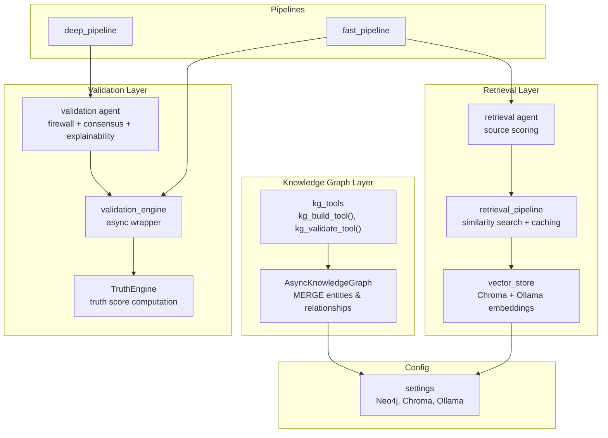
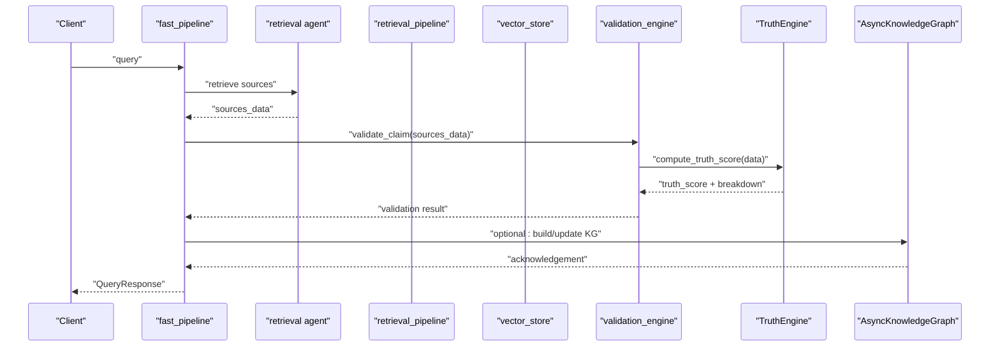
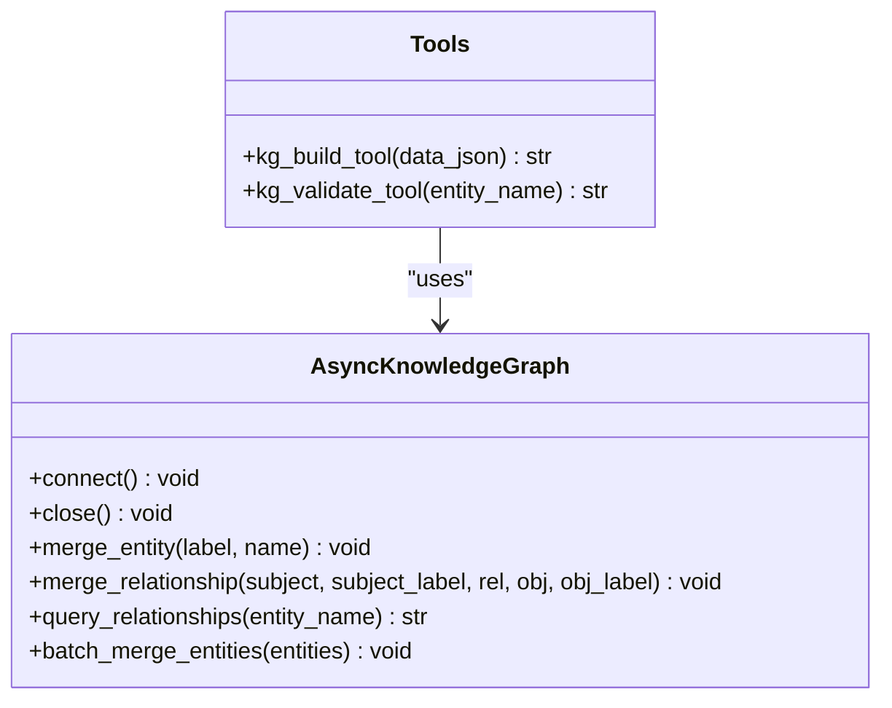
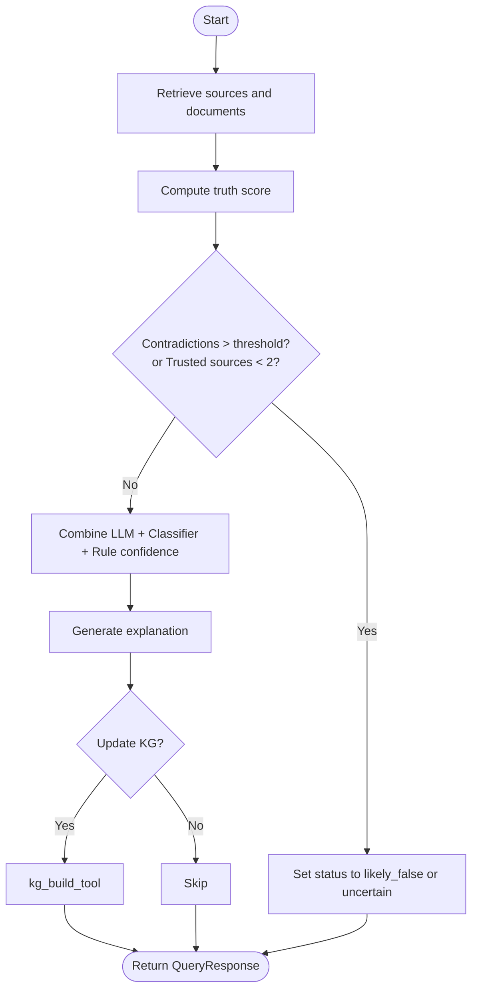
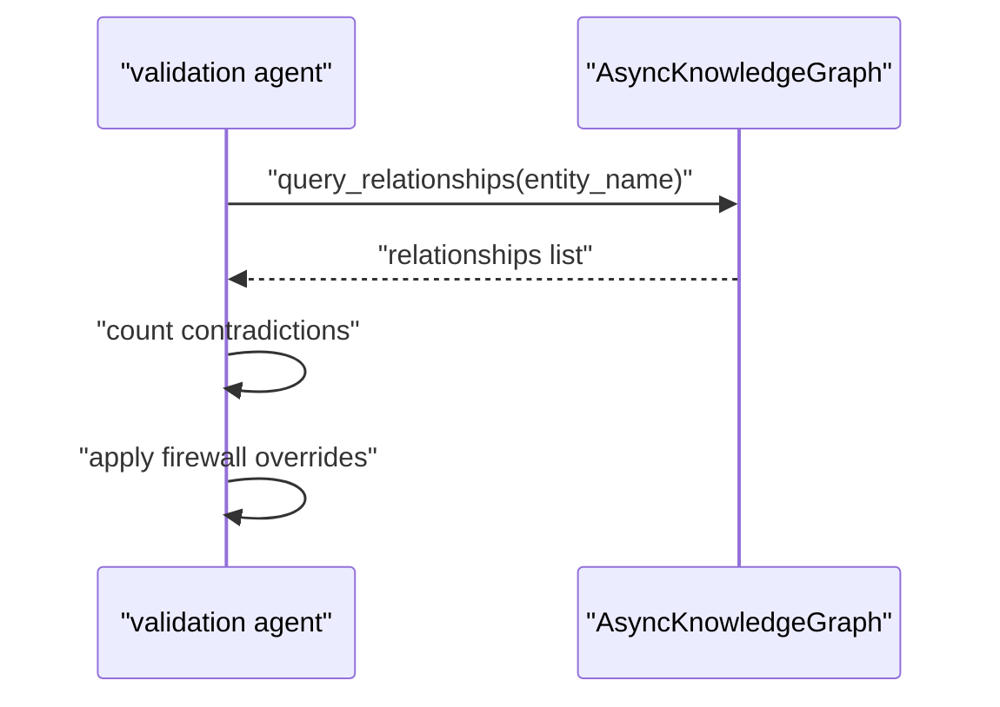
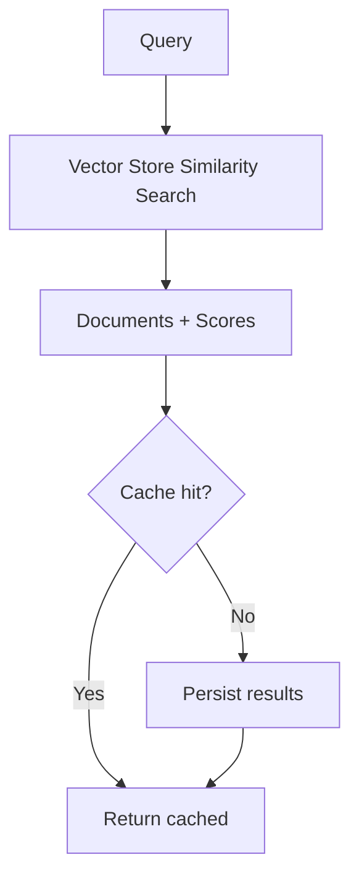
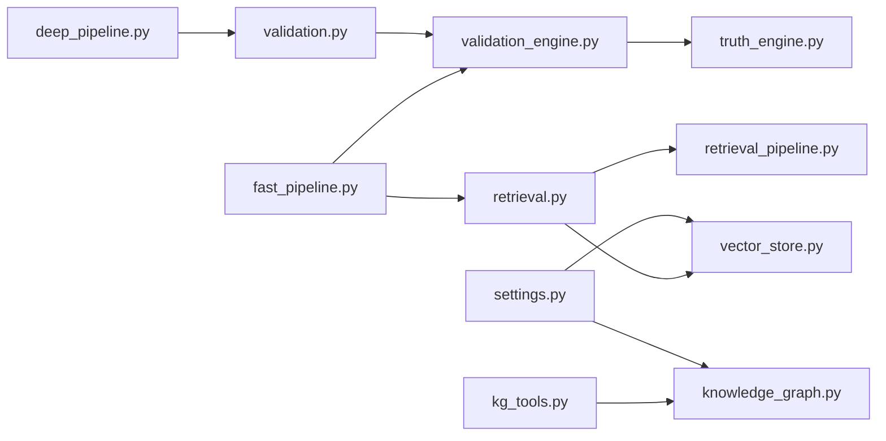

# Knowledge Graph Schema

<cite>
**Referenced Files in This Document**
- [knowledge_graph.py](file://veritas-ai/memory/knowledge_graph.py)
- [kg_tools.py](file://veritas-ai/tools/kg_tools.py)
- [schemas.py](file://veritas-ai/models/schemas.py)
- [validation_engine.py](file://veritas-ai/core/validation_engine.py)
- [truth_engine.py](file://veritas-ai/core/truth_engine.py)
- [validation.py](file://veritas-ai/app/agents/validation.py)
- [retrieval.py](file://veritas-ai/app/agents/retrieval.py)
- [vector_store.py](file://veritas-ai/memory/vector_store.py)
- [retrieval_pipeline.py](file://veritas-ai/pipelines/retrieval_pipeline.py)
- [fast_pipeline.py](file://veritas-ai/pipelines/fast_pipeline.py)
- [deep_pipeline.py](file://veritas-ai/pipelines/deep_pipeline.py)
- [settings.py](file://veritas-ai/config/settings.py)
</cite>

## Table of Contents
1. [Introduction](#introduction)
2. [Project Structure](#project-structure)
3. [Core Components](#core-components)
4. [Architecture Overview](#architecture-overview)
5. [Detailed Component Analysis](#detailed-component-analysis)
6. [Dependency Analysis](#dependency-analysis)
7. [Performance Considerations](#performance-considerations)
8. [Troubleshooting Guide](#troubleshooting-guide)
9. [Conclusion](#conclusion)
10. [Appendices](#appendices)

## Introduction
This document specifies the knowledge graph schema and semantics for claim-source-fact relationships and semantic reasoning. It defines the entity types, allowed relationships, and the RDF-like triple representation used to model facts. It also documents schema validation rules, constraint enforcement, integrity checks, and the graph traversal patterns used for evidence gathering and contradiction detection. Finally, it describes semantic similarity mechanisms, knowledge propagation, and indexing strategies for efficient graph queries.

## Project Structure
The knowledge graph is implemented as a Neo4j-backed asynchronous graph with a Python wrapper and supporting retrieval and validation pipelines. Retrieval uses a local vector store for semantic similarity, while validation computes a multi-factor truth score and applies a deterministic firewall and consensus mechanism.

**Diagram sources**
- [knowledge_graph.py:12-160](file://veritas-ai/memory/knowledge_graph.py#L12-L160)
- [kg_tools.py:1-50](file://veritas-ai/tools/kg_tools.py#L1-L50)
- [vector_store.py:1-27](file://veritas-ai/memory/vector_store.py#L1-L27)
- [retrieval_pipeline.py:1-112](file://veritas-ai/pipelines/retrieval_pipeline.py#L1-L112)
- [retrieval.py:1-101](file://veritas-ai/app/agents/retrieval.py#L1-L101)
- [validation_engine.py:1-18](file://veritas-ai/core/validation_engine.py#L1-L18)
- [truth_engine.py:1-117](file://veritas-ai/core/truth_engine.py#L1-L117)
- [validation.py:1-314](file://veritas-ai/app/agents/validation.py#L1-L314)
- [fast_pipeline.py:1-22](file://veritas-ai/pipelines/fast_pipeline.py#L1-L22)
- [deep_pipeline.py:1-17](file://veritas-ai/pipelines/deep_pipeline.py#L1-L17)
- [settings.py:1-83](file://veritas-ai/config/settings.py#L1-L83)

**Section sources**
- [knowledge_graph.py:12-160](file://veritas-ai/memory/knowledge_graph.py#L12-L160)
- [kg_tools.py:1-50](file://veritas-ai/tools/kg_tools.py#L1-L50)
- [vector_store.py:1-27](file://veritas-ai/memory/vector_store.py#L1-L27)
- [retrieval_pipeline.py:1-112](file://veritas-ai/pipelines/retrieval_pipeline.py#L1-L112)
- [retrieval.py:1-101](file://veritas-ai/app/agents/retrieval.py#L1-L101)
- [validation_engine.py:1-18](file://veritas-ai/core/validation_engine.py#L1-L18)
- [truth_engine.py:1-117](file://veritas-ai/core/truth_engine.py#L1-L117)
- [validation.py:1-314](file://veritas-ai/app/agents/validation.py#L1-L314)
- [fast_pipeline.py:1-22](file://veritas-ai/pipelines/fast_pipeline.py#L1-L22)
- [deep_pipeline.py:1-17](file://veritas-ai/pipelines/deep_pipeline.py#L1-L17)
- [settings.py:1-83](file://veritas-ai/config/settings.py#L1-L83)

## Core Components
- Knowledge Graph Entities and Relationships
  - Allowed labels: Person, Organization, Event, Location
  - Allowed relationships: ANNOUNCED, OCCURRED_AT, AFFILIATED_WITH, REPORTED_BY
  - RDF-like triples: (subject:Label)<--rel-->(object:Label)
- Triple Representation and Property Model
  - Nodes carry a name property; edges represent typed relationships
  - Properties are not modeled beyond name on nodes; relationships are typed
- Schema Validation and Integrity
  - Strict label and relationship whitelist enforced during MERGE
  - Rejects unsupported labels/relationships with warnings
  - Connectivity verified on driver initialization
- Graph Traversal for Evidence and Contradictions
  - Relationship query returns up to a bounded number of outgoing relationships
  - Used to gather evidence and detect structural contradictions
- Semantic Similarity and Knowledge Propagation
  - Vector store (Chroma) with local embeddings for semantic retrieval
  - Propagation occurs implicitly via RAG hits and KG hits used in truth scoring
- Indexing Strategies
  - Neo4j: MERGE on name property; LIMIT 10 for relationship queries
  - Vector DB: Chroma collection with persisted directory and embedding model configured

**Section sources**
- [knowledge_graph.py:8-112](file://veritas-ai/memory/knowledge_graph.py#L8-L112)
- [kg_tools.py:5-49](file://veritas-ai/tools/kg_tools.py#L5-L49)
- [settings.py:50-54](file://veritas-ai/config/settings.py#L50-L54)
- [vector_store.py:15-26](file://veritas-ai/memory/vector_store.py#L15-L26)

## Architecture Overview
The system integrates retrieval, validation, and knowledge graph operations into two pipelines:
- Fast pipeline: minimal retrieval and validation for quick responses
- Deep pipeline: full multi-agent analysis

**Diagram sources**
- [fast_pipeline.py:8-21](file://veritas-ai/pipelines/fast_pipeline.py#L8-L21)
- [retrieval.py:36-100](file://veritas-ai/app/agents/retrieval.py#L36-L100)
- [retrieval_pipeline.py:29-72](file://veritas-ai/pipelines/retrieval_pipeline.py#L29-L72)
- [validation_engine.py:9-17](file://veritas-ai/core/validation_engine.py#L9-L17)
- [truth_engine.py:78-116](file://veritas-ai/core/truth_engine.py#L78-L116)
- [knowledge_graph.py:45-86](file://veritas-ai/memory/knowledge_graph.py#L45-L86)

## Detailed Component Analysis

### Knowledge Graph Schema and Semantics
- Entities
  - Person, Organization, Event, Location
  - Unique by name; enforced via MERGE
- Relationships
  - ANNOUNCED: indicates announcement of an event by an entity
  - OCCURRED_AT: spatial/temporal grounding of an event
  - AFFILIATED_WITH: organizational ties
  - REPORTED_BY: source attribution for facts/events
- RDF-like Triple Representation
  - Subject and object are typed nodes
  - Relationship is a typed edge connecting them
- Validation Rules and Integrity
  - Label whitelist check before MERGE
  - Relationship whitelist check before MERGE
  - Driver connectivity verification
  - Bounded relationship query limit for safety and performance

**Diagram sources**
- [knowledge_graph.py:12-160](file://veritas-ai/memory/knowledge_graph.py#L12-L160)
- [kg_tools.py:5-49](file://veritas-ai/tools/kg_tools.py#L5-L49)

**Section sources**
- [knowledge_graph.py:8-112](file://veritas-ai/memory/knowledge_graph.py#L8-L112)
- [kg_tools.py:5-49](file://veritas-ai/tools/kg_tools.py#L5-L49)

### Claim Verification Workflow and Fact-Linking Algorithm
- Inputs
  - Claim text and candidate sources
  - Retrieved documents from vector store
  - Optional KG updates via tools
- Steps
  1. Retrieve sources and initial credibility
  2. Compute truth score using weighted factors
  3. Apply firewall overrides for contradictions and sourcing thresholds
  4. Combine with classifier confidence for consensus
  5. Generate human-readable explanation
  6. Optionally update KG with structured triples
- Outputs
  - QueryResponse with facts, sources, contradictions, and status

**Diagram sources**
- [validation.py:278-313](file://veritas-ai/app/agents/validation.py#L278-L313)
- [validation_engine.py:9-17](file://veritas-ai/core/validation_engine.py#L9-L17)
- [truth_engine.py:78-116](file://veritas-ai/core/truth_engine.py#L78-L116)
- [kg_tools.py:5-37](file://veritas-ai/tools/kg_tools.py#L5-L37)

**Section sources**
- [validation.py:1-314](file://veritas-ai/app/agents/validation.py#L1-L314)
- [validation_engine.py:1-18](file://veritas-ai/core/validation_engine.py#L1-L18)
- [truth_engine.py:1-117](file://veritas-ai/core/truth_engine.py#L1-L117)
- [kg_tools.py:1-50](file://veritas-ai/tools/kg_tools.py#L1-L50)

### Graph Traversal Patterns for Evidence Gathering and Contradiction Detection
- Evidence Gathering
  - Query relationships for a given entity name
  - Return up to a bounded set of outgoing relationships
- Contradiction Detection
  - Count contradictions from validation stage
  - Firewall override triggers when contradictions exceed threshold
- Integration
  - KG validations are surfaced to the validation agent for status decisions

**Diagram sources**
- [validation.py:161-198](file://veritas-ai/app/agents/validation.py#L161-L198)
- [knowledge_graph.py:88-112](file://veritas-ai/memory/knowledge_graph.py#L88-L112)

**Section sources**
- [validation.py:161-198](file://veritas-ai/app/agents/validation.py#L161-L198)
- [knowledge_graph.py:88-112](file://veritas-ai/memory/knowledge_graph.py#L88-L112)

### Semantic Similarity Calculations and Knowledge Propagation
- Semantic Similarity
  - Local embeddings via Ollama
  - Chroma vector store with configurable persistence
  - Similarity search with optional filters and caching
- Knowledge Propagation
  - KG hits and RAG hits contribute to verifiability factor in truth scoring
  - Higher combined hits increase verifiability score

**Diagram sources**
- [retrieval_pipeline.py:29-72](file://veritas-ai/pipelines/retrieval_pipeline.py#L29-L72)
- [vector_store.py:8-26](file://veritas-ai/memory/vector_store.py#L8-L26)

**Section sources**
- [retrieval_pipeline.py:1-112](file://veritas-ai/pipelines/retrieval_pipeline.py#L1-L112)
- [vector_store.py:1-27](file://veritas-ai/memory/vector_store.py#L1-L27)
- [truth_engine.py:59-70](file://veritas-ai/core/truth_engine.py#L59-L70)

### Indexing Strategies for Efficient Graph Queries and Relationship Lookups
- Neo4j
  - MERGE on label:name enforces uniqueness and enables fast lookup
  - Relationship queries limited to a small bound for performance
- Vector DB
  - Persistent Chroma collection with configured embedding model
  - Retrieval with filters and caching to reduce latency

**Section sources**
- [knowledge_graph.py:45-112](file://veritas-ai/memory/knowledge_graph.py#L45-L112)
- [vector_store.py:15-26](file://veritas-ai/memory/vector_store.py#L15-L26)
- [retrieval_pipeline.py:75-92](file://veritas-ai/pipelines/retrieval_pipeline.py#L75-L92)

## Dependency Analysis
The system exhibits layered dependencies:
- Retrieval depends on vector store and settings
- Validation depends on truth engine and retrieval data
- Knowledge graph tools depend on the async graph wrapper
- Pipelines orchestrate agents and engines

**Diagram sources**
- [settings.py:1-83](file://veritas-ai/config/settings.py#L1-L83)
- [vector_store.py:1-27](file://veritas-ai/memory/vector_store.py#L1-L27)
- [knowledge_graph.py:1-160](file://veritas-ai/memory/knowledge_graph.py#L1-L160)
- [retrieval.py:1-101](file://veritas-ai/app/agents/retrieval.py#L1-L101)
- [retrieval_pipeline.py:1-112](file://veritas-ai/pipelines/retrieval_pipeline.py#L1-L112)
- [validation_engine.py:1-18](file://veritas-ai/core/validation_engine.py#L1-L18)
- [truth_engine.py:1-117](file://veritas-ai/core/truth_engine.py#L1-L117)
- [validation.py:1-314](file://veritas-ai/app/agents/validation.py#L1-L314)
- [fast_pipeline.py:1-22](file://veritas-ai/pipelines/fast_pipeline.py#L1-L22)
- [deep_pipeline.py:1-17](file://veritas-ai/pipelines/deep_pipeline.py#L1-L17)
- [kg_tools.py:1-50](file://veritas-ai/tools/kg_tools.py#L1-L50)

**Section sources**
- [settings.py:1-83](file://veritas-ai/config/settings.py#L1-L83)
- [vector_store.py:1-27](file://veritas-ai/memory/vector_store.py#L1-L27)
- [knowledge_graph.py:1-160](file://veritas-ai/memory/knowledge_graph.py#L1-L160)
- [retrieval.py:1-101](file://veritas-ai/app/agents/retrieval.py#L1-L101)
- [retrieval_pipeline.py:1-112](file://veritas-ai/pipelines/retrieval_pipeline.py#L1-L112)
- [validation_engine.py:1-18](file://veritas-ai/core/validation_engine.py#L1-L18)
- [truth_engine.py:1-117](file://veritas-ai/core/truth_engine.py#L1-L117)
- [validation.py:1-314](file://veritas-ai/app/agents/validation.py#L1-L314)
- [fast_pipeline.py:1-22](file://veritas-ai/pipelines/fast_pipeline.py#L1-L22)
- [deep_pipeline.py:1-17](file://veritas-ai/pipelines/deep_pipeline.py#L1-L17)
- [kg_tools.py:1-50](file://veritas-ai/tools/kg_tools.py#L1-L50)

## Performance Considerations
- Asynchronous Graph Operations
  - Async driver with connection pooling and timeout controls
  - Batching entity merges to reduce round-trips
- Retrieval Efficiency
  - Cached vector store results with TTL
  - Configurable top-k and filters for similarity search
- Truth Scoring
  - Runs in thread pool to avoid blocking the event loop
- Pipeline Design
  - Fast pipeline optimized for speed
  - Deep pipeline reserved for comprehensive analysis

[No sources needed since this section provides general guidance]

## Troubleshooting Guide
- Neo4j Connectivity Issues
  - Verify URI, credentials, and connectivity
  - Check logs for connection errors
- Unsupported Labels/Relationships
  - Ensure labels and relationships match allowed sets
  - Review warnings logged on rejection
- Retrieval Failures
  - Confirm vector store initialization and persistence directory
  - Validate embedding model and base URL
- Validation Overrides
  - Investigate contradiction counts and trusted source thresholds
  - Adjust thresholds or provide stronger evidence

**Section sources**
- [knowledge_graph.py:25-43](file://veritas-ai/memory/knowledge_graph.py#L25-L43)
- [knowledge_graph.py:48-75](file://veritas-ai/memory/knowledge_graph.py#L48-L75)
- [vector_store.py:15-26](file://veritas-ai/memory/vector_store.py#L15-L26)
- [validation.py:174-198](file://veritas-ai/app/agents/validation.py#L174-L198)

## Conclusion
The knowledge graph schema models core entities and relationships in a strict, validated manner suitable for fact verification. Combined with semantic similarity retrieval and a robust multi-factor truth scoring system, it supports evidence gathering, contradiction detection, and explainable decision-making. The design emphasizes performance via async operations, batching, caching, and pipeline orchestration.

## Appendices

### Data Model Definitions
- Entities
  - Person(name), Organization(name), Event(name), Location(name)
- Relationships
  - ANNOUNCED, OCCURRED_AT, AFFILIATED_WITH, REPORTED_BY
- Properties
  - name (string) on nodes
  - Typed relationships only (no edge properties)

**Section sources**
- [knowledge_graph.py:8-8](file://veritas-ai/memory/knowledge_graph.py#L8-L8)
- [schemas.py:5-25](file://veritas-ai/models/schemas.py#L5-L25)

### API and Tool Contracts
- kg_build_tool
  - Input: JSON with entities and relationships
  - Behavior: Batch merge entities; iterate and merge relationships
- kg_validate_tool
  - Input: entity name
  - Behavior: Return formatted relationship strings for the node

**Section sources**
- [kg_tools.py:5-49](file://veritas-ai/tools/kg_tools.py#L5-L49)