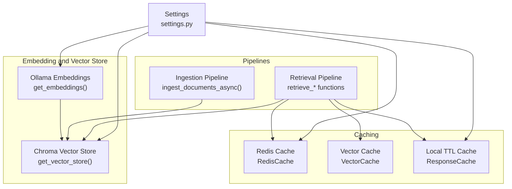
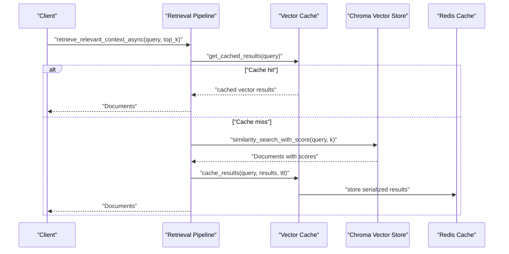
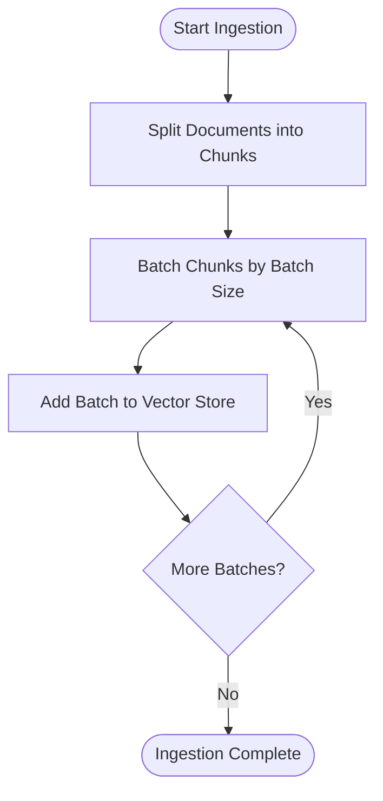
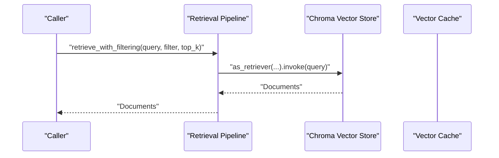
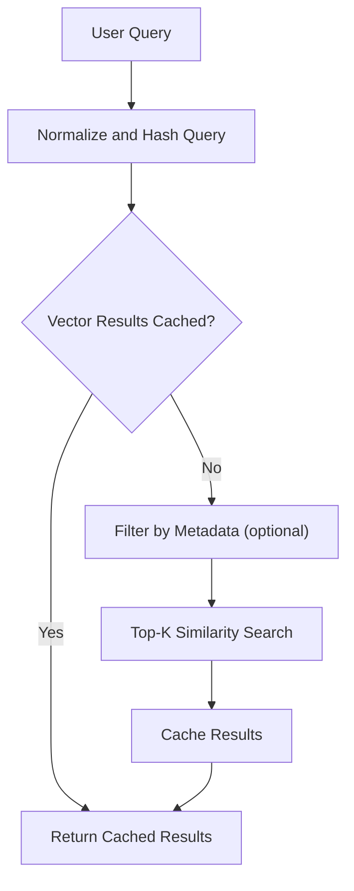
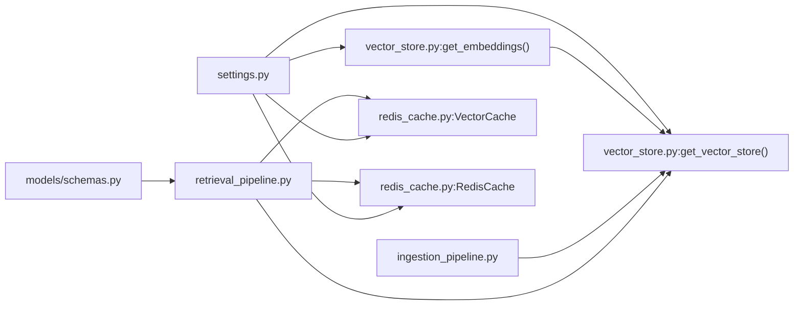

# Vector Store Schema

<cite>
**Referenced Files in This Document**
- [vector_store.py](file://veritas-ai/memory/vector_store.py)
- [ingestion_pipeline.py](file://veritas-ai/pipelines/ingestion_pipeline.py)
- [retrieval_pipeline.py](file://veritas-ai/pipelines/retrieval_pipeline.py)
- [redis_cache.py](file://veritas-ai/core/redis_cache.py)
- [settings.py](file://veritas-ai/config/settings.py)
- [schemas.py](file://veritas-ai/models/schemas.py)
- [llm.py](file://veritas-ai/models/llm.py)
- [README.md](file://veritas-ai/README.md)
</cite>

## Table of Contents
1. [Introduction](#introduction)
2. [Project Structure](#project-structure)
3. [Core Components](#core-components)
4. [Architecture Overview](#architecture-overview)
5. [Detailed Component Analysis](#detailed-component-analysis)
6. [Dependency Analysis](#dependency-analysis)
7. [Performance Considerations](#performance-considerations)
8. [Troubleshooting Guide](#troubleshooting-guide)
9. [Conclusion](#conclusion)

## Introduction
This document describes the vector store schema used for embedding-based similarity search and semantic indexing in the system. It covers embedding generation, vector dimensionality, similarity metrics, indexing strategies, metadata storage, query processing workflows, batch processing, and caching strategies. It also outlines update mechanisms and performance optimizations grounded in the repository’s implementation.

## Project Structure
The vector store schema is implemented using LangChain’s Ollama embeddings and Chroma as the vector database. Retrieval and caching are integrated with Redis for vector result caching and with local TTL caches for response caching. Configuration is centralized in settings, and schemas define the metadata and response structures.

**Diagram sources**
- [vector_store.py:8-26](file://veritas-ai/memory/vector_store.py#L8-L26)
- [ingestion_pipeline.py:7-33](file://veritas-ai/pipelines/ingestion_pipeline.py#L7-L33)
- [retrieval_pipeline.py:29-72](file://veritas-ai/pipelines/retrieval_pipeline.py#L29-L72)
- [redis_cache.py:18-222](file://veritas-ai/core/redis_cache.py#L18-L222)
- [settings.py:13-82](file://veritas-ai/config/settings.py#L13-L82)

**Section sources**
- [vector_store.py:1-27](file://veritas-ai/memory/vector_store.py#L1-L27)
- [ingestion_pipeline.py:1-38](file://veritas-ai/pipelines/ingestion_pipeline.py#L1-L38)
- [retrieval_pipeline.py:1-112](file://veritas-ai/pipelines/retrieval_pipeline.py#L1-L112)
- [redis_cache.py:1-232](file://veritas-ai/core/redis_cache.py#L1-L232)
- [settings.py:1-83](file://veritas-ai/config/settings.py#L1-L83)

## Core Components
- Embedding generation: Ollama-backed embeddings configured via settings.
- Vector store: Chroma collection with a persistent directory and a named collection.
- Ingestion: Async batching of document chunks with configurable chunk size and overlap.
- Retrieval: Similarity search with optional filters and top-k selection.
- Caching: Redis-backed vector result cache and local TTL cache for responses.

Key configuration and defaults:
- Embedding model and base URL are set via environment variables.
- Chroma persistence directory and collection name are defined in settings.
- Retrieval top-k defaults to a configurable value.

**Section sources**
- [vector_store.py:8-26](file://veritas-ai/memory/vector_store.py#L8-L26)
- [settings.py:50-54](file://veritas-ai/config/settings.py#L50-L54)
- [ingestion_pipeline.py:7-33](file://veritas-ai/pipelines/ingestion_pipeline.py#L7-L33)
- [retrieval_pipeline.py:29-92](file://veritas-ai/pipelines/retrieval_pipeline.py#L29-L92)
- [redis_cache.py:166-222](file://veritas-ai/core/redis_cache.py#L166-L222)

## Architecture Overview
The vector store schema integrates embedding generation, ingestion, and retrieval with caching layers. The ingestion pipeline splits raw documents into chunks and adds them to the vector store asynchronously. Retrieval queries leverage Chroma’s similarity search, optionally filtered by metadata, and are cached in Redis for vector results. Response-level caching is handled by a separate local TTL cache.

**Diagram sources**
- [retrieval_pipeline.py:48-72](file://veritas-ai/pipelines/retrieval_pipeline.py#L48-L72)
- [redis_cache.py:195-218](file://veritas-ai/core/redis_cache.py#L195-L218)

**Section sources**
- [retrieval_pipeline.py:29-92](file://veritas-ai/pipelines/retrieval_pipeline.py#L29-L92)
- [redis_cache.py:166-222](file://veritas-ai/core/redis_cache.py#L166-L222)

## Detailed Component Analysis

### Embedding Generation and Dimensionality
- Embedding function: Ollama embeddings instantiated with a model name and base URL from settings.
- Vector dimensionality: Determined by the selected embedding model; the code does not explicitly expose or configure dimensionality here.

Implementation highlights:
- Embedding creation uses settings for model and base URL.
- Vector store initialization passes the embedding function to Chroma.

**Section sources**
- [vector_store.py:8-13](file://veritas-ai/memory/vector_store.py#L8-L13)
- [vector_store.py:20-26](file://veritas-ai/memory/vector_store.py#L20-L26)
- [settings.py:42-53](file://veritas-ai/config/settings.py#L42-L53)

### Vector Store Initialization and Persistence
- Persistent directory: Created if missing.
- Collection name: Fixed identifier for the knowledge base.
- Embedding function: Provided during initialization.

Operational notes:
- The vector store is initialized once per process and reused via cached accessors.

**Section sources**
- [vector_store.py:15-26](file://veritas-ai/memory/vector_store.py#L15-L26)

### Ingestion Pipeline: Chunking, Batching, and Addition
- Text splitting: Uses recursive character splitting with configurable chunk size and overlap.
- Async batching: Adds chunks in batches to the vector store using a thread pool to avoid blocking the event loop.
- Batch size: Configurable parameter controlling chunk grouping.

**Diagram sources**
- [ingestion_pipeline.py:16-31](file://veritas-ai/pipelines/ingestion_pipeline.py#L16-L31)

**Section sources**
- [ingestion_pipeline.py:7-33](file://veritas-ai/pipelines/ingestion_pipeline.py#L7-L33)

### Retrieval Pipelines: Similarity Search and Filtering
- Top-k retrieval: Uses Chroma’s retriever with configurable k.
- Scored retrieval: Returns documents paired with similarity scores.
- Metadata filtering: Optional filter passed to the retriever.
- Async execution: Uses a thread pool executor to keep the event loop responsive.
- Vector result caching: Optional Redis-backed caching of retrieved results.

**Diagram sources**
- [retrieval_pipeline.py:75-92](file://veritas-ai/pipelines/retrieval_pipeline.py#L75-L92)

**Section sources**
- [retrieval_pipeline.py:29-92](file://veritas-ai/pipelines/retrieval_pipeline.py#L29-L92)

### Metadata Storage and Enrichment
- Document metadata: Stored alongside vector embeddings in Chroma; retrieval returns page content and metadata.
- Response metadata: The response schema includes fields such as timestamp, confidence score, and status, enabling downstream enrichment and provenance tracking.

Practical implications:
- Metadata can include source references, timestamps, and confidence scores for provenance and trust scoring.

**Section sources**
- [retrieval_pipeline.py:34-45](file://veritas-ai/pipelines/retrieval_pipeline.py#L34-L45)
- [schemas.py:14-26](file://veritas-ai/models/schemas.py#L14-L26)

### Similarity Metrics and Indexing Strategies
- Similarity metric: The code uses Chroma’s built-in similarity search; the underlying metric depends on the embedding model and Chroma’s default configuration.
- Indexing strategy: Chroma manages indexing internally; the code does not explicitly configure HNSW or FAISS parameters.

Recommendation:
- To explicitly control indexing (e.g., HNSW or FAISS), configure the embedding model and Chroma index parameters via environment variables or model-specific settings.

**Section sources**
- [retrieval_pipeline.py:34-45](file://veritas-ai/pipelines/retrieval_pipeline.py#L34-L45)
- [vector_store.py:22-26](file://veritas-ai/memory/vector_store.py#L22-L26)

### Query Processing Workflows
- Semantic similarity search: Retrieves top-k documents by embedding similarity.
- Hybrid retrieval: The retriever supports passing filters; while keyword-and-vector fusion is not explicitly implemented in the code, metadata filtering enables a form of hybrid-like retrieval by constraining the candidate set.

**Diagram sources**
- [retrieval_pipeline.py:48-72](file://veritas-ai/pipelines/retrieval_pipeline.py#L48-L72)
- [redis_cache.py:195-218](file://veritas-ai/core/redis_cache.py#L195-L218)

**Section sources**
- [retrieval_pipeline.py:29-92](file://veritas-ai/pipelines/retrieval_pipeline.py#L29-L92)

### Batch Retrieval and Real-time Updates
- Batch retrieval: Executes multiple retrieval tasks concurrently and aggregates results.
- Real-time updates: Ingestion pipeline supports adding new chunks asynchronously; vector updates occur when new documents are ingested.

**Section sources**
- [retrieval_pipeline.py:100-112](file://veritas-ai/pipelines/retrieval_pipeline.py#L100-L112)
- [ingestion_pipeline.py:7-33](file://veritas-ai/pipelines/ingestion_pipeline.py#L7-L33)

### Dimension Reduction Techniques
- No explicit dimension reduction: The code does not implement PCA, autoencoders, or other dimensionality reduction steps.
- Implication: Performance depends on the native embedding dimensionality of the chosen model.

**Section sources**
- [vector_store.py:8-13](file://veritas-ai/memory/vector_store.py#L8-L13)

## Dependency Analysis
The vector store schema relies on:
- LangChain embeddings and Chroma for vector operations.
- Redis for caching vector results and responses.
- Settings for configuration of models, persistence, and retrieval parameters.
- Schemas for typed metadata and response structures.

**Diagram sources**
- [settings.py:13-82](file://veritas-ai/config/settings.py#L13-L82)
- [vector_store.py:8-26](file://veritas-ai/memory/vector_store.py#L8-L26)
- [ingestion_pipeline.py:7-33](file://veritas-ai/pipelines/ingestion_pipeline.py#L7-L33)
- [retrieval_pipeline.py:29-92](file://veritas-ai/pipelines/retrieval_pipeline.py#L29-L92)
- [redis_cache.py:166-222](file://veritas-ai/core/redis_cache.py#L166-L222)
- [schemas.py:14-26](file://veritas-ai/models/schemas.py#L14-L26)

**Section sources**
- [settings.py:13-82](file://veritas-ai/config/settings.py#L13-L82)
- [vector_store.py:8-26](file://veritas-ai/memory/vector_store.py#L8-L26)
- [ingestion_pipeline.py:7-33](file://veritas-ai/pipelines/ingestion_pipeline.py#L7-L33)
- [retrieval_pipeline.py:29-92](file://veritas-ai/pipelines/retrieval_pipeline.py#L29-L92)
- [redis_cache.py:166-222](file://veritas-ai/core/redis_cache.py#L166-L222)
- [schemas.py:14-26](file://veritas-ai/models/schemas.py#L14-L26)

## Performance Considerations
- Approximate nearest neighbors: Not explicitly configured; default Chroma behavior applies.
- Caching:
  - Vector result cache: Redis-backed with a hashed key derived from the query.
  - Response cache: Local TTL cache for query responses.
- Concurrency: Async ingestion and retrieval reduce blocking and improve throughput.
- Chunking and batching: Reduces memory pressure and improves embedding throughput.
- LLM caching: Separate LLM cache configured for inference reuse.

Recommendations grounded in code:
- Tune chunk size and overlap for optimal recall/precision trade-offs.
- Monitor Redis connectivity and fallback behavior for caching resilience.
- Consider enabling approximate search parameters if performance demands exceed exact search limits.

**Section sources**
- [ingestion_pipeline.py:7-33](file://veritas-ai/pipelines/ingestion_pipeline.py#L7-L33)
- [retrieval_pipeline.py:48-72](file://veritas-ai/pipelines/retrieval_pipeline.py#L48-L72)
- [redis_cache.py:18-222](file://veritas-ai/core/redis_cache.py#L18-L222)
- [llm.py:48-60](file://veritas-ai/models/llm.py#L48-L60)

## Troubleshooting Guide
Common issues and mitigations:
- Redis unavailable:
  - The Redis cache falls back gracefully; vector cache operations are skipped when Redis is unreachable.
- Vector retrieval slow:
  - Verify embedding model and base URL settings.
  - Confirm chunk size and overlap settings for balanced recall and speed.
- Cache misses frequently:
  - Ensure consistent query normalization and hashing.
  - Confirm TTL settings and cache key prefixes.

Operational checks:
- Redis connectivity and ping success are logged during cache initialization.
- Vector cache stores serialized results; ensure JSON serialization compatibility.

**Section sources**
- [redis_cache.py:30-51](file://veritas-ai/core/redis_cache.py#L30-L51)
- [redis_cache.py:195-218](file://veritas-ai/core/redis_cache.py#L195-L218)
- [settings.py:25-27](file://veritas-ai/config/settings.py#L25-L27)

## Conclusion
The vector store schema leverages Ollama embeddings and Chroma for semantic indexing, with robust ingestion and retrieval pipelines. Redis-backed caching accelerates repeated queries, while settings enable configuration of embedding models, persistence, and retrieval parameters. While explicit dimensionality reduction and approximate nearest neighbor tuning are not present in the code, the architecture supports performance improvements through chunking, batching, and caching strategies. For advanced needs such as HNSW or FAISS configuration, integrate model-specific settings or index parameters via the embedding and vector store initialization paths.