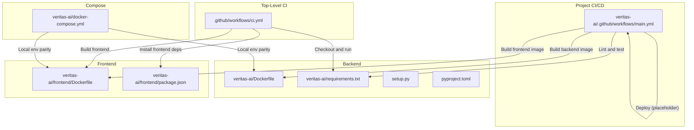
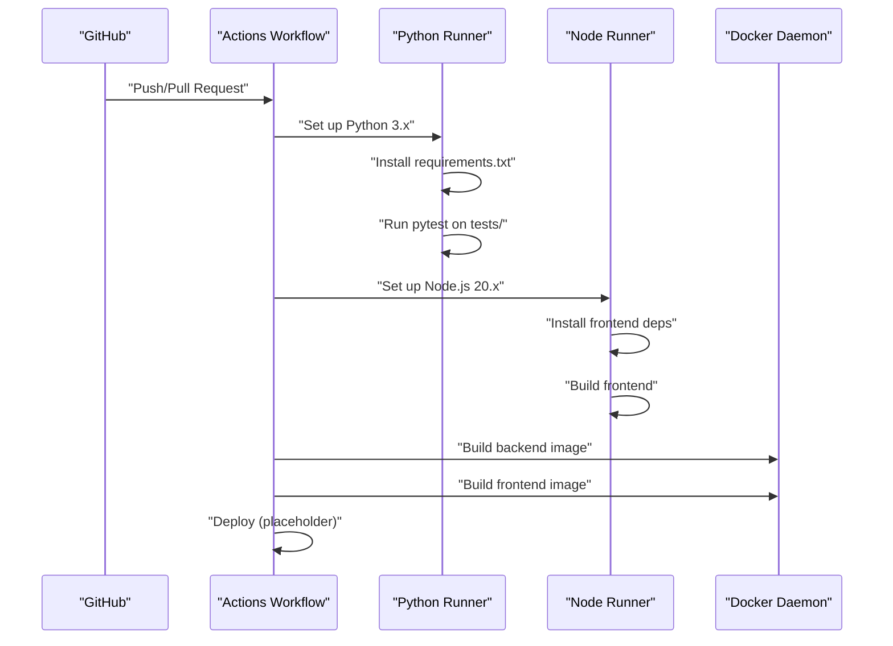
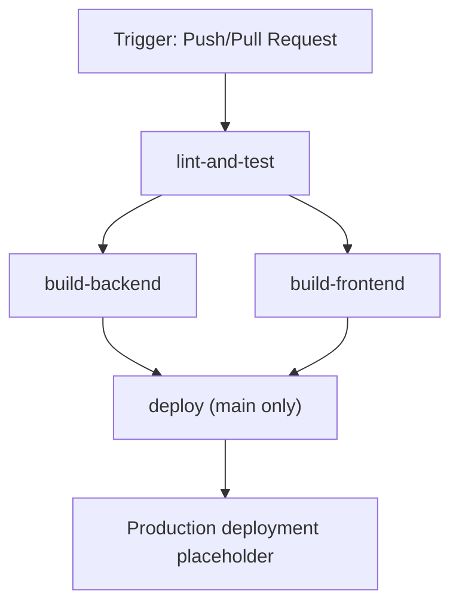
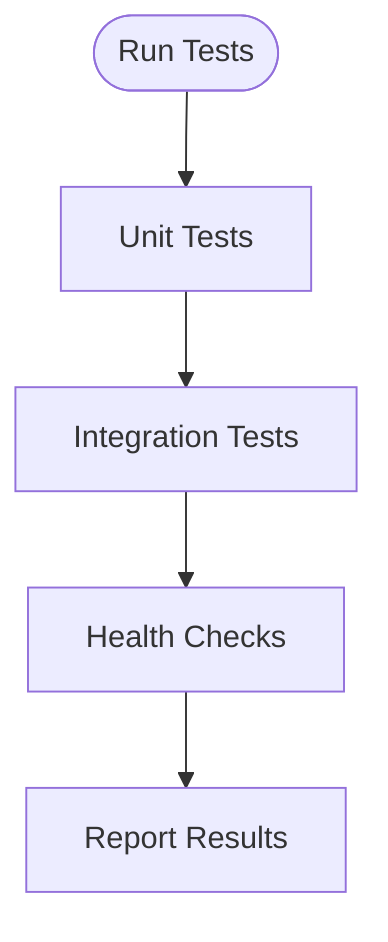
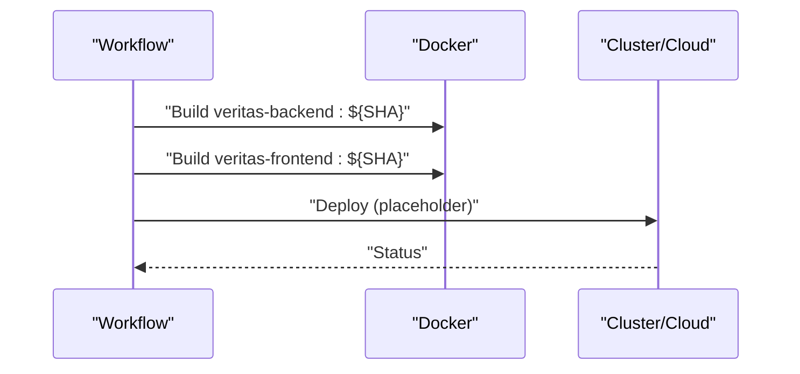
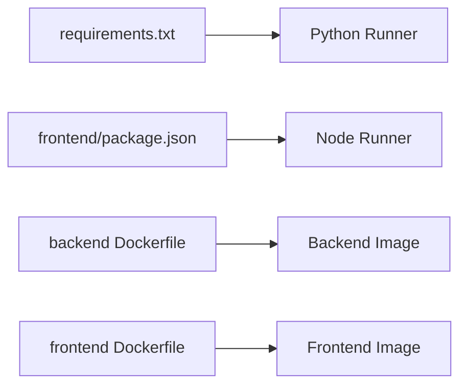

# CI/CD Pipeline & Automation

<cite>
**Referenced Files in This Document**
- [.github/workflows/ci.yml](file://.github/workflows/ci.yml)
- [veritas-ai/.github/workflows/main.yml](file://veritas-ai/.github/workflows/main.yml)
- [veritas-ai/requirements.txt](file://veritas-ai/requirements.txt)
- [setup.py](file://setup.py)
- [pyproject.toml](file://pyproject.toml)
- [veritas-ai/Dockerfile](file://veritas-ai/Dockerfile)
- [veritas-ai/docker-compose.yml](file://veritas-ai/docker-compose.yml)
- [veritas-ai/frontend/Dockerfile](file://veritas-ai/frontend/Dockerfile)
- [veritas-ai/frontend/package.json](file://veritas-ai/frontend/package.json)
- [veritas-ai/tests/test_consensus.py](file://veritas-ai/tests/test_consensus.py)
- [veritas-ai/tests/test_explainability.py](file://veritas-ai/tests/test_explainability.py)
- [veritas-ai/tests/test_firewall.py](file://veritas-ai/tests/test_firewall.py)
- [veritas-ai/tests/test_docker_health.py](file://veritas-ai/tests/test_docker_health.py)
- [veritas-ai/tests/test_multi_agent_pipeline_phase1.py](file://veritas-ai/tests/test_multi_agent_pipeline_phase1.py)
</cite>

## Table of Contents
1. [Introduction](#introduction)
2. [Project Structure](#project-structure)
3. [Core Components](#core-components)
4. [Architecture Overview](#architecture-overview)
5. [Detailed Component Analysis](#detailed-component-analysis)
6. [Dependency Analysis](#dependency-analysis)
7. [Performance Considerations](#performance-considerations)
8. [Troubleshooting Guide](#troubleshooting-guide)
9. [Conclusion](#conclusion)
10. [Appendices](#appendices)

## Introduction
This document describes the CI/CD pipeline and automation for Veritas AI with a focus on automated testing and deployment workflows. It documents the GitHub Actions configurations, build triggers, testing matrices, and deployment automation. It also covers continuous integration processes (code quality checks, unit tests, integration tests, and health checks), deployment stages, rollback procedures, versioning/tagging strategies, environment configuration management, and security scanning integration points.

## Project Structure
The repository contains two primary CI/CD workflow files:
- A top-level CI workflow for general checks and frontend build.
- A project-scoped CI/CD workflow under the main application directory that includes linting, testing, backend/ frontend Docker builds, and a placeholder for production deployment.

Key supporting files include:
- Backend requirements and packaging metadata.
- Dockerfiles for backend and frontend.
- Docker Compose for local orchestration and environment parity.
- Frontend package configuration for build and runtime.

**Diagram sources**
- [.github/workflows/ci.yml:1-6](file://.github/workflows/ci.yml#L1-L6)
- [veritas-ai/.github/workflows/main.yml:1-59](file://veritas-ai/.github/workflows/main.yml#L1-L59)
- [veritas-ai/requirements.txt:1-42](file://veritas-ai/requirements.txt#L1-L42)
- [veritas-ai/Dockerfile:1-81](file://veritas-ai/Dockerfile#L1-L81)
- [veritas-ai/frontend/Dockerfile:1-54](file://veritas-ai/frontend/Dockerfile#L1-L54)
- [veritas-ai/docker-compose.yml:1-160](file://veritas-ai/docker-compose.yml#L1-L160)

**Section sources**
- [.github/workflows/ci.yml:1-6](file://.github/workflows/ci.yml#L1-L6)
- [veritas-ai/.github/workflows/main.yml:1-59](file://veritas-ai/.github/workflows/main.yml#L1-L59)
- [veritas-ai/requirements.txt:1-42](file://veritas-ai/requirements.txt#L1-L42)
- [veritas-ai/Dockerfile:1-81](file://veritas-ai/Dockerfile#L1-L81)
- [veritas-ai/frontend/Dockerfile:1-54](file://veritas-ai/frontend/Dockerfile#L1-L54)
- [veritas-ai/docker-compose.yml:1-160](file://veritas-ai/docker-compose.yml#L1-L160)

## Core Components
- GitHub Actions Workflows
  - Top-level CI workflow: Checks out code, sets up Python and Node.js, installs dependencies, runs backend tests, installs frontend dependencies, builds frontend, and includes a note about manual Docker build.
  - Project CI/CD workflow: Lints Python code, runs tests, builds backend and frontend Docker images, and includes a placeholder for production deployment.
- Packaging and Requirements
  - Backend requirements pinned for reproducible builds.
  - Packaging metadata defines project name, version, and included packages.
- Containerization
  - Backend Dockerfile defines a multi-stage build, non-root user, healthchecks, and runtime configuration.
  - Frontend Dockerfile defines a multi-stage build, build args for API URLs, and healthchecks.
- Orchestration
  - docker-compose defines services for backend, frontend, Neo4j, ChromaDB, Redis, and Ollama with healthchecks and environment variables.

**Section sources**
- [.github/workflows/ci.yml:1-6](file://.github/workflows/ci.yml#L1-L6)
- [veritas-ai/.github/workflows/main.yml:1-59](file://veritas-ai/.github/workflows/main.yml#L1-L59)
- [veritas-ai/requirements.txt:1-42](file://veritas-ai/requirements.txt#L1-L42)
- [setup.py:1-9](file://setup.py#L1-L9)
- [pyproject.toml:1-23](file://pyproject.toml#L1-L23)
- [veritas-ai/Dockerfile:1-81](file://veritas-ai/Dockerfile#L1-L81)
- [veritas-ai/frontend/Dockerfile:1-54](file://veritas-ai/frontend/Dockerfile#L1-L54)
- [veritas-ai/docker-compose.yml:1-160](file://veritas-ai/docker-compose.yml#L1-L160)

## Architecture Overview
The CI/CD architecture comprises:
- Triggering events: push to main/develop and pull_request to main.
- Jobs:
  - Lint and test job for backend.
  - Backend build job.
  - Frontend build job.
  - Deployment job conditioned on branch.
- Artifacts: Docker images tagged with the commit SHA.
- Post-deploy: Placeholder for production rollout via kubectl or cloud CLI.

**Diagram sources**
- [veritas-ai/.github/workflows/main.yml:1-59](file://veritas-ai/.github/workflows/main.yml#L1-L59)
- [veritas-ai/requirements.txt:1-42](file://veritas-ai/requirements.txt#L1-L42)
- [veritas-ai/frontend/package.json:1-27](file://veritas-ai/frontend/package.json#L1-L27)

## Detailed Component Analysis

### GitHub Actions CI Workflow (.github/workflows/ci.yml)
- Triggers: push to main/develop; pull_request to main.
- Steps:
  - Checkout code.
  - Set up Python 3.11 with pip caching.
  - Install backend dependencies from requirements.txt.
  - Run backend tests with pytest.
  - Set up Node.js 20 with npm caching.
  - Install frontend dependencies under veritas-ai/frontend.
  - Build frontend under veritas-ai/frontend.
  - Note: Docker build is marked optional and requires manual execution.

**Section sources**
- [.github/workflows/ci.yml:1-6](file://.github/workflows/ci.yml#L1-L6)

### GitHub Actions CI/CD Workflow (veritas-ai/.github/workflows/main.yml)
- Triggers: push to main; pull_request to main.
- Jobs:
  - lint-and-test:
    - Set up Python 3.9.
    - Upgrade pip, install requirements.txt, install flake8 and pytest.
    - Lint Python modules with flake8.
    - Run pytest on tests/ with short traceback.
  - build-backend:
    - Depends on lint-and-test.
    - Build backend image tagged with commit SHA.
  - build-frontend:
    - Depends on lint-and-test.
    - Build frontend image tagged with commit SHA.
  - deploy:
    - Depends on both build jobs.
    - Conditional on main branch.
    - Placeholder for production deployment.

**Diagram sources**
- [veritas-ai/.github/workflows/main.yml:1-59](file://veritas-ai/.github/workflows/main.yml#L1-L59)

**Section sources**
- [veritas-ai/.github/workflows/main.yml:1-59](file://veritas-ai/.github/workflows/main.yml#L1-L59)

### Automated Testing Strategy
- Unit tests:
  - Located under veritas-ai/tests/.
  - Examples include consensus evaluation, explainability logic generation, firewall status determination, and multi-agent pipeline concurrency.
- Integration tests:
  - Health checks for FastAPI and WebSocket connectivity against localhost endpoints.
- Test execution:
  - pytest invoked from workflow steps.
  - Async tests supported via pytest-asyncio.
- Coverage and performance:
  - No explicit coverage thresholds or performance benchmarks configured in current workflows.
- Regression testing:
  - Existing tests act as regression guards; new tests should be added for feature changes.

**Diagram sources**
- [veritas-ai/tests/test_consensus.py:1-21](file://veritas-ai/tests/test_consensus.py#L1-L21)
- [veritas-ai/tests/test_explainability.py:1-32](file://veritas-ai/tests/test_explainability.py#L1-L32)
- [veritas-ai/tests/test_firewall.py:1-43](file://veritas-ai/tests/test_firewall.py#L1-L43)
- [veritas-ai/tests/test_docker_health.py:1-27](file://veritas-ai/tests/test_docker_health.py#L1-L27)
- [veritas-ai/tests/test_multi_agent_pipeline_phase1.py:1-46](file://veritas-ai/tests/test_multi_agent_pipeline_phase1.py#L1-L46)

**Section sources**
- [veritas-ai/tests/test_consensus.py:1-21](file://veritas-ai/tests/test_consensus.py#L1-L21)
- [veritas-ai/tests/test_explainability.py:1-32](file://veritas-ai/tests/test_explainability.py#L1-L32)
- [veritas-ai/tests/test_firewall.py:1-43](file://veritas-ai/tests/test_firewall.py#L1-L43)
- [veritas-ai/tests/test_docker_health.py:1-27](file://veritas-ai/tests/test_docker_health.py#L1-L27)
- [veritas-ai/tests/test_multi_agent_pipeline_phase1.py:1-46](file://veritas-ai/tests/test_multi_agent_pipeline_phase1.py#L1-L46)

### Continuous Integration Process
- Code quality:
  - flake8 linting applied to backend modules with max line length and ignored warnings.
- Unit tests:
  - pytest executed on tests/ with verbose output and short tracebacks.
- Integration tests:
  - Health endpoints verified via HTTP and WebSocket checks.
- Security scanning:
  - Not integrated in current workflows; recommended to add SAST and SCA scans in future iterations.

**Section sources**
- [veritas-ai/.github/workflows/main.yml:26-30](file://veritas-ai/.github/workflows/main.yml#L26-L30)

### Deployment Pipeline Stages
- Backend image build:
  - Tagged with commit SHA for traceability.
- Frontend image build:
  - Tagged with commit SHA for traceability.
- Production deployment:
  - Placeholder step indicates where kubectl or cloud CLI commands would be inserted.
- Staging validation:
  - Not configured in current workflows; recommend adding a staging environment using docker-compose or cluster manifests.

**Diagram sources**
- [veritas-ai/.github/workflows/main.yml:38-58](file://veritas-ai/.github/workflows/main.yml#L38-L58)
- [veritas-ai/Dockerfile](file://veritas-ai/Dockerfile#L39)
- [veritas-ai/frontend/Dockerfile:48-53](file://veritas-ai/frontend/Dockerfile#L48-L53)

**Section sources**
- [veritas-ai/.github/workflows/main.yml:32-59](file://veritas-ai/.github/workflows/main.yml#L32-L59)
- [veritas-ai/Dockerfile:38-81](file://veritas-ai/Dockerfile#L38-L81)
- [veritas-ai/frontend/Dockerfile:27-54](file://veritas-ai/frontend/Dockerfile#L27-L54)

### Rollback Procedures
- Current workflows do not define rollback steps.
- Recommended approach:
  - Maintain immutable image tags per release.
  - Store previous working versions and redeploy on failure.
  - Use canary deployments or blue/green strategies in production.

[No sources needed since this section provides general guidance]

### Version Tagging Strategies
- Current tagging:
  - Images are tagged with the commit SHA.
- Recommended improvements:
  - Adopt semantic versioning tags (e.g., v0.1.0) for releases.
  - Create annotated tags on main branch merges and push to remote.

**Section sources**
- [veritas-ai/.github/workflows/main.yml:38-48](file://veritas-ai/.github/workflows/main.yml#L38-L48)
- [setup.py:1-9](file://setup.py#L1-L9)
- [pyproject.toml:1-23](file://pyproject.toml#L1-L23)

### Environment-Specific Configuration Management
- docker-compose defines environment variables for backend services (Neo4j, Redis, ChromaDB, Ollama).
- Frontend Dockerfile accepts build args for API base URLs.
- Recommendations:
  - Externalize secrets and environment variables using secure secret managers.
  - Separate compose files for dev/stage/prod with overrides.

**Section sources**
- [veritas-ai/docker-compose.yml:13-28](file://veritas-ai/docker-compose.yml#L13-L28)
- [veritas-ai/docker-compose.yml:56-58](file://veritas-ai/docker-compose.yml#L56-L58)
- [veritas-ai/frontend/Dockerfile:19-23](file://veritas-ai/frontend/Dockerfile#L19-L23)

### Security Scanning Integration
- Current workflows do not include SAST/SCA scans.
- Recommended integrations:
  - Dependabot for dependency updates.
  - SAST tools (e.g., code scanning) and SCA tools (e.g., OSV, Snyk) in workflows.
  - Image scanning for Docker layers.

[No sources needed since this section provides general guidance]

## Dependency Analysis
- Backend dependencies are declared in requirements.txt and used by both workflows.
- Frontend dependencies are managed via package.json and built under the frontend directory.
- Packaging metadata in setup.py and pyproject.toml define project identity and included packages.

**Diagram sources**
- [veritas-ai/requirements.txt:1-42](file://veritas-ai/requirements.txt#L1-L42)
- [veritas-ai/frontend/package.json:1-27](file://veritas-ai/frontend/package.json#L1-L27)
- [veritas-ai/Dockerfile:1-81](file://veritas-ai/Dockerfile#L1-L81)
- [veritas-ai/frontend/Dockerfile:1-54](file://veritas-ai/frontend/Dockerfile#L1-L54)

**Section sources**
- [veritas-ai/requirements.txt:1-42](file://veritas-ai/requirements.txt#L1-L42)
- [veritas-ai/frontend/package.json:1-27](file://veritas-ai/frontend/package.json#L1-L27)
- [setup.py:1-9](file://setup.py#L1-L9)
- [pyproject.toml:1-23](file://pyproject.toml#L1-L23)

## Performance Considerations
- Current workflows do not enforce coverage thresholds or performance benchmarks.
- Recommendations:
  - Add coverage reporting and minimum thresholds.
  - Introduce performance tests for latency-sensitive components.
  - Parallelize jobs where possible (lint/test/build).

[No sources needed since this section provides general guidance]

## Troubleshooting Guide
- Python environment issues:
  - Ensure Python version matches workflow setup and requirements.txt compatibility.
- Node.js build failures:
  - Verify frontend dependencies installation and build arguments.
- Docker build failures:
  - Confirm Docker daemon availability and permissions.
  - Validate backend/frontend Dockerfiles and build contexts.
- Health check failures:
  - Review compose healthchecks and service readiness conditions.

**Section sources**
- [veritas-ai/.github/workflows/main.yml:15-48](file://veritas-ai/.github/workflows/main.yml#L15-L48)
- [veritas-ai/Dockerfile:76-81](file://veritas-ai/Dockerfile#L76-L81)
- [veritas-ai/frontend/Dockerfile:50-53](file://veritas-ai/frontend/Dockerfile#L50-L53)
- [veritas-ai/docker-compose.yml:42-47](file://veritas-ai/docker-compose.yml#L42-L47)
- [veritas-ai/docker-compose.yml:87-92](file://veritas-ai/docker-compose.yml#L87-L92)
- [veritas-ai/docker-compose.yml:119-123](file://veritas-ai/docker-compose.yml#L119-L123)
- [veritas-ai/docker-compose.yml:137-141](file://veritas-ai/docker-compose.yml#L137-L141)

## Conclusion
The repository includes two CI/CD workflows: a top-level CI for quick checks and a project CI/CD with linting, testing, and Docker builds. While the workflows are functional, they lack automated security scanning, staging validation, and explicit coverage/performance requirements. Enhancing these areas will improve reliability, security, and operability for production deployments.

## Appendices
- Compliance and standards:
  - Align with organizational security policies for secrets management and vulnerability scanning.
  - Document and enforce release criteria including test coverage and performance targets.

[No sources needed since this section provides general guidance]