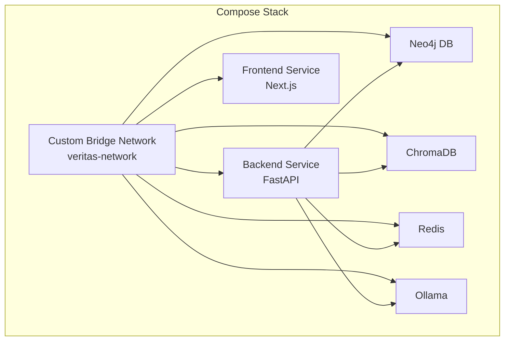
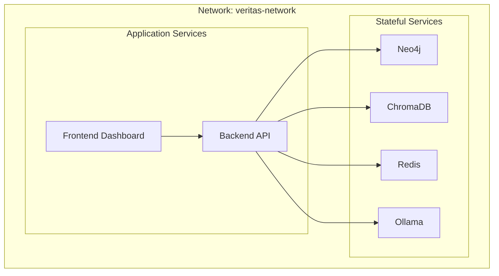
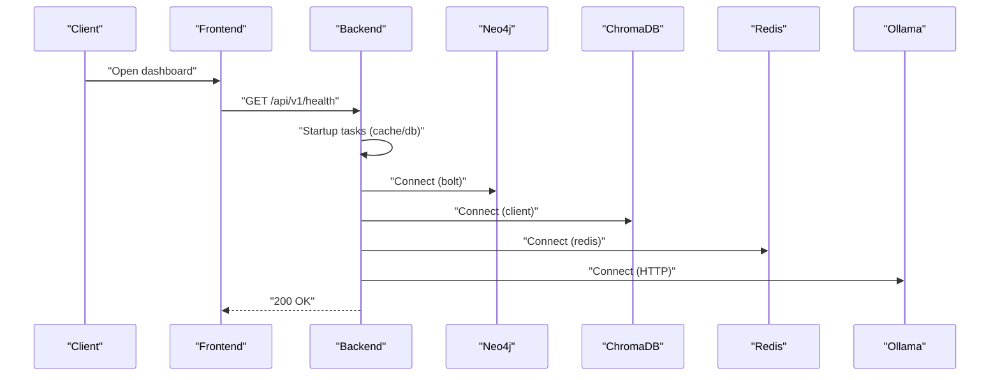
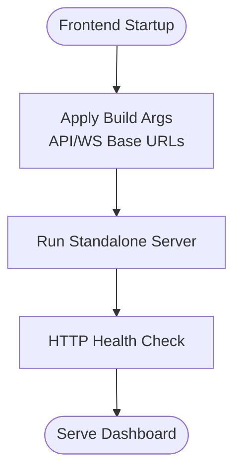
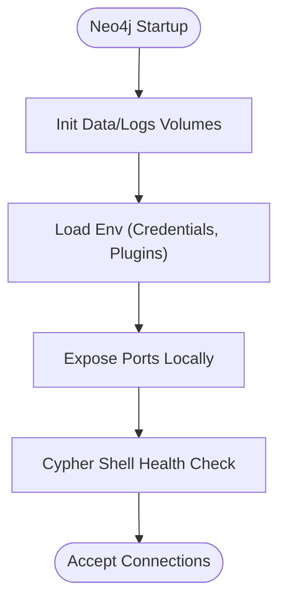
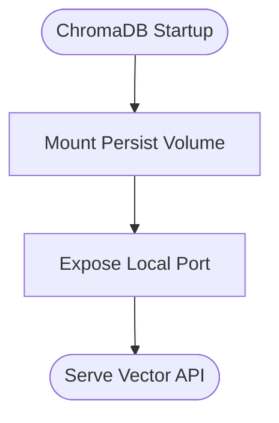
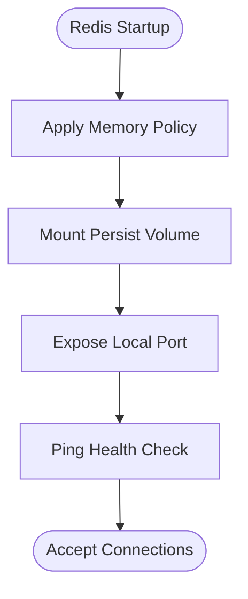
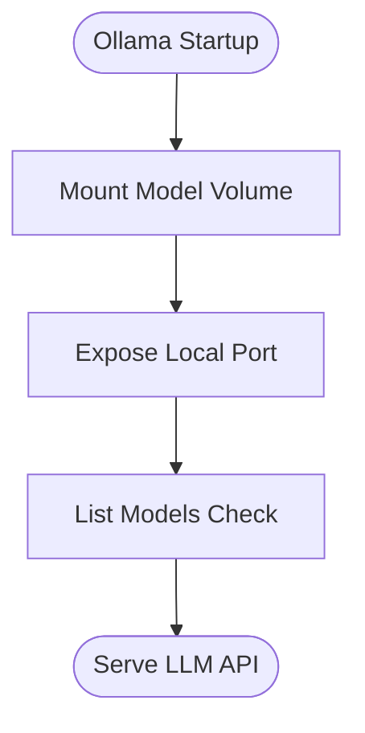
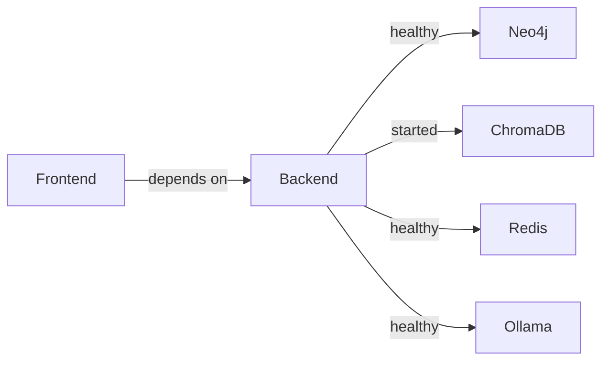

# Containerization & Orchestration

<cite>
**Referenced Files in This Document**
- [docker-compose.yml](file://veritas-ai/docker-compose.yml)
- [Dockerfile](file://veritas-ai/Dockerfile)
- [frontend/Dockerfile](file://veritas-ai/frontend/Dockerfile)
- [run_project.sh](file://run_project.sh)
- [settings.py](file://veritas-ai/config/settings.py)
- [main.py](file://veritas-ai/app/main.py)
- [server.py](file://veritas-ai/api/server.py)
- [requirements.txt](file://veritas-ai/requirements.txt)
- [test_docker_health.py](file://veritas-ai/tests/test_docker_health.py)
</cite>

## Table of Contents
1. [Introduction](#introduction)
2. [Project Structure](#project-structure)
3. [Core Components](#core-components)
4. [Architecture Overview](#architecture-overview)
5. [Detailed Component Analysis](#detailed-component-analysis)
6. [Dependency Analysis](#dependency-analysis)
7. [Performance Considerations](#performance-considerations)
8. [Troubleshooting Guide](#troubleshooting-guide)
9. [Conclusion](#conclusion)
10. [Appendices](#appendices)

## Introduction
This document provides comprehensive containerization and orchestration guidance for Veritas AI with a focus on Docker-based deployment. It explains the multi-service Docker Compose setup, inter-service networking, persistent volume management, health checks, environment configuration, security posture, and production optimization strategies. The stack includes:
- Backend API service (FastAPI)
- Frontend dashboard (Next.js)
- Neo4j knowledge graph database
- ChromaDB vector store
- Redis cache
- Ollama LLM service

## Project Structure
The deployment is orchestrated via a single Docker Compose file that defines services, networks, and volumes. Supporting Dockerfiles define build-time and runtime configurations for backend and frontend. A convenience script automates local startup.

**Diagram sources**
- [docker-compose.yml:143-160](file://veritas-ai/docker-compose.yml#L143-L160)

**Section sources**
- [docker-compose.yml:1-160](file://veritas-ai/docker-compose.yml#L1-L160)
- [run_project.sh:1-41](file://run_project.sh#L1-L41)

## Core Components
- Backend API service
  - Built from the backend Dockerfile, exposes port 8000, runs with uvicorn workers, and integrates with Neo4j, Redis, ChromaDB, and Ollama.
  - Environment variables include database URIs, model names, timeouts, and public API/WS URLs.
  - Health check probes the internal health endpoint.
- Frontend dashboard
  - Built from the frontend Dockerfile, exposes port 3000, and is configured via build args for API/WS base URLs.
  - Health check pings the root path.
- Neo4j database
  - Uses the official Neo4j image with bolt and browser ports exposed locally, APOC plugin enabled, and persistent volumes for data and logs.
- ChromaDB vector store
  - Uses the official Chroma image, exposes a local port, and persists data under a dedicated volume.
- Redis cache
  - Uses the official Redis image with append-only persistence, memory limits, and a small max memory policy suitable for development.
- Ollama LLM
  - Uses the official Ollama image, exposes a local port, and persists model data under a dedicated volume.
- Networking and volumes
  - All services join a custom bridge network named veritas-network.
  - Persistent volumes are declared for each stateful service.

**Section sources**
- [docker-compose.yml:5-47](file://veritas-ai/docker-compose.yml#L5-L47)
- [docker-compose.yml:52-67](file://veritas-ai/docker-compose.yml#L52-L67)
- [docker-compose.yml:72-92](file://veritas-ai/docker-compose.yml#L72-L92)
- [docker-compose.yml:97-106](file://veritas-ai/docker-compose.yml#L97-L106)
- [docker-compose.yml:108-123](file://veritas-ai/docker-compose.yml#L108-L123)
- [docker-compose.yml:125-141](file://veritas-ai/docker-compose.yml#L125-L141)
- [docker-compose.yml:143-160](file://veritas-ai/docker-compose.yml#L143-L160)

## Architecture Overview
The system uses a custom bridge network to isolate and connect all services. The backend orchestrates queries, interacts with the knowledge graph, vector store, cache, and LLM, and streams responses to the frontend via HTTP and WebSocket.

**Diagram sources**
- [docker-compose.yml:143-160](file://veritas-ai/docker-compose.yml#L143-L160)
- [docker-compose.yml:5-47](file://veritas-ai/docker-compose.yml#L5-L47)
- [docker-compose.yml:52-67](file://veritas-ai/docker-compose.yml#L52-L67)
- [docker-compose.yml:72-92](file://veritas-ai/docker-compose.yml#L72-L92)
- [docker-compose.yml:97-106](file://veritas-ai/docker-compose.yml#L97-L106)
- [docker-compose.yml:108-123](file://veritas-ai/docker-compose.yml#L108-L123)
- [docker-compose.yml:125-141](file://veritas-ai/docker-compose.yml#L125-L141)

## Detailed Component Analysis

### Backend Service
- Build and runtime
  - Multi-stage build with Python slim images, non-root user, and pre-installed Playwright binaries.
  - Exposes port 8000 and runs uvicorn with two workers and concurrency limits.
- Health checks
  - Internal health probe targets the backend’s health endpoint.
- Dependencies
  - Integrates with Neo4j, Redis, ChromaDB, and Ollama via environment variables.
- Startup behavior
  - FastAPI app initializes cache and databases early, then preloads models in the background.

**Diagram sources**
- [docker-compose.yml:42-47](file://veritas-ai/docker-compose.yml#L42-L47)
- [Dockerfile:76-81](file://veritas-ai/Dockerfile#L76-L81)
- [main.py:70-102](file://veritas-ai/app/main.py#L70-L102)
- [server.py:88-94](file://veritas-ai/api/server.py#L88-L94)

**Section sources**
- [Dockerfile:1-81](file://veritas-ai/Dockerfile#L1-L81)
- [docker-compose.yml:5-47](file://veritas-ai/docker-compose.yml#L5-L47)
- [main.py:70-102](file://veritas-ai/app/main.py#L70-L102)
- [server.py:88-94](file://veritas-ai/api/server.py#L88-L94)

### Frontend Service
- Build and runtime
  - Multi-stage Next.js build with standalone output, non-root user, and health check via HTTP spider.
- Networking
  - Runs on port 3000 inside the container and is fronted by the host via Docker Compose.
- Configuration
  - Build args inject API and WebSocket base URLs for seamless integration with the backend.

**Diagram sources**
- [frontend/Dockerfile:19-25](file://veritas-ai/frontend/Dockerfile#L19-L25)
- [frontend/Dockerfile:50-51](file://veritas-ai/frontend/Dockerfile#L50-L51)

**Section sources**
- [frontend/Dockerfile:1-54](file://veritas-ai/frontend/Dockerfile#L1-L54)
- [docker-compose.yml:52-67](file://veritas-ai/docker-compose.yml#L52-L67)

### Neo4j Database
- Image and configuration
  - Official Neo4j image with bolt and browser ports exposed locally.
  - Enables APOC plugin and sets credentials via environment variables.
- Persistence
  - Dedicated volumes for data and logs.
- Health
  - Cypher shell health check verifies connectivity.

**Diagram sources**
- [docker-compose.yml:72-92](file://veritas-ai/docker-compose.yml#L72-L92)

**Section sources**
- [docker-compose.yml:72-92](file://veritas-ai/docker-compose.yml#L72-L92)

### ChromaDB Vector Store
- Image and configuration
  - Official Chroma image exposing a local port for development.
- Persistence
  - Dedicated volume for persisted collections.
- Notes
  - No explicit health check is defined; relies on backend readiness.

**Diagram sources**
- [docker-compose.yml:97-106](file://veritas-ai/docker-compose.yml#L97-L106)

**Section sources**
- [docker-compose.yml:97-106](file://veritas-ai/docker-compose.yml#L97-L106)

### Redis Cache
- Image and configuration
  - Alpine Redis with append-only persistence and conservative memory limits.
- Persistence
  - Dedicated volume for AOF snapshots.
- Health
  - Redis CLI ping health check.

**Diagram sources**
- [docker-compose.yml:108-123](file://veritas-ai/docker-compose.yml#L108-L123)

**Section sources**
- [docker-compose.yml:108-123](file://veritas-ai/docker-compose.yml#L108-L123)

### Ollama LLM
- Image and configuration
  - Official Ollama image with host binding and model persistence volume.
- Health
  - Lists models health check.

**Diagram sources**
- [docker-compose.yml:125-141](file://veritas-ai/docker-compose.yml#L125-L141)

**Section sources**
- [docker-compose.yml:125-141](file://veritas-ai/docker-compose.yml#L125-L141)

## Dependency Analysis
- Inter-service dependencies
  - Backend depends on Neo4j (healthy), ChromaDB (started), Redis (healthy), and Ollama (healthy).
  - Frontend depends on backend health.
- Environment-driven configuration
  - Backend reads environment variables for Neo4j, Redis, ChromaDB, Ollama, timeouts, and public URLs.
  - Settings module centralizes environment parsing and defaults.

**Diagram sources**
- [docker-compose.yml:29-37](file://veritas-ai/docker-compose.yml#L29-L37)
- [docker-compose.yml:65-67](file://veritas-ai/docker-compose.yml#L65-L67)

**Section sources**
- [docker-compose.yml:29-37](file://veritas-ai/docker-compose.yml#L29-L37)
- [docker-compose.yml:65-67](file://veritas-ai/docker-compose.yml#L65-L67)
- [settings.py:13-83](file://veritas-ai/config/settings.py#L13-L83)

## Performance Considerations
- Worker and concurrency tuning
  - Backend runs two uvicorn workers and limits concurrency; adjust based on CPU cores and memory.
- Redis memory policy
  - Current policy favors eviction of least recently used keys; monitor hit rates and tune capacity.
- Model preload
  - Background model preload avoids blocking startup; ensure sufficient memory for concurrent model loads.
- Streaming and timeouts
  - Global request timeout and streaming enablement are configurable via environment variables.

[No sources needed since this section provides general guidance]

## Troubleshooting Guide
- Backend health failures
  - Verify the internal health endpoint responds and inspect startup logs for cache/database initialization errors.
- Frontend health failures
  - Confirm the Next.js server is reachable and that build args for API/WS base URLs are correct.
- Neo4j connectivity
  - Ensure bolt port is reachable and credentials match environment variables.
- ChromaDB readiness
  - Confirm the local port is open and the service responds to client connections.
- Redis connectivity
  - Validate ping health and AOF persistence volume availability.
- Ollama model availability
  - Ensure models are pulled and the service responds to list commands.
- Test suite for health
  - Use the provided test to validate HTTP and WebSocket endpoints.

**Section sources**
- [docker-compose.yml:42-47](file://veritas-ai/docker-compose.yml#L42-L47)
- [docker-compose.yml:50-67](file://veritas-ai/docker-compose.yml#L50-L67)
- [docker-compose.yml:72-92](file://veritas-ai/docker-compose.yml#L72-L92)
- [docker-compose.yml:97-106](file://veritas-ai/docker-compose.yml#L97-L106)
- [docker-compose.yml:108-123](file://veritas-ai/docker-compose.yml#L108-L123)
- [docker-compose.yml:125-141](file://veritas-ai/docker-compose.yml#L125-L141)
- [test_docker_health.py:9-26](file://veritas-ai/tests/test_docker_health.py#L9-L26)

## Conclusion
The Veritas AI stack is designed for reproducible, isolated deployment using Docker Compose. The custom bridge network ensures predictable inter-service communication, while persistent volumes safeguard stateful data. Health checks and environment-driven configuration support robust local and CI-friendly operations. For production, consider externalizing secrets, enabling TLS, scaling workers, and adding monitoring and backups.

[No sources needed since this section summarizes without analyzing specific files]

## Appendices

### Environment Variables Reference
- Backend service
  - Neo4j: URI, user, password
  - Redis: host, port
  - ChromaDB: persist directory
  - Ollama: base URL, model names
  - Public URLs: API base URL, WebSocket base URL
  - Timeouts: pipeline and agent task timeouts
- Frontend service
  - Build args: API and WebSocket base URLs
- Shared settings
  - General application settings, CORS origins, streaming, and performance knobs

**Section sources**
- [docker-compose.yml:13-28](file://veritas-ai/docker-compose.yml#L13-L28)
- [frontend/Dockerfile:19-25](file://veritas-ai/frontend/Dockerfile#L19-L25)
- [settings.py:13-83](file://veritas-ai/config/settings.py#L13-L83)

### Security Considerations
- Port exposure
  - All stateful services bind to localhost in the Compose configuration; ensure only necessary ports are exposed externally in production.
- Authentication
  - Neo4j credentials are set via environment variables; manage securely and rotate regularly.
- Networking
  - Use the custom bridge network to minimize exposure; avoid publishing unnecessary ports.
- Secrets
  - Externalize sensitive values using Compose secrets or a secret manager in production.

**Section sources**
- [docker-compose.yml:76-78](file://veritas-ai/docker-compose.yml#L76-L78)
- [docker-compose.yml:102](file://veritas-ai/docker-compose.yml#L102)
- [docker-compose.yml:114](file://veritas-ai/docker-compose.yml#L114)
- [docker-compose.yml:130](file://veritas-ai/docker-compose.yml#L130)

### Resource Allocation Strategies
- Backend
  - Adjust worker count and concurrency limits based on CPU and memory capacity.
- Redis
  - Increase max memory and tune eviction policy according to workload.
- Ollama
  - Allocate sufficient disk space for model downloads and cache.
- Frontend
  - Keep resource limits modest; rely on container orchestration for autoscaling.

**Section sources**
- [Dockerfile:79-81](file://veritas-ai/Dockerfile#L79-L81)
- [docker-compose.yml:112](file://veritas-ai/docker-compose.yml#L112)
- [docker-compose.yml:128](file://veritas-ai/docker-compose.yml#L128)

### Startup and Operations
- Local startup
  - Use the convenience script to build and start all services in detached mode.
- Logs
  - Tail logs from the veritas-ai directory for real-time visibility.
- Health checks
  - Leverage built-in health checks and manual probing of endpoints.

**Section sources**
- [run_project.sh:17-40](file://run_project.sh#L17-L40)
- [docker-compose.yml:42-47](file://veritas-ai/docker-compose.yml#L42-L47)
- [frontend/Dockerfile:50-51](file://veritas-ai/frontend/Dockerfile#L50-L51)