# Deployment & Operations

<cite>
**Referenced Files in This Document**
- [Dockerfile](file://veritas-ai/Dockerfile)
- [docker-compose.yml](file://veritas-ai/docker-compose.yml)
- [run_project.sh](file://run_project.sh)
- [ci.yml](file://.github/workflows/ci.yml)
- [main.yml](file://veritas-ai/.github/workflows/main.yml)
- [requirements.txt](file://veritas-ai/requirements.txt)
- [app/main.py](file://veritas-ai/app/main.py)
- [config/settings.py](file://veritas-ai/config/settings.py)
- [core/observability.py](file://veritas-ai/core/observability.py)
- [core/security.py](file://veritas-ai/core/security.py)
- [core/firewall.py](file://veritas-ai/core/firewall.py)
- [frontend/Dockerfile](file://veritas-ai/frontend/Dockerfile)
- [frontend/package.json](file://veritas-ai/frontend/package.json)
- [frontend/next.config.mjs](file://veritas-ai/frontend/next.config.mjs)
- [tests/test_docker_health.py](file://veritas-ai/tests/test_docker_health.py)
- [tests/test_firewall.py](file://veritas-ai/tests/test_firewall.py)
- [README.md](file://README.md)
</cite>

## Table of Contents
1. [Introduction](#introduction)
2. [Project Structure](#project-structure)
3. [Core Components](#core-components)
4. [Architecture Overview](#architecture-overview)
5. [Detailed Component Analysis](#detailed-component-analysis)
6. [Dependency Analysis](#dependency-analysis)
7. [Performance Considerations](#performance-considerations)
8. [Troubleshooting Guide](#troubleshooting-guide)
9. [Conclusion](#conclusion)
10. [Appendices](#appendices)

## Introduction
This document provides production-ready deployment and operations guidance for Veritas AI. It covers containerization with multi-stage Docker builds, service orchestration via Docker Compose, CI/CD pipelines using GitHub Actions, deployment topology options, monitoring and observability, scaling and load balancing, backup and disaster recovery, security hardening, performance tuning, and operational procedures for maintenance and troubleshooting.

## Project Structure
Veritas AI is organized into:
- Backend service (FastAPI) with multi-stage Python Docker build
- Frontend dashboard (Next.js) with multi-stage Node.js build
- Supporting services orchestrated by Docker Compose (Neo4j, ChromaDB, Redis, Ollama)
- CI/CD workflows for linting, testing, building, and optional deployment

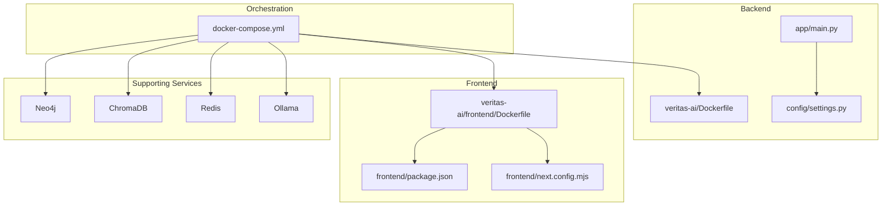

**Diagram sources**
- [docker-compose.yml:1-160](file://veritas-ai/docker-compose.yml#L1-L160)
- [Dockerfile:1-81](file://veritas-ai/Dockerfile#L1-L81)
- [frontend/Dockerfile:1-54](file://veritas-ai/frontend/Dockerfile#L1-L54)
- [app/main.py:1-208](file://veritas-ai/app/main.py#L1-L208)
- [config/settings.py:1-83](file://veritas-ai/config/settings.py#L1-L83)
- [frontend/package.json:1-27](file://veritas-ai/frontend/package.json#L1-L27)
- [frontend/next.config.mjs:1-8](file://veritas-ai/frontend/next.config.mjs#L1-L8)

**Section sources**
- [README.md:1-82](file://README.md#L1-L82)
- [docker-compose.yml:1-160](file://veritas-ai/docker-compose.yml#L1-L160)
- [Dockerfile:1-81](file://veritas-ai/Dockerfile#L1-L81)
- [frontend/Dockerfile:1-54](file://veritas-ai/frontend/Dockerfile#L1-L54)

## Core Components
- Backend service: FastAPI application with lifecycle management, timeouts, rate limiting, and health checks.
- Frontend dashboard: Next.js application built in a multi-stage container with health checks.
- Supporting services: Neo4j for knowledge graph, ChromaDB for embeddings, Redis for caching, Ollama for local LLMs.
- Configuration: Pydantic-based settings with environment overrides.
- Observability: Metrics and drift logging to JSONL files.
- Security: API key validation and rate limiting enforcement.
- Firewall: Deterministic override logic to prevent unverified outputs.

**Section sources**
- [app/main.py:1-208](file://veritas-ai/app/main.py#L1-L208)
- [config/settings.py:1-83](file://veritas-ai/config/settings.py#L1-L83)
- [core/observability.py:1-75](file://veritas-ai/core/observability.py#L1-L75)
- [core/security.py:1-129](file://veritas-ai/core/security.py#L1-L129)
- [core/firewall.py:1-47](file://veritas-ai/core/firewall.py#L1-L47)
- [docker-compose.yml:1-160](file://veritas-ai/docker-compose.yml#L1-L160)

## Architecture Overview
The system runs as a multi-container application with a FastAPI backend, a Next.js frontend, and persistent/ephemeral supporting services. Health checks and readiness conditions ensure robust startup sequencing.

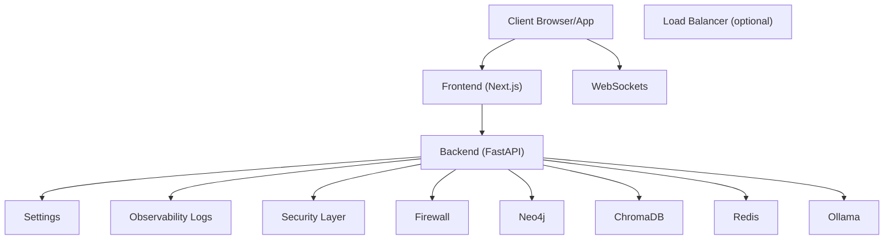

**Diagram sources**
- [docker-compose.yml:1-160](file://veritas-ai/docker-compose.yml#L1-L160)
- [app/main.py:1-208](file://veritas-ai/app/main.py#L1-L208)
- [config/settings.py:1-83](file://veritas-ai/config/settings.py#L1-L83)
- [core/observability.py:1-75](file://veritas-ai/core/observability.py#L1-L75)
- [core/security.py:1-129](file://veritas-ai/core/security.py#L1-L129)
- [core/firewall.py:1-47](file://veritas-ai/core/firewall.py#L1-L47)

## Detailed Component Analysis

### Backend Containerization (Multi-Stage Build)
- Builder stage installs Python dependencies into a user-owned directory and prepares system libraries for audio/Chromium/FFmpeg.
- Final stage sets non-root user, copies prebuilt packages, creates data/log directories, installs Playwright, exposes port 8000, defines health check, and starts Uvicorn with concurrency limits.

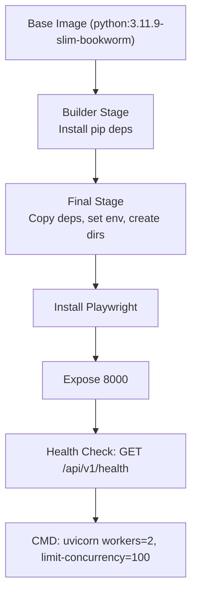

**Diagram sources**
- [Dockerfile:1-81](file://veritas-ai/Dockerfile#L1-L81)

**Section sources**
- [Dockerfile:1-81](file://veritas-ai/Dockerfile#L1-L81)

### Frontend Containerization (Next.js Multi-Stage)
- Multi-stage build: deps, builder, runner.
- Standalone output, non-root user, health check on root path, runs server.js.

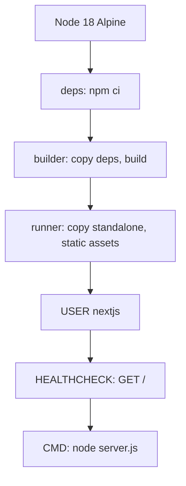

**Diagram sources**
- [frontend/Dockerfile:1-54](file://veritas-ai/frontend/Dockerfile#L1-L54)

**Section sources**
- [frontend/Dockerfile:1-54](file://veritas-ai/frontend/Dockerfile#L1-L54)
- [frontend/package.json:1-27](file://veritas-ai/frontend/package.json#L1-L27)
- [frontend/next.config.mjs:1-8](file://veritas-ai/frontend/next.config.mjs#L1-L8)

### Service Orchestration with Docker Compose
- Backend service:
  - Builds from root Dockerfile, binds port 8001:8000, sets environment variables for Neo4j, Ollama, Redis, Chroma persistence, timeouts, and public URLs.
  - Depends on Neo4j healthy, Chroma started, Redis healthy, Ollama healthy.
  - Health check probes internal /api/v1/health.
  - Persists backend data via named volume.
- Frontend service:
  - Builds from ./frontend/Dockerfile, injects API/WS base URLs via build args, depends on backend healthy.
- Supporting services:
  - Neo4j: bolt/http ports bound with APOC plugin; health via cypher-shell.
  - ChromaDB: local persisted volume.
  - Redis: appendonly with constrained memory policy and health check.
  - Ollama: host binding and health check.
- Networks and volumes defined centrally.

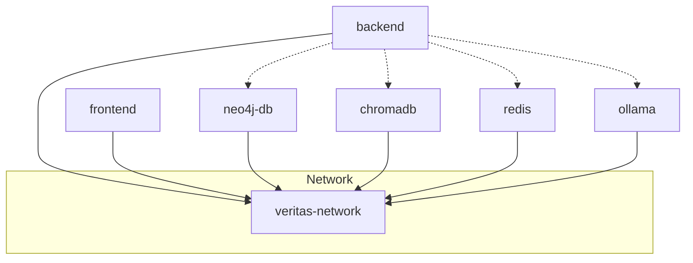

**Diagram sources**
- [docker-compose.yml:1-160](file://veritas-ai/docker-compose.yml#L1-L160)

**Section sources**
- [docker-compose.yml:1-160](file://veritas-ai/docker-compose.yml#L1-L160)

### CI/CD Pipelines
- CI pipeline (.github/workflows/ci.yml):
  - Runs on pushes to main/develop and PRs to main.
  - Sets up Python 3.11, installs backend requirements, runs backend tests.
  - Sets up Node.js 20, installs frontend dependencies, builds frontend.
  - Includes a note that Docker build can be added as a separate step.
- Veritas AI CD pipeline (.github/workflows/main.yml):
  - Lints and tests backend.
  - Builds backend and frontend Docker images tagged with the commit SHA.
  - Conditional deployment step (placeholder for production rollout).

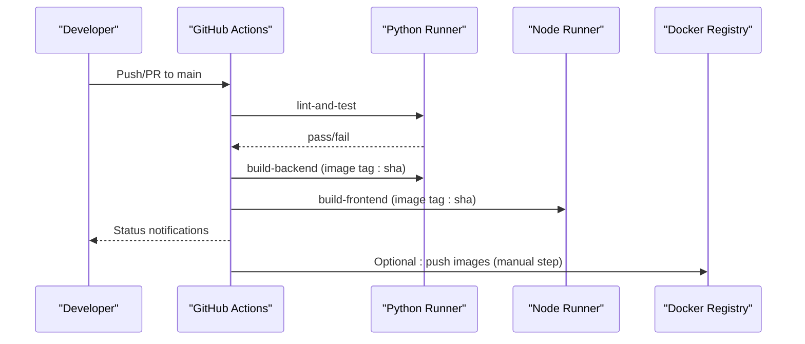

**Diagram sources**
- [ci.yml:1-6](file://.github/workflows/ci.yml#L1-L6)
- [main.yml:1-59](file://veritas-ai/.github/workflows/main.yml#L1-L59)

**Section sources**
- [.github/workflows/ci.yml:1-6](file://.github/workflows/ci.yml#L1-L6)
- [veritas-ai/.github/workflows/main.yml:1-59](file://veritas-ai/.github/workflows/main.yml#L1-L59)

### Configuration Management
- Settings loaded via Pydantic Settings with .env support.
- Key areas: timeouts, cache sizes, CORS, embedding/model selection, vector DB, Redis, Neo4j, streaming, and parallelism.

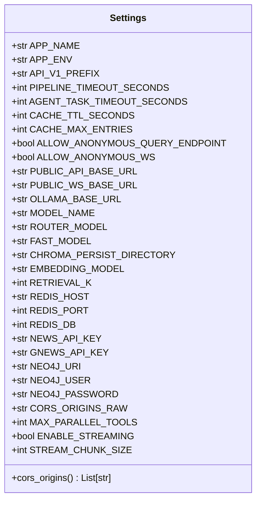

**Diagram sources**
- [config/settings.py:1-83](file://veritas-ai/config/settings.py#L1-L83)

**Section sources**
- [config/settings.py:1-83](file://veritas-ai/config/settings.py#L1-L83)

### Observability and Logging
- Metrics and drift logs written to JSONL files under logs/.
- Metrics include inference latency, tokens, and confidence; drift detection compares current score to moving average.

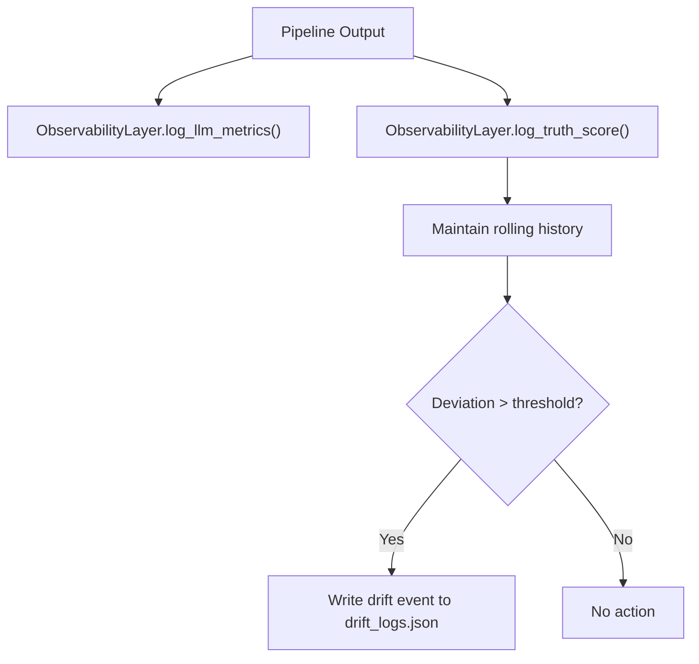

**Diagram sources**
- [core/observability.py:1-75](file://veritas-ai/core/observability.py#L1-L75)

**Section sources**
- [core/observability.py:1-75](file://veritas-ai/core/observability.py#L1-L75)

### Security Hardening
- API key enforcement via header; fixed-window rate limiting per tier; lock-protected in-memory client registry.
- Non-root users in containers; minimal base images; health checks; strict CORS configuration via settings.

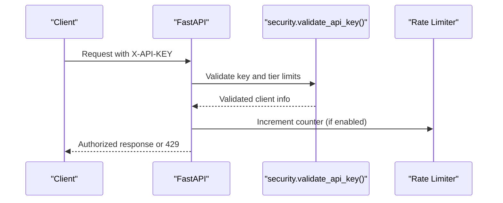

**Diagram sources**
- [core/security.py:1-129](file://veritas-ai/core/security.py#L1-L129)
- [app/main.py:177-197](file://veritas-ai/app/main.py#L177-L197)

**Section sources**
- [core/security.py:1-129](file://veritas-ai/core/security.py#L1-L129)
- [app/main.py:177-197](file://veritas-ai/app/main.py#L177-L197)

### Deterministic Firewall
- Applies strict overrides to clamp statuses based on contradiction counts, trusted source thresholds, and truth score.

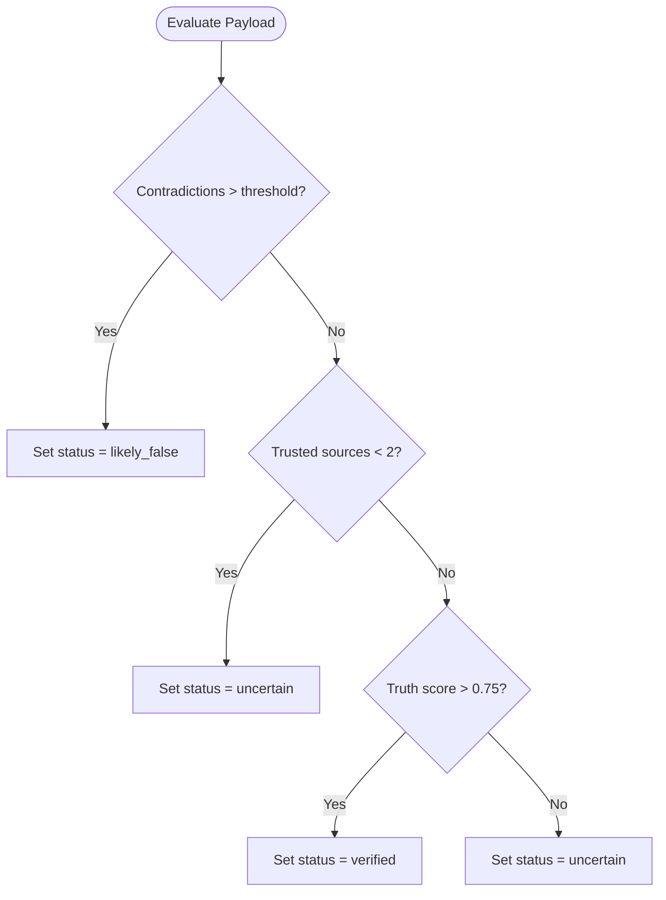

**Diagram sources**
- [core/firewall.py:1-47](file://veritas-ai/core/firewall.py#L1-L47)

**Section sources**
- [core/firewall.py:1-47](file://veritas-ai/core/firewall.py#L1-L47)

### Operational Procedures and Health Checks
- Local startup script orchestrates Docker Compose, prints endpoints, and suggests following logs.
- Health checks:
  - Backend: GET /api/v1/health
  - Frontend: GET /
  - Neo4j: cypher-shell connectivity
  - Redis: redis-cli ping
  - Ollama: list models
- Test coverage validates backend health and WebSocket behavior.

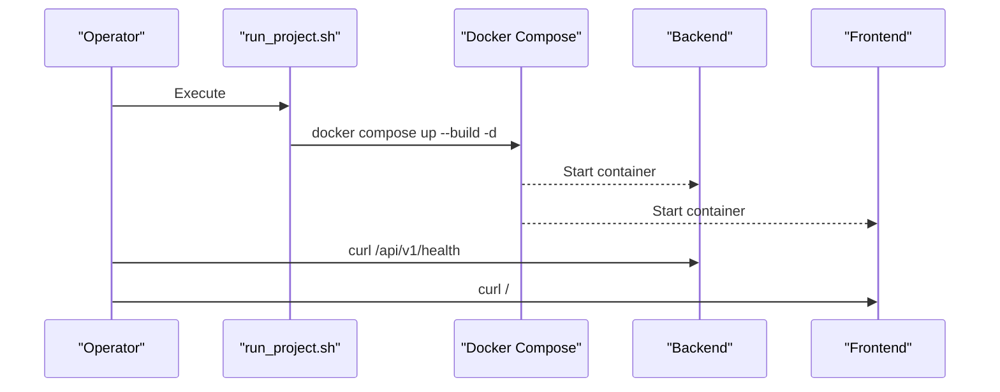

**Diagram sources**
- [run_project.sh:1-41](file://run_project.sh#L1-L41)
- [docker-compose.yml:42-47](file://veritas-ai/docker-compose.yml#L42-L47)
- [frontend/Dockerfile:50-51](file://veritas-ai/frontend/Dockerfile#L50-L51)

**Section sources**
- [run_project.sh:1-41](file://run_project.sh#L1-L41)
- [tests/test_docker_health.py:1-27](file://veritas-ai/tests/test_docker_health.py#L1-L27)
- [docker-compose.yml:42-47](file://veritas-ai/docker-compose.yml#L42-L47)
- [frontend/Dockerfile:50-51](file://veritas-ai/frontend/Dockerfile#L50-L51)

## Dependency Analysis
- Backend depends on:
  - Settings for runtime configuration
  - Observability for metrics/drift
  - Security for API key enforcement
  - Firewall for deterministic output gating
  - Supporting services (Neo4j, ChromaDB, Redis, Ollama) via environment variables
- Frontend depends on:
  - Build-time API/WS base URL injection
  - Standalone output for minimal runtime footprint

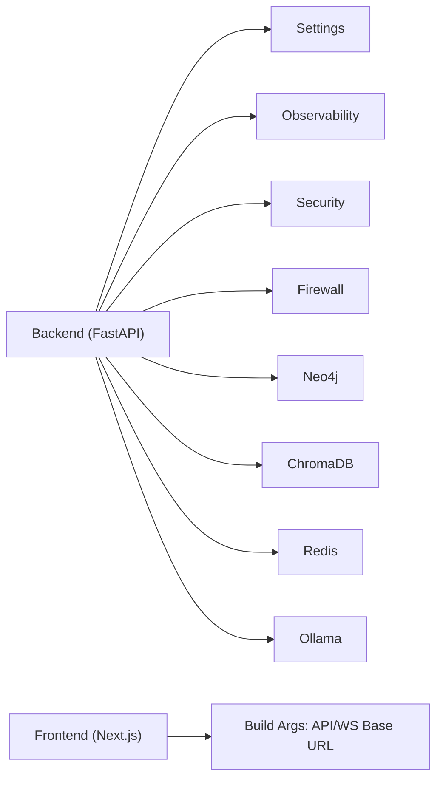

**Diagram sources**
- [app/main.py:1-208](file://veritas-ai/app/main.py#L1-L208)
- [config/settings.py:1-83](file://veritas-ai/config/settings.py#L1-L83)
- [core/observability.py:1-75](file://veritas-ai/core/observability.py#L1-L75)
- [core/security.py:1-129](file://veritas-ai/core/security.py#L1-L129)
- [core/firewall.py:1-47](file://veritas-ai/core/firewall.py#L1-L47)
- [docker-compose.yml:1-160](file://veritas-ai/docker-compose.yml#L1-L160)
- [frontend/Dockerfile:19-23](file://veritas-ai/frontend/Dockerfile#L19-L23)

**Section sources**
- [app/main.py:1-208](file://veritas-ai/app/main.py#L1-L208)
- [config/settings.py:1-83](file://veritas-ai/config/settings.py#L1-L83)
- [docker-compose.yml:1-160](file://veritas-ai/docker-compose.yml#L1-L160)

## Performance Considerations
- Concurrency and limits:
  - Uvicorn workers and concurrency limits are set in the backend Dockerfile.
  - Global request timeout middleware and per-route rate limiting via slowapi are configured in the backend.
- Startup optimization:
  - Fast startup with parallel initialization of cache and databases; background model preload.
- Resource allocation:
  - Redis constrained memory policy and maxmemory settings in Compose.
  - Playwright installation for browser-based tools; optional depending on runtime usage.
- Streaming and chunk size:
  - Streaming toggled via settings; chunk size configurable.

**Section sources**
- [Dockerfile:79-81](file://veritas-ai/Dockerfile#L79-L81)
- [app/main.py:126-151](file://veritas-ai/app/main.py#L126-L151)
- [app/main.py:177-197](file://veritas-ai/app/main.py#L177-L197)
- [config/settings.py:72-76](file://veritas-ai/config/settings.py#L72-L76)
- [docker-compose.yml:112-113](file://veritas-ai/docker-compose.yml#L112-L113)

## Troubleshooting Guide
Common issues and remedies:
- Backend not reachable:
  - Verify health endpoint and port mapping; confirm Compose logs for startup errors.
- Frontend blank or 404:
  - Confirm frontend health check and that backend is healthy before frontend depends_on.
- Neo4j connectivity:
  - Check cypher-shell health and credentials; ensure bolt/http ports are reachable.
- Redis instability:
  - Review health check and appendonly configuration; adjust maxmemory settings if needed.
- Ollama availability:
  - Confirm list command health and host binding.
- API key problems:
  - Ensure X-API-KEY header is present; verify tier limits and reset windows.
- WebSocket failures:
  - Validate WS base URL and backend stream endpoints; tests demonstrate error responses for malformed messages.

**Section sources**
- [tests/test_docker_health.py:1-27](file://veritas-ai/tests/test_docker_health.py#L1-L27)
- [tests/test_firewall.py:1-43](file://veritas-ai/tests/test_firewall.py#L1-L43)
- [docker-compose.yml:87-92](file://veritas-ai/docker-compose.yml#L87-L92)
- [docker-compose.yml:119-123](file://veritas-ai/docker-compose.yml#L119-L123)
- [docker-compose.yml:137-141](file://veritas-ai/docker-compose.yml#L137-L141)
- [core/security.py:87-113](file://veritas-ai/core/security.py#L87-L113)

## Conclusion
Veritas AI provides a production-grade stack with multi-stage containerization, robust orchestration, and strong operational defaults. The documented CI/CD, observability, security, and firewall mechanisms enable safe, scalable deployments. Use the provided Compose topology as a baseline and extend with external load balancers, persistent storage, and centralized logging/monitoring for production environments.

## Appendices

### Deployment Topologies
- Single-node development:
  - Use Docker Compose to run backend, frontend, Neo4j, ChromaDB, Redis, and Ollama on a single host.
- Multi-node production:
  - Replace Compose services with managed services (cloud Neo4j/Redis/Vector DB/Ollama).
  - Add ingress/load balancer; scale backend pods behind a reverse proxy; persist volumes via cloud storage; centralize logs/metrics.

[No sources needed since this section provides general guidance]

### Monitoring and Observability
- Backend:
  - Health checks and timeouts; metrics and drift logs in logs/.
- Frontend:
  - Health check on root path.
- Infrastructure:
  - Neo4j, Redis, and Ollama health checks embedded in Compose.

**Section sources**
- [core/observability.py:1-75](file://veritas-ai/core/observability.py#L1-L75)
- [docker-compose.yml:42-47](file://veritas-ai/docker-compose.yml#L42-L47)
- [frontend/Dockerfile:50-51](file://veritas-ai/frontend/Dockerfile#L50-L51)

### Scaling and Load Balancing
- Horizontal scaling:
  - Scale backend replicas behind a load balancer; ensure stateless sessions and shared caches/backends.
- Backend worker tuning:
  - Adjust Uvicorn workers and concurrency limits per CPU/memory capacity.
- Frontend:
  - Stateless Next.js; scale independently.

**Section sources**
- [Dockerfile:79-81](file://veritas-ai/Dockerfile#L79-L81)
- [app/main.py:126-151](file://veritas-ai/app/main.py#L126-L151)

### Backup and Disaster Recovery
- Data volumes:
  - Named volumes for backend, Neo4j, ChromaDB, Redis, and Ollama data.
- Recommendations:
  - Schedule regular snapshots/backups of named volumes; automate offsite retention; test restore procedures.

**Section sources**
- [docker-compose.yml:147-159](file://veritas-ai/docker-compose.yml#L147-L159)

### Security Hardening
- API keys and rate limits:
  - Enforce via security module; configure tiers and limits.
- Network exposure:
  - Restrict ports to localhost in Compose; expose only via ingress in production.
- Containers:
  - Non-root users; minimal base images; health checks.

**Section sources**
- [core/security.py:1-129](file://veritas-ai/core/security.py#L1-L129)
- [Dockerfile:31-33](file://veritas-ai/Dockerfile#L31-L33)
- [frontend/Dockerfile:34-35](file://veritas-ai/frontend/Dockerfile#L34-L35)

### Performance Tuning Guidelines
- Backend:
  - Tune workers/concurrency; adjust timeouts; monitor metrics and drift logs.
- Frontend:
  - Use standalone output; optimize build args for API/WS base URLs.
- Infrastructure:
  - Redis memory policy; Neo4j/Apoc tuning; Chroma persistence; Ollama model selection.

**Section sources**
- [Dockerfile:79-81](file://veritas-ai/Dockerfile#L79-L81)
- [frontend/Dockerfile:28-43](file://veritas-ai/frontend/Dockerfile#L28-L43)
- [docker-compose.yml:112-113](file://veritas-ai/docker-compose.yml#L112-L113)
- [config/settings.py:72-76](file://veritas-ai/config/settings.py#L72-L76)

### Operational Procedures
- Maintenance windows:
  - Graceful shutdown via lifespan; schedule rolling updates; preserve volumes.
- Updates:
  - Rebuild images via CI/CD; redeploy with zero-downtime strategies (replicas > 1).
- Testing:
  - Run health and firewall tests as part of pre-deployment checks.

**Section sources**
- [app/main.py:70-101](file://veritas-ai/app/main.py#L70-L101)
- [tests/test_docker_health.py:1-27](file://veritas-ai/tests/test_docker_health.py#L1-L27)
- [tests/test_firewall.py:1-43](file://veritas-ai/tests/test_firewall.py#L1-L43)