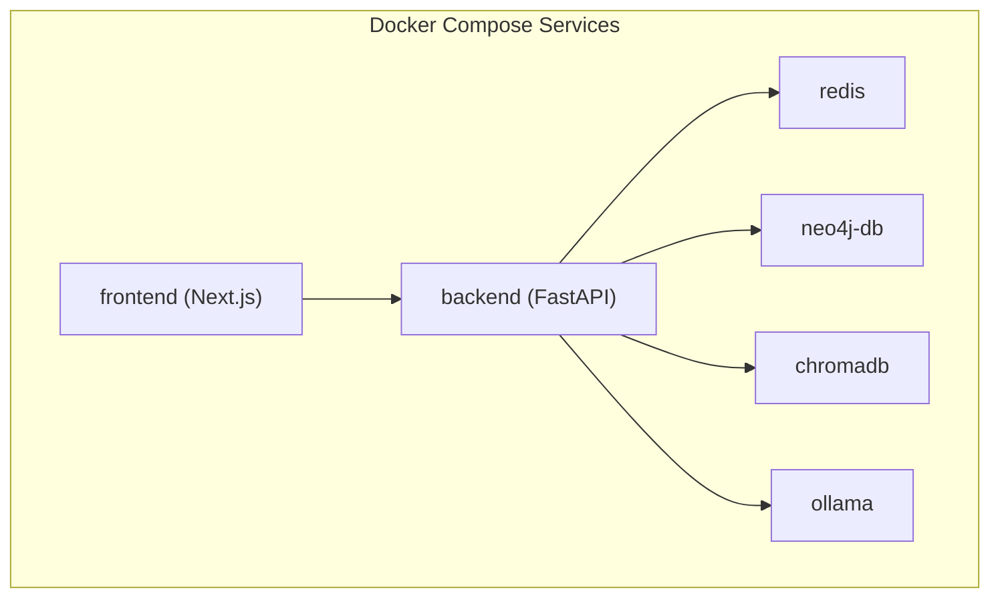
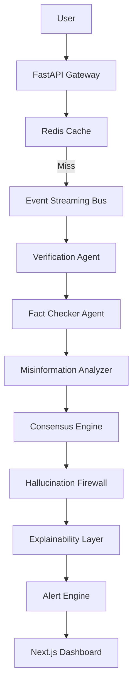
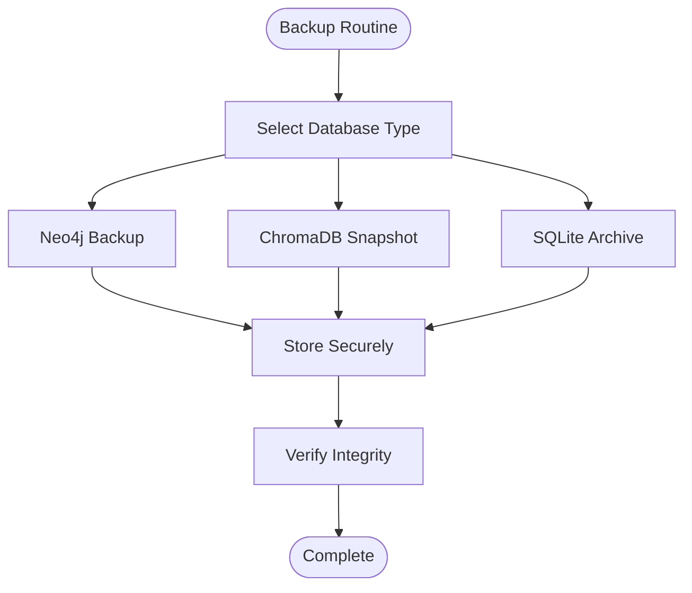
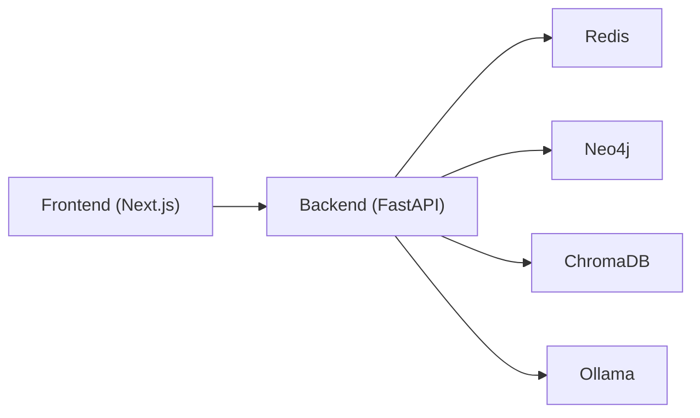

# Maintenance & Operational Procedures

<cite>
**Referenced Files in This Document**
- [README.md](file://README.md)
- [docker-compose.yml](file://docker-compose.yml)
- [Dockerfile](file://Dockerfile)
- [run_project.sh](file://run_project.sh)
- [requirements.txt](file://requirements.txt)
- [pyproject.toml](file://pyproject.toml)
- [app/main.py](file://veritas-ai/app/main.py)
- [config/settings.py](file://veritas-ai/config/settings.py)
- [core/security.py](file://veritas-ai/core/security.py)
- [core/observability.py](file://veritas-ai/core/observability.py)
- [core/firewall.py](file://veritas-ai/core/firewall.py)
- [core/cache_layer.py](file://veritas-ai/core/cache_layer.py)
- [core/history_store.py](file://veritas-ai/core/history_store.py)
- [feedback/feedback_service.py](file://veritas-ai/feedback/feedback_service.py)
- [models/multi_llm.py](file://veritas-ai/models/multi_llm.py)
- [tests/test_docker_health.py](file://veritas-ai/tests/test_docker_health.py)
</cite>

## Table of Contents
1. [Introduction](#introduction)
2. [Project Structure](#project-structure)
3. [Core Components](#core-components)
4. [Architecture Overview](#architecture-overview)
5. [Detailed Component Analysis](#detailed-component-analysis)
6. [Dependency Analysis](#dependency-analysis)
7. [Performance Considerations](#performance-considerations)
8. [Troubleshooting Guide](#troubleshooting-guide)
9. [Conclusion](#conclusion)
10. [Appendices](#appendices)

## Introduction
This document defines comprehensive maintenance and operational procedures for Veritas AI with a focus on system upkeep, update and patch management, disaster recovery, security maintenance, and operational checklists. It consolidates best practices for database backups, log rotation, cache purging, dependency updates, and Docker/Kubernetes deployments. It also outlines change management, maintenance windows, and post-update validation to ensure system stability and operational excellence.

## Project Structure
Veritas AI is a production-ready, event-driven platform composed of:
- Backend API (FastAPI) with asynchronous pipelines and agent orchestration
- Frontend dashboard (Next.js)
- Supporting services: Neo4j (knowledge graph), ChromaDB (vector store), Redis (cache), Ollama (local LLMs)
- Dockerized deployment with health checks and persistent volumes

**Diagram sources**
- [docker-compose.yml:1-160](file://docker-compose.yml#L1-L160)

**Section sources**
- [README.md:63-92](file://README.md#L63-L92)
- [docker-compose.yml:1-160](file://docker-compose.yml#L1-L160)

## Core Components
- Application lifecycle and startup/shutdown are orchestrated with a lifespan manager to ensure fast startup and graceful shutdown.
- Settings are managed via environment-backed configuration with sensible defaults and tunable parameters.
- Security enforcement relies on API key validation and rate limiting.
- Observability captures LLM metrics and detects drift in truth scores.
- Firewall enforces deterministic overrides to prevent false or contradictory outputs.
- Cache layer provides TTL-based caching with normalized keys.
- Persistent SQLite stores maintain query history and feedback loop data.

**Section sources**
- [app/main.py:31-102](file://veritas-ai/app/main.py#L31-L102)
- [config/settings.py:13-83](file://veritas-ai/config/settings.py#L13-L83)
- [core/security.py:12-129](file://veritas-ai/core/security.py#L12-L129)
- [core/observability.py:6-75](file://veritas-ai/core/observability.py#L6-L75)
- [core/firewall.py:4-47](file://veritas-ai/core/firewall.py#L4-L47)
- [core/cache_layer.py:10-41](file://veritas-ai/core/cache_layer.py#L10-L41)
- [core/history_store.py:23-106](file://veritas-ai/core/history_store.py#L23-L106)
- [feedback/feedback_service.py:39-94](file://veritas-ai/feedback/feedback_service.py#L39-L94)

## Architecture Overview
The system follows an event-driven, asynchronous design with a FastAPI gateway, Redis cache, internal event bus, and a multi-agent swarm. Observability and security layers protect outputs and monitor performance.

**Diagram sources**
- [README.md:37-59](file://README.md#L37-L59)

## Detailed Component Analysis

### Maintenance Windows and Change Management
- Schedule maintenance windows during low-traffic periods.
- Use rolling updates for stateless services (backend, frontend) and staged restarts for stateful services (Neo4j, Redis, Chroma).
- Tag releases and pin Docker images to immutable digests.
- Perform pre-deployment validation using health checks and smoke tests.

**Section sources**
- [docker-compose.yml:42-47](file://docker-compose.yml#L42-L47)
- [docker-compose.yml:87-92](file://docker-compose.yml#L87-L92)
- [docker-compose.yml:119-123](file://docker-compose.yml#L119-L123)
- [docker-compose.yml:137-141](file://docker-compose.yml#L137-L141)

### Routine Maintenance Tasks

#### Database Backups
- Neo4j: Use built-in backup mechanisms and export plugins. Persist backups to durable volumes and offload to secure storage.
- ChromaDB: Back up the persistent directory mounted under the container.
- SQLite: Back up the data directory containing query_history.sqlite and feedback_loop.sqlite.

**Section sources**
- [docker-compose.yml:82-84](file://docker-compose.yml#L82-L84)
- [docker-compose.yml:103-104](file://docker-compose.yml#L103-L104)
- [core/history_store.py:10-12](file://veritas-ai/core/history_store.py#L10-L12)
- [feedback/feedback_service.py:10-13](file://veritas-ai/feedback/feedback_service.py#L10-L13)

#### Log Rotation
- Centralize logs from containers and rotate on size/time thresholds.
- Retain logs for compliance and diagnostics; purge older entries according to policy.
- Monitor log volume and adjust retention to balance audit needs and storage costs.

[No sources needed since this section provides general guidance]

#### Cache Purging
- Clear Redis cache to refresh stale data after model updates or schema changes.
- Optionally reset local TTL cache by restarting the backend container.

**Section sources**
- [docker-compose.yml:112-113](file://docker-compose.yml#L112-L113)
- [config/settings.py:25-26](file://veritas-ai/config/settings.py#L25-L26)

#### Dependency Updates
- Python dependencies: Pin versions in requirements.txt and pyproject.toml; scan for vulnerabilities and update regularly.
- Frontend dependencies: Update package.json and rebuild the Next.js image.
- System libraries: Rebuild Docker images to incorporate OS-level updates.

**Section sources**
- [requirements.txt:1-42](file://veritas-ai/requirements.txt#L1-L42)
- [pyproject.toml:1-23](file://veritas-ai/pyproject.toml#L1-L23)
- [Dockerfile:8-13](file://veritas-ai/Dockerfile#L8-L13)
- [Dockerfile:36-53](file://veritas-ai/Dockerfile#L36-L53)

### Update and Patch Management

#### Docker Containers
- Pull updated base images and rebuild application images.
- Use health checks to validate service readiness after updates.
- Roll back by redeploying previous image digests.

**Section sources**
- [docker-compose.yml:42-47](file://docker-compose.yml#L42-L47)
- [docker-compose.yml:87-92](file://docker-compose.yml#L87-L92)
- [docker-compose.yml:119-123](file://docker-compose.yml#L119-L123)
- [docker-compose.yml:137-141](file://docker-compose.yml#L137-L141)

#### Python Dependencies
- Review requirements.txt and pyproject.toml for updates.
- Run vulnerability scans and remediate critical/high severity issues.
- Test updates in staging before promoting to production.

**Section sources**
- [requirements.txt:1-42](file://veritas-ai/requirements.txt#L1-L42)
- [pyproject.toml:1-23](file://veritas-ai/pyproject.toml#L1-L23)

#### System Libraries
- Rebuild Docker images to include OS updates.
- Validate that required system packages remain compatible with application binaries.

**Section sources**
- [Dockerfile:8-13](file://veritas-ai/Dockerfile#L8-L13)
- [Dockerfile:36-53](file://veritas-ai/Dockerfile#L36-L53)

### Disaster Recovery Procedures

#### Data Restoration
- Restore Neo4j from backups to the persistent volume.
- Restore ChromaDB snapshots to the mounted directory.
- Restore SQLite databases from backups to the data directory.

**Section sources**
- [docker-compose.yml:82-84](file://docker-compose.yml#L82-L84)
- [docker-compose.yml:103-104](file://docker-compose.yml#L103-L104)
- [core/history_store.py:10-12](file://veritas-ai/core/history_store.py#L10-L12)
- [feedback/feedback_service.py:10-13](file://veritas-ai/feedback/feedback_service.py#L10-L13)

#### Service Failover
- Use health checks to detect failing services and trigger automated restarts.
- Scale out stateless services (backend, frontend) horizontally.
- Fail over to standby replicas for stateful services if deployed in clustered mode.

**Section sources**
- [docker-compose.yml:42-47](file://docker-compose.yml#L42-L47)
- [docker-compose.yml:87-92](file://docker-compose.yml#L87-L92)
- [docker-compose.yml:119-123](file://docker-compose.yml#L119-L123)
- [docker-compose.yml:137-141](file://docker-compose.yml#L137-L141)

#### System Recovery Protocols
- Rebuild backend image and restart containers in dependency order.
- Validate API health endpoints and WebSocket connectivity.
- Confirm cache and database services are reachable and healthy.

**Section sources**
- [run_project.sh:17-40](file://run_project.sh#L17-L40)
- [tests/test_docker_health.py:9-26](file://veritas-ai/tests/test_docker_health.py#L9-L26)

### Security Maintenance

#### Vulnerability Assessments
- Scan container images and dependencies regularly.
- Prioritize patches for critical and high severity issues.
- Maintain an inventory of third-party components and licenses.

[No sources needed since this section provides general guidance]

#### Certificate Management
- Rotate TLS certificates for external exposure points.
- Ensure certificate lifecycles are monitored and renewed automatically.

[No sources needed since this section provides general guidance]

#### Access Control Reviews
- Audit API keys and tiers; revoke unused keys.
- Enforce rate limits per tier and monitor abuse.
- Review CORS origins and API exposure policies.

**Section sources**
- [core/security.py:12-129](file://veritas-ai/core/security.py#L12-L129)
- [config/settings.py:70-75](file://veritas-ai/config/settings.py#L70-L75)

### Operational Checklists

#### System Health Verification
- Verify backend health endpoint availability.
- Confirm WebSocket connectivity for streaming analytics.
- Check Redis, Neo4j, ChromaDB, and Ollama health.

**Section sources**
- [tests/test_docker_health.py:9-26](file://veritas-ai/tests/test_docker_health.py#L9-L26)
- [docker-compose.yml:42-47](file://docker-compose.yml#L42-L47)
- [docker-compose.yml:87-92](file://docker-compose.yml#L87-L92)
- [docker-compose.yml:119-123](file://docker-compose.yml#L119-L123)
- [docker-compose.yml:137-141](file://docker-compose.yml#L137-L141)

#### Performance Baseline Establishment
- Measure LLM inference latency and token usage.
- Track truth score drift to detect model degradation.
- Establish cache hit ratios and tune TTL and capacity.

**Section sources**
- [core/observability.py:33-43](file://veritas-ai/core/observability.py#L33-L43)
- [core/observability.py:45-71](file://veritas-ai/core/observability.py#L45-L71)
- [config/settings.py:25-26](file://veritas-ai/config/settings.py#L25-L26)

#### Incident Response Procedures
- Isolate failing services and collect logs.
- Validate firewall overrides and explainability outputs.
- Roll back recent changes if correlated with incidents.

**Section sources**
- [core/firewall.py:13-46](file://veritas-ai/core/firewall.py#L13-L46)
- [app/main.py:156-166](file://veritas-ai/app/main.py#L156-L166)

### Post-Update Validation
- Run health checks and smoke tests.
- Validate API responses and WebSocket streams.
- Confirm observability metrics are being recorded and drift detection remains functional.

**Section sources**
- [tests/test_docker_health.py:9-26](file://veritas-ai/tests/test_docker_health.py#L9-L26)
- [core/observability.py:33-43](file://veritas-ai/core/observability.py#L33-L43)

## Dependency Analysis
The backend depends on Redis for caching, Neo4j for knowledge graph storage, ChromaDB for vector retrieval, and Ollama for local LLMs. The frontend depends on the backend API and WebSocket endpoints.

**Diagram sources**
- [docker-compose.yml:13-28](file://docker-compose.yml#L13-L28)
- [docker-compose.yml:52-67](file://docker-compose.yml#L52-L67)

**Section sources**
- [docker-compose.yml:13-28](file://docker-compose.yml#L13-L28)
- [docker-compose.yml:52-67](file://docker-compose.yml#L52-L67)

## Performance Considerations
- Tune cache TTL and capacity to balance freshness and throughput.
- Monitor LLM latency and token usage to identify bottlenecks.
- Use streaming where enabled to improve perceived latency.

**Section sources**
- [config/settings.py:25-26](file://veritas-ai/config/settings.py#L25-L26)
- [config/settings.py:74-75](file://veritas-ai/config/settings.py#L74-L75)
- [core/observability.py:33-43](file://veritas-ai/core/observability.py#L33-L43)

## Troubleshooting Guide
- Use Docker logs to diagnose startup and runtime errors.
- Validate environment variables and persisted volumes.
- Confirm health checks pass for all dependent services.

**Section sources**
- [run_project.sh:23-31](file://run_project.sh#L23-L31)
- [docker-compose.yml:42-47](file://docker-compose.yml#L42-L47)
- [docker-compose.yml:87-92](file://docker-compose.yml#L87-L92)
- [docker-compose.yml:119-123](file://docker-compose.yml#L119-L123)
- [docker-compose.yml:137-141](file://docker-compose.yml#L137-L141)

## Conclusion
By following these maintenance and operational procedures—covering routine tasks, update management, disaster recovery, security, and validation—you can sustain Veritas AI’s reliability, performance, and security. Adopt standardized change management, rigorous testing, and continuous monitoring to ensure operational excellence.

## Appendices

### API Reference and Authentication
- All developer endpoints require an API key header except internal UI routes.
- Use the documented endpoints for health checks and streaming.

**Section sources**
- [README.md:95-107](file://README.md#L95-L107)
- [core/security.py:12-129](file://veritas-ai/core/security.py#L12-L129)