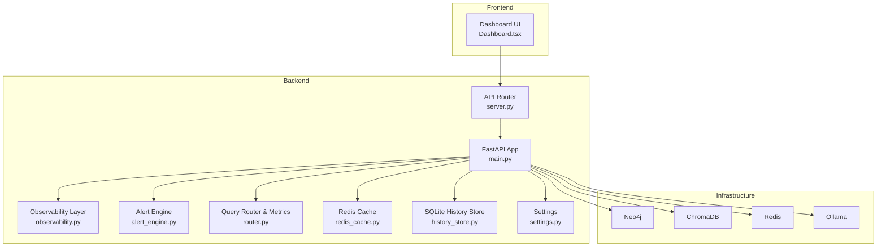
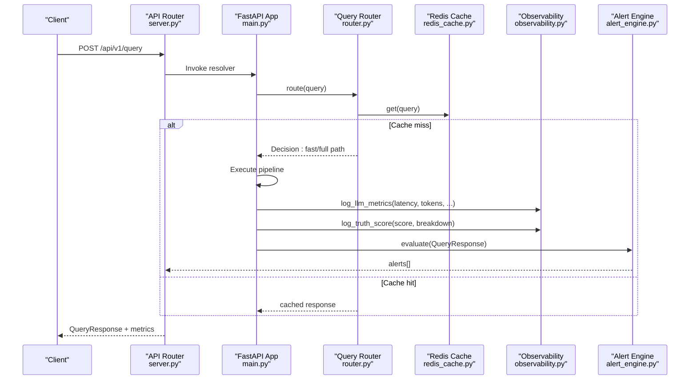
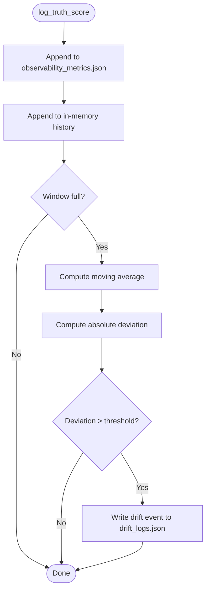
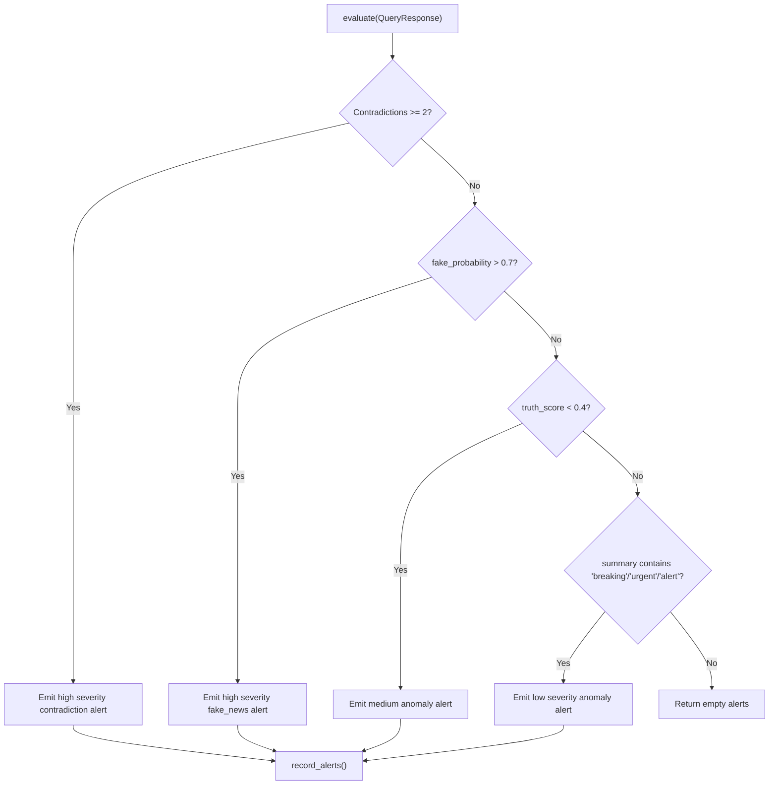
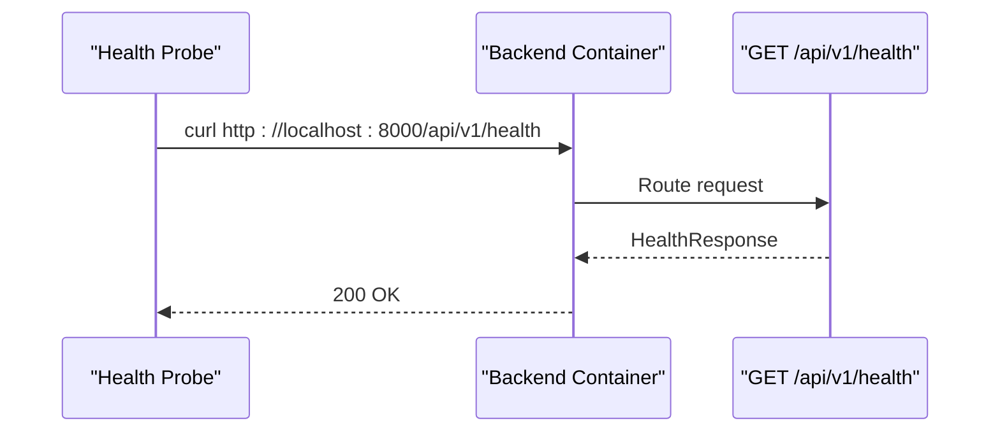
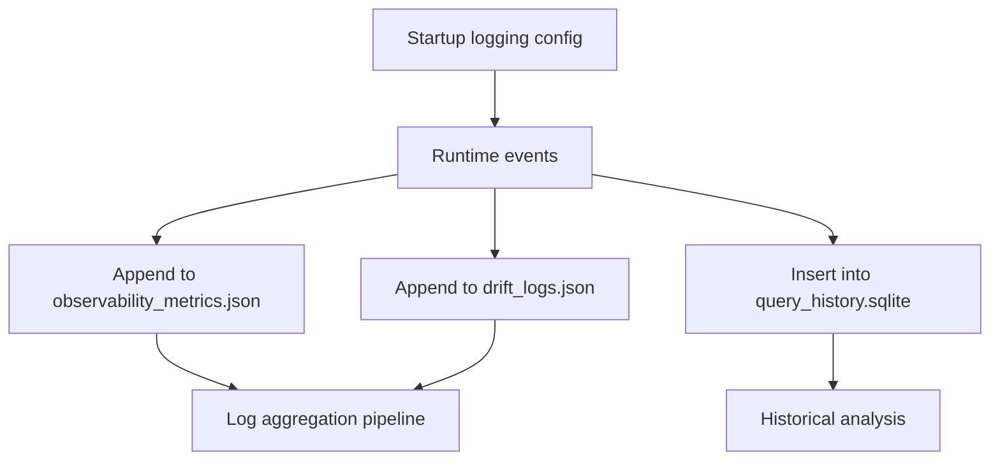
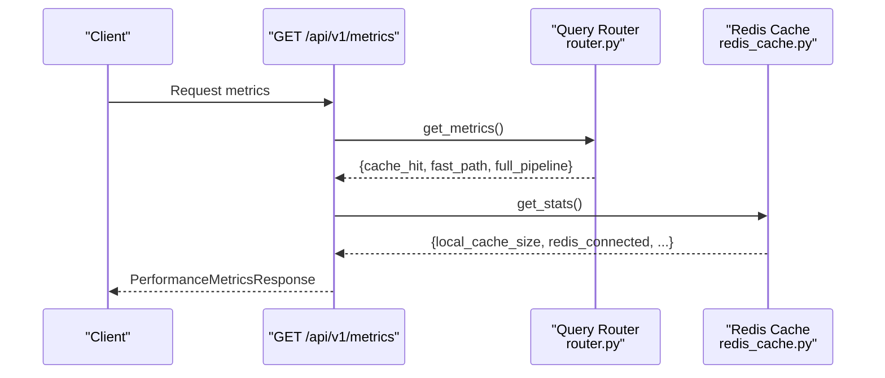
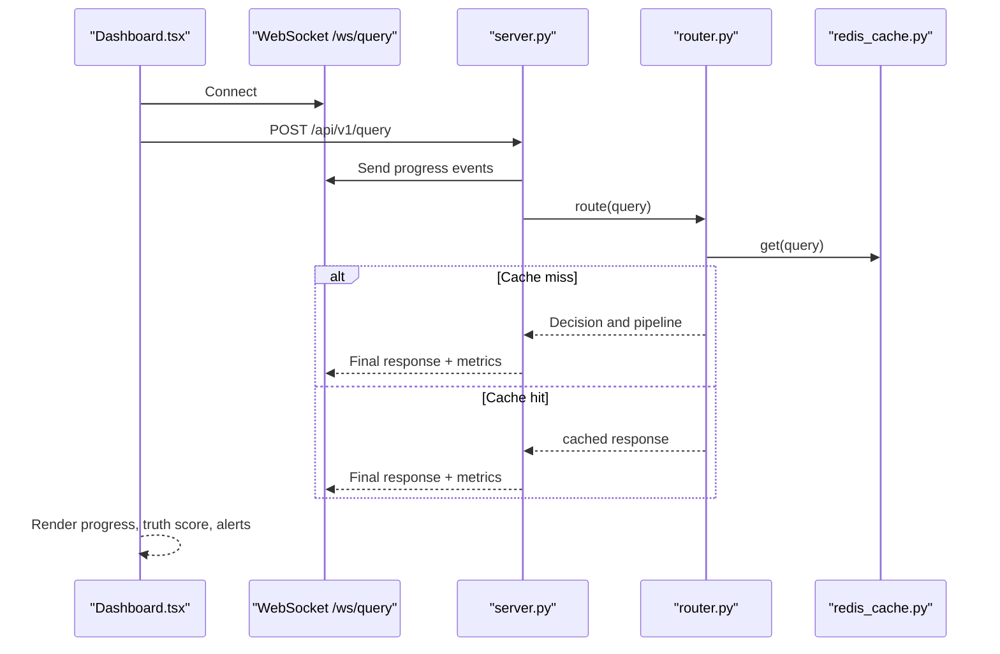
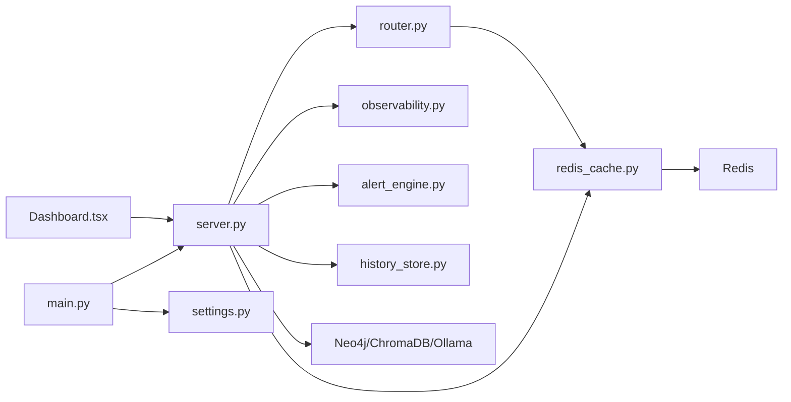

# Monitoring & Observability

<cite>
**Referenced Files in This Document**
- [observability.py](file://veritas-ai/core/observability.py)
- [alert_engine.py](file://veritas-ai/core/alert_engine.py)
- [server.py](file://veritas-ai/api/server.py)
- [main.py](file://veritas-ai/app/main.py)
- [settings.py](file://veritas-ai/config/settings.py)
- [history_store.py](file://veritas-ai/core/history_store.py)
- [router.py](file://veritas-ai/core/router.py)
- [schemas.py](file://veritas-ai/models/schemas.py)
- [cache_layer.py](file://veritas-ai/core/cache_layer.py)
- [redis_cache.py](file://veritas-ai/core/redis_cache.py)
- [Dashboard.tsx](file://veritas-ai/frontend/components/Dashboard.tsx)
- [docker-compose.yml](file://veritas-ai/docker-compose.yml)
</cite>

## Table of Contents
1. [Introduction](#introduction)
2. [Project Structure](#project-structure)
3. [Core Components](#core-components)
4. [Architecture Overview](#architecture-overview)
5. [Detailed Component Analysis](#detailed-component-analysis)
6. [Dependency Analysis](#dependency-analysis)
7. [Performance Considerations](#performance-considerations)
8. [Troubleshooting Guide](#troubleshooting-guide)
9. [Conclusion](#conclusion)
10. [Appendices](#appendices)

## Introduction
This document provides comprehensive monitoring and observability guidance for Veritas AI. It covers metrics collection for system resources and application performance, structured logging and log aggregation, health checks for microservices and dependencies, alerting configuration for critical events and performance degradation, dashboard creation guidelines, and troubleshooting methodologies grounded in the existing observability data.

## Project Structure
Veritas AI’s observability spans backend services, API endpoints, caching layers, and the frontend dashboard. The backend exposes health and metrics endpoints, logs truth scores and inference metrics, evaluates anomalies, and persists query history. The frontend consumes streaming telemetry and displays real-time status and alerts.

**Diagram sources**
- [main.py:106-111](file://veritas-ai/app/main.py#L106-L111)
- [server.py:40-41](file://veritas-ai/api/server.py#L40-L41)
- [observability.py:6-23](file://veritas-ai/core/observability.py#L6-L23)
- [alert_engine.py:20-66](file://veritas-ai/core/alert_engine.py#L20-L66)
- [router.py:83-151](file://veritas-ai/core/router.py#L83-L151)
- [redis_cache.py:18-222](file://veritas-ai/core/redis_cache.py#L18-L222)
- [history_store.py:23-105](file://veritas-ai/core/history_store.py#L23-L105)
- [settings.py:13-82](file://veritas-ai/config/settings.py#L13-L82)
- [Dashboard.tsx:21-311](file://veritas-ai/frontend/components/Dashboard.tsx#L21-L311)

**Section sources**
- [main.py:106-111](file://veritas-ai/app/main.py#L106-L111)
- [server.py:40-41](file://veritas-ai/api/server.py#L40-L41)
- [observability.py:6-23](file://veritas-ai/core/observability.py#L6-L23)
- [alert_engine.py:20-66](file://veritas-ai/core/alert_engine.py#L20-L66)
- [router.py:83-151](file://veritas-ai/core/router.py#L83-L151)
- [redis_cache.py:18-222](file://veritas-ai/core/redis_cache.py#L18-L222)
- [history_store.py:23-105](file://veritas-ai/core/history_store.py#L23-L105)
- [settings.py:13-82](file://veritas-ai/config/settings.py#L13-L82)
- [Dashboard.tsx:21-311](file://veritas-ai/frontend/components/Dashboard.tsx#L21-L311)

## Core Components
- Observability Layer: Logs inference metrics and truth scores, and detects drift via moving average.
- Alert Engine: Evaluates structured responses for anomalies and emits standardized alerts.
- API Router: Exposes health, metrics, and alerts endpoints; integrates rate limiting.
- Query Router: Routes queries, records routing metrics, and updates cache.
- Redis Cache: Provides distributed caching with local fallback and statistics.
- History Store: Persists query results to SQLite for auditability.
- Settings: Centralized configuration for timeouts, caches, and limits.
- Frontend Dashboard: Streams telemetry and displays progress, truth score, and alerts.

**Section sources**
- [observability.py:33-74](file://veritas-ai/core/observability.py#L33-L74)
- [alert_engine.py:26-66](file://veritas-ai/core/alert_engine.py#L26-L66)
- [server.py:88-203](file://veritas-ai/api/server.py#L88-L203)
- [router.py:99-181](file://veritas-ai/core/router.py#L99-L181)
- [redis_cache.py:30-163](file://veritas-ai/core/redis_cache.py#L30-L163)
- [history_store.py:46-102](file://veritas-ai/core/history_store.py#L46-L102)
- [settings.py:20-29](file://veritas-ai/config/settings.py#L20-L29)
- [Dashboard.tsx:21-311](file://veritas-ai/frontend/components/Dashboard.tsx#L21-L311)

## Architecture Overview
The system collects metrics and logs at runtime, evaluates anomalies, and surfaces health and performance via REST and WebSocket endpoints. The frontend subscribes to streams to visualize progress and truth scores, while infrastructure services (Neo4j, ChromaDB, Redis, Ollama) are monitored via Docker health checks.

**Diagram sources**
- [server.py:53-77](file://veritas-ai/api/server.py#L53-L77)
- [router.py:99-181](file://veritas-ai/core/router.py#L99-L181)
- [redis_cache.py:66-106](file://veritas-ai/core/redis_cache.py#L66-L106)
- [observability.py:33-71](file://veritas-ai/core/observability.py#L33-L71)
- [alert_engine.py:26-66](file://veritas-ai/core/alert_engine.py#L26-L66)

## Detailed Component Analysis

### Observability Metrics Collection
- Purpose: Track inference latency, token counts, confidence, and truth scores; detect drift in truth scores over time.
- Data model: JSON records appended to dedicated files for metrics and drift logs.
- Drift detection: Maintains a sliding window of recent truth scores and compares against moving average to emit drift events.

**Diagram sources**
- [observability.py:45-71](file://veritas-ai/core/observability.py#L45-L71)

**Section sources**
- [observability.py:33-74](file://veritas-ai/core/observability.py#L33-L74)
- [observability_metrics.json:1-15](file://veritas-ai/logs/observability_metrics.json#L1-L15)

### Alerting System
- Evaluation criteria: Contradictions count, fake news probability, truth score thresholds, and temporal anomaly keywords.
- Output: Standardized alert items with severity and timestamps; recent alerts exposed via endpoint.

**Diagram sources**
- [alert_engine.py:26-66](file://veritas-ai/core/alert_engine.py#L26-L66)

**Section sources**
- [alert_engine.py:12-18](file://veritas-ai/core/alert_engine.py#L12-L18)
- [alert_engine.py:26-66](file://veritas-ai/core/alert_engine.py#L26-L66)
- [schemas.py:40-49](file://veritas-ai/models/schemas.py#L40-L49)

### Health Checks and Dependencies
- Backend health endpoint: GET /api/v1/health returns service status.
- Infrastructure health checks via Docker Compose: backend, Neo4j, ChromaDB, Redis, Ollama.
- Frontend dependency: depends on backend health for readiness.

**Diagram sources**
- [server.py:88-94](file://veritas-ai/api/server.py#L88-L94)
- [docker-compose.yml:42-47](file://veritas-ai/docker-compose.yml#L42-L47)

**Section sources**
- [server.py:88-94](file://veritas-ai/api/server.py#L88-L94)
- [docker-compose.yml:42-47](file://veritas-ai/docker-compose.yml#L42-L47)
- [docker-compose.yml:87-92](file://veritas-ai/docker-compose.yml#L87-L92)
- [docker-compose.yml:119-123](file://veritas-ai/docker-compose.yml#L119-L123)
- [docker-compose.yml:137-141](file://veritas-ai/docker-compose.yml#L137-L141)

### Logging Strategy and Persistence
- Structured logging: Application logs configured at startup with level from settings.
- Metrics and drift logs: JSON append-only files for inference metrics and drift events.
- Query history: SQLite persistence for auditability and historical trends.

**Diagram sources**
- [main.py:24-28](file://veritas-ai/app/main.py#L24-L28)
- [observability.py:25-43](file://veritas-ai/core/observability.py#L25-L43)
- [history_store.py:46-63](file://veritas-ai/core/history_store.py#L46-L63)

**Section sources**
- [main.py:24-28](file://veritas-ai/app/main.py#L24-L28)
- [observability.py:25-43](file://veritas-ai/core/observability.py#L25-L43)
- [history_store.py:23-102](file://veritas-ai/core/history_store.py#L23-L102)

### Performance Indicators and Routing Metrics
- Endpoint: GET /api/v1/metrics returns router metrics and cache stats.
- Router metrics: Count and average latency per route category.
- Cache stats: Local cache size and Redis connectivity plus basic Redis stats.

**Diagram sources**
- [server.py:196-203](file://veritas-ai/api/server.py#L196-L203)
- [router.py:142-149](file://veritas-ai/core/router.py#L142-L149)
- [redis_cache.py:146-163](file://veritas-ai/core/redis_cache.py#L146-L163)

**Section sources**
- [server.py:196-203](file://veritas-ai/api/server.py#L196-L203)
- [router.py:138-149](file://veritas-ai/core/router.py#L138-L149)
- [redis_cache.py:146-163](file://veritas-ai/core/redis_cache.py#L146-L163)

### Real-Time Telemetry and Dashboard
- WebSocket endpoints: Stream progress and results; frontend renders truth score, status, and alerts.
- Progress stages: Visual stages for cache check, routing, processing, verification, scoring, and generation.
- Truth gauge and confidence breakdown visualization.

**Diagram sources**
- [Dashboard.tsx:21-311](file://veritas-ai/frontend/components/Dashboard.tsx#L21-L311)
- [server.py:216-240](file://veritas-ai/api/server.py#L216-L240)
- [router.py:99-181](file://veritas-ai/core/router.py#L99-L181)
- [redis_cache.py:66-83](file://veritas-ai/core/redis_cache.py#L66-L83)

**Section sources**
- [Dashboard.tsx:21-311](file://veritas-ai/frontend/components/Dashboard.tsx#L21-L311)
- [server.py:216-240](file://veritas-ai/api/server.py#L216-L240)
- [router.py:99-181](file://veritas-ai/core/router.py#L99-L181)
- [redis_cache.py:66-83](file://veritas-ai/core/redis_cache.py#L66-L83)

## Dependency Analysis
- Coupling: API router depends on query router, cache, and observability; observability writes to disk; alert engine consumes structured responses.
- Cohesion: Each module encapsulates a single responsibility—routing, caching, metrics, alerts, persistence.
- External dependencies: Redis, Neo4j, ChromaDB, Ollama; health-checked via Docker Compose.

**Diagram sources**
- [server.py:40-41](file://veritas-ai/api/server.py#L40-L41)
- [router.py:83-151](file://veritas-ai/core/router.py#L83-L151)
- [redis_cache.py:18-222](file://veritas-ai/core/redis_cache.py#L18-L222)
- [observability.py:6-23](file://veritas-ai/core/observability.py#L6-L23)
- [alert_engine.py:20-66](file://veritas-ai/core/alert_engine.py#L20-L66)
- [history_store.py:23-105](file://veritas-ai/core/history_store.py#L23-L105)
- [main.py:106-111](file://veritas-ai/app/main.py#L106-L111)
- [settings.py:13-82](file://veritas-ai/config/settings.py#L13-L82)
- [Dashboard.tsx:21-311](file://veritas-ai/frontend/components/Dashboard.tsx#L21-L311)

**Section sources**
- [server.py:40-41](file://veritas-ai/api/server.py#L40-L41)
- [router.py:83-151](file://veritas-ai/core/router.py#L83-L151)
- [redis_cache.py:18-222](file://veritas-ai/core/redis_cache.py#L18-L222)
- [observability.py:6-23](file://veritas-ai/core/observability.py#L6-L23)
- [alert_engine.py:20-66](file://veritas-ai/core/alert_engine.py#L20-L66)
- [history_store.py:23-105](file://veritas-ai/core/history_store.py#L23-L105)
- [main.py:106-111](file://veritas-ai/app/main.py#L106-L111)
- [settings.py:13-82](file://veritas-ai/config/settings.py#L13-L82)
- [Dashboard.tsx:21-311](file://veritas-ai/frontend/components/Dashboard.tsx#L21-L311)

## Performance Considerations
- Latency tracking: Inference latency recorded per request; router metrics aggregated for route selection efficiency.
- Caching: Dual-layer cache (local TTL + Redis) reduces latency and load; cache stats help monitor effectiveness.
- Timeouts: Global request timeout middleware prevents overload; pipeline timeouts configurable via settings.
- Concurrency: Asynchronous Redis operations and background tasks improve throughput.

[No sources needed since this section provides general guidance]

## Troubleshooting Guide
- Health issues: Verify backend health endpoint and Docker health checks for dependent services.
- Performance degradation: Review router metrics and cache stats; investigate high latency routes or cache misses.
- Drift detection: Investigate truth score drift events and correlate with model updates or data drift.
- Alerts: Use recent alerts endpoint to triage anomalies; severity-driven escalation recommended.
- Logs: Inspect application logs and observability metrics files; confirm structured entries for inference and drift.

**Section sources**
- [server.py:88-94](file://veritas-ai/api/server.py#L88-L94)
- [docker-compose.yml:42-47](file://veritas-ai/docker-compose.yml#L42-L47)
- [router.py:142-149](file://veritas-ai/core/router.py#L142-L149)
- [redis_cache.py:146-163](file://veritas-ai/core/redis_cache.py#L146-L163)
- [observability.py:55-69](file://veritas-ai/core/observability.py#L55-L69)
- [alert_engine.py:17-18](file://veritas-ai/core/alert_engine.py#L17-L18)
- [main.py:24-28](file://veritas-ai/app/main.py#L24-L28)

## Conclusion
Veritas AI implements a pragmatic observability stack with structured metrics, drift detection, anomaly alerts, and historical persistence. The API exposes health and performance endpoints, while the frontend visualizes real-time telemetry. Docker health checks ensure dependency integrity. Extending this foundation with centralized log aggregation, alerting rules, and dashboards will further strengthen production readiness.

[No sources needed since this section summarizes without analyzing specific files]

## Appendices

### Dashboard Creation Guidelines
- Metrics panels: Display router route counts and averages, cache hit ratios, and Redis stats.
- Truth score panel: Show rolling average and recent drift events.
- Alerts panel: Filter and color-code by severity; enable auto-refresh.
- Progress visualization: Mirror WebSocket stages in the dashboard for transparency.

[No sources needed since this section provides general guidance]

### Log Retention and Compliance
- Retention: Define lifecycle policies for observability metrics and drift logs; archive historical data periodically.
- Compliance: Ensure logs do not retain PII; anonymize where necessary; restrict access to sensitive endpoints.

[No sources needed since this section provides general guidance]