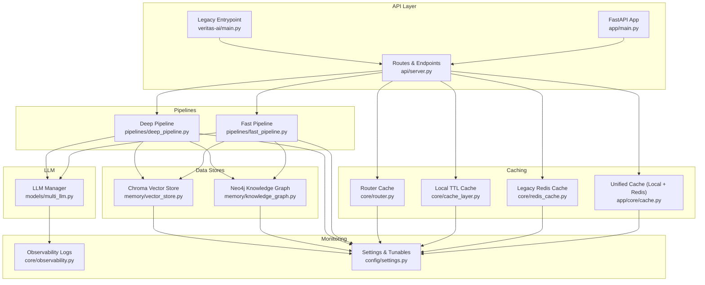
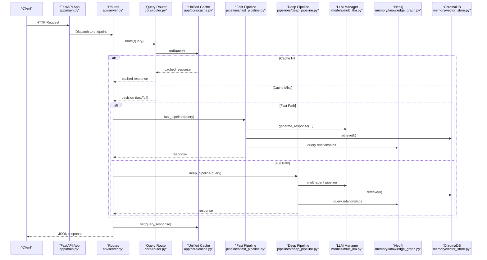
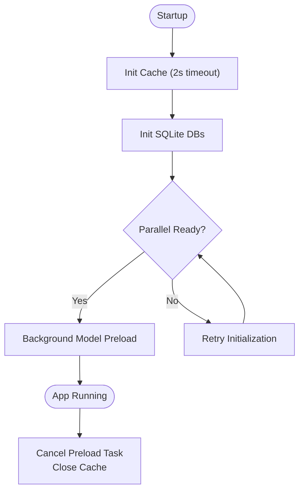
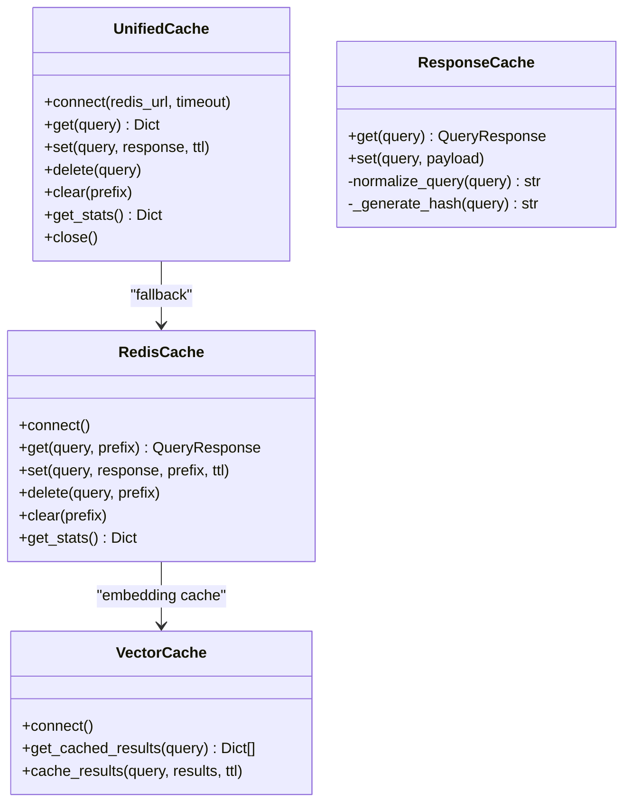
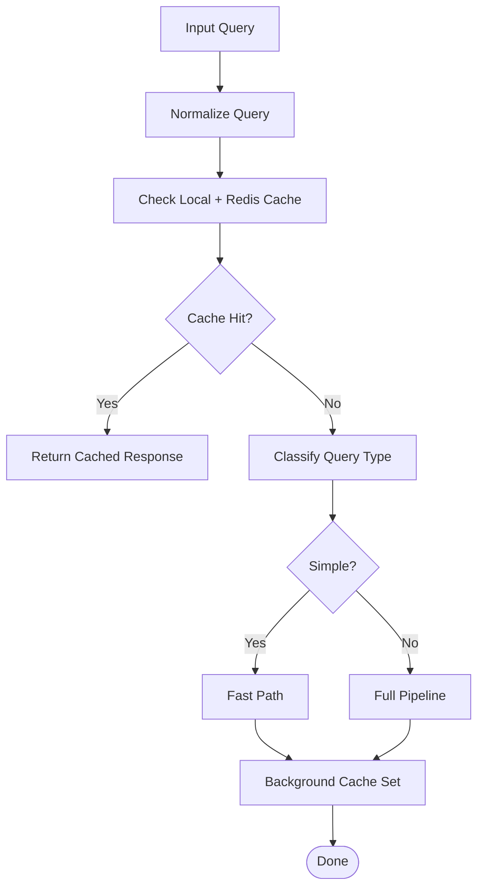
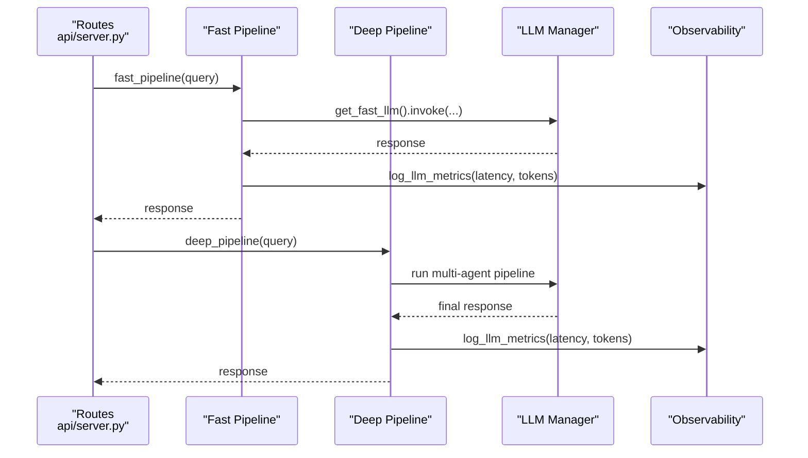
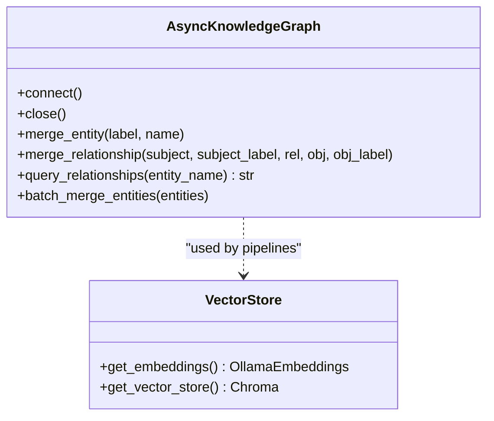
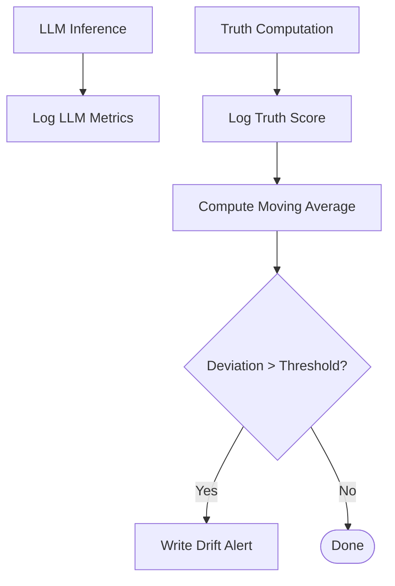
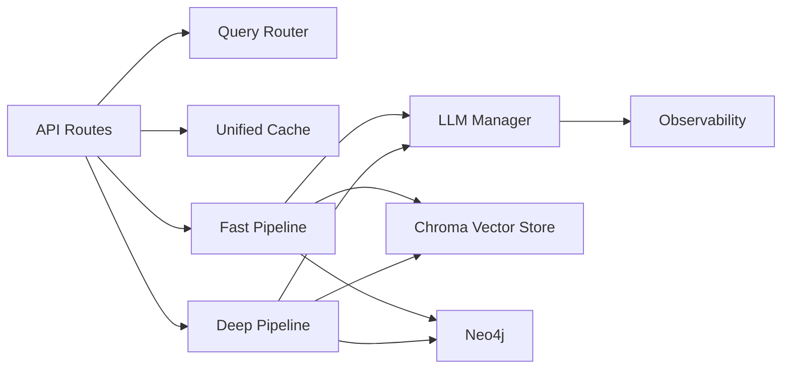

# Scaling & Performance Optimization

<cite>
**Referenced Files in This Document**
- [main.py](file://veritas-ai/main.py)
- [app/main.py](file://veritas-ai/app/main.py)
- [api/server.py](file://veritas-ai/api/server.py)
- [core/cache_layer.py](file://veritas-ai/core/cache_layer.py)
- [core/redis_cache.py](file://veritas-ai/core/redis_cache.py)
- [app/core/cache.py](file://veritas-ai/app/core/cache.py)
- [core/router.py](file://veritas-ai/core/router.py)
- [memory/knowledge_graph.py](file://veritas-ai/memory/knowledge_graph.py)
- [memory/vector_store.py](file://veritas-ai/memory/vector_store.py)
- [pipelines/fast_pipeline.py](file://veritas-ai/pipelines/fast_pipeline.py)
- [pipelines/deep_pipeline.py](file://veritas-ai/pipelines/deep_pipeline.py)
- [models/multi_llm.py](file://veritas-ai/models/multi_llm.py)
- [config/settings.py](file://veritas-ai/config/settings.py)
- [core/observability.py](file://veritas-ai/core/observability.py)
- [docker-compose.yml](file://veritas-ai/docker-compose.yml)
</cite>

## Table of Contents
1. [Introduction](#introduction)
2. [Project Structure](#project-structure)
3. [Core Components](#core-components)
4. [Architecture Overview](#architecture-overview)
5. [Detailed Component Analysis](#detailed-component-analysis)
6. [Dependency Analysis](#dependency-analysis)
7. [Performance Considerations](#performance-considerations)
8. [Troubleshooting Guide](#troubleshooting-guide)
9. [Conclusion](#conclusion)
10. [Appendices](#appendices)

## Introduction
This document provides a comprehensive guide to scaling and performance optimization for Veritas AI, focusing on high-throughput verification workloads. It covers horizontal and vertical scaling strategies for the backend API service, load balancing and auto-scaling configurations, performance optimization for knowledge graph queries, vector similarity searches, and LLM inference operations. It also documents caching strategies using Redis, database optimization for Neo4j and ChromaDB, query performance monitoring, load testing methodologies, bottleneck identification, capacity planning, and resource utilization optimization for cost-effective operations.

## Project Structure
Veritas AI is organized around a FastAPI backend with modular components for caching, routing, pipelines, LLM orchestration, and observability. The system integrates:
- API layer with rate limiting and health endpoints
- Unified caching layer (local TTL + Redis)
- Query routing and classification
- Fast and deep verification pipelines
- LLM manager with SQLite caching and metrics
- Knowledge graph (Neo4j) and vector store (Chroma) integrations
- Observability and logging

**Diagram sources**
- [app/main.py:1-208](file://veritas-ai/app/main.py#L1-L208)
- [main.py:1-141](file://veritas-ai/main.py#L1-L141)
- [api/server.py:1-285](file://veritas-ai/api/server.py#L1-L285)
- [app/core/cache.py:1-172](file://veritas-ai/app/core/cache.py#L1-L172)
- [core/redis_cache.py:1-232](file://veritas-ai/core/redis_cache.py#L1-L232)
- [core/cache_layer.py:1-41](file://veritas-ai/core/cache_layer.py#L1-L41)
- [core/router.py:1-182](file://veritas-ai/core/router.py#L1-L182)
- [pipelines/fast_pipeline.py:1-22](file://veritas-ai/pipelines/fast_pipeline.py#L1-L22)
- [pipelines/deep_pipeline.py:1-17](file://veritas-ai/pipelines/deep_pipeline.py#L1-L17)
- [models/multi_llm.py:1-143](file://veritas-ai/models/multi_llm.py#L1-L143)
- [memory/knowledge_graph.py:1-160](file://veritas-ai/memory/knowledge_graph.py#L1-L160)
- [memory/vector_store.py:1-27](file://veritas-ai/memory/vector_store.py#L1-L27)
- [core/observability.py:1-75](file://veritas-ai/core/observability.py#L1-L75)
- [config/settings.py:1-83](file://veritas-ai/config/settings.py#L1-L83)

**Section sources**
- [app/main.py:1-208](file://veritas-ai/app/main.py#L1-L208)
- [main.py:1-141](file://veritas-ai/main.py#L1-L141)
- [api/server.py:1-285](file://veritas-ai/api/server.py#L1-L285)
- [config/settings.py:1-83](file://veritas-ai/config/settings.py#L1-L83)

## Core Components
- API and lifecycle management: FastAPI app with CORS, rate limiting, timeouts, and health checks.
- Caching: Unified two-tier cache (local TTL + Redis) with graceful fallback and stats.
- Query routing: Regex-based classifier and routing decisions to fast or full pipeline.
- Pipelines: Fast path for quick responses and deep path for comprehensive multi-agent analysis.
- LLM orchestration: Tiered models with SQLite caching and latency/token metrics.
- Data stores: Async Neo4j driver and Chroma vector store with persistent collections.
- Observability: JSONL logs for LLM metrics and truth score drift detection.

**Section sources**
- [app/main.py:106-208](file://veritas-ai/app/main.py#L106-L208)
- [api/server.py:81-285](file://veritas-ai/api/server.py#L81-L285)
- [app/core/cache.py:15-172](file://veritas-ai/app/core/cache.py#L15-L172)
- [core/router.py:83-182](file://veritas-ai/core/router.py#L83-L182)
- [pipelines/fast_pipeline.py:8-22](file://veritas-ai/pipelines/fast_pipeline.py#L8-L22)
- [pipelines/deep_pipeline.py:7-17](file://veritas-ai/pipelines/deep_pipeline.py#L7-L17)
- [models/multi_llm.py:81-143](file://veritas-ai/models/multi_llm.py#L81-L143)
- [memory/knowledge_graph.py:12-160](file://veritas-ai/memory/knowledge_graph.py#L12-L160)
- [memory/vector_store.py:15-27](file://veritas-ai/memory/vector_store.py#L15-L27)
- [core/observability.py:6-75](file://veritas-ai/core/observability.py#L6-L75)

## Architecture Overview
The system is designed for high throughput and resilience:
- FastAPI app initializes caches, databases, and background model preloading.
- Requests are routed via a lightweight classifier to either fast or deep pipelines.
- Responses are cached locally and in Redis for reuse.
- LLM inference is instrumented with metrics and SQLite caching.
- Knowledge graph and vector store operations are integrated for retrieval and validation.

**Diagram sources**
- [app/main.py:106-208](file://veritas-ai/app/main.py#L106-L208)
- [api/server.py:53-237](file://veritas-ai/api/server.py#L53-L237)
- [core/router.py:99-180](file://veritas-ai/core/router.py#L99-L180)
- [app/core/cache.py:66-115](file://veritas-ai/app/core/cache.py#L66-L115)
- [pipelines/fast_pipeline.py:8-22](file://veritas-ai/pipelines/fast_pipeline.py#L8-L22)
- [pipelines/deep_pipeline.py:7-17](file://veritas-ai/pipelines/deep_pipeline.py#L7-L17)
- [models/multi_llm.py:81-143](file://veritas-ai/models/multi_llm.py#L81-L143)
- [memory/knowledge_graph.py:88-113](file://veritas-ai/memory/knowledge_graph.py#L88-L113)
- [memory/vector_store.py:15-27](file://veritas-ai/memory/vector_store.py#L15-L27)

## Detailed Component Analysis

### API and Lifecycle Management
- FastAPI app sets CORS, global timeout middleware, and exception handlers.
- Lifespan manages parallel initialization of cache and databases, followed by background model preloading.
- Legacy entrypoint supports backward compatibility and includes rate limiting and health check.

**Diagram sources**
- [app/main.py:70-101](file://veritas-ai/app/main.py#L70-L101)
- [main.py:69-74](file://veritas-ai/main.py#L69-L74)

**Section sources**
- [app/main.py:106-208](file://veritas-ai/app/main.py#L106-L208)
- [main.py:76-141](file://veritas-ai/main.py#L76-L141)

### Caching Strategies
- Unified cache layer:
  - L1: Local TTL cache for fast in-process hits.
  - L2: Redis for cross-worker sharing with graceful fallback.
  - Stats include hits, misses, sets, and hit rate.
- Legacy Redis cache:
  - Dual-layer cache with local dictionary and Redis.
  - Vector cache specialized for embedding results.
- Local response cache:
  - TTL-based cache keyed by normalized query hash.

**Diagram sources**
- [app/core/cache.py:15-172](file://veritas-ai/app/core/cache.py#L15-L172)
- [core/redis_cache.py:18-232](file://veritas-ai/core/redis_cache.py#L18-L232)
- [core/cache_layer.py:10-41](file://veritas-ai/core/cache_layer.py#L10-L41)

**Section sources**
- [app/core/cache.py:15-172](file://veritas-ai/app/core/cache.py#L15-L172)
- [core/redis_cache.py:18-232](file://veritas-ai/core/redis_cache.py#L18-L232)
- [core/cache_layer.py:10-41](file://veritas-ai/core/cache_layer.py#L10-L41)

### Query Routing and Classification
- Regex-based classifier determines simple vs. complex queries.
- Routing logic:
  - Check local and Redis cache first.
  - Route simple queries to fast pipeline.
  - Route complex queries to full pipeline.
- Metrics tracked per route with average latency.

**Diagram sources**
- [core/router.py:51-137](file://veritas-ai/core/router.py#L51-L137)
- [core/router.py:153-182](file://veritas-ai/core/router.py#L153-L182)

**Section sources**
- [core/router.py:83-182](file://veritas-ai/core/router.py#L83-L182)

### Pipelines and LLM Inference
- Fast pipeline: minimal retrieval/validation, optimized for sub-2s latency.
- Deep pipeline: multi-agent orchestration executed in a background task.
- LLM manager:
  - Tiered models (fast, medium, heavy) with configurable timeouts.
  - SQLite cache for LLM responses.
  - Metrics callback for latency and token usage.

**Diagram sources**
- [pipelines/fast_pipeline.py:8-22](file://veritas-ai/pipelines/fast_pipeline.py#L8-L22)
- [pipelines/deep_pipeline.py:7-17](file://veritas-ai/pipelines/deep_pipeline.py#L7-L17)
- [models/multi_llm.py:51-79](file://veritas-ai/models/multi_llm.py#L51-L79)
- [core/observability.py:33-43](file://veritas-ai/core/observability.py#L33-L43)

**Section sources**
- [pipelines/fast_pipeline.py:8-22](file://veritas-ai/pipelines/fast_pipeline.py#L8-L22)
- [pipelines/deep_pipeline.py:7-17](file://veritas-ai/pipelines/deep_pipeline.py#L7-L17)
- [models/multi_llm.py:81-143](file://veritas-ai/models/multi_llm.py#L81-L143)

### Knowledge Graph and Vector Store
- Neo4j:
  - Async driver with connection pooling and acquisition timeout.
  - Entity and relationship merge operations with allowed label/relationship sets.
- Chroma:
  - Local persistent vector store with configurable embedding model and collection name.

**Diagram sources**
- [memory/knowledge_graph.py:12-160](file://veritas-ai/memory/knowledge_graph.py#L12-L160)
- [memory/vector_store.py:15-27](file://veritas-ai/memory/vector_store.py#L15-L27)

**Section sources**
- [memory/knowledge_graph.py:25-131](file://veritas-ai/memory/knowledge_graph.py#L25-L131)
- [memory/vector_store.py:8-27](file://veritas-ai/memory/vector_store.py#L8-L27)

### Observability and Monitoring
- JSONL logs for LLM inference metrics and truth score drift detection.
- Drift threshold triggers alerts based on moving average over recent scores.

**Diagram sources**
- [core/observability.py:33-72](file://veritas-ai/core/observability.py#L33-L72)

**Section sources**
- [core/observability.py:6-75](file://veritas-ai/core/observability.py#L6-L75)

## Dependency Analysis
- Coupling:
  - API routes depend on router, cache, and pipelines.
  - Pipelines depend on LLM manager, vector store, and knowledge graph.
  - Router depends on cache and classifier.
- Cohesion:
  - Each module encapsulates a single responsibility (caching, routing, pipelines, LLM).
- External dependencies:
  - Redis, Neo4j, Chroma, Ollama, SQLite cache.

**Diagram sources**
- [api/server.py:53-237](file://veritas-ai/api/server.py#L53-L237)
- [core/router.py:99-180](file://veritas-ai/core/router.py#L99-L180)
- [app/core/cache.py:66-115](file://veritas-ai/app/core/cache.py#L66-L115)
- [pipelines/fast_pipeline.py:8-22](file://veritas-ai/pipelines/fast_pipeline.py#L8-L22)
- [pipelines/deep_pipeline.py:7-17](file://veritas-ai/pipelines/deep_pipeline.py#L7-L17)
- [models/multi_llm.py:81-143](file://veritas-ai/models/multi_llm.py#L81-L143)
- [memory/knowledge_graph.py:88-113](file://veritas-ai/memory/knowledge_graph.py#L88-L113)
- [memory/vector_store.py:15-27](file://veritas-ai/memory/vector_store.py#L15-L27)
- [core/observability.py:33-72](file://veritas-ai/core/observability.py#L33-L72)

**Section sources**
- [api/server.py:1-285](file://veritas-ai/api/server.py#L1-L285)
- [core/router.py:1-182](file://veritas-ai/core/router.py#L1-L182)
- [app/core/cache.py:1-172](file://veritas-ai/app/core/cache.py#L1-L172)
- [pipelines/fast_pipeline.py:1-22](file://veritas-ai/pipelines/fast_pipeline.py#L1-L22)
- [pipelines/deep_pipeline.py:1-17](file://veritas-ai/pipelines/deep_pipeline.py#L1-L17)
- [models/multi_llm.py:1-143](file://veritas-ai/models/multi_llm.py#L1-L143)
- [memory/knowledge_graph.py:1-160](file://veritas-ai/memory/knowledge_graph.py#L1-L160)
- [memory/vector_store.py:1-27](file://veritas-ai/memory/vector_store.py#L1-L27)
- [core/observability.py:1-75](file://veritas-ai/core/observability.py#L1-L75)

## Performance Considerations

### Horizontal Scaling
- Load balancing:
  - Use a reverse proxy (e.g., NGINX or cloud LB) to distribute requests across multiple backend instances.
  - Enable sticky sessions only if required; otherwise rely on stateless design and shared Redis for cache.
- Auto-scaling:
  - Scale on CPU or request latency; configure minimum and maximum replicas.
  - Ensure Redis and Neo4j/Chroma are externalized and highly available.
- Containerization:
  - Deploy with Docker Compose or Kubernetes; separate services for backend, Redis, Neo4j, Chroma, and Ollama.
  - Use health checks for readiness and liveness probes.

**Section sources**
- [docker-compose.yml:1-160](file://veritas-ai/docker-compose.yml#L1-L160)

### Vertical Scaling
- CPU/RAM:
  - Increase worker threads/processes for FastAPI; tune concurrency limits.
  - Allocate sufficient RAM for Ollama models and Chroma persistence.
- Storage:
  - SSD-backed volumes for Neo4j, Chroma, and Redis AOF snapshots.
- Network:
  - Reduce latency between backend and Redis/DBs; colocate in the same AZ/region.

[No sources needed since this section provides general guidance]

### Load Balancing and Auto-Scaling Configurations
- Reverse proxy:
  - Round-robin or least-connections; enable keep-alive and compression.
- Kubernetes:
  - HPA based on CPU or custom metrics (requests/sec, latency).
  - VPA for memory autoscaling.
- Redis:
  - Sentinel or cluster mode for HA; monitor memory usage and evictions.

[No sources needed since this section provides general guidance]

### Performance Optimization Techniques

#### Knowledge Graph Queries (Neo4j)
- Indexing strategies:
  - Create composite indexes on frequently queried node properties (e.g., name).
  - Use schema constraints for uniqueness to speed up MERGE operations.
- Query optimization:
  - Prefer MATCH with early filters; avoid PERFORMANT scans.
  - Batch entity merges to reduce round-trips.
- Connection pooling:
  - Tune max pool size and acquisition timeout to balance throughput and latency.

**Section sources**
- [memory/knowledge_graph.py:25-43](file://veritas-ai/memory/knowledge_graph.py#L25-L43)
- [memory/knowledge_graph.py:114-131](file://veritas-ai/memory/knowledge_graph.py#L114-L131)

#### Vector Similarity Searches (Chroma)
- Embedding model:
  - Choose a model aligned with domain; adjust EMBEDDING_MODEL and RETRIEVAL_K.
- Collection tuning:
  - Persist directory on SSD; periodically compact and optimize.
- Retrieval:
  - Use similarity search with k=RETRIEVAL_K; consider metadata filters.

**Section sources**
- [memory/vector_store.py:15-27](file://veritas-ai/memory/vector_store.py#L15-L27)
- [config/settings.py:50-54](file://veritas-ai/config/settings.py#L50-L54)

#### LLM Inference Operations
- Model tiers:
  - Use fast tier for latency-sensitive paths; medium/heavy for accuracy.
  - Preload fast models to minimize cold-start latency.
- Caching:
  - SQLite cache for LLM responses; combine with Redis cache for cross-instance sharing.
- Metrics:
  - Track latency and token usage; alert on regressions.

**Section sources**
- [models/multi_llm.py:29-48](file://veritas-ai/models/multi_llm.py#L29-L48)
- [models/multi_llm.py:111-121](file://veritas-ai/models/multi_llm.py#L111-L121)
- [models/multi_llm.py:51-79](file://veritas-ai/models/multi_llm.py#L51-L79)

### Caching Strategies Using Redis
- Two-tier caching:
  - Local TTL cache for hot data; Redis for cross-instance sharing.
  - Graceful fallback when Redis is unavailable.
- Key normalization:
  - SHA-256 hashed keys to ensure consistency and compactness.
- Vector cache:
  - Dedicated keyspace for embedding results with TTL.

**Section sources**
- [app/core/cache.py:15-172](file://veritas-ai/app/core/cache.py#L15-L172)
- [core/redis_cache.py:61-106](file://veritas-ai/core/redis_cache.py#L61-L106)
- [core/redis_cache.py:190-218](file://veritas-ai/core/redis_cache.py#L190-L218)

### Database Optimization
- Neo4j:
  - Monitor keyspace hits/misses; ensure adequate heap and page cache.
  - Use APOC procedures for advanced analytics.
- Chroma:
  - Optimize embedding model and collection settings; monitor disk usage.

**Section sources**
- [core/redis_cache.py:146-163](file://veritas-ai/core/redis_cache.py#L146-L163)
- [docker-compose.yml:72-107](file://veritas-ai/docker-compose.yml#L72-L107)

### Query Performance Monitoring
- Metrics endpoints:
  - Expose router metrics and cache stats for dashboards.
- Logging:
  - JSONL logs for LLM metrics and drift detection.
- Dashboards:
  - Track request rates, latency percentiles, cache hit rates, and DB stats.

**Section sources**
- [api/server.py:196-213](file://veritas-ai/api/server.py#L196-L213)
- [core/observability.py:33-72](file://veritas-ai/core/observability.py#L33-L72)

### Load Testing Methodologies
- Tools:
  - Locust, k6, or Artillery to simulate concurrent users and burst loads.
- Scenarios:
  - Mix of simple and complex queries; include cache warmup.
- Metrics:
  - RPS, latency (p50/p95/p99), error rates, cache hit rates, DB utilization.

[No sources needed since this section provides general guidance]

### Bottleneck Identification Techniques
- Tracing:
  - Add structured logs around key steps (routing, retrieval, inference).
- Profiling:
  - Python profiling for hotspots; LLM callback metrics for inference bottlenecks.
- Capacity planning:
  - Measure cache hit rate and latency under load; adjust TTL and pool sizes accordingly.

[No sources needed since this section provides general guidance]

### Capacity Planning Guidelines
- Headroom:
  - Maintain 20–30% headroom for CPU and memory; account for spikes.
- Storage:
  - Provision SSD for DBs and vector stores; monitor IOPS and throughput.
- Network:
  - Ensure bandwidth for LLM downloads and vector operations.

[No sources needed since this section provides general guidance]

### Latency Optimization Strategies
- Fast path:
  - Keep fast pipeline under 2s; minimize external calls.
- Streaming:
  - Enable streaming where appropriate to improve perceived latency.
- Timeouts:
  - Tune PIPELINE_TIMEOUT_SECONDS and agent task timeouts.

**Section sources**
- [pipelines/fast_pipeline.py:8-13](file://veritas-ai/pipelines/fast_pipeline.py#L8-L13)
- [config/settings.py:21-24](file://veritas-ai/config/settings.py#L21-L24)

### Resource Utilization Optimization for Cost-Effective Operations
- Container sizing:
  - Right-size containers; use smaller instances with efficient caching.
- Shared resources:
  - Redis and DBs as managed services; autoscale based on demand.
- Cleanup:
  - Periodic cache clearing and DB maintenance.

**Section sources**
- [docker-compose.yml:108-141](file://veritas-ai/docker-compose.yml#L108-L141)
- [api/server.py:206-213](file://veritas-ai/api/server.py#L206-L213)

## Troubleshooting Guide
- Health checks:
  - Use /api/v1/health to verify service status.
- Exceptions:
  - Global exception handlers return structured errors without crashing the app.
- Timeouts:
  - Timeout middleware enforces request timeouts and returns 504 on expiry.
- Cache issues:
  - Clear cache selectively or globally; verify Redis connectivity.
- LLM failures:
  - Check model availability and preload status; review SQLite cache.

**Section sources**
- [app/main.py:125-175](file://veritas-ai/app/main.py#L125-L175)
- [main.py:125-135](file://veritas-ai/main.py#L125-L135)
- [app/main.py:127-151](file://veritas-ai/app/main.py#L127-L151)
- [api/server.py:206-213](file://veritas-ai/api/server.py#L206-L213)
- [models/multi_llm.py:111-121](file://veritas-ai/models/multi_llm.py#L111-L121)

## Conclusion
By combining a robust caching strategy (local + Redis), intelligent query routing, optimized pipelines, and observability, Veritas AI achieves high throughput and low latency for verification workloads. Horizontal and vertical scaling, coupled with database tuning and load testing, ensures reliable performance under production loads. Adopting the guidelines above will help maintain optimal resource utilization and cost-effectiveness.

[No sources needed since this section summarizes without analyzing specific files]

## Appendices

### Configuration Options Relevant to Performance
- Caching: CACHE_TTL_SECONDS, CACHE_MAX_ENTRIES
- Pipelines: PIPELINE_TIMEOUT_SECONDS, AGENT_TASK_TIMEOUT_SECONDS
- Vector search: EMBEDDING_MODEL, RETRIEVAL_K
- Redis: REDIS_HOST, REDIS_PORT, REDIS_DB
- Neo4j: NEO4J_URI, NEO4J_USER, NEO4J_PASSWORD
- Streaming: ENABLE_STREAMING, STREAM_CHUNK_SIZE

**Section sources**
- [config/settings.py:20-76](file://veritas-ai/config/settings.py#L20-L76)