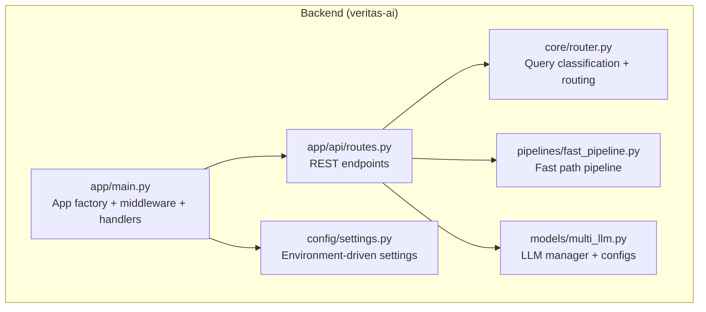
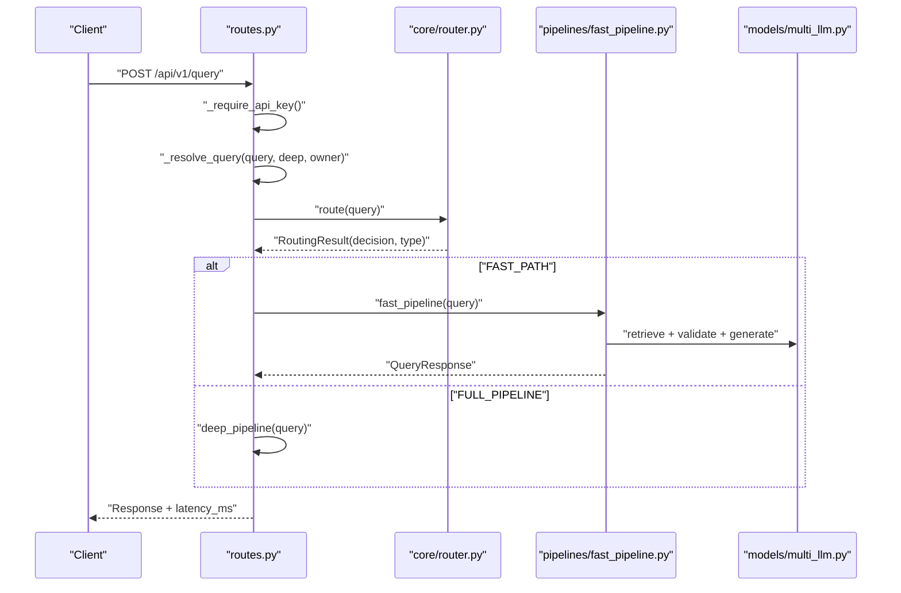
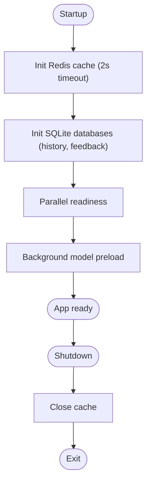
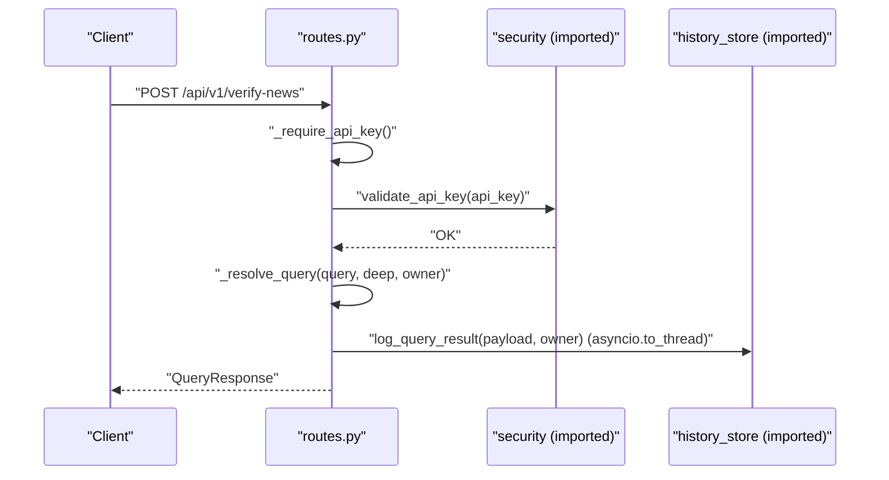
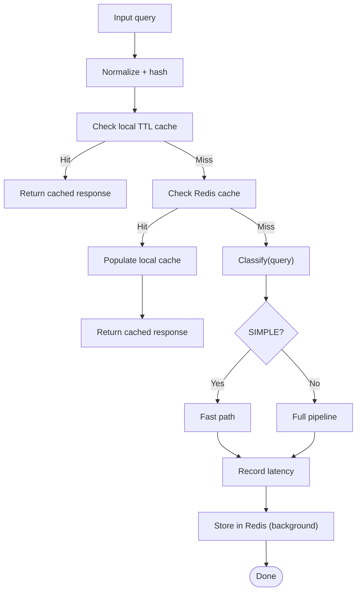
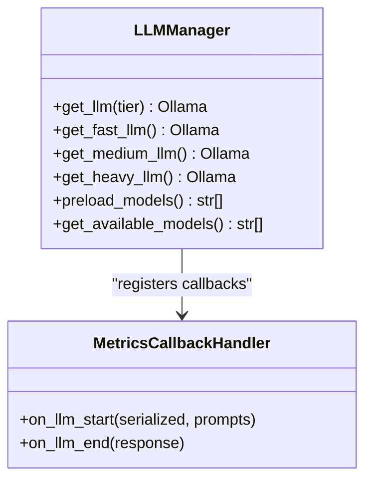
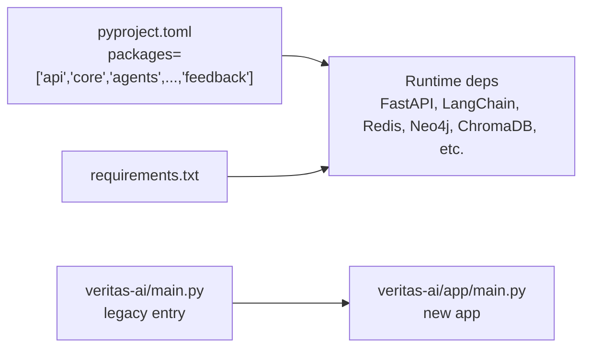

# Coding Standards & Guidelines

<cite>
**Referenced Files in This Document**
- [README.md](file://README.md)
- [veritas-ai/README.md](file://veritas-ai/README.md)
- [pyproject.toml](file://pyproject.toml)
- [veritas-ai/requirements.txt](file://veritas-ai/requirements.txt)
- [veritas-ai/main.py](file://veritas-ai/main.py)
- [veritas-ai/app/main.py](file://veritas-ai/app/main.py)
- [veritas-ai/config/settings.py](file://veritas-ai/config/settings.py)
- [veritas-ai/app/api/routes.py](file://veritas-ai/app/api/routes.py)
- [veritas-ai/core/router.py](file://veritas-ai/core/router.py)
- [veritas-ai/models/multi_llm.py](file://veritas-ai/models/multi_llm.py)
- [veritas-ai/pipelines/fast_pipeline.py](file://veritas-ai/pipelines/fast_pipeline.py)
- [veritas-ai/tools/base_tools.py](file://veritas-ai/tools/base_tools.py)
- [.github/workflows/ci.yml](file://.github/workflows/ci.yml)
- [veritas-ai/.github/workflows/main.yml](file://veritas-ai/.github/workflows/main.yml)
</cite>

## Table of Contents
1. [Introduction](#introduction)
2. [Project Structure](#project-structure)
3. [Core Components](#core-components)
4. [Architecture Overview](#architecture-overview)
5. [Detailed Component Analysis](#detailed-component-analysis)
6. [Dependency Analysis](#dependency-analysis)
7. [Performance Considerations](#performance-considerations)
8. [Troubleshooting Guide](#troubleshooting-guide)
9. [Conclusion](#conclusion)
10. [Appendices](#appendices)

## Introduction
This document defines the coding standards and development guidelines for Veritas AI. It consolidates Python style expectations, PEP 8 alignment, project-specific conventions, linting and formatting tooling, project structure, naming patterns, code review and PR requirements, documentation standards, error handling and logging, performance and security practices, and IDE/tooling recommendations. The goal is to maintain consistent, readable, and maintainable code across the backend and related components.

## Project Structure
The repository follows a modular structure with a clear separation between the legacy entry point and the new clean application module. The backend is organized into packages for API, core services, pipelines, models, tools, memory, feedback, and configuration. The frontend and extension are separate for UI and browser integration.

Key characteristics:
- Legacy entry point re-exports the new clean module for backward compatibility.
- New application module centralizes FastAPI app creation, middleware, exception handlers, and router mounting.
- Configuration is centralized via Pydantic settings with environment variable support.
- Pipelines and routers encapsulate routing logic and execution paths.
- Tools and agents are pluggable abstractions for data collection and validation.

**Diagram sources**
- [veritas-ai/app/main.py:106-208](file://veritas-ai/app/main.py#L106-L208)
- [veritas-ai/app/api/routes.py:18-251](file://veritas-ai/app/api/routes.py#L18-L251)
- [veritas-ai/core/router.py:83-182](file://veritas-ai/core/router.py#L83-L182)
- [veritas-ai/pipelines/fast_pipeline.py:8-22](file://veritas-ai/pipelines/fast_pipeline.py#L8-L22)
- [veritas-ai/models/multi_llm.py:81-143](file://veritas-ai/models/multi_llm.py#L81-L143)
- [veritas-ai/config/settings.py:13-83](file://veritas-ai/config/settings.py#L13-L83)

**Section sources**
- [veritas-ai/main.py:1-141](file://veritas-ai/main.py#L1-L141)
- [veritas-ai/app/main.py:106-208](file://veritas-ai/app/main.py#L106-L208)
- [pyproject.toml:19-22](file://pyproject.toml#L19-L22)

## Core Components
- Application lifecycle and startup/shutdown:
  - Asynchronous lifespan manages service initialization and cleanup.
  - Parallel initialization of cache and databases for fast startup.
  - Background model preloading avoids blocking the server start.
- Middleware and error handling:
  - Global CORS configuration from settings.
  - Timeout middleware with structured error responses.
  - Catch-all exception handler returning standardized errors.
- API routing and security:
  - API key extraction and validation helpers.
  - Owner resolution with fallback to public context.
  - Caching and non-blocking history logging.
- Configuration:
  - Centralized settings with CSV parsing and defaults.
  - Environment variables for all runtime parameters.
- Query routing:
  - Regex-based classifier and TTL cache for routing decisions.
  - Unified route-and-execute abstraction for fast vs full pipelines.
- LLM management:
  - Singleton LLM manager with configurable tiers and SQLite caching.
  - Metrics callback for latency and token usage.

**Section sources**
- [veritas-ai/app/main.py:33-102](file://veritas-ai/app/main.py#L33-L102)
- [veritas-ai/app/main.py:127-167](file://veritas-ai/app/main.py#L127-L167)
- [veritas-ai/app/api/routes.py:23-82](file://veritas-ai/app/api/routes.py#L23-L82)
- [veritas-ai/config/settings.py:7-83](file://veritas-ai/config/settings.py#L7-L83)
- [veritas-ai/core/router.py:51-182](file://veritas-ai/core/router.py#L51-L182)
- [veritas-ai/models/multi_llm.py:81-143](file://veritas-ai/models/multi_llm.py#L81-L143)

## Architecture Overview
The backend uses an event-driven, asynchronous FastAPI application with layered services:
- Entry point delegates to the new app module.
- Routes handle authentication, query resolution, and streaming authorization.
- Router decides between fast-path and full pipeline based on query classification.
- LLM manager provides model instances with metrics and caching.
- Configuration drives all runtime behavior.

**Diagram sources**
- [veritas-ai/app/api/routes.py:100-129](file://veritas-ai/app/api/routes.py#L100-L129)
- [veritas-ai/core/router.py:99-136](file://veritas-ai/core/router.py#L99-L136)
- [veritas-ai/pipelines/fast_pipeline.py:8-22](file://veritas-ai/pipelines/fast_pipeline.py#L8-L22)
- [veritas-ai/models/multi_llm.py:111-121](file://veritas-ai/models/multi_llm.py#L111-L121)

## Detailed Component Analysis

### Application Lifecycle and Startup
- Startup:
  - Parallel initialization of cache and databases.
  - Background model preload to avoid cold-start latency.
- Shutdown:
  - Cancel background tasks, close cache, and gracefully terminate.

**Diagram sources**
- [veritas-ai/app/main.py:33-102](file://veritas-ai/app/main.py#L33-L102)

**Section sources**
- [veritas-ai/app/main.py:33-102](file://veritas-ai/app/main.py#L33-L102)

### API Routing and Security
- Authentication:
  - API key required for protected endpoints.
  - Owner resolution falls back to public context.
- Query resolution:
  - Caching with non-blocking history logging.
  - Latency measurement included in response.
- Streaming:
  - Authorization URL generation with session token.

**Diagram sources**
- [veritas-ai/app/api/routes.py:114-129](file://veritas-ai/app/api/routes.py#L114-L129)
- [veritas-ai/app/api/routes.py:23-42](file://veritas-ai/app/api/routes.py#L23-L42)
- [veritas-ai/app/api/routes.py:72-81](file://veritas-ai/app/api/routes.py#L72-L81)

**Section sources**
- [veritas-ai/app/api/routes.py:23-82](file://veritas-ai/app/api/routes.py#L23-L82)
- [veritas-ai/app/api/routes.py:114-129](file://veritas-ai/app/api/routes.py#L114-L129)

### Query Routing and Classification
- Classifier uses regex patterns and trigger words to categorize queries.
- Router caches results locally and in Redis for fast responses.
- Unified route-and-execute returns both response and routing metadata.

**Diagram sources**
- [veritas-ai/core/router.py:99-136](file://veritas-ai/core/router.py#L99-L136)
- [veritas-ai/core/router.py:153-182](file://veritas-ai/core/router.py#L153-L182)

**Section sources**
- [veritas-ai/core/router.py:51-182](file://veritas-ai/core/router.py#L51-L182)

### LLM Management and Metrics
- Singleton LLM manager with configurable tiers and timeouts.
- SQLite-based LLM cache for reduced inference cost.
- Metrics callback captures latency and token usage for observability.

**Diagram sources**
- [veritas-ai/models/multi_llm.py:81-143](file://veritas-ai/models/multi_llm.py#L81-L143)

**Section sources**
- [veritas-ai/models/multi_llm.py:81-143](file://veritas-ai/models/multi_llm.py#L81-L143)

### Tool Abstractions
- Tools are decorated with a LangChain decorator for agent integration.
- Placeholders indicate future integration with real APIs and scraping.

**Section sources**
- [veritas-ai/tools/base_tools.py:1-10](file://veritas-ai/tools/base_tools.py#L1-L10)

## Dependency Analysis
- Package layout:
  - setuptools package-dir and packages define the backend distribution structure.
- Runtime dependencies:
  - FastAPI, Uvicorn, Pydantic, LangChain ecosystem, Redis, Neo4j, ChromaDB, Playwright, and others.
- Version constraints:
  - Minimum Python version is 3.9.
- Legacy entry point:
  - Re-exports the new app module for backward compatibility.

**Diagram sources**
- [pyproject.toml:19-22](file://pyproject.toml#L19-L22)
- [veritas-ai/requirements.txt:1-42](file://veritas-ai/requirements.txt#L1-L42)
- [veritas-ai/main.py:8-11](file://veritas-ai/main.py#L8-L11)

**Section sources**
- [pyproject.toml:1-23](file://pyproject.toml#L1-L23)
- [veritas-ai/requirements.txt:1-42](file://veritas-ai/requirements.txt#L1-L42)
- [veritas-ai/main.py:8-11](file://veritas-ai/main.py#L8-L11)

## Performance Considerations
- Startup and throughput:
  - Parallel initialization of cache and databases.
  - Background model preloading to reduce first-request latency.
  - Non-blocking history logging via threads.
- Query routing:
  - TTL cache and Redis-backed cache for instant responses.
  - Lightweight regex classifier for fast-path routing.
- LLM efficiency:
  - SQLite-based LLM cache to reduce repeated calls.
  - Tiered models with appropriate timeouts.
- Observability:
  - Metrics callback records latency and tokens for monitoring.

**Section sources**
- [veritas-ai/app/main.py:76-91](file://veritas-ai/app/main.py#L76-L91)
- [veritas-ai/core/router.py:90-119](file://veritas-ai/core/router.py#L90-L119)
- [veritas-ai/models/multi_llm.py:127-143](file://veritas-ai/models/multi_llm.py#L127-L143)

## Troubleshooting Guide
- Logging:
  - Structured logging with level and name formatting.
  - Global exception handler logs unhandled errors with stack traces.
- Health checks:
  - Health endpoint reports cache availability and hit rate.
- Timeouts:
  - Timeout middleware returns 504 on exceeded limits.
- Rate limiting:
  - Optional slowapi-based rate limiting with 429 responses.

**Section sources**
- [veritas-ai/app/main.py:24-28](file://veritas-ai/app/main.py#L24-L28)
- [veritas-ai/app/main.py:156-167](file://veritas-ai/app/main.py#L156-L167)
- [veritas-ai/app/api/routes.py:86-97](file://veritas-ai/app/api/routes.py#L86-L97)
- [veritas-ai/app/main.py:189-197](file://veritas-ai/app/main.py#L189-L197)

## Conclusion
These standards and guidelines formalize the existing patterns in the Veritas AI codebase. They emphasize asynchronous design, robust error handling, performance-first routing, and environment-driven configuration. Following these practices will keep the system reliable, observable, and maintainable.

## Appendices

### Python Coding Standards and PEP 8 Alignment
- Naming:
  - Modules and packages: lowercase, underscore-separated.
  - Classes: PascalCase.
  - Functions and variables: snake_case.
  - Constants: UPPER_CASE.
- Imports:
  - Standard library first, then third-party, then local.
  - Avoid wildcard imports.
- Docstrings:
  - Module-level docstrings present.
  - Functions and classes documented with purpose and behavior.
- Type hints:
  - Prefer explicit types for parameters and return values.
- Line length:
  - Keep lines under 100 characters for readability.
- Whitespace:
  - Consistent indentation (spaces), no trailing whitespace.
- Exceptions:
  - Raise specific exceptions; catch narrow exceptions; log errors appropriately.

[No sources needed since this section provides general guidance]

### Linting and Formatting Tools Configuration
- Ruff:
  - Use Ruff for linting and autofix.
  - Configure rules to enforce PEP 8 and project-specific rules.
- Black:
  - Use Black for code formatting.
- Flake8:
  - Use Flake8 for additional style checks if desired; otherwise rely on Ruff.
- Pre-commit:
  - Integrate Ruff and Black in pre-commit hooks to enforce on save.

[No sources needed since this section provides general guidance]

### Project Structure Conventions
- Package organization:
  - Feature-based grouping: api, core, pipelines, models, tools, memory, feedback, config.
  - Clear boundaries between layers.
- Entry points:
  - Legacy entry point re-exports the new app module.
- Configuration:
  - Centralized settings via Pydantic settings with environment variables.
- Tests:
  - Place tests alongside source code under tests/.
  - Use pytest with asyncio support.

**Section sources**
- [pyproject.toml:19-22](file://pyproject.toml#L19-L22)
- [veritas-ai/main.py:8-11](file://veritas-ai/main.py#L8-L11)
- [veritas-ai/config/settings.py:13-83](file://veritas-ai/config/settings.py#L13-L83)

### Naming Patterns and Module Organization Principles
- Modules:
  - Use descriptive names; avoid abbreviations unless widely understood.
- Classes:
  - Use nouns; reflect domain concepts.
- Functions:
  - Use verbs; describe actions.
- Variables:
  - Use short, meaningful names; avoid single-letter except loop indices.
- Packages:
  - Keep packages shallow; group related functionality.

[No sources needed since this section provides general guidance]

### Code Review Guidelines
- Scope:
  - Focus on correctness, performance, security, maintainability, and adherence to standards.
- Checklist:
  - PEP 8 compliance and style consistency.
  - Proper error handling and logging.
  - Type hints and docstrings.
  - Test coverage for new logic.
  - No hardcoded secrets; use settings.
- Approval:
  - Require at least one reviewer’s approval before merging.

[No sources needed since this section provides general guidance]

### Commit Message Standards and Pull Request Requirements
- Commit messages:
  - Separate subject from body with a blank line.
  - Limit subject to 50 characters.
  - Use imperative mood; capitalize first word.
  - Reference issues and PRs where applicable.
- PR requirements:
  - Link to related issue.
  - Summarize changes and rationale.
  - Include testing steps and performance impact notes.

[No sources needed since this section provides general guidance]

### Documentation Standards, Docstring Formats, and Inline Comment Practices
- Docstrings:
  - Use Google-style or NumPy-style docstrings consistently.
  - Include Args, Returns, Raises, and Examples where helpful.
- Inline comments:
  - Explain “why,” not “what.”
  - Keep comments concise and relevant.
- API docs:
  - Document endpoints, parameters, and responses in route files.

**Section sources**
- [veritas-ai/app/api/routes.py:100-129](file://veritas-ai/app/api/routes.py#L100-L129)

### Error Handling Patterns, Logging Standards, and Debugging Approaches
- Error handling:
  - Use structured exception handlers; return consistent error payloads.
  - Validate inputs early; fail fast with clear messages.
- Logging:
  - Use module-level loggers; include contextual info.
  - Log at appropriate levels (error, warning, info).
- Debugging:
  - Add metrics and observability hooks.
  - Use health endpoints and metrics for diagnostics.

**Section sources**
- [veritas-ai/app/main.py:156-167](file://veritas-ai/app/main.py#L156-L167)
- [veritas-ai/app/main.py:24-28](file://veritas-ai/app/main.py#L24-L28)

### Performance Coding Practices, Memory Management Considerations, and Security Coding Guidelines
- Performance:
  - Prefer async I/O; minimize blocking operations.
  - Use caching (local and Redis) aggressively.
  - Batch and parallelize where safe.
- Memory:
  - Avoid large object retention; reuse instances (e.g., LLMManager singleton).
  - Use generators and streams for large datasets.
- Security:
  - Enforce API key validation for protected endpoints.
  - Sanitize inputs; avoid eval/exec.
  - Use environment variables for secrets; never hardcode.

**Section sources**
- [veritas-ai/app/api/routes.py:23-42](file://veritas-ai/app/api/routes.py#L23-L42)
- [veritas-ai/models/multi_llm.py:81-143](file://veritas-ai/models/multi_llm.py#L81-L143)

### Examples of Well-Structured Code and Common Anti-Patterns
- Well-structured:
  - Clear separation of concerns; small, focused functions.
  - Async-friendly designs with proper timeouts.
  - Centralized configuration and logging.
- Anti-patterns to avoid:
  - Blocking I/O in request handlers.
  - Hardcoded values; always use settings.
  - Overuse of global state; prefer dependency injection.
  - Silent failures; always log and propagate meaningful errors.

[No sources needed since this section provides general guidance]

### Refactoring Guidelines
- Decompose large functions into smaller, testable units.
- Replace magic numbers with named constants.
- Introduce interfaces for pluggable components (e.g., tools).
- Add metrics and logging incrementally during refactors.

[No sources needed since this section provides general guidance]

### IDE Configuration Recommendations and Development Tooling Setup
- Editor:
  - VS Code or similar with Python extensions.
  - Enable Black and Ruff integrations.
- Virtual environment:
  - Use Python 3.9+ and manage dependencies via requirements.txt and pyproject.toml.
- Pre-commit:
  - Install and configure hooks for Ruff and Black.
- Testing:
  - Run pytest with asyncio support; include coverage if desired.
- CI/CD:
  - Use GitHub Actions workflows to automate linting, formatting, and tests.

**Section sources**
- [README.md:9-12](file://README.md#L9-L12)
- [.github/workflows/ci.yml](file://.github/workflows/ci.yml)
- [veritas-ai/.github/workflows/main.yml](file://veritas-ai/.github/workflows/main.yml)