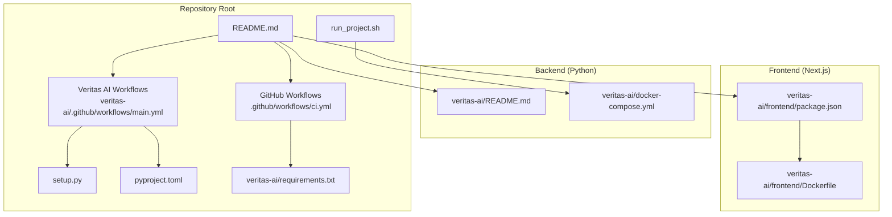
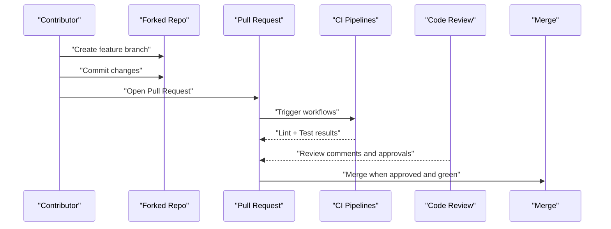
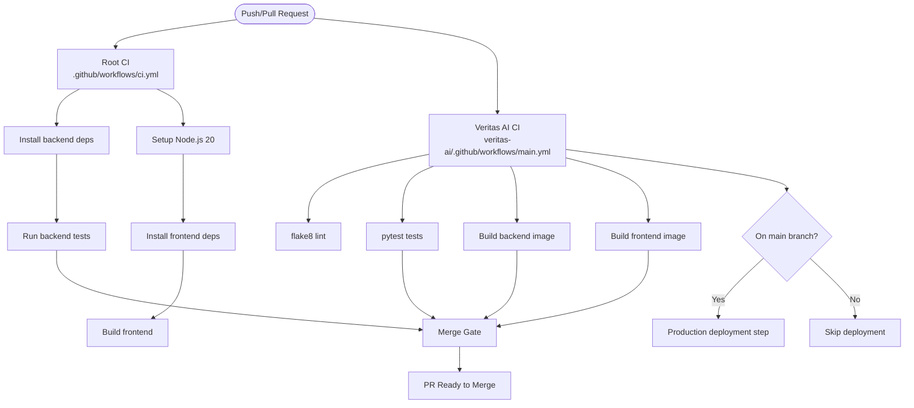
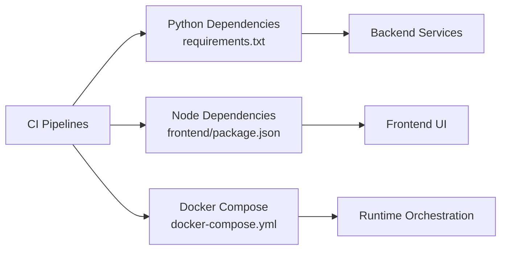

# Contribution Workflow

<cite>
**Referenced Files in This Document**
- [README.md](file://README.md)
- [.github/workflows/ci.yml](file://.github/workflows/ci.yml)
- [veritas-ai/.github/workflows/main.yml](file://veritas-ai/.github/workflows/main.yml)
- [veritas-ai/README.md](file://veritas-ai/README.md)
- [veritas-ai/docker-compose.yml](file://veritas-ai/docker-compose.yml)
- [run_project.sh](file://run_project.sh)
- [setup.py](file://setup.py)
- [pyproject.toml](file://pyproject.toml)
- [veritas-ai/requirements.txt](file://veritas-ai/requirements.txt)
- [veritas-ai/frontend/package.json](file://veritas-ai/frontend/package.json)
- [veritas-ai/frontend/Dockerfile](file://veritas-ai/frontend/Dockerfile)
- [.agents/skills/caveman-review/SKILL.md](file://.agents/skills/caveman-review/SKILL.md)
- [veritas-ai/tests/test_consensus.py](file://veritas-ai/tests/test_consensus.py)
</cite>

## Table of Contents
1. [Introduction](#introduction)
2. [Project Structure](#project-structure)
3. [Core Components](#core-components)
4. [Architecture Overview](#architecture-overview)
5. [Detailed Component Analysis](#detailed-component-analysis)
6. [Dependency Analysis](#dependency-analysis)
7. [Performance Considerations](#performance-considerations)
8. [Troubleshooting Guide](#troubleshooting-guide)
9. [Conclusion](#conclusion)
10. [Appendices](#appendices)

## Introduction
This document defines the complete contribution workflow for Veritas AI, covering the end-to-end development lifecycle from issue identification to merged pull requests. It consolidates the repository’s existing guidance and CI/CD configuration into a unified set of processes, standards, and quality gates. Contributors will follow a fork-and-pull request model, adhere to branch naming conventions, and meet automated testing and linting requirements enforced by GitHub Actions. The document also outlines code review expectations, release/versioning strategy, and operational procedures for local development and deployment.

## Project Structure
Veritas AI is organized as a monorepo with a clear separation between backend services, frontend UI, shared skills, and CI/CD workflows. The backend is a Python FastAPI application with supporting libraries, pipelines, and tests. The frontend is a Next.js application packaged for production. Docker Compose orchestrates the backend API, frontend UI, and supporting services (Neo4j, ChromaDB, Redis, Ollama). GitHub Actions define CI and CD pipelines for linting, testing, building, and optional deployment.

**Diagram sources**
- [README.md:1-82](file://README.md#L1-L82)
- [.github/workflows/ci.yml:1-6](file://.github/workflows/ci.yml#L1-L6)
- [veritas-ai/.github/workflows/main.yml:1-59](file://veritas-ai/.github/workflows/main.yml#L1-L59)
- [run_project.sh:1-41](file://run_project.sh#L1-L41)
- [setup.py:1-9](file://setup.py#L1-L9)
- [pyproject.toml:1-23](file://pyproject.toml#L1-L23)
- [veritas-ai/requirements.txt:1-42](file://veritas-ai/requirements.txt#L1-L42)
- [veritas-ai/README.md:1-157](file://veritas-ai/README.md#L1-L157)
- [veritas-ai/docker-compose.yml:1-160](file://veritas-ai/docker-compose.yml#L1-L160)
- [veritas-ai/frontend/package.json:1-27](file://veritas-ai/frontend/package.json#L1-L27)
- [veritas-ai/frontend/Dockerfile:1-54](file://veritas-ai/frontend/Dockerfile#L1-L54)

**Section sources**
- [README.md:1-82](file://README.md#L1-L82)
- [veritas-ai/README.md:1-157](file://veritas-ai/README.md#L1-L157)

## Core Components
- Backend (Python): FastAPI application with modular components (API, core, agents, pipelines, models, tools, memory, config, feedback). Tests reside under veritas-ai/tests and are executed via pytest.
- Frontend (Next.js): React-based dashboard built with TypeScript and Tailwind CSS, packaged for production via a multi-stage Dockerfile.
- CI/CD: Two primary workflows:
  - Root CI: Installs backend dependencies, runs backend tests, sets up Node.js, installs frontend dependencies, and builds the frontend.
  - Veritas AI workflow: Lints Python code, runs tests, builds backend and frontend Docker images, and optionally triggers production deployment steps.
- Local Development: Docker Compose orchestrates all services; a convenience script automates startup.

Key references:
- Backend tests and test structure: [veritas-ai/tests/test_consensus.py:1-21](file://veritas-ai/tests/test_consensus.py#L1-L21)
- Backend dependencies: [veritas-ai/requirements.txt:1-42](file://veritas-ai/requirements.txt#L1-L42)
- Frontend build and runtime: [veritas-ai/frontend/package.json:1-27](file://veritas-ai/frontend/package.json#L1-L27), [veritas-ai/frontend/Dockerfile:1-54](file://veritas-ai/frontend/Dockerfile#L1-L54)
- CI pipelines: [.github/workflows/ci.yml:1-6](file://.github/workflows/ci.yml#L1-L6), [veritas-ai/.github/workflows/main.yml:1-59](file://veritas-ai/.github/workflows/main.yml#L1-L59)
- Local run script: [run_project.sh:1-41](file://run_project.sh#L1-L41)
- Docker Compose: [veritas-ai/docker-compose.yml:1-160](file://veritas-ai/docker-compose.yml#L1-L160)

**Section sources**
- [veritas-ai/tests/test_consensus.py:1-21](file://veritas-ai/tests/test_consensus.py#L1-L21)
- [veritas-ai/requirements.txt:1-42](file://veritas-ai/requirements.txt#L1-L42)
- [veritas-ai/frontend/package.json:1-27](file://veritas-ai/frontend/package.json#L1-L27)
- [veritas-ai/frontend/Dockerfile:1-54](file://veritas-ai/frontend/Dockerfile#L1-L54)
- [.github/workflows/ci.yml:1-6](file://.github/workflows/ci.yml#L1-L6)
- [veritas-ai/.github/workflows/main.yml:1-59](file://veritas-ai/.github/workflows/main.yml#L1-L59)
- [run_project.sh:1-41](file://run_project.sh#L1-L41)
- [veritas-ai/docker-compose.yml:1-160](file://veritas-ai/docker-compose.yml#L1-L160)

## Architecture Overview
The contribution workflow integrates GitHub-based collaboration with automated quality gates and deployment readiness checks. Contributors fork the repository, create feature branches, submit pull requests, and undergo automated linting, testing, and packaging. Maintainers review contributions and approve merges when all quality gates pass.

[No sources needed since this diagram shows conceptual workflow, not actual code structure]

## Detailed Component Analysis

### GitHub Workflow: Fork-and-Pull Request
- Fork the repository and create a feature branch named according to the branch naming convention.
- Commit changes and push to the branch.
- Open a Pull Request targeting the default branch.
- Ensure CI passes and address review feedback before merging.

References:
- Contribution guidance: [README.md:71-78](file://README.md#L71-L78)

**Section sources**
- [README.md:71-78](file://README.md#L71-L78)

### Branch Naming Conventions
- Use a clear, imperative naming scheme for feature branches to improve traceability and categorization.
- Recommended pattern: feature/<brief-description>, fix/<issue>, chore/<task>.
- Align branch names with the scope of the change to streamline review and automated labeling.

[No sources needed since this section provides general guidance]

### Commit Message Standards
- Keep messages concise, descriptive, and in present tense.
- Reference related issues and PRs for traceability.
- Group related changes into meaningful commits; avoid “WIP” commits in final history.

[No sources needed since this section provides general guidance]

### CI/CD Pipeline Integration
- Root CI pipeline:
  - Triggers on pushes to main/develop and pull requests to main.
  - Sets up Python 3.11 and installs backend dependencies.
  - Runs backend tests with pytest.
  - Sets up Node.js 20, installs frontend dependencies, and builds the frontend.
  - Includes a note indicating manual Docker build step for containerization.
- Veritas AI CI/CD pipeline:
  - Triggers on pushes and pull requests to main.
  - Lints Python code with flake8 and runs tests with pytest.
  - Builds backend and frontend Docker images tagged with the commit SHA.
  - Conditional deployment step executes only on main branch.

**Diagram sources**
- [.github/workflows/ci.yml:1-6](file://.github/workflows/ci.yml#L1-L6)
- [veritas-ai/.github/workflows/main.yml:1-59](file://veritas-ai/.github/workflows/main.yml#L1-L59)

**Section sources**
- [.github/workflows/ci.yml:1-6](file://.github/workflows/ci.yml#L1-L6)
- [veritas-ai/.github/workflows/main.yml:1-59](file://veritas-ai/.github/workflows/main.yml#L1-L59)

### Automated Testing Requirements
- Backend tests are executed via pytest and are part of both CI pipelines.
- The test suite includes targeted unit tests for core logic (e.g., consensus evaluation).
- Frontend dependencies are installed and the build is validated in the root CI pipeline.

References:
- Backend test example: [veritas-ai/tests/test_consensus.py:1-21](file://veritas-ai/tests/test_consensus.py#L1-L21)
- Backend dependencies: [veritas-ai/requirements.txt:1-42](file://veritas-ai/requirements.txt#L1-L42)
- Root CI test execution: [.github/workflows/ci.yml:1-6](file://.github/workflows/ci.yml#L1-L6)
- Veritas AI CI test execution: [veritas-ai/.github/workflows/main.yml:29-30](file://veritas-ai/.github/workflows/main.yml#L29-L30)

**Section sources**
- [veritas-ai/tests/test_consensus.py:1-21](file://veritas-ai/tests/test_consensus.py#L1-L21)
- [veritas-ai/requirements.txt:1-42](file://veritas-ai/requirements.txt#L1-L42)
- [.github/workflows/ci.yml:1-6](file://.github/workflows/ci.yml#L1-L6)
- [veritas-ai/.github/workflows/main.yml:29-30](file://veritas-ai/.github/workflows/main.yml#L29-L30)

### Quality Gates
- Linting: flake8 with line length and selected ignores applied in the Veritas AI CI pipeline.
- Testing: pytest runs with verbose output and short traceback format.
- Packaging: Docker images built for backend and frontend for deployment readiness.
- Deployment: Optional production deployment step executes only on the main branch.

References:
- Linting: [veritas-ai/.github/workflows/main.yml:26-27](file://veritas-ai/.github/workflows/main.yml#L26-L27)
- Testing: [veritas-ai/.github/workflows/main.yml:29-30](file://veritas-ai/.github/workflows/main.yml#L29-L30)
- Docker builds: [veritas-ai/.github/workflows/main.yml:38-48](file://veritas-ai/.github/workflows/main.yml#L38-L48)
- Deployment gate: [veritas-ai/.github/workflows/main.yml:50-59](file://veritas-ai/.github/workflows/main.yml#L50-L59)

**Section sources**
- [veritas-ai/.github/workflows/main.yml:26-27](file://veritas-ai/.github/workflows/main.yml#L26-L27)
- [veritas-ai/.github/workflows/main.yml:29-30](file://veritas-ai/.github/workflows/main.yml#L29-L30)
- [veritas-ai/.github/workflows/main.yml:38-48](file://veritas-ai/.github/workflows/main.yml#L38-L48)
- [veritas-ai/.github/workflows/main.yml:50-59](file://veritas-ai/.github/workflows/main.yml#L50-L59)

### Code Review Process and Approval Criteria
- Review style: Use concise, actionable, one-line findings with severity prefixes and exact locations.
- Severity prefixes:
  - 🔴 bug: broken behavior, will cause incident
  - 🟡 risk: works but fragile (race conditions, missing null checks, swallowed errors)
  - 🔵 nit: style, naming, micro-optimizations (author can ignore)
  - ❓ q: genuine question, not a suggestion
- Reviewer responsibilities:
  - Provide precise fixes and avoid vague suggestions.
  - Avoid redundant phrases (“I noticed that…”, “You might want to consider…”).
  - Clarify security or architectural concerns in full paragraphs when needed.
- Approval criteria:
  - All CI checks must pass.
  - Reviewer approval required before merging.
  - Address all review comments and re-run tests if necessary.

References:
- Review rules and format: [.agents/skills/caveman-review/SKILL.md:1-55](file://.agents/skills/caveman-review/SKILL.md#L1-L55)

**Section sources**
- [.agents/skills/caveman-review/SKILL.md:1-55](file://.agents/skills/caveman-review/SKILL.md#L1-L55)

### Release Process, Versioning Strategy, and Changelog Maintenance
- Versioning:
  - Python package version defined in setup.py.
  - Project metadata version defined in pyproject.toml.
- Release cadence:
  - Triggered by pushing to the main branch in the Veritas AI CI/CD pipeline.
  - Production deployment step is included for demonstration; adjust as needed for your environment.
- Changelog maintenance:
  - Maintain a changelog file to track changes per release.
  - Include breaking changes, new features, bug fixes, and deprecations.

References:
- Python package version: [setup.py:1-9](file://setup.py#L1-L9)
- Project metadata version: [pyproject.toml:1-23](file://pyproject.toml#L1-L23)
- Deployment step: [veritas-ai/.github/workflows/main.yml:50-59](file://veritas-ai/.github/workflows/main.yml#L50-L59)

**Section sources**
- [setup.py:1-9](file://setup.py#L1-L9)
- [pyproject.toml:1-23](file://pyproject.toml#L1-L23)
- [veritas-ai/.github/workflows/main.yml:50-59](file://veritas-ai/.github/workflows/main.yml#L50-L59)

### Issue Reporting, Feature Requests, and Bug Reports
- Report issues and request features by opening a GitHub issue.
- Provide sufficient context, reproduction steps (for bugs), and desired outcomes (for feature requests).
- Use the repository’s contribution guidance as a starting point.

References:
- Contribution guidance: [README.md:71-78](file://README.md#L71-L78)

**Section sources**
- [README.md:71-78](file://README.md#L71-L78)

### Development Lifecycle: From Setup to Deployment
- Initial setup:
  - Use Docker Compose to build and run all services.
  - Alternatively, run backend and frontend manually as described in the backend README.
- Local execution:
  - A convenience script automates Docker Compose startup and prints service endpoints.
- Testing:
  - Run backend tests via pytest as outlined in the root CI pipeline.
- Review and merge:
  - Ensure CI passes and reviews are approved.
- Deployment:
  - The Veritas AI CI/CD pipeline builds Docker images and includes a conditional deployment step on main.

References:
- Docker Compose orchestration: [veritas-ai/docker-compose.yml:1-160](file://veritas-ai/docker-compose.yml#L1-L160)
- Local run script: [run_project.sh:1-41](file://run_project.sh#L1-L41)
- Backend README quick start: [veritas-ai/README.md:63-86](file://veritas-ai/README.md#L63-L86)
- Root CI test execution: [.github/workflows/ci.yml:1-6](file://.github/workflows/ci.yml#L1-L6)
- Veritas AI CI/CD deployment: [veritas-ai/.github/workflows/main.yml:50-59](file://veritas-ai/.github/workflows/main.yml#L50-L59)

**Section sources**
- [veritas-ai/docker-compose.yml:1-160](file://veritas-ai/docker-compose.yml#L1-L160)
- [run_project.sh:1-41](file://run_project.sh#L1-L41)
- [veritas-ai/README.md:63-86](file://veritas-ai/README.md#L63-L86)
- [.github/workflows/ci.yml:1-6](file://.github/workflows/ci.yml#L1-L6)
- [veritas-ai/.github/workflows/main.yml:50-59](file://veritas-ai/.github/workflows/main.yml#L50-L59)

### Community Guidelines, Communication Channels, and Maintainer Responsibilities
- Community guidelines:
  - Follow the code review format and severity prefixes for constructive feedback.
  - Keep feedback actionable and avoid unnecessary elaboration.
- Communication channels:
  - Use GitHub Issues and Pull Requests for collaboration.
- Maintainer responsibilities:
  - Approve PRs only after CI passes and review criteria are met.
  - Ensure release and deployment steps are aligned with organizational policies.

References:
- Review format and severity: [.agents/skills/caveman-review/SKILL.md:12-55](file://.agents/skills/caveman-review/SKILL.md#L12-L55)

**Section sources**
- [.agents/skills/caveman-review/SKILL.md:12-55](file://.agents/skills/caveman-review/SKILL.md#L12-L55)

### Examples of Successful Contributions and Common Pitfalls
- Successful contribution example:
  - A focused feature branch implementing a small, well-tested change with clear commit messages and passing CI.
- Common pitfalls to avoid:
  - Submitting large, unfocused PRs that are hard to review.
  - Skipping tests or linting.
  - Not addressing reviewer feedback promptly.
  - Forgetting to update versioning or release notes.

[No sources needed since this section provides general guidance]

### Escalation Procedures for Complex Issues
- If a PR becomes blocked by architectural disagreement or security concerns, escalate to maintainers for a full-disclosure discussion.
- Provide context, rationale, and references to support your position.

[No sources needed since this section provides general guidance]

## Dependency Analysis
The project’s dependencies span Python (FastAPI, CrewAI, LangChain, Redis, Neo4j, ChromaDB), Node.js (Next.js, React), and Docker-based orchestration. The CI pipelines reflect these dependencies and enforce consistent environments across contributors’ machines and runners.

**Diagram sources**
- [veritas-ai/requirements.txt:1-42](file://veritas-ai/requirements.txt#L1-L42)
- [veritas-ai/frontend/package.json:1-27](file://veritas-ai/frontend/package.json#L1-L27)
- [veritas-ai/docker-compose.yml:1-160](file://veritas-ai/docker-compose.yml#L1-L160)
- [.github/workflows/ci.yml:1-6](file://.github/workflows/ci.yml#L1-L6)
- [veritas-ai/.github/workflows/main.yml:1-59](file://veritas-ai/.github/workflows/main.yml#L1-L59)

**Section sources**
- [veritas-ai/requirements.txt:1-42](file://veritas-ai/requirements.txt#L1-L42)
- [veritas-ai/frontend/package.json:1-27](file://veritas-ai/frontend/package.json#L1-L27)
- [veritas-ai/docker-compose.yml:1-160](file://veritas-ai/docker-compose.yml#L1-L160)
- [.github/workflows/ci.yml:1-6](file://.github/workflows/ci.yml#L1-L6)
- [veritas-ai/.github/workflows/main.yml:1-59](file://veritas-ai/.github/workflows/main.yml#L1-L59)

## Performance Considerations
- Keep PRs scoped to reduce review time and CI overhead.
- Prefer incremental improvements to minimize test execution time.
- Use Docker Compose for consistent environments to avoid local performance discrepancies.

[No sources needed since this section provides general guidance]

## Troubleshooting Guide
- Docker Compose failures:
  - Verify Docker installation and permissions.
  - Use the convenience script to start services and inspect logs.
- Health checks:
  - Backend health endpoint and service health checks are defined in Docker Compose.
- Frontend build issues:
  - Confirm Node.js version and dependency installation steps in CI.

References:
- Convenience script: [run_project.sh:1-41](file://run_project.sh#L1-L41)
- Backend health check: [veritas-ai/docker-compose.yml:42-47](file://veritas-ai/docker-compose.yml#L42-L47)
- Frontend Dockerfile healthcheck: [veritas-ai/frontend/Dockerfile:50-51](file://veritas-ai/frontend/Dockerfile#L50-L51)

**Section sources**
- [run_project.sh:1-41](file://run_project.sh#L1-L41)
- [veritas-ai/docker-compose.yml:42-47](file://veritas-ai/docker-compose.yml#L42-L47)
- [veritas-ai/frontend/Dockerfile:50-51](file://veritas-ai/frontend/Dockerfile#L50-L51)

## Conclusion
This contribution workflow aligns repository practices with modern CI/CD standards. By following the fork-and-pull request process, adhering to branch naming and commit message standards, meeting automated testing and linting requirements, and applying the concise code review format, contributors can efficiently move changes from idea to production. Maintainers ensure quality through approvals and deployment gates, while versioning and changelog practices support transparent releases.

[No sources needed since this section summarizes without analyzing specific files]

## Appendices
- Quick Links:
  - Backend README quick start: [veritas-ai/README.md:63-86](file://veritas-ai/README.md#L63-L86)
  - Root CI pipeline: [.github/workflows/ci.yml:1-6](file://.github/workflows/ci.yml#L1-L6)
  - Veritas AI CI/CD pipeline: [veritas-ai/.github/workflows/main.yml:1-59](file://veritas-ai/.github/workflows/main.yml#L1-L59)
  - Frontend Dockerfile: [veritas-ai/frontend/Dockerfile:1-54](file://veritas-ai/frontend/Dockerfile#L1-L54)

[No sources needed since this section provides general guidance]