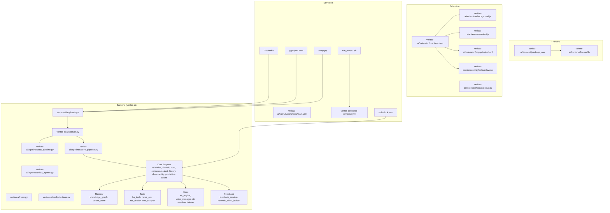
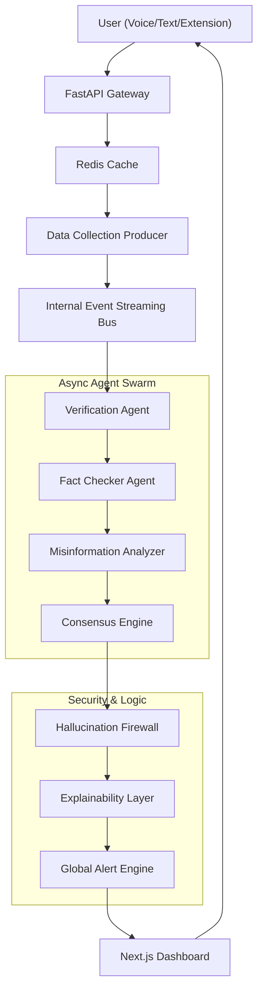
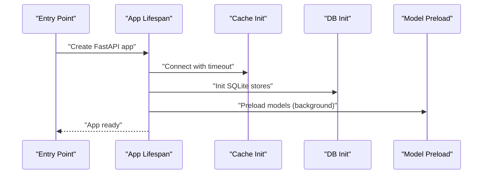
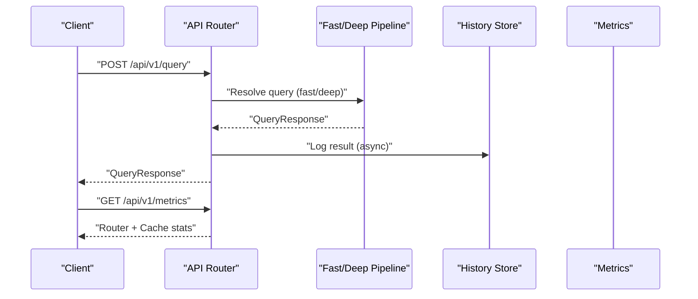
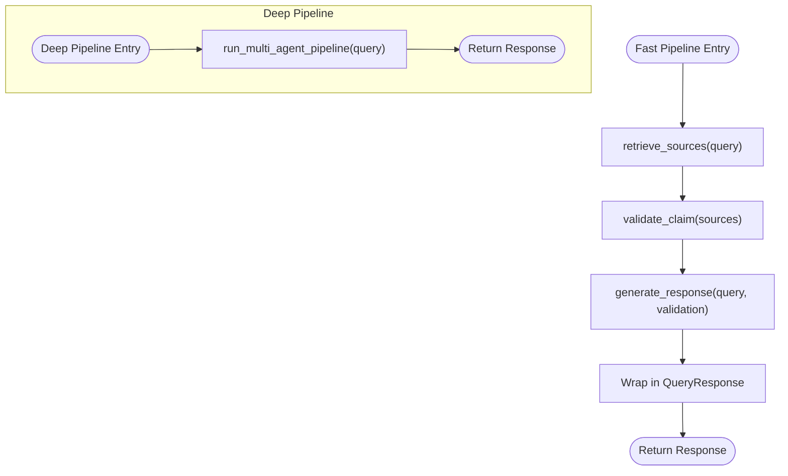
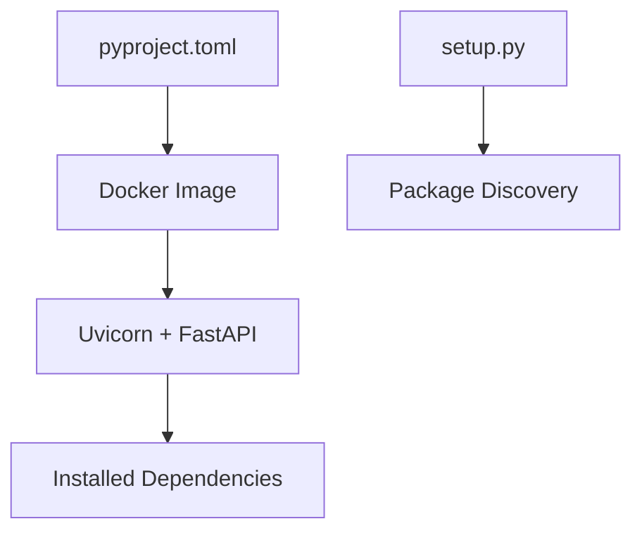

# Development Guide

<cite>
**Referenced Files in This Document**
- [README.md](file://README.md)
- [veritas-ai/README.md](file://veritas-ai/README.md)
- [run_project.sh](file://run_project.sh)
- [Dockerfile](file://Dockerfile)
- [pyproject.toml](file://pyproject.toml)
- [setup.py](file://setup.py)
- [skills-lock.json](file://skills-lock.json)
- [veritas-ai/main.py](file://veritas-ai/main.py)
- [veritas-ai/app/main.py](file://veritas-ai/app/main.py)
- [veritas-ai/config/settings.py](file://veritas-ai/config/settings.py)
- [veritas-ai/api/server.py](file://veritas-ai/api/server.py)
- [veritas-ai/pipelines/fast_pipeline.py](file://veritas-ai/pipelines/fast_pipeline.py)
- [veritas-ai/pipelines/deep_pipeline.py](file://veritas-ai/pipelines/deep_pipeline.py)
- [veritas-ai/agents/query_agent.py](file://veritas-ai/agents/query_agent.py)
- [veritas-ai/agents/veritas_agents.py](file://veritas-ai/agents/veritas_agents.py)
- [.github/workflows/ci.yml](file://.github/workflows/ci.yml)
- [veritas-ai/frontend/package.json](file://veritas-ai/frontend/package.json)
- [veritas-ai/frontend/Dockerfile](file://veritas-ai/frontend/Dockerfile)
- [veritas-ai/docker-compose.yml](file://veritas-ai/docker-compose.yml)
- [veritas-ai/extension/manifest.json](file://veritas-ai/extension/manifest.json)
- [veritas-ai/extension/background.js](file://veritas-ai/extension/background.js)
- [veritas-ai/extension/content.js](file://veritas-ai/extension/content.js)
- [veritas-ai/extension/popup/index.html](file://veritas-ai/extension/popup/index.html)
- [veritas-ai/extension/popup/popup.js](file://veritas-ai/extension/popup/popup.js)
- [veritas-ai/extension/styles/overlay.css](file://veritas-ai/extension/styles/overlay.css)
- [veritas-ai/memory/knowledge_graph.py](file://veritas-ai/memory/knowledge_graph.py)
- [veritas-ai/memory/vector_store.py](file://veritas-ai/memory/vector_store.py)
- [veritas-ai/tools/kg_tools.py](file://veritas-ai/tools/kg_tools.py)
- [veritas-ai/tools/news_api.py](file://veritas-ai/tools/news_api.py)
- [veritas-ai/tools/rss_reader.py](file://veritas-ai/tools/rss_reader.py)
- [veritas-ai/tools/web_scraper.py](file://veritas-ai/tools/web_scraper.py)
- [veritas-ai/models/schemas.py](file://veritas-ai/models/schemas.py)
- [veritas-ai/core/router.py](file://veritas-ai/core/router.py)
- [veritas-ai/core/security.py](file://veritas-ai/core/security.py)
- [veritas-ai/core/validation_engine.py](file://veritas-ai/core/validation_engine.py)
- [veritas-ai/core/firewall.py](file://veritas-ai/core/firewall.py)
- [veritas-ai/core/truth_engine.py](file://veritas-ai/core/truth_engine.py)
- [veritas-ai/core/consensus_engine.py](file://veritas-ai/core/consensus_engine.py)
- [veritas-ai/core/alert_engine.py](file://veritas-ai/core/alert_engine.py)
- [veritas-ai/core/history_store.py](file://veritas-ai/core/history_store.py)
- [veritas-ai/core/observability.py](file://veritas-ai/core/observability.py)
- [veritas-ai/core/predictive_engine.py](file://veritas-ai/core/predictive_engine.py)
- [veritas-ai/core/cache_layer.py](file://veritas-ai/core/cache_layer.py)
- [veritas-ai/core/redis_cache.py](file://veritas-ai/core/redis_cache.py)
- [veritas-ai/feedback/feedback_service.py](file://veritas-ai/feedback/feedback_service.py)
- [veritas-ai/feedback/network_effect_builder.py](file://veritas-ai/feedback/network_effect_builder.py)
- [veritas-ai/voice/tts_engine.py](file://veritas-ai/voice/tts_engine.py)
- [veritas-ai/voice/voice_manager.py](file://veritas-ai/voice/voice_manager.py)
- [veritas-ai/voice/stt.py](file://veritas-ai/voice/stt.py)
- [veritas-ai/voice/emotion.py](file://veritas-ai/voice/emotion.py)
- [veritas-ai/voice/listener.py](file://veritas-ai/voice/listener.py)
- [veritas-ai/tests/test_consensus.py](file://veritas-ai/tests/test_consensus.py)
- [veritas-ai/tests/test_docker_health.py](file://veritas-ai/tests/test_docker_health.py)
- [veritas-ai/tests/test_explainability.py](file://veritas-ai/tests/test_explainability.py)
- [veritas-ai/tests/test_firewall.py](file://veritas-ai/tests/test_firewall.py)
- [veritas-ai/tests/test_multi_agent_pipeline_phase1.py](file://veritas-ai/tests/test_multi_agent_pipeline_phase1.py)
- [veritas-ai/tests/test_response_builder.py](file://veritas-ai/tests/test_response_builder.py)
- [veritas-ai/tests/test_truth_engine.py](file://veritas-ai/tests/test_truth_engine.py)
</cite>

## Table of Contents
1. [Introduction](#introduction)
2. [Project Structure](#project-structure)
3. [Core Components](#core-components)
4. [Architecture Overview](#architecture-overview)
5. [Detailed Component Analysis](#detailed-component-analysis)
6. [Dependency Analysis](#dependency-analysis)
7. [Performance Considerations](#performance-considerations)
8. [Troubleshooting Guide](#troubleshooting-guide)
9. [Conclusion](#conclusion)
10. [Appendices](#appendices)

## Introduction
This development guide explains how to set up a development environment, adhere to coding standards, write tests, and extend Veritas AI’s platform capabilities. It covers the skills framework for agent and tool integrations, testing strategy (unit, integration, and end-to-end), code review and PR guidelines, quality assurance requirements, and practical workflows for adding new agents, extending the knowledge graph, and integrating additional data sources. It also documents the lock file management for dependency consistency and provides examples of common development tasks, debugging, and performance profiling.

## Project Structure
The repository is organized into:
- veritas-ai/: Core backend (FastAPI, pipelines, agents, tools, memory, voice, feedback, and core engines)
- veritas-ai/frontend/: Next.js/React UI
- veritas-ai/extension/: Browser extension (Manifest V3)
- veritas-ai/docker-compose.yml: Service orchestration
- Root scripts and configuration for Docker builds and local execution
- Skills ecosystem under .agents/skills/ and skills/

**Diagram sources**
- [veritas-ai/app/main.py:1-208](file://veritas-ai/app/main.py#L1-L208)
- [veritas-ai/api/server.py:1-285](file://veritas-ai/api/server.py#L1-L285)
- [veritas-ai/pipelines/fast_pipeline.py:1-22](file://veritas-ai/pipelines/fast_pipeline.py#L1-L22)
- [veritas-ai/pipelines/deep_pipeline.py:1-17](file://veritas-ai/pipelines/deep_pipeline.py#L1-L17)
- [veritas-ai/agents/veritas_agents.py:1-44](file://veritas-ai/agents/veritas_agents.py#L1-L44)
- [veritas-ai/config/settings.py:1-83](file://veritas-ai/config/settings.py#L1-L83)
- [veritas-ai/frontend/package.json](file://veritas-ai/frontend/package.json)
- [veritas-ai/frontend/Dockerfile](file://veritas-ai/frontend/Dockerfile)
- [veritas-ai/extension/manifest.json](file://veritas-ai/extension/manifest.json)
- [veritas-ai/extension/background.js](file://veritas-ai/extension/background.js)
- [veritas-ai/extension/content.js](file://veritas-ai/extension/content.js)
- [veritas-ai/extension/popup/index.html](file://veritas-ai/extension/popup/index.html)
- [veritas-ai/extension/popup/popup.js](file://veritas-ai/extension/popup/popup.js)
- [veritas-ai/extension/styles/overlay.css](file://veritas-ai/extension/styles/overlay.css)
- [Dockerfile:1-51](file://Dockerfile#L1-L51)
- [pyproject.toml:1-23](file://pyproject.toml#L1-L23)
- [setup.py:1-9](file://setup.py#L1-L9)
- [skills-lock.json:1-36](file://skills-lock.json#L1-L36)
- [run_project.sh:1-41](file://run_project.sh#L1-L41)

**Section sources**
- [README.md:1-82](file://README.md#L1-L82)
- [veritas-ai/README.md:1-157](file://veritas-ai/README.md#L1-L157)

## Core Components
- Application entrypoints and lifecycle:
  - Legacy entrypoint: [veritas-ai/main.py:1-141](file://veritas-ai/main.py#L1-L141)
  - Clean rewrite entrypoint: [veritas-ai/app/main.py:1-208](file://veritas-ai/app/main.py#L1-L208)
- Configuration: [veritas-ai/config/settings.py:1-83](file://veritas-ai/config/settings.py#L1-L83)
- API surface: [veritas-ai/api/server.py:1-285](file://veritas-ai/api/server.py#L1-L285)
- Pipelines:
  - Fast path: [veritas-ai/pipelines/fast_pipeline.py:1-22](file://veritas-ai/pipelines/fast_pipeline.py#L1-L22)
  - Deep path: [veritas-ai/pipelines/deep_pipeline.py:1-17](file://veritas-ai/pipelines/deep_pipeline.py#L1-L17)
- Agents:
  - Single-agent query: [veritas-ai/agents/query_agent.py:1-47](file://veritas-ai/agents/query_agent.py#L1-L47)
  - Lightweight utilities: [veritas-ai/agents/veritas_agents.py:1-44](file://veritas-ai/agents/veritas_agents.py#L1-L44)
- Core engines: validation, firewall, truth, consensus, alert, history, observability, predictive, cache
- Memory: knowledge graph and vector store
- Tools: KG, news, RSS, web scraping
- Voice: TTS, STT, emotion, listener, voice manager
- Feedback: feedback service and network effect builder

**Section sources**
- [veritas-ai/app/main.py:1-208](file://veritas-ai/app/main.py#L1-L208)
- [veritas-ai/config/settings.py:1-83](file://veritas-ai/config/settings.py#L1-L83)
- [veritas-ai/api/server.py:1-285](file://veritas-ai/api/server.py#L1-L285)
- [veritas-ai/pipelines/fast_pipeline.py:1-22](file://veritas-ai/pipelines/fast_pipeline.py#L1-L22)
- [veritas-ai/pipelines/deep_pipeline.py:1-17](file://veritas-ai/pipelines/deep_pipeline.py#L1-L17)
- [veritas-ai/agents/query_agent.py:1-47](file://veritas-ai/agents/query_agent.py#L1-L47)
- [veritas-ai/agents/veritas_agents.py:1-44](file://veritas-ai/agents/veritas_agents.py#L1-L44)

## Architecture Overview
Veritas AI follows an event-driven, asynchronous architecture with a FastAPI gateway, Redis cache, internal event streaming, and a multi-agent verification pipeline. The UI is a Next.js application, and the system supports a browser extension and voice-first interactions.

**Diagram sources**
- [veritas-ai/README.md:37-59](file://veritas-ai/README.md#L37-L59)

## Detailed Component Analysis

### Application Lifecycle and Startup
- The clean rewrite entrypoint initializes cache, databases, and background model preloading with timeouts and graceful fallbacks.
- The legacy entrypoint sets up rate limiting, CORS, exception handlers, and includes routers for API and WebSocket endpoints.

**Diagram sources**
- [veritas-ai/app/main.py:33-101](file://veritas-ai/app/main.py#L33-L101)
- [veritas-ai/main.py:45-74](file://veritas-ai/main.py#L45-L74)

**Section sources**
- [veritas-ai/app/main.py:1-208](file://veritas-ai/app/main.py#L1-L208)
- [veritas-ai/main.py:1-141](file://veritas-ai/main.py#L1-L141)

### API Endpoints and Routing
- Routes include health, query, verify-news, stream-analysis, alerts, history, feedback, predictive trends, metrics, cache clear, and WebSocket endpoints for query and voice.
- Per-endpoint rate limiting is applied via slowapi.

**Diagram sources**
- [veritas-ai/api/server.py:81-214](file://veritas-ai/api/server.py#L81-L214)

**Section sources**
- [veritas-ai/api/server.py:1-285](file://veritas-ai/api/server.py#L1-L285)

### Pipelines
- Fast pipeline: minimal retrieval, validation, and concise response generation.
- Deep pipeline: runs the multi-agent pipeline in a background task.

**Diagram sources**
- [veritas-ai/pipelines/fast_pipeline.py:1-22](file://veritas-ai/pipelines/fast_pipeline.py#L1-L22)
- [veritas-ai/pipelines/deep_pipeline.py:1-17](file://veritas-ai/pipelines/deep_pipeline.py#L1-L17)
- [veritas-ai/agents/veritas_agents.py:1-44](file://veritas-ai/agents/veritas_agents.py#L1-L44)

**Section sources**
- [veritas-ai/pipelines/fast_pipeline.py:1-22](file://veritas-ai/pipelines/fast_pipeline.py#L1-L22)
- [veritas-ai/pipelines/deep_pipeline.py:1-17](file://veritas-ai/pipelines/deep_pipeline.py#L1-L17)
- [veritas-ai/agents/veritas_agents.py:1-44](file://veritas-ai/agents/veritas_agents.py#L1-L44)

### Skills Framework and Modular Extensions
- Skills are managed via a lock file that pins sources and computed hashes for deterministic reproducibility.
- Skill directories under .agents/skills/ provide modular capabilities (e.g., caveman, compress).

**Diagram sources**
- [skills-lock.json:1-36](file://skills-lock.json#L1-L36)

**Section sources**
- [skills-lock.json:1-36](file://skills-lock.json#L1-L36)

### Adding New Agents
- Implement agent logic in the agents module and wire it into pipelines or routers.
- Use the lightweight utilities pattern shown in [veritas-ai/agents/veritas_agents.py:1-44](file://veritas-ai/agents/veritas_agents.py#L1-L44) as a template for retrieval, validation, and response generation.

**Section sources**
- [veritas-ai/agents/veritas_agents.py:1-44](file://veritas-ai/agents/veritas_agents.py#L1-L44)

### Extending the Knowledge Graph
- Extend memory components and tools to ingest and update the knowledge graph.
- Use [veritas-ai/memory/knowledge_graph.py](file://veritas-ai/memory/knowledge_graph.py) and [veritas-ai/tools/kg_tools.py](file://veritas-ai/tools/kg_tools.py) as references for graph operations and ingestion.

**Section sources**
- [veritas-ai/memory/knowledge_graph.py](file://veritas-ai/memory/knowledge_graph.py)
- [veritas-ai/tools/kg_tools.py](file://veritas-ai/tools/kg_tools.py)

### Integrating Additional Data Sources
- Add new tools under veritas-ai/tools/ and register them in pipelines or routers.
- Examples: news API, RSS reader, web scraper.

**Section sources**
- [veritas-ai/tools/news_api.py](file://veritas-ai/tools/news_api.py)
- [veritas-ai/tools/rss_reader.py](file://veritas-ai/tools/rss_reader.py)
- [veritas-ai/tools/web_scraper.py](file://veritas-ai/tools/web_scraper.py)

### Browser Extension Integration
- Manifest and background/content scripts enable truth verification actions.
- Popup UI and styles provide quick access.

**Section sources**
- [veritas-ai/extension/manifest.json](file://veritas-ai/extension/manifest.json)
- [veritas-ai/extension/background.js](file://veritas-ai/extension/background.js)
- [veritas-ai/extension/content.js](file://veritas-ai/extension/content.js)
- [veritas-ai/extension/popup/index.html](file://veritas-ai/extension/popup/index.html)
- [veritas-ai/extension/popup/popup.js](file://veritas-ai/extension/popup/popup.js)
- [veritas-ai/extension/styles/overlay.css](file://veritas-ai/extension/styles/overlay.css)

### Voice and Speech Features
- Voice manager, TTS engine, STT, emotion, and listener components support voice-first interactions.

**Section sources**
- [veritas-ai/voice/voice_manager.py](file://veritas-ai/voice/voice_manager.py)
- [veritas-ai/voice/tts_engine.py](file://veritas-ai/voice/tts_engine.py)
- [veritas-ai/voice/stt.py](file://veritas-ai/voice/stt.py)
- [veritas-ai/voice/emotion.py](file://veritas-ai/voice/emotion.py)
- [veritas-ai/voice/listener.py](file://veritas-ai/voice/listener.py)

## Dependency Analysis
- Python dependencies are declared in [pyproject.toml:1-23](file://pyproject.toml#L1-L23) and packaged via [setup.py:1-9](file://setup.py#L1-L9).
- The Docker image builds dependencies from pyproject.toml and exposes the API on port 8000.

**Diagram sources**
- [pyproject.toml:1-23](file://pyproject.toml#L1-L23)
- [setup.py:1-9](file://setup.py#L1-L9)
- [Dockerfile:1-51](file://Dockerfile#L1-L51)

**Section sources**
- [pyproject.toml:1-23](file://pyproject.toml#L1-L23)
- [setup.py:1-9](file://setup.py#L1-L9)
- [Dockerfile:1-51](file://Dockerfile#L1-L51)

## Performance Considerations
- Fast startup targets and timeouts:
  - Cache initialization with 2s timeout and fallback to local cache.
  - Explicit SQLite initialization and lazy-loading heavy modules.
  - Background model preloading to avoid blocking startup.
- Global request timeout middleware enforces pipeline timeouts.
- Redis cache and router metrics are exposed for monitoring.

**Section sources**
- [veritas-ai/app/main.py:33-101](file://veritas-ai/app/main.py#L33-L101)
- [veritas-ai/app/main.py:127-151](file://veritas-ai/app/main.py#L127-L151)
- [veritas-ai/api/server.py:196-214](file://veritas-ai/api/server.py#L196-L214)

## Troubleshooting Guide
- Health checks and logs:
  - Use the health endpoint and follow container logs via Docker Compose.
- Common issues:
  - Redis connectivity failures: fallback behavior is logged; verify Redis configuration.
  - Model preloading failures: warnings are logged; check model availability.
  - Request timeouts: adjust pipeline timeout settings.
- Tests:
  - Unit/integration tests exist under veritas-ai/tests/ for consensus, firewall, truth engine, explainability, and Docker health.

**Section sources**
- [run_project.sh:27-31](file://run_project.sh#L27-L31)
- [veritas-ai/app/main.py:33-101](file://veritas-ai/app/main.py#L33-L101)
- [veritas-ai/api/server.py:196-214](file://veritas-ai/api/server.py#L196-L214)
- [veritas-ai/tests/test_consensus.py](file://veritas-ai/tests/test_consensus.py)
- [veritas-ai/tests/test_firewall.py](file://veritas-ai/tests/test_firewall.py)
- [veritas-ai/tests/test_truth_engine.py](file://veritas-ai/tests/test_truth_engine.py)
- [veritas-ai/tests/test_explainability.py](file://veritas-ai/tests/test_explainability.py)
- [veritas-ai/tests/test_docker_health.py](file://veritas-ai/tests/test_docker_health.py)

## Conclusion
This guide provides a comprehensive blueprint for developing, testing, and extending Veritas AI. By following the environment setup, coding standards, testing methodologies, and contribution workflows outlined here, contributors can reliably add new agents, tools, and data sources while maintaining performance and quality.

## Appendices

### Development Environment Setup
- Use Docker Compose for local development and production-ready deployment.
- Alternatively, run the backend locally with Python virtual environment and install dependencies from pyproject.toml.

**Section sources**
- [README.md:14-34](file://README.md#L14-L34)
- [run_project.sh:1-41](file://run_project.sh#L1-L41)
- [Dockerfile:1-51](file://Dockerfile#L1-L51)
- [pyproject.toml:1-23](file://pyproject.toml#L1-L23)

### Coding Standards
- Follow Python type hints and Pydantic models for request/response schemas.
- Centralize configuration via [veritas-ai/config/settings.py:1-83](file://veritas-ai/config/settings.py#L1-L83).
- Keep pipeline steps minimal and asynchronous; leverage background tasks for non-blocking operations.

**Section sources**
- [veritas-ai/config/settings.py:1-83](file://veritas-ai/config/settings.py#L1-L83)
- [veritas-ai/models/schemas.py](file://veritas-ai/models/schemas.py)

### Testing Methodologies
- Unit tests: pytest against veritas-ai/tests/.
- Integration tests: validate cache, firewall, truth engine, and consensus.
- End-to-end: use Docker Compose to spin up services and hit health and API endpoints.

**Section sources**
- [README.md:58-65](file://README.md#L58-L65)
- [veritas-ai/tests/test_consensus.py](file://veritas-ai/tests/test_consensus.py)
- [veritas-ai/tests/test_firewall.py](file://veritas-ai/tests/test_firewall.py)
- [veritas-ai/tests/test_truth_engine.py](file://veritas-ai/tests/test_truth_engine.py)
- [veritas-ai/tests/test_explainability.py](file://veritas-ai/tests/test_explainability.py)
- [veritas-ai/tests/test_docker_health.py](file://veritas-ai/tests/test_docker_health.py)

### Code Review and Pull Request Guidelines
- Open issues for bugs or feature requests.
- Fork the repository, create feature branches, commit changes, and open Pull Requests.

**Section sources**
- [README.md:71-78](file://README.md#L71-L78)

### Quality Assurance Requirements
- Enforce rate limiting per endpoint and global request timeouts.
- Monitor cache and router metrics via dedicated endpoints.
- Ensure graceful degradation when external services (e.g., Redis) are unavailable.

**Section sources**
- [veritas-ai/api/server.py:177-214](file://veritas-ai/api/server.py#L177-L214)
- [veritas-ai/app/main.py:127-151](file://veritas-ai/app/main.py#L127-L151)

### Lock File Management for Dependency Consistency
- Use skills-lock.json to pin skill sources and computed hashes for deterministic behavior across environments.

**Section sources**
- [skills-lock.json:1-36](file://skills-lock.json#L1-L36)

### Common Development Tasks
- Add a new tool: implement under veritas-ai/tools/, register in pipelines, and expose via API routes.
- Add a new agent: implement in veritas-ai/agents/ and wire into pipelines.
- Extend knowledge graph: update memory and KG tools, and ingestion pipelines.

**Section sources**
- [veritas-ai/tools/news_api.py](file://veritas-ai/tools/news_api.py)
- [veritas-ai/tools/rss_reader.py](file://veritas-ai/tools/rss_reader.py)
- [veritas-ai/tools/web_scraper.py](file://veritas-ai/tools/web_scraper.py)
- [veritas-ai/agents/veritas_agents.py:1-44](file://veritas-ai/agents/veritas_agents.py#L1-L44)
- [veritas-ai/memory/knowledge_graph.py](file://veritas-ai/memory/knowledge_graph.py)
- [veritas-ai/tools/kg_tools.py](file://veritas-ai/tools/kg_tools.py)

### Debugging Techniques
- Inspect logs from Docker Compose.
- Use health endpoints to verify service readiness.
- Leverage metrics endpoints to track router and cache performance.

**Section sources**
- [run_project.sh:27-31](file://run_project.sh#L27-L31)
- [veritas-ai/api/server.py:88-94](file://veritas-ai/api/server.py#L88-L94)
- [veritas-ai/api/server.py:196-214](file://veritas-ai/api/server.py#L196-L214)

### Performance Profiling Approaches
- Measure pipeline latency and cache hits via the performance metrics returned by the unified resolver.
- Observe startup timing and background model preloading completion.

**Section sources**
- [veritas-ai/api/server.py:53-78](file://veritas-ai/api/server.py#L53-L78)
- [veritas-ai/app/main.py:60-88](file://veritas-ai/app/main.py#L60-L88)